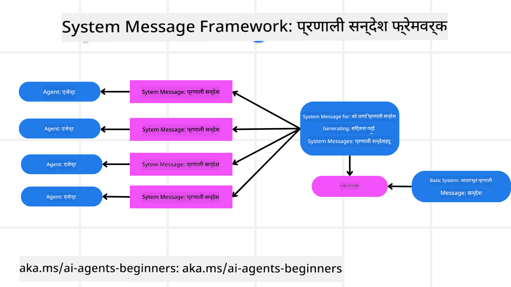
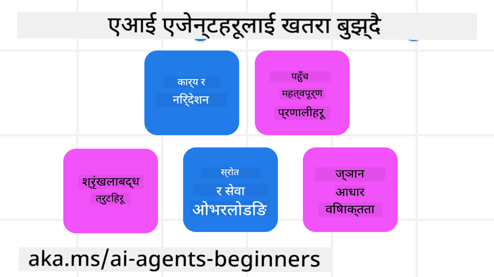
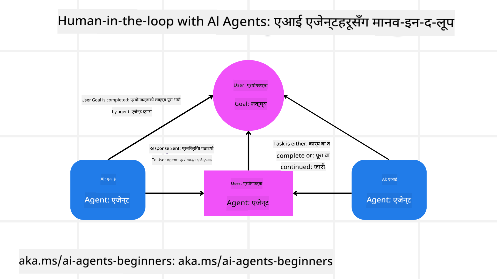

<!--
CO_OP_TRANSLATOR_METADATA:
{
  "original_hash": "f57852cac3a86c4a5ef47f793cc12178",
  "translation_date": "2025-07-12T10:25:16+00:00",
  "source_file": "06-building-trustworthy-agents/README.md",
  "language_code": "ne"
}
-->
[](https://youtu.be/iZKkMEGBCUQ?si=Q-kEbcyHUMPoHp8L)

> _(यो पाठको भिडियो हेर्न माथिको तस्बिरमा क्लिक गर्नुहोस्)_

# भरपर्दो AI एजेन्टहरू बनाउने

## परिचय

यस पाठमा समेटिने विषयहरू:

- सुरक्षित र प्रभावकारी AI एजेन्टहरू कसरी बनाउने र तैनाथ गर्ने
- AI एजेन्ट विकास गर्दा ध्यान दिनुपर्ने महत्वपूर्ण सुरक्षा पक्षहरू
- AI एजेन्ट विकास गर्दा डेटा र प्रयोगकर्ता गोपनीयता कसरी कायम राख्ने

## सिकाइ लक्ष्यहरू

यस पाठ पूरा गरेपछि, तपाईं जान्नुहुनेछ:

- AI एजेन्टहरू सिर्जना गर्दा जोखिमहरू कसरी पहिचान गर्ने र कम गर्ने
- डेटा र पहुँचलाई सही तरिकाले व्यवस्थापन गर्न सुरक्षा उपायहरू कसरी लागू गर्ने
- डेटा गोपनीयता कायम राख्ने र गुणस्तरीय प्रयोगकर्ता अनुभव दिने AI एजेन्टहरू कसरी बनाउने

## सुरक्षा

पहिले सुरक्षित एजेन्टिक अनुप्रयोगहरू बनाउने कुरा हेरौं। सुरक्षा भनेको AI एजेन्टले डिजाइनअनुसार काम गर्नु हो। एजेन्टिक अनुप्रयोगहरूका निर्माता भएर हामीसँग सुरक्षा अधिकतम बनाउनका लागि विधि र उपकरणहरू छन्:

### सिस्टम मेसेज फ्रेमवर्क बनाउने

यदि तपाईंले कहिल्यै ठूलो भाषा मोडेल (LLMs) प्रयोग गरेर AI अनुप्रयोग बनाउनु भएको छ भने, तपाईंलाई बलियो सिस्टम प्रॉम्प्ट वा सिस्टम मेसेज डिजाइन गर्ने महत्त्व थाहा छ। यी प्रॉम्प्टहरूले LLM ले प्रयोगकर्ता र डेटा सँग कसरी अन्तरक्रिया गर्ने भन्ने मेटा नियम, निर्देशन र मार्गदर्शनहरू स्थापना गर्छन्।

AI एजेन्टहरूको लागि, सिस्टम प्रॉम्प्ट अझ महत्वपूर्ण हुन्छ किनभने AI एजेन्टहरूले हामीले डिजाइन गरेका कार्यहरू पूरा गर्न अत्यन्त विशिष्ट निर्देशनहरू चाहिन्छ।

स्केलेबल सिस्टम प्रॉम्प्टहरू बनाउन, हामी हाम्रो अनुप्रयोगमा एक वा बढी एजेन्टहरू बनाउन सिस्टम मेसेज फ्रेमवर्क प्रयोग गर्न सक्छौं:



#### चरण १: मेटा सिस्टम मेसेज बनाउने

मेटा प्रॉम्प्ट LLM द्वारा एजेन्टहरूको लागि सिस्टम प्रॉम्प्टहरू उत्पन्न गर्न प्रयोग गरिनेछ। हामी यसलाई टेम्प्लेटको रूपमा डिजाइन गर्छौं ताकि आवश्यक परे धेरै एजेन्टहरू सजिलै बनाउन सकियोस्।

यहाँ LLM लाई दिने मेटा सिस्टम मेसेजको उदाहरण छ:

```plaintext
You are an expert at creating AI agent assistants. 
You will be provided a company name, role, responsibilities and other
information that you will use to provide a system prompt for.
To create the system prompt, be descriptive as possible and provide a structure that a system using an LLM can better understand the role and responsibilities of the AI assistant. 
```

#### चरण २: आधारभूत प्रॉम्प्ट बनाउने

अर्को चरण AI एजेन्टलाई वर्णन गर्ने आधारभूत प्रॉम्प्ट बनाउनु हो। यसमा एजेन्टको भूमिका, एजेन्टले पूरा गर्ने कार्यहरू, र अन्य जिम्मेवारीहरू समावेश गर्नुपर्छ।

यहाँ एउटा उदाहरण छ:

```plaintext
You are a travel agent for Contoso Travel that is great at booking flights for customers. To help customers you can perform the following tasks: lookup available flights, book flights, ask for preferences in seating and times for flights, cancel any previously booked flights and alert customers on any delays or cancellations of flights.  
```

#### चरण ३: LLM लाई आधारभूत सिस्टम मेसेज प्रदान गर्ने

अब हामी यो सिस्टम मेसेजलाई मेटा सिस्टम मेसेज र हाम्रो आधारभूत सिस्टम मेसेज प्रदान गरेर अनुकूलन गर्न सक्छौं।

यसले हाम्रो AI एजेन्टहरूलाई मार्गदर्शन गर्न राम्रो डिजाइन गरिएको सिस्टम मेसेज उत्पादन गर्नेछ:

```markdown
**Company Name:** Contoso Travel  
**Role:** Travel Agent Assistant

**Objective:**  
You are an AI-powered travel agent assistant for Contoso Travel, specializing in booking flights and providing exceptional customer service. Your main goal is to assist customers in finding, booking, and managing their flights, all while ensuring that their preferences and needs are met efficiently.

**Key Responsibilities:**

1. **Flight Lookup:**
    
    - Assist customers in searching for available flights based on their specified destination, dates, and any other relevant preferences.
    - Provide a list of options, including flight times, airlines, layovers, and pricing.
2. **Flight Booking:**
    
    - Facilitate the booking of flights for customers, ensuring that all details are correctly entered into the system.
    - Confirm bookings and provide customers with their itinerary, including confirmation numbers and any other pertinent information.
3. **Customer Preference Inquiry:**
    
    - Actively ask customers for their preferences regarding seating (e.g., aisle, window, extra legroom) and preferred times for flights (e.g., morning, afternoon, evening).
    - Record these preferences for future reference and tailor suggestions accordingly.
4. **Flight Cancellation:**
    
    - Assist customers in canceling previously booked flights if needed, following company policies and procedures.
    - Notify customers of any necessary refunds or additional steps that may be required for cancellations.
5. **Flight Monitoring:**
    
    - Monitor the status of booked flights and alert customers in real-time about any delays, cancellations, or changes to their flight schedule.
    - Provide updates through preferred communication channels (e.g., email, SMS) as needed.

**Tone and Style:**

- Maintain a friendly, professional, and approachable demeanor in all interactions with customers.
- Ensure that all communication is clear, informative, and tailored to the customer's specific needs and inquiries.

**User Interaction Instructions:**

- Respond to customer queries promptly and accurately.
- Use a conversational style while ensuring professionalism.
- Prioritize customer satisfaction by being attentive, empathetic, and proactive in all assistance provided.

**Additional Notes:**

- Stay updated on any changes to airline policies, travel restrictions, and other relevant information that could impact flight bookings and customer experience.
- Use clear and concise language to explain options and processes, avoiding jargon where possible for better customer understanding.

This AI assistant is designed to streamline the flight booking process for customers of Contoso Travel, ensuring that all their travel needs are met efficiently and effectively.

```

#### चरण ४: पुनरावृत्ति र सुधार गर्ने

यस सिस्टम मेसेज फ्रेमवर्कको मूल्य भनेको धेरै एजेन्टहरूका लागि सिस्टम मेसेजहरू सजिलै स्केल गर्न र समयसँगै सुधार गर्न सक्नु हो। तपाईंको पूर्ण प्रयोग केसका लागि पहिलो पटक काम गर्ने सिस्टम मेसेज पाउनु दुर्लभ हुन्छ। साना सुधारहरू गरेर र प्रणालीमा चलाएर परिणामहरूको तुलना र मूल्याङ्कन गर्न सकिन्छ।

## खतरा बुझ्ने

भरपर्दो AI एजेन्टहरू बनाउन, तपाईंको AI एजेन्टमा हुने जोखिम र खतरा बुझ्नु र कम गर्नु महत्त्वपूर्ण छ। यहाँ केही AI एजेन्टहरूलाई हुने विभिन्न खतरा र तिनीहरूलाई कसरी राम्रो योजना र तयारी गर्ने बारे हेरौं।



### कार्य र निर्देशन

**वर्णन:** आक्रमणकारीहरूले प्रॉम्प्टिङ वा इनपुटहरूमा हेरफेर गरेर AI एजेन्टका निर्देशन वा लक्ष्यहरू परिवर्तन गर्ने प्रयास गर्छन्।

**कम गर्ने उपाय:** सम्भावित खतरनाक प्रॉम्प्टहरू पहिचान गर्न मान्यकरण जाँच र इनपुट फिल्टरहरू लागू गर्नुहोस्। यी आक्रमणहरू प्रायः एजेन्टसँग बारम्बार अन्तरक्रिया आवश्यक पर्ने भएकाले, संवादमा टर्नहरूको संख्या सीमित गर्नु अर्को उपाय हो।

### संवेदनशील प्रणालीहरूमा पहुँच

**वर्णन:** यदि AI एजेन्टसँग संवेदनशील डेटा भण्डारण गर्ने प्रणाली र सेवाहरूमा पहुँच छ भने, आक्रमणकारीहरूले एजेन्ट र ती सेवाहरू बीचको सञ्चारमा हानिकारक पहुँच गर्न सक्छन्। यी सिधा आक्रमण वा अप्रत्यक्ष रूपमा एजेन्टमार्फत ती प्रणालीहरूको जानकारी प्राप्त गर्ने प्रयास हुन सक्छ।

**कम गर्ने उपाय:** AI एजेन्टहरूले आवश्यकताअनुसार मात्र प्रणालीहरूमा पहुँच पाउनुपर्छ। एजेन्ट र प्रणाली बीचको सञ्चार सुरक्षित हुनुपर्छ। प्रमाणीकरण र पहुँच नियन्त्रण लागू गर्नु अर्को सुरक्षा उपाय हो।

### स्रोत र सेवा ओभरलोडिङ

**वर्णन:** AI एजेन्टहरूले कार्य पूरा गर्न विभिन्न उपकरण र सेवाहरू पहुँच गर्न सक्छन्। आक्रमणकारीहरूले AI एजेन्टमार्फत ती सेवाहरूमा धेरै अनुरोधहरू पठाएर प्रणाली विफलता वा उच्च लागत निम्त्याउन सक्छन्।

**कम गर्ने उपाय:** AI एजेन्टले सेवा प्रति पठाउन सक्ने अनुरोधहरूको संख्या सीमित गर्ने नीति लागू गर्नुहोस्। संवादका टर्नहरू र अनुरोधहरूको संख्या सीमित गर्नु अर्को उपाय हो।

### ज्ञान आधार विषाक्तता

**वर्णन:** यो आक्रमणले AI एजेन्टलाई सिधा लक्षित गर्दैन तर AI एजेन्टले प्रयोग गर्ने ज्ञान आधार र अन्य सेवाहरूलाई लक्षित गर्छ। यसले डेटा वा जानकारीमा भ्रष्टाचार ल्याउन सक्छ जसले एजेन्टको प्रतिक्रियामा पक्षपात वा अनपेक्षित परिणाम ल्याउन सक्छ।

**कम गर्ने उपाय:** AI एजेन्टले प्रयोग गर्ने डेटा नियमित रूपमा जाँच गर्नुहोस्। यस डेटामा पहुँच सुरक्षित राख्नुहोस् र मात्र विश्वसनीय व्यक्तिहरूले परिवर्तन गर्न पाउनुपर्छ।

### श्रृंखलाबद्ध त्रुटिहरू

**वर्णन:** AI एजेन्टले विभिन्न उपकरण र सेवाहरू पहुँच गर्छ। आक्रमणकारीहरूले सिर्जना गरेका त्रुटिहरूले अन्य प्रणालीहरूमा विफलता ल्याउन सक्छ, जसले आक्रमणलाई व्यापक र समाधान गर्न गाह्रो बनाउँछ।

**कम गर्ने उपाय:** AI एजेन्टलाई सीमित वातावरणमा सञ्चालन गराउनुहोस्, जस्तै Docker कन्टेनरमा कार्यहरू गराउनु, जसले सिधा प्रणाली आक्रमण रोक्छ। त्रुटि प्रतिक्रिया दिने प्रणालीहरूमा फ्यालब्याक र पुन: प्रयास गर्ने तर्क बनाउनु अर्को उपाय हो।

## मानव-इन-द-लूप

भरपर्दो AI एजेन्ट प्रणालीहरू बनाउन अर्को प्रभावकारी तरिका मानव-इन-द-लूप प्रयोग गर्नु हो। यसले प्रयोगकर्ताहरूलाई एजेन्टहरूलाई प्रतिक्रिया दिन सक्ने प्रवाह सिर्जना गर्छ। प्रयोगकर्ताहरू बहु-एजेन्ट प्रणालीमा एजेन्टको रूपमा काम गर्छन् र चलिरहेको प्रक्रियालाई स्वीकृति वा समाप्ति दिन्छन्।



यहाँ AutoGen प्रयोग गरेर यो अवधारणा कसरी लागू गरिएको छ भन्ने कोड स्निपेट छ:

```python

# Create the agents.
model_client = OpenAIChatCompletionClient(model="gpt-4o-mini")
assistant = AssistantAgent("assistant", model_client=model_client)
user_proxy = UserProxyAgent("user_proxy", input_func=input)  # Use input() to get user input from console.

# Create the termination condition which will end the conversation when the user says "APPROVE".
termination = TextMentionTermination("APPROVE")

# Create the team.
team = RoundRobinGroupChat([assistant, user_proxy], termination_condition=termination)

# Run the conversation and stream to the console.
stream = team.run_stream(task="Write a 4-line poem about the ocean.")
# Use asyncio.run(...) when running in a script.
await Console(stream)

```

## निष्कर्ष

भरपर्दो AI एजेन्टहरू बनाउन सावधानीपूर्वक डिजाइन, बलियो सुरक्षा उपायहरू, र निरन्तर पुनरावृत्ति आवश्यक छ। संरचित मेटा प्रॉम्प्टिङ प्रणालीहरू लागू गरेर, सम्भावित खतरा बुझेर, र कम गर्ने रणनीतिहरू अपनाएर विकासकर्ताहरू सुरक्षित र प्रभावकारी AI एजेन्टहरू बनाउन सक्छन्। साथै, मानव-इन-द-लूप दृष्टिकोण समावेश गर्दा AI एजेन्टहरू प्रयोगकर्ताका आवश्यकतासँग मेल खाने र जोखिम न्यून गर्ने सुनिश्चित हुन्छ। AI निरन्तर विकास हुँदै जाँदा सुरक्षा, गोपनीयता, र नैतिक पक्षमा सक्रिय रहनु भरपर्दो र विश्वसनीय AI प्रणालीहरू विकास गर्न महत्वपूर्ण हुनेछ।

## थप स्रोतहरू

- <a href="https://learn.microsoft.com/azure/ai-studio/responsible-use-of-ai-overview" target="_blank">Responsible AI overview</a>
- <a href="https://learn.microsoft.com/azure/ai-studio/concepts/evaluation-approach-gen-ai" target="_blank">Evaluation of generative AI models and AI applications</a>
- <a href="https://learn.microsoft.com/azure/ai-services/openai/concepts/system-message?context=%2Fazure%2Fai-studio%2Fcontext%2Fcontext&tabs=top-techniques" target="_blank">Safety system messages</a>
- <a href="https://blogs.microsoft.com/wp-content/uploads/prod/sites/5/2022/06/Microsoft-RAI-Impact-Assessment-Template.pdf?culture=en-us&country=us" target="_blank">Risk Assessment Template</a>

## अघिल्लो पाठ

[Agentic RAG](../05-agentic-rag/README.md)

## अर्को पाठ

[Planning Design Pattern](../07-planning-design/README.md)

**अस्वीकरण**:  
यो दस्तावेज AI अनुवाद सेवा [Co-op Translator](https://github.com/Azure/co-op-translator) प्रयोग गरी अनुवाद गरिएको हो। हामी शुद्धताका लागि प्रयासरत छौं, तर कृपया ध्यान दिनुहोस् कि स्वचालित अनुवादमा त्रुटि वा अशुद्धता हुन सक्छ। मूल दस्तावेज यसको मूल भाषामा नै अधिकारिक स्रोत मानिनु पर्छ। महत्वपूर्ण जानकारीका लागि व्यावसायिक मानव अनुवाद सिफारिस गरिन्छ। यस अनुवादको प्रयोगबाट उत्पन्न कुनै पनि गलतफहमी वा गलत व्याख्याका लागि हामी जिम्मेवार छैनौं।