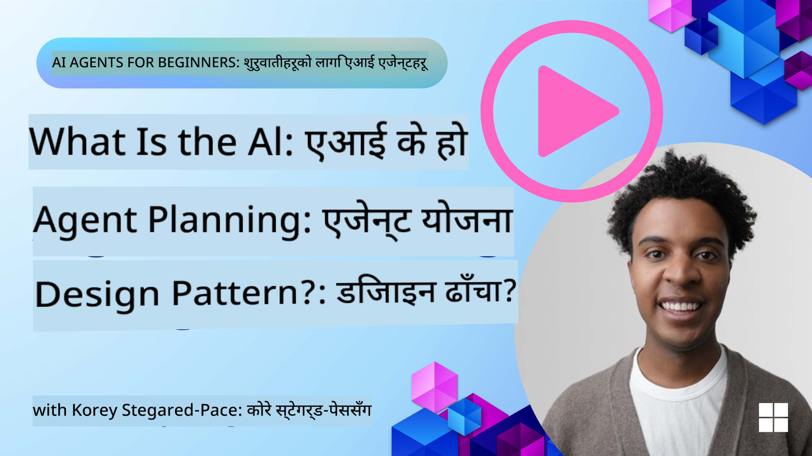
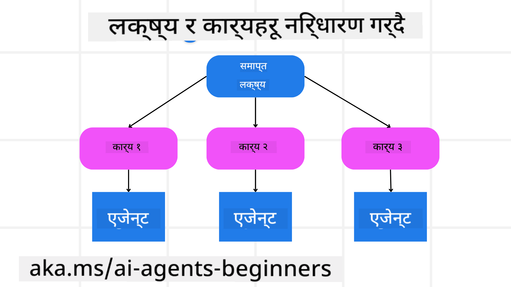

<!--
CO_OP_TRANSLATOR_METADATA:
{
  "original_hash": "a28d30590704ea13b6a08d4793cf9c2b",
  "translation_date": "2025-08-29T10:23:14+00:00",
  "source_file": "07-planning-design/README.md",
  "language_code": "ne"
}
-->
[](https://youtu.be/kPfJ2BrBCMY?si=9pYpPXp0sSbK91Dr)

> _(यो पाठको भिडियो हेर्न माथिको तस्बिरमा क्लिक गर्नुहोस्)_

# योजना डिजाइन

## परिचय

यस पाठले समेट्नेछ:

* स्पष्ट समग्र लक्ष्य परिभाषित गर्ने र जटिल कार्यलाई व्यवस्थापन गर्न मिल्ने कार्यहरूमा विभाजन गर्ने।
* संरचित आउटपुट प्रयोग गरेर भरपर्दो र मेसिनले पढ्न मिल्ने प्रतिक्रिया सुनिश्चित गर्ने।
* गतिशील कार्यहरू र अप्रत्याशित इनपुटहरूलाई व्यवस्थापन गर्न घटनाचालित दृष्टिकोण लागू गर्ने।

## सिकाइका लक्ष्यहरू

यो पाठ पूरा गरेपछि, तपाईंले निम्न कुराहरूको समझ पाउनुहुनेछ:

* AI एजेन्टका लागि समग्र लक्ष्य पहिचान र सेट गर्ने, जसले सुनिश्चित गर्दछ कि के हासिल गर्नुपर्ने हो स्पष्ट छ।
* जटिल कार्यलाई व्यवस्थापन गर्न मिल्ने उपकार्यहरूमा विभाजन गर्ने र तिनीहरूलाई तार्किक क्रममा व्यवस्थित गर्ने।
* एजेन्टहरूलाई सही उपकरणहरू (जस्तै, खोज उपकरणहरू वा डेटा एनालिटिक्स उपकरणहरू) प्रदान गर्ने, तिनीहरू कहिले र कसरी प्रयोग गर्ने निर्णय गर्ने, र उत्पन्न हुने अप्रत्याशित परिस्थितिहरूलाई व्यवस्थापन गर्ने।
* उपकार्यहरूको परिणाम मूल्याङ्कन गर्ने, प्रदर्शन मापन गर्ने, र अन्तिम आउटपुट सुधार गर्न कार्यहरूमा पुनरावृत्ति गर्ने।

## समग्र लक्ष्य परिभाषित गर्ने र कार्यलाई विभाजन गर्ने



धेरैजसो वास्तविक संसारका कार्यहरूलाई एकै चरणमा समाधान गर्न धेरै जटिल हुन्छ। AI एजेन्टलाई यसको योजना र कार्यहरूलाई मार्गदर्शन गर्न एक संक्षिप्त उद्देश्य आवश्यक हुन्छ। उदाहरणका लागि, यो लक्ष्यलाई विचार गर्नुहोस्:

    "३-दिनको यात्रा योजना तयार गर्नुहोस्।"

यो भन्न सजिलो भए पनि, अझै परिष्कृत गर्न आवश्यक छ। लक्ष्य जति स्पष्ट हुन्छ, एजेन्ट (र कुनै पनि मानव सहयोगी)ले सही परिणाम प्राप्त गर्न ध्यान केन्द्रित गर्न सक्छ, जस्तै उडान विकल्पहरू, होटल सिफारिसहरू, र गतिविधि सुझावहरू सहितको विस्तृत यात्रा योजना बनाउने।

### कार्य विभाजन

ठूला वा जटिल कार्यहरूलाई साना, लक्ष्य-उन्मुख उपकार्यहरूमा विभाजन गर्दा व्यवस्थापन गर्न सजिलो हुन्छ। 
यात्रा योजनाको उदाहरणका लागि, तपाईंले लक्ष्यलाई निम्नमा विभाजन गर्न सक्नुहुन्छ:

* उडान बुकिङ
* होटल बुकिङ
* कार भाडा
* व्यक्तिगतकरण

प्रत्येक उपकार्यलाई त्यसका लागि समर्पित एजेन्टहरू वा प्रक्रियाहरूले समाधान गर्न सक्छ। एउटा एजेन्टले सबैभन्दा राम्रो उडान डिलहरू खोज्नमा विशेषज्ञता राख्न सक्छ, अर्कोले होटल बुकिङमा ध्यान केन्द्रित गर्न सक्छ, र यस्तै। एक समन्वय गर्ने वा "डाउनस्ट्रीम" एजेन्टले यी परिणामहरूलाई अन्तिम प्रयोगकर्ताका लागि एक सुसंगत यात्रा योजनामा संकलन गर्न सक्छ।

यो मोड्युलर दृष्टिकोणले क्रमिक सुधारहरूलाई पनि अनुमति दिन्छ। उदाहरणका लागि, तपाईंले खाना सिफारिसहरू वा स्थानीय गतिविधि सुझावहरूको लागि विशेष एजेन्टहरू थप्न सक्नुहुन्छ र समयसँगै यात्रा योजनालाई परिष्कृत गर्न सक्नुहुन्छ।

### संरचित आउटपुट

ठूला भाषा मोडेलहरू (LLMs)ले संरचित आउटपुट (जस्तै JSON) उत्पन्न गर्न सक्छन्, जुन डाउनस्ट्रीम एजेन्टहरू वा सेवाहरूले पार्स र प्रक्रिया गर्न सजिलो हुन्छ। यो विशेष गरी बहु-एजेन्ट सन्दर्भमा उपयोगी हुन्छ, जहाँ हामीले योजना आउटपुट प्राप्त गरेपछि यी कार्यहरूलाई कार्यान्वयन गर्न सक्छौं। 

द्रुत अवलोकनका लागि निम्न Python कोड स्निपेटले एउटा साधारण योजना एजेन्टले कसरी लक्ष्यलाई उपकार्यहरूमा विभाजन गर्छ र संरचित योजना उत्पन्न गर्छ भन्ने देखाउँछ:

```python
from pydantic import BaseModel
from enum import Enum
from typing import List, Optional, Union
import json
import os
from typing import Optional
from pprint import pprint
from autogen_core.models import UserMessage, SystemMessage, AssistantMessage
from autogen_ext.models.azure import AzureAIChatCompletionClient
from azure.core.credentials import AzureKeyCredential

class AgentEnum(str, Enum):
    FlightBooking = "flight_booking"
    HotelBooking = "hotel_booking"
    CarRental = "car_rental"
    ActivitiesBooking = "activities_booking"
    DestinationInfo = "destination_info"
    DefaultAgent = "default_agent"
    GroupChatManager = "group_chat_manager"

# Travel SubTask Model
class TravelSubTask(BaseModel):
    task_details: str
    assigned_agent: AgentEnum  # we want to assign the task to the agent

class TravelPlan(BaseModel):
    main_task: str
    subtasks: List[TravelSubTask]
    is_greeting: bool

client = AzureAIChatCompletionClient(
    model="gpt-4o-mini",
    endpoint="https://models.inference.ai.azure.com",
    # To authenticate with the model you will need to generate a personal access token (PAT) in your GitHub settings.
    # Create your PAT token by following instructions here: https://docs.github.com/en/authentication/keeping-your-account-and-data-secure/managing-your-personal-access-tokens
    credential=AzureKeyCredential(os.environ["GITHUB_TOKEN"]),
    model_info={
        "json_output": False,
        "function_calling": True,
        "vision": True,
        "family": "unknown",
    },
)

# Define the user message
messages = [
    SystemMessage(content="""You are an planner agent.
    Your job is to decide which agents to run based on the user's request.
                      Provide your response in JSON format with the following structure:
{'main_task': 'Plan a family trip from Singapore to Melbourne.',
 'subtasks': [{'assigned_agent': 'flight_booking',
               'task_details': 'Book round-trip flights from Singapore to '
                               'Melbourne.'}
    Below are the available agents specialised in different tasks:
    - FlightBooking: For booking flights and providing flight information
    - HotelBooking: For booking hotels and providing hotel information
    - CarRental: For booking cars and providing car rental information
    - ActivitiesBooking: For booking activities and providing activity information
    - DestinationInfo: For providing information about destinations
    - DefaultAgent: For handling general requests""", source="system"),
    UserMessage(
        content="Create a travel plan for a family of 2 kids from Singapore to Melboune", source="user"),
]

response = await client.create(messages=messages, extra_create_args={"response_format": 'json_object'})

response_content: Optional[str] = response.content if isinstance(
    response.content, str) else None
if response_content is None:
    raise ValueError("Response content is not a valid JSON string" )

pprint(json.loads(response_content))

# # Ensure the response content is a valid JSON string before loading it
# response_content: Optional[str] = response.content if isinstance(
#     response.content, str) else None
# if response_content is None:
#     raise ValueError("Response content is not a valid JSON string")

# # Print the response content after loading it as JSON
# pprint(json.loads(response_content))

# Validate the response content with the MathReasoning model
# TravelPlan.model_validate(json.loads(response_content))
```

### बहु-एजेन्ट समन्वयसहितको योजना एजेन्ट

यस उदाहरणमा, एउटा Semantic Router Agent ले प्रयोगकर्ताको अनुरोध (जस्तै, "मेरो यात्राको लागि होटल योजना चाहिन्छ।") प्राप्त गर्छ।

प्लानरले त्यसपछि:

* होटल योजना प्राप्त गर्छ: प्लानरले प्रयोगकर्ताको सन्देश लिन्छ र, प्रणाली प्रम्प्ट (उपलब्ध एजेन्ट विवरणहरू सहित) को आधारमा, संरचित यात्रा योजना उत्पन्न गर्छ।
* एजेन्टहरू र तिनका उपकरणहरूको सूची बनाउँछ: एजेन्ट रजिस्ट्रीले एजेन्टहरूको सूची (जस्तै, उडान, होटल, कार भाडा, र गतिविधिहरूका लागि) र तिनले प्रस्ताव गर्ने कार्यहरू वा उपकरणहरू समावेश गर्दछ।
* योजना सम्बन्धित एजेन्टहरूलाई पठाउँछ: उपकार्यहरूको संख्याको आधारमा, प्लानरले सन्देशलाई एकल-कार्य परिदृश्यहरूको लागि समर्पित एजेन्टलाई सिधै पठाउँछ वा बहु-एजेन्ट सहयोगका लागि समूह च्याट प्रबन्धकमार्फत समन्वय गर्छ।
* परिणामलाई संक्षेपमा प्रस्तुत गर्छ: अन्ततः, प्लानरले उत्पन्न योजनालाई स्पष्टताका लागि संक्षेपमा प्रस्तुत गर्छ। 

निम्न Python कोड नमूनाले यी चरणहरूलाई चित्रण गर्छ:

```python

from pydantic import BaseModel

from enum import Enum
from typing import List, Optional, Union

class AgentEnum(str, Enum):
    FlightBooking = "flight_booking"
    HotelBooking = "hotel_booking"
    CarRental = "car_rental"
    ActivitiesBooking = "activities_booking"
    DestinationInfo = "destination_info"
    DefaultAgent = "default_agent"
    GroupChatManager = "group_chat_manager"

# Travel SubTask Model

class TravelSubTask(BaseModel):
    task_details: str
    assigned_agent: AgentEnum # we want to assign the task to the agent

class TravelPlan(BaseModel):
    main_task: str
    subtasks: List[TravelSubTask]
    is_greeting: bool
import json
import os
from typing import Optional

from autogen_core.models import UserMessage, SystemMessage, AssistantMessage
from autogen_ext.models.openai import AzureOpenAIChatCompletionClient

# Create the client with type-checked environment variables

client = AzureOpenAIChatCompletionClient(
    azure_deployment=os.getenv("AZURE_OPENAI_DEPLOYMENT_NAME"),
    model=os.getenv("AZURE_OPENAI_DEPLOYMENT_NAME"),
    api_version=os.getenv("AZURE_OPENAI_API_VERSION"),
    azure_endpoint=os.getenv("AZURE_OPENAI_ENDPOINT"),
    api_key=os.getenv("AZURE_OPENAI_API_KEY"),
)

from pprint import pprint

# Define the user message

messages = [
    SystemMessage(content="""You are an planner agent.
    Your job is to decide which agents to run based on the user's request.
    Below are the available agents specialized in different tasks:
    - FlightBooking: For booking flights and providing flight information
    - HotelBooking: For booking hotels and providing hotel information
    - CarRental: For booking cars and providing car rental information
    - ActivitiesBooking: For booking activities and providing activity information
    - DestinationInfo: For providing information about destinations
    - DefaultAgent: For handling general requests""", source="system"),
    UserMessage(content="Create a travel plan for a family of 2 kids from Singapore to Melbourne", source="user"),
]

response = await client.create(messages=messages, extra_create_args={"response_format": TravelPlan})

# Ensure the response content is a valid JSON string before loading it

response_content: Optional[str] = response.content if isinstance(response.content, str) else None
if response_content is None:
    raise ValueError("Response content is not a valid JSON string")

# Print the response content after loading it as JSON

pprint(json.loads(response_content))
```

अघिल्लो कोडबाट प्राप्त आउटपुट निम्नानुसार हुन्छ, र तपाईंले यो संरचित आउटपुटलाई `assigned_agent` मा रुट गर्न र अन्तिम प्रयोगकर्ताका लागि यात्रा योजनालाई संक्षेपमा प्रस्तुत गर्न प्रयोग गर्न सक्नुहुन्छ।

```json
{
    "is_greeting": "False",
    "main_task": "Plan a family trip from Singapore to Melbourne.",
    "subtasks": [
        {
            "assigned_agent": "flight_booking",
            "task_details": "Book round-trip flights from Singapore to Melbourne."
        },
        {
            "assigned_agent": "hotel_booking",
            "task_details": "Find family-friendly hotels in Melbourne."
        },
        {
            "assigned_agent": "car_rental",
            "task_details": "Arrange a car rental suitable for a family of four in Melbourne."
        },
        {
            "assigned_agent": "activities_booking",
            "task_details": "List family-friendly activities in Melbourne."
        },
        {
            "assigned_agent": "destination_info",
            "task_details": "Provide information about Melbourne as a travel destination."
        }
    ]
}
```

अघिल्लो कोड नमूनासहितको उदाहरण नोटबुक [यहाँ](07-autogen.ipynb) उपलब्ध छ।

### पुनरावृत्त योजना

केही कार्यहरूलाई अगाडि-पछाडि वा पुनः योजना आवश्यक पर्छ, जहाँ एउटा उपकार्यको परिणामले अर्कोमा प्रभाव पार्छ। उदाहरणका लागि, यदि एजेन्टले उडान बुकिङ गर्दा अप्रत्याशित डेटा ढाँचा पत्ता लगाउँछ भने, यसले होटल बुकिङ अघि आफ्नो रणनीति अनुकूलन गर्न आवश्यक हुन सक्छ।

थप रूपमा, प्रयोगकर्ताको प्रतिक्रिया (जस्तै, कुनै व्यक्तिले पहिलेको उडानलाई प्राथमिकता दिन्छ भन्ने निर्णय गर्नु) आंशिक पुनः योजनालाई ट्रिगर गर्न सक्छ। यो गतिशील, पुनरावृत्त दृष्टिकोणले सुनिश्चित गर्दछ कि अन्तिम समाधान वास्तविक संसारका बाधाहरू र विकसित प्रयोगकर्ता प्राथमिकताहरूको साथ मेल खान्छ।

उदाहरणका लागि कोड:

```python
from autogen_core.models import UserMessage, SystemMessage, AssistantMessage
#.. same as previous code and pass on the user history, current plan
messages = [
    SystemMessage(content="""You are a planner agent to optimize the
    Your job is to decide which agents to run based on the user's request.
    Below are the available agents specialized in different tasks:
    - FlightBooking: For booking flights and providing flight information
    - HotelBooking: For booking hotels and providing hotel information
    - CarRental: For booking cars and providing car rental information
    - ActivitiesBooking: For booking activities and providing activity information
    - DestinationInfo: For providing information about destinations
    - DefaultAgent: For handling general requests""", source="system"),
    UserMessage(content="Create a travel plan for a family of 2 kids from Singapore to Melbourne", source="user"),
    AssistantMessage(content=f"Previous travel plan - {TravelPlan}", source="assistant")
]
# .. re-plan and send the tasks to respective agents
```

जटिल कार्यहरूको लागि थप व्यापक योजनाका लागि Magnetic One अवश्य हेर्नुहोस्।

## संक्षेप

यस लेखमा हामीले कसरी एउटा योजनाकार बनाउन सकिन्छ भन्ने उदाहरण हेर्यौं, जसले परिभाषित गरिएका उपलब्ध एजेन्टहरूलाई गतिशील रूपमा चयन गर्न सक्छ। योजनाकारको आउटपुटले कार्यहरूलाई विभाजन गर्छ र एजेन्टहरूलाई कार्यान्वयनका लागि जिम्मेवारी दिन्छ। यो मानिन्छ कि एजेन्टहरूले कार्य सम्पन्न गर्न आवश्यक कार्यहरू/उपकरणहरूमा पहुँच राख्छन्। एजेन्टहरूका अतिरिक्त, तपाईंले परावर्तन, संक्षेपकर्ता, र राउन्ड रोबिन च्याट जस्ता अन्य ढाँचाहरू समावेश गरेर थप अनुकूलन गर्न सक्नुहुन्छ।

## थप स्रोतहरू

* AutoGen Magnetic One - जटिल कार्यहरू समाधान गर्नका लागि एक सामान्य बहु-एजेन्ट प्रणाली हो र यसले धेरै चुनौतीपूर्ण एजेन्टिक बेंचमार्कहरूमा प्रभावशाली परिणामहरू प्राप्त गरेको छ। सन्दर्भ:

यस कार्यान्वयनमा, समन्वयकर्ताले कार्य-विशिष्ट योजना बनाउँछ र यी कार्यहरूलाई उपलब्ध एजेन्टहरूलाई सुम्पन्छ। योजनाका अतिरिक्त, समन्वयकर्ताले कार्यको प्रगतिलाई ट्र्याक गर्न र आवश्यक परेमा पुनः योजना बनाउन ट्र्याकिङ संयन्त्र पनि प्रयोग गर्दछ।

### योजना डिजाइन ढाँचाबारे थप प्रश्नहरू छन्?

[Azure AI Foundry Discord](https://aka.ms/ai-agents/discord) मा सामेल हुनुहोस्, अन्य सिक्नेहरूसँग भेट्नुहोस्, कार्यालय समयमा सहभागी हुनुहोस्, र आफ्नो AI एजेन्टसम्बन्धी प्रश्नहरूको उत्तर पाउनुहोस्।

## अघिल्लो पाठ

[विश्वसनीय AI एजेन्टहरू निर्माण गर्दै](../06-building-trustworthy-agents/README.md)

## अर्को पाठ

[बहु-एजेन्ट डिजाइन ढाँचा](../08-multi-agent/README.md)

---

**अस्वीकरण**:  
यो दस्तावेज़ AI अनुवाद सेवा [Co-op Translator](https://github.com/Azure/co-op-translator) प्रयोग गरेर अनुवाद गरिएको हो। हामी शुद्धताको लागि प्रयास गर्छौं, तर कृपया ध्यान दिनुहोस् कि स्वचालित अनुवादमा त्रुटिहरू वा अशुद्धताहरू हुन सक्छ। यसको मूल भाषा मा रहेको मूल दस्तावेज़लाई आधिकारिक स्रोत मानिनुपर्छ। महत्वपूर्ण जानकारीको लागि, व्यावसायिक मानव अनुवाद सिफारिस गरिन्छ। यस अनुवादको प्रयोगबाट उत्पन्न हुने कुनै पनि गलतफहमी वा गलत व्याख्याको लागि हामी जिम्मेवार हुने छैनौं।