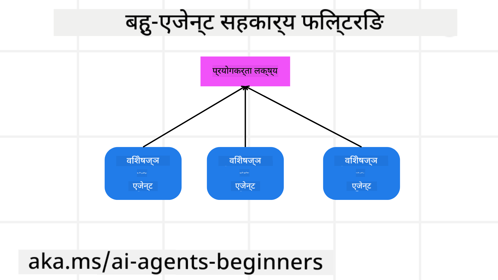

<!--
CO_OP_TRANSLATOR_METADATA:
{
  "original_hash": "c692a8975d7d5b99575a553de1c5e8a7",
  "translation_date": "2025-07-12T11:03:55+00:00",
  "source_file": "08-multi-agent/README.md",
  "language_code": "ne"
}
-->

> _(उपरोक्त तस्बिरमा क्लिक गरेर यस पाठको भिडियो हेर्नुहोस्)_

# बहु-एजेन्ट डिजाइन ढाँचा

जब तपाईं बहु-एजेन्टहरू समावेश गर्ने कुनै परियोजनामा काम गर्न थाल्नुहुन्छ, तब तपाईंले बहु-एजेन्ट डिजाइन ढाँचाको बारेमा विचार गर्नुपर्ने हुन्छ। तर कहिले बहु-एजेन्टमा स्विच गर्ने र यसको फाइदाहरू के हुन् भन्ने कुरा तुरुन्तै स्पष्ट नहुन सक्छ।

## परिचय

यस पाठमा, हामी निम्न प्रश्नहरूको उत्तर खोज्दैछौं:

- कुन परिस्थितिहरूमा बहु-एजेन्टहरू लागू गर्न सकिन्छ?
- एकल एजेन्टले धेरै काम गर्ने भन्दा बहु-एजेन्ट प्रयोग गर्दा के फाइदा हुन्छ?
- बहु-एजेन्ट डिजाइन ढाँचा कार्यान्वयनका आधारभूत तत्वहरू के हुन्?
- कसरी हामी बहु-एजेन्टहरू एकअर्कासँग कसरी अन्तरक्रिया गरिरहेका छन् भन्ने देख्न सक्छौं?

## सिकाइका लक्ष्यहरू

यस पाठपछि, तपाईं सक्षम हुनुहुनेछ:

- बहु-एजेन्टहरू लागू गर्न सकिने परिस्थितिहरू पहिचान गर्न
- एकल एजेन्टको तुलनामा बहु-एजेन्ट प्रयोगका फाइदाहरू बुझ्न
- बहु-एजेन्ट डिजाइन ढाँचा कार्यान्वयनका आधारभूत तत्वहरू बुझ्न

ठूलो तस्वीर के हो?

*बहु-एजेन्टहरू एउटा डिजाइन ढाँचा हो जसले धेरै एजेन्टहरूलाई साझा लक्ष्य प्राप्त गर्न सँगै काम गर्न अनुमति दिन्छ।*

यो ढाँचा रोबोटिक्स, स्वायत्त प्रणालीहरू, र वितरण गरिएको कम्प्युटिङ जस्ता विभिन्न क्षेत्रहरूमा व्यापक रूपमा प्रयोग गरिन्छ।

## बहु-एजेन्टहरू लागू गर्न सकिने परिस्थितिहरू

कुन परिस्थितिहरू बहु-एजेन्ट प्रयोगका लागि उपयुक्त हुन्छन्? धेरै अवस्थामा बहु-एजेन्ट प्रयोग फाइदाजनक हुन्छ, विशेष गरी तलका केसहरूमा:

- **ठूला कार्यभारहरू**: ठूला कार्यभारहरू साना कार्यहरूमा विभाजन गरेर विभिन्न एजेन्टहरूलाई जिम्मा दिन सकिन्छ, जसले समानान्तर प्रक्रिया र छिटो सम्पन्नता सुनिश्चित गर्छ। उदाहरणका लागि ठूलो डाटा प्रशोधन कार्य।
- **जटिल कार्यहरू**: जटिल कार्यहरूलाई पनि साना उपकार्यहरूमा विभाजन गरेर विभिन्न एजेन्टहरूलाई जिम्मा दिन सकिन्छ, जसले प्रत्येक एजेन्टलाई कार्यको विशेष पक्षमा विशेषज्ञता दिन्छ। उदाहरणका लागि स्वायत्त सवारी साधनहरू जहाँ विभिन्न एजेन्टहरूले नेभिगेसन, अवरोध पत्ता लगाउने, र अन्य सवारीसँग सञ्चार व्यवस्थापन गर्छन्।
- **विविध विशेषज्ञता**: विभिन्न एजेन्टहरूले फरक-फरक विशेषज्ञता राख्न सक्छन्, जसले एकल एजेन्टभन्दा कार्यका विभिन्न पक्षहरूलाई प्रभावकारी रूपमा सम्हाल्न मद्दत गर्छ। उदाहरणका लागि स्वास्थ्य सेवा जहाँ एजेन्टहरूले निदान, उपचार योजना, र बिरामी अनुगमन सम्हाल्छन्।

## एकल एजेन्टको तुलनामा बहु-एजेन्ट प्रयोगका फाइदाहरू

साधारण कार्यहरूका लागि एकल एजेन्ट प्रणाली राम्रो काम गर्न सक्छ, तर जटिल कार्यहरूका लागि बहु-एजेन्ट प्रयोगले धेरै फाइदा दिन सक्छ:

- **विशेषज्ञता**: प्रत्येक एजेन्टलाई विशेष कार्यका लागि विशेषज्ञ बनाउन सकिन्छ। एकल एजेन्टमा विशेषज्ञता नहुँदा जटिल कार्यमा के गर्ने भन्नेमा भ्रम हुन सक्छ र उपयुक्त नभएको कार्य गर्न सक्ने सम्भावना हुन्छ।
- **स्केलेबिलिटी**: प्रणालीलाई विस्तार गर्न एकल एजेन्टलाई बढी भार दिनुभन्दा नयाँ एजेन्ट थप्न सजिलो हुन्छ।
- **त्रुटि सहिष्णुता**: यदि एउटा एजेन्ट असफल भयो भने, अन्य एजेन्टहरूले काम जारी राख्न सक्छन्, जसले प्रणालीको विश्वसनीयता सुनिश्चित गर्छ।

उदाहरणका लागि, प्रयोगकर्ताको लागि यात्रा बुक गर्ने कुरा लिऔं। एकल एजेन्ट प्रणालीले उडान खोज्ने, होटल बुक गर्ने, र कार भाडामा लिने सबै काम गर्नुपर्छ। यसका लागि एजेन्टसँग यी सबै कार्यहरूका लागि उपकरणहरू हुनुपर्छ, जसले प्रणालीलाई जटिल र मर्मत गर्न गाह्रो बनाउँछ। बहु-एजेन्ट प्रणालीमा भने उडान खोज्ने, होटल बुक गर्ने, र कार भाडामा दिने फरक-फरक एजेन्टहरू हुन्छन्। यसले प्रणालीलाई अधिक मोड्युलर, मर्मत गर्न सजिलो, र विस्तारयोग्य बनाउँछ।

यसलाई एउटा सानो यात्रा कार्यालय (mom-and-pop store) र फ्रेन्चाइजको रूपमा चल्ने यात्रा कार्यालयसँग तुलना गर्न सकिन्छ। सानो कार्यालयमा एकल एजेन्टले सबै काम गर्छ भने फ्रेन्चाइजमा फरक-फरक एजेन्टहरूले फरक-फरक कामहरू सम्हाल्छन्।

## बहु-एजेन्ट डिजाइन ढाँचा कार्यान्वयनका आधारभूत तत्वहरू

बहु-एजेन्ट डिजाइन ढाँचा कार्यान्वयन गर्नुअघि, तपाईंले यसका आधारभूत तत्वहरू बुझ्न आवश्यक छ।

फेरि प्रयोगकर्ताको लागि यात्रा बुक गर्ने उदाहरणमा हेर्दा, आधारभूत तत्वहरूमा समावेश छन्:

- **एजेन्ट सञ्चार**: उडान खोज्ने, होटल बुक गर्ने, र कार भाडामा दिने एजेन्टहरूले प्रयोगकर्ताका प्राथमिकता र सर्तहरू बारे जानकारी साटासाट गर्नुपर्छ। तपाईंले यस सञ्चारका लागि प्रोटोकल र विधिहरू निर्धारण गर्नुपर्छ। उदाहरणका लागि, उडान खोज्ने एजेन्टले होटल बुक गर्ने एजेन्टसँग यात्रा मिति मिलाउन सञ्चार गर्नुपर्छ। यसको मतलब एजेन्टहरूले कुन जानकारी साटासाट गर्ने र कसरी गर्ने भन्ने निर्णय गर्नुपर्छ।
- **समन्वय संयन्त्रहरू**: एजेन्टहरूले प्रयोगकर्ताका प्राथमिकता र सर्तहरू पूरा गर्न आफ्नो कार्यहरू समन्वय गर्नुपर्छ। जस्तै प्रयोगकर्ताले एयरपोर्ट नजिकै होटल चाहन्छ भने, होटल बुक गर्ने एजेन्टले कार भाडामा दिने एजेन्टसँग समन्वय गर्नुपर्छ कि कार एयरपोर्टमै उपलब्ध छ। यसले एजेन्टहरूले कसरी आफ्नो कार्यहरू समन्वय गर्ने भन्ने निर्णय गर्नुपर्ने हुन्छ।
- **एजेन्ट संरचना**: एजेन्टहरूले निर्णय लिन र प्रयोगकर्तासँगको अन्तरक्रियाबाट सिक्न आन्तरिक संरचना हुनुपर्छ। उडान खोज्ने एजेन्टले कुन उडान सिफारिस गर्ने निर्णय लिन सक्नुपर्छ। यसले एजेन्टहरूले कसरी निर्णय लिन्छन् र सिक्छन् भन्ने निर्धारण गर्नुपर्छ। उदाहरणका लागि, उडान खोज्ने एजेन्टले प्रयोगकर्ताका अघिल्ला प्राथमिकतामा आधारित मेशिन लर्निङ मोडेल प्रयोग गर्न सक्छ।
- **बहु-एजेन्ट अन्तरक्रियामा दृश्यता**: तपाईंले बहु-एजेन्टहरू कसरी अन्तरक्रिया गरिरहेका छन् भन्ने देख्न सक्नुपर्छ। यसको लागि एजेन्ट गतिविधि र अन्तरक्रिया ट्र्याक गर्ने उपकरण र प्रविधिहरू आवश्यक हुन्छन्। जस्तै लगिङ र मोनिटरिङ उपकरण, भिजुअलाइजेशन उपकरण, र प्रदर्शन मेट्रिक्स।
- **बहु-एजेन्ट ढाँचाहरू**: बहु-एजेन्ट प्रणाली कार्यान्वयनका लागि विभिन्न ढाँचाहरू छन्, जस्तै केन्द्रीयकृत, विकेन्द्रीयकृत, र हाइब्रिड संरचनाहरू। तपाईंले आफ्नो प्रयोग केस अनुसार उपयुक्त ढाँचा छनोट गर्नुपर्छ।
- **मानव इन द लूप**: धेरै अवस्थामा मानव इन्टरभेन्सन आवश्यक पर्छ र एजेन्टहरूले कहिले मानव सहयोग माग्ने भन्ने निर्देशन दिनुपर्छ। जस्तै प्रयोगकर्ताले कुनै विशेष होटल वा उडान माग्दा वा बुकिङ अघि पुष्टि माग्दा।

## बहु-एजेन्ट अन्तरक्रियामा दृश्यता

बहु-एजेन्टहरू कसरी अन्तरक्रिया गरिरहेका छन् भन्ने देख्न सक्नु महत्त्वपूर्ण छ। यो दृश्यता डिबगिङ, अनुकूलन, र प्रणालीको समग्र प्रभावकारिता सुनिश्चित गर्न आवश्यक छ। यसका लागि एजेन्ट गतिविधि र अन्तरक्रिया ट्र्याक गर्ने उपकरण र प्रविधिहरू चाहिन्छ। जस्तै लगिङ र मोनिटरिङ उपकरण, भिजुअलाइजेशन उपकरण, र प्रदर्शन मेट्रिक्स।

उदाहरणका लागि, प्रयोगकर्ताको यात्रा बुकिङमा, एउटा ड्यासबोर्ड हुन सक्छ जसले प्रत्येक एजेन्टको स्थिति, प्रयोगकर्ताका प्राथमिकता र सर्तहरू, र एजेन्टहरूबीचको अन्तरक्रिया देखाउँछ। यसले प्रयोगकर्ताको यात्रा मिति, उडान एजेन्टले सिफारिस गरेका उडानहरू, होटल एजेन्टले सिफारिस गरेका होटलहरू, र कार एजेन्टले सिफारिस गरेका कारहरू देखाउन सक्छ। यसले एजेन्टहरू कसरी अन्तरक्रिया गरिरहेका छन् र प्रयोगकर्ताका प्राथमिकता र सर्तहरू पूरा भइरहेका छन् कि छैनन् भन्ने स्पष्ट दृश्य दिन्छ।

अब यी पक्षहरूलाई विस्तारमा हेरौं।

- **लगिङ र मोनिटरिङ उपकरणहरू**: प्रत्येक एजेन्टले गरेको कार्यको लगिङ गर्नुपर्छ। लगमा एजेन्टको नाम, गरिएको कार्य, कार्यको समय, र परिणाम समावेश हुन सक्छ। यो जानकारी डिबगिङ, अनुकूलन, र अन्य कामका लागि प्रयोग गर्न सकिन्छ।

- **भिजुअलाइजेशन उपकरणहरू**: एजेन्टहरूबीचको अन्तरक्रिया सहज तरिकाले देखाउन मद्दत गर्छ। उदाहरणका लागि, एजेन्टहरूबीचको सूचना प्रवाह देखाउने ग्राफ हुन सक्छ। यसले प्रणालीमा बाधा, अक्षमता, र अन्य समस्याहरू पहिचान गर्न मद्दत गर्छ।

- **प्रदर्शन मेट्रिक्स**: बहु-एजेन्ट प्रणालीको प्रभावकारिता ट्र्याक गर्न मद्दत गर्छ। जस्तै कार्य सम्पन्न गर्न लागेको समय, एकाइ समयमा सम्पन्न भएका कार्यहरूको संख्या, र एजेन्टहरूले दिएका सिफारिसहरूको शुद्धता। यसले सुधारका क्षेत्रहरू पहिचान गर्न र प्रणाली अनुकूलन गर्न मद्दत गर्छ।

## बहु-एजेन्ट ढाँचाहरू

अब केही ठोस ढाँचाहरूमा हेरौं जुन बहु-एजेन्ट एपहरू बनाउन प्रयोग गर्न सकिन्छ। यहाँ केही रोचक ढाँचाहरू छन्:

### समूह च्याट

यो ढाँचा तब उपयोगी हुन्छ जब तपाईं यस्तो समूह च्याट एप बनाउन चाहनुहुन्छ जहाँ धेरै एजेन्टहरू एकअर्कासँग सञ्चार गर्न सक्छन्। यसका सामान्य प्रयोग केसहरूमा टोली सहकार्य, ग्राहक समर्थन, र सामाजिक नेटवर्किङ समावेश छन्।

यस ढाँचामा, प्रत्येक एजेन्ट समूह च्याटमा एक प्रयोगकर्ताको प्रतिनिधित्व गर्छ, र सन्देशहरू एजेन्टहरूबीच सन्देश प्रोटोकल प्रयोग गरेर आदानप्रदान हुन्छ। एजेन्टहरूले समूह च्याटमा सन्देश पठाउन, प्राप्त गर्न, र अन्य एजेन्टहरूको सन्देशमा प्रतिक्रिया दिन सक्छन्।

यो ढाँचा केन्द्रीयकृत संरचना प्रयोग गरेर कार्यान्वयन गर्न सकिन्छ जहाँ सबै सन्देशहरू केन्द्रीय सर्भरमार्फत जान्छन्, वा विकेन्द्रीयकृत संरचना जहाँ सन्देशहरू सिधै आदानप्रदान हुन्छन्।

### ह्यान्ड-अफ

यो ढाँचा तब उपयोगी हुन्छ जब तपाईं यस्तो एप बनाउन चाहनुहुन्छ जहाँ धेरै एजेन्टहरूले एकअर्कालाई कार्यहरू हस्तान्तरण गर्न सक्छन्।

यसका सामान्य प्रयोग केसहरूमा ग्राहक समर्थन, कार्य व्यवस्थापन, र कार्यप्रवाह स्वचालन समावेश छन्।

यस ढाँचामा, प्रत्येक एजेन्टले कार्य वा कार्यप्रवाहको एउटा चरण प्रतिनिधित्व गर्छ, र एजेन्टहरूले पूर्वनिर्धारित नियमहरू अनुसार कार्यहरू अन्य एजेन्टहरूलाई हस्तान्तरण गर्न सक्छन्।

### सहकार्यात्मक फिल्टरिङ

यो ढाँचा तब उपयोगी हुन्छ जब तपाईं यस्तो एप बनाउन चाहनुहुन्छ जहाँ धेरै एजेन्टहरूले सँगै मिलेर प्रयोगकर्तालाई सिफारिसहरू दिन सक्छन्।

किन बहु-एजेन्टहरूले सँगै मिलेर काम गर्ने? किनभने प्रत्येक एजेन्टसँग फरक विशेषज्ञता हुन्छ र तिनीहरूले सिफारिस प्रक्रियामा फरक तरिकाले योगदान दिन सक्छन्।

उदाहरणका लागि, प्रयोगकर्ताले स्टक बजारमा कुन स्टक किन्नु राम्रो हुन्छ भनेर सिफारिस चाहन्छ।

- **उद्योग विशेषज्ञ**: एउटा एजेन्ट कुनै विशेष उद्योगमा विशेषज्ञ हुन सक्छ।
- **प्राविधिक विश्लेषण**: अर्को एजेन्ट प्राविधिक विश्लेषणमा विशेषज्ञ हुन सक्छ।
- **मूलभूत विश्लेषण**: अर्को एजेन्ट मूलभूत विश्लेषणमा विशेषज्ञ हुन सक्छ। यी एजेन्टहरूले सँगै मिलेर प्रयोगकर्तालाई व्यापक सिफारिस दिन सक्छन्।

## परिदृश्य: फिर्ता प्रक्रिया

कल्पना गर्नुहोस् ग्राहकले कुनै उत्पादनको फिर्ता माग गर्दैछ, यस प्रक्रियामा धेरै एजेन्टहरू संलग्न हुन सक्छन्, तर हामी यसलाई फिर्ता प्रक्रियाका लागि विशेष एजेन्टहरू र अन्य प्रक्रियामा प्रयोग हुने सामान्य एजेन्टहरूमा विभाजन गरौं।

**फिर्ता प्रक्रियाका लागि विशेष एजेन्टहरू**:

फिर्ता प्रक्रियामा संलग्न हुन सक्ने केही एजेन्टहरू:

- **ग्राहक एजेन्ट**: ग्राहकको प्रतिनिधित्व गर्ने र फिर्ता प्रक्रिया सुरु गर्ने जिम्मेवार।
- **बिक्रेता एजेन्ट**: बिक्रेताको प्रतिनिधित्व गर्ने र फिर्ता प्रक्रिया सञ्चालन गर्ने जिम्मेवार।
- **भुक्तानी एजेन्ट**: भुक्तानी प्रक्रियाको प्रतिनिधित्व गर्ने र ग्राहकलाई भुक्तानी फिर्ता गर्ने जिम्मेवार।
- **समाधान एजेन्ट**: फिर्ता प्रक्रियामा आउने समस्याहरू समाधान गर्ने जिम्मेवार।
- **अनुपालन एजेन्ट**: नियम र नीतिहरूको पालना सुनिश्चित गर्ने जिम्मेवार।

**सामान्य एजेन्टहरू**:

यी एजेन्टहरू तपाईंको व्यवसायका अन्य भागहरूमा पनि प्रयोग गर्न सकिन्छ।

- **शिपिङ एजेन्ट**: शिपिङ प्रक्रियाको प्रतिनिधित्व गर्ने र उत्पादनलाई बिक्रेतालाई फिर्ता पठाउने जिम्मेवार। यो एजेन्ट फिर्ता प्रक्रिया र सामान खरिदको सामान्य शिपिङ दुवैका लागि प्रयोग गर्न सकिन्छ।
- **प्रतिक्रिया एजेन्ट**: ग्राहकबाट प्रतिक्रिया सङ्कलन गर्ने जिम्मेवार। प्रतिक्रिया फिर्ता प्रक्रियामा मात्र होइन, कुनै पनि समयमा लिन सकिन्छ।
- **एस्केलेसन एजेन्ट**: समस्याहरू उच्च स्तरको समर्थनमा पुर्‍याउने जिम्मेवार। कुनै पनि प्रक्रियामा समस्या बढाउन प्रयोग गर्न सकिन्छ।
- **सूचना एजेन्ट**: फिर्ता प्रक्रियाका विभिन्न चरणहरूमा ग्राहकलाई सूचना पठाउने जिम्मेवार।
- **विश्लेषण एजेन्ट**: फिर्ता प्रक्रियासँग सम्बन्धित डाटा विश्लेषण गर्ने जिम्मेवार।
- **अडिट एजेन्ट**: फिर्ता प्रक्रिया सही रूपमा भइरहेको छ कि छैन भनेर अडिट गर्ने जिम्मेवार।
- **रिपोर्टिङ एजेन्ट**: फिर्ता प्रक्रियाको रिपोर्ट तयार गर्ने जिम्मेवार।
- **ज्ञान एजेन्ट**: फिर्ता प्रक्रिया र व्यवसायका अन्य भागसँग सम्बन्धित ज्ञान आधार कायम गर्ने जिम्मेवार। यो एजेन्ट फिर्ता र अन्य विषयमा ज्ञान राख्न सक्छ।
- **सुरक्षा एजेन्ट**: फिर्ता प्रक्रियाको सुरक्षा सुनिश्चित गर्ने जिम्मेवार।
- **गुणस्तर एजेन्ट**: फिर्ता प्रक्रियाको गुणस्तर सुनिश्चित गर्ने जिम्मेवार।

पहिले उल्लेख गरिएका यी धेरै एजेन्टहरू फिर्ता प्रक्रियाका लागि विशेष र सामान्य दुवै प्रकारका छन्। यसले तपाईंलाई बहु-एजेन्ट प्रणालीमा कुन एजेन्टहरू प्रयोग गर्ने निर्णय गर्न मद्दत गर्नेछ भन्ने आशा छ।

## असाइनमेन्ट
## अघिल्लो पाठ

[योजना डिजाइन](../07-planning-design/README.md)

## अर्को पाठ

[एआई एजेन्टहरूमा मेटाकग्निसन](../09-metacognition/README.md)

**अस्वीकरण**:  
यो दस्तावेज AI अनुवाद सेवा [Co-op Translator](https://github.com/Azure/co-op-translator) प्रयोग गरी अनुवाद गरिएको हो। हामी शुद्धताका लागि प्रयासरत छौं, तर कृपया ध्यान दिनुहोस् कि स्वचालित अनुवादमा त्रुटि वा अशुद्धता हुनसक्छ। मूल दस्तावेज यसको मूल भाषामा नै अधिकारिक स्रोत मानिनुपर्छ। महत्वपूर्ण जानकारीका लागि व्यावसायिक मानव अनुवाद सिफारिस गरिन्छ। यस अनुवादको प्रयोगबाट उत्पन्न कुनै पनि गलतफहमी वा गलत व्याख्याका लागि हामी जिम्मेवार छैनौं।