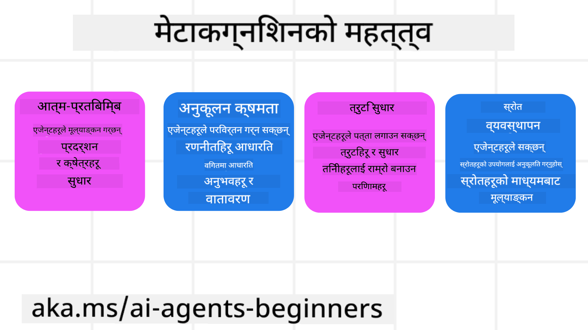
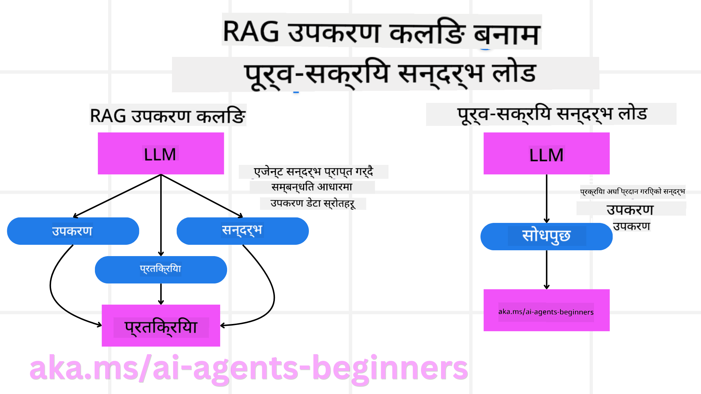

<!--
CO_OP_TRANSLATOR_METADATA:
{
  "original_hash": "8cbf460468c802c7994aa62e0e0779c9",
  "translation_date": "2025-07-12T12:20:28+00:00",
  "source_file": "09-metacognition/README.md",
  "language_code": "ne"
}
-->
[](https://youtu.be/His9R6gw6Ec?si=3_RMb8VprNvdLRhX)

> _(यो पाठको भिडियो हेर्न माथिको तस्बिरमा क्लिक गर्नुहोस्)_
# AI एजेन्टहरूमा मेटाकग्निसन

## परिचय

AI एजेन्टहरूमा मेटाकग्निसन सम्बन्धी पाठमा स्वागत छ! यो अध्याय ती शुरुवातीहरूका लागि तयार गरिएको हो जसलाई AI एजेन्टहरूले आफ्नो सोच्ने प्रक्रियाबारे कसरी सोच्न सक्छन् भन्ने कुरामा जिज्ञासा छ। यस पाठको अन्त्यसम्म, तपाईंले मुख्य अवधारणाहरू बुझ्नुहुनेछ र मेटाकग्निसनलाई AI एजेन्ट डिजाइनमा प्रयोग गर्न व्यावहारिक उदाहरणहरू प्राप्त गर्नुहुनेछ।

## सिकाइका लक्ष्यहरू

यो पाठ पूरा गरेपछि, तपाईं सक्षम हुनुहुनेछ:

1. एजेन्ट परिभाषाहरूमा reasoning loops का प्रभावहरू बुझ्न।
2. योजना र मूल्यांकन प्रविधिहरू प्रयोग गरेर आत्म-सुधार गर्ने एजेन्टहरूलाई सहयोग गर्न।
3. आफ्नै एजेन्टहरू सिर्जना गर्न जसले कोडलाई परिमार्जन गरेर कार्यहरू पूरा गर्न सक्छन्।

## मेटाकग्निसन परिचय

मेटाकग्निसन भन्नाले आफ्नो सोच्ने प्रक्रियाबारे सोच्ने उच्च-स्तरीय संज्ञानात्मक प्रक्रिया जनाउँछ। AI एजेन्टहरूको लागि यसको अर्थ हो आत्म-चेतना र विगत अनुभवहरूका आधारमा आफ्ना क्रियाकलापहरू मूल्यांकन र समायोजन गर्न सक्नु। मेटाकग्निसन, वा "सोच्ने बारे सोच्ने," एजेन्टिक AI प्रणालीहरूको विकासमा महत्वपूर्ण अवधारणा हो। यसले AI प्रणालीहरूलाई आफ्ना आन्तरिक प्रक्रियाहरूको बारेमा सचेत हुन र आफ्नो व्यवहारलाई अनुगमन, नियमन, र अनुकूलन गर्न सक्षम बनाउँछ। जस्तै हामीले कुनै समस्या हेर्दा वा वातावरण बुझ्दा गर्छौं। यस आत्म-चेतनाले AI प्रणालीहरूलाई राम्रो निर्णय लिन, त्रुटिहरू पहिचान गर्न, र समयसँगै आफ्नो प्रदर्शन सुधार गर्न मद्दत गर्छ—फेरि ट्यूरिङ परीक्षण र AI ले नियन्त्रण लिने बहससँग जोडिन्छ।

एजेन्टिक AI प्रणालीहरूको सन्दर्भमा, मेटाकग्निसनले विभिन्न चुनौतीहरू समाधान गर्न मद्दत गर्न सक्छ, जस्तै:
- पारदर्शिता: AI प्रणालीहरूले आफ्नो तर्क र निर्णयहरू स्पष्ट पार्न सकून्।
- तर्क: AI प्रणालीहरूको सूचना संश्लेषण गर्ने र सही निर्णय लिन सक्ने क्षमता बढाउनु।
- अनुकूलन: AI प्रणालीहरूले नयाँ वातावरण र परिवर्तनशील अवस्थाहरूमा अनुकूलन गर्न सकून्।
- अनुभूति: AI प्रणालीहरूले आफ्नो वातावरणबाट प्राप्त डाटालाई सही तरिकाले चिन्ने र व्याख्या गर्ने क्षमता सुधार्नु।

### मेटाकग्निसन के हो?

मेटाकग्निसन, वा "सोच्ने बारे सोच्ने," एक उच्च-स्तरीय संज्ञानात्मक प्रक्रिया हो जसले आफ्नो संज्ञानात्मक प्रक्रियाहरूको आत्म-चेतना र आत्म-नियमन समावेश गर्छ। AI को क्षेत्रमा, मेटाकग्निसनले एजेन्टहरूलाई आफ्ना रणनीतिहरू र क्रियाकलापहरू मूल्यांकन र अनुकूलन गर्न सक्षम बनाउँछ, जसले समस्या समाधान र निर्णय क्षमताहरू सुधार्छ। मेटाकग्निसन बुझेर, तपाईं यस्ता AI एजेन्टहरू डिजाइन गर्न सक्नुहुन्छ जुन मात्र बुद्धिमान नभई अनुकूलनशील र प्रभावकारी पनि हुन्छन्। साँचो मेटाकग्निसनमा, AI ले आफ्नै तर्कबारे स्पष्ट रूपमा सोचिरहेको देखिन्छ।

उदाहरण: “मैले सस्तो उडानलाई प्राथमिकता दिएँ किनभने… सिधा उडान छुटाउन सक्छु, त्यसैले फेरि जाँच गरौं।”  
कसरी वा किन कुनै मार्ग रोज्यो भनेर ट्रयाक राख्नु।  
- त्रुटि पहिचान गर्नु कि किन गल्ती भयो, जस्तै अघिल्लो पटक प्रयोगकर्ताको प्राथमिकतामा धेरै निर्भर भएर, त्यसैले निर्णय रणनीतिमा मात्र होइन अन्तिम सिफारिसमा पनि परिवर्तन गर्नु।  
- ढाँचाहरू पहिचान गर्नु, जस्तै “जब प्रयोगकर्ताले ‘धेरै भीड’ भन्छ, म केवल केही आकर्षणहरू हटाउने मात्र होइन, मेरो ‘शीर्ष आकर्षण’ छनोट गर्ने तरिका पनि गलत छ यदि म सधैं लोकप्रियताका आधारमा क्रमबद्ध गर्छु।”

### AI एजेन्टहरूमा मेटाकग्निसनको महत्त्व

मेटाकग्निसन AI एजेन्ट डिजाइनमा धेरै कारणले महत्वपूर्ण भूमिका खेल्छ:



- आत्म-प्रतिबिम्ब: एजेन्टहरूले आफ्नो प्रदर्शन मूल्यांकन गर्न र सुधारका क्षेत्रहरू पहिचान गर्न सक्छन्।  
- अनुकूलनशीलता: एजेन्टहरूले विगत अनुभव र परिवर्तित वातावरणका आधारमा रणनीतिहरू परिमार्जन गर्न सक्छन्।  
- त्रुटि सुधार: एजेन्टहरूले स्वतन्त्र रूपमा त्रुटिहरू पत्ता लगाएर सुधार गर्न सक्छन्, जसले बढी सही परिणाम ल्याउँछ।  
- स्रोत व्यवस्थापन: एजेन्टहरूले समय र कम्प्युटेशनल शक्ति जस्ता स्रोतहरूको उपयोग योजना र मूल्यांकन गरेर अनुकूलन गर्न सक्छन्।

## AI एजेन्टका घटकहरू

मेटाकग्निटिभ प्रक्रियाहरूमा प्रवेश गर्नु अघि, AI एजेन्टका आधारभूत घटकहरू बुझ्नु आवश्यक छ। सामान्यतया AI एजेन्टमा समावेश हुन्छ:

- पर्सोना: एजेन्टको व्यक्तित्व र विशेषताहरू, जसले प्रयोगकर्तासँग कसरी अन्तरक्रिया गर्ने निर्धारण गर्छ।  
- उपकरणहरू: एजेन्टले गर्न सक्ने क्षमता र कार्यहरू।  
- सीपहरू: एजेन्टले राखेको ज्ञान र विशेषज्ञता।

यी घटकहरू मिलेर एउटा "विशेषज्ञता इकाई" सिर्जना गर्छन् जसले विशिष्ट कार्यहरू गर्न सक्छ।

**उदाहरण**:  
एक ट्राभल एजेन्टलाई विचार गर्नुहोस्, जसले तपाईंको छुट्टी योजना मात्र गर्दैन, तर वास्तविक-समय डाटा र अघिल्लो ग्राहक यात्राका अनुभवहरूका आधारमा आफ्नो मार्ग समायोजन पनि गर्छ।

### उदाहरण: ट्राभल एजेन्ट सेवामा मेटाकग्निसन

कल्पना गर्नुहोस् तपाईं AI द्वारा सञ्चालित ट्राभल एजेन्ट सेवा डिजाइन गर्दै हुनुहुन्छ। यो एजेन्ट, "Travel Agent," प्रयोगकर्ताहरूलाई उनीहरूको छुट्टी योजना बनाउन सहयोग गर्छ। मेटाकग्निसन समावेश गर्न, Travel Agent ले आत्म-चेतना र विगत अनुभवहरूका आधारमा आफ्ना क्रियाकलापहरू मूल्यांकन र समायोजन गर्नुपर्छ। मेटाकग्निसनले कसरी भूमिका खेल्न सक्छ हेर्नुहोस्:

#### वर्तमान कार्य

प्रयोगकर्तालाई पेरिस यात्रा योजना बनाउन सहयोग गर्नु।

#### कार्य पूरा गर्ने चरणहरू

1. **प्रयोगकर्ताका प्राथमिकताहरू सङ्कलन गर्नु**: यात्रा मिति, बजेट, रुचिहरू (जस्तै संग्रहालय, खाना, किनमेल), र कुनै विशेष आवश्यकताहरू सोध्नु।  
2. **सूचना प्राप्त गर्नु**: प्रयोगकर्ताका प्राथमिकतासँग मेल खाने उडान विकल्प, आवास, आकर्षणहरू, र रेस्टुरेन्टहरू खोज्नु।  
3. **सिफारिसहरू तयार गर्नु**: उडान विवरण, होटल आरक्षण, र सुझाइएको गतिविधिहरू सहित व्यक्तिगत यात्रा तालिका प्रदान गर्नु।  
4. **प्रतिक्रिया अनुसार समायोजन गर्नु**: सिफारिसहरूमा प्रयोगकर्ताको प्रतिक्रिया सोध्नु र आवश्यक परिमार्जन गर्नु।

#### आवश्यक स्रोतहरू

- उडान र होटल बुकिङ डाटाबेस पहुँच।  
- पेरिसका आकर्षण र रेस्टुरेन्टहरूको जानकारी।  
- अघिल्लो अन्तरक्रियाबाट प्रयोगकर्ता प्रतिक्रिया डाटा।

#### अनुभव र आत्म-प्रतिबिम्ब

Travel Agent ले आफ्नो प्रदर्शन मूल्यांकन गर्न र विगत अनुभवबाट सिक्न मेटाकग्निसन प्रयोग गर्छ। उदाहरणका लागि:

1. **प्रयोगकर्ता प्रतिक्रियाको विश्लेषण**: कुन सिफारिसहरू राम्रो प्रतिक्रिया पाए र कुन पाएनन् भनेर समीक्षा गरी भविष्यका सुझावहरू समायोजन गर्नु।  
2. **अनुकूलनशीलता**: यदि प्रयोगकर्ताले पहिले भीडभाड मन नपर्ने बताए भने, Travel Agent ले भविष्यमा लोकप्रिय पर्यटक स्थलहरू भीडका समयमा सिफारिस नगर्नेछ।  
3. **त्रुटि सुधार**: यदि अघिल्लो बुकिङमा कुनै गल्ती भयो भने, जस्तै पूर्ण रूपमा बुक भएको होटल सिफारिस गर्नु, Travel Agent ले सिफारिस अघि उपलब्धता कडाइका साथ जाँच्न सिक्छ।

#### व्यावहारिक विकासकर्ता उदाहरण

यहाँ मेटाकग्निसन समावेश गर्दा Travel Agent कोड कस्तो देखिन सक्छ भन्ने सरल उदाहरण छ:

```python
class Travel_Agent:
    def __init__(self):
        self.user_preferences = {}
        self.experience_data = []

    def gather_preferences(self, preferences):
        self.user_preferences = preferences

    def retrieve_information(self):
        # Search for flights, hotels, and attractions based on preferences
        flights = search_flights(self.user_preferences)
        hotels = search_hotels(self.user_preferences)
        attractions = search_attractions(self.user_preferences)
        return flights, hotels, attractions

    def generate_recommendations(self):
        flights, hotels, attractions = self.retrieve_information()
        itinerary = create_itinerary(flights, hotels, attractions)
        return itinerary

    def adjust_based_on_feedback(self, feedback):
        self.experience_data.append(feedback)
        # Analyze feedback and adjust future recommendations
        self.user_preferences = adjust_preferences(self.user_preferences, feedback)

# Example usage
travel_agent = Travel_Agent()
preferences = {
    "destination": "Paris",
    "dates": "2025-04-01 to 2025-04-10",
    "budget": "moderate",
    "interests": ["museums", "cuisine"]
}
travel_agent.gather_preferences(preferences)
itinerary = travel_agent.generate_recommendations()
print("Suggested Itinerary:", itinerary)
feedback = {"liked": ["Louvre Museum"], "disliked": ["Eiffel Tower (too crowded)"]}
travel_agent.adjust_based_on_feedback(feedback)
```

#### मेटाकग्निसन किन महत्त्वपूर्ण छ

- **आत्म-प्रतिबिम्ब**: एजेन्टहरूले आफ्नो प्रदर्शन विश्लेषण गरी सुधारका क्षेत्रहरू पहिचान गर्न सक्छन्।  
- **अनुकूलनशीलता**: प्रतिक्रिया र परिवर्तित अवस्थाहरूको आधारमा रणनीतिहरू परिमार्जन गर्न सक्छन्।  
- **त्रुटि सुधार**: स्वतन्त्र रूपमा गल्तीहरू पत्ता लगाएर सुधार गर्न सक्छन्।  
- **स्रोत व्यवस्थापन**: समय र कम्प्युटेशनल शक्ति जस्ता स्रोतहरूको उपयोग अनुकूलन गर्न सक्छन्।

मेटाकग्निसन समावेश गरेर, Travel Agent ले बढी व्यक्तिगत र सही यात्रा सिफारिसहरू प्रदान गर्न सक्छ, जसले प्रयोगकर्ता अनुभवलाई सुधार्छ।

---

## २. एजेन्टहरूमा योजना बनाउने

योजना बनाउनु AI एजेन्ट व्यवहारको महत्वपूर्ण अङ्ग हो। यसले लक्ष्य प्राप्तिका लागि आवश्यक चरणहरू निर्धारण गर्छ, वर्तमान अवस्था, स्रोतहरू, र सम्भावित बाधाहरूलाई ध्यानमा राख्दै।

### योजनाका तत्वहरू

- **वर्तमान कार्य**: कार्यलाई स्पष्ट रूपमा परिभाषित गर्नु।  
- **कार्य पूरा गर्ने चरणहरू**: कार्यलाई व्यवस्थापनयोग्य चरणहरूमा विभाजन गर्नु।  
- **आवश्यक स्रोतहरू**: आवश्यक स्रोतहरू पहिचान गर्नु।  
- **अनुभव**: विगत अनुभवहरूलाई योजना बनाउन प्रयोग गर्नु।

**उदाहरण**:  
यहाँ Travel Agent ले प्रयोगकर्तालाई प्रभावकारी रूपमा यात्रा योजना बनाउनका लागि लिनुपर्ने चरणहरू छन्:

### Travel Agent का चरणहरू

1. **प्रयोगकर्ताका प्राथमिकताहरू सङ्कलन गर्नु**  
   - यात्रा मिति, बजेट, रुचि, र कुनै विशेष आवश्यकताहरू सोध्नु।  
   - उदाहरण: "तपाईं कहिले यात्रा गर्ने योजना बनाउनु भएको छ?" "तपाईंको बजेट कति हो?" "तपाईंलाई छुट्टीमा के के गर्न मन पर्छ?"

2. **सूचना प्राप्त गर्नु**  
   - प्रयोगकर्ताका प्राथमिकताहरूको आधारमा सम्बन्धित यात्रा विकल्पहरू खोज्नु।  
   - **उडानहरू**: प्रयोगकर्ताको बजेट र मनपर्ने मितिमा उपलब्ध उडानहरू खोज्नु।  
   - **आवासहरू**: स्थान, मूल्य, र सुविधाहरूको आधारमा होटल वा भाडाका घरहरू खोज्नु।  
   - **आकर्षण र रेस्टुरेन्टहरू**: प्रयोगकर्ताका रुचिसँग मेल खाने लोकप्रिय स्थलहरू र खानाका विकल्पहरू पहिचान गर्नु।

3. **सिफारिसहरू तयार गर्नु**  
   - प्राप्त जानकारीलाई व्यक्तिगत यात्रा तालिकामा समेट्नु।  
   - उडान विकल्प, होटल आरक्षण, र सुझाइएको गतिविधिहरू समावेश गरी सिफारिसहरू तयार गर्नु।

4. **यात्रा तालिका प्रयोगकर्तालाई प्रस्तुत गर्नु**  
   - प्रस्तावित यात्रा तालिका प्रयोगकर्तालाई समीक्षा गर्न दिनु।  
   - उदाहरण: "यहाँ तपाईंको पेरिस यात्राको लागि सुझाइएको यात्रा तालिका छ। यसमा उडान विवरण, होटल बुकिङ, र सिफारिस गरिएका गतिविधिहरू समावेश छन्। तपाईंको विचार के छ?"

5. **प्रतिक्रिया सङ्कलन गर्नु**  
   - प्रस्तावित यात्रा तालिकामा प्रयोगकर्ताको प्रतिक्रिया सोध्नु।  
   - उदाहरण: "उडान विकल्पहरू मन पर्‍यो?" "होटल तपाईंको आवश्यकताहरूलाई उपयुक्त छ?" "के तपाईं थप्न वा हटाउन चाहनुहुने कुनै गतिविधि छ?"

6. **प्रतिक्रियाको आधारमा समायोजन गर्नु**  
   - प्रयोगकर्ताको प्रतिक्रियाको आधारमा यात्रा तालिका परिमार्जन गर्नु।  
   - उडान, आवास, र गतिविधि सिफारिसहरू आवश्यक अनुसार परिवर्तन गर्नु।

7. **अन्तिम पुष्टि गर्नु**  
   - परिमार्जित यात्रा तालिका प्रयोगकर्तालाई अन्तिम पुष्टि गर्न दिनु।  
   - उदाहरण: "मैले तपाईंको प्रतिक्रियाको आधारमा परिवर्तनहरू गरेको छु। यहाँ अपडेट गरिएको यात्रा तालिका छ। सबै कुरा ठीक छ?"

8. **बुकिङ र पुष्टि गर्नु**  
   - प्रयोगकर्ताले यात्रा तालिका स्वीकृत गरेपछि उडान, आवास, र पूर्व-योजना गरिएका गतिविधिहरू बुक गर्नु।  
   - पुष्टि विवरण प्रयोगकर्तालाई पठाउनु।

9. **लगातार सहयोग प्रदान गर्नु**  
   - यात्रा अघि र दौरान कुनै परिवर्तन वा थप अनुरोधमा सहयोग गर्न उपलब्ध रहनु।  
   - उदाहरण: "तपाईंलाई यात्रा क्रममा थप सहयोग चाहियो भने, मलाई कुनै पनि बेला सम्पर्क गर्न सक्नुहुन्छ!"

### उदाहरण अन्तरक्रिया

```python
class Travel_Agent:
    def __init__(self):
        self.user_preferences = {}
        self.experience_data = []

    def gather_preferences(self, preferences):
        self.user_preferences = preferences

    def retrieve_information(self):
        flights = search_flights(self.user_preferences)
        hotels = search_hotels(self.user_preferences)
        attractions = search_attractions(self.user_preferences)
        return flights, hotels, attractions

    def generate_recommendations(self):
        flights, hotels, attractions = self.retrieve_information()
        itinerary = create_itinerary(flights, hotels, attractions)
        return itinerary

    def adjust_based_on_feedback(self, feedback):
        self.experience_data.append(feedback)
        self.user_preferences = adjust_preferences(self.user_preferences, feedback)

# Example usage within a booing request
travel_agent = Travel_Agent()
preferences = {
    "destination": "Paris",
    "dates": "2025-04-01 to 2025-04-10",
    "budget": "moderate",
    "interests": ["museums", "cuisine"]
}
travel_agent.gather_preferences(preferences)
itinerary = travel_agent.generate_recommendations()
print("Suggested Itinerary:", itinerary)
feedback = {"liked": ["Louvre Museum"], "disliked": ["Eiffel Tower (too crowded)"]}
travel_agent.adjust_based_on_feedback(feedback)
```

## ३. सुधारात्मक RAG प्रणाली

पहिले RAG उपकरण र पूर्व-सन्दर्भ लोडबीचको भिन्नता बुझौं।



### Retrieval-Augmented Generation (RAG)

RAG ले retrieval प्रणालीलाई generative मोडेलसँग जोड्छ। जब प्रश्न सोधिन्छ, retrieval प्रणालीले बाह्य स्रोतबाट सम्बन्धित कागजात वा डाटा ल्याउँछ, र यो प्राप्त जानकारी generative मोडेलको इनपुटलाई बढावा दिन प्रयोग हुन्छ। यसले मोडेललाई बढी सही र सन्दर्भअनुकूल प्रतिक्रिया दिन मद्दत गर्छ।

RAG प्रणालीमा, एजेन्टले ज्ञान आधारबाट सम्बन्धित जानकारी ल्याएर उपयुक्त प्रतिक्रिया वा क्रियाकलापहरू उत्पादन गर्छ।

### सुधारात्मक RAG दृष्टिकोण

सुधारात्मक RAG दृष्टिकोणले RAG प्रविधिहरू प्रयोग गरेर त्रुटिहरू सुधार्न र AI एजेन्टहरूको शुद्धता बढाउन केन्द्रित हुन्छ। यसमा समावेश छ:

1. **प्रम्प्टिङ प्रविधि**: एजेन्टलाई सम्बन्धित जानकारी ल्याउन विशेष प्रम्प्टहरू प्रयोग गर्नु।  
2. **उपकरण**: एजेन्टलाई ल्याइएको जानकारीको सान्दर्भिकता मूल्यांकन गर्न र सही प्रतिक्रिया उत्पादन गर्न सक्षम गर्ने एल्गोरिदम र संयन्त्रहरू लागू गर्नु।  
3. **मूल्यांकन**: एजेन्टको प्रदर्शन निरन्तर मूल्यांकन गरी सुधारका लागि समायोजन गर्नु।

#### उदाहरण: खोज एजेन्टमा सुधारात्मक RAG

वेबबाट जानकारी ल्याएर प्रयोगकर्ताका प्रश्नहरूको उत्तर दिने खोज एजेन्टलाई विचार गर्नुहोस्। सुधारात्मक RAG दृष्टिकोणमा समावेश हुन सक्छ:

1. **प्रम्प्टिङ प्रविधि**: प्रयोगकर्ताको इनपुटको आधारमा खोज प्रश्नहरू तयार पार्नु।  
2. **उपकरण**: प्राकृतिक भाषा प्रशोधन र मेसिन लर्निङ एल्गोरिदम प्रयोग गरी खोज परिणामहरू क्रमबद्ध र फिल्टर गर्नु।  
3. **मूल्यांकन**: प्रयोगकर्ता प्रतिक्रियाको विश्लेषण गरी ल्याइएको जानकारीमा भएका त्रुटिहरू पहिचान र सुधार गर्नु।

### ट्राभल एजेन्टमा सुधारात्मक RAG

सुधारात्मक RAG (Retrieval-Augmented Generation) ले AI को जानकारी ल्याउने र उत्पादन गर्ने क्षमता सुधार्छ र कुनै पनि त्रुटिहरू सच्याउँछ। ट्राभल एजेन्टले कसरी सुधारात्मक RAG दृष्टिकोण प्रयोग गरेर बढी सही र सान्दर्भिक यात्रा सिफारिसहरू दिन सक्छ हेर्नुहोस्।

यसमा समावेश छ:

- **प्रम्प्टिङ प्रविधि:** एजेन्टलाई सम्बन्धित जानकारी ल्याउन विशेष प्रम्प्टहरू प्रयोग गर्नु।  
- **उपकरण:** ल्याइएको जानकारीको सान्दर्भिकता मूल्यांकन गर्न र सही प्रतिक्रिया उत्पादन गर्न एल्गोरिदम र संयन्त्रहरू लागू गर्नु।  
- **मूल्यांकन:** एजेन्टको प्रदर्शन निरन्तर मूल्यांकन गरी सुधारका लागि समायोजन गर्नु।

#### ट्राभल एजेन्टमा सुधारात्मक RAG लागू गर्ने चरणहरू

1. **प्रारम्भिक प्रयोगकर्ता अन्तरक्रिया**  
   - ट्राभल एजेन्टले प्रयोगकर्ताबाट गन्तव्य, यात्रा मिति, बजेट, र रुचिहरू सङ्कलन गर्छ।  
   - उदाहरण:

     ```python
     preferences = {
         "destination": "Paris",
         "dates": "2025-04-01 to 2025-04-10",
         "budget": "moderate",
         "interests": ["museums", "cuisine"]
     }
     ```

2. **सूचना प्राप्ति**  
   - ट्राभल एजेन्टले प्रयोगकर्ताका प्राथमिकताहरूको आधारमा उडान, आवास, आकर्षण, र रेस्टुरेन्टहरूको जानकारी ल्याउँछ।  
   - उदाहरण:

     ```python
     flights = search_flights(preferences)
     hotels = search_hotels(preferences)
     attractions = search_attractions(preferences)
     ```

3. **प्रारम्भिक सिफारिसहरू तयार पार्नु**  
   - ट्राभल एजेन्टले प्राप्त जानकारी प्रयोग गरी व्यक्तिगत यात्रा तालिका तयार पार्छ।  
   - उदाहरण:

     ```python
     itinerary = create_itinerary(flights, hotels, attractions)
     print("Suggested Itinerary:", itinerary)
     ```

4. **प्रयोगकर्ता प्रतिक्रिया सङ्कलन गर्नु**  
   - ट्राभल एजेन्टले प्रारम्भिक सिफारिसहरूमा प्रयोगकर्ताको प्रतिक्रिया सोध्छ।  
   - उदाहरण:

     ```python
     feedback = {
         "liked": ["Louvre Museum"],
         "disliked": ["Eiffel Tower (too crowded)"]
     }
     ```

5. **सुधारात्मक RAG प्रक्रिया**  
   - **प्रम्प्टिङ प्रविधि**: प्रयोगकर्ताको प्रतिक्रियाको आधारमा नयाँ खोज प्रश्नहरू तयार पार्नु।  
     - उदाहरण:

       ```python
       if "disliked" in feedback:
           preferences["avoid"] = feedback["disliked"]
       ```

   - **उपकरण**: नयाँ खोज परिणामहरू क्रमबद्ध र फिल्टर गर्न एल्गोरिदम प्रयोग गर्नु, प्रयोगकर्ता प्रतिक्रियाको आधारमा सान्दर्भिकता जोड दिनु।  
     - उदाहरण:

       ```python
       new_attractions = search_attractions(preferences)
       new_itinerary = create_itinerary(flights, hotels, new_attractions)
       print("Updated Itinerary:", new_itinerary)
       ```

   - **मूल्यांकन**: प्रयोगकर्ता प्रतिक्रियाको विश्लेषण गरी सिफारिसहरूको सान्दर्भिकता र शुद्धता निरन्तर मूल्यांकन र सुधार गर्नु।  
     - उदाहरण:

       ```python
       def adjust_preferences(preferences, feedback):
           if "liked" in feedback:
               preferences["favorites"] = feedback["liked"]
           if "disliked" in feedback:
               preferences["avoid"] = feedback["disliked"]
           return preferences

       preferences = adjust_preferences(preferences, feedback)
       ```

#### व्यावहारिक उदाहरण

यहाँ ट्राभल एजेन्टमा सुधारात्मक RAG दृष्टिकोण समावेश गर्ने सरल Python कोड उदाहरण छ:
### पूर्व-सन्दर्भ लोड

पूर्व-सन्दर्भ लोड भनेको सोधपुछ प्रक्रिया अघि मोडेलमा सम्बन्धित सन्दर्भ वा पृष्ठभूमि जानकारी लोड गर्नु हो। यसको अर्थ मोडेललाई सुरुबाटै यो जानकारी उपलब्ध हुन्छ, जसले गर्दा थप डाटा खोज्न नपरी बढी सूचित उत्तर दिन मद्दत गर्छ।

यहाँ एउटा सरल उदाहरण छ कि कसरी Python मा यात्रा एजेन्ट एप्लिकेसनका लागि पूर्व-सन्दर्भ लोड देखिन सक्छ:

#### व्याख्या

1. **इनिशियलाइजेसन (`__init__` मेथड)**: `TravelAgent` क्लासले लोकप्रिय गन्तव्यहरू जस्तै पेरिस, टोकियो, न्यूयोर्क, र सिड्नीको बारेमा जानकारी भएको डिक्सनरी पूर्व-लोड गर्छ। यस डिक्सनरीमा देश, मुद्रा, भाषा, र मुख्य आकर्षणहरू समावेश छन्।

2. **जानकारी प्राप्ति (`get_destination_info` मेथड)**: जब प्रयोगकर्ताले कुनै विशेष गन्तव्यको बारेमा सोध्छ, `get_destination_info` मेथडले पूर्व-लोड गरिएको सन्दर्भ डिक्सनरीबाट सम्बन्धित जानकारी ल्याउँछ।

पूर्व-सन्दर्भ लोड गरेर, यात्रा एजेन्ट एप्लिकेसनले प्रयोगकर्ताका सोधपुछहरूलाई छिटो जवाफ दिन सक्छ, बाह्य स्रोतबाट वास्तविक समयमा जानकारी खोज्न नपरी। यसले एप्लिकेसनलाई बढी प्रभावकारी र प्रतिक्रियाशील बनाउँछ।

### लक्ष्यसहित योजना सुरु गरेर पुनरावृत्ति गर्नु

लक्ष्यसहित योजना सुरु गर्नु भनेको स्पष्ट उद्देश्य वा लक्ष्य नतिजा लिएर काम सुरु गर्नु हो। यसले मोडेललाई पुनरावृत्ति प्रक्रियामा मार्गदर्शन गर्ने सिद्धान्तको रूपमा काम गर्छ। यसले सुनिश्चित गर्छ कि प्रत्येक पुनरावृत्तिले इच्छित नतिजातर्फ नजिक पुग्छ, जसले प्रक्रियालाई बढी प्रभावकारी र केन्द्रित बनाउँछ।

यहाँ Python मा यात्रा एजेन्टका लागि लक्ष्यसहित योजना सुरु गरेर पुनरावृत्ति गर्ने उदाहरण छ:

### परिदृश्य

एक यात्रा एजेन्टले ग्राहकको रुचि र बजेट अनुसार अनुकूलित छुट्टी योजना बनाउन चाहन्छ। लक्ष्य भनेको ग्राहकको सन्तुष्टिलाई अधिकतम गर्ने यात्रा तालिका तयार गर्नु हो।

### चरणहरू

1. ग्राहकका रुचि र बजेट परिभाषित गर्नुहोस्।
2. ती रुचिहरूको आधारमा प्रारम्भिक योजना तयार गर्नुहोस्।
3. योजना पुनरावृत्ति गरेर ग्राहकको सन्तुष्टिका लागि सुधार गर्नुहोस्।

#### Python कोड

#### कोड व्याख्या

1. **इनिशियलाइजेसन (`__init__` मेथड)**: `TravelAgent` क्लास सम्भावित गन्तव्यहरूको सूची सहित इनिशियलाइज हुन्छ, जसमा नाम, लागत, र गतिविधि प्रकार जस्ता विशेषताहरू हुन्छन्।

2. **योजना सुरु गर्नु (`bootstrap_plan` मेथड)**: यो मेथडले ग्राहकका रुचि र बजेटको आधारमा प्रारम्भिक यात्रा योजना बनाउँछ। यो गन्तव्यहरूको सूचीमा पुनरावृत्ति गरेर योजना अनुसार मिल्ने र बजेट भित्र पर्ने गन्तव्यहरू थप्छ।

3. **रुचि मिलाउनु (`match_preferences` मेथड)**: यो मेथडले गन्तव्य ग्राहकका रुचिसँग मेल खान्छ कि छैन जाँच गर्छ।

4. **योजना पुनरावृत्ति गर्नु (`iterate_plan` मेथड)**: यो मेथडले प्रारम्भिक योजनालाई सुधार गर्छ, योजना भित्रका प्रत्येक गन्तव्यलाई ग्राहकका रुचि र बजेटलाई ध्यानमा राखेर राम्रो विकल्पले प्रतिस्थापन गर्ने प्रयास गर्छ।

5. **लागत गणना गर्नु (`calculate_cost` मेथड)**: यो मेथडले वर्तमान योजनाको कुल लागत गणना गर्छ, सम्भावित नयाँ गन्तव्य सहित।

#### उदाहरण प्रयोग

- **प्रारम्भिक योजना**: यात्रा एजेन्टले ग्राहकको दर्शनीय स्थलमा रुचि र $2000 को बजेट अनुसार प्रारम्भिक योजना बनाउँछ।
- **सुधारिएको योजना**: यात्रा एजेन्टले योजना पुनरावृत्ति गरेर ग्राहकका रुचि र बजेट अनुसार अनुकूलन गर्छ।

लक्ष्यसहित योजना सुरु गरेर र पुनरावृत्ति गरेर, यात्रा एजेन्टले ग्राहकका लागि अनुकूलित र प्रभावकारी यात्रा तालिका तयार गर्न सक्छ। यसले सुनिश्चित गर्छ कि यात्रा योजना सुरुबाटै ग्राहकका रुचि र बजेटसँग मेल खान्छ र प्रत्येक पुनरावृत्तिले सुधार ल्याउँछ।

### LLM को फाइदा उठाएर पुनः-क्रमबद्ध र स्कोरिङ

ठूला भाषा मोडेलहरू (LLMs) पुनः-क्रमबद्ध र स्कोरिङका लागि प्रयोग गर्न सकिन्छ जसले प्राप्त कागजात वा उत्पन्न उत्तरहरूको सान्दर्भिकता र गुणस्तर मूल्याङ्कन गर्छ। यसरी काम गर्छ:

**प्राप्ति:** सुरुमा सोधपुछको आधारमा सम्भावित कागजात वा उत्तरहरूको सेट ल्याइन्छ।

**पुनः-क्रमबद्ध:** LLM ले ती उम्मेदवारहरूलाई सान्दर्भिकता र गुणस्तरको आधारमा पुनः-क्रमबद्ध गर्छ। यसले सबैभन्दा सान्दर्भिक र गुणस्तरीय जानकारी पहिले देखिन्छ सुनिश्चित गर्छ।

**स्कोरिङ:** LLM ले प्रत्येक उम्मेदवारलाई सान्दर्भिकता र गुणस्तरको स्कोर दिन्छ। यसले प्रयोगकर्ताका लागि उत्तम उत्तर वा कागजात चयन गर्न मद्दत गर्छ।

LLM को पुनः-क्रमबद्ध र स्कोरिङ प्रयोग गरेर प्रणालीले बढी सही र सान्दर्भिक जानकारी दिन सक्छ, जसले प्रयोगकर्ता अनुभव सुधार्छ।

यहाँ Python मा यात्रा एजेन्टले प्रयोगकर्ताका रुचि अनुसार यात्रा गन्तव्यहरू पुनः-क्रमबद्ध र स्कोर गर्न LLM कसरी प्रयोग गर्न सक्छ भन्ने उदाहरण छ:

#### परिदृश्य - रुचि अनुसार यात्रा

यात्रा एजेन्टले ग्राहकका रुचि अनुसार उत्तम यात्रा गन्तव्य सिफारिस गर्न चाहन्छ। LLM ले गन्तव्यहरू पुनः-क्रमबद्ध र स्कोर गरेर सबैभन्दा सान्दर्भिक विकल्पहरू प्रस्तुत गर्न मद्दत गर्नेछ।

#### चरणहरू:

1. प्रयोगकर्ताका रुचिहरू सङ्कलन गर्नुहोस्।
2. सम्भावित यात्रा गन्तव्यहरूको सूची प्राप्त गर्नुहोस्।
3. LLM प्रयोग गरेर गन्तव्यहरूलाई पुनः-क्रमबद्ध र स्कोर गर्नुहोस्।

यहाँ पहिलेको उदाहरणलाई Azure OpenAI सेवा प्रयोग गरेर कसरी अपडेट गर्ने देखाइएको छ:

#### आवश्यकताहरू

1. तपाईंसँग Azure सदस्यता हुनुपर्छ।
2. Azure OpenAI स्रोत सिर्जना गरी API कुञ्जी प्राप्त गर्नुहोस्।

#### Python कोड उदाहरण

#### कोड व्याख्या - Preference Booker

1. **इनिशियलाइजेसन**: `TravelAgent` क्लास सम्भावित यात्रा गन्तव्यहरूको सूची सहित इनिशियलाइज हुन्छ, जसमा नाम र विवरण हुन्छ।

2. **सिफारिस प्राप्ति (`get_recommendations` मेथड)**: यो मेथडले प्रयोगकर्ताका रुचिको आधारमा Azure OpenAI सेवाका लागि प्रॉम्प्ट बनाउँछ र HTTP POST अनुरोध गरेर पुनः-क्रमबद्ध र स्कोर गरिएको गन्तव्यहरू प्राप्त गर्छ।

3. **प्रॉम्प्ट निर्माण (`generate_prompt` मेथड)**: यो मेथडले Azure OpenAI का लागि प्रॉम्प्ट तयार पार्छ, जसमा प्रयोगकर्ताका रुचि र गन्तव्यहरूको सूची समावेश हुन्छ। प्रॉम्प्टले मोडेललाई दिइएको रुचि अनुसार गन्तव्यहरू पुनः-क्रमबद्ध र स्कोर गर्न निर्देशन दिन्छ।

4. **API कल**: `requests` लाइब्रेरी प्रयोग गरेर Azure OpenAI API मा HTTP POST अनुरोध गरिन्छ। प्रतिक्रिया पुनः-क्रमबद्ध र स्कोर गरिएको गन्तव्यहरू समावेश गर्छ।

5. **उदाहरण प्रयोग**: यात्रा एजेन्टले प्रयोगकर्ताका रुचि (जस्तै दर्शनीय स्थल र विविध संस्कृति) सङ्कलन गरी Azure OpenAI सेवा प्रयोग गरेर पुनः-क्रमबद्ध र स्कोर गरिएको सिफारिसहरू प्राप्त गर्छ।

`your_azure_openai_api_key` लाई आफ्नो वास्तविक Azure OpenAI API कुञ्जीले र `https://your-endpoint.com/...` लाई Azure OpenAI डिप्लोयमेन्टको वास्तविक URL ले प्रतिस्थापन गर्न नबिर्सनुहोस्।

LLM को पुनः-क्रमबद्ध र स्कोरिङ प्रयोग गरेर, यात्रा एजेन्टले ग्राहकलाई बढी व्यक्तिगत र सान्दर्भिक यात्रा सिफारिसहरू दिन सक्छ, जसले उनीहरूको अनुभव सुधार्छ।

### RAG: प्रॉम्प्टिङ प्रविधि बनाम उपकरण

Retrieval-Augmented Generation (RAG) AI एजेन्ट विकासमा प्रॉम्प्टिङ प्रविधि र उपकरण दुवै हुन सक्छ। यी दुई बीचको भिन्नता बुझ्नाले RAG लाई प्रभावकारी रूपमा प्रयोग गर्न मद्दत गर्छ।

#### RAG प्रॉम्प्टिङ प्रविधि रूपमा

**के हो?**

- प्रॉम्प्टिङ प्रविधि रूपमा, RAG ले ठूलो डाटासेट वा ज्ञानकोषबाट सान्दर्भिक जानकारी खोज्न विशेष सोधपुछ वा प्रॉम्प्ट तयार पार्ने काम गर्छ। त्यसपछि त्यो जानकारी प्रयोग गरेर उत्तर वा कार्य उत्पन्न गरिन्छ।

**कसरी काम गर्छ:**

1. **प्रॉम्प्ट तयार पार्नु**: कार्य वा प्रयोगकर्ताको इनपुट अनुसार राम्रो संरचित प्रॉम्प्ट वा सोधपुछ बनाउनु।
2. **जानकारी प्राप्त गर्नु**: प्रॉम्प्ट प्रयोग गरेर पूर्व-स्थित ज्ञानकोष वा डाटासेटबाट सान्दर्भिक डाटा खोज्नु।
3. **उत्तर उत्पन्न गर्नु**: प्राप्त जानकारीलाई जेनेरेटिभ AI मोडेलसँग मिलाएर पूर्ण र सुसंगत उत्तर तयार गर्नु।

**यात्रा एजेन्टमा उदाहरण**:

- प्रयोगकर्ता इनपुट: "म पेरिसका संग्रहालयहरू हेर्न चाहन्छु।"
- प्रॉम्प्ट: "पेरिसका शीर्ष संग्रहालयहरू खोज्नुहोस्।"
- प्राप्त जानकारी: लुभ्रे संग्रहालय, म्युज डोर्से आदि विवरण।
- उत्पन्न उत्तर: "पेरिसका केही शीर्ष संग्रहालयहरू: लुभ्रे संग्रहालय, म्युज डोर्से, र सेन्टर पम्पिडु।"

#### RAG उपकरण रूपमा

**के हो?**

- उपकरण रूपमा, RAG एक एकीकृत प्रणाली हो जसले प्राप्ति र उत्पन्न प्रक्रियालाई स्वचालित बनाउँछ, जसले विकासकर्ताहरूलाई प्रत्येक सोधपुछका लागि म्यानुअल प्रॉम्प्ट तयार नगरी जटिल AI कार्यान्वयन गर्न सजिलो बनाउँछ।

**कसरी काम गर्छ:**

1. **एकीकरण**: AI एजेन्टको संरचनामा RAG समावेश गरेर स्वचालित रूपमा प्राप्ति र उत्पन्न कार्यहरू सञ्चालन गर्नु।
2. **स्वचालन**: उपकरणले प्रयोगकर्ताको इनपुटबाट अन्तिम उत्तर उत्पन्नसम्मको सम्पूर्ण प्रक्रिया व्यवस्थापन गर्छ, प्रत्येक चरणका लागि स्पष्ट प्रॉम्प्ट आवश्यक नपर्ने।
3. **प्रभावकारिता**: प्राप्ति र उत्पन्न प्रक्रियालाई सरल र छिटो बनाउँदै एजेन्टको प्रदर्शन सुधार्छ।

**यात्रा एजेन्टमा उदाहरण**:

- प्रयोगकर्ता इनपुट: "म पेरिसका संग्रहालयहरू हेर्न चाहन्छु।"
- RAG उपकरण: स्वचालित रूपमा संग्रहालयहरूको जानकारी प्राप्त गरी उत्तर तयार गर्छ।
- उत्पन्न उत्तर: "पेरिसका केही शीर्ष संग्रहालयहरू: लुभ्रे संग्रहालय, म्युज डोर्से, र सेन्टर पम्पिडु।"

### तुलना

| पक्ष                   | प्रॉम्प्टिङ प्रविधि                                      | उपकरण                                                  |
|------------------------|---------------------------------------------------------|--------------------------------------------------------|
| **म्यानुअल बनाम स्वचालित** | प्रत्येक सोधपुछका लागि म्यानुअल प्रॉम्प्ट तयार पार्ने।      | प्राप्ति र उत्पन्न प्रक्रियालाई स्वचालित बनाउने।         |
| **नियन्त्रण**          | प्राप्ति प्रक्रियामा बढी नियन्त्रण दिन्छ।                 | प्राप्ति र उत्पन्न प्रक्रियालाई सरल र स्वचालित बनाउँछ।    |
| **लचिलोपन**            | विशेष आवश्यकताअनुसार अनुकूलित प्रॉम्प्ट बनाउन सकिन्छ।      | ठूलो स्तरमा कार्यान्वयनका लागि बढी प्रभावकारी।           |
| **जटिलता**             | प्रॉम्प्ट तयार पार्न र परिमार्जन गर्न आवश्यक पर्छ।          | AI एजेन्टको संरचनामा सजिलै समावेश गर्न सकिन्छ।           |

### व्यावहारिक उदाहरणहरू

**प्रॉम्प्टिङ प्रविधि उदाहरण:**

**उपकरण उदाहरण:**

### सान्दर्भिकता मूल्याङ्कन

सान्दर्भिकता मूल्याङ्कन AI एजेन्टको प्रदर्शनमा महत्वपूर्ण पक्ष हो। यसले सुनिश्चित गर्छ कि एजेन्टले प्राप्त र उत्पन्न गरेको जानकारी प्रयोगकर्ताका लागि उपयुक्त, सही, र उपयोगी छ। सान्दर्भिकता कसरी मूल्याङ्कन गर्ने, व्यावहारिक उदाहरण र प्रविधिहरू सहित हेर्नुहोस्।

#### सान्दर्भिकता मूल्याङ्कनका मुख्य अवधारणाहरू

1. **सन्दर्भ बुझाइ**:
   - एजेन्टले प्रयोगकर्ताको सोधपुछको सन्दर्भ बुझ्नुपर्छ ताकि सान्दर्भिक जानकारी प्राप्त र उत्पन्न गर्न सकियोस्।
   - उदाहरण: प्रयोगकर्ताले "पेरिसका उत्कृष्ट रेस्टुरेन्टहरू" सोध्दा, एजेन्टले प्रयोगकर्ताका रुचि जस्तै खानाको प्रकार र बजेट विचार गर्नुपर्छ।

2. **शुद्धता**:
   - एजेन्टले दिएको जानकारी तथ्यात्मक रूपमा सही र अद्यावधिक हुनुपर्छ।
   - उदाहरण: हाल खुला र राम्रो समीक्षा भएका रेस्टुरेन्टहरू सिफारिस गर्नु, पुराना वा बन्द भएका होइन।

3. **प्रयोगकर्ताको उद्देश्य**:
   - एजेन्टले सोधपुछ पछाडिको प्रयोगकर्ताको उद्देश्य अनुमान लगाउनुपर्छ ताकि सबैभन्दा सान्दर्भिक जानकारी दिन सकियोस्।
   - उदाहरण: "बजेटमैत्री होटलहरू" सोध्दा सस्तो विकल्पलाई प्राथमिकता दिनु।

4. **प्रतिक्रिया चक्र**:
   - प्रयोगकर्ताको प्रतिक्रिया सङ्कलन र विश्लेषण गरेर एजेन्टले सान्दर्भिकता मूल्याङ्कन प्रक्रिया सुधार गर्न सक्छ।
   - उदाहरण: अघिल्ला सिफारिसमा प्रयोगकर्ताको रेटिङ र प्रतिक्रिया समावेश गरेर भविष्यका उत्तर सुधार गर्नु।

#### सान्दर्भिकता मूल्याङ्कनका व्यावहारिक प्रविधिहरू

1. **सान्दर्भिकता स्कोरिङ**:
   - प्रत्येक प्राप्त वस्तुलाई प्रयोगकर्ताको सोधपुछ र रुचिसँग कति मेल खान्छ भनेर स्कोर दिनु।
   - उदाहरण:

2. **फिल्टरिङ र र्याङ्किङ**:
   - अप्रासंगिक वस्तुहरू हटाएर बाँकी वस्तुहरूलाई सान्दर्भिकता स्कोरको आधारमा क्रमबद्ध गर्नु।
   - उदाहरण:

3. **प्राकृतिक भाषा प्रशोधन (NLP)**:
   - प्रयोगकर्ताको सोधपुछ बुझ्न र सान्दर्भिक जानकारी प्राप्त गर्न NLP प्रविधिहरू प्रयोग गर्नु।
   - उदाहरण:

4. **प्रयोगकर्ता प्रतिक्रिया समावेशीकरण**:
   - दिइएका सिफारिसमा प्रयोगकर्ताको प्रतिक्रिया सङ्कलन गरी भविष्यका सान्दर्भिकता मूल्याङ्कनमा समायोजन गर्नु।
   - उदाहरण:

#### उदाहरण: यात्रा एजेन्टमा सान्दर्भिकता मूल्याङ्कन

यहाँ यात्रा एजेन्टले यात्रा सिफारिसहरूको सान्दर्भिकता कसरी मूल्याङ्कन गर्न सक्छ भन्ने व्यावहारिक उदाहरण छ:

### उद्देश्यसहित खोजी

उद्देश्यसहित खोजी भनेको प्रयोगकर्ताको सोधपुछ पछाडिको वास्तविक उद्देश्य वा लक्ष्य बुझेर सबैभन्दा सान्दर्भिक र उपयोगी जानकारी प्राप्त र उत्पन्न गर्नु हो। यो केवल कुञ्जीशब्द मिलाउने भन्दा अगाडि जान्छ र प्रयोगकर्ताको वास्तविक आवश्यकतामा केन्द्रित हुन्छ।

#### उद्देश्यसहित खोजीका मुख्य अवधारणाहरू

1. **प्रयोगकर्ताको उद्देश्य बुझ्नु**:
   - प्रयोगकर्ताको उद्देश्य मुख्य तीन प्रकारमा वर्गीकरण गर्न सकिन्छ: सूचना सम्बन्धी, नेभिगेसन सम्बन्धी, र लेनदेन सम्बन्धी।
     - **सूचना सम्बन्धी उद्देश्य**: प्रयोगकर्ता कुनै विषयको जानकारी खोज्दैछ (जस्तै, "पेरिसका उत्कृष्ट संग्रहालयहरू के हुन्?")।
     - **नेभिगेसन सम्बन्धी उद्देश्य**: प्रयोगकर्ता कुनै विशेष वेबसाइट वा पृष्ठमा जान चाहन्छ (जस्तै, "लुभ्रे संग्रहालयको आधिकारिक वेबसाइट")।
     - **लेनदेन सम्बन्धी उद्देश्य**: प्रयोगकर्ता कुनै लेनदेन गर्न चाहन्छ, जस्तै उडान बुकिङ वा खरिद (जस्तै, "पेरिसको उडान बुक गर्नुहोस्")।

2. **सन्दर्भ बुझाइ**:
   - प्रयोगकर्ताको सोधपुछको सन्दर्भ विश्लेषण गरेर उद्देश्य सही पहिचान गर्न मद्दत गर्छ। यसमा अघिल्लो अन्तरक्रिया, प्रयोगकर्ताका रुचि, र हालको सोधपुछका विशेष विवरणहरू समावेश छन्।

3. **प्राकृतिक भाषा प्रशोधन (NLP)**:
   - प्रयोगकर्ताले दिएको प्राकृतिक भाषाका सोधपुछहरू बुझ्न र व्याख्या गर्न NLP प्रविधिहरू प्रयोग गरिन्छ। यसमा इकाई पहिचान, भावना विश्लेषण, र सोधपुछ पार्सिङ समावेश छन्।

4. **व्यक्तिगतकरण**:
   - प्रयोगकर्ताको इतिहास, रुचि, र प्रतिक्रियाको आधारमा खोजी परिणामहरू व्यक्तिगत बनाउँदा प्राप्त जानकारीको सान्दर्भिकता बढ्छ।
#### व्यावहारिक उदाहरण: ट्राभल एजेन्टमा उद्देश्यसहित खोजी

ट्राभल एजेन्टलाई उदाहरणको रूपमा लिएर उद्देश्यसहित खोजी कसरी कार्यान्वयन गर्न सकिन्छ हेर्नुहोस्।

1. **प्रयोगकर्ताको प्राथमिकता सङ्कलन**

   ```python
   class Travel_Agent:
       def __init__(self):
           self.user_preferences = {}

       def gather_preferences(self, preferences):
           self.user_preferences = preferences
   ```

2. **प्रयोगकर्ताको उद्देश्य बुझ्ने**

   ```python
   def identify_intent(query):
       if "book" in query or "purchase" in query:
           return "transactional"
       elif "website" in query or "official" in query:
           return "navigational"
       else:
           return "informational"
   ```

3. **सन्दर्भ सचेतता**

   ```python
   def analyze_context(query, user_history):
       # Combine current query with user history to understand context
       context = {
           "current_query": query,
           "user_history": user_history
       }
       return context
   ```

4. **खोजी र परिणामहरू व्यक्तिगत बनाउने**

   ```python
   def search_with_intent(query, preferences, user_history):
       intent = identify_intent(query)
       context = analyze_context(query, user_history)
       if intent == "informational":
           search_results = search_information(query, preferences)
       elif intent == "navigational":
           search_results = search_navigation(query)
       elif intent == "transactional":
           search_results = search_transaction(query, preferences)
       personalized_results = personalize_results(search_results, user_history)
       return personalized_results

   def search_information(query, preferences):
       # Example search logic for informational intent
       results = search_web(f"best {preferences['interests']} in {preferences['destination']}")
       return results

   def search_navigation(query):
       # Example search logic for navigational intent
       results = search_web(query)
       return results

   def search_transaction(query, preferences):
       # Example search logic for transactional intent
       results = search_web(f"book {query} to {preferences['destination']}")
       return results

   def personalize_results(results, user_history):
       # Example personalization logic
       personalized = [result for result in results if result not in user_history]
       return personalized[:10]  # Return top 10 personalized results
   ```

5. **उदाहरण प्रयोग**

   ```python
   travel_agent = Travel_Agent()
   preferences = {
       "destination": "Paris",
       "interests": ["museums", "cuisine"]
   }
   travel_agent.gather_preferences(preferences)
   user_history = ["Louvre Museum website", "Book flight to Paris"]
   query = "best museums in Paris"
   results = search_with_intent(query, preferences, user_history)
   print("Search Results:", results)
   ```

---

## ४. उपकरणको रूपमा कोड सिर्जना

कोड सिर्जना गर्ने एजेन्टहरूले AI मोडेलहरू प्रयोग गरी कोड लेख्छन् र चलाउँछन्, जटिल समस्याहरू समाधान गर्छन् र कार्यहरू स्वचालित बनाउँछन्।

### कोड सिर्जना गर्ने एजेन्टहरू

कोड सिर्जना गर्ने एजेन्टहरूले जेनेरेटिभ AI मोडेलहरू प्रयोग गरी कोड लेख्छन् र चलाउँछन्। यी एजेन्टहरूले विभिन्न प्रोग्रामिङ भाषाहरूमा कोड सिर्जना र सञ्चालन गरेर जटिल समस्याहरू समाधान गर्न, कार्यहरू स्वचालित बनाउन र महत्वपूर्ण जानकारी प्रदान गर्न सक्छन्।

#### व्यावहारिक प्रयोगहरू

1. **स्वचालित कोड सिर्जना**: विशिष्ट कार्यहरूका लागि कोड स्निपेटहरू सिर्जना गर्ने, जस्तै डाटा विश्लेषण, वेब स्क्र्यापिङ, वा मेशिन लर्निङ।
2. **SQL लाई RAG को रूपमा प्रयोग**: डाटाबेसबाट डाटा प्राप्त गर्न र व्यवस्थापन गर्न SQL क्वेरीहरू प्रयोग गर्ने।
3. **समस्या समाधान**: विशिष्ट समस्याहरू समाधान गर्न कोड सिर्जना र सञ्चालन गर्ने, जस्तै एल्गोरिदम अनुकूलन वा डाटा विश्लेषण।

#### उदाहरण: डाटा विश्लेषणका लागि कोड सिर्जना गर्ने एजेन्ट

कल्पना गर्नुहोस् तपाईंले कोड सिर्जना गर्ने एजेन्ट डिजाइन गर्दै हुनुहुन्छ। यसरी काम गर्न सक्छ:

1. **कार्य**: डाटासेट विश्लेषण गरी प्रवृत्ति र ढाँचाहरू पहिचान गर्ने।
2. **चरणहरू**:
   - डाटासेटलाई डाटा विश्लेषण उपकरणमा लोड गर्ने।
   - डाटालाई फिल्टर र समेकन गर्न SQL क्वेरीहरू सिर्जना गर्ने।
   - क्वेरीहरू चलाएर परिणामहरू प्राप्त गर्ने।
   - परिणामहरू प्रयोग गरी भिजुअलाइजेसन र अन्तर्दृष्टि सिर्जना गर्ने।
3. **आवश्यक स्रोतहरू**: डाटासेट पहुँच, डाटा विश्लेषण उपकरणहरू, र SQL क्षमता।
4. **अनुभव**: विगतका विश्लेषण परिणामहरू प्रयोग गरी भविष्यका विश्लेषणहरू सुधार गर्ने।

### उदाहरण: ट्राभल एजेन्टका लागि कोड सिर्जना गर्ने एजेन्ट

यस उदाहरणमा, हामी ट्राभल एजेन्ट नामक कोड सिर्जना गर्ने एजेन्ट डिजाइन गर्नेछौं, जसले प्रयोगकर्ताहरूलाई यात्रा योजना बनाउन कोड सिर्जना र सञ्चालन गरेर सहयोग पुर्‍याउँछ। यो एजेन्टले यात्रा विकल्पहरू खोज्ने, परिणामहरू फिल्टर गर्ने, र जेनेरेटिभ AI प्रयोग गरी यात्रा तालिका तयार गर्ने कार्यहरू गर्न सक्छ।

#### कोड सिर्जना गर्ने एजेन्टको अवलोकन

1. **प्रयोगकर्ताको प्राथमिकता सङ्कलन**: गन्तव्य, यात्रा मिति, बजेट, र रुचिहरू जस्ता प्रयोगकर्ता इनपुट सङ्कलन गर्छ।
2. **डाटा ल्याउन कोड सिर्जना**: उडान, होटल, र आकर्षणहरूको जानकारी ल्याउन कोड स्निपेटहरू सिर्जना गर्छ।
3. **सिर्जना गरिएको कोड सञ्चालन**: वास्तविक समयमा जानकारी ल्याउन कोड चलाउँछ।
4. **यात्रा तालिका सिर्जना**: सङ्कलित डाटालाई व्यक्तिगत यात्रा योजनामा रूपान्तरण गर्छ।
5. **प्रतिक्रिया अनुसार समायोजन**: प्रयोगकर्ताको प्रतिक्रिया प्राप्त गरी आवश्यक परे कोड पुनः सिर्जना गरेर परिणामहरू सुधार गर्छ।

#### चरण-द्वारा-चरण कार्यान्वयन

1. **प्रयोगकर्ताको प्राथमिकता सङ्कलन**

   ```python
   class Travel_Agent:
       def __init__(self):
           self.user_preferences = {}

       def gather_preferences(self, preferences):
           self.user_preferences = preferences
   ```

2. **डाटा ल्याउन कोड सिर्जना**

   ```python
   def generate_code_to_fetch_data(preferences):
       # Example: Generate code to search for flights based on user preferences
       code = f"""
       def search_flights():
           import requests
           response = requests.get('https://api.example.com/flights', params={preferences})
           return response.json()
       """
       return code

   def generate_code_to_fetch_hotels(preferences):
       # Example: Generate code to search for hotels
       code = f"""
       def search_hotels():
           import requests
           response = requests.get('https://api.example.com/hotels', params={preferences})
           return response.json()
       """
       return code
   ```

3. **सिर्जना गरिएको कोड सञ्चालन**

   ```python
   def execute_code(code):
       # Execute the generated code using exec
       exec(code)
       result = locals()
       return result

   travel_agent = Travel_Agent()
   preferences = {
       "destination": "Paris",
       "dates": "2025-04-01 to 2025-04-10",
       "budget": "moderate",
       "interests": ["museums", "cuisine"]
   }
   travel_agent.gather_preferences(preferences)
   
   flight_code = generate_code_to_fetch_data(preferences)
   hotel_code = generate_code_to_fetch_hotels(preferences)
   
   flights = execute_code(flight_code)
   hotels = execute_code(hotel_code)

   print("Flight Options:", flights)
   print("Hotel Options:", hotels)
   ```

4. **यात्रा तालिका सिर्जना**

   ```python
   def generate_itinerary(flights, hotels, attractions):
       itinerary = {
           "flights": flights,
           "hotels": hotels,
           "attractions": attractions
       }
       return itinerary

   attractions = search_attractions(preferences)
   itinerary = generate_itinerary(flights, hotels, attractions)
   print("Suggested Itinerary:", itinerary)
   ```

5. **प्रतिक्रिया अनुसार समायोजन**

   ```python
   def adjust_based_on_feedback(feedback, preferences):
       # Adjust preferences based on user feedback
       if "liked" in feedback:
           preferences["favorites"] = feedback["liked"]
       if "disliked" in feedback:
           preferences["avoid"] = feedback["disliked"]
       return preferences

   feedback = {"liked": ["Louvre Museum"], "disliked": ["Eiffel Tower (too crowded)"]}
   updated_preferences = adjust_based_on_feedback(feedback, preferences)
   
   # Regenerate and execute code with updated preferences
   updated_flight_code = generate_code_to_fetch_data(updated_preferences)
   updated_hotel_code = generate_code_to_fetch_hotels(updated_preferences)
   
   updated_flights = execute_code(updated_flight_code)
   updated_hotels = execute_code(updated_hotel_code)
   
   updated_itinerary = generate_itinerary(updated_flights, updated_hotels, attractions)
   print("Updated Itinerary:", updated_itinerary)
   ```

### वातावरण सचेतता र तर्कशक्ति प्रयोग

टेबलको स्किमालाई आधार बनाएर क्वेरी सिर्जना प्रक्रियामा वातावरण सचेतता र तर्कशक्ति प्रयोग गरेर सुधार गर्न सकिन्छ।

यसरी गर्न सकिन्छ:

1. **स्किमा बुझ्ने**: प्रणालीले टेबलको स्किमा बुझ्छ र यसलाई क्वेरी सिर्जनामा आधार बनाउँछ।
2. **प्रतिक्रिया अनुसार समायोजन**: प्रणालीले प्रयोगकर्ताको प्रतिक्रियाको आधारमा प्राथमिकताहरू समायोजन गर्छ र स्किमाका कुन फिल्डहरू अपडेट गर्नुपर्ने हो तर्क गर्छ।
3. **क्वेरी सिर्जना र सञ्चालन**: नयाँ प्राथमिकताहरू अनुसार उडान र होटल डाटा ल्याउन क्वेरीहरू सिर्जना र सञ्चालन गर्छ।

यहाँ यी अवधारणाहरू समावेश गरिएको अपडेट गरिएको Python कोड उदाहरण छ:

```python
def adjust_based_on_feedback(feedback, preferences, schema):
    # Adjust preferences based on user feedback
    if "liked" in feedback:
        preferences["favorites"] = feedback["liked"]
    if "disliked" in feedback:
        preferences["avoid"] = feedback["disliked"]
    # Reasoning based on schema to adjust other related preferences
    for field in schema:
        if field in preferences:
            preferences[field] = adjust_based_on_environment(feedback, field, schema)
    return preferences

def adjust_based_on_environment(feedback, field, schema):
    # Custom logic to adjust preferences based on schema and feedback
    if field in feedback["liked"]:
        return schema[field]["positive_adjustment"]
    elif field in feedback["disliked"]:
        return schema[field]["negative_adjustment"]
    return schema[field]["default"]

def generate_code_to_fetch_data(preferences):
    # Generate code to fetch flight data based on updated preferences
    return f"fetch_flights(preferences={preferences})"

def generate_code_to_fetch_hotels(preferences):
    # Generate code to fetch hotel data based on updated preferences
    return f"fetch_hotels(preferences={preferences})"

def execute_code(code):
    # Simulate execution of code and return mock data
    return {"data": f"Executed: {code}"}

def generate_itinerary(flights, hotels, attractions):
    # Generate itinerary based on flights, hotels, and attractions
    return {"flights": flights, "hotels": hotels, "attractions": attractions}

# Example schema
schema = {
    "favorites": {"positive_adjustment": "increase", "negative_adjustment": "decrease", "default": "neutral"},
    "avoid": {"positive_adjustment": "decrease", "negative_adjustment": "increase", "default": "neutral"}
}

# Example usage
preferences = {"favorites": "sightseeing", "avoid": "crowded places"}
feedback = {"liked": ["Louvre Museum"], "disliked": ["Eiffel Tower (too crowded)"]}
updated_preferences = adjust_based_on_feedback(feedback, preferences, schema)

# Regenerate and execute code with updated preferences
updated_flight_code = generate_code_to_fetch_data(updated_preferences)
updated_hotel_code = generate_code_to_fetch_hotels(updated_preferences)

updated_flights = execute_code(updated_flight_code)
updated_hotels = execute_code(updated_hotel_code)

updated_itinerary = generate_itinerary(updated_flights, updated_hotels, feedback["liked"])
print("Updated Itinerary:", updated_itinerary)
```

#### व्याख्या - प्रतिक्रियाको आधारमा बुकिङ

1. **स्किमा सचेतता**: `schema` डिक्सनरीले प्रतिक्रियाको आधारमा प्राथमिकताहरू कसरी समायोजन गर्ने हो निर्धारण गर्छ। यसमा `favorites` र `avoid` जस्ता फिल्डहरू र तिनीहरूको समायोजन समावेश छन्।
2. **प्राथमिकता समायोजन (`adjust_based_on_feedback` मेथड)**: यो मेथडले प्रयोगकर्ताको प्रतिक्रियाको आधारमा प्राथमिकताहरू समायोजन गर्छ।
3. **वातावरण आधारित समायोजन (`adjust_based_on_environment` मेथड)**: यो मेथडले स्किमा र प्रतिक्रियाको आधारमा समायोजनहरू अनुकूल बनाउँछ।
4. **क्वेरी सिर्जना र सञ्चालन**: प्रणालीले समायोजित प्राथमिकताहरू अनुसार उडान र होटल डाटा ल्याउन कोड सिर्जना गर्छ र ती क्वेरीहरूको अनुकरण गर्दछ।
5. **यात्रा तालिका सिर्जना**: नयाँ उडान, होटल, र आकर्षण डाटाको आधारमा अपडेट गरिएको यात्रा तालिका बनाउँछ।

प्रणालीलाई वातावरण-सचेत र स्किमा आधारित तर्कशक्ति सहित बनाउँदा, यसले बढी सही र सान्दर्भिक क्वेरीहरू सिर्जना गर्न सक्छ, जसले राम्रो यात्रा सिफारिस र व्यक्तिगत प्रयोगकर्ता अनुभव प्रदान गर्छ।

### SQL लाई Retrieval-Augmented Generation (RAG) प्रविधिको रूपमा प्रयोग

SQL (Structured Query Language) डाटाबेससँग अन्तरक्रिया गर्न शक्तिशाली उपकरण हो। Retrieval-Augmented Generation (RAG) विधिको भागको रूपमा SQL प्रयोग गर्दा, SQL ले डाटाबेसबाट सान्दर्भिक डाटा प्राप्त गरी AI एजेन्टहरूमा जवाफ वा कार्यहरू सिर्जना गर्न मद्दत गर्छ। ट्राभल एजेन्टको सन्दर्भमा SQL लाई RAG प्रविधिको रूपमा कसरी प्रयोग गर्न सकिन्छ हेर्नुहोस्।

#### मुख्य अवधारणाहरू

1. **डाटाबेस अन्तरक्रिया**:
   - SQL डाटाबेसमा क्वेरी गर्न, सान्दर्भिक जानकारी ल्याउन, र डाटा व्यवस्थापन गर्न प्रयोग हुन्छ।
   - उदाहरण: ट्राभल डाटाबेसबाट उडान विवरण, होटल जानकारी, र आकर्षणहरू ल्याउने।

2. **RAG सँग एकीकरण**:
   - SQL क्वेरीहरू प्रयोगकर्ताको इनपुट र प्राथमिकताका आधारमा सिर्जना गरिन्छ।
   - प्राप्त डाटालाई व्यक्तिगत सिफारिस वा कार्यहरू सिर्जना गर्न प्रयोग गरिन्छ।

3. **डायनामिक क्वेरी सिर्जना**:
   - AI एजेन्टले सन्दर्भ र प्रयोगकर्ताको आवश्यकताका आधारमा गतिशील SQL क्वेरीहरू सिर्जना गर्छ।
   - उदाहरण: बजेट, मिति, र रुचिका आधारमा परिणामहरू फिल्टर गर्न SQL क्वेरीहरू अनुकूल बनाउने।

#### प्रयोगहरू

- **स्वचालित कोड सिर्जना**: विशिष्ट कार्यहरूका लागि कोड स्निपेटहरू सिर्जना गर्ने।
- **SQL लाई RAG को रूपमा प्रयोग**: डाटा व्यवस्थापन गर्न SQL क्वेरीहरू प्रयोग गर्ने।
- **समस्या समाधान**: समस्याहरू समाधान गर्न कोड सिर्जना र सञ्चालन गर्ने।

**उदाहरण**: डाटा विश्लेषण एजेन्ट:

1. **कार्य**: प्रवृत्ति पत्ता लगाउन डाटासेट विश्लेषण गर्ने।
2. **चरणहरू**:
   - डाटासेट लोड गर्ने।
   - डाटा फिल्टर गर्न SQL क्वेरीहरू सिर्जना गर्ने।
   - क्वेरीहरू चलाएर परिणामहरू प्राप्त गर्ने।
   - भिजुअलाइजेसन र अन्तर्दृष्टि सिर्जना गर्ने।
3. **स्रोतहरू**: डाटासेट पहुँच, SQL क्षमता।
4. **अनुभव**: विगतका परिणामहरू प्रयोग गरी भविष्यका विश्लेषण सुधार गर्ने।

#### व्यावहारिक उदाहरण: ट्राभल एजेन्टमा SQL प्रयोग

1. **प्रयोगकर्ताको प्राथमिकता सङ्कलन**

   ```python
   class Travel_Agent:
       def __init__(self):
           self.user_preferences = {}

       def gather_preferences(self, preferences):
           self.user_preferences = preferences
   ```

2. **SQL क्वेरीहरू सिर्जना**

   ```python
   def generate_sql_query(table, preferences):
       query = f"SELECT * FROM {table} WHERE "
       conditions = []
       for key, value in preferences.items():
           conditions.append(f"{key}='{value}'")
       query += " AND ".join(conditions)
       return query
   ```

3. **SQL क्वेरीहरू सञ्चालन**

   ```python
   import sqlite3

   def execute_sql_query(query, database="travel.db"):
       connection = sqlite3.connect(database)
       cursor = connection.cursor()
       cursor.execute(query)
       results = cursor.fetchall()
       connection.close()
       return results
   ```

4. **सिफारिसहरू सिर्जना**

   ```python
   def generate_recommendations(preferences):
       flight_query = generate_sql_query("flights", preferences)
       hotel_query = generate_sql_query("hotels", preferences)
       attraction_query = generate_sql_query("attractions", preferences)
       
       flights = execute_sql_query(flight_query)
       hotels = execute_sql_query(hotel_query)
       attractions = execute_sql_query(attraction_query)
       
       itinerary = {
           "flights": flights,
           "hotels": hotels,
           "attractions": attractions
       }
       return itinerary

   travel_agent = Travel_Agent()
   preferences = {
       "destination": "Paris",
       "dates": "2025-04-01 to 2025-04-10",
       "budget": "moderate",
       "interests": ["museums", "cuisine"]
   }
   travel_agent.gather_preferences(preferences)
   itinerary = generate_recommendations(preferences)
   print("Suggested Itinerary:", itinerary)
   ```

#### SQL क्वेरीहरूको उदाहरण

1. **उडान क्वेरी**

   ```sql
   SELECT * FROM flights WHERE destination='Paris' AND dates='2025-04-01 to 2025-04-10' AND budget='moderate';
   ```

2. **होटल क्वेरी**

   ```sql
   SELECT * FROM hotels WHERE destination='Paris' AND budget='moderate';
   ```

3. **आकर्षण क्वेरी**

   ```sql
   SELECT * FROM attractions WHERE destination='Paris' AND interests='museums, cuisine';
   ```

Retrieval-Augmented Generation (RAG) प्रविधिको भागको रूपमा SQL प्रयोग गरेर, ट्राभल एजेन्ट जस्ता AI एजेन्टहरूले गतिशील रूपमा सान्दर्भिक डाटा प्राप्त गरी सही र व्यक्तिगत सिफारिसहरू प्रदान गर्न सक्छन्।

### मेटाकग्निसनको उदाहरण

मेटाकग्निसनको कार्यान्वयन देखाउन, एउटा सरल एजेन्ट बनाऔं जसले समस्या समाधान गर्दा आफ्नो निर्णय प्रक्रियामा *प्रतिबिम्बित* गर्छ। यस उदाहरणमा, हामी एउटा प्रणाली बनाउनेछौं जहाँ एजेन्टले होटल छनोट गर्दा मूल्य र गुणस्तरको संयोजनमा निर्णय गर्छ, तर पछि आफ्नो तर्कलाई मूल्याङ्कन गरी गल्ती वा उपयुक्त नभएको निर्णयमा रणनीति समायोजन गर्छ।

यसलाई एउटा आधारभूत उदाहरणले देखाउँछ जहाँ एजेन्टले "सस्तो" होटल छनोट गर्छ, तर पछि प्रयोगकर्ताको प्रतिक्रियाको आधारमा आफ्नो निर्णयलाई पुनः मूल्याङ्कन गर्छ र रणनीति परिवर्तन गर्छ।

#### मेटाकग्निसन कसरी देखाउँछ:

1. **प्रारम्भिक निर्णय**: एजेन्टले गुणस्तरको प्रभाव नबुझी सबैभन्दा सस्तो होटल छनोट गर्छ।
2. **प्रतिबिम्ब र मूल्याङ्कन**: प्रारम्भिक छनोटपछि, एजेन्टले प्रयोगकर्ताको प्रतिक्रियाबाट होटल "खराब" छ कि छैन जाँच गर्छ। गुणस्तर कम भएमा, आफ्नो तर्कमा प्रतिबिम्बित गर्छ।
3. **रणनीति समायोजन**: प्रतिबिम्बको आधारमा रणनीति परिवर्तन गरी "सस्तो" बाट "उच्च गुणस्तर" मा स्विच गर्छ, जसले भविष्यका निर्णयहरू सुधार गर्छ।

यहाँ उदाहरण छ:

```python
class HotelRecommendationAgent:
    def __init__(self):
        self.previous_choices = []  # Stores the hotels chosen previously
        self.corrected_choices = []  # Stores the corrected choices
        self.recommendation_strategies = ['cheapest', 'highest_quality']  # Available strategies

    def recommend_hotel(self, hotels, strategy):
        """
        Recommend a hotel based on the chosen strategy.
        The strategy can either be 'cheapest' or 'highest_quality'.
        """
        if strategy == 'cheapest':
            recommended = min(hotels, key=lambda x: x['price'])
        elif strategy == 'highest_quality':
            recommended = max(hotels, key=lambda x: x['quality'])
        else:
            recommended = None
        self.previous_choices.append((strategy, recommended))
        return recommended

    def reflect_on_choice(self):
        """
        Reflect on the last choice made and decide if the agent should adjust its strategy.
        The agent considers if the previous choice led to a poor outcome.
        """
        if not self.previous_choices:
            return "No choices made yet."

        last_choice_strategy, last_choice = self.previous_choices[-1]
        # Let's assume we have some user feedback that tells us whether the last choice was good or not
        user_feedback = self.get_user_feedback(last_choice)

        if user_feedback == "bad":
            # Adjust strategy if the previous choice was unsatisfactory
            new_strategy = 'highest_quality' if last_choice_strategy == 'cheapest' else 'cheapest'
            self.corrected_choices.append((new_strategy, last_choice))
            return f"Reflecting on choice. Adjusting strategy to {new_strategy}."
        else:
            return "The choice was good. No need to adjust."

    def get_user_feedback(self, hotel):
        """
        Simulate user feedback based on hotel attributes.
        For simplicity, assume if the hotel is too cheap, the feedback is "bad".
        If the hotel has quality less than 7, feedback is "bad".
        """
        if hotel['price'] < 100 or hotel['quality'] < 7:
            return "bad"
        return "good"

# Simulate a list of hotels (price and quality)
hotels = [
    {'name': 'Budget Inn', 'price': 80, 'quality': 6},
    {'name': 'Comfort Suites', 'price': 120, 'quality': 8},
    {'name': 'Luxury Stay', 'price': 200, 'quality': 9}
]

# Create an agent
agent = HotelRecommendationAgent()

# Step 1: The agent recommends a hotel using the "cheapest" strategy
recommended_hotel = agent.recommend_hotel(hotels, 'cheapest')
print(f"Recommended hotel (cheapest): {recommended_hotel['name']}")

# Step 2: The agent reflects on the choice and adjusts strategy if necessary
reflection_result = agent.reflect_on_choice()
print(reflection_result)

# Step 3: The agent recommends again, this time using the adjusted strategy
adjusted_recommendation = agent.recommend_hotel(hotels, 'highest_quality')
print(f"Adjusted hotel recommendation (highest_quality): {adjusted_recommendation['name']}")
```

#### एजेन्टको मेटाकग्निसन क्षमता

मुख्य कुरा एजेन्टको क्षमता हो:
- आफ्ना अघिल्ला निर्णय र तर्क प्रक्रियाको मूल्याङ्कन गर्ने।
- त्यो प्रतिबिम्बको आधारमा रणनीति समायोजन गर्ने, अर्थात् मेटाकग्निसनको अभ्यास।

यो मेटाकग्निसनको सरल रूप हो जहाँ प्रणाली आन्तरिक प्रतिक्रियाको आधारमा आफ्नो तर्क प्रक्रिया समायोजन गर्न सक्षम हुन्छ।

### निष्कर्ष

मेटाकग्निसन AI एजेन्टहरूको क्षमता उल्लेखनीय रूपमा बढाउन सक्ने शक्तिशाली उपकरण हो। मेटाकग्निटिभ प्रक्रियाहरू समावेश गरेर, तपाईं अधिक बुद्धिमान, अनुकूलनीय, र प्रभावकारी एजेन्टहरू डिजाइन गर्न सक्नुहुन्छ। थप स्रोतहरू प्रयोग गरी AI एजेन्टहरूमा मेटाकग्निसनको रोचक संसार अझ गहिरो रूपमा अन्वेषण गर्नुहोस्।

## अघिल्लो पाठ

[Multi-Agent Design Pattern](../08-multi-agent/README.md)

## अर्को पाठ

[AI Agents in Production](../10-ai-agents-production/README.md)

**अस्वीकरण**:  
यो दस्तावेज AI अनुवाद सेवा [Co-op Translator](https://github.com/Azure/co-op-translator) प्रयोग गरी अनुवाद गरिएको हो। हामी शुद्धताका लागि प्रयासरत छौं, तर कृपया ध्यान दिनुहोस् कि स्वचालित अनुवादमा त्रुटि वा अशुद्धता हुन सक्छ। मूल दस्तावेज यसको मूल भाषामा नै अधिकारिक स्रोत मानिनुपर्छ। महत्वपूर्ण जानकारीका लागि व्यावसायिक मानव अनुवाद सिफारिस गरिन्छ। यस अनुवादको प्रयोगबाट उत्पन्न कुनै पनि गलतफहमी वा गलत व्याख्याका लागि हामी जिम्मेवार छैनौं।