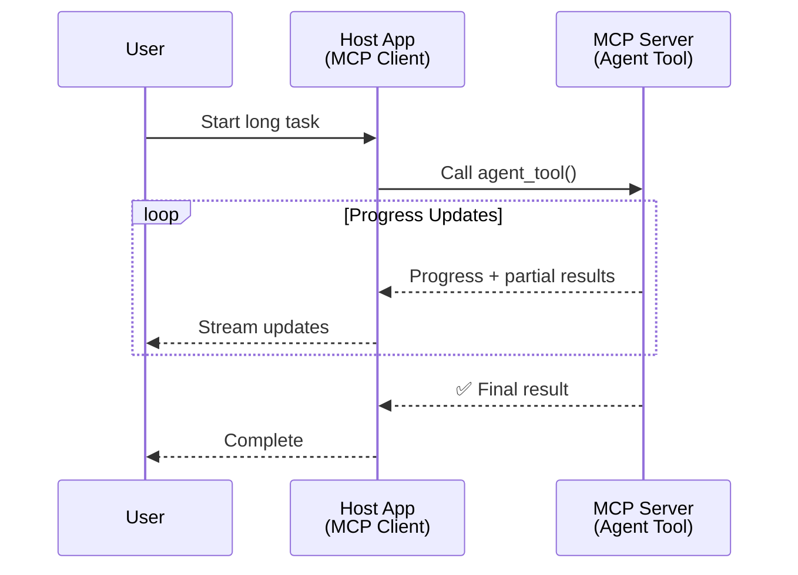
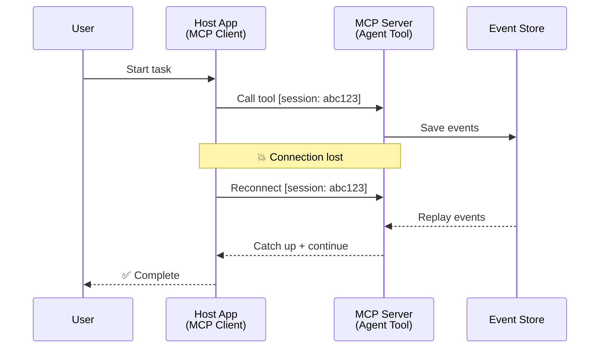
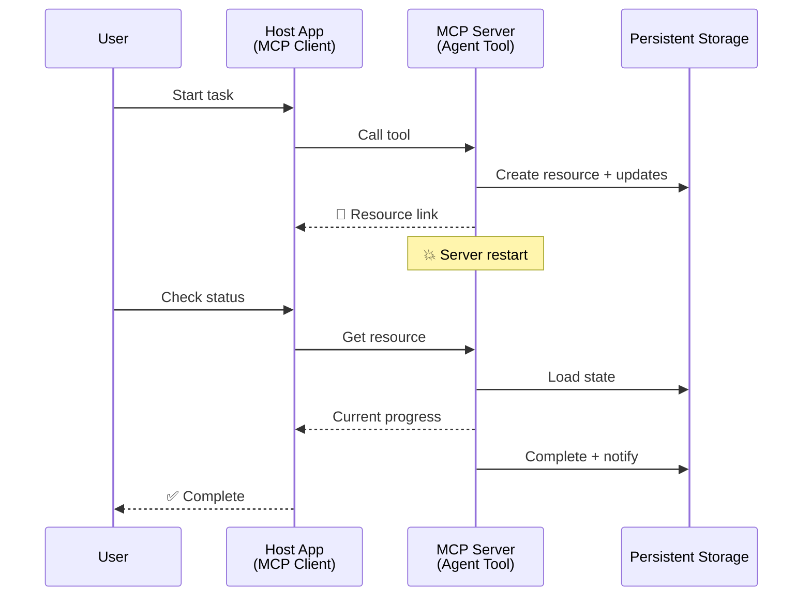
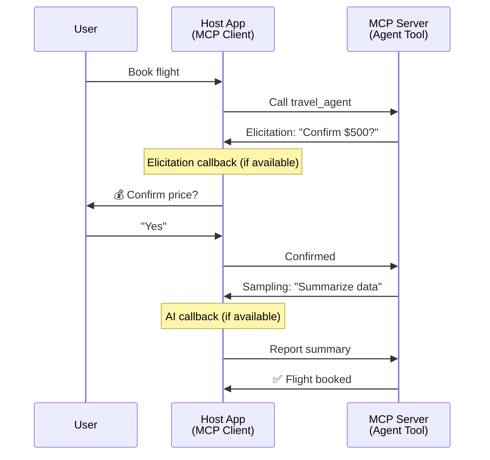
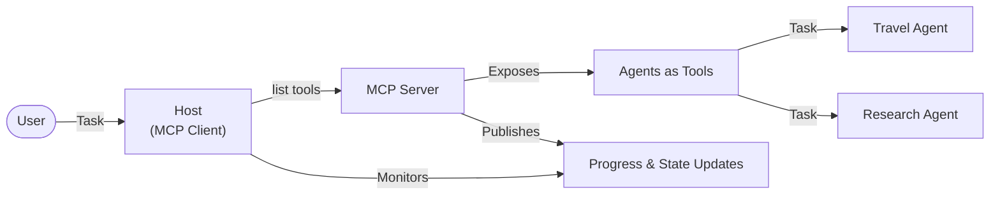

<!--
CO_OP_TRANSLATOR_METADATA:
{
  "original_hash": "5cc6836626047aa055e8960c8484a7d0",
  "translation_date": "2025-08-29T10:54:52+00:00",
  "source_file": "11-agentic-protocols/code_samples/mcp-agents/README.md",
  "language_code": "ne"
}
-->
# MCP प्रयोग गरेर एजेन्ट-देखि-एजेन्ट संचार प्रणाली निर्माण

> छोटकरीमा - के तपाई MCP मा Agent2Agent संचार प्रणाली निर्माण गर्न सक्नुहुन्छ? हो, सकिन्छ!

MCP आफ्नो प्रारम्भिक उद्देश्य "LLMs लाई सन्दर्भ प्रदान गर्ने" भन्दा धेरै परिपक्व भइसकेको छ। हालैका सुधारहरू जस्तै [resumable streams](https://modelcontextprotocol.io/docs/concepts/transports#resumability-and-redelivery), [elicitation](https://modelcontextprotocol.io/specification/2025-06-18/client/elicitation), [sampling](https://modelcontextprotocol.io/specification/2025-06-18/client/sampling), र सूचनाहरू ([progress](https://modelcontextprotocol.io/specification/2025-06-18/basic/utilities/progress) र [resources](https://modelcontextprotocol.io/specification/2025-06-18/schema#resourceupdatednotification)) को समावेशले MCP लाई जटिल एजेन्ट-देखि-एजेन्ट संचार प्रणाली निर्माणका लागि बलियो आधार प्रदान गरेको छ।

## एजेन्ट/टूलको भ्रम

जब धेरै विकासकर्ताहरूले एजेन्टिक व्यवहार भएका उपकरणहरू (लामो समयसम्म चल्ने, कार्यान्वयनको बीचमा थप इनपुट आवश्यक पर्ने, आदि) अन्वेषण गर्न थाल्छन्, एउटा सामान्य भ्रम यो छ कि MCP उपयुक्त छैन, मुख्यतः किनभने यसको प्रारम्भिक उपकरणहरूको उदाहरणले साधारण अनुरोध-प्रतिक्रिया ढाँचामा ध्यान केन्द्रित गरेको थियो।

यो धारणा अब पुरानो भइसकेको छ। पछिल्ला केही महिनामा MCP विशिष्टतामा भएका महत्वपूर्ण सुधारहरूले लामो समयसम्म चल्ने एजेन्टिक व्यवहार निर्माणका लागि आवश्यक क्षमताहरूको खाडललाई पूर्ति गरेका छन्:

- **Streaming & Partial Results**: कार्यान्वयनको क्रममा वास्तविक-समय प्रगति अद्यावधिकहरू
- **Resumability**: डिस्कनेक्शनपछि पुन: जडान र निरन्तरता
- **Durability**: परिणामहरू सर्भर पुनःसुरु भएपछि पनि सुरक्षित रहन्छन् (जस्तै, resource links मार्फत)
- **Multi-turn**: कार्यान्वयनको बीचमा अन्तरक्रियात्मक इनपुट (elicitation र sampling मार्फत)

यी सुविधाहरूलाई संयोजन गरेर जटिल एजेन्टिक र बहु-एजेन्ट अनुप्रयोगहरू सक्षम बनाउन सकिन्छ, जुन सबै MCP प्रोटोकलमा तैनाथ गर्न सकिन्छ।

सन्दर्भका लागि, हामी एजेन्टलाई "टूल" भनेर उल्लेख गर्नेछौं जुन MCP सर्भरमा उपलब्ध छ। यसको मतलब होस्ट एप्लिकेसनको अस्तित्व, जसले MCP क्लाइन्ट कार्यान्वयन गर्दछ, MCP सर्भरसँग सत्र स्थापना गर्दछ, र एजेन्टलाई कल गर्न सक्छ।

## के MCP टूललाई "एजेन्टिक" बनाउँछ?

कार्यान्वयनमा जानु अघि, लामो समयसम्म चल्ने एजेन्टहरूलाई समर्थन गर्न आवश्यक पूर्वाधार क्षमताहरू के हुन् भनेर स्पष्ट गरौं।

> हामी एजेन्टलाई यस्तो इकाईको रूपमा परिभाषित गर्नेछौं, जसले स्वतन्त्र रूपमा लामो समयसम्म सञ्चालन गर्न सक्छ, जटिल कार्यहरू सम्हाल्न सक्षम छ, जसमा वास्तविक-समय प्रतिक्रिया अनुसार धेरै अन्तरक्रियाहरू वा समायोजनहरू आवश्यक पर्न सक्छ।

### १. Streaming & Partial Results

पारम्परिक अनुरोध-प्रतिक्रिया ढाँचाहरू लामो समयसम्म चल्ने कार्यहरूको लागि उपयुक्त हुँदैनन्। एजेन्टहरूले निम्न प्रदान गर्न आवश्यक छ:

- वास्तविक-समय प्रगति अद्यावधिकहरू
- मध्यवर्ती परिणामहरू

**MCP समर्थन**: Resource update notifications ले आंशिक परिणामहरूको स्ट्रिमिङलाई सक्षम बनाउँछ, यद्यपि यो JSON-RPC को १:१ अनुरोध/प्रतिक्रिया मोडेलसँग द्वन्द्व टार्न सावधानीपूर्वक डिजाइन आवश्यक छ।

| सुविधा                     | प्रयोग केस                                                                                                                                                                       | MCP समर्थन                                                                                 |
| -------------------------- | ------------------------------------------------------------------------------------------------------------------------------------------------------------------------------ | ------------------------------------------------------------------------------------------ |
| वास्तविक-समय प्रगति अद्यावधिक | प्रयोगकर्ताले कोडबेस माइग्रेसन कार्य अनुरोध गर्छ। एजेन्टले प्रगति स्ट्रिम गर्छ: "१०% - निर्भरता विश्लेषण गर्दै... २५% - टाइपस्क्रिप्ट फाइलहरू रूपान्तरण गर्दै... ५०% - आयात अद्यावधिक गर्दै..."          | ✅ प्रगति सूचनाहरू                                                                  |
| आंशिक परिणामहरू            | "पुस्तक उत्पन्न गर्नुहोस्" कार्यले आंशिक परिणामहरू स्ट्रिम गर्छ, जस्तै, १) कथा चाप रूपरेखा, २) अध्याय सूची, ३) प्रत्येक अध्याय पूरा भएपछि। होस्टले कुनै पनि चरणमा निरीक्षण, रद्द, वा पुन: निर्देशन गर्न सक्छ। | ✅ सूचनाहरूलाई "विस्तारित" गर्न सकिन्छ, आंशिक परिणामहरू समावेश गर्न PR 383, 776 मा प्रस्तावहरू हेर्नुहोस् |

<div align="center" style="font-style: italic; font-size: 0.95em; margin-bottom: 0.5em;">
<strong>चित्र १:</strong> यो आरेखले देखाउँछ कि कसरी MCP एजेन्टले लामो समयसम्म चल्ने कार्यको क्रममा होस्ट एप्लिकेसनमा वास्तविक-समय प्रगति अद्यावधिकहरू र आंशिक परिणामहरू स्ट्रिम गर्छ, प्रयोगकर्तालाई कार्यान्वयन वास्तविक समयमा अनुगमन गर्न सक्षम बनाउँछ।
</div>



### २. Resumability

एजेन्टहरूले नेटवर्क अवरोधहरूलाई सहज रूपमा सम्हाल्न सक्षम हुनुपर्छ:

- (क्लाइन्ट) डिस्कनेक्शनपछि पुन: जडान
- जहाँबाट छोडिएको थियो, त्यहाँबाट निरन्तरता (सन्देश पुन: डेलिभरी)

**MCP समर्थन**: MCP StreamableHTTP ट्रान्सपोर्टले आज सत्र पुन: सुरु र सन्देश पुन: डेलिभरीलाई सत्र आईडीहरू र अन्तिम घटना आईडीहरूसँग समर्थन गर्दछ। यहाँ महत्त्वपूर्ण कुरा यो हो कि सर्भरले EventStore कार्यान्वयन गर्नुपर्छ, जसले क्लाइन्ट पुन: जडानमा घटनाहरू पुन: प्ले गर्न सक्षम बनाउँछ।  
ध्यान दिनुहोस् कि त्यहाँ एक समुदाय प्रस्ताव (PR #975) छ, जसले ट्रान्सपोर्ट-अज्ञेय पुन: सुरु गर्न मिल्ने स्ट्रिमहरूको अन्वेषण गर्दछ।

| सुविधा      | प्रयोग केस                                                                                                                                                   | MCP समर्थन                                                                |
| ------------ | ---------------------------------------------------------------------------------------------------------------------------------------------------------- | -------------------------------------------------------------------------- |
| Resumability | क्लाइन्ट लामो समयसम्म चल्ने कार्यको क्रममा डिस्कनेक्ट हुन्छ। पुन: जडानमा, सत्र पुन: सुरु हुन्छ, छुटेका घटनाहरू पुन: प्ले गरिन्छ, र जहाँबाट छोडिएको थियो, त्यहाँबाट निरन्तरता हुन्छ। | ✅ StreamableHTTP ट्रान्सपोर्ट सत्र आईडी, घटना पुन: प्ले, र EventStore को साथ |

<div align="center" style="font-style: italic; font-size: 0.95em; margin-bottom: 0.5em;">
<strong>चित्र २:</strong> यो आरेखले देखाउँछ कि कसरी MCP को StreamableHTTP ट्रान्सपोर्ट र EventStore ले सहज सत्र पुन: सुरु गर्न सक्षम बनाउँछ: यदि क्लाइन्ट डिस्कनेक्ट हुन्छ भने, यो पुन: जडान गर्न र छुटेका घटनाहरू पुन: प्ले गर्न सक्छ, प्रगति गुमाउनु बिना कार्य निरन्तरता गर्दै।
</div>



### ३. Durability

लामो समयसम्म चल्ने एजेन्टहरूले स्थायी अवस्थाको आवश्यकता पर्छ:

- परिणामहरू सर्भर पुनःसुरु भएपछि पनि सुरक्षित रहन्छन्
- स्थिति बाहिरबाट पुन: प्राप्त गर्न सकिन्छ
- सत्रहरूमा प्रगति ट्र्याकिङ

**MCP समर्थन**: MCP ले अब टूल कलहरूको लागि Resource link return प्रकारलाई समर्थन गर्दछ। आज, सम्भावित ढाँचा भनेको एउटा टूल डिजाइन गर्नु हो, जसले एउटा स्रोत सिर्जना गर्छ र तुरुन्तै स्रोत लिङ्क फिर्ता गर्छ। टूलले पृष्ठभूमिमा कार्यलाई सम्बोधन गर्न जारी राख्न सक्छ र स्रोतलाई अद्यावधिक गर्न सक्छ। बदलेमा, क्लाइन्टले यो स्रोतको स्थिति प्राप्त गर्न आंशिक वा पूर्ण परिणामहरू प्राप्त गर्न (सर्भरले प्रदान गर्ने स्रोत अद्यावधिकहरूमा आधारित) वा अद्यावधिकहरूको लागि स्रोतलाई सदस्यता लिन छनोट गर्न सक्छ।

यहाँ एउटा सीमितता भनेको स्रोतहरूलाई पोल गर्नु वा अद्यावधिकहरूको लागि सदस्यता लिनु स्रोतहरू खपत गर्न सक्छ, जसले स्केलमा प्रभाव पार्न सक्छ। त्यहाँ एउटा खुला समुदाय प्रस्ताव (जसमा #992 समावेश छ) छ, जसले वेबहुकहरू वा ट्रिगरहरू समावेश गर्ने सम्भावनाको अन्वेषण गर्दछ, जसले सर्भरले अद्यावधिकहरूको लागि क्लाइन्ट/होस्ट एप्लिकेसनलाई सूचित गर्न कल गर्न सक्छ।

| सुविधा    | प्रयोग केस                                                                                                                                        | MCP समर्थन                                                        |
| ---------- | ----------------------------------------------------------------------------------------------------------------------------------------------- | ------------------------------------------------------------------ |
| Durability | सर्भर डाटा माइग्रेसन कार्यको क्रममा क्र्यास हुन्छ। परिणामहरू र प्रगति पुनःसुरु भएपछि सुरक्षित रहन्छ, क्लाइन्टले स्थिति जाँच गर्न र स्थायी स्रोतबाट निरन्तरता गर्न सक्छ। | ✅ Resource links स्थायी भण्डारण र स्थिति सूचनाहरूको साथ |

आज, एउटा सामान्य ढाँचा भनेको एउटा टूल डिजाइन गर्नु हो, जसले एउटा स्रोत सिर्जना गर्छ र तुरुन्तै स्रोत लिङ्क फिर्ता गर्छ। टूलले पृष्ठभूमिमा कार्यलाई सम्बोधन गर्न जारी राख्न सक्छ, स्रोत सूचनाहरू जारी गर्न सक्छ, जसले प्रगति अद्यावधिकहरू वा आंशिक परिणामहरूका रूपमा काम गर्छ, र आवश्यकतानुसार स्रोतको सामग्री अद्यावधिक गर्न सक्छ।

<div align="center" style="font-style: italic; font-size: 0.95em; margin-bottom: 0.5em;">
<strong>चित्र ३:</strong> यो आरेखले देखाउँछ कि कसरी MCP एजेन्टहरूले स्थायी स्रोतहरू र स्थिति सूचनाहरू प्रयोग गरेर लामो समयसम्म चल्ने कार्यहरू सर्भर पुनःसुरु भए पनि सुरक्षित राख्छन्, क्लाइन्टलाई प्रगति जाँच गर्न र असफलतापछि पनि परिणामहरू पुन: प्राप्त गर्न अनुमति दिन्छ।
</div>



### ४. Multi-Turn Interactions

एजेन्टहरूले कार्यान्वयनको बीचमा थप इनपुट आवश्यक पर्न सक्छ:

- मानव स्पष्टीकरण वा स्वीकृति
- जटिल निर्णयहरूको लागि AI सहायता
- गतिशील प्यारामिटर समायोजन

**MCP समर्थन**: Sampling (AI इनपुटको लागि) र elicitation (मानव इनपुटको लागि) मार्फत पूर्ण रूपमा समर्थित।

| सुविधा                 | प्रयोग केस                                                                                                                                     | MCP समर्थन                                           |
| ----------------------- | -------------------------------------------------------------------------------------------------------------------------------------------- | ----------------------------------------------------- |
| Multi-Turn Interactions | यात्रा बुकिङ एजेन्टले प्रयोगकर्ताबाट मूल्य पुष्टि अनुरोध गर्छ, त्यसपछि बुकिङ लेनदेन पूरा गर्नु अघि यात्रा डाटालाई संक्षेप गर्न AI लाई सोध्छ। | ✅ मानव इनपुटको लागि Elicitation, AI इनपुटको लागि Sampling |

<div align="center" style="font-style: italic; font-size: 0.95em; margin-bottom: 0.5em;">
<strong>चित्र ४:</strong> यो आरेखले देखाउँछ कि कसरी MCP एजेन्टहरूले अन्तरक्रियात्मक रूपमा मानव इनपुट प्राप्त गर्न वा कार्यान्वयनको बीचमा AI सहायता अनुरोध गर्न सक्छन्, जटिल, बहु-चरणीय कार्यप्रवाहहरू जस्तै पुष्टि र गतिशील निर्णय-निर्माणलाई समर्थन गर्दै।
</div>



## MCP मा लामो समयसम्म चल्ने एजेन्टहरूको कार्यान्वयन - कोड अवलोकन

यस लेखको भागको रूपमा, हामीले [कोड रिपोजिटरी](https://github.com/victordibia/ai-tutorials/tree/main/MCP%20Agents) प्रदान गरेका छौं, जसमा MCP Python SDK प्रयोग गरेर StreamableHTTP ट्रान्सपोर्टको साथ सत्र पुन: सुरु र सन्देश पुन: डेलिभरीको साथ लामो समयसम्म चल्ने एजेन्टहरूको पूर्ण कार्यान्वयन समावेश छ। कार्यान्वयनले कसरी MCP क्षमताहरूलाई संयोजन गरेर परिष्कृत एजेन्ट-जस्तै व्यवहारहरू सक्षम गर्न सकिन्छ भन्ने देखाउँछ।

विशेष रूपमा, हामीले दुई प्राथमिक एजेन्ट टूलहरू भएको सर्भर कार्यान्वयन गरेका छौं:

- **Travel Agent** - मूल्य पुष्टि मार्फत यात्रा बुकिङ सेवा अनुकरण गर्दछ
- **Research Agent** - AI-सहायता प्राप्त संक्षेप मार्फत अनुसन्धान कार्यहरू प्रदर्शन गर्दछ

दुवै एजेन्टहरूले वास्तविक-समय प्रगति अद्यावधिकहरू, अन्तरक्रियात्मक पुष्टि, र पूर्ण सत्र पुन: सुरु क्षमताहरू प्रदर्शन गर्छन्।

### प्रमुख कार्यान्वयन अवधारणाहरू

तलका खण्डहरूले प्रत्येक क्षमताको लागि सर्भर-पक्षीय एजेन्ट कार्यान्वयन र क्लाइन्ट-पक्षीय होस्ट ह्यान्डलिङ देखाउँछन्:

#### Streaming & Progress Updates - वास्तविक-समय कार्य स्थिति

Streaming ले एजेन्टहरूलाई लामो समयसम्म चल्ने कार्यहरूको क्रममा वास्तविक-समय प्रगति अद्यावधिकहरू प्रदान गर्न सक्षम बनाउँछ, प्रयोगकर्ताहरूलाई कार्य स्थिति र मध्यवर्ती परिणामहरूको जानकारी राख्दै।

**सर्भर कार्यान्वयन (एजेन्टले प्रगति सूचनाहरू पठाउँछ):**

```python
# From server/server.py - Travel agent sending progress updates
for i, step in enumerate(steps):
    await ctx.session.send_progress_notification(
        progress_token=ctx.request_id,
        progress=i * 25,
        total=100,
        message=step,
        related_request_id=str(ctx.request_id)
    )
    await anyio.sleep(2)  # Simulate work

# Alternative: Log messages for detailed step-by-step updates
await ctx.session.send_log_message(
    level="info",
    data=f"Processing step {current_step}/{steps} ({progress_percent}%)",
    logger="long_running_agent",
    related_request_id=ctx.request_id,
)
```

**क्लाइन्ट कार्यान्वयन (होस्टले प्रगति अद्यावधिकहरू प्राप्त गर्छ):**

```python
# From client/client.py - Client handling real-time notifications
async def message_handler(message) -> None:
    if isinstance(message, types.ServerNotification):
        if isinstance(message.root, types.LoggingMessageNotification):
            console.print(f"📡 [dim]{message.root.params.data}[/dim]")
        elif isinstance(message.root, types.ProgressNotification):
            progress = message.root.params
            console.print(f"🔄 [yellow]{progress.message} ({progress.progress}/{progress.total})[/yellow]")

# Register message handler when creating session
async with ClientSession(
    read_stream, write_stream,
    message_handler=message_handler
) as session:
```

#### Elicitation - प्रयोगकर्ताको इनपुट अनुरोध गर्दै

Elicitation ले एजेन्टहरूलाई कार्यान्वयनको बीचमा प्रयोगकर्ताको इनपुट अनुरोध गर्न सक्षम बनाउँछ। यो लामो समयसम्म चल्ने कार्यहरूको क्रममा पुष्टि, स्पष्टीकरण, वा स्वीकृतिका लागि आवश्यक छ।

**सर्भर कार्यान्वयन (एजेन्टले पुष्टि अनुरोध गर्छ):**

```python
# From server/server.py - Travel agent requesting price confirmation
elicit_result = await ctx.session.elicit(
    message=f"Please confirm the estimated price of $1200 for your trip to {destination}",
    requestedSchema=PriceConfirmationSchema.model_json_schema(),
    related_request_id=ctx.request_id,
)

if elicit_result and elicit_result.action == "accept":
    # Continue with booking
    logger.info(f"User confirmed price: {elicit_result.content}")
elif elicit_result and elicit_result.action == "decline":
    # Cancel the booking
    booking_cancelled = True
```

**क्लाइन्ट कार्यान्वयन (होस्टले elicitation callback प्रदान गर्छ):**

```python
# From client/client.py - Client handling elicitation requests
async def elicitation_callback(context, params):
    console.print(f"💬 Server is asking for confirmation:")
    console.print(f"   {params.message}")

    response = console.input("Do you accept? (y/n): ").strip().lower()

    if response in ['y', 'yes']:
        return types.ElicitResult(
            action="accept",
            content={"confirm": True, "notes": "Confirmed by user"}
        )
    else:
        return types.ElicitResult(
            action="decline",
            content={"confirm": False, "notes": "Declined by user"}
        )

# Register the callback when creating the session
async with ClientSession(
    read_stream, write_stream,
    elicitation_callback=elicitation_callback
) as session:
```

#### Sampling - AI सहायता अनुरोध गर्दै

Sampling ले एजेन्टहरूलाई कार्यान्वयनको क्रममा जटिल निर्णयहरू वा सामग्री उत्पादनका लागि LLM सहायता अनुरोध गर्न सक्षम बनाउँछ। यसले मानव-AI हाइब्रिड कार्यप्रवाहहरूलाई सक्षम बनाउँछ।

**सर्भर कार्यान्वयन (एजेन्टले AI सहायता अनुरोध गर्छ):**

```python
# From server/server.py - Research agent requesting AI summary
sampling_result = await ctx.session.create_message(
    messages=[
        SamplingMessage(
            role="user",
            content=TextContent(type="text", text=f"Please summarize the key findings for research on: {topic}")
        )
    ],
    max_tokens=100,
    related_request_id=ctx.request_id,
)

if sampling_result and sampling_result.content:
    if sampling_result.content.type == "text":
        sampling_summary = sampling_result.content.text
        logger.info(f"Received sampling summary: {sampling_summary}")
```

**क्लाइन्ट कार्यान्वयन (होस्टले sampling callback प्रदान गर्छ):**

```python
# From client/client.py - Client handling sampling requests
async def sampling_callback(context, params):
    message_text = params.messages[0].content.text if params.messages else 'No message'
    console.print(f"🧠 Server requested sampling: {message_text}")

    # In a real application, this could call an LLM API
    # For demo purposes, we provide a mock response
    mock_response = "Based on current research, MCP has evolved significantly..."

    return types.CreateMessageResult(
        role="assistant",
        content=types.TextContent(type="text", text=mock_response),
        model="interactive-client",
        stopReason="endTurn"
    )

# Register the callback when creating the session
async with ClientSession(
    read_stream, write_stream,
    sampling_callback=sampling_callback,
    elicitation_callback=elicitation_callback
) as session:
```

#### Resumability - डिस्कनेक्शनपछिको सत्र निरन्तरता

Resumability ले लामो समयसम्म चल्ने एजेन्ट कार्यहरूले क्लाइन्ट डिस्कनेक्शनहरूलाई सहन र पुन: जडानमा सहज रूपमा निरन्तरता दिन सुनिश्चित गर्दछ। यो EventStore र पुन: सुरु टोकनहरूको माध्यमबाट कार्यान्वयन गरिएको छ।

**Event Store कार्यान्वयन (सर्भरले सत्र स्थिति राख्छ):**

```python
# From server/event_store.py - Simple in-memory event store
class SimpleEventStore(EventStore):
    def __init__(self):
        self._events: list[tuple[StreamId, EventId, JSONRPCMessage]] = []
        self._event_id_counter = 0

    async def store_event(self, stream_id: StreamId, message: JSONRPCMessage) -> EventId:
        """Store an event and return its ID."""
        self._event_id_counter += 1
        event_id = str(self._event_id_counter)
        self._events.append((stream_id, event_id, message))
        return event_id

    async def replay_events_after(self, last_event_id: EventId, send_callback: EventCallback) -> StreamId | None:
        """Replay events after the specified ID for resumption."""
        # Find events after the last known event and replay them
        for _, event_id, message in self._events[start_index:]:
            await send_callback(EventMessage(message, event_id))

# From server/server.py - Passing event store to session manager
def create_server_app(event_store: Optional[EventStore] = None) -> Starlette:
    server = ResumableServer()

    # Create session manager with event store for resumption
    session_manager = StreamableHTTPSessionManager(
        app=server,
        event_store=event_store,  # Event store enables session resumption
        json_response=False,
        security_settings=security_settings,
    )

    return Starlette(routes=[Mount("/mcp", app=session_manager.handle_request)])

# Usage: Initialize with event store
event_store = SimpleEventStore()
app = create_server_app(event_store)
```

**क्लाइन्ट मेटाडाटा पुन: सुरु टोकनको साथ (क्लाइन्टले भण्डारित स्थितिको प्रयोग गरेर पुन: जडान गर्छ):**

```python
# From client/client.py - Client resumption with metadata
if existing_tokens and existing_tokens.get("resumption_token"):
    # Use existing resumption token to continue where we left off
    metadata = ClientMessageMetadata(
        resumption_token=existing_tokens["resumption_token"],
    )
else:
    # Create callback to save resumption token when received
    def enhanced_callback(token: str):
        protocol_version = getattr(session, 'protocol_version', None)
        token_manager.save_tokens(session_id, token, protocol_version, command, args)

    metadata = ClientMessageMetadata(
        on_resumption_token_update=enhanced_callback,
    )

# Send request with resumption metadata
result = await session.send_request(
    types.ClientRequest(
        types.CallToolRequest(
            method="tools/call",
            params=types.CallToolRequestParams(name=command, arguments=args)
        )
    ),
    types.CallToolResult,
    metadata=metadata,
)
```

होस्ट एप्लिकेसनले सत्र आईडीहरू र पुन: सुरु टोकनहरू स्थानीय रूपमा राख्छ, जसले यसलाई प्रगति वा स्थिति गुमाउनु बिना विद्यमान सत्रहरूमा पुन: जडान गर्न सक्षम बनाउँछ।

### कोड संगठन

<div align="center" style="font-style: italic; font-size: 0.95em; margin-bottom: 0.5em;">
<strong>चित्र ५:</strong> MCP-आधारित एजेन्ट प्रणाली वास्तुकला
</div>



**मुख्य फाइलहरू:**

- **`server/server.py`** - यात्रा र अनुसन्धान एजेन्टहरूसँग पुन: सुरु गर्न मिल्ने MCP सर्भर, जसले elicitation, sampling, र प्रगति अद्यावधिकहरू प्रदर्शन गर्दछ
- **`client/client.py`** - अन्तरक्रियात्मक होस्ट एप्लिकेसन, पुन: सुरु समर्थन, callback ह्यान्डलरहरू, र टोकन व्यवस्थापनको साथ
- **`server/event_store.py`** - सत्र पुन: सुरु र सन्देश पुन: डेलिभरी सक्षम गर्ने Event Store कार्यान्वयन

## MCP मा बहु-एजेन्ट संचारमा विस्तार

माथिको कार्यान्वयनलाई होस्ट एप्लिकेसनको बुद्धिमत्ता र दायरालाई बढाएर बहु-एजेन्ट प्रणालीहरूमा विस्तार गर्न सकिन्छ:

- **बुद्धिमान कार्य विघटन**: होस्टले जटिल प्रयोगकर्ता अनुरोधहरूको विश्लेषण गर्छ र तिनीहरूलाई विभिन्न विशेषज्ञ एजेन्टहरूको लागि उपकार्यहरूमा विभाजन गर्छ
- **बहु-सर्भर समन्वय**: होस्टले विभिन्न एजेन्ट क्षमताहरू प्रदर्शन गर्ने प्रत्येक MCP सर्भरसँग जडानहरू कायम राख्छ
- **कार्य स्थिति व्यवस्थापन**: होस्टले धेरै समवर्ती एजेन्ट कार्यहरूको प्रगति ट्र्याक गर्छ, निर्भरताहरू र अनुक्रमणलाई सम्हाल्छ
- **लचिलोपन र पुन: प्रयासहरू**: होस्टले असफलताहरू व्यवस्थापन गर्छ, पुन: प्रयास तर्क कार्यान्वयन गर्छ, र एजेन्टहरू अनुपलब्ध हुँदा कार्यहरू पुन: मार्गनिर्देशन गर्छ
- **परिणाम संश्लेषण**: होस्टले धेरै एजेन्टहरूबाट प्राप्त आउटपुटहरूलाई एकीकृत अन्तिम परिणामहरूमा संयोजन गर्छ

होस्ट एक साधारण क्लाइन्टबाट एक बुद्धिमान समन्वयकर्तामा विकसित हुन्छ, वितरित एजेन्ट क्षमताहरूलाई समन्वय गर्दै, जबकि उही MCP प्रोटोकल आधार कायम राख्दै।

## निष्कर्ष

MCP का उन्नत क्षमताहरू - resource notifications, elicitation/sampling, resumable streams, र persistent resources - ले जटिल एजेन्ट-देखि-एजेन्ट अन्तरक्रियाहरूलाई सक्षम बनाउँछ, जबकि प्रोटोकलको सरलता कायम राख्छ।

## सुरु गर्दै

आफ्नै agent2agent

---

**अस्वीकरण**:  
यो दस्तावेज़ AI अनुवाद सेवा [Co-op Translator](https://github.com/Azure/co-op-translator) प्रयोग गरेर अनुवाद गरिएको छ। हामी शुद्धताको लागि प्रयास गर्छौं, तर कृपया ध्यान दिनुहोस् कि स्वचालित अनुवादमा त्रुटिहरू वा अशुद्धताहरू हुन सक्छ। यसको मूल भाषा मा रहेको मूल दस्तावेज़लाई आधिकारिक स्रोत मानिनुपर्छ। महत्वपूर्ण जानकारीको लागि, व्यावसायिक मानव अनुवाद सिफारिस गरिन्छ। यस अनुवादको प्रयोगबाट उत्पन्न हुने कुनै पनि गलतफहमी वा गलत व्याख्याको लागि हामी जिम्मेवार हुने छैनौं।