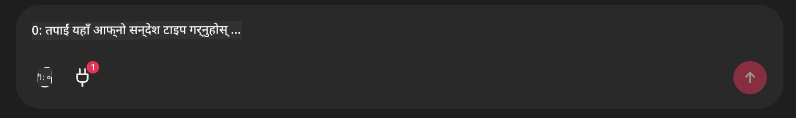

<!--
CO_OP_TRANSLATOR_METADATA:
{
  "original_hash": "9bf0395cbc541ce8db2a9699c8678dfc",
  "translation_date": "2025-07-12T14:21:36+00:00",
  "source_file": "11-mcp/code_samples/github-mcp/README.md",
  "language_code": "ne"
}
-->
# Github MCP Server उदाहरण

## विवरण

यो Microsoft Reactor मार्फत आयोजित AI Agents Hackathon का लागि बनाइएको डेमो हो।

यो उपकरणले प्रयोगकर्ताको Github रिपोजमा आधारित ह्याकाथन प्रोजेक्टहरू सिफारिस गर्न प्रयोग गरिन्छ।  
यो यसरी गरिन्छ:

1. **Github Agent** - Github MCP Server प्रयोग गरेर रिपोज र ती रिपोजका बारेमा जानकारी प्राप्त गर्ने।  
2. **Hackathon Agent** - Github Agent बाट प्राप्त डाटालाई लिएर प्रयोगकर्ताले प्रयोग गरेका प्रोजेक्टहरू, भाषाहरू र AI Agents ह्याकाथनका प्रोजेक्ट ट्र्याकहरूमा आधारित सिर्जनात्मक ह्याकाथन प्रोजेक्ट आइडियाहरू निकाल्ने।  
3. **Events Agent** - ह्याकाथन एजेन्टको सुझाव अनुसार, Events Agent ले AI Agent Hackathon सिरिजका सान्दर्भिक कार्यक्रमहरू सिफारिस गर्ने।  

## कोड चलाउने तरिका

### Environment Variables

यो डेमोले Azure Open AI Service, Semantic Kernel, Github MCP Server र Azure AI Search प्रयोग गर्छ।

यी उपकरणहरू प्रयोग गर्नका लागि आवश्यक Environment Variables सही तरिकाले सेट गरिएको छ भनी सुनिश्चित गर्नुहोस्:

```python
AZURE_OPENAI_CHAT_DEPLOYMENT_NAME=""
AZURE_OPENAI_EMBEDDING_DEPLOYMENT_NAME=""
AZURE_OPENAI_ENDPOINT=""
AZURE_OPENAI_API_KEY=""
AZURE_OPENAI_API_VERSION=""
AZURE_SEARCH_SERVICE_ENDPOINT=""
AZURE_SEARCH_API_KEY=""
```

## Chainlit Server चलाउने तरिका

MCP server सँग जडान गर्न, यो डेमोले Chainlit लाई च्याट इन्टरफेसको रूपमा प्रयोग गर्छ।

सर्भर चलाउन, तपाईँको टर्मिनलमा तलको कमाण्ड प्रयोग गर्नुहोस्:

```bash
chainlit run app.py -w
```

यसले तपाईँको Chainlit सर्भर `localhost:8000` मा सुरु गर्नेछ र Azure AI Search Index मा `event-descriptions.md` को सामग्री पनि भर्नेछ।

## MCP Server सँग जडान गर्ने तरिका

Github MCP Server सँग जडान गर्न, "Type your message here.." च्याट बक्स मुनि रहेको "plug" आइकन चयन गर्नुहोस्:



त्यसपछि "Connect an MCP" मा क्लिक गरेर Github MCP Server सँग जडान गर्ने कमाण्ड थप्न सक्नुहुन्छ:

```bash
npx -y @modelcontextprotocol/server-github --env GITHUB_PERSONAL_ACCESS_TOKEN=[YOUR PERSONAL ACCESS TOKEN]
```

"[YOUR PERSONAL ACCESS TOKEN]" लाई आफ्नो वास्तविक Personal Access Token ले प्रतिस्थापन गर्नुहोस्।

जडान भएपछि, plug आइकनको छेउमा (1) देखिनु पर्नेछ जसले जडान पुष्टि गर्छ। नदेखिएमा, `chainlit run app.py -w` कमाण्डले Chainlit सर्भर पुनः सुरु गरेर प्रयास गर्नुहोस्।

## डेमो प्रयोग गर्ने तरिका

ह्याकाथन प्रोजेक्ट सिफारिस गर्ने एजेन्ट वर्कफ्लो सुरु गर्न, तपाईँले यस्तो सन्देश टाइप गर्न सक्नुहुन्छ:

"Recommend hackathon projects for the Github user koreyspace"

Router Agent ले तपाईँको अनुरोध विश्लेषण गरी कुन एजेन्टहरूको संयोजन (GitHub, Hackathon, र Events) तपाईँको प्रश्नको लागि उपयुक्त छ निर्धारण गर्नेछ। यी एजेन्टहरूले सँगै काम गरी GitHub रिपोज विश्लेषण, प्रोजेक्ट आइडियाकरण र सान्दर्भिक टेक कार्यक्रमहरूमा आधारित व्यापक सिफारिसहरू प्रदान गर्नेछन्।

**अस्वीकरण**:  
यो दस्तावेज AI अनुवाद सेवा [Co-op Translator](https://github.com/Azure/co-op-translator) प्रयोग गरी अनुवाद गरिएको हो। हामी शुद्धताका लागि प्रयासरत छौं, तर कृपया ध्यान दिनुहोस् कि स्वचालित अनुवादमा त्रुटि वा अशुद्धता हुन सक्छ। मूल दस्तावेज यसको मूल भाषामा नै अधिकारिक स्रोत मानिनु पर्छ। महत्वपूर्ण जानकारीका लागि व्यावसायिक मानव अनुवाद सिफारिस गरिन्छ। यस अनुवादको प्रयोगबाट उत्पन्न कुनै पनि गलतफहमी वा गलत व्याख्याका लागि हामी जिम्मेवार छैनौं।