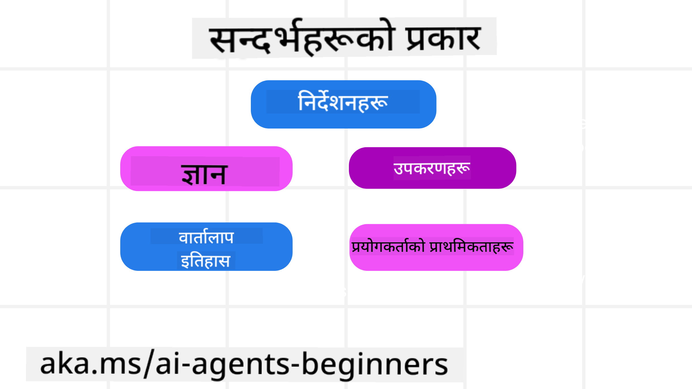

<!--
CO_OP_TRANSLATOR_METADATA:
{
  "original_hash": "cb7e50f471905ce6fdb92a30269a7a98",
  "translation_date": "2025-09-04T09:57:37+00:00",
  "source_file": "12-context-engineering/README.md",
  "language_code": "ne"
}
-->
# एआई एजेन्टहरूको लागि सन्दर्भ इन्जिनियरिङ

> _(माथिको चित्रमा क्लिक गरेर यस पाठको भिडियो हेर्नुहोस्)_

तपाईंले निर्माण गर्न लागेको एआई एजेन्टको अनुप्रयोगको जटिलता बुझ्नु विश्वसनीय एआई एजेन्ट बनाउन महत्त्वपूर्ण छ। हामीलाई यस्तो एआई एजेन्ट निर्माण गर्न आवश्यक छ जसले जानकारीलाई प्रभावकारी रूपमा व्यवस्थापन गर्न सक्दछ र जटिल आवश्यकताहरूलाई सम्बोधन गर्न सक्दछ, केवल प्रम्प्ट इन्जिनियरिङभन्दा पर।

यस पाठमा, हामी सन्दर्भ इन्जिनियरिङ के हो र एआई एजेन्ट निर्माणमा यसको भूमिका के हो भन्ने कुरा हेर्नेछौं।

## परिचय

यस पाठले समेट्नेछ:

• **सन्दर्भ इन्जिनियरिङ के हो** र किन यो प्रम्प्ट इन्जिनियरिङभन्दा फरक छ।

• **प्रभावकारी सन्दर्भ इन्जिनियरिङका रणनीतिहरू**, जसमा जानकारी लेख्ने, चयन गर्ने, संक्षिप्त गर्ने, र अलग गर्ने तरिकाहरू समावेश छन्।

• **सामान्य सन्दर्भ असफलताहरू** जसले तपाईंको एआई एजेन्टलाई अवरोध गर्न सक्छन् र तिनीहरूलाई कसरी सुधार गर्ने।

## सिकाइका लक्ष्यहरू

यस पाठ पूरा गरेपछि, तपाईंलाई थाहा हुनेछ:

• **सन्दर्भ इन्जिनियरिङ परिभाषित गर्ने** र यसलाई प्रम्प्ट इन्जिनियरिङबाट फरक पार्ने।

• **ठूला भाषा मोडेल (LLM) अनुप्रयोगहरूमा सन्दर्भका प्रमुख घटकहरू पहिचान गर्ने।**

• **एजेन्टको प्रदर्शन सुधार गर्न सन्दर्भ लेख्ने, चयन गर्ने, संक्षिप्त गर्ने, र अलग गर्ने रणनीतिहरू लागू गर्ने।**

• **सामान्य सन्दर्भ असफलताहरू** जस्तै विषाक्तता, विचलन, भ्रम, र टकरावलाई पहिचान गर्ने र समाधान गर्ने प्रविधिहरू कार्यान्वयन गर्ने।

## सन्दर्भ इन्जिनियरिङ के हो?

एआई एजेन्टहरूको लागि, सन्दर्भले एआई एजेन्टलाई निश्चित कार्यहरू गर्न योजना बनाउन प्रेरित गर्दछ। सन्दर्भ इन्जिनियरिङ भनेको एआई एजेन्टसँग कार्यको अर्को चरण पूरा गर्न आवश्यक सही जानकारी सुनिश्चित गर्ने अभ्यास हो। सन्दर्भ विन्डोको आकार सीमित छ, त्यसैले एजेन्ट निर्माणकर्ताहरूको रूपमा हामीले सन्दर्भ विन्डोमा जानकारी थप्ने, हटाउने, र संक्षिप्त गर्ने प्रणाली र प्रक्रिया निर्माण गर्न आवश्यक छ।

### प्रम्प्ट इन्जिनियरिङ बनाम सन्दर्भ इन्जिनियरिङ

प्रम्प्ट इन्जिनियरिङ एक स्थिर निर्देशन सेटमा केन्द्रित छ जसले एआई एजेन्टहरूलाई नियमहरूको सेटसँग प्रभावकारी रूपमा मार्गदर्शन गर्दछ। सन्दर्भ इन्जिनियरिङ भनेको गतिशील जानकारीको सेट व्यवस्थापन गर्ने तरिका हो, जसमा प्रारम्भिक प्रम्प्ट पनि समावेश छ, ताकि एआई एजेन्टसँग समयसँगै आवश्यक जानकारी होस्। सन्दर्भ इन्जिनियरिङको मुख्य विचार यो प्रक्रिया दोहोर्याउन मिल्ने र विश्वसनीय बनाउनु हो।

### सन्दर्भका प्रकारहरू

सन्दर्भ केवल एक कुरा होइन भन्ने कुरा सम्झनु महत्त्वपूर्ण छ। एआई एजेन्टलाई आवश्यक जानकारी विभिन्न स्रोतहरूबाट आउन सक्छ, र यो सुनिश्चित गर्नु हाम्रो जिम्मेवारी हो कि एजेन्टसँग ती स्रोतहरूमा पहुँच होस्:

एआई एजेन्टले व्यवस्थापन गर्नुपर्ने सन्दर्भका प्रकारहरूमा समावेश छन्:

• **निर्देशनहरू:** यी एजेन्टका "नियमहरू" जस्तै हुन् – प्रम्प्टहरू, प्रणाली सन्देशहरू, केही-शट उदाहरणहरू (एआईलाई कसरी केही गर्न देखाउने), र यसले प्रयोग गर्न सक्ने उपकरणहरूको विवरण। यहाँ प्रम्प्ट इन्जिनियरिङको ध्यान सन्दर्भ इन्जिनियरिङसँग मिल्छ।

• **ज्ञान:** तथ्यहरू, डेटाबेसबाट पुनःप्राप्त जानकारी, वा एजेन्टले संकलन गरेको दीर्घकालीन स्मृतिहरू समेट्छ। यदि एजेन्टलाई विभिन्न ज्ञान भण्डार र डेटाबेसहरूमा पहुँच आवश्यक छ भने, यसमा पुनःप्राप्ति संवर्धित उत्पादन (RAG) प्रणाली समावेश छ।

• **उपकरणहरू:** बाह्य कार्यहरू, एपीआईहरू, र MCP सर्भरहरूको परिभाषा जसलाई एजेन्टले कल गर्न सक्छ, साथै तिनीहरू प्रयोग गर्दा प्राप्त हुने प्रतिक्रिया (परिणाम)।

• **वार्तालाप इतिहास:** प्रयोगकर्तासँगको चलिरहेको संवाद। समयसँगै, यी वार्तालापहरू लामो र जटिल बन्छन् जसले सन्दर्भ विन्डोमा ठाउँ लिन्छ।

• **प्रयोगकर्ता प्राथमिकताहरू:** समयसँग प्रयोगकर्ताको मनपर्ने वा नपसन्द जानकारी सिकिएको। यी प्रमुख निर्णयहरू गर्दा प्रयोगकर्तालाई सहयोग गर्न भण्डारण गरिन सक्छन्।

## प्रभावकारी सन्दर्भ इन्जिनियरिङका रणनीतिहरू

### योजना बनाउने रणनीतिहरू

राम्रो सन्दर्भ इन्जिनियरिङ राम्रो योजना बनाउनेबाट सुरु हुन्छ। यहाँ सन्दर्भ इन्जिनियरिङको अवधारणा लागू गर्न सोच्न मद्दत गर्ने एउटा दृष्टिकोण छ:

1. **स्पष्ट परिणामहरू परिभाषित गर्नुहोस्** - एआई एजेन्टहरूलाई दिइने कार्यहरूको परिणाम स्पष्ट रूपमा परिभाषित गर्नुपर्छ। प्रश्नको उत्तर दिनुहोस् - "एआई एजेन्टले आफ्नो कार्य पूरा गरेपछि संसार कस्तो देखिनेछ?" अर्को शब्दमा, प्रयोगकर्ताले एआई एजेन्टसँग अन्तर्क्रिया गरेपछि के परिवर्तन, जानकारी, वा प्रतिक्रिया पाउनुपर्छ।

2. **सन्दर्भको नक्सा बनाउनुहोस्** - एकपटक तपाईंले एआई एजेन्टको परिणाम परिभाषित गरेपछि, तपाईंले "एआई एजेन्टले यो कार्य पूरा गर्न के जानकारी चाहिन्छ?" भन्ने प्रश्नको उत्तर दिनुपर्छ। यसरी तपाईंले त्यो जानकारी कहाँ अवस्थित छ भनेर सन्दर्भको नक्सा बनाउन सुरु गर्न सक्नुहुन्छ।

3. **सन्दर्भ पाइपलाइनहरू सिर्जना गर्नुहोस्** - अब तपाईंलाई थाहा छ कि जानकारी कहाँ छ, तपाईंले "एजेन्टले यो जानकारी कसरी प्राप्त गर्नेछ?" भन्ने प्रश्नको उत्तर दिनुपर्छ। यो विभिन्न तरिकाहरूमा गर्न सकिन्छ, जस्तै RAG, MCP सर्भरहरूको प्रयोग, र अन्य उपकरणहरू।

### व्यावहारिक रणनीतिहरू

योजना बनाउनु महत्त्वपूर्ण छ तर एकपटक जानकारी हाम्रो एजेन्टको सन्दर्भ विन्डोमा प्रवाह गर्न सुरु भएपछि, हामीले यसलाई व्यवस्थापन गर्न व्यावहारिक रणनीतिहरू आवश्यक छ:

#### सन्दर्भ व्यवस्थापन

केही जानकारी स्वतः सन्दर्भ विन्डोमा थपिनेछ, तर सन्दर्भ इन्जिनियरिङ भनेको यस जानकारीको सक्रिय भूमिका लिने कुरा हो, जुन केही रणनीतिहरूबाट गर्न सकिन्छ:

1. **एजेन्ट स्क्र्याचप्याड**
एआई एजेन्टलाई एकल सत्रको दौरान हालको कार्यहरू र प्रयोगकर्ता अन्तर्क्रियाहरूको सान्दर्भिक जानकारी नोट गर्न अनुमति दिन्छ। यो सन्दर्भ विन्डो बाहिर फाइल वा रनटाइम वस्तुमा अवस्थित हुनुपर्छ, जुन एजेन्टले आवश्यक परेमा पछि पुनःप्राप्त गर्न सक्दछ।

2. **स्मृतिहरू**
स्क्र्याचप्याडहरू एकल सत्रको सन्दर्भ विन्डो बाहिर जानकारी व्यवस्थापन गर्न राम्रो हुन्छ। स्मृतिहरूले एजेन्टलाई धेरै सत्रहरूमा सान्दर्भिक जानकारी भण्डारण र पुनःप्राप्त गर्न सक्षम बनाउँछ। यसमा सारांशहरू, प्रयोगकर्ता प्राथमिकताहरू, र भविष्यमा सुधारका लागि प्रतिक्रिया समावेश हुन सक्छ।

3. **सन्दर्भ संक्षिप्त गर्ने**
जब सन्दर्भ विन्डो बढ्छ र यसको सीमा नजिक पुग्छ, सारांश र ट्रिमिङ जस्ता प्रविधिहरू प्रयोग गर्न सकिन्छ। यसमा केवल सबैभन्दा सान्दर्भिक जानकारी राख्ने वा पुराना सन्देशहरू हटाउने समावेश छ।

4. **बहु-एजेन्ट प्रणालीहरू**
बहु-एजेन्ट प्रणाली विकास गर्नु सन्दर्भ इन्जिनियरिङको एक रूप हो किनकि प्रत्येक एजेन्टको आफ्नै सन्दर्भ विन्डो हुन्छ। यो सन्दर्भ कसरी साझा गरिन्छ र विभिन्न एजेन्टहरूमा पास गरिन्छ भन्ने कुरा यी प्रणालीहरू निर्माण गर्दा योजना बनाउनु अर्को कुरा हो।

5. **स्यान्डबक्स वातावरणहरू**
यदि एजेन्टले केही कोड चलाउन वा कुनै दस्तावेजमा ठूलो मात्रामा जानकारी प्रक्रिया गर्न आवश्यक छ भने, यसले परिणामहरू प्रक्रिया गर्न धेरै टोकनहरू लिन सक्छ। सन्दर्भ विन्डोमा यो सबै भण्डारण गर्नुको सट्टा, एजेन्टले यस्तो स्यान्डबक्स वातावरण प्रयोग गर्न सक्दछ जसले यो कोड चलाउन र केवल परिणामहरू र अन्य सान्दर्भिक जानकारी पढ्न सक्षम बनाउँछ।

6. **रनटाइम राज्य वस्तुहरू**
यो एजेन्टलाई निश्चित जानकारीमा पहुँच आवश्यक पर्ने अवस्थाहरू व्यवस्थापन गर्न जानकारीको कन्टेनरहरू सिर्जना गरेर गरिन्छ। जटिल कार्यको लागि, यसले एजेन्टलाई प्रत्येक उपकार्यको चरण-दर-चरण परिणामहरू भण्डारण गर्न सक्षम बनाउँछ, सन्दर्भलाई केवल त्यो विशिष्ट उपकार्यसँग जोडिएको राख्न अनुमति दिन्छ।

### सन्दर्भ इन्जिनियरिङको उदाहरण

मानौं हामी चाहन्छौं कि एआई एजेन्टले **"मलाई पेरिसको यात्रा बुक गरिदिनुहोस्।"**

• केवल प्रम्प्ट इन्जिनियरिङ प्रयोग गर्ने साधारण एजेन्टले यस्तो प्रतिक्रिया दिन सक्छ: **"ठीक छ, तपाईं कहिले पेरिस जान चाहनुहुन्छ?"**। यसले प्रयोगकर्ताले सोधेको समयमा मात्र तपाईंको प्रत्यक्ष प्रश्नलाई प्रक्रिया गर्यो।

• सन्दर्भ इन्जिनियरिङ रणनीतिहरू प्रयोग गर्ने एजेन्टले धेरै काम गर्नेछ। प्रतिक्रिया दिनु अघि, यसको प्रणालीले:

  ◦ **तपाईंको क्यालेन्डर जाँच गर्नेछ** उपलब्ध मितिहरूका लागि (रियल-टाइम डेटा पुनःप्राप्त गर्दै)।

 ◦ **अघिल्लो यात्रा प्राथमिकताहरू सम्झिनेछ** (दीर्घकालीन स्मृतिबाट) जस्तै तपाईंको मनपर्ने एयरलाइन, बजेट, वा तपाईंलाई सीधा उडान मनपर्छ कि मनपर्दैन।

 ◦ **उपलब्ध उपकरणहरू पहिचान गर्नेछ** उडान र होटल बुकिङका लागि।

- त्यसपछि, एउटा उदाहरण प्रतिक्रिया यस्तो हुन सक्छ: **"नमस्ते [तपाईंको नाम]! मैले देखेँ कि तपाईं अक्टोबरको पहिलो हप्ता खाली हुनुहुन्छ। के म [मनपर्ने एयरलाइन] मा तपाईंको सामान्य बजेट [बजेट] भित्र पेरिसका लागि सीधा उडान खोज्न सुरु गरौं?"**। यो समृद्ध, सन्दर्भ-सचेत प्रतिक्रिया सन्दर्भ इन्जिनियरिङको शक्ति देखाउँछ।

## सामान्य सन्दर्भ असफलताहरू

### सन्दर्भ विषाक्तता

**के हो:** जब LLM द्वारा उत्पन्न गलत जानकारी (भ्रम) वा त्रुटि सन्दर्भमा प्रवेश गर्छ र बारम्बार सन्दर्भित हुन्छ, जसले एजेन्टलाई असम्भव लक्ष्यहरू पछ्याउन वा अनर्थ रणनीतिहरू विकास गर्न प्रेरित गर्दछ।

**के गर्ने:** **सन्दर्भ प्रमाणीकरण** र **क्वारेन्टाइन** कार्यान्वयन गर्नुहोस्। दीर्घकालीन स्मृतिमा थप्नु अघि जानकारी प्रमाणीकरण गर्नुहोस्। यदि सम्भावित विषाक्तता पत्ता लाग्छ भने, खराब जानकारी फैलिनबाट रोक्न नयाँ सन्दर्भ थ्रेडहरू सुरु गर्नुहोस्।

**यात्रा बुकिङ उदाहरण:** तपाईंको एजेन्टले **साना स्थानीय विमानस्थलबाट टाढा अन्तर्राष्ट्रिय शहरमा सीधा उडान** भ्रम उत्पन्न गर्छ, जुन वास्तवमा अन्तर्राष्ट्रिय उडानहरू प्रदान गर्दैन। यो अस्तित्वमा नभएको उडान विवरण सन्दर्भमा बचत हुन्छ। पछि, जब तपाईं एजेन्टलाई बुक गर्न सोध्नुहुन्छ, यो असम्भव मार्गका लागि टिकटहरू खोज्ने प्रयास गरिरहन्छ, जसले बारम्बार त्रुटिहरू निम्त्याउँछ।

**समाधान:** **रियल-टाइम एपीआई** प्रयोग गरेर उडान अस्तित्व र मार्गहरू प्रमाणीकरण गर्ने चरण कार्यान्वयन गर्नुहोस् _पहिले_ उडान विवरणलाई एजेन्टको कार्यरत सन्दर्भमा थप्नु अघि। यदि प्रमाणीकरण असफल हुन्छ भने, गलत जानकारी "क्वारेन्टाइन" गरिन्छ र थप प्रयोग गरिँदैन।

### सन्दर्भ विचलन

**के हो:** जब सन्दर्भ यति ठूलो हुन्छ कि मोडेलले संचित इतिहासमा धेरै ध्यान दिन्छ, प्रशिक्षणको क्रममा सिकेको कुरा प्रयोग गर्नुभन्दा, जसले दोहोरिने वा अनुपयोगी कार्यहरू निम्त्याउँछ। मोडेलहरूले सन्दर्भ विन्डो भरिनु अघि नै गल्ती गर्न सुरु गर्न सक्छन्।

**के गर्ने:** **सन्दर्भ सारांश** प्रयोग गर्नुहोस्। समय-समयमा संचित जानकारीलाई छोटो सारांशहरूमा संक्षिप्त गर्नुहोस्, महत्त्वपूर्ण विवरणहरू राख्दै दोहोरिने इतिहास हटाउनुहोस्। यसले "फोकस पुनःसेट" गर्न मद्दत गर्दछ।

**यात्रा बुकिङ उदाहरण:** तपाईंले विभिन्न सपना यात्रा गन्तव्यहरूको बारेमा लामो समयसम्म चर्चा गर्नुभएको छ, जसमा दुई वर्षअघिको तपाईंको ब्याकप्याकिङ यात्राको विस्तृत विवरण समावेश छ। जब तपाईं अन्ततः **"मलाई अर्को महिनाको लागि सस्तो उडान खोज्नुहोस्"** भन्नुहुन्छ, एजेन्ट पुरानो, अप्रासंगिक विवरणहरूमा फस्छ र तपाईंको ब्याकप्याकिङ गियर वा अघिल्लो यात्रा योजनाहरूको बारेमा सोध्न थाल्छ, तपाईंको हालको अनुरोधलाई बेवास्ता गर्दै।

**समाधान:** निश्चित संख्याका टर्नहरू पछि वा जब सन्दर्भ धेरै ठूलो हुन्छ, एजेन्टले **वार्तालापको सबैभन्दा हालको र सान्दर्भिक भागहरूको सारांश बनाउनु पर्छ** – तपाईंको हालको यात्रा मिति र गन्तव्यमा ध्यान केन्द्रित गर्दै – र अर्को LLM कलको लागि त्यो संक्षिप्त सारांश प्रयोग गर्नुहोस्, कम सान्दर्भिक ऐतिहासिक च्याटलाई हटाउँदै।

### सन्दर्भ भ्रम

**के हो:** जब धेरै उपलब्ध उपकरणहरूको रूपमा अनावश्यक सन्दर्भले मोडेललाई खराब प्रतिक्रिया उत्पन्न गर्न वा अप्रासंगिक उपकरणहरू कल गर्न प्रेरित गर्दछ। साना मोडेलहरू विशेष गरी यसमा कमजोर हुन्छन्।

**के गर्ने:** **उपकरण लोडआउट व्यवस्थापन** RAG प्रविधिहरू प्रयोग गरेर कार्यान्वयन गर्नुहोस्। उपकरण विवरणहरूलाई भेक्टर डेटाबेसमा भण्डारण गर्नुहोस् र प्रत्येक विशिष्ट कार्यका लागि सबैभन्दा सान्दर्भिक उपकरणहरू मात्र चयन गर्नुहोस्। अनुसन्धानले उपकरण चयनलाई ३० भन्दा कममा सीमित गर्दा राम्रो परिणाम देखाउँछ।

**यात्रा बुकिङ उदाहरण:** तपाईंको एजेन्टसँग दर्जनौं उपकरणहरूमा पहुँच छ: `book_flight`, `book_hotel`, `rent_car`, `find_tours`, `currency_converter`, `weather_forecast`, `restaurant_reservations`, आदि। तपाईं सोध्नुहुन्छ, **"पेरिसमा वरिपरि घुम्नको लागि सबैभन्दा राम्रो तरिका के हो?"** उपकरणहरूको अत्यधिक संख्याका कारण, एजेन्ट भ्रमित हुन्छ र पेरिसभित्र `book_flight` कल गर्न प्रयास गर्दछ, वा `rent_car` कल गर्न प्रयास गर्दछ जबकि तपाईंलाई सार्वजनिक यातायात मनपर्छ, किनकि उपकरण विवरणहरू ओभरल्याप हुन सक्छ वा यसले सबैभन्दा राम्रो उपकरण छुट्याउन सक्दैन।

**समाधान:** **उपकरण विवरणहरूमा RAG प्रयोग गर्नुहोस्।** जब तपाईं पेरिसमा वरिपरि घुम्नको बारेमा सोध्नुहुन्छ, प्रणालीले गतिशील रूपमा तपाईंको प्रश्नको आधारमा `rent_car` वा `public_transport_info` जस्ता सबैभन्दा सान्दर्भिक उपकरणहरू मात्र पुनःप्राप्त गर्दछ, LLM लाई प्रस्तुत गर्ने उपकरणहरूको केन्द्रित "लोडआउट"।

### सन्दर्भ टकराव

**के हो:** जब सन्दर्भभित्र विरोधाभासी जानकारी हुन्छ, जसले असंगत तर्क वा खराब अन्तिम प्रतिक्रियाहरू निम्त्याउँछ। यो अक्सर जानकारी चरणहरूमा आउँदा हुन्छ, र प्रारम्भिक, गलत धारणाहरू सन्दर्भमा रहन्छ।

**के गर्ने:** **सन्दर्भ छाँट्ने** र **अफलोड गर्ने** प्रयोग गर्नुहोस्। छाँट्ने भनेको नयाँ विवरणहरू आउँदा पुरानो वा विरोधाभासी जानकारी हटाउनु हो। अफलोड गर्ने भनेको मोडेललाई मुख्य सन्दर्भलाई अव्यवस्थित नगरी जानकारी प्रक्रिया गर्न छुट्टै "स्क्र्याचप्याड" कार्यक्षेत्र दिनु हो।

**यात्रा बुकिङ उदाहरण:** तपाईंले सुरुमा आफ्नो एजेन्टलाई भन्नुहुन्छ, **"म इकोनोमी क्लासमा उड्न चाहन्छु।"** वार्तालापको पछि, तपाईं आफ्नो विचार परिवर्तन गर्नुहुन्छ र भन्नुहुन्छ, **"वास्तवमा, यस यात्राको लागि, हामी बिजनेस क्लासमा जाऔं।"** यदि दुवै निर्देशनहरू सन्दर्भमा रहन्छन् भने, एजेन्टले विरोधाभासी खोज परिणामहरू प्राप्त गर्न सक्छ वा कुन प्राथमिकतालाई प्राथमिकता दिनुपर्ने भन्नेमा भ्रमित हुन सक्छ।

**समाधान:** **सन्दर्भ छाँट्ने कार्यान्वयन गर्नुहोस्।** जब नयाँ निर्देशनले पुरानो निर्देशनलाई विरोधाभास गर्छ, पुरानो निर्देशन सन्दर्भबाट हटाइन्छ वा स्पष्ट रूपमा ओभरराइड गरिन्छ। वैकल्पिक रूपमा, एजेन्टले **स्क्र्याचप्याड** प्रयोग गर्न सक्दछ विरोधाभासी प्राथमिकताहरू मिलाउन अघि निर्णय गर्ने, सुनिश्चित गर्दै कि केवल अन्त

---

**अस्वीकरण**:  
यो दस्तावेज़ AI अनुवाद सेवा [Co-op Translator](https://github.com/Azure/co-op-translator) प्रयोग गरेर अनुवाद गरिएको छ। हामी शुद्धताको लागि प्रयास गर्छौं, तर कृपया ध्यान दिनुहोस् कि स्वचालित अनुवादहरूमा त्रुटि वा अशुद्धता हुन सक्छ। यसको मूल भाषा मा रहेको मूल दस्तावेज़लाई आधिकारिक स्रोत मानिनुपर्छ। महत्वपूर्ण जानकारीको लागि, व्यावसायिक मानव अनुवाद सिफारिस गरिन्छ। यस अनुवादको प्रयोगबाट उत्पन्न हुने कुनै पनि गलतफहमी वा गलत व्याख्याको लागि हामी जिम्मेवार हुने छैनौं।