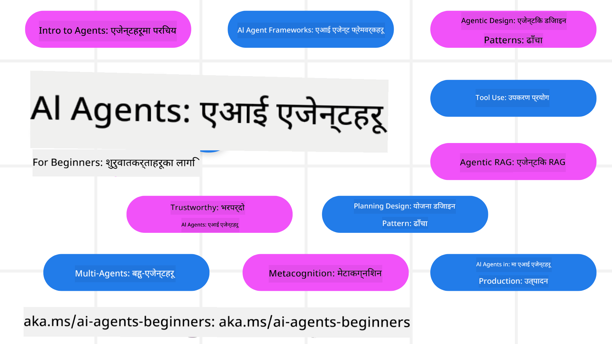

<!--
CO_OP_TRANSLATOR_METADATA:
{
  "original_hash": "6b07046397366e6f6f4524c9ddeba1e1",
  "translation_date": "2025-07-12T14:47:42+00:00",
  "source_file": "README.md",
  "language_code": "ne"
}
-->
# AI एजेन्टहरू सुरु गर्नेहरूका लागि - एक कोर्स

## ११ पाठहरू जसले AI एजेन्टहरू बनाउन सुरु गर्न आवश्यक सबै कुरा सिकाउँछन्

  
  
  
  

### 🌐 बहुभाषी समर्थन

#### GitHub Action मार्फत समर्थित (स्वचालित र सधैं अपडेट हुने)

[French](../fr/README.md) | [Spanish](../es/README.md) | [German](../de/README.md) | [Russian](../ru/README.md) | [Arabic](../ar/README.md) | [Persian (Farsi)](../fa/README.md) | [Urdu](../ur/README.md) | [Chinese (Simplified)](../zh/README.md) | [Chinese (Traditional, Macau)](../mo/README.md) | [Chinese (Traditional, Hong Kong)](../hk/README.md) | [Chinese (Traditional, Taiwan)](../tw/README.md) | [Japanese](../ja/README.md) | [Korean](../ko/README.md) | [Hindi](../hi/README.md) | [Bengali](../bn/README.md) | [Marathi](../mr/README.md) | [Nepali](./README.md) | [Punjabi (Gurmukhi)](../pa/README.md) | [Portuguese (Portugal)](../pt/README.md) | [Portuguese (Brazil)](../br/README.md) | [Italian](../it/README.md) | [Polish](../pl/README.md) | [Turkish](../tr/README.md) | [Greek](../el/README.md) | [Thai](../th/README.md) | [Swedish](../sv/README.md) | [Danish](../da/README.md) | [Norwegian](../no/README.md) | [Finnish](../fi/README.md) | [Dutch](../nl/README.md) | [Hebrew](../he/README.md) | [Vietnamese](../vi/README.md) | [Indonesian](../id/README.md) | [Malay](../ms/README.md) | [Tagalog (Filipino)](../tl/README.md) | [Swahili](../sw/README.md) | [Hungarian](../hu/README.md) | [Czech](../cs/README.md) | [Slovak](../sk/README.md) | [Romanian](../ro/README.md) | [Bulgarian](../bg/README.md) | [Serbian (Cyrillic)](../sr/README.md) | [Croatian](../hr/README.md) | [Slovenian](../sl/README.md) | [Ukrainian](../uk/README.md) | [Burmese (Myanmar)](../my/README.md)

**यदि तपाईं थप भाषाहरू समर्थन गर्न चाहनुहुन्छ भने, यहाँ सूचीबद्ध छन् [यहाँ](https://github.com/Azure/co-op-translator/blob/main/getting_started/supported-languages.md)**

  
  

## 🌱 सुरु गर्ने तरिका

यस कोर्समा AI एजेन्टहरू बनाउनका लागि आधारभूत कुरा समेटिएका ११ पाठहरू छन्। प्रत्येक पाठले आफ्नो विषय समेट्छ, त्यसैले जहाँ मन लाग्यो त्यहाँबाट सुरु गर्न सक्नुहुन्छ!

यस कोर्समा बहुभाषी समर्थन उपलब्ध छ। हाम्रो [उपलब्ध भाषाहरू यहाँ हेर्नुहोस्](../..)।

यदि तपाईं पहिलो पटक Generative AI मोडेलहरूसँग काम गर्दै हुनुहुन्छ भने, हाम्रो [Generative AI For Beginners](https://aka.ms/genai-beginners) कोर्स पनि हेर्नुहोस्, जसमा GenAI सँग काम गर्ने २१ पाठहरू छन्।

यो रिपोमा [स्टार (🌟) दिन नबिर्सनुहोस्](https://docs.github.com/en/get-started/exploring-projects-on-github/saving-repositories-with-stars?WT.mc_id=academic-105485-koreyst) र [fork गरेर](https://github.com/microsoft/ai-agents-for-beginners/fork) कोड चलाउन सक्नुहुन्छ।

### के चाहिन्छ

यस कोर्सका प्रत्येक पाठमा कोड उदाहरणहरू छन्, जुन code_samples फोल्डरमा पाइन्छ। तपाईं [यो रिपो fork](https://github.com/microsoft/ai-agents-for-beginners/fork) गरेर आफ्नो प्रतिलिपि बनाउन सक्नुहुन्छ।

यी अभ्यासहरूमा प्रयोग भएको कोडले Azure AI Foundry र GitHub Model Catalogs प्रयोग गरेर Language Models सँग अन्तरक्रिया गर्छ:

- [Github Models](https://aka.ms/ai-agents-beginners/github-models) - निःशुल्क / सीमित
- [Azure AI Foundry](https://aka.ms/ai-agents-beginners/ai-foundry) - Azure खाता आवश्यक

यस कोर्सले Microsoft का निम्न AI Agent फ्रेमवर्क र सेवाहरू पनि प्रयोग गर्छ:

- [Azure AI Agent Service](https://aka.ms/ai-agents-beginners/ai-agent-service)
- [Semantic Kernel](https://aka.ms/ai-agents-beginners/semantic-kernel)
- [AutoGen](https://aka.ms/ai-agents/autogen)

यस कोर्सको कोड कसरी चलाउने बारे थप जानकारीका लागि [Course Setup](./00-course-setup/README.md) हेर्नुहोस्।

## 🙏 सहयोग गर्न चाहनुहुन्छ?

के तपाईं सल्लाह दिन चाहनुहुन्छ वा स्पेलिङ वा कोडमा त्रुटि भेट्टाउनुभयो? [इश्यू उठाउनुहोस्](https://github.com/microsoft/ai-agents-for-beginners/issues?WT.mc_id=academic-105485-koreyst) वा [पुल रिक्वेस्ट बनाउनुहोस्](https://github.com/microsoft/ai-agents-for-beginners/pulls?WT.mc_id=academic-105485-koreyst)

यदि तपाईं अड्किनुभयो वा AI एजेन्टहरू बनाउन सम्बन्धी कुनै प्रश्न छ भने, हाम्रो [Azure AI Foundry Community Discord](https://discord.gg/kzRShWzttr) मा सामेल हुनुहोस्।

यदि तपाईंलाई उत्पादन सम्बन्धी प्रतिक्रिया वा त्रुटिहरू छन् भने, हाम्रो [Azure AI Foundry Developer Forum](https://aka.ms/azureaifoundry/forum) मा जानुहोस्।

## 📂 प्रत्येक पाठमा समावेश

- README मा लेखिएको पाठ र छोटो भिडियो
- Azure AI Foundry र Github Models (निःशुल्क) समर्थन गर्ने Python कोड उदाहरणहरू
- सिकाइलाई निरन्तरता दिनका लागि अतिरिक्त स्रोतहरूका लिंकहरू

## 🗃️ पाठहरू

| **पाठ**                                | **पाठ र कोड**                                      | **भिडियो**                                                | **अतिरिक्त सिकाइ**                                                                       |
|----------------------------------------|----------------------------------------------------|------------------------------------------------------------|------------------------------------------------------------------------------------------|
| AI एजेन्टहरू र एजेन्ट प्रयोग केसहरू परिचय | [लिंक](./01-intro-to-ai-agents/README.md)          | [भिडियो](https://youtu.be/3zgm60bXmQk?si=z8QygFvYQv-9WtO1)  | [लिंक](https://aka.ms/ai-agents-beginners/collection?WT.mc_id=academic-105485-koreyst)   |
| AI एजेन्टिक फ्रेमवर्कहरू अन्वेषण        | [लिंक](./02-explore-agentic-frameworks/README.md)  | [भिडियो](https://youtu.be/ODwF-EZo_O8?si=Vawth4hzVaHv-u0H)  | [लिंक](https://aka.ms/ai-agents-beginners/collection?WT.mc_id=academic-105485-koreyst)   |
| AI एजेन्टिक डिजाइन ढाँचाहरू बुझ्ने      | [लिंक](./03-agentic-design-patterns/README.md)     | [भिडियो](https://youtu.be/m9lM8qqoOEA?si=BIzHwzstTPL8o9GF)  | [लिंक](https://aka.ms/ai-agents-beginners/collection?WT.mc_id=academic-105485-koreyst)   |
| उपकरण प्रयोग डिजाइन ढाँचा               | [लिंक](./04-tool-use/README.md)                    | [भिडियो](https://youtu.be/vieRiPRx-gI?si=2z6O2Xu2cu_Jz46N)  | [लिंक](https://aka.ms/ai-agents-beginners/collection?WT.mc_id=academic-105485-koreyst)   |
| एजेन्टिक RAG                           | [लिंक](./05-agentic-rag/README.md)                 | [भिडियो](https://youtu.be/WcjAARvdL7I?si=gKPWsQpKiIlDH9A3)  | [लिंक](https://aka.ms/ai-agents-beginners/collection?WT.mc_id=academic-105485-koreyst)   |
| विश्वासिलो AI एजेन्टहरू बनाउने          | [लिंक](./06-building-trustworthy-agents/README.md) | [भिडियो](https://youtu.be/iZKkMEGBCUQ?si=jZjpiMnGFOE9L8OK ) | [लिंक](https://aka.ms/ai-agents-beginners/collection?WT.mc_id=academic-105485-koreyst)   |
| योजना बनाउने डिजाइन ढाँचा               | [लिंक](./07-planning-design/README.md)             | [भिडियो](https://youtu.be/kPfJ2BrBCMY?si=6SC_iv_E5-mzucnC)  | [लिंक](https://aka.ms/ai-agents-beginners/collection?WT.mc_id=academic-105485-koreyst)   |
| बहु-एजेन्ट डिजाइन ढाँचा                 | [लिंक](./08-multi-agent/README.md)                 | [भिडियो](https://youtu.be/V6HpE9hZEx0?si=rMgDhEu7wXo2uo6g)  | [लिंक](https://aka.ms/ai-agents-beginners/collection?WT.mc_id=academic-105485-koreyst)   |
| मेटाकग्निसन डिजाइन ढाँचा                | [लिंक](./09-metacognition/README.md)               | [भिडियो](https://youtu.be/His9R6gw6Ec?si=8gck6vvdSNCt6OcF)  | [लिंक](https://aka.ms/ai-agents-beginners/collection?WT.mc_id=academic-105485-koreyst)   |
| उत्पादनमा AI एजेन्टहरू                  | [लिंक](./10-ai-agents-production/README.md)        | [भिडियो](https://youtu.be/l4TP6IyJxmQ?si=31dnhexRo6yLRJDl)  | [लिंक](https://aka.ms/ai-agents-beginners/collection?WT.mc_id=academic-105485-koreyst)   |
| MCP सहित AI एजेन्टहरू                   | [लिंक](./11-mcp/README.md)                         |                                                            | [लिंक](https://aka.ms/mcp-for-beginners)                                                 |

## 🎒 अन्य कोर्सहरू

हाम्रो टिमले अन्य कोर्सहरू पनि उत्पादन गर्छ! हेर्नुहोस्:
- [**नयाँ** Model Context Protocol (MCP) शुरुवातकर्ताहरूका लागि](https://github.com/microsoft/mcp-for-beginners?WT.mc_id=academic-105485-koreyst)
- [.NET प्रयोग गरेर शुरुवातकर्ताहरूका लागि Generative AI](https://github.com/microsoft/Generative-AI-for-beginners-dotnet?WT.mc_id=academic-105485-koreyst)
- [शुरुवातकर्ताहरूका लागि Generative AI](https://github.com/microsoft/generative-ai-for-beginners?WT.mc_id=academic-105485-koreyst)
- [शुरुवातकर्ताहरूका लागि ML](https://aka.ms/ml-beginners?WT.mc_id=academic-105485-koreyst)
- [शुरुवातकर्ताहरूका लागि Data Science](https://aka.ms/datascience-beginners?WT.mc_id=academic-105485-koreyst)
- [शुरुवातकर्ताहरूका लागि AI](https://aka.ms/ai-beginners?WT.mc_id=academic-105485-koreyst)
- [शुरुवातकर्ताहरूका लागि Cybersecurity](https://github.com/microsoft/Security-101??WT.mc_id=academic-96948-sayoung)
- [शुरुवातकर्ताहरूका लागि Web Dev](https://aka.ms/webdev-beginners?WT.mc_id=academic-105485-koreyst)
- [शुरुवातकर्ताहरूका लागि IoT](https://aka.ms/iot-beginners?WT.mc_id=academic-105485-koreyst)
- [शुरुवातकर्ताहरूका लागि XR Development](https://github.com/microsoft/xr-development-for-beginners?WT.mc_id=academic-105485-koreyst)
- [AI Paired Programming का लागि GitHub Copilot मा दक्षता हासिल गर्नुहोस्](https://aka.ms/GitHubCopilotAI?WT.mc_id=academic-105485-koreyst)
- [C#/.NET Developers का लागि GitHub Copilot मा दक्षता हासिल गर्नुहोस्](https://github.com/microsoft/mastering-github-copilot-for-dotnet-csharp-developers?WT.mc_id=academic-105485-koreyst)
- [आफ्नो Copilot Adventure रोज्नुहोस्](https://github.com/microsoft/CopilotAdventures?WT.mc_id=academic-105485-koreyst)

## 🌟 समुदायलाई धन्यवाद

Agentic RAG देखाउने महत्वपूर्ण कोड नमूनाहरू योगदान गर्नुभएकोमा [Shivam Goyal](https://www.linkedin.com/in/shivam2003/) लाई धन्यवाद।

## योगदान

यो परियोजनाले योगदान र सुझावहरूलाई स्वागत गर्दछ। अधिकांश योगदानहरूका लागि तपाईंले Contributor License Agreement (CLA) मा सहमति जनाउनु आवश्यक हुन्छ जसले तपाईंलाई आफ्नो योगदान प्रयोग गर्ने अधिकार हामीलाई दिन्छ। विस्तृत जानकारीका लागि <https://cla.opensource.microsoft.com> हेर्नुहोस्।

जब तपाईंले pull request पेश गर्नुहुन्छ, CLA बोटले स्वचालित रूपमा निर्धारण गर्नेछ कि तपाईंले CLA प्रदान गर्न आवश्यक छ कि छैन र PR लाई उपयुक्त रूपमा चिन्हित गर्नेछ (जस्तै, स्थिति जाँच, टिप्पणी)। बोटले दिएको निर्देशनहरू पालना गर्नुहोस्। तपाईंले यो प्रक्रिया सबै रिपोजमा एक पटक मात्र गर्नु पर्नेछ।

यो परियोजनाले [Microsoft Open Source Code of Conduct](https://opensource.microsoft.com/codeofconduct/) अपनाएको छ। थप जानकारीका लागि [Code of Conduct FAQ](https://opensource.microsoft.com/codeofconduct/faq/) हेर्नुहोस् वा कुनै प्रश्न वा टिप्पणीका लागि [opencode@microsoft.com](mailto:opencode@microsoft.com) मा सम्पर्क गर्नुहोस्।

## ट्रेडमार्कहरू

यो परियोजनामा परियोजना, उत्पादन वा सेवाहरूका लागि ट्रेडमार्क वा लोगोहरू हुन सक्छन्। Microsoft ट्रेडमार्क वा लोगोहरूको अधिकृत प्रयोग [Microsoft's Trademark & Brand Guidelines](https://www.microsoft.com/legal/intellectualproperty/trademarks/usage/general) अनुसार हुनुपर्छ। यस परियोजनाका संशोधित संस्करणहरूमा Microsoft ट्रेडमार्क वा लोगोहरूको प्रयोगले भ्रम सिर्जना गर्नु हुँदैन वा Microsoft को प्रायोजन संकेत गर्नु हुँदैन। तेस्रो पक्षका ट्रेडमार्क वा लोगोहरूको कुनै पनि प्रयोग तिनका नीतिहरूको अधीनमा हुन्छ।

**अस्वीकरण**:  
यो दस्तावेज AI अनुवाद सेवा [Co-op Translator](https://github.com/Azure/co-op-translator) प्रयोग गरी अनुवाद गरिएको हो। हामी शुद्धताका लागि प्रयासरत छौं, तर कृपया ध्यान दिनुहोस् कि स्वचालित अनुवादमा त्रुटि वा अशुद्धता हुन सक्छ। मूल दस्तावेज यसको मूल भाषामा नै अधिकारिक स्रोत मानिनुपर्छ। महत्वपूर्ण जानकारीका लागि व्यावसायिक मानव अनुवाद सिफारिस गरिन्छ। यस अनुवादको प्रयोगबाट उत्पन्न कुनै पनि गलतफहमी वा गलत व्याख्याका लागि हामी जिम्मेवार छैनौं।