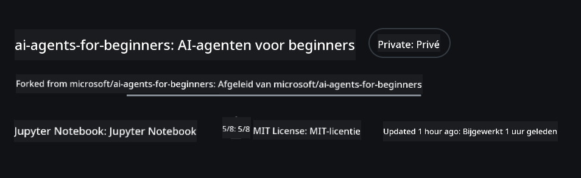
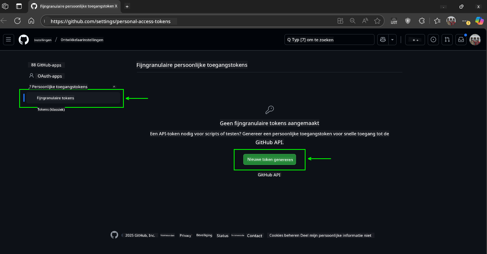
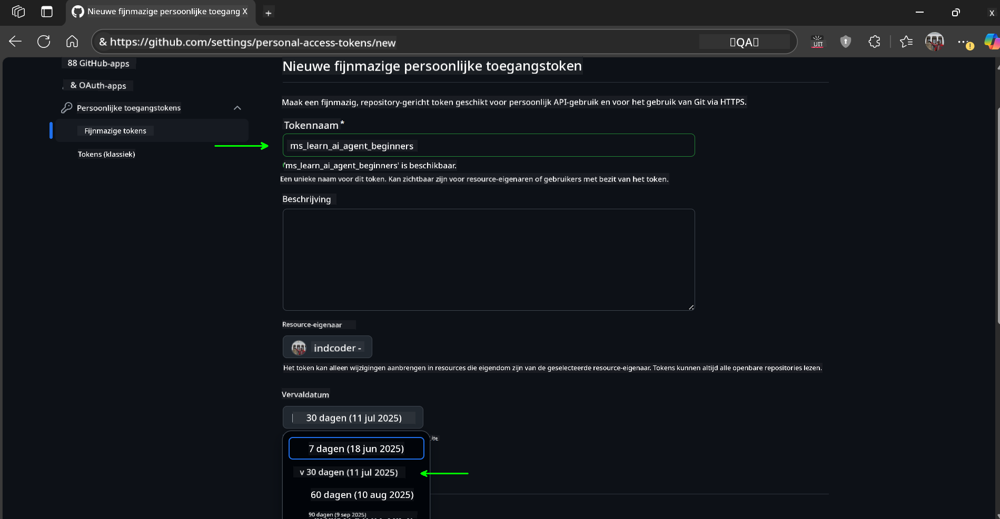
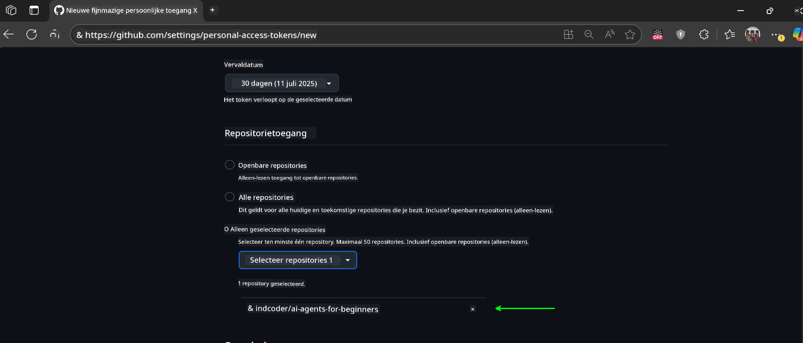
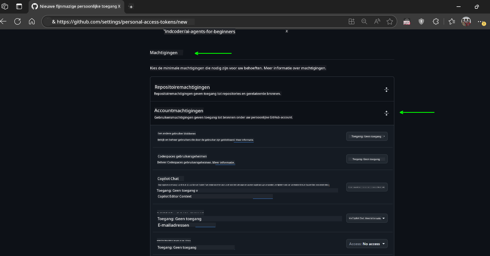
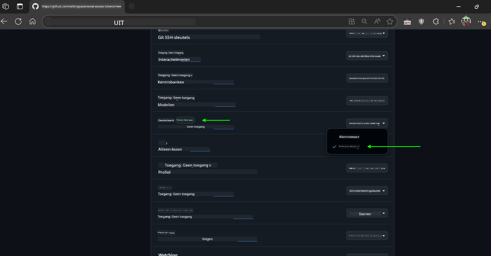
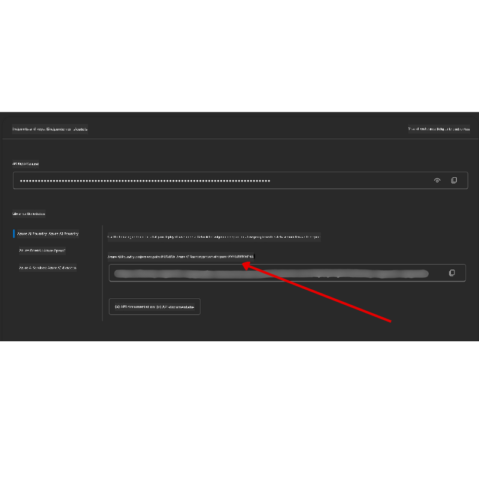

<!--
CO_OP_TRANSLATOR_METADATA:
{
  "original_hash": "c6a79c8f2b56a80370ff7e447765524f",
  "translation_date": "2025-07-23T08:55:00+00:00",
  "source_file": "00-course-setup/README.md",
  "language_code": "nl"
}
-->
# Cursusinstelling

## Introductie

Deze les behandelt hoe je de codevoorbeelden van deze cursus kunt uitvoeren.

## Clone of Fork deze Repo

Om te beginnen, clone of fork de GitHub-repository. Hiermee maak je je eigen versie van het cursusmateriaal, zodat je de code kunt uitvoeren, testen en aanpassen!

Dit kan worden gedaan door op de link te klikken naar

Je zou nu je eigen geforkte versie van deze cursus moeten hebben via de volgende link:



## Code uitvoeren

Deze cursus biedt een reeks Jupyter Notebooks waarmee je praktische ervaring kunt opdoen in het bouwen van AI Agents.

De codevoorbeelden maken gebruik van:

**Vereist een GitHub-account - Gratis**:

1) Semantic Kernel Agent Framework + GitHub Models Marketplace. Gelabeld als (semantic-kernel.ipynb)
2) AutoGen Framework + GitHub Models Marketplace. Gelabeld als (autogen.ipynb)

**Vereist een Azure-abonnement**:
3) Azure AI Foundry + Azure AI Agent Service. Gelabeld als (azureaiagent.ipynb)

We raden je aan om alle drie de soorten voorbeelden uit te proberen om te zien welke het beste bij je past.

Welke optie je ook kiest, dit bepaalt welke instellingsstappen je hieronder moet volgen:

## Vereisten

- Python 3.12+
  - **NOTE**: Als je Python3.12 niet hebt geïnstalleerd, zorg er dan voor dat je het installeert. Maak vervolgens je venv aan met python3.12 om ervoor te zorgen dat de juiste versies worden geïnstalleerd vanuit het requirements.txt-bestand.
- Een GitHub-account - Voor toegang tot de GitHub Models Marketplace
- Azure-abonnement - Voor toegang tot Azure AI Foundry
- Azure AI Foundry-account - Voor toegang tot de Azure AI Agent Service

We hebben een `requirements.txt`-bestand opgenomen in de root van deze repository dat alle vereiste Python-pakketten bevat om de codevoorbeelden uit te voeren.

Je kunt ze installeren door het volgende commando in je terminal uit te voeren in de root van de repository:

```bash
pip install -r requirements.txt
```
We raden aan om een Python-virtuele omgeving te maken om conflicten en problemen te voorkomen.

## Instellen van VSCode
Zorg ervoor dat je de juiste versie van Python gebruikt in VSCode.


## Instellen voor voorbeelden met GitHub Models 

### Stap 1: Haal je GitHub Personal Access Token (PAT) op

Deze cursus maakt gebruik van de GitHub Models Marketplace, die gratis toegang biedt tot Large Language Models (LLMs) die je zult gebruiken om AI Agents te bouwen.

Om de GitHub Models te gebruiken, moet je een [GitHub Personal Access Token](https://docs.github.com/en/authentication/keeping-your-account-and-data-secure/managing-your-personal-access-tokens) aanmaken.

Dit kan worden gedaan door naar je GitHub-account te gaan.

Volg het [Principe van Minimale Toegang](https://docs.github.com/en/get-started/learning-to-code/storing-your-secrets-safely) bij het aanmaken van je token. Dit betekent dat je het token alleen de rechten moet geven die nodig zijn om de codevoorbeelden in deze cursus uit te voeren.

1. Selecteer de optie `Fine-grained tokens` aan de linkerkant van je scherm.

    Selecteer vervolgens `Generate new token`.

    

1. Geef je token een beschrijvende naam die het doel ervan weerspiegelt, zodat je het later gemakkelijk kunt identificeren. Stel een vervaldatum in (aanbevolen: 30 dagen; je kunt een kortere periode kiezen, zoals 7 dagen, als je een veiliger aanpak wilt).

    

1. Beperk de reikwijdte van het token tot je fork van deze repository.

    

1. Beperk de rechten van het token: Onder **Permissions**, schakel **Account Permissions** in, ga naar **Models** en schakel alleen de leesrechten in die nodig zijn voor GitHub Models.

    

    

Kopieer je nieuwe token dat je zojuist hebt aangemaakt. Je zult dit nu toevoegen aan je `.env`-bestand dat bij deze cursus is inbegrepen.

### Stap 2: Maak je `.env`-bestand

Om je `.env`-bestand te maken, voer je het volgende commando uit in je terminal.

```bash
cp .env.example .env
```

Dit kopieert het voorbeeldbestand en maakt een `.env` in je directory waar je de waarden voor de omgevingsvariabelen invult.

Met je token gekopieerd, open je het `.env`-bestand in je favoriete teksteditor en plak je je token in het `GITHUB_TOKEN`-veld.

Je zou nu de codevoorbeelden van deze cursus moeten kunnen uitvoeren.

## Instellen voor voorbeelden met Azure AI Foundry en Azure AI Agent Service

### Stap 1: Haal je Azure Project Endpoint op

Volg de stappen om een hub en project te maken in Azure AI Foundry, te vinden hier: [Hub resources overview](https://learn.microsoft.com/en-us/azure/ai-foundry/concepts/ai-resources)

Zodra je je project hebt aangemaakt, moet je de verbindingsstring voor je project ophalen.

Dit kan worden gedaan door naar de **Overzicht**-pagina van je project te gaan in het Azure AI Foundry-portaal.



### Stap 2: Maak je `.env`-bestand

Om je `.env`-bestand te maken, voer je het volgende commando uit in je terminal.

```bash
cp .env.example .env
```

Dit kopieert het voorbeeldbestand en maakt een `.env` in je directory waar je de waarden voor de omgevingsvariabelen invult.

Met je token gekopieerd, open je het `.env`-bestand in je favoriete teksteditor en plak je je token in het `PROJECT_ENDPOINT`-veld.

### Stap 3: Inloggen bij Azure

Als een beveiligingsmaatregel gebruiken we [keyless authentication](https://learn.microsoft.com/azure/developer/ai/keyless-connections?tabs=csharp%2Cazure-cli?WT.mc_id=academic-105485-koreyst) om te authenticeren bij Azure OpenAI met Microsoft Entra ID.

Open vervolgens een terminal en voer `az login --use-device-code` uit om in te loggen bij je Azure-account.

Zodra je bent ingelogd, selecteer je je abonnement in de terminal.

## Extra omgevingsvariabelen - Azure Search en Azure OpenAI 

Voor de Agentic RAG-les - Les 5 - zijn er voorbeelden die gebruik maken van Azure Search en Azure OpenAI.

Als je deze voorbeelden wilt uitvoeren, moet je de volgende omgevingsvariabelen toevoegen aan je `.env`-bestand:

### Overzichtspagina (Project)

- `AZURE_SUBSCRIPTION_ID` - Controleer **Projectdetails** op de **Overzicht**-pagina van je project.

- `AZURE_AI_PROJECT_NAME` - Kijk bovenaan de **Overzicht**-pagina van je project.

- `AZURE_OPENAI_SERVICE` - Vind dit in het tabblad **Included capabilities** voor **Azure OpenAI Service** op de **Overzicht**-pagina.

### Management Center

- `AZURE_OPENAI_RESOURCE_GROUP` - Ga naar **Projecteigenschappen** op de **Overzicht**-pagina van het **Management Center**.

- `GLOBAL_LLM_SERVICE` - Onder **Connected resources**, vind de **Azure AI Services**-verbinding. Als deze niet wordt vermeld, controleer dan de **Azure portal** onder je resourcegroep voor de naam van de AI Services-resource.

### Models + Endpoints-pagina

- `AZURE_OPENAI_EMBEDDING_DEPLOYMENT_NAME` - Selecteer je embedding-model (bijv. `text-embedding-ada-002`) en noteer de **Deployment name** uit de modeldetails.

- `AZURE_OPENAI_CHAT_DEPLOYMENT_NAME` - Selecteer je chatmodel (bijv. `gpt-4o-mini`) en noteer de **Deployment name** uit de modeldetails.

### Azure Portal

- `AZURE_OPENAI_ENDPOINT` - Zoek naar **Azure AI services**, klik erop, ga naar **Resource Management**, **Keys and Endpoint**, scroll naar beneden naar de "Azure OpenAI endpoints", en kopieer degene die "Language APIs" zegt.

- `AZURE_OPENAI_API_KEY` - Kopieer vanaf hetzelfde scherm KEY 1 of KEY 2.

- `AZURE_SEARCH_SERVICE_ENDPOINT` - Vind je **Azure AI Search**-resource, klik erop en bekijk **Overzicht**.

- `AZURE_SEARCH_API_KEY` - Ga vervolgens naar **Instellingen** en daarna **Keys** om de primaire of secundaire beheersleutel te kopiëren.

### Externe webpagina

- `AZURE_OPENAI_API_VERSION` - Bezoek de [API version lifecycle](https://learn.microsoft.com/en-us/azure/ai-services/openai/api-version-deprecation#latest-ga-api-release)-pagina onder **Latest GA API release**.

### Instellen van keyless authentication

In plaats van je inloggegevens hard te coderen, gebruiken we een keyless verbinding met Azure OpenAI. Hiervoor importeren we `DefaultAzureCredential` en roepen we later de functie `DefaultAzureCredential` aan om de inloggegevens te verkrijgen.

```python
from azure.identity import DefaultAzureCredential, InteractiveBrowserCredential
```

## Vastgelopen?

Als je problemen hebt met het uitvoeren van deze setup, spring dan in onze

## Volgende les

Je bent nu klaar om de code voor deze cursus uit te voeren. Veel plezier met het leren over de wereld van AI Agents! 

[Introductie tot AI Agents en Agent Use Cases](../01-intro-to-ai-agents/README.md)

**Disclaimer**:  
Dit document is vertaald met behulp van de AI-vertalingsservice [Co-op Translator](https://github.com/Azure/co-op-translator). Hoewel we streven naar nauwkeurigheid, dient u zich ervan bewust te zijn dat geautomatiseerde vertalingen fouten of onnauwkeurigheden kunnen bevatten. Het originele document in de oorspronkelijke taal moet worden beschouwd als de gezaghebbende bron. Voor cruciale informatie wordt professionele menselijke vertaling aanbevolen. Wij zijn niet aansprakelijk voor eventuele misverstanden of verkeerde interpretaties die voortvloeien uit het gebruik van deze vertaling.