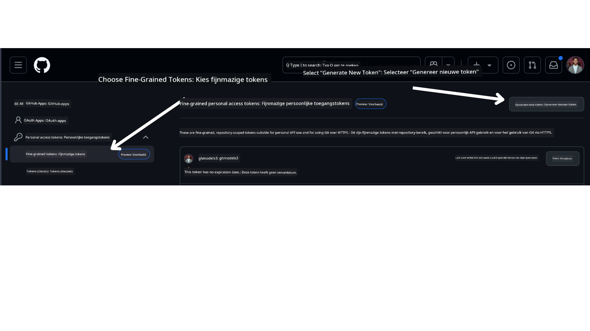

<!--
CO_OP_TRANSLATOR_METADATA:
{
  "original_hash": "76945069b52a49cd0432ae3e0b0ba22e",
  "translation_date": "2025-07-12T07:52:52+00:00",
  "source_file": "00-course-setup/README.md",
  "language_code": "nl"
}
-->
Je zou nu je eigen geforkte versie van deze cursus moeten hebben via de volgende link:


## De Code Uitvoeren

Deze cursus biedt een reeks Jupyter Notebooks die je kunt gebruiken om praktische ervaring op te doen met het bouwen van AI Agents.

De codevoorbeelden maken gebruik van:

**Vereist GitHub-account - Gratis**:

1) Semantic Kernel Agent Framework + GitHub Models Marketplace. Gelabeld als (semantic-kernel.ipynb)  
2) AutoGen Framework + GitHub Models Marketplace. Gelabeld als (autogen.ipynb)

**Vereist Azure-abonnement**:  
3) Azure AI Foundry + Azure AI Agent Service. Gelabeld als (azureaiagent.ipynb)

We moedigen je aan om alle drie de soorten voorbeelden uit te proberen om te zien welke het beste voor jou werkt.

Welke optie je ook kiest, dat bepaalt welke installatie stappen je hieronder moet volgen:

## Vereisten

- Python 3.12+  
  - **OPMERKING**: Als je Python 3.12 nog niet hebt geïnstalleerd, zorg dan dat je dit doet. Maak vervolgens je virtuele omgeving aan met python3.12 om te garanderen dat de juiste versies uit het requirements.txt-bestand worden geïnstalleerd.  
- Een GitHub-account - Voor toegang tot de GitHub Models Marketplace  
- Azure-abonnement - Voor toegang tot Azure AI Foundry  
- Azure AI Foundry-account - Voor toegang tot de Azure AI Agent Service  

We hebben een `requirements.txt`-bestand toegevoegd in de hoofdmap van deze repository met alle benodigde Python-pakketten om de codevoorbeelden uit te voeren.

Je kunt deze installeren door het volgende commando uit te voeren in je terminal in de hoofdmap van de repository:

```bash
pip install -r requirements.txt
```  
We raden aan om een Python virtuele omgeving te maken om conflicten en problemen te voorkomen.

## VSCode Instellen  
Zorg ervoor dat je de juiste versie van Python gebruikt in VSCode.


## Instellen voor Voorbeelden met GitHub Models

### Stap 1: Haal je GitHub Personal Access Token (PAT) op

Momenteel gebruikt deze cursus de GitHub Models Marketplace om gratis toegang te bieden tot Large Language Models (LLM's) die gebruikt worden om AI Agents te maken.

Om toegang te krijgen tot deze service, moet je een GitHub Personal Access Token aanmaken.

Dit doe je door naar je

in je GitHub-account te gaan.

Selecteer de optie `Fine-grained tokens` aan de linkerkant van je scherm.

Kies vervolgens `Generate new token`.



Je wordt gevraagd een naam voor je token in te voeren, een vervaldatum te kiezen (aanbevolen: 30 dagen) en de scopes voor je token te selecteren (Public Repositories).

Het is ook noodzakelijk om de permissies van dit token aan te passen: Permissions -> Models -> Toegang tot GitHub Models toestaan.

Kopieer je nieuwe token dat je zojuist hebt aangemaakt. Je voegt dit nu toe aan je `.env`-bestand dat bij deze cursus hoort.

### Stap 2: Maak je `.env`-bestand aan

Om je `.env`-bestand aan te maken, voer je het volgende commando uit in je terminal.

```bash
cp .env.example .env
```

Dit kopieert het voorbeeldbestand en maakt een `.env`-bestand aan in je map, waar je de waarden voor de omgevingsvariabelen invult.

Met je token gekopieerd, open je het `.env`-bestand in je favoriete teksteditor en plak je je token in het veld `GITHUB_TOKEN`.

Je zou nu in staat moeten zijn om de codevoorbeelden van deze cursus uit te voeren.

## Instellen voor Voorbeelden met Azure AI Foundry en Azure AI Agent Service

### Stap 1: Haal je Azure Project Endpoint op

Volg de stappen om een hub en project aan te maken in Azure AI Foundry, te vinden hier: [Hub resources overview](https://learn.microsoft.com/en-us/azure/ai-foundry/concepts/ai-resources)

Zodra je je project hebt aangemaakt, moet je de verbindingsstring voor je project ophalen.

Dit doe je door naar de **Overview**-pagina van je project te gaan in het Azure AI Foundry-portaal.


### Stap 2: Maak je `.env`-bestand aan

Om je `.env`-bestand aan te maken, voer je het volgende commando uit in je terminal.

```bash
cp .env.example .env
```

Dit kopieert het voorbeeldbestand en maakt een `.env`-bestand aan in je map, waar je de waarden voor de omgevingsvariabelen invult.

Met je token gekopieerd, open je het `.env`-bestand in je favoriete teksteditor en plak je je token in het veld `PROJECT_ENDPOINT`.

### Stap 3: Meld je aan bij Azure

Als beste beveiligingspraktijk gebruiken we [keyless authenticatie](https://learn.microsoft.com/azure/developer/ai/keyless-connections?tabs=csharp%2Cazure-cli?WT.mc_id=academic-105485-koreyst) om te authenticeren bij Azure OpenAI met Microsoft Entra ID. Voordat je dit kunt doen, moet je eerst de **Azure CLI** installeren volgens de [installatie-instructies](https://learn.microsoft.com/cli/azure/install-azure-cli?WT.mc_id=academic-105485-koreyst) voor jouw besturingssysteem.

Open vervolgens een terminal en voer `az login --use-device-code` uit om in te loggen op je Azure-account.

Zodra je bent ingelogd, selecteer je je abonnement in de terminal.

## Extra Omgevingsvariabelen - Azure Search en Azure OpenAI

Voor de Agentic RAG-les - Les 5 - zijn er voorbeelden die Azure Search en Azure OpenAI gebruiken.

Als je deze voorbeelden wilt uitvoeren, moet je de volgende omgevingsvariabelen toevoegen aan je `.env`-bestand:

### Overzichtspagina (Project)

- `AZURE_SUBSCRIPTION_ID` - Kijk bij **Project details** op de **Overview**-pagina van je project.

- `AZURE_AI_PROJECT_NAME` - Bovenaan de **Overview**-pagina van je project.

- `AZURE_OPENAI_SERVICE` - Te vinden onder het tabblad **Included capabilities** voor **Azure OpenAI Service** op de **Overview**-pagina.

### Management Center

- `AZURE_OPENAI_RESOURCE_GROUP` - Ga naar **Project properties** op de **Overview**-pagina van het **Management Center**.

- `GLOBAL_LLM_SERVICE` - Onder **Connected resources**, vind de naam van de verbinding voor **Azure AI Services**. Als deze niet wordt weergegeven, controleer dan in het **Azure-portaal** onder je resourcegroep de naam van de AI Services-resource.

### Models + Endpoints Pagina

- `AZURE_OPENAI_EMBEDDING_DEPLOYMENT_NAME` - Selecteer je embedding-model (bijv. `text-embedding-ada-002`) en noteer de **Deployment name** uit de modelgegevens.

- `AZURE_OPENAI_CHAT_DEPLOYMENT_NAME` - Selecteer je chatmodel (bijv. `gpt-4o-mini`) en noteer de **Deployment name** uit de modelgegevens.

### Azure Portal

- `AZURE_OPENAI_ENDPOINT` - Zoek naar **Azure AI services**, klik erop, ga naar **Resource Management**, **Keys and Endpoint**, scroll naar beneden naar de "Azure OpenAI endpoints" en kopieer degene die "Language APIs" zegt.

- `AZURE_OPENAI_API_KEY` - Kopieer vanaf hetzelfde scherm KEY 1 of KEY 2.

- `AZURE_SEARCH_SERVICE_ENDPOINT` - Zoek je **Azure AI Search**-resource, klik erop en bekijk de **Overview**.

- `AZURE_SEARCH_API_KEY` - Ga vervolgens naar **Settings** en daarna **Keys** om de primaire of secundaire beheerderssleutel te kopiëren.

### Externe Webpagina

- `AZURE_OPENAI_API_VERSION` - Bezoek de [API version lifecycle](https://learn.microsoft.com/en-us/azure/ai-services/openai/api-version-deprecation#latest-ga-api-release) pagina onder **Latest GA API release**.

### Keyless authenticatie instellen

In plaats van je inloggegevens hard te coderen, gebruiken we een keyless verbinding met Azure OpenAI. Hiervoor importeren we `DefaultAzureCredential` en roepen later de functie `DefaultAzureCredential` aan om de credential te verkrijgen.

```python
from azure.identity import DefaultAzureCredential, InteractiveBrowserCredential
```

## Vastgelopen?

Als je problemen hebt met deze setup, spring dan in onze

of

.

## Volgende Les

Je bent nu klaar om de code van deze cursus uit te voeren. Veel plezier met het verder ontdekken van de wereld van AI Agents!

[Introductie tot AI Agents en Agent Use Cases](../01-intro-to-ai-agents/README.md)

**Disclaimer**:  
Dit document is vertaald met behulp van de AI-vertalingsdienst [Co-op Translator](https://github.com/Azure/co-op-translator). Hoewel we streven naar nauwkeurigheid, dient u er rekening mee te houden dat geautomatiseerde vertalingen fouten of onnauwkeurigheden kunnen bevatten. Het originele document in de oorspronkelijke taal moet als de gezaghebbende bron worden beschouwd. Voor cruciale informatie wordt professionele menselijke vertaling aanbevolen. Wij zijn niet aansprakelijk voor eventuele misverstanden of verkeerde interpretaties die voortvloeien uit het gebruik van deze vertaling.