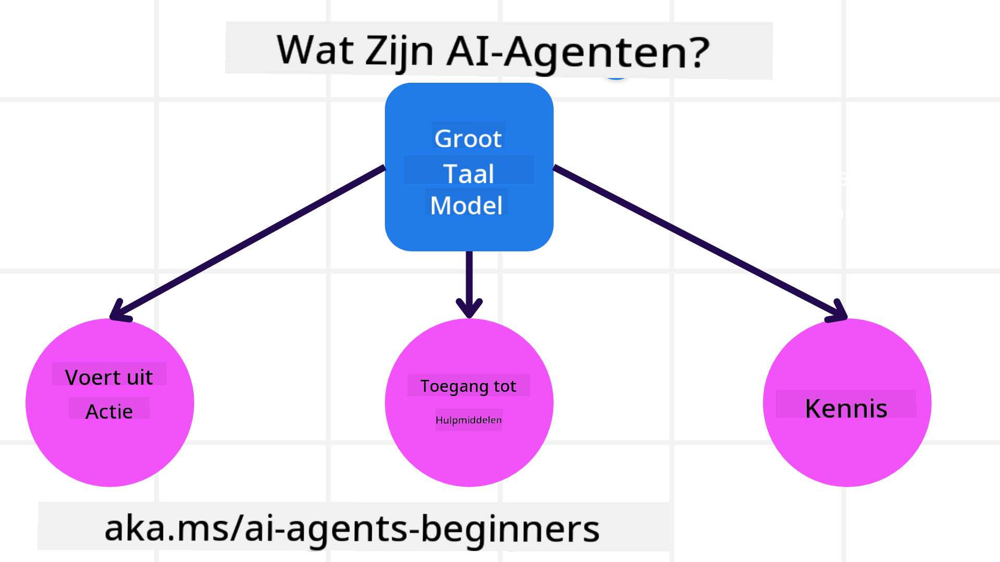
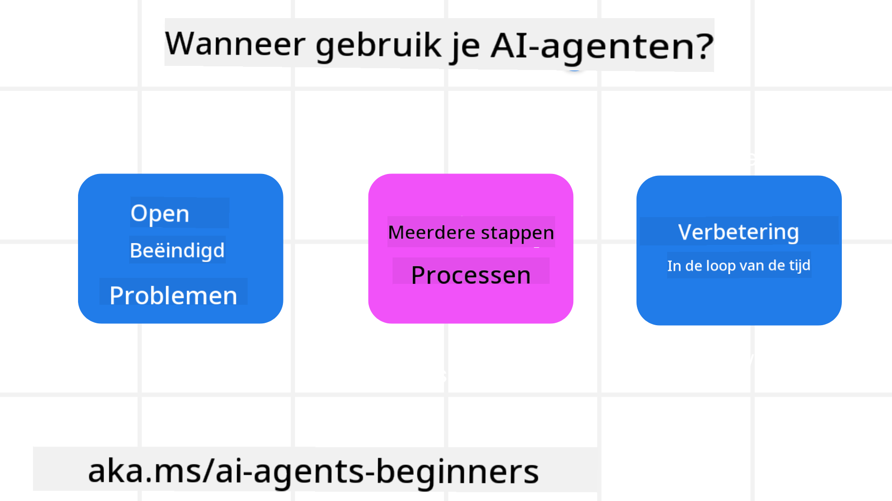

<!--
CO_OP_TRANSLATOR_METADATA:
{
  "original_hash": "d84943abc8f001ad4670418d32c2d899",
  "translation_date": "2025-07-12T08:08:55+00:00",
  "source_file": "01-intro-to-ai-agents/README.md",
  "language_code": "nl"
}
-->
om andere leerlingen en AI Agent Bouwers te ontmoeten en eventuele vragen over deze cursus te stellen.

Om deze cursus te starten, beginnen we met een beter begrip van wat AI Agents zijn en hoe we ze kunnen gebruiken in de applicaties en workflows die we bouwen.

## Introductie

Deze les behandelt:

- Wat zijn AI Agents en wat zijn de verschillende soorten agents?
- Voor welke use cases zijn AI Agents het meest geschikt en hoe kunnen ze ons helpen?
- Wat zijn enkele basisbouwstenen bij het ontwerpen van Agentic Oplossingen?

## Leerdoelen
Na het voltooien van deze les zou je in staat moeten zijn om:

- AI Agent concepten te begrijpen en hoe ze verschillen van andere AI-oplossingen.
- AI Agents zo efficiënt mogelijk toe te passen.
- Agentic oplossingen productief te ontwerpen voor zowel gebruikers als klanten.

## Definiëren van AI Agents en Soorten AI Agents

### Wat zijn AI Agents?

AI Agents zijn **systemen** die **Large Language Models (LLMs)** in staat stellen om **acties uit te voeren** door hun mogelijkheden uit te breiden door LLMs **toegang te geven tot tools** en **kennis**.

Laten we deze definitie opsplitsen in kleinere delen:

- **Systeem** - Het is belangrijk om agents niet te zien als slechts één component, maar als een systeem van meerdere componenten. Op het basisniveau zijn de componenten van een AI Agent:
  - **Omgeving** - De gedefinieerde ruimte waarin de AI Agent opereert. Bijvoorbeeld, als we een reisboekings-AI Agent hadden, zou de omgeving het reisboekingssysteem kunnen zijn dat de AI Agent gebruikt om taken uit te voeren.
  - **Sensoren** - Omgevingen bevatten informatie en geven feedback. AI Agents gebruiken sensoren om deze informatie over de huidige staat van de omgeving te verzamelen en te interpreteren. In het voorbeeld van de reisboekingsagent kan het reisboekingssysteem informatie geven zoals hotelbeschikbaarheid of vluchtprijzen.
  - **Actuatoren** - Zodra de AI Agent de huidige staat van de omgeving ontvangt, bepaalt de agent voor de huidige taak welke actie moet worden uitgevoerd om de omgeving te veranderen. Voor de reisboekingsagent kan dit bijvoorbeeld het boeken van een beschikbare kamer voor de gebruiker zijn.

**Large Language Models** - Het concept van agents bestond al vóór de creatie van LLMs. Het voordeel van het bouwen van AI Agents met LLMs is hun vermogen om menselijke taal en data te interpreteren. Dit vermogen stelt LLMs in staat om omgevingsinformatie te interpreteren en een plan te definiëren om de omgeving te veranderen.

**Acties Uitvoeren** - Buiten AI Agent systemen zijn LLMs beperkt tot situaties waarin de actie het genereren van content of informatie is op basis van een prompt van de gebruiker. Binnen AI Agent systemen kunnen LLMs taken voltooien door het verzoek van de gebruiker te interpreteren en tools te gebruiken die beschikbaar zijn in hun omgeving.

**Toegang tot Tools** - Welke tools de LLM kan gebruiken, wordt bepaald door 1) de omgeving waarin het opereert en 2) de ontwikkelaar van de AI Agent. Voor ons reisagentvoorbeeld zijn de tools van de agent beperkt tot de operaties die beschikbaar zijn in het boekingssysteem, en/of kan de ontwikkelaar de toegang van de agent tot tools beperken tot bijvoorbeeld alleen vluchten.

**Geheugen + Kennis** - Geheugen kan kortetermijn zijn in de context van het gesprek tussen de gebruiker en de agent. Op de lange termijn, buiten de informatie die door de omgeving wordt geleverd, kunnen AI Agents ook kennis ophalen uit andere systemen, diensten, tools en zelfs andere agents. In het reisagentvoorbeeld kan deze kennis informatie zijn over de reisvoorkeuren van de gebruiker die is opgeslagen in een klantendatabase.

### De verschillende soorten agents

Nu we een algemene definitie van AI Agents hebben, bekijken we enkele specifieke agenttypen en hoe ze zouden worden toegepast op een reisboekings-AI agent.

| **Agent Type**                | **Beschrijving**                                                                                                                       | **Voorbeeld**                                                                                                                                                                                                                   |
| ----------------------------- | ------------------------------------------------------------------------------------------------------------------------------------- | ----------------------------------------------------------------------------------------------------------------------------------------------------------------------------------------------------------------------------- |
| **Simple Reflex Agents**      | Voeren directe acties uit op basis van vooraf gedefinieerde regels.                                                                   | Reisagent interpreteert de context van de e-mail en stuurt reisklachten door naar de klantenservice.                                                                                                                          |
| **Model-Based Reflex Agents** | Voeren acties uit op basis van een model van de wereld en veranderingen in dat model.                                                  | Reisagent geeft prioriteit aan routes met significante prijswijzigingen op basis van toegang tot historische prijsgegevens.                                                                                                   |
| **Goal-Based Agents**         | Maken plannen om specifieke doelen te bereiken door het doel te interpreteren en acties te bepalen om het te bereiken.                 | Reisagent boekt een reis door de benodigde reisarrangementen (auto, openbaar vervoer, vluchten) te bepalen van de huidige locatie naar de bestemming.                                                                          |
| **Utility-Based Agents**      | Houden rekening met voorkeuren en wegen afwegingen numeriek om te bepalen hoe doelen te bereiken.                                      | Reisagent maximaliseert nut door gemak versus kosten af te wegen bij het boeken van reizen.                                                                                                                                   |
| **Learning Agents**           | Verbeteren zich in de loop van de tijd door te reageren op feedback en acties dienovereenkomstig aan te passen.                        | Reisagent verbetert door gebruik te maken van klantfeedback uit enquêtes na de reis om aanpassingen te maken voor toekomstige boekingen.                                                                                      |
| **Hierarchical Agents**       | Bestaan uit meerdere agents in een gelaagd systeem, waarbij hogere agents taken opdelen in subtaken voor lagere agents om uit te voeren. | Reisagent annuleert een reis door de taak op te splitsen in subtaken (bijvoorbeeld het annuleren van specifieke boekingen) en lagere agents deze te laten uitvoeren, die terugrapporteren aan de hogere agent.                   |
| **Multi-Agent Systems (MAS)** | Agents voltooien taken onafhankelijk, zowel coöperatief als competitief.                                                               | Coöperatief: Meerdere agents boeken specifieke reisdiensten zoals hotels, vluchten en entertainment. Competitief: Meerdere agents beheren en concurreren over een gedeelde hotelboekingskalender om klanten in het hotel te plaatsen. |

## Wanneer AI Agents te gebruiken

In het eerdere gedeelte gebruikten we de reisagent use-case om uit te leggen hoe de verschillende soorten agents kunnen worden gebruikt in verschillende scenario's van reisboekingen. We blijven deze toepassing gedurende de cursus gebruiken.

Laten we kijken naar de soorten use cases waarvoor AI Agents het beste worden ingezet:

- **Open-eind problemen** - waarbij het LLM zelf de benodigde stappen bepaalt om een taak te voltooien, omdat dit niet altijd hardcoded in een workflow kan worden vastgelegd.
- **Meerdere-stappen processen** - taken die een zekere complexiteit vereisen waarbij de AI Agent tools of informatie over meerdere beurten moet gebruiken in plaats van eenmalige opvraging.
- **Verbetering in de tijd** - taken waarbij de agent zich kan verbeteren door feedback te ontvangen van de omgeving of gebruikers om zo betere resultaten te leveren.

We behandelen meer over overwegingen bij het gebruik van AI Agents in de les Vertrouwbare AI Agents bouwen.

## Basisprincipes van Agentic Oplossingen

### Agentontwikkeling

De eerste stap bij het ontwerpen van een AI Agent systeem is het definiëren van de tools, acties en gedragingen. In deze cursus richten we ons op het gebruik van de **Azure AI Agent Service** om onze Agents te definiëren. Deze biedt functies zoals:

- Selectie van Open Models zoals OpenAI, Mistral en Llama
- Gebruik van gelicentieerde data via aanbieders zoals Tripadvisor
- Gebruik van gestandaardiseerde OpenAPI 3.0 tools

### Agentic Patronen

Communicatie met LLMs verloopt via prompts. Gezien de semi-autonome aard van AI Agents is het niet altijd mogelijk of nodig om de LLM handmatig opnieuw te prompten na een verandering in de omgeving. We gebruiken **Agentic Patronen** die ons in staat stellen om de LLM over meerdere stappen op een schaalbare manier te prompten.

Deze cursus is verdeeld in enkele van de huidige populaire Agentic patronen.

### Agentic Frameworks

Agentic Frameworks stellen ontwikkelaars in staat om agentic patronen via code te implementeren. Deze frameworks bieden sjablonen, plugins en tools voor betere samenwerking tussen AI Agents. Deze voordelen zorgen voor betere observeerbaarheid en probleemoplossing van AI Agent systemen.

In deze cursus verkennen we het onderzoeksgerichte AutoGen framework en het productieklare Agent framework van Semantic Kernel.

## Vorige les

[Course Setup](../00-course-setup/README.md)

## Volgende les

[Exploring Agentic Frameworks](../02-explore-agentic-frameworks/README.md)

**Disclaimer**:  
Dit document is vertaald met behulp van de AI-vertalingsdienst [Co-op Translator](https://github.com/Azure/co-op-translator). Hoewel we streven naar nauwkeurigheid, dient u er rekening mee te houden dat geautomatiseerde vertalingen fouten of onnauwkeurigheden kunnen bevatten. Het originele document in de oorspronkelijke taal moet als de gezaghebbende bron worden beschouwd. Voor cruciale informatie wordt professionele menselijke vertaling aanbevolen. Wij zijn niet aansprakelijk voor eventuele misverstanden of verkeerde interpretaties die voortvloeien uit het gebruik van deze vertaling.