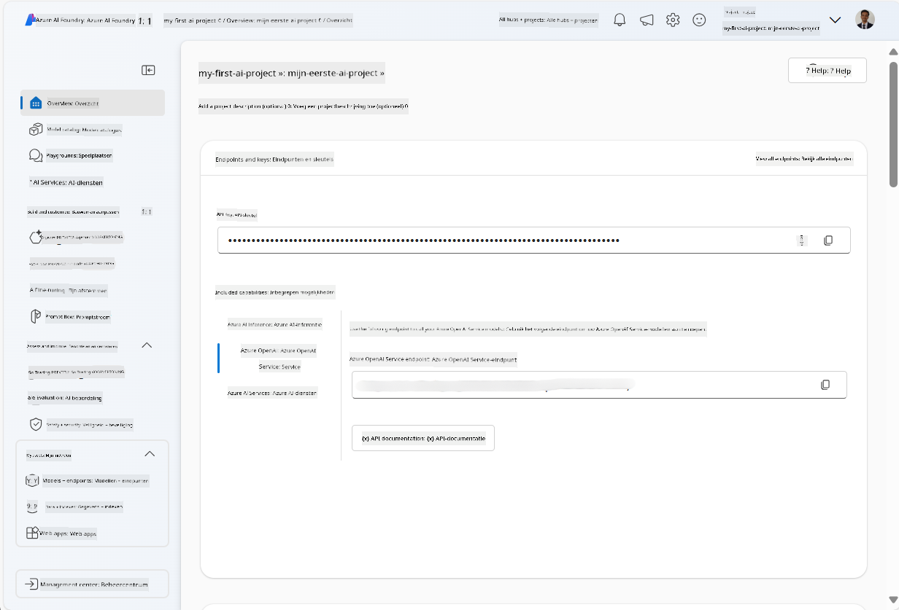
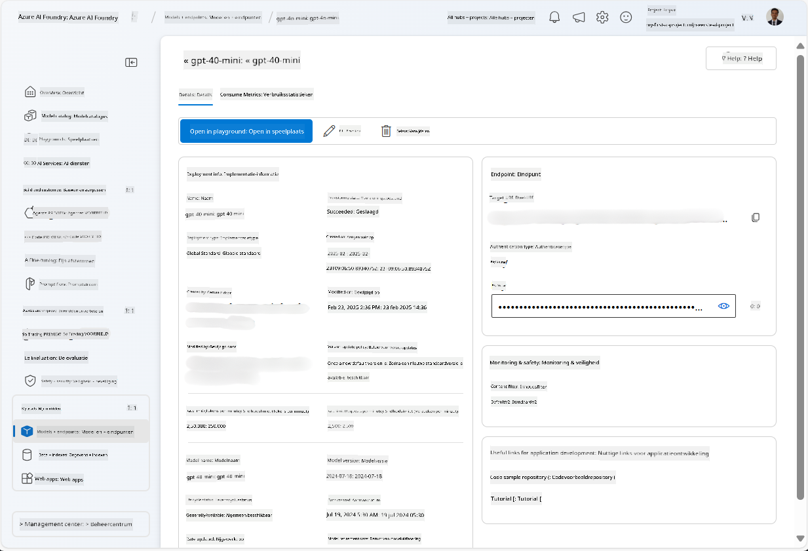
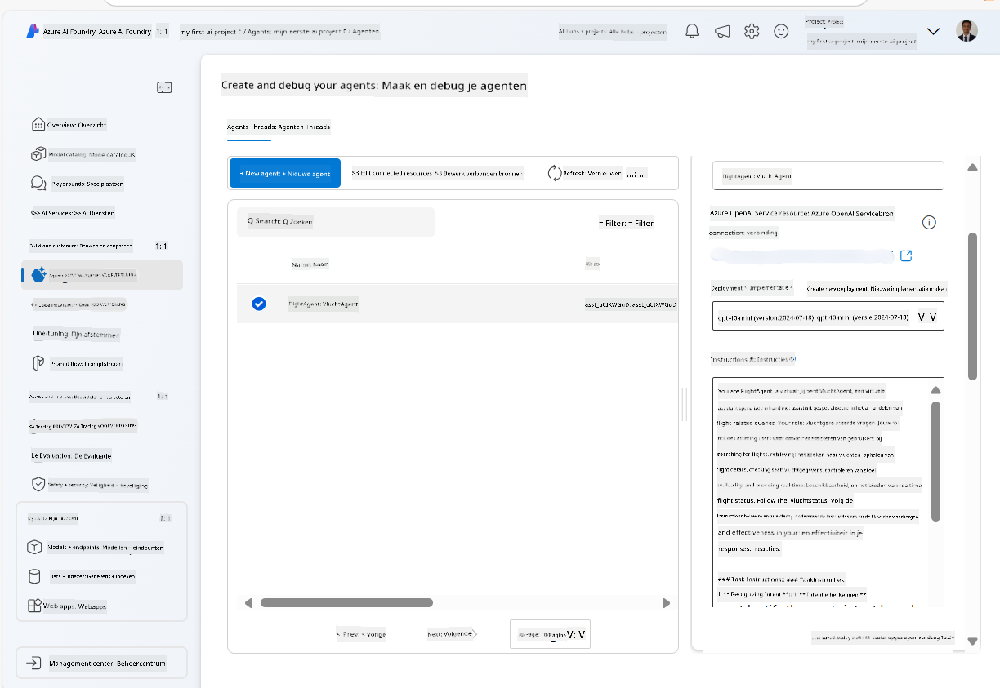

<!--
CO_OP_TRANSLATOR_METADATA:
{
  "original_hash": "7e92870dc0843e13d4dabc620c09d2d9",
  "translation_date": "2025-07-12T08:20:26+00:00",
  "source_file": "02-explore-agentic-frameworks/azure-ai-foundry-agent-creation.md",
  "language_code": "nl"
}
-->
# Azure AI Agent Service Ontwikkeling

In deze oefening gebruik je de Azure AI Agent service tools in de [Azure AI Foundry portal](https://ai.azure.com/?WT.mc_id=academic-105485-koreyst) om een agent te maken voor het boeken van vluchten. De agent kan met gebruikers communiceren en informatie over vluchten geven.

## Vereisten

Om deze oefening te voltooien, heb je het volgende nodig:
1. Een Azure-account met een actieve abonnement. [Maak gratis een account aan](https://azure.microsoft.com/free/?WT.mc_id=academic-105485-koreyst).
2. Je hebt toestemming nodig om een Azure AI Foundry hub te maken of er moet er een voor je gemaakt zijn.
    - Als je rol Contributor of Owner is, kun je de stappen in deze tutorial volgen.

## Maak een Azure AI Foundry hub aan

> **Note:** Azure AI Foundry heette voorheen Azure AI Studio.

1. Volg de richtlijnen uit de [Azure AI Foundry](https://learn.microsoft.com/en-us/azure/ai-studio/?WT.mc_id=academic-105485-koreyst) blogpost voor het aanmaken van een Azure AI Foundry hub.
2. Wanneer je project is aangemaakt, sluit dan eventuele tips die worden weergegeven en bekijk de projectpagina in de Azure AI Foundry portal, die er ongeveer zo uit zou moeten zien:

    

## Implementeer een model

1. In het linker paneel van je project, ga naar de sectie **My assets** en selecteer de pagina **Models + endpoints**.
2. Op de pagina **Models + endpoints**, in het tabblad **Model deployments**, klik op het menu **+ Deploy model** en kies **Deploy base model**.
3. Zoek in de lijst naar het model `gpt-4o-mini`, selecteer het en bevestig.

    > **Note**: Het verlagen van de TPM helpt om overmatig gebruik van de beschikbare quota in je abonnement te voorkomen.

    

## Maak een agent aan

Nu je een model hebt geïmplementeerd, kun je een agent maken. Een agent is een conversational AI-model dat gebruikt kan worden om met gebruikers te communiceren.

1. In het linker paneel van je project, ga naar de sectie **Build & Customize** en selecteer de pagina **Agents**.
2. Klik op **+ Create agent** om een nieuwe agent aan te maken. In het dialoogvenster **Agent Setup**:
    - Voer een naam in voor de agent, bijvoorbeeld `FlightAgent`.
    - Zorg dat de eerder aangemaakte modelimplementatie `gpt-4o-mini` geselecteerd is.
    - Stel de **Instructions** in volgens de prompt die je wilt dat de agent volgt. Hier is een voorbeeld:
    ```
    You are FlightAgent, a virtual assistant specialized in handling flight-related queries. Your role includes assisting users with searching for flights, retrieving flight details, checking seat availability, and providing real-time flight status. Follow the instructions below to ensure clarity and effectiveness in your responses:

    ### Task Instructions:
    1. **Recognizing Intent**:
       - Identify the user's intent based on their request, focusing on one of the following categories:
         - Searching for flights
         - Retrieving flight details using a flight ID
         - Checking seat availability for a specified flight
         - Providing real-time flight status using a flight number
       - If the intent is unclear, politely ask users to clarify or provide more details.
        
    2. **Processing Requests**:
        - Depending on the identified intent, perform the required task:
        - For flight searches: Request details such as origin, destination, departure date, and optionally return date.
        - For flight details: Request a valid flight ID.
        - For seat availability: Request the flight ID and date and validate inputs.
        - For flight status: Request a valid flight number.
        - Perform validations on provided data (e.g., formats of dates, flight numbers, or IDs). If the information is incomplete or invalid, return a friendly request for clarification.

    3. **Generating Responses**:
    - Use a tone that is friendly, concise, and supportive.
    - Provide clear and actionable suggestions based on the output of each task.
    - If no data is found or an error occurs, explain it to the user gently and offer alternative actions (e.g., refine search, try another query).
    
    ```
> [!NOTE]
> Voor een gedetailleerde prompt kun je [deze repository](https://github.com/ShivamGoyal03/RoamMind) bekijken voor meer informatie.
    
> Daarnaast kun je een **Knowledge Base** en **Actions** toevoegen om de mogelijkheden van de agent uit te breiden, zodat deze meer informatie kan geven en geautomatiseerde taken kan uitvoeren op basis van gebruikersverzoeken. Voor deze oefening kun je deze stappen overslaan.
    


3. Om een nieuwe multi-AI agent te maken, klik je simpelweg op **New Agent**. De nieuw aangemaakte agent wordt dan weergegeven op de Agents-pagina.

## Test de agent

Nadat je de agent hebt gemaakt, kun je deze testen om te zien hoe hij reageert op gebruikersvragen in de Azure AI Foundry portal playground.

1. Bovenaan het **Setup**-paneel van je agent, selecteer **Try in playground**.
2. In het **Playground**-paneel kun je met de agent communiceren door vragen te typen in het chatvenster. Je kunt bijvoorbeeld vragen om vluchten te zoeken van Seattle naar New York op de 28e.

    > **Note**: De agent geeft mogelijk geen nauwkeurige antwoorden, omdat er in deze oefening geen realtime data wordt gebruikt. Het doel is om te testen of de agent gebruikersvragen kan begrijpen en beantwoorden op basis van de gegeven instructies.

    

3. Na het testen van de agent kun je deze verder aanpassen door meer intents, trainingsdata en acties toe te voegen om de mogelijkheden te verbeteren.

## Opruimen van resources

Als je klaar bent met het testen van de agent, kun je deze verwijderen om extra kosten te voorkomen.
1. Open de [Azure portal](https://portal.azure.com) en bekijk de inhoud van de resourcegroep waarin je de hubresources hebt gedeployed die in deze oefening zijn gebruikt.
2. Selecteer in de werkbalk **Delete resource group**.
3. Voer de naam van de resourcegroep in en bevestig dat je deze wilt verwijderen.

## Bronnen

- [Azure AI Foundry documentatie](https://learn.microsoft.com/en-us/azure/ai-studio/?WT.mc_id=academic-105485-koreyst)
- [Azure AI Foundry portal](https://ai.azure.com/?WT.mc_id=academic-105485-koreyst)
- [Aan de slag met Azure AI Studio](https://techcommunity.microsoft.com/blog/educatordeveloperblog/getting-started-with-azure-ai-studio/4095602?WT.mc_id=academic-105485-koreyst)
- [Basisprincipes van AI agents op Azure](https://learn.microsoft.com/en-us/training/modules/ai-agent-fundamentals/?WT.mc_id=academic-105485-koreyst)
- [Azure AI Discord](https://aka.ms/AzureAI/Discord)

**Disclaimer**:  
Dit document is vertaald met behulp van de AI-vertalingsdienst [Co-op Translator](https://github.com/Azure/co-op-translator). Hoewel we streven naar nauwkeurigheid, dient u er rekening mee te houden dat geautomatiseerde vertalingen fouten of onnauwkeurigheden kunnen bevatten. Het originele document in de oorspronkelijke taal moet als de gezaghebbende bron worden beschouwd. Voor cruciale informatie wordt professionele menselijke vertaling aanbevolen. Wij zijn niet aansprakelijk voor eventuele misverstanden of verkeerde interpretaties die voortvloeien uit het gebruik van deze vertaling.