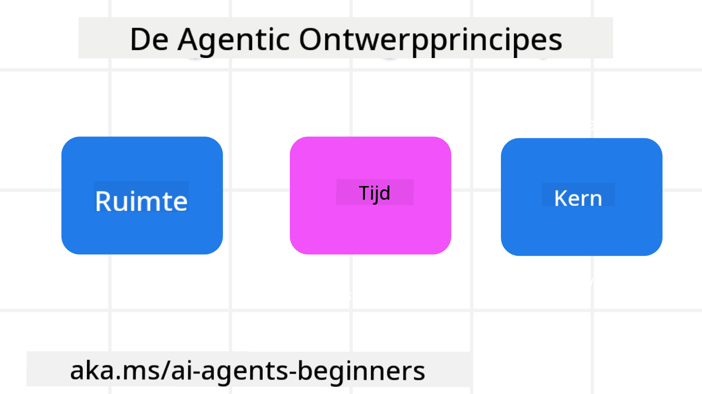

<!--
CO_OP_TRANSLATOR_METADATA:
{
  "original_hash": "4c46e4ff9e349c521e2b0b17f51afa64",
  "translation_date": "2025-08-29T17:30:08+00:00",
  "source_file": "03-agentic-design-patterns/README.md",
  "language_code": "nl"
}
-->

> _(Klik op de afbeelding hierboven om de video van deze les te bekijken)_
# Principes van Agentisch Ontwerp voor AI

## Introductie

Er zijn veel manieren om na te denken over het bouwen van AI-agentische systemen. Omdat ambiguïteit een kenmerk is en geen fout in het ontwerp van generatieve AI, is het soms lastig voor ingenieurs om te bepalen waar ze moeten beginnen. We hebben een reeks mensgerichte UX-ontwerpprincipes opgesteld om ontwikkelaars te helpen klantgerichte agentische systemen te bouwen die hun zakelijke behoeften oplossen. Deze ontwerpprincipes vormen geen voorgeschreven architectuur, maar eerder een startpunt voor teams die agentervaringen definiëren en ontwikkelen.

In het algemeen zouden agenten moeten:

- Menselijke capaciteiten verbreden en opschalen (brainstormen, probleemoplossing, automatisering, enz.)
- Kennislacunes opvullen (breng me op de hoogte van kennisdomeinen, vertaling, enz.)
- Samenwerking vergemakkelijken en ondersteunen op manieren waarop wij als individuen graag met anderen werken
- Ons betere versies van onszelf maken (bijv. levenscoach/taakmeester, ons helpen emotionele regulatie en mindfulnessvaardigheden te leren, veerkracht opbouwen, enz.)

## Wat Deze Les Behandelt

- Wat zijn de principes van agentisch ontwerp
- Wat zijn enkele richtlijnen om te volgen bij het implementeren van deze ontwerpprincipes
- Wat zijn enkele voorbeelden van het gebruik van de ontwerpprincipes

## Leerdoelen

Na het voltooien van deze les kun je:

1. Uitleggen wat de principes van agentisch ontwerp zijn
2. De richtlijnen voor het gebruik van de principes van agentisch ontwerp uitleggen
3. Begrijpen hoe je een agent kunt bouwen met behulp van de principes van agentisch ontwerp

## De Principes van Agentisch Ontwerp

### Agent (Ruimte)

Dit is de omgeving waarin de agent opereert. Deze principes informeren ons over hoe we agenten ontwerpen die actief zijn in fysieke en digitale werelden.

- **Verbinden, niet vervangen** – help mensen verbinden met andere mensen, gebeurtenissen en bruikbare kennis om samenwerking en verbinding mogelijk te maken.
- Agenten helpen gebeurtenissen, kennis en mensen met elkaar te verbinden.
- Agenten brengen mensen dichter bij elkaar. Ze zijn niet ontworpen om mensen te vervangen of te kleineren.
- **Gemakkelijk toegankelijk maar soms onzichtbaar** – de agent opereert grotendeels op de achtergrond en geeft ons alleen een duwtje wanneer dat relevant en gepast is.
  - De agent is gemakkelijk vindbaar en toegankelijk voor geautoriseerde gebruikers op elk apparaat of platform.
  - De agent ondersteunt multimodale invoer en uitvoer (geluid, stem, tekst, enz.).
  - De agent kan naadloos schakelen tussen voorgrond en achtergrond; tussen proactief en reactief, afhankelijk van de behoeften van de gebruiker.
  - De agent kan in onzichtbare vorm opereren, maar het pad van de achtergrondprocessen en de samenwerking met andere agenten is transparant en controleerbaar door de gebruiker.

### Agent (Tijd)

Dit is hoe de agent opereert in de tijd. Deze principes informeren ons over hoe we agenten ontwerpen die interactie hebben met het verleden, heden en toekomst.

- **Verleden**: Reflecteren op geschiedenis die zowel toestand als context omvat.
  - De agent biedt relevantere resultaten op basis van analyse van rijkere historische gegevens, niet alleen van de gebeurtenis, mensen of toestanden.
  - De agent creëert verbindingen vanuit gebeurtenissen uit het verleden en reflecteert actief op geheugen om te reageren op huidige situaties.
- **Nu**: Aansporen meer dan informeren.
  - De agent belichaamt een uitgebreide aanpak van interactie met mensen. Wanneer een gebeurtenis plaatsvindt, gaat de agent verder dan statische meldingen of andere statische formaliteiten. De agent kan processen vereenvoudigen of dynamisch aanwijzingen genereren om de aandacht van de gebruiker op het juiste moment te richten.
  - De agent levert informatie op basis van de contextuele omgeving, sociale en culturele veranderingen en afgestemd op de intentie van de gebruiker.
  - De interactie met de agent kan geleidelijk zijn, evolueren/groeien in complexiteit om gebruikers op de lange termijn te versterken.
- **Toekomst**: Aanpassen en evolueren.
  - De agent past zich aan verschillende apparaten, platforms en modaliteiten aan.
  - De agent past zich aan het gedrag van de gebruiker, toegankelijkheidsbehoeften en is vrij aanpasbaar.
  - De agent wordt gevormd door en evolueert door voortdurende interactie met de gebruiker.

### Agent (Kern)

Dit zijn de belangrijkste elementen in de kern van het ontwerp van een agent.

- **Omarm onzekerheid maar bouw vertrouwen op**.
  - Een bepaald niveau van onzekerheid bij de agent wordt verwacht. Onzekerheid is een belangrijk element van agentontwerp.
  - Vertrouwen en transparantie zijn fundamentele lagen van agentontwerp.
  - Mensen hebben controle over wanneer de agent aan/uit staat en de status van de agent is te allen tijde duidelijk zichtbaar.

## De Richtlijnen om Deze Principes te Implementeren

Bij het gebruik van de bovenstaande ontwerpprincipes, volg de volgende richtlijnen:

1. **Transparantie**: Informeer de gebruiker dat AI betrokken is, hoe het werkt (inclusief eerdere acties), en hoe feedback te geven en het systeem aan te passen.
2. **Controle**: Stel de gebruiker in staat om aan te passen, voorkeuren op te geven en te personaliseren, en controle te hebben over het systeem en zijn attributen (inclusief de mogelijkheid om te vergeten).
3. **Consistentie**: Streef naar consistente, multimodale ervaringen over apparaten en eindpunten. Gebruik waar mogelijk vertrouwde UI/UX-elementen (bijv. microfoonpictogram voor spraakinteractie) en verminder de cognitieve belasting van de klant zoveel mogelijk (bijv. streef naar beknopte antwoorden, visuele hulpmiddelen en 'Meer leren'-inhoud).

## Hoe Ontwerp Je een Reisagent met Deze Principes en Richtlijnen

Stel je voor dat je een reisagent ontwerpt, hier is hoe je kunt denken over het gebruik van de ontwerpprincipes en richtlijnen:

1. **Transparantie** – Laat de gebruiker weten dat de reisagent een AI-gestuurde agent is. Geef enkele basisinstructies over hoe te beginnen (bijv. een "Hallo"-bericht, voorbeeldprompts). Documenteer dit duidelijk op de productpagina. Toon de lijst van prompts die een gebruiker in het verleden heeft gevraagd. Maak duidelijk hoe feedback te geven (duimpje omhoog en omlaag, Feedback verzenden-knop, enz.). Geef duidelijk aan of de agent gebruiks- of onderwerpbeperkingen heeft.
2. **Controle** – Zorg ervoor dat het duidelijk is hoe de gebruiker de agent kan aanpassen nadat deze is gemaakt, bijvoorbeeld met de systeemprompt. Stel de gebruiker in staat te kiezen hoe uitgebreid de agent is, zijn schrijfstijl, en eventuele beperkingen over waar de agent niet over mag praten. Laat de gebruiker geassocieerde bestanden of gegevens, prompts en eerdere gesprekken bekijken en verwijderen.
3. **Consistentie** – Zorg ervoor dat de pictogrammen voor Prompt delen, een bestand of foto toevoegen en iemand of iets taggen standaard en herkenbaar zijn. Gebruik het paperclip-pictogram om bestand uploaden/delen met de agent aan te geven, en een afbeeldingspictogram om grafische upload aan te geven.

### Meer Vragen over Agentische Ontwerp Patronen?

Word lid van de [Azure AI Foundry Discord](https://aka.ms/ai-agents/discord) om andere leerlingen te ontmoeten, spreekuren bij te wonen en je vragen over AI-agenten beantwoord te krijgen.

## Aanvullende Bronnen

## Vorige Les

[Agentische Frameworks Verkennen](../02-explore-agentic-frameworks/README.md)

## Volgende Les

[Ontwerppatroon voor Hulpmiddelen](../04-tool-use/README.md)

---

**Disclaimer**:  
Dit document is vertaald met behulp van de AI-vertalingsservice [Co-op Translator](https://github.com/Azure/co-op-translator). Hoewel we streven naar nauwkeurigheid, dient u zich ervan bewust te zijn dat geautomatiseerde vertalingen fouten of onnauwkeurigheden kunnen bevatten. Het originele document in zijn oorspronkelijke taal moet worden beschouwd als de gezaghebbende bron. Voor cruciale informatie wordt professionele menselijke vertaling aanbevolen. Wij zijn niet aansprakelijk voor eventuele misverstanden of verkeerde interpretaties die voortvloeien uit het gebruik van deze vertaling.