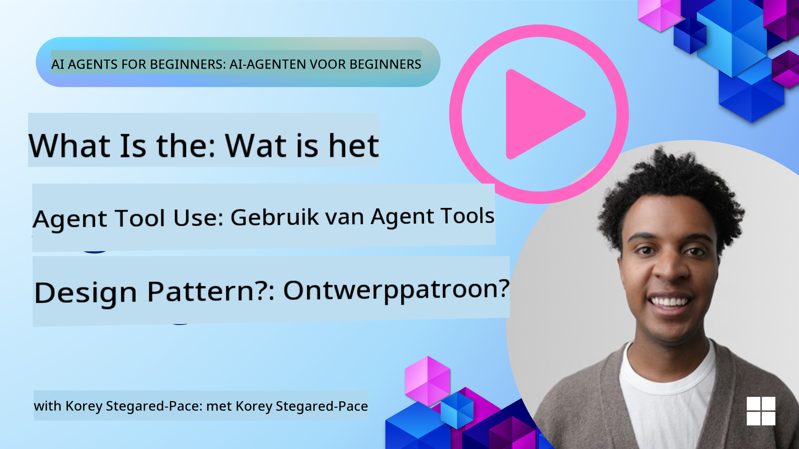
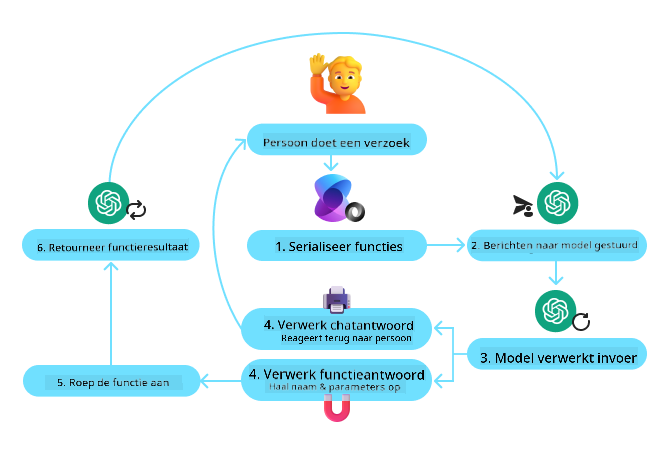
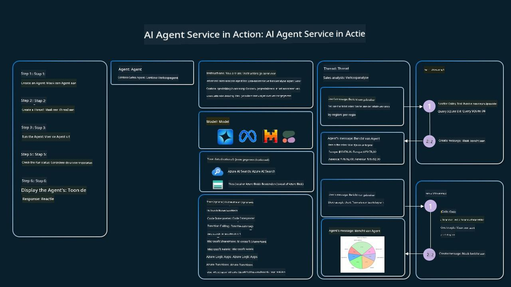

<!--
CO_OP_TRANSLATOR_METADATA:
{
  "original_hash": "88258b03f2893aa2e69eb8fb24baabbc",
  "translation_date": "2025-07-12T09:38:05+00:00",
  "source_file": "04-tool-use/README.md",
  "language_code": "nl"
}
-->
[](https://youtu.be/vieRiPRx-gI?si=cEZ8ApnT6Sus9rhn)

> _(Klik op de afbeelding hierboven om de video van deze les te bekijken)_

# Tool Use Design Pattern

Tools zijn interessant omdat ze AI-agenten een breder scala aan mogelijkheden bieden. In plaats van dat de agent een beperkte set acties kan uitvoeren, kan de agent door het toevoegen van een tool nu een veelvoud aan acties uitvoeren. In dit hoofdstuk bekijken we het Tool Use Design Pattern, dat beschrijft hoe AI-agenten specifieke tools kunnen gebruiken om hun doelen te bereiken.

## Introductie

In deze les proberen we de volgende vragen te beantwoorden:

- Wat is het tool use design pattern?
- Voor welke use cases kan het worden toegepast?
- Wat zijn de elementen/bouwstenen die nodig zijn om het design pattern te implementeren?
- Welke speciale aandachtspunten zijn er bij het gebruik van het Tool Use Design Pattern om betrouwbare AI-agenten te bouwen?

## Leerdoelen

Na het voltooien van deze les kun je:

- Het Tool Use Design Pattern definiëren en het doel ervan uitleggen.
- Use cases herkennen waarin het Tool Use Design Pattern toepasbaar is.
- De belangrijkste elementen begrijpen die nodig zijn om het design pattern te implementeren.
- Overwegingen herkennen om betrouwbaarheid te waarborgen bij AI-agenten die dit design pattern gebruiken.

## Wat is het Tool Use Design Pattern?

Het **Tool Use Design Pattern** richt zich op het geven van de mogelijkheid aan LLM’s om te communiceren met externe tools om specifieke doelen te bereiken. Tools zijn code die door een agent kan worden uitgevoerd om acties uit te voeren. Een tool kan een eenvoudige functie zijn, zoals een rekenmachine, of een API-aanroep naar een externe dienst, zoals het opzoeken van aandelenkoersen of het weerbericht. In de context van AI-agenten zijn tools ontworpen om door agenten te worden uitgevoerd als reactie op **modelgegenereerde functie-aanroepen**.

## Voor welke use cases kan het worden toegepast?

AI-agenten kunnen tools gebruiken om complexe taken te voltooien, informatie op te halen of beslissingen te nemen. Het tool use design pattern wordt vaak toegepast in scenario’s die dynamische interactie met externe systemen vereisen, zoals databases, webservices of code-interpreters. Deze mogelijkheid is nuttig voor verschillende use cases, waaronder:

- **Dynamische informatieopvraging:** Agenten kunnen externe API’s of databases raadplegen om actuele gegevens op te halen (bijv. een SQLite-database raadplegen voor data-analyse, aandelenkoersen of weerinformatie ophalen).
- **Code-uitvoering en interpretatie:** Agenten kunnen code of scripts uitvoeren om wiskundige problemen op te lossen, rapporten te genereren of simulaties uit te voeren.
- **Workflow-automatisering:** Het automatiseren van repetitieve of meerstaps workflows door tools te integreren zoals taakplanners, e-mailservices of datapijplijnen.
- **Klantenservice:** Agenten kunnen communiceren met CRM-systemen, ticketplatforms of kennisbanken om gebruikersvragen op te lossen.
- **Contentcreatie en -bewerking:** Agenten kunnen tools gebruiken zoals grammaticacontrole, tekstsamenvatters of contentveiligheidsevaluators om te helpen bij het maken van content.

## Wat zijn de elementen/bouwstenen die nodig zijn om het tool use design pattern te implementeren?

Deze bouwstenen stellen de AI-agent in staat om een breed scala aan taken uit te voeren. Laten we de belangrijkste elementen bekijken die nodig zijn om het Tool Use Design Pattern te implementeren:

- **Function/Tool Schemas**: Gedetailleerde definities van beschikbare tools, inclusief functienaam, doel, vereiste parameters en verwachte outputs. Deze schemas stellen de LLM in staat te begrijpen welke tools beschikbaar zijn en hoe geldige verzoeken opgebouwd moeten worden.

- **Function Execution Logic**: Bepaalt hoe en wanneer tools worden aangeroepen op basis van de intentie van de gebruiker en de context van het gesprek. Dit kan planner-modules, routeringsmechanismen of conditionele flows omvatten die het gebruik van tools dynamisch bepalen.

- **Message Handling System**: Componenten die de gespreksstroom beheren tussen gebruikersinvoer, LLM-antwoorden, tool-aanroepen en tool-uitvoer.

- **Tool Integration Framework**: Infrastructuur die de agent verbindt met verschillende tools, of het nu eenvoudige functies of complexe externe diensten zijn.

- **Error Handling & Validation**: Mechanismen om fouten bij tool-uitvoering af te handelen, parameters te valideren en onverwachte reacties te beheren.

- **State Management**: Houdt de gesprekcontext, eerdere tool-interacties en persistente data bij om consistentie te waarborgen over meerdere gespreksrondes.

Laten we nu Function/Tool Calling wat nader bekijken.

### Function/Tool Calling

Function calling is de belangrijkste manier waarop we Large Language Models (LLM’s) in staat stellen om met tools te communiceren. Je ziet vaak dat ‘Function’ en ‘Tool’ door elkaar worden gebruikt, omdat ‘functions’ (herbruikbare codeblokken) de ‘tools’ zijn die agenten gebruiken om taken uit te voeren. Om de code van een functie aan te roepen, moet een LLM het verzoek van de gebruiker vergelijken met de beschrijving van de functies. Hiervoor wordt een schema met de beschrijvingen van alle beschikbare functies naar de LLM gestuurd. De LLM selecteert vervolgens de meest geschikte functie voor de taak en geeft de naam en argumenten terug. De geselecteerde functie wordt aangeroepen, het antwoord wordt teruggestuurd naar de LLM, die deze informatie gebruikt om te reageren op het verzoek van de gebruiker.

Voor ontwikkelaars die function calling voor agenten willen implementeren, zijn de volgende zaken nodig:

1. Een LLM-model dat function calling ondersteunt
2. Een schema met functiebeschrijvingen
3. De code voor elke beschreven functie

Laten we het voorbeeld gebruiken van het opvragen van de huidige tijd in een stad om dit te illustreren:

1. **Initialiseer een LLM die function calling ondersteunt:**

    Niet alle modellen ondersteunen function calling, dus het is belangrijk om te controleren of het LLM dat je gebruikt dit doet. <a href="https://learn.microsoft.com/azure/ai-services/openai/how-to/function-calling" target="_blank">Azure OpenAI</a> ondersteunt function calling. We kunnen beginnen met het initialiseren van de Azure OpenAI-client.

    ```python
    # Initialize the Azure OpenAI client
    client = AzureOpenAI(
        azure_endpoint = os.getenv("AZURE_OPENAI_ENDPOINT"), 
        api_key=os.getenv("AZURE_OPENAI_API_KEY"),  
        api_version="2024-05-01-preview"
    )
    ```

1. **Maak een Function Schema:**

    Vervolgens definiëren we een JSON-schema dat de functienaam, een beschrijving van wat de functie doet, en de namen en beschrijvingen van de functieparameters bevat. We geven dit schema door aan de eerder gemaakte client, samen met het gebruikersverzoek om de tijd in San Francisco op te vragen. Belangrijk om te weten is dat er een **tool call** wordt teruggegeven, **niet** het uiteindelijke antwoord op de vraag. Zoals eerder genoemd, geeft de LLM de naam van de functie terug die hij voor de taak heeft geselecteerd, en de argumenten die eraan worden doorgegeven.

    ```python
    # Function description for the model to read
    tools = [
        {
            "type": "function",
            "function": {
                "name": "get_current_time",
                "description": "Get the current time in a given location",
                "parameters": {
                    "type": "object",
                    "properties": {
                        "location": {
                            "type": "string",
                            "description": "The city name, e.g. San Francisco",
                        },
                    },
                    "required": ["location"],
                },
            }
        }
    ]
    ```
   
    ```python
  
    # Initial user message
    messages = [{"role": "user", "content": "What's the current time in San Francisco"}] 
  
    # First API call: Ask the model to use the function
      response = client.chat.completions.create(
          model=deployment_name,
          messages=messages,
          tools=tools,
          tool_choice="auto",
      )
  
      # Process the model's response
      response_message = response.choices[0].message
      messages.append(response_message)
  
      print("Model's response:")  

      print(response_message)
  
    ```

    ```bash
    Model's response:
    ChatCompletionMessage(content=None, role='assistant', function_call=None, tool_calls=[ChatCompletionMessageToolCall(id='call_pOsKdUlqvdyttYB67MOj434b', function=Function(arguments='{"location":"San Francisco"}', name='get_current_time'), type='function')])
    ```
  
1. **De functiecode die de taak uitvoert:**

    Nu de LLM heeft gekozen welke functie uitgevoerd moet worden, moet de code die de taak uitvoert geïmplementeerd en uitgevoerd worden. We kunnen de code om de huidige tijd op te halen in Python schrijven. We moeten ook de code schrijven om de naam en argumenten uit het response_message te halen om het uiteindelijke resultaat te verkrijgen.

    ```python
      def get_current_time(location):
        """Get the current time for a given location"""
        print(f"get_current_time called with location: {location}")  
        location_lower = location.lower()
        
        for key, timezone in TIMEZONE_DATA.items():
            if key in location_lower:
                print(f"Timezone found for {key}")  
                current_time = datetime.now(ZoneInfo(timezone)).strftime("%I:%M %p")
                return json.dumps({
                    "location": location,
                    "current_time": current_time
                })
      
        print(f"No timezone data found for {location_lower}")  
        return json.dumps({"location": location, "current_time": "unknown"})
    ```

    ```python
     # Handle function calls
      if response_message.tool_calls:
          for tool_call in response_message.tool_calls:
              if tool_call.function.name == "get_current_time":
     
                  function_args = json.loads(tool_call.function.arguments)
     
                  time_response = get_current_time(
                      location=function_args.get("location")
                  )
     
                  messages.append({
                      "tool_call_id": tool_call.id,
                      "role": "tool",
                      "name": "get_current_time",
                      "content": time_response,
                  })
      else:
          print("No tool calls were made by the model.")  
  
      # Second API call: Get the final response from the model
      final_response = client.chat.completions.create(
          model=deployment_name,
          messages=messages,
      )
  
      return final_response.choices[0].message.content
     ```

    ```bash
      get_current_time called with location: San Francisco
      Timezone found for san francisco
      The current time in San Francisco is 09:24 AM.
     ```

Function Calling vormt de kern van de meeste, zo niet alle, agent tool use designs, maar het zelf implementeren kan soms uitdagend zijn. Zoals we leerden in [Les 2](../../../02-explore-agentic-frameworks) bieden agentic frameworks kant-en-klare bouwstenen om tool use te implementeren.

## Voorbeelden van Tool Use met Agentic Frameworks

Hier zijn enkele voorbeelden van hoe je het Tool Use Design Pattern kunt implementeren met verschillende agentic frameworks:

### Semantic Kernel

<a href="https://learn.microsoft.com/azure/ai-services/agents/overview" target="_blank">Semantic Kernel</a> is een open-source AI-framework voor .NET, Python en Java-ontwikkelaars die werken met Large Language Models (LLM’s). Het vereenvoudigt het gebruik van function calling door automatisch je functies en hun parameters te beschrijven aan het model via een proces dat <a href="https://learn.microsoft.com/semantic-kernel/concepts/ai-services/chat-completion/function-calling/?pivots=programming-language-python#1-serializing-the-functions" target="_blank">serializing</a> wordt genoemd. Het regelt ook de communicatie tussen het model en je code. Een ander voordeel van het gebruik van een agentic framework zoals Semantic Kernel is dat je toegang hebt tot kant-en-klare tools zoals <a href="https://github.com/microsoft/semantic-kernel/blob/main/python/samples/getting_started_with_agents/openai_assistant/step4_assistant_tool_file_search.py" target="_blank">File Search</a> en <a href="https://github.com/microsoft/semantic-kernel/blob/main/python/samples/getting_started_with_agents/openai_assistant/step3_assistant_tool_code_interpreter.py" target="_blank">Code Interpreter</a>.

Het volgende diagram illustreert het proces van function calling met Semantic Kernel:



In Semantic Kernel worden functies/tools <a href="https://learn.microsoft.com/semantic-kernel/concepts/plugins/?pivots=programming-language-python" target="_blank">Plugins</a> genoemd. We kunnen de eerder genoemde `get_current_time` functie omzetten in een plugin door deze in een klasse te plaatsen met de functie erin. We kunnen ook de `kernel_function` decorator importeren, die de beschrijving van de functie ontvangt. Wanneer je vervolgens een kernel maakt met de GetCurrentTimePlugin, serialiseert de kernel automatisch de functie en zijn parameters, en maakt het schema dat naar de LLM wordt gestuurd.

```python
from semantic_kernel.functions import kernel_function

class GetCurrentTimePlugin:
    async def __init__(self, location):
        self.location = location

    @kernel_function(
        description="Get the current time for a given location"
    )
    def get_current_time(location: str = ""):
        ...

```

```python 
from semantic_kernel import Kernel

# Create the kernel
kernel = Kernel()

# Create the plugin
get_current_time_plugin = GetCurrentTimePlugin(location)

# Add the plugin to the kernel
kernel.add_plugin(get_current_time_plugin)
```
  
### Azure AI Agent Service

<a href="https://learn.microsoft.com/azure/ai-services/agents/overview" target="_blank">Azure AI Agent Service</a> is een nieuwer agentic framework dat is ontworpen om ontwikkelaars in staat te stellen veilig hoogwaardige, uitbreidbare AI-agenten te bouwen, te implementeren en op te schalen zonder dat ze de onderliggende compute- en opslagresources hoeven te beheren. Het is vooral nuttig voor enterprise-toepassingen omdat het een volledig beheerde service is met enterprise-grade beveiliging.

In vergelijking met directe ontwikkeling met de LLM API biedt Azure AI Agent Service enkele voordelen, waaronder:

- Automatisch tool-aanroepen – geen noodzaak om tool calls te parsen, tools aan te roepen en reacties af te handelen; dit gebeurt nu server-side
- Veilig beheerde data – in plaats van zelf de gesprekstatus te beheren, kun je vertrouwen op threads die alle benodigde informatie opslaan
- Kant-en-klare tools – tools die je kunt gebruiken om te communiceren met je databronnen, zoals Bing, Azure AI Search en Azure Functions.

De tools die beschikbaar zijn in Azure AI Agent Service kunnen worden onderverdeeld in twee categorieën:

1. Knowledge Tools:
    - <a href="https://learn.microsoft.com/azure/ai-services/agents/how-to/tools/bing-grounding?tabs=python&pivots=overview" target="_blank">Grounding met Bing Search</a>
    - <a href="https://learn.microsoft.com/azure/ai-services/agents/how-to/tools/file-search?tabs=python&pivots=overview" target="_blank">File Search</a>
    - <a href="https://learn.microsoft.com/azure/ai-services/agents/how-to/tools/azure-ai-search?tabs=azurecli%2Cpython&pivots=overview-azure-ai-search" target="_blank">Azure AI Search</a>

2. Action Tools:
    - <a href="https://learn.microsoft.com/azure/ai-services/agents/how-to/tools/function-calling?tabs=python&pivots=overview" target="_blank">Function Calling</a>
    - <a href="https://learn.microsoft.com/azure/ai-services/agents/how-to/tools/code-interpreter?tabs=python&pivots=overview" target="_blank">Code Interpreter</a>
    - <a href="https://learn.microsoft.com/azure/ai-services/agents/how-to/tools/openapi-spec?tabs=python&pivots=overview" target="_blank">OpenAI gedefinieerde tools</a>
    - <a href="https://learn.microsoft.com/azure/ai-services/agents/how-to/tools/azure-functions?pivots=overview" target="_blank">Azure Functions</a>

De Agent Service stelt ons in staat om deze tools samen te gebruiken als een `toolset`. Het maakt ook gebruik van `threads` die de geschiedenis van berichten van een bepaald gesprek bijhouden.

Stel je voor dat je een salesagent bent bij een bedrijf genaamd Contoso. Je wilt een conversatie-agent ontwikkelen die vragen over je verkoopgegevens kan beantwoorden.

De volgende afbeelding illustreert hoe je Azure AI Agent Service kunt gebruiken om je verkoopgegevens te analyseren:



Om een van deze tools met de service te gebruiken, kunnen we een client maken en een tool of toolset definiëren. Om dit praktisch te implementeren, kunnen we de volgende Python-code gebruiken. De LLM kan dan naar de toolset kijken en beslissen of hij de door de gebruiker gemaakte functie `fetch_sales_data_using_sqlite_query` gebruikt, of de kant-en-klare Code Interpreter, afhankelijk van het gebruikersverzoek.

```python 
import os
from azure.ai.projects import AIProjectClient
from azure.identity import DefaultAzureCredential
from fecth_sales_data_functions import fetch_sales_data_using_sqlite_query # fetch_sales_data_using_sqlite_query function which can be found in a fetch_sales_data_functions.py file.
from azure.ai.projects.models import ToolSet, FunctionTool, CodeInterpreterTool

project_client = AIProjectClient.from_connection_string(
    credential=DefaultAzureCredential(),
    conn_str=os.environ["PROJECT_CONNECTION_STRING"],
)

# Initialize function calling agent with the fetch_sales_data_using_sqlite_query function and adding it to the toolset
fetch_data_function = FunctionTool(fetch_sales_data_using_sqlite_query)
toolset = ToolSet()
toolset.add(fetch_data_function)

# Initialize Code Interpreter tool and adding it to the toolset. 
code_interpreter = code_interpreter = CodeInterpreterTool()
toolset = ToolSet()
toolset.add(code_interpreter)

agent = project_client.agents.create_agent(
    model="gpt-4o-mini", name="my-agent", instructions="You are helpful agent", 
    toolset=toolset
)
```

## Welke speciale aandachtspunten zijn er bij het gebruik van het Tool Use Design Pattern om betrouwbare AI-agenten te bouwen?

Een veelvoorkomende zorg bij dynamisch door LLM’s gegenereerde SQL is veiligheid, met name het risico op SQL-injectie of kwaadaardige acties, zoals het verwijderen of manipuleren van de database. Hoewel deze zorgen terecht zijn, kunnen ze effectief worden beperkt door de database-toegangsrechten correct te configureren. Voor de meeste databases betekent dit dat de database als alleen-lezen wordt ingesteld. Voor databaseservices zoals PostgreSQL of Azure SQL moet de app een alleen-lezen (SELECT) rol krijgen toegewezen.

Het draaien van de app in een veilige omgeving verhoogt de bescherming nog verder. In enterprise-scenario’s worden data meestal geëxtraheerd en getransformeerd uit operationele systemen naar een alleen-lezen database of datawarehouse met een gebruiksvriendelijk schema. Deze aanpak zorgt ervoor dat de data veilig is, geoptimaliseerd voor prestaties en toegankelijkheid, en dat de app beperkte, alleen-lezen toegang heeft.

## Aanvullende bronnen

-
<a href="https://microsoft.github.io/build-your-first-agent-with-azure-ai-agent-service-workshop/" target="_blank">
Azure AI Agents Service Workshop</a>
- <a href="https://github.com/Azure-Samples/contoso-creative-writer/tree/main/docs/workshop" target="_blank">Contoso Creative Writer Multi-Agent Workshop</a>
- <a href="https://learn.microsoft.com/semantic-kernel/concepts/ai-services/chat-completion/function-calling/?pivots=programming-language-python#1-serializing-the-functions" target="_blank">Semantic Kernel Function Calling Tutorial</a>
- <a href="https://github.com/microsoft/semantic-kernel/blob/main/python/samples/getting_started_with_agents/openai_assistant/step3_assistant_tool_code_interpreter.py" target="_blank">Semantic Kernel Code Interpreter</a>
- <a href="https://microsoft.github.io/autogen/dev/user-guide/core-user-guide/components/tools.html" target="_blank">Autogen Tools</a>

## Vorige Les

[Begrijpen van Agentic Design Patterns](../03-agentic-design-patterns/README.md)

## Volgende Les

[Agentic RAG](../05-agentic-rag/README.md)

**Disclaimer**:  
Dit document is vertaald met behulp van de AI-vertalingsdienst [Co-op Translator](https://github.com/Azure/co-op-translator). Hoewel we streven naar nauwkeurigheid, dient u er rekening mee te houden dat geautomatiseerde vertalingen fouten of onnauwkeurigheden kunnen bevatten. Het originele document in de oorspronkelijke taal moet als de gezaghebbende bron worden beschouwd. Voor cruciale informatie wordt professionele menselijke vertaling aanbevolen. Wij zijn niet aansprakelijk voor eventuele misverstanden of verkeerde interpretaties die voortvloeien uit het gebruik van deze vertaling.