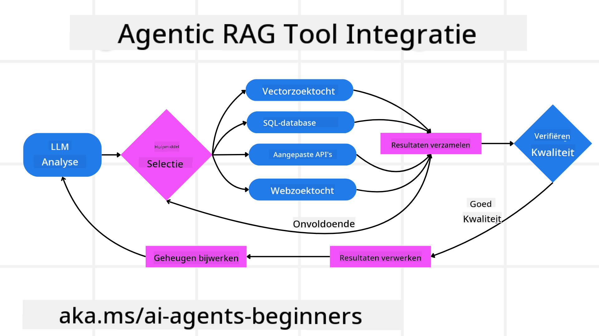
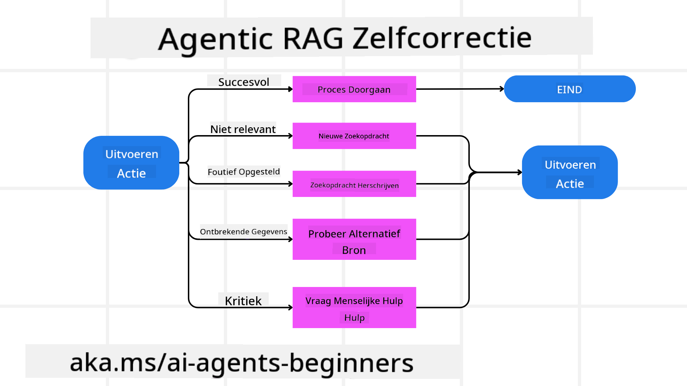
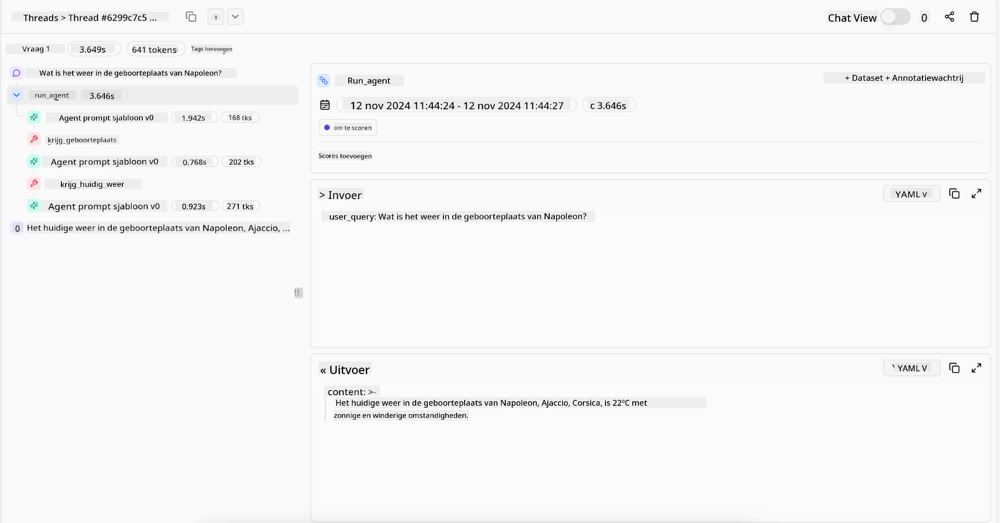

<!--
CO_OP_TRANSLATOR_METADATA:
{
  "original_hash": "7622aa72f9e676e593339f5f694ecd7d",
  "translation_date": "2025-07-12T10:06:31+00:00",
  "source_file": "05-agentic-rag/README.md",
  "language_code": "nl"
}
-->

> _(Klik op de afbeelding hierboven om de video van deze les te bekijken)_

# Agentic RAG

Deze les geeft een uitgebreid overzicht van Agentic Retrieval-Augmented Generation (Agentic RAG), een opkomend AI-paradigma waarbij grote taalmodellen (LLM's) autonoom hun volgende stappen plannen terwijl ze informatie uit externe bronnen halen. In tegenstelling tot statische retrieval-then-read patronen omvat Agentic RAG iteratieve oproepen naar het LLM, afgewisseld met tool- of functieoproepen en gestructureerde outputs. Het systeem evalueert resultaten, verfijnt zoekopdrachten, roept indien nodig extra tools aan en zet deze cyclus voort totdat een bevredigende oplossing is bereikt.

## Introductie

In deze les behandelen we

- **Begrijp Agentic RAG:** Leer over het opkomende paradigma in AI waarbij grote taalmodellen (LLM's) autonoom hun volgende stappen plannen terwijl ze informatie uit externe databronnen halen.
- **Begrijp de Iteratieve Maker-Checker Stijl:** Begrijp de lus van iteratieve oproepen naar het LLM, afgewisseld met tool- of functieoproepen en gestructureerde outputs, ontworpen om de juistheid te verbeteren en om te gaan met foutieve zoekopdrachten.
- **Verken Praktische Toepassingen:** Identificeer scenario’s waarin Agentic RAG uitblinkt, zoals omgevingen waar juistheid voorop staat, complexe database-interacties en uitgebreide workflows.

## Leerdoelen

Na het voltooien van deze les weet je hoe je/begrijp je:

- **Begrip van Agentic RAG:** Leer over het opkomende paradigma in AI waarbij grote taalmodellen (LLM's) autonoom hun volgende stappen plannen terwijl ze informatie uit externe databronnen halen.
- **Iteratieve Maker-Checker Stijl:** Begrijp het concept van een lus van iteratieve oproepen naar het LLM, afgewisseld met tool- of functieoproepen en gestructureerde outputs, ontworpen om de juistheid te verbeteren en om te gaan met foutieve zoekopdrachten.
- **Het Redeneringsproces Bezitten:** Begrijp het vermogen van het systeem om het redeneringsproces zelf te beheren, waarbij het beslissingen neemt over hoe het problemen aanpakt zonder te vertrouwen op vooraf gedefinieerde paden.
- **Workflow:** Begrijp hoe een agentic model zelfstandig besluit om markttrendrapporten op te halen, concurrentiegegevens te identificeren, interne verkoopstatistieken te correleren, bevindingen te synthetiseren en de strategie te evalueren.
- **Iteratieve Lussen, Toolintegratie en Geheugen:** Leer over het vertrouwen van het systeem op een gelopen interactiepatroon, waarbij het status en geheugen over stappen heen behoudt om herhalende lussen te vermijden en geïnformeerde beslissingen te nemen.
- **Omgaan met Faalmodi en Zelfcorrectie:** Verken de robuuste zelfcorrectiemechanismen van het systeem, inclusief itereren en opnieuw opvragen, gebruik van diagnostische tools en terugvallen op menselijke supervisie.
- **Beperkingen van Agency:** Begrijp de beperkingen van Agentic RAG, met focus op domeinspecifieke autonomie, afhankelijkheid van infrastructuur en respect voor veiligheidsmaatregelen.
- **Praktische Gebruikssituaties en Waarde:** Identificeer scenario’s waarin Agentic RAG uitblinkt, zoals omgevingen waar juistheid voorop staat, complexe database-interacties en uitgebreide workflows.
- **Governance, Transparantie en Vertrouwen:** Leer over het belang van governance en transparantie, inclusief uitlegbare redenering, biascontrole en menselijke supervisie.

## Wat is Agentic RAG?

Agentic Retrieval-Augmented Generation (Agentic RAG) is een opkomend AI-paradigma waarbij grote taalmodellen (LLM's) autonoom hun volgende stappen plannen terwijl ze informatie uit externe bronnen halen. In tegenstelling tot statische retrieval-then-read patronen omvat Agentic RAG iteratieve oproepen naar het LLM, afgewisseld met tool- of functieoproepen en gestructureerde outputs. Het systeem evalueert resultaten, verfijnt zoekopdrachten, roept indien nodig extra tools aan en zet deze cyclus voort totdat een bevredigende oplossing is bereikt. Deze iteratieve “maker-checker” stijl verbetert de juistheid, gaat om met foutieve zoekopdrachten en zorgt voor resultaten van hoge kwaliteit.

Het systeem beheert actief zijn redeneringsproces, herschrijft mislukte zoekopdrachten, kiest verschillende retrievalmethoden en integreert meerdere tools—zoals vectorzoekopdrachten in Azure AI Search, SQL-databases of aangepaste API’s—voordat het zijn antwoord afrondt. Het onderscheidende kenmerk van een agentic systeem is het vermogen om het redeneringsproces zelf te beheren. Traditionele RAG-implementaties vertrouwen op vooraf gedefinieerde paden, maar een agentic systeem bepaalt autonoom de volgorde van stappen op basis van de kwaliteit van de gevonden informatie.

## Definitie van Agentic Retrieval-Augmented Generation (Agentic RAG)

Agentic Retrieval-Augmented Generation (Agentic RAG) is een opkomend paradigma in AI-ontwikkeling waarbij LLM's niet alleen informatie uit externe databronnen halen, maar ook autonoom hun volgende stappen plannen. In tegenstelling tot statische retrieval-then-read patronen of zorgvuldig gescripte promptreeksen, omvat Agentic RAG een lus van iteratieve oproepen naar het LLM, afgewisseld met tool- of functieoproepen en gestructureerde outputs. Bij elke stap evalueert het systeem de verkregen resultaten, beslist het of het zijn zoekopdrachten moet verfijnen, roept het indien nodig extra tools aan en zet het deze cyclus voort totdat een bevredigende oplossing is bereikt.

Deze iteratieve “maker-checker” werkwijze is ontworpen om de juistheid te verbeteren, foutieve zoekopdrachten naar gestructureerde databases (bijv. NL2SQL) te verwerken en evenwichtige, hoogwaardige resultaten te garanderen. In plaats van uitsluitend te vertrouwen op zorgvuldig ontworpen promptketens, beheert het systeem actief zijn redeneringsproces. Het kan zoekopdrachten herschrijven die mislukken, verschillende retrievalmethoden kiezen en meerdere tools integreren—zoals vectorzoekopdrachten in Azure AI Search, SQL-databases of aangepaste API’s—voordat het zijn antwoord afrondt. Dit elimineert de noodzaak voor te complexe orkestratiekaders. In plaats daarvan kan een relatief eenvoudige lus van “LLM-oproep → toolgebruik → LLM-oproep → …” geavanceerde en goed onderbouwde outputs opleveren.

## Het Redeneringsproces Bezitten

Het onderscheidende kenmerk dat een systeem “agentic” maakt, is het vermogen om het redeneringsproces zelf te beheren. Traditionele RAG-implementaties zijn vaak afhankelijk van door mensen vooraf gedefinieerde paden voor het model: een chain-of-thought die aangeeft wat wanneer opgehaald moet worden.  
Maar wanneer een systeem echt agentic is, bepaalt het intern hoe het het probleem aanpakt. Het voert niet alleen een script uit; het bepaalt autonoom de volgorde van stappen op basis van de kwaliteit van de gevonden informatie.  
Bijvoorbeeld, als het gevraagd wordt een productlanceringsstrategie te creëren, vertrouwt het niet alleen op een prompt die de hele onderzoeks- en besluitvormingsworkflow beschrijft. In plaats daarvan besluit het agentic model zelfstandig om:

1. Huidige markttrendrapporten op te halen via Bing Web Grounding  
2. Relevante concurrentiegegevens te identificeren met Azure AI Search  
3. Historische interne verkoopstatistieken te correleren met Azure SQL Database  
4. De bevindingen te synthetiseren in een samenhangende strategie, gecoördineerd via Azure OpenAI Service  
5. De strategie te evalueren op hiaten of inconsistenties, en indien nodig een nieuwe ronde van ophalen te starten  

Al deze stappen—zoekopdrachten verfijnen, bronnen kiezen, itereren totdat het “tevreden” is met het antwoord—worden door het model zelf beslist, niet door een mens vooraf gescript.

## Iteratieve Lussen, Toolintegratie en Geheugen

Een agentic systeem vertrouwt op een gelopen interactiepatroon:

- **Initiële Oproep:** Het doel van de gebruiker (oftewel de gebruikersprompt) wordt aan het LLM gepresenteerd.  
- **Toolaanroep:** Als het model ontbrekende informatie of onduidelijke instructies herkent, selecteert het een tool of retrievalmethode—zoals een vector database query (bijv. Azure AI Search Hybrid search over privédata) of een gestructureerde SQL-oproep—om meer context te verzamelen.  
- **Beoordeling & Verfijning:** Na het bekijken van de teruggegeven data beslist het model of de informatie voldoende is. Zo niet, dan verfijnt het de zoekopdracht, probeert een andere tool of past het zijn aanpak aan.  
- **Herhalen Tot Tevreden:** Deze cyclus gaat door totdat het model bepaalt dat het genoeg duidelijkheid en bewijs heeft om een definitief, goed onderbouwd antwoord te geven.  
- **Geheugen & Status:** Omdat het systeem status en geheugen over de stappen heen behoudt, kan het eerdere pogingen en hun uitkomsten herinneren, herhalende lussen vermijden en beter geïnformeerde beslissingen nemen tijdens het proces.

Na verloop van tijd ontstaat zo een gevoel van groeiend begrip, waardoor het model complexe, meerstaps taken kan uitvoeren zonder dat een mens constant hoeft in te grijpen of de prompt moet aanpassen.

## Omgaan met Faalmodi en Zelfcorrectie

De autonomie van Agentic RAG omvat ook robuuste zelfcorrectiemechanismen. Wanneer het systeem vastloopt—zoals het ophalen van irrelevante documenten of het tegenkomen van foutieve zoekopdrachten—kan het:

- **Itereren en Opnieuw Opvragen:** In plaats van lage-waarde antwoorden te geven, probeert het model nieuwe zoekstrategieën, herschrijft het databasequeries of bekijkt het alternatieve datasets.  
- **Gebruik van Diagnostische Tools:** Het systeem kan extra functies aanroepen die helpen bij het debuggen van redeneringsstappen of het bevestigen van de juistheid van opgehaalde data. Tools zoals Azure AI Tracing zijn belangrijk om robuuste observeerbaarheid en monitoring mogelijk te maken.  
- **Terugvallen op Menselijke Supervisie:** Voor scenario’s met hoge impact of herhaald falen kan het model onzekerheid signaleren en om menselijke begeleiding vragen. Zodra de mens corrigerende feedback geeft, kan het model die les meenemen voor de toekomst.

Deze iteratieve en dynamische aanpak stelt het model in staat continu te verbeteren, waardoor het niet slechts een eenmalig systeem is, maar een dat leert van zijn fouten binnen een sessie.

## Grenzen van Agency

Ondanks zijn autonomie binnen een taak is Agentic RAG niet vergelijkbaar met Artificial General Intelligence. De “agentic” capaciteiten zijn beperkt tot de tools, databronnen en beleidsregels die door menselijke ontwikkelaars zijn aangeleverd. Het kan zijn eigen tools niet uitvinden of buiten de domeingrenzen treden die zijn gesteld. In plaats daarvan blinkt het uit in het dynamisch orkestreren van de beschikbare middelen.  
Belangrijke verschillen met meer geavanceerde AI-vormen zijn:

1. **Domeinspecifieke Autonomie:** Agentic RAG-systemen richten zich op het bereiken van door gebruikers gedefinieerde doelen binnen een bekend domein, waarbij strategieën zoals queryherschrijving of toolselectie worden ingezet om resultaten te verbeteren.  
2. **Afhankelijk van Infrastructuur:** De capaciteiten van het systeem hangen af van de tools en data die door ontwikkelaars zijn geïntegreerd. Het kan deze grenzen niet overschrijden zonder menselijke tussenkomst.  
3. **Respect voor Veiligheidsmaatregelen:** Ethische richtlijnen, compliance regels en bedrijfsbeleid blijven zeer belangrijk. De vrijheid van de agent wordt altijd beperkt door veiligheidsmaatregelen en toezichtmechanismen (hopelijk).

## Praktische Gebruikssituaties en Waarde

Agentic RAG blinkt uit in scenario’s die iteratieve verfijning en precisie vereisen:

1. **Omgevingen Waar Juistheid Voorop Staat:** Bij compliance checks, regelgevingsanalyses of juridisch onderzoek kan het agentic model feiten herhaaldelijk verifiëren, meerdere bronnen raadplegen en zoekopdrachten herschrijven totdat het een grondig gecontroleerd antwoord geeft.  
2. **Complexe Database-Interactie:** Bij het werken met gestructureerde data waar zoekopdrachten vaak kunnen falen of aangepast moeten worden, kan het systeem autonoom zijn queries verfijnen met Azure SQL of Microsoft Fabric OneLake, zodat de uiteindelijke retrieval aansluit bij de intentie van de gebruiker.  
3. **Uitgebreide Workflows:** Langdurige sessies kunnen evolueren naarmate nieuwe informatie beschikbaar komt. Agentic RAG kan continu nieuwe data integreren en strategieën aanpassen naarmate het meer leert over het probleemgebied.

## Governance, Transparantie en Vertrouwen

Naarmate deze systemen autonomer worden in hun redenering, zijn governance en transparantie cruciaal:

- **Uitlegbare Redenering:** Het model kan een audit trail leveren van de zoekopdrachten die het deed, de geraadpleegde bronnen en de redeneringsstappen die het nam om tot zijn conclusie te komen. Tools zoals Azure AI Content Safety en Azure AI Tracing / GenAIOps helpen transparantie te waarborgen en risico’s te beperken.  
- **Biascontrole en Evenwichtige Retrieval:** Ontwikkelaars kunnen retrievalstrategieën afstemmen om evenwichtige, representatieve databronnen te waarborgen en outputs regelmatig auditen om bias of scheve patronen te detecteren, met behulp van aangepaste modellen voor geavanceerde datawetenschapsorganisaties die Azure Machine Learning gebruiken.  
- **Menselijke Supervisie en Compliance:** Voor gevoelige taken blijft menselijke beoordeling essentieel. Agentic RAG vervangt het menselijk oordeel bij beslissingen met hoge impact niet, maar ondersteunt het door grondiger gecontroleerde opties te leveren.

Het hebben van tools die een duidelijk overzicht van acties bieden is essentieel. Zonder deze is het debuggen van een meerstapsproces erg lastig. Zie het volgende voorbeeld van Literal AI (bedrijf achter Chainlit) voor een Agent run:

## Conclusie

Agentic RAG vertegenwoordigt een natuurlijke evolutie in hoe AI-systemen complexe, data-intensieve taken aanpakken. Door een gelopen interactiepatroon te hanteren, autonoom tools te selecteren en zoekopdrachten te verfijnen totdat een resultaat van hoge kwaliteit is bereikt, gaat het systeem verder dan statisch promptvolgen en wordt het een meer adaptieve, contextbewuste beslisser. Hoewel het nog steeds gebonden is aan door mensen gedefinieerde infrastructuren en ethische richtlijnen, maken deze agentic capaciteiten rijkere, dynamischere en uiteindelijk nuttigere AI-interacties mogelijk voor zowel bedrijven als eindgebruikers.

## Aanvullende bronnen

- <a href="https://learn.microsoft.com/training/modules/use-own-data-azure-openai" target="_blank">Implement Retrieval Augmented Generation (RAG) with Azure OpenAI Service: Learn how to use your own data with the Azure OpenAI Service. This Microsoft Learn module provides a comprehensive guide on implementing RAG

- <a href="https://learn.microsoft.com/azure/ai-studio/concepts/evaluation-approach-gen-ai" target="_blank">Evaluatie van generatieve AI-toepassingen met Azure AI Foundry: Dit artikel behandelt de evaluatie en vergelijking van modellen op openbaar beschikbare datasets, inclusief Agentic AI-toepassingen en RAG-architecturen</a>
- <a href="https://weaviate.io/blog/what-is-agentic-rag" target="_blank">Wat is Agentic RAG | Weaviate</a>
- <a href="https://ragaboutit.com/agentic-rag-a-complete-guide-to-agent-based-retrieval-augmented-generation/" target="_blank">Agentic RAG: Een complete gids voor agent-gebaseerde retrieval augmented generation – Nieuws van generation RAG</a>
- <a href="https://huggingface.co/learn/cookbook/agent_rag" target="_blank">Agentic RAG: geef je RAG een boost met query reformulering en self-query! Hugging Face Open-Source AI Cookbook</a>
- <a href="https://youtu.be/aQ4yQXeB1Ss?si=2HUqBzHoeB5tR04U" target="_blank">Agentic Layers toevoegen aan RAG</a>
- <a href="https://www.youtube.com/watch?v=zeAyuLc_f3Q&t=244s" target="_blank">De toekomst van kennisassistenten: Jerry Liu</a>
- <a href="https://www.youtube.com/watch?v=AOSjiXP1jmQ" target="_blank">Hoe bouw je Agentic RAG-systemen</a>
- <a href="https://ignite.microsoft.com/sessions/BRK102?source=sessions" target="_blank">Gebruik Azure AI Foundry Agent Service om je AI-agents op te schalen</a>

### Academische Artikelen

- <a href="https://arxiv.org/abs/2303.17651" target="_blank">2303.17651 Self-Refine: Iteratieve verfijning met zelffeedback</a>
- <a href="https://arxiv.org/abs/2303.11366" target="_blank">2303.11366 Reflexion: Taalagents met verbale reinforcement learning</a>
- <a href="https://arxiv.org/abs/2305.11738" target="_blank">2305.11738 CRITIC: Grote taalmodellen kunnen zichzelf corrigeren met tool-interactieve kritiek</a>
- <a href="https://arxiv.org/abs/2501.09136" target="_blank">2501.09136 Agentic Retrieval-Augmented Generation: Een overzicht van Agentic RAG</a>

## Vorige Les

[Tool Use Design Pattern](../04-tool-use/README.md)

## Volgende Les

[Building Trustworthy AI Agents](../06-building-trustworthy-agents/README.md)

**Disclaimer**:  
Dit document is vertaald met behulp van de AI-vertalingsdienst [Co-op Translator](https://github.com/Azure/co-op-translator). Hoewel we streven naar nauwkeurigheid, dient u er rekening mee te houden dat geautomatiseerde vertalingen fouten of onnauwkeurigheden kunnen bevatten. Het originele document in de oorspronkelijke taal moet als de gezaghebbende bron worden beschouwd. Voor cruciale informatie wordt professionele menselijke vertaling aanbevolen. Wij zijn niet aansprakelijk voor eventuele misverstanden of verkeerde interpretaties die voortvloeien uit het gebruik van deze vertaling.