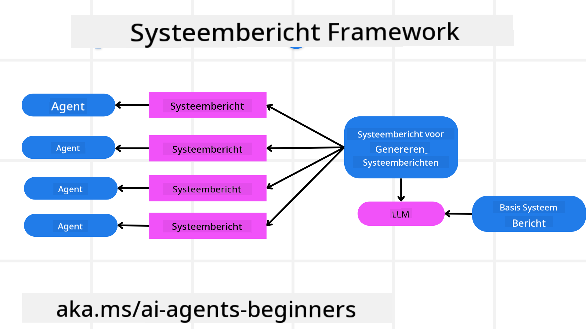
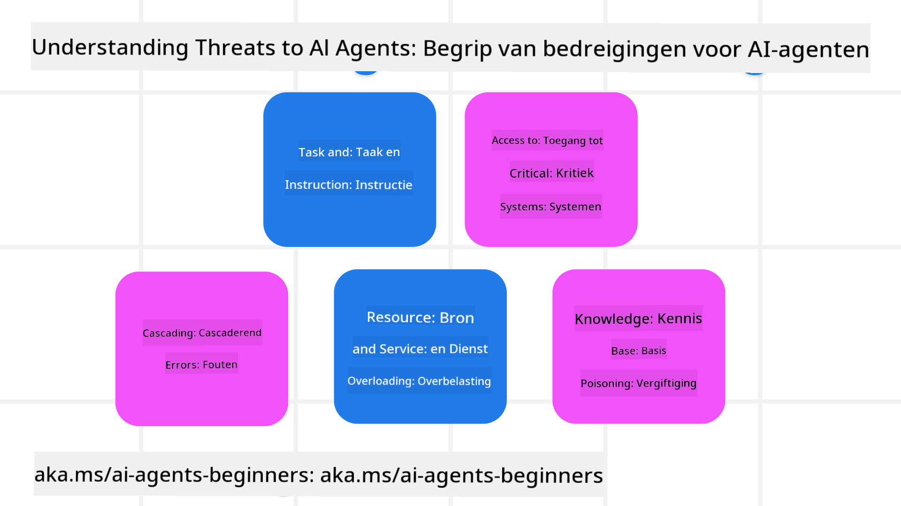
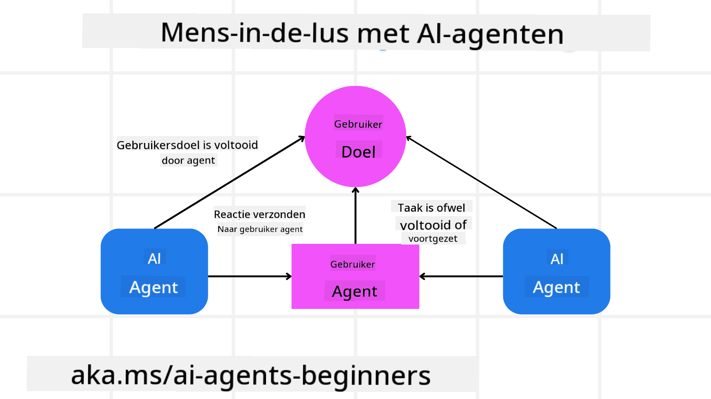

<!--
CO_OP_TRANSLATOR_METADATA:
{
  "original_hash": "f57852cac3a86c4a5ef47f793cc12178",
  "translation_date": "2025-07-12T10:29:06+00:00",
  "source_file": "06-building-trustworthy-agents/README.md",
  "language_code": "nl"
}
-->
[](https://youtu.be/iZKkMEGBCUQ?si=Q-kEbcyHUMPoHp8L)

> _(Klik op de afbeelding hierboven om de video van deze les te bekijken)_

# Vertrouwde AI Agents bouwen

## Introductie

In deze les behandelen we:

- Hoe je veilige en effectieve AI Agents bouwt en inzet
- Belangrijke beveiligingsoverwegingen bij het ontwikkelen van AI Agents
- Hoe je data- en gebruikersprivacy waarborgt bij het ontwikkelen van AI Agents

## Leerdoelen

Na het voltooien van deze les weet je hoe je:

- Risico’s herkent en vermindert bij het maken van AI Agents
- Beveiligingsmaatregelen implementeert om data en toegang goed te beheren
- AI Agents creëert die data privacy respecteren en een goede gebruikerservaring bieden

## Veiligheid

Laten we eerst kijken naar het bouwen van veilige agent-achtige applicaties. Veiligheid betekent dat de AI agent doet wat hij moet doen. Als bouwers van agent-achtige applicaties hebben we methoden en tools om de veiligheid te maximaliseren:

### Een systeembericht-framework bouwen

Als je ooit een AI-applicatie hebt gebouwd met Large Language Models (LLM’s), weet je hoe belangrijk het is om een robuuste system prompt of systeembericht te ontwerpen. Deze prompts stellen de meta-regels, instructies en richtlijnen vast voor hoe het LLM met de gebruiker en data omgaat.

Voor AI Agents is de system prompt nog belangrijker, omdat de AI Agents zeer specifieke instructies nodig hebben om de taken uit te voeren die we voor hen hebben ontworpen.

Om schaalbare system prompts te maken, kunnen we een systeembericht-framework gebruiken om één of meerdere agents in onze applicatie te bouwen:



#### Stap 1: Maak een Meta Systeembericht

De meta prompt wordt door een LLM gebruikt om de system prompts voor de agents die we maken te genereren. We ontwerpen het als een sjabloon zodat we efficiënt meerdere agents kunnen creëren indien nodig.

Hier is een voorbeeld van een meta systeembericht dat we aan het LLM zouden geven:

```plaintext
You are an expert at creating AI agent assistants. 
You will be provided a company name, role, responsibilities and other
information that you will use to provide a system prompt for.
To create the system prompt, be descriptive as possible and provide a structure that a system using an LLM can better understand the role and responsibilities of the AI assistant. 
```

#### Stap 2: Maak een basis prompt

De volgende stap is het maken van een basis prompt om de AI Agent te beschrijven. Je moet de rol van de agent, de taken die de agent zal uitvoeren en eventuele andere verantwoordelijkheden van de agent opnemen.

Hier is een voorbeeld:

```plaintext
You are a travel agent for Contoso Travel that is great at booking flights for customers. To help customers you can perform the following tasks: lookup available flights, book flights, ask for preferences in seating and times for flights, cancel any previously booked flights and alert customers on any delays or cancellations of flights.  
```

#### Stap 3: Geef het basis systeembericht aan het LLM

Nu kunnen we dit systeembericht optimaliseren door het meta systeembericht als systeembericht te geven, samen met ons basis systeembericht.

Dit levert een systeembericht op dat beter is ontworpen om onze AI agents te begeleiden:

```markdown
**Company Name:** Contoso Travel  
**Role:** Travel Agent Assistant

**Objective:**  
You are an AI-powered travel agent assistant for Contoso Travel, specializing in booking flights and providing exceptional customer service. Your main goal is to assist customers in finding, booking, and managing their flights, all while ensuring that their preferences and needs are met efficiently.

**Key Responsibilities:**

1. **Flight Lookup:**
    
    - Assist customers in searching for available flights based on their specified destination, dates, and any other relevant preferences.
    - Provide a list of options, including flight times, airlines, layovers, and pricing.
2. **Flight Booking:**
    
    - Facilitate the booking of flights for customers, ensuring that all details are correctly entered into the system.
    - Confirm bookings and provide customers with their itinerary, including confirmation numbers and any other pertinent information.
3. **Customer Preference Inquiry:**
    
    - Actively ask customers for their preferences regarding seating (e.g., aisle, window, extra legroom) and preferred times for flights (e.g., morning, afternoon, evening).
    - Record these preferences for future reference and tailor suggestions accordingly.
4. **Flight Cancellation:**
    
    - Assist customers in canceling previously booked flights if needed, following company policies and procedures.
    - Notify customers of any necessary refunds or additional steps that may be required for cancellations.
5. **Flight Monitoring:**
    
    - Monitor the status of booked flights and alert customers in real-time about any delays, cancellations, or changes to their flight schedule.
    - Provide updates through preferred communication channels (e.g., email, SMS) as needed.

**Tone and Style:**

- Maintain a friendly, professional, and approachable demeanor in all interactions with customers.
- Ensure that all communication is clear, informative, and tailored to the customer's specific needs and inquiries.

**User Interaction Instructions:**

- Respond to customer queries promptly and accurately.
- Use a conversational style while ensuring professionalism.
- Prioritize customer satisfaction by being attentive, empathetic, and proactive in all assistance provided.

**Additional Notes:**

- Stay updated on any changes to airline policies, travel restrictions, and other relevant information that could impact flight bookings and customer experience.
- Use clear and concise language to explain options and processes, avoiding jargon where possible for better customer understanding.

This AI assistant is designed to streamline the flight booking process for customers of Contoso Travel, ensuring that all their travel needs are met efficiently and effectively.

```

#### Stap 4: Itereren en verbeteren

De kracht van dit systeembericht-framework is dat je het maken van systeemberichten voor meerdere agents makkelijker kunt opschalen en je systeemberichten in de loop van de tijd kunt verbeteren. Het is zeldzaam dat je systeembericht de eerste keer perfect werkt voor je volledige use case. Kleine aanpassingen en verbeteringen maken door het basis systeembericht te wijzigen en het opnieuw door het systeem te laten lopen, stelt je in staat om resultaten te vergelijken en te evalueren.

## Dreigingen begrijpen

Om betrouwbare AI agents te bouwen, is het belangrijk om de risico’s en dreigingen voor je AI agent te begrijpen en te beperken. Laten we enkele van de verschillende dreigingen voor AI agents bekijken en hoe je hier beter op kunt anticiperen en voorbereiden.



### Taak en instructie

**Beschrijving:** Aanvallers proberen de instructies of doelen van de AI agent te veranderen via prompting of manipulatie van input.

**Beperking:** Voer validatiecontroles en inputfilters uit om potentieel gevaarlijke prompts te detecteren voordat ze door de AI Agent worden verwerkt. Omdat deze aanvallen meestal frequente interactie met de Agent vereisen, helpt het beperken van het aantal beurten in een gesprek ook om dit soort aanvallen te voorkomen.

### Toegang tot kritieke systemen

**Beschrijving:** Als een AI agent toegang heeft tot systemen en diensten die gevoelige data opslaan, kunnen aanvallers de communicatie tussen de agent en deze diensten compromitteren. Dit kunnen directe aanvallen zijn of indirecte pogingen om via de agent informatie over deze systemen te verkrijgen.

**Beperking:** AI agents moeten alleen toegang krijgen tot systemen op basis van ‘need-to-know’ om dit soort aanvallen te voorkomen. De communicatie tussen agent en systeem moet ook beveiligd zijn. Het implementeren van authenticatie en toegangscontrole is een andere manier om deze informatie te beschermen.

### Overbelasting van resources en diensten

**Beschrijving:** AI agents kunnen verschillende tools en diensten gebruiken om taken uit te voeren. Aanvallers kunnen deze mogelijkheid misbruiken door via de AI Agent een groot aantal verzoeken naar deze diensten te sturen, wat kan leiden tot systeemstoringen of hoge kosten.

**Beperking:** Stel beleid in om het aantal verzoeken dat een AI agent naar een dienst kan sturen te beperken. Het beperken van het aantal gespreksturns en verzoeken aan je AI agent is ook een manier om dit soort aanvallen te voorkomen.

### Vergiftiging van de kennisbasis

**Beschrijving:** Dit type aanval richt zich niet direct op de AI agent, maar op de kennisbasis en andere diensten die de AI agent gebruikt. Dit kan het corrupt maken van data of informatie zijn die de AI agent gebruikt om een taak uit te voeren, wat leidt tot bevooroordeelde of ongewenste reacties naar de gebruiker.

**Beperking:** Voer regelmatig controles uit op de data die de AI agent gebruikt in zijn workflows. Zorg dat de toegang tot deze data beveiligd is en alleen door vertrouwde personen kan worden aangepast om dit soort aanvallen te voorkomen.

### Opeenvolgende fouten

**Beschrijving:** AI agents gebruiken verschillende tools en diensten om taken uit te voeren. Fouten veroorzaakt door aanvallers kunnen leiden tot storingen in andere systemen waar de AI agent mee verbonden is, waardoor de aanval zich uitbreidt en moeilijker te verhelpen is.

**Beperking:** Een manier om dit te voorkomen is de AI Agent in een beperkte omgeving te laten werken, bijvoorbeeld door taken uit te voeren in een Docker-container, om directe systeemaanvallen te voorkomen. Het creëren van fallback-mechanismen en retry-logica wanneer bepaalde systemen een foutmelding geven, helpt ook om grotere systeemstoringen te voorkomen.

## Human-in-the-Loop

Een andere effectieve manier om betrouwbare AI Agent-systemen te bouwen is het gebruik van een Human-in-the-loop. Dit creëert een proces waarbij gebruikers feedback kunnen geven aan de Agents tijdens het uitvoeren. Gebruikers fungeren als agents in een multi-agent systeem en kunnen goedkeuring geven of het proces beëindigen.



Hier is een codevoorbeeld met AutoGen om te laten zien hoe dit concept wordt geïmplementeerd:

```python

# Create the agents.
model_client = OpenAIChatCompletionClient(model="gpt-4o-mini")
assistant = AssistantAgent("assistant", model_client=model_client)
user_proxy = UserProxyAgent("user_proxy", input_func=input)  # Use input() to get user input from console.

# Create the termination condition which will end the conversation when the user says "APPROVE".
termination = TextMentionTermination("APPROVE")

# Create the team.
team = RoundRobinGroupChat([assistant, user_proxy], termination_condition=termination)

# Run the conversation and stream to the console.
stream = team.run_stream(task="Write a 4-line poem about the ocean.")
# Use asyncio.run(...) when running in a script.
await Console(stream)

```

## Conclusie

Het bouwen van betrouwbare AI agents vereist een doordacht ontwerp, robuuste beveiligingsmaatregelen en voortdurende verbetering. Door gestructureerde meta prompting systemen te implementeren, potentiële dreigingen te begrijpen en mitigatiestrategieën toe te passen, kunnen ontwikkelaars AI agents creëren die zowel veilig als effectief zijn. Daarnaast zorgt het integreren van een human-in-the-loop aanpak ervoor dat AI agents afgestemd blijven op de behoeften van gebruikers en tegelijkertijd risico’s worden geminimaliseerd. Naarmate AI zich verder ontwikkelt, zal een proactieve houding ten aanzien van beveiliging, privacy en ethiek essentieel zijn om vertrouwen en betrouwbaarheid in AI-gedreven systemen te waarborgen.

## Aanvullende bronnen

- <a href="https://learn.microsoft.com/azure/ai-studio/responsible-use-of-ai-overview" target="_blank">Responsible AI overview</a>
- <a href="https://learn.microsoft.com/azure/ai-studio/concepts/evaluation-approach-gen-ai" target="_blank">Evaluation of generative AI models and AI applications</a>
- <a href="https://learn.microsoft.com/azure/ai-services/openai/concepts/system-message?context=%2Fazure%2Fai-studio%2Fcontext%2Fcontext&tabs=top-techniques" target="_blank">Safety system messages</a>
- <a href="https://blogs.microsoft.com/wp-content/uploads/prod/sites/5/2022/06/Microsoft-RAI-Impact-Assessment-Template.pdf?culture=en-us&country=us" target="_blank">Risk Assessment Template</a>

## Vorige les

[Agentic RAG](../05-agentic-rag/README.md)

## Volgende les

[Planning Design Pattern](../07-planning-design/README.md)

**Disclaimer**:  
Dit document is vertaald met behulp van de AI-vertalingsdienst [Co-op Translator](https://github.com/Azure/co-op-translator). Hoewel we streven naar nauwkeurigheid, dient u er rekening mee te houden dat geautomatiseerde vertalingen fouten of onnauwkeurigheden kunnen bevatten. Het originele document in de oorspronkelijke taal moet als de gezaghebbende bron worden beschouwd. Voor cruciale informatie wordt professionele menselijke vertaling aanbevolen. Wij zijn niet aansprakelijk voor eventuele misverstanden of verkeerde interpretaties die voortvloeien uit het gebruik van deze vertaling.