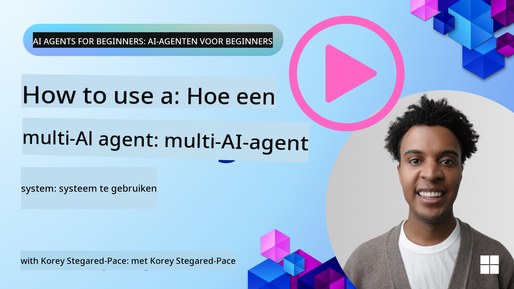
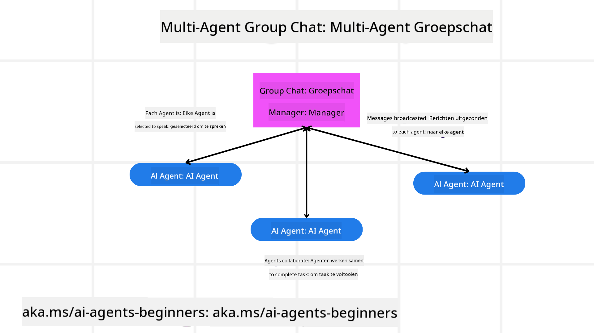
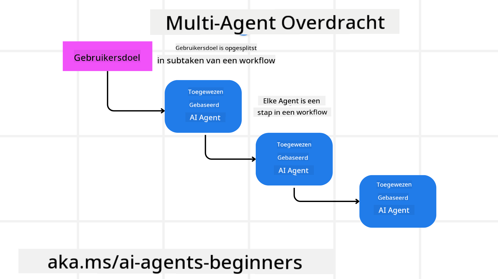
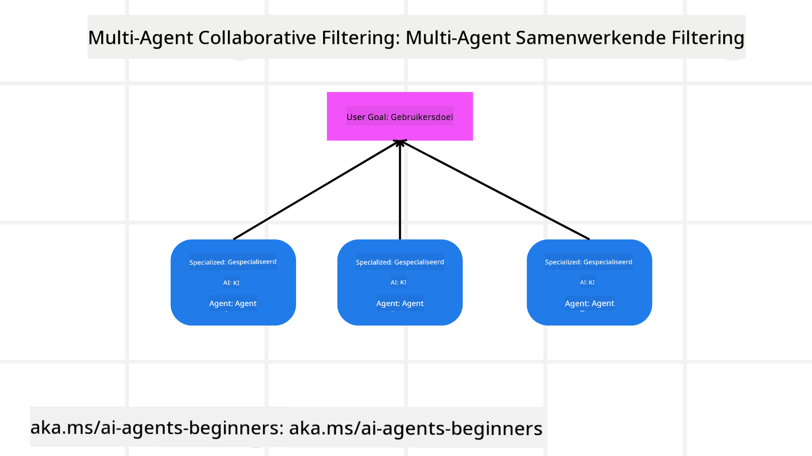

<!--
CO_OP_TRANSLATOR_METADATA:
{
  "original_hash": "c692a8975d7d5b99575a553de1c5e8a7",
  "translation_date": "2025-07-12T11:16:39+00:00",
  "source_file": "08-multi-agent/README.md",
  "language_code": "nl"
}
-->

> _(Klik op de afbeelding hierboven om de video van deze les te bekijken)_

# Multi-agent ontwerppatronen

Zodra je begint met een project waarbij meerdere agents betrokken zijn, moet je rekening houden met het multi-agent ontwerppatroon. Het is echter niet altijd meteen duidelijk wanneer je moet overstappen op meerdere agents en wat de voordelen daarvan zijn.

## Introductie

In deze les proberen we de volgende vragen te beantwoorden:

- In welke scenario’s zijn multi-agents toepasbaar?
- Wat zijn de voordelen van het gebruik van meerdere agents ten opzichte van één enkele agent die meerdere taken uitvoert?
- Wat zijn de bouwstenen voor het implementeren van het multi-agent ontwerppatroon?
- Hoe krijgen we inzicht in hoe de verschillende agents met elkaar samenwerken?

## Leerdoelen

Na deze les zou je in staat moeten zijn om:

- Scenario’s te herkennen waarin multi-agents toepasbaar zijn
- De voordelen van het gebruik van meerdere agents ten opzichte van één enkele agent te begrijpen
- De bouwstenen van het implementeren van het multi-agent ontwerppatroon te doorgronden

Wat is het grotere geheel?

*Multi-agents zijn een ontwerppatroon waarbij meerdere agents samenwerken om een gemeenschappelijk doel te bereiken*.

Dit patroon wordt veel gebruikt in diverse vakgebieden, zoals robotica, autonome systemen en gedistribueerde computing.

## Scenario’s waarin multi-agents toepasbaar zijn

In welke situaties is het zinvol om meerdere agents in te zetten? Het antwoord is dat er veel scenario’s zijn waarin het inzetten van meerdere agents voordelen biedt, vooral in de volgende gevallen:

- **Grote werklast**: Grote werklast kan worden opgesplitst in kleinere taken die aan verschillende agents worden toegewezen, waardoor parallelle verwerking en snellere afronding mogelijk zijn. Een voorbeeld hiervan is een grote data-verwerkingstaak.
- **Complexe taken**: Complexe taken kunnen, net als grote werklast, worden opgedeeld in kleinere subtaken die aan verschillende agents worden toegewezen, waarbij elke agent zich specialiseert in een specifiek onderdeel van de taak. Een goed voorbeeld hiervan is bij autonome voertuigen, waar verschillende agents verantwoordelijk zijn voor navigatie, obstakeldetectie en communicatie met andere voertuigen.
- **Diverse expertise**: Verschillende agents kunnen verschillende expertise hebben, waardoor ze verschillende aspecten van een taak effectiever kunnen afhandelen dan één enkele agent. Een goed voorbeeld hiervan is de gezondheidszorg, waar agents verantwoordelijk kunnen zijn voor diagnostiek, behandelplannen en patiëntmonitoring.

## Voordelen van het gebruik van meerdere agents ten opzichte van één enkele agent

Een systeem met één enkele agent kan goed werken voor eenvoudige taken, maar bij complexere taken biedt het gebruik van meerdere agents verschillende voordelen:

- **Specialisatie**: Elke agent kan gespecialiseerd zijn in een specifieke taak. Het ontbreken van specialisatie in één enkele agent betekent dat deze agent alles kan doen, maar mogelijk in de war raakt bij complexe taken. Zo kan het bijvoorbeeld een taak uitvoeren waarvoor het niet het meest geschikt is.
- **Schaalbaarheid**: Het is makkelijker om systemen op te schalen door meer agents toe te voegen dan door één enkele agent te overladen.
- **Fouttolerantie**: Als één agent faalt, kunnen andere agents blijven functioneren, wat de betrouwbaarheid van het systeem waarborgt.

Laten we een voorbeeld nemen: we boeken een reis voor een gebruiker. Een systeem met één enkele agent zou alle aspecten van het boekingsproces moeten afhandelen, van het zoeken naar vluchten tot het boeken van hotels en huurauto’s. Om dit met één agent te doen, moet deze agent over tools beschikken om al deze taken uit te voeren. Dit kan leiden tot een complex en monolithisch systeem dat moeilijk te onderhouden en op te schalen is. Een multi-agent systeem daarentegen kan verschillende agents hebben die gespecialiseerd zijn in het zoeken naar vluchten, het boeken van hotels en het regelen van huurauto’s. Dit maakt het systeem modulair, makkelijker te onderhouden en schaalbaar.

Vergelijk dit met een reisbureau dat wordt gerund als een familiebedrijf versus een reisbureau dat als franchise wordt gerund. Het familiebedrijf heeft één agent die alle aspecten van het boekingsproces afhandelt, terwijl de franchise verschillende agents heeft die elk een deel van het proces verzorgen.

## Bouwstenen voor het implementeren van het multi-agent ontwerppatroon

Voordat je het multi-agent ontwerppatroon kunt implementeren, moet je de bouwstenen begrijpen waaruit het patroon bestaat.

Laten we dit concreter maken door opnieuw te kijken naar het voorbeeld van het boeken van een reis voor een gebruiker. In dit geval omvatten de bouwstenen:

- **Agentcommunicatie**: Agents voor het zoeken naar vluchten, boeken van hotels en huurauto’s moeten met elkaar communiceren en informatie delen over de voorkeuren en beperkingen van de gebruiker. Je moet beslissen welke protocollen en methoden voor deze communicatie worden gebruikt. Concreet betekent dit dat de agent voor het zoeken naar vluchten moet communiceren met de agent voor het boeken van hotels om ervoor te zorgen dat het hotel wordt geboekt voor dezelfde data als de vlucht. Dit betekent dat de agents informatie over de reisdata van de gebruiker moeten delen, en dat je moet bepalen *welke agents informatie delen en hoe ze dat doen*.
- **Coördinatiemechanismen**: Agents moeten hun acties coördineren om te zorgen dat de voorkeuren en beperkingen van de gebruiker worden gerespecteerd. Een gebruikersvoorkeur kan zijn dat ze een hotel dicht bij het vliegveld willen, terwijl een beperking kan zijn dat huurauto’s alleen op het vliegveld beschikbaar zijn. Dit betekent dat de agent voor het boeken van hotels moet samenwerken met de agent voor het boeken van huurauto’s om te zorgen dat aan de voorkeuren en beperkingen wordt voldaan. Je moet dus bepalen *hoe de agents hun acties coördineren*.
- **Agentarchitectuur**: Agents moeten een interne structuur hebben om beslissingen te nemen en te leren van hun interacties met de gebruiker. Dit betekent dat de agent voor het zoeken naar vluchten een interne structuur moet hebben om te beslissen welke vluchten aan de gebruiker worden aanbevolen. Je moet bepalen *hoe de agents beslissingen nemen en leren van hun interacties met de gebruiker*. Een voorbeeld van hoe een agent leert en verbetert, is dat de agent voor het zoeken naar vluchten een machine learning-model kan gebruiken om vluchten aan te bevelen op basis van eerdere voorkeuren van de gebruiker.
- **Inzicht in multi-agent interacties**: Je moet inzicht hebben in hoe de verschillende agents met elkaar omgaan. Dit betekent dat je tools en technieken nodig hebt om de activiteiten en interacties van agents te volgen. Dit kan in de vorm van logging- en monitoringtools, visualisatietools en prestatiestatistieken.
- **Multi-agent patronen**: Er zijn verschillende patronen voor het implementeren van multi-agent systemen, zoals gecentraliseerde, gedecentraliseerde en hybride architecturen. Je moet het patroon kiezen dat het beste past bij jouw use case.
- **Mens in de lus**: In de meeste gevallen is er een mens in de lus en moet je de agents instrueren wanneer ze om menselijke tussenkomst moeten vragen. Dit kan bijvoorbeeld zijn wanneer een gebruiker vraagt om een specifiek hotel of vlucht die de agents niet hebben aanbevolen, of om bevestiging voordat een vlucht of hotel wordt geboekt.

## Inzicht in multi-agent interacties

Het is belangrijk dat je inzicht hebt in hoe de verschillende agents met elkaar samenwerken. Dit inzicht is essentieel voor het debuggen, optimaliseren en waarborgen van de effectiviteit van het systeem. Om dit te bereiken, heb je tools en technieken nodig om de activiteiten en interacties van agents te volgen. Dit kan in de vorm van logging- en monitoringtools, visualisatietools en prestatiestatistieken.

Bijvoorbeeld, in het geval van het boeken van een reis voor een gebruiker, zou je een dashboard kunnen hebben dat de status van elke agent toont, de voorkeuren en beperkingen van de gebruiker, en de interacties tussen agents. Dit dashboard kan de reisdata van de gebruiker tonen, de vluchten die door de vluchtagent worden aanbevolen, de hotels die door de hotelagent worden aanbevolen, en de huurauto’s die door de huurauto-agent worden aanbevolen. Dit geeft je een duidelijk beeld van hoe de agents met elkaar omgaan en of aan de voorkeuren en beperkingen van de gebruiker wordt voldaan.

Laten we elk van deze aspecten wat nader bekijken.

- **Logging- en monitoringtools**: Je wilt voor elke actie die een agent uitvoert een log bijhouden. Een logitem kan informatie bevatten over welke agent de actie heeft uitgevoerd, welke actie dat was, wanneer de actie is uitgevoerd en wat het resultaat was. Deze informatie kan worden gebruikt voor debuggen, optimaliseren en meer.
- **Visualisatietools**: Visualisatietools kunnen je helpen om de interacties tussen agents op een intuïtieve manier te zien. Bijvoorbeeld, je zou een grafiek kunnen hebben die de informatiestroom tussen agents toont. Dit kan helpen om knelpunten, inefficiënties en andere problemen in het systeem te identificeren.
- **Prestatiestatistieken**: Prestatiestatistieken kunnen je helpen om de effectiviteit van het multi-agent systeem te volgen. Bijvoorbeeld, je kunt de tijd bijhouden die nodig is om een taak te voltooien, het aantal voltooide taken per tijdseenheid, en de nauwkeurigheid van de aanbevelingen die door de agents worden gedaan. Deze informatie kan helpen om verbeterpunten te identificeren en het systeem te optimaliseren.

## Multi-agent patronen

Laten we enkele concrete patronen bekijken die we kunnen gebruiken om multi-agent apps te maken. Hier zijn een paar interessante patronen om te overwegen:

### Groepschat

Dit patroon is handig wanneer je een groepschat-applicatie wilt maken waarin meerdere agents met elkaar kunnen communiceren. Typische toepassingen van dit patroon zijn teamcollaboratie, klantenservice en sociale netwerken.

In dit patroon vertegenwoordigt elke agent een gebruiker in de groepschat, en worden berichten uitgewisseld tussen agents via een berichtprotocol. De agents kunnen berichten naar de groepschat sturen, berichten ontvangen van de groepschat en reageren op berichten van andere agents.

Dit patroon kan worden geïmplementeerd met een gecentraliseerde architectuur waarbij alle berichten via een centrale server lopen, of een gedecentraliseerde architectuur waarbij berichten direct worden uitgewisseld.

### Overdracht

Dit patroon is handig wanneer je een applicatie wilt maken waarin meerdere agents taken aan elkaar kunnen overdragen.

Typische toepassingen van dit patroon zijn klantenservice, taakbeheer en workflow-automatisering.

In dit patroon vertegenwoordigt elke agent een taak of een stap in een workflow, en kunnen agents taken aan andere agents overdragen op basis van vooraf gedefinieerde regels.

### Collaboratief filteren

Dit patroon is nuttig wanneer je een applicatie wilt maken waarin meerdere agents samenwerken om aanbevelingen te doen aan gebruikers.

Waarom je meerdere agents wilt laten samenwerken, is omdat elke agent verschillende expertise kan hebben en op verschillende manieren kan bijdragen aan het aanbevelingsproces.

Laten we een voorbeeld nemen waarbij een gebruiker een aanbeveling wil voor het beste aandeel om te kopen op de aandelenmarkt.

- **Industrie-expert**: Eén agent kan een expert zijn in een specifieke industrie.
- **Technische analyse**: Een andere agent kan expert zijn in technische analyse.
- **Fundamentele analyse**: En weer een andere agent kan expert zijn in fundamentele analyse. Door samen te werken kunnen deze agents een meer uitgebreide aanbeveling aan de gebruiker geven.

## Scenario: Terugbetalingsproces

Stel je een scenario voor waarin een klant een terugbetaling probeert te krijgen voor een product. Er kunnen behoorlijk wat agents betrokken zijn bij dit proces, maar laten we ze verdelen in agents die specifiek zijn voor dit proces en algemene agents die in andere processen kunnen worden gebruikt.

**Agents specifiek voor het terugbetalingsproces**:

De volgende agents kunnen betrokken zijn bij het terugbetalingsproces:

- **Klantagent**: Deze agent vertegenwoordigt de klant en is verantwoordelijk voor het starten van het terugbetalingsproces.
- **Verkoperagent**: Deze agent vertegenwoordigt de verkoper en is verantwoordelijk voor het verwerken van de terugbetaling.
- **Betaalagent**: Deze agent vertegenwoordigt het betaalproces en is verantwoordelijk voor het terugbetalen van de betaling aan de klant.
- **Oplossingsagent**: Deze agent vertegenwoordigt het oplossingsproces en is verantwoordelijk voor het oplossen van eventuele problemen die tijdens het terugbetalingsproces ontstaan.
- **Compliance-agent**: Deze agent vertegenwoordigt het compliance-proces en zorgt ervoor dat het terugbetalingsproces voldoet aan regelgeving en beleid.

**Algemene agents**:

Deze agents kunnen door andere delen van je bedrijf worden gebruikt.

- **Verzendagent**: Deze agent vertegenwoordigt het verzendproces en is verantwoordelijk voor het terugsturen van het product naar de verkoper. Deze agent kan zowel voor het terugbetalingsproces als voor algemene verzending van een product via een aankoop worden gebruikt.
- **Feedback-agent**: Deze agent vertegenwoordigt het feedbackproces en is verantwoordelijk voor het verzamelen van feedback van de klant. Feedback kan op elk moment worden gegeven, niet alleen tijdens het terugbetalingsproces.
- **Escalatie-agent**: Deze agent vertegenwoordigt het escalatieproces en is verantwoordelijk voor het doorverwijzen van problemen naar een hoger niveau van ondersteuning. Dit type agent kan in elk proces worden gebruikt waar escalatie nodig is.
- **Notificatie-agent**: Deze agent vertegenwoordigt het notificatieproces en is verantwoordelijk voor het versturen van meldingen naar de klant in verschillende fasen van het terugbetalingsproces.
- **Analytics-agent**: Deze agent vertegenwoordigt het analyseproces en is verantwoordelijk voor het analyseren van data gerelateerd aan het terugbetalingsproces.
- **Audit-agent**: Deze agent vertegenwoordigt het auditproces en is verantwoordelijk voor het controleren van het terugbetalingsproces om te zorgen dat het correct wordt uitgevoerd.
- **Rapportage-agent**: Deze agent vertegenwoordigt het rapportageproces en is verantwoordelijk voor het genereren van rapporten over het terugbetalingsproces.
- **Kennisagent**: Deze agent vertegenwoordigt het kennisproces en is verantwoordelijk voor het onderhouden van een kennisbank met informatie over het terugbetalingsproces. Deze agent kan kennis hebben over zowel terugbetalingen als andere delen van je bedrijf.
- **Beveiligingsagent**: Deze agent vertegenwoordigt het beveiligingsproces en is verantwoordelijk voor het waarborgen van de veiligheid van het terugbetalingsproces.
- **Kwaliteitsagent**: Deze agent vertegenwoordigt het kwaliteitsproces en is verantwoordelijk voor het waarborgen van de kwaliteit van het terugbetalingsproces.

Er zijn dus behoorlijk wat agents genoemd, zowel voor het specifieke terugbetalingsproces als voor de algemene agents die in andere delen van je bedrijf kunnen worden ingezet. Hopelijk geeft dit je een idee hoe je kunt bepalen welke agents je gebruikt in je multi-agent systeem.

## Opdracht
## Vorige les

[Planning Ontwerp](../07-planning-design/README.md)

## Volgende les

[Metacognitie in AI-agenten](../09-metacognition/README.md)

**Disclaimer**:  
Dit document is vertaald met behulp van de AI-vertalingsdienst [Co-op Translator](https://github.com/Azure/co-op-translator). Hoewel we streven naar nauwkeurigheid, dient u er rekening mee te houden dat geautomatiseerde vertalingen fouten of onnauwkeurigheden kunnen bevatten. Het originele document in de oorspronkelijke taal moet als de gezaghebbende bron worden beschouwd. Voor cruciale informatie wordt professionele menselijke vertaling aanbevolen. Wij zijn niet aansprakelijk voor eventuele misverstanden of verkeerde interpretaties die voortvloeien uit het gebruik van deze vertaling.