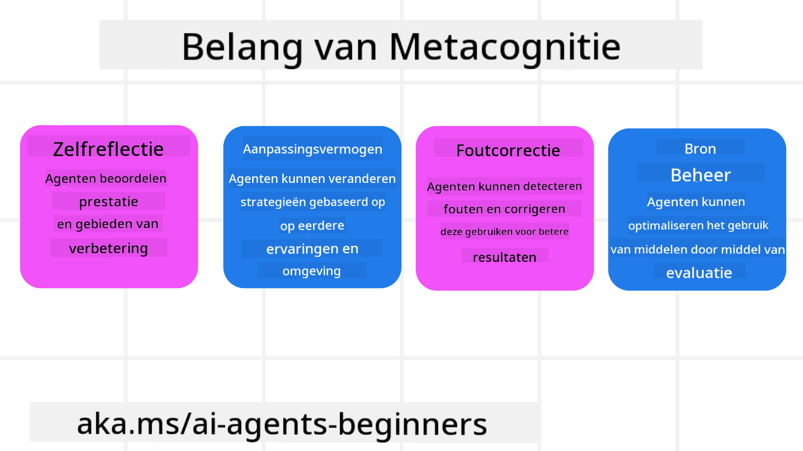
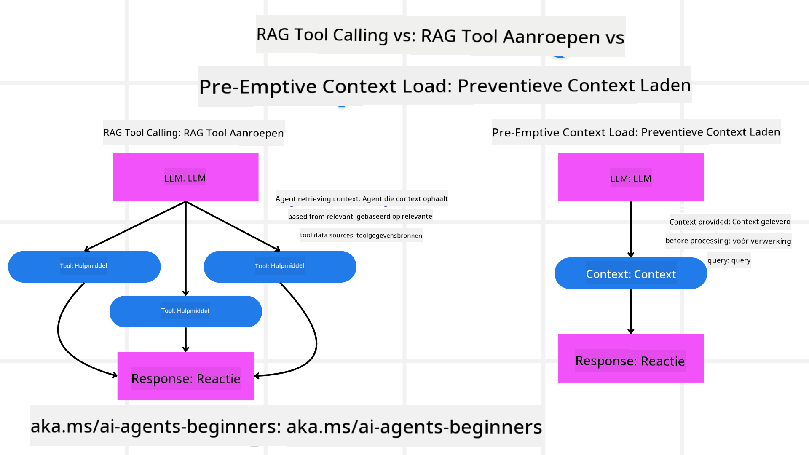

<!--
CO_OP_TRANSLATOR_METADATA:
{
  "original_hash": "5f0deef171fc3a68d5d3d770a8bfb03d",
  "translation_date": "2025-08-29T17:20:18+00:00",
  "source_file": "09-metacognition/README.md",
  "language_code": "nl"
}
-->
[](https://youtu.be/His9R6gw6Ec?si=3_RMb8VprNvdLRhX)

> _(Klik op de afbeelding hierboven om de video van deze les te bekijken)_
# Metacognitie in AI-agenten

## Introductie

Welkom bij de les over metacognitie in AI-agenten! Dit hoofdstuk is bedoeld voor beginners die nieuwsgierig zijn naar hoe AI-agenten kunnen nadenken over hun eigen denkprocessen. Aan het einde van deze les begrijp je de belangrijkste concepten en beschik je over praktische voorbeelden om metacognitie toe te passen in het ontwerp van AI-agenten.

## Leerdoelen

Na het voltooien van deze les kun je:

1. De implicaties van redeneerlussen in agentdefinities begrijpen.
2. Plannings- en evaluatietechnieken gebruiken om zelfcorrigerende agenten te ondersteunen.
3. Je eigen agenten maken die code kunnen manipuleren om taken uit te voeren.

## Introductie tot Metacognitie

Metacognitie verwijst naar de hogere-orde cognitieve processen die betrekking hebben op nadenken over je eigen denken. Voor AI-agenten betekent dit dat ze hun acties kunnen evalueren en aanpassen op basis van zelfbewustzijn en eerdere ervaringen. Metacognitie, of "nadenken over denken," is een belangrijk concept in de ontwikkeling van agentische AI-systemen. Het houdt in dat AI-systemen zich bewust zijn van hun eigen interne processen en in staat zijn hun gedrag te monitoren, reguleren en aanpassen. Net zoals wij dat doen wanneer we een situatie inschatten of een probleem analyseren. Dit zelfbewustzijn kan AI-systemen helpen betere beslissingen te nemen, fouten te identificeren en hun prestaties in de loop van de tijd te verbeteren – wat weer teruggrijpt op de Turing-test en de discussie over de vraag of AI de wereld zal overnemen.

In de context van agentische AI-systemen kan metacognitie helpen bij het aanpakken van verschillende uitdagingen, zoals:
- Transparantie: Zorgen dat AI-systemen hun redeneringen en beslissingen kunnen uitleggen.
- Redenering: Het verbeteren van het vermogen van AI-systemen om informatie te synthetiseren en weloverwogen beslissingen te nemen.
- Aanpassing: AI-systemen in staat stellen zich aan te passen aan nieuwe omgevingen en veranderende omstandigheden.
- Perceptie: Het verbeteren van de nauwkeurigheid van AI-systemen bij het herkennen en interpreteren van gegevens uit hun omgeving.

### Wat is Metacognitie?

Metacognitie, of "nadenken over denken," is een hogere-orde cognitief proces dat zelfbewustzijn en zelfregulatie van cognitieve processen omvat. In de wereld van AI stelt metacognitie agenten in staat hun strategieën en acties te evalueren en aan te passen, wat leidt tot verbeterde probleemoplossende en besluitvormingsvaardigheden. Door metacognitie te begrijpen, kun je AI-agenten ontwerpen die niet alleen intelligenter, maar ook aanpasbaarder en efficiënter zijn. Bij echte metacognitie zie je dat de AI expliciet redeneert over zijn eigen redenering.

Voorbeeld: “Ik gaf prioriteit aan goedkopere vluchten omdat... ik misschien directe vluchten over het hoofd zie, dus laat me dat opnieuw controleren.”
Bijhouden hoe of waarom een bepaalde route is gekozen.
- Opmerken dat er fouten zijn gemaakt omdat te veel werd vertrouwd op gebruikersvoorkeuren van de vorige keer, en daarom niet alleen de uiteindelijke aanbeveling aanpassen, maar ook de besluitvormingsstrategie.
- Patronen diagnosticeren zoals: “Telkens wanneer de gebruiker ‘te druk’ noemt, moet ik niet alleen bepaalde attracties verwijderen, maar ook erkennen dat mijn methode om ‘topattracties’ te kiezen gebrekkig is als ik altijd op populariteit rangschik.”

### Belang van Metacognitie in AI-agenten

Metacognitie speelt een cruciale rol in het ontwerp van AI-agenten om verschillende redenen:



- Zelfreflectie: Agenten kunnen hun eigen prestaties beoordelen en verbeterpunten identificeren.
- Aanpassingsvermogen: Agenten kunnen hun strategieën aanpassen op basis van eerdere ervaringen en veranderende omgevingen.
- Foutcorrectie: Agenten kunnen zelfstandig fouten detecteren en corrigeren, wat leidt tot nauwkeurigere resultaten.
- Middelenbeheer: Agenten kunnen het gebruik van middelen, zoals tijd en rekenkracht, optimaliseren door hun acties te plannen en te evalueren.

## Componenten van een AI-agent

Voordat we ingaan op metacognitieve processen, is het essentieel om de basiscomponenten van een AI-agent te begrijpen. Een AI-agent bestaat doorgaans uit:

- Persona: De persoonlijkheid en kenmerken van de agent, die bepalen hoe deze met gebruikers communiceert.
- Tools: De mogelijkheden en functies die de agent kan uitvoeren.
- Vaardigheden: De kennis en expertise die de agent bezit.

Deze componenten werken samen om een "expertise-eenheid" te creëren die specifieke taken kan uitvoeren.

**Voorbeeld**:
Denk aan een reisagent, een agentservice die niet alleen je vakantie plant, maar ook zijn aanpak aanpast op basis van realtime gegevens en eerdere klantreiservaringen.

### Voorbeeld: Metacognitie in een Reisagentservice

Stel je voor dat je een reisagentservice ontwerpt die wordt aangedreven door AI. Deze agent, "Reisagent," helpt gebruikers bij het plannen van hun vakanties. Om metacognitie te integreren, moet Reisagent zijn acties evalueren en aanpassen op basis van zelfbewustzijn en eerdere ervaringen. Hier is hoe metacognitie een rol kan spelen:

#### Huidige Taak

De huidige taak is om een gebruiker te helpen een reis naar Parijs te plannen.

#### Stappen om de Taak te Voltooien

1. **Gebruikersvoorkeuren Verzamelen**: Vraag de gebruiker naar hun reisdata, budget, interesses (bijv. musea, gastronomie, winkelen) en specifieke vereisten.
2. **Informatie Opzoeken**: Zoek naar vluchtopties, accommodaties, attracties en restaurants die aansluiten bij de voorkeuren van de gebruiker.
3. **Aanbevelingen Genereren**: Bied een gepersonaliseerd reisschema aan met vluchtgegevens, hotelreserveringen en voorgestelde activiteiten.
4. **Aanpassen op Basis van Feedback**: Vraag de gebruiker om feedback op de aanbevelingen en maak de nodige aanpassingen.

#### Benodigde Middelen

- Toegang tot databases voor vlucht- en hotelreserveringen.
- Informatie over Parijse attracties en restaurants.
- Gebruikersfeedbackgegevens van eerdere interacties.

#### Ervaring en Zelfreflectie

Reisagent gebruikt metacognitie om zijn prestaties te evalueren en te leren van eerdere ervaringen. Bijvoorbeeld:

1. **Analyseren van Gebruikersfeedback**: Reisagent beoordeelt gebruikersfeedback om te bepalen welke aanbevelingen goed werden ontvangen en welke niet. Het past zijn toekomstige suggesties hierop aan.
2. **Aanpassingsvermogen**: Als een gebruiker eerder heeft aangegeven niet van drukke plekken te houden, zal Reisagent in de toekomst vermijden om populaire toeristische plekken tijdens piekuren aan te bevelen.
3. **Foutcorrectie**: Als Reisagent in het verleden een fout heeft gemaakt, zoals het aanbevelen van een hotel dat volgeboekt was, leert het om beschikbaarheid grondiger te controleren voordat aanbevelingen worden gedaan.

#### Praktisch Ontwikkelaarsvoorbeeld

Hier is een vereenvoudigd voorbeeld van hoe de code van Reisagent eruit zou kunnen zien bij het integreren van metacognitie:

```python
class Travel_Agent:
    def __init__(self):
        self.user_preferences = {}
        self.experience_data = []

    def gather_preferences(self, preferences):
        self.user_preferences = preferences

    def retrieve_information(self):
        # Search for flights, hotels, and attractions based on preferences
        flights = search_flights(self.user_preferences)
        hotels = search_hotels(self.user_preferences)
        attractions = search_attractions(self.user_preferences)
        return flights, hotels, attractions

    def generate_recommendations(self):
        flights, hotels, attractions = self.retrieve_information()
        itinerary = create_itinerary(flights, hotels, attractions)
        return itinerary

    def adjust_based_on_feedback(self, feedback):
        self.experience_data.append(feedback)
        # Analyze feedback and adjust future recommendations
        self.user_preferences = adjust_preferences(self.user_preferences, feedback)

# Example usage
travel_agent = Travel_Agent()
preferences = {
    "destination": "Paris",
    "dates": "2025-04-01 to 2025-04-10",
    "budget": "moderate",
    "interests": ["museums", "cuisine"]
}
travel_agent.gather_preferences(preferences)
itinerary = travel_agent.generate_recommendations()
print("Suggested Itinerary:", itinerary)
feedback = {"liked": ["Louvre Museum"], "disliked": ["Eiffel Tower (too crowded)"]}
travel_agent.adjust_based_on_feedback(feedback)
```

#### Waarom Metacognitie Belangrijk Is

- **Zelfreflectie**: Agenten kunnen hun prestaties analyseren en verbeterpunten identificeren.
- **Aanpassingsvermogen**: Agenten kunnen strategieën aanpassen op basis van feedback en veranderende omstandigheden.
- **Foutcorrectie**: Agenten kunnen zelfstandig fouten detecteren en corrigeren.
- **Middelenbeheer**: Agenten kunnen het gebruik van middelen optimaliseren, zoals tijd en rekenkracht.

Door metacognitie te integreren, kan Reisagent meer gepersonaliseerde en nauwkeurige reisaanbevelingen bieden, wat de algehele gebruikerservaring verbetert.

---

## 2. Plannen in Agenten

Plannen is een cruciaal onderdeel van het gedrag van AI-agenten. Het omvat het uitstippelen van de stappen die nodig zijn om een doel te bereiken, rekening houdend met de huidige situatie, middelen en mogelijke obstakels.

### Elementen van Plannen

- **Huidige Taak**: Definieer de taak duidelijk.
- **Stappen om de Taak te Voltooien**: Splits de taak op in beheersbare stappen.
- **Benodigde Middelen**: Identificeer de benodigde middelen.
- **Ervaring**: Gebruik eerdere ervaringen om het plannen te informeren.

**Voorbeeld**:
Hier zijn de stappen die Reisagent moet nemen om een gebruiker effectief te helpen bij het plannen van hun reis:

### Stappen voor Reisagent

1. **Gebruikersvoorkeuren Verzamelen**
   - Vraag de gebruiker naar details over hun reisdata, budget, interesses en specifieke vereisten.
   - Voorbeelden: "Wanneer wil je reizen?" "Wat is je budget?" "Welke activiteiten vind je leuk tijdens een vakantie?"

2. **Informatie Opzoeken**
   - Zoek naar relevante reisopties op basis van gebruikersvoorkeuren.
   - **Vluchten**: Zoek naar beschikbare vluchten binnen het budget en de voorkeuren van de gebruiker.
   - **Accommodaties**: Vind hotels of huurwoningen die aansluiten bij de voorkeuren van de gebruiker qua locatie, prijs en voorzieningen.
   - **Attracties en Restaurants**: Identificeer populaire attracties, activiteiten en eetgelegenheden die aansluiten bij de interesses van de gebruiker.

3. **Aanbevelingen Genereren**
   - Stel de verzamelde informatie samen in een gepersonaliseerd reisschema.
   - Geef details zoals vluchtopties, hotelreserveringen en voorgestelde activiteiten, afgestemd op de voorkeuren van de gebruiker.

4. **Reisschema Presenteren aan de Gebruiker**
   - Deel het voorgestelde reisschema met de gebruiker ter beoordeling.
   - Voorbeeld: "Hier is een voorgesteld reisschema voor je reis naar Parijs. Het bevat vluchtgegevens, hotelboekingen en een lijst met aanbevolen activiteiten en restaurants. Laat me weten wat je ervan vindt!"

5. **Feedback Verzamelen**
   - Vraag de gebruiker om feedback op het voorgestelde reisschema.
   - Voorbeelden: "Vind je de vluchtopties goed?" "Is het hotel geschikt voor je behoeften?" "Zijn er activiteiten die je wilt toevoegen of verwijderen?"

6. **Aanpassen op Basis van Feedback**
   - Pas het reisschema aan op basis van de feedback van de gebruiker.
   - Breng de nodige wijzigingen aan in vlucht-, accommodatie- en activiteitsaanbevelingen om beter aan te sluiten bij de voorkeuren van de gebruiker.

7. **Definitieve Bevestiging**
   - Presenteer het bijgewerkte reisschema aan de gebruiker voor definitieve goedkeuring.
   - Voorbeeld: "Ik heb de aanpassingen gemaakt op basis van je feedback. Hier is het bijgewerkte reisschema. Ziet alles er goed uit?"

8. **Boeken en Reserveringen Bevestigen**
   - Zodra de gebruiker het reisschema goedkeurt, ga verder met het boeken van vluchten, accommodaties en eventuele vooraf geplande activiteiten.
   - Stuur bevestigingsdetails naar de gebruiker.

9. **Doorlopende Ondersteuning Bieden**
   - Blijf beschikbaar om de gebruiker te helpen met eventuele wijzigingen of aanvullende verzoeken vóór en tijdens hun reis.
   - Voorbeeld: "Als je tijdens je reis nog hulp nodig hebt, kun je altijd contact met me opnemen!"

### Voorbeeldinteractie

```python
class Travel_Agent:
    def __init__(self):
        self.user_preferences = {}
        self.experience_data = []

    def gather_preferences(self, preferences):
        self.user_preferences = preferences

    def retrieve_information(self):
        flights = search_flights(self.user_preferences)
        hotels = search_hotels(self.user_preferences)
        attractions = search_attractions(self.user_preferences)
        return flights, hotels, attractions

    def generate_recommendations(self):
        flights, hotels, attractions = self.retrieve_information()
        itinerary = create_itinerary(flights, hotels, attractions)
        return itinerary

    def adjust_based_on_feedback(self, feedback):
        self.experience_data.append(feedback)
        self.user_preferences = adjust_preferences(self.user_preferences, feedback)

# Example usage within a booing request
travel_agent = Travel_Agent()
preferences = {
    "destination": "Paris",
    "dates": "2025-04-01 to 2025-04-10",
    "budget": "moderate",
    "interests": ["museums", "cuisine"]
}
travel_agent.gather_preferences(preferences)
itinerary = travel_agent.generate_recommendations()
print("Suggested Itinerary:", itinerary)
feedback = {"liked": ["Louvre Museum"], "disliked": ["Eiffel Tower (too crowded)"]}
travel_agent.adjust_based_on_feedback(feedback)
```

## 3. Correctief RAG-systeem

Laten we eerst het verschil begrijpen tussen het RAG-tool en Pre-emptive Context Load.



### Retrieval-Augmented Generation (RAG)

RAG combineert een ophaalsysteem met een generatief model. Wanneer een vraag wordt gesteld, haalt het ophaalsysteem relevante documenten of gegevens op uit een externe bron, en deze opgehaalde informatie wordt gebruikt om de invoer van het generatieve model te verrijken. Dit helpt het model om nauwkeurigere en contextueel relevante antwoorden te genereren.

In een RAG-systeem haalt de agent relevante informatie op uit een kennisbank en gebruikt deze om passende antwoorden of acties te genereren.

### Correctieve RAG-aanpak

De Correctieve RAG-aanpak richt zich op het gebruik van RAG-technieken om fouten te corrigeren en de nauwkeurigheid van AI-agenten te verbeteren. Dit omvat:

1. **Prompttechniek**: Het gebruik van specifieke prompts om de agent te begeleiden bij het ophalen van relevante informatie.
2. **Tool**: Het implementeren van algoritmen en mechanismen waarmee de agent de relevantie van de opgehaalde informatie kan evalueren en nauwkeurige antwoorden kan genereren.
3. **Evaluatie**: Het continu beoordelen van de prestaties van de agent en het aanbrengen van aanpassingen om de nauwkeurigheid en efficiëntie te verbeteren.

#### Voorbeeld: Correctieve RAG in een Zoekagent

Denk aan een zoekagent die informatie van het web ophaalt om gebruikersvragen te beantwoorden. De Correctieve RAG-aanpak kan het volgende omvatten:

1. **Prompttechniek**: Zoekopdrachten formuleren op basis van de invoer van de gebruiker.
2. **Tool**: Het gebruik van natuurlijke taalverwerking en machine learning-algoritmen om zoekresultaten te rangschikken en te filteren.
3. **Evaluatie**: Het analyseren van gebruikersfeedback om onnauwkeurigheden in de opgehaalde informatie te identificeren en te corrigeren.

### Correctieve RAG in Reisagent

Correctieve RAG (Retrieval-Augmented Generation) verbetert het vermogen van een AI om informatie op te halen en te genereren, terwijl onnauwkeurigheden worden gecorrigeerd. Laten we zien hoe Reisagent de Correctieve RAG-aanpak kan gebruiken om nauwkeurigere en relevantere reisaanbevelingen te bieden.

Dit omvat:

- **Prompttechniek:** Het gebruik van specifieke prompts om de agent te begeleiden bij het ophalen van relevante informatie.
- **Tool:** Het implementeren van algoritmen en mechanismen waarmee de agent de relevantie van de opgehaalde informatie kan evalueren en nauwkeurige antwoorden kan genereren.
- **Evaluatie:** Het continu beoordelen van de prestaties van de agent en het aanbrengen van aanpassingen om de nauwkeurigheid en efficiëntie te verbeteren.

#### Stappen voor het Implementeren van Correctieve RAG in Reisagent

1. **Initiële Gebruikersinteractie**
   - Reisagent verzamelt initiële voorkeuren van de gebruiker, zoals bestemming, reisdata, budget en interesses.
   - Voorbeeld:

     ```python
     preferences = {
         "destination": "Paris",
         "dates": "2025-04-01 to 2025-04-10",
         "budget": "moderate",
         "interests": ["museums", "cuisine"]
     }
     ```

2. **Informatie Ophalen**
   - Reisagent haalt informatie op over vluchten, accommodaties, attracties en restaurants op basis van gebruikersvoorkeuren.
   - Voorbeeld:

     ```python
     flights = search_flights(preferences)
     hotels = search_hotels(preferences)
     attractions = search_attractions(preferences)
     ```

3. **Genereren van Initiële Aanbevelingen**
   - Reisagent gebruikt de opgehaalde informatie om een gepersonaliseerd reisschema te genereren.
   - Voorbeeld:

     ```python
     itinerary = create_itinerary(flights, hotels, attractions)
     print("Suggested Itinerary:", itinerary)
     ```

4. **Gebruikersfeedback Verzamelen**
   - Reisagent vraagt de gebruiker om feedback op de initiële aanbevelingen.
   - Voorbeeld:

     ```python
     feedback = {
         "liked": ["Louvre Museum"],
         "disliked": ["Eiffel Tower (too crowded)"]
     }
     ```

5. **Correctieve RAG-proces**
   - **Prompttechniek**: Reisagent formuleert nieuwe zoekopdrachten op basis van gebruikersfeedback.
     - Voorbeeld:

       ```python
       if "disliked" in feedback:
           preferences["avoid"] = feedback["disliked"]
       ```

   - **Tool**: Reisagent gebruikt algoritmen om nieuwe zoekresultaten te rangschikken en te filteren, met nadruk op relevantie op basis van gebruikersfeedback.
     - Voorbeeld:

       ```python
       new_attractions = search_attractions(preferences)
       new_itinerary = create_itinerary(flights, hotels, new_attractions)
       print("Updated Itinerary:", new_itinerary)
       ```

   - **Evaluatie**: Reisagent beoordeelt continu de relevantie en nauwkeurigheid van zijn aanbevelingen door gebruikersfeedback te analyseren en de nodige aanpassingen te maken.
     - Voorbeeld:

       ```python
       def adjust_preferences(preferences, feedback):
           if "liked" in feedback:
               preferences["favorites"] = feedback["liked"]
           if "disliked" in feedback:
               preferences["avoid"] = feedback["disliked"]
           return preferences

       preferences = adjust_preferences(preferences, feedback)
       ```

#### Praktisch Voorbeeld

Hier is een vereenvoudigd Python-codevoorbeeld waarin de Correctieve RAG-aanpak in Reisagent wordt geïntegreerd:
```python
class Travel_Agent:
    def __init__(self):
        self.user_preferences = {}
        self.experience_data = []

    def gather_preferences(self, preferences):
        self.user_preferences = preferences

    def retrieve_information(self):
        flights = search_flights(self.user_preferences)
        hotels = search_hotels(self.user_preferences)
        attractions = search_attractions(self.user_preferences)
        return flights, hotels, attractions

    def generate_recommendations(self):
        flights, hotels, attractions = self.retrieve_information()
        itinerary = create_itinerary(flights, hotels, attractions)
        return itinerary

    def adjust_based_on_feedback(self, feedback):
        self.experience_data.append(feedback)
        self.user_preferences = adjust_preferences(self.user_preferences, feedback)
        new_itinerary = self.generate_recommendations()
        return new_itinerary

# Example usage
travel_agent = Travel_Agent()
preferences = {
    "destination": "Paris",
    "dates": "2025-04-01 to 2025-04-10",
    "budget": "moderate",
    "interests": ["museums", "cuisine"]
}
travel_agent.gather_preferences(preferences)
itinerary = travel_agent.generate_recommendations()
print("Suggested Itinerary:", itinerary)
feedback = {"liked": ["Louvre Museum"], "disliked": ["Eiffel Tower (too crowded)"]}
new_itinerary = travel_agent.adjust_based_on_feedback(feedback)
print("Updated Itinerary:", new_itinerary)
```

### Proactief Laden van Context

Proactief laden van context houdt in dat relevante context of achtergrondinformatie vooraf in het model wordt geladen voordat een vraag wordt verwerkt. Dit betekent dat het model vanaf het begin toegang heeft tot deze informatie, wat kan helpen om beter geïnformeerde antwoorden te genereren zonder tijdens het proces extra gegevens op te halen.

Hier is een vereenvoudigd voorbeeld van hoe proactief laden van context eruit kan zien voor een reisagententoepassing in Python:

```python
class TravelAgent:
    def __init__(self):
        # Pre-load popular destinations and their information
        self.context = {
            "Paris": {"country": "France", "currency": "Euro", "language": "French", "attractions": ["Eiffel Tower", "Louvre Museum"]},
            "Tokyo": {"country": "Japan", "currency": "Yen", "language": "Japanese", "attractions": ["Tokyo Tower", "Shibuya Crossing"]},
            "New York": {"country": "USA", "currency": "Dollar", "language": "English", "attractions": ["Statue of Liberty", "Times Square"]},
            "Sydney": {"country": "Australia", "currency": "Dollar", "language": "English", "attractions": ["Sydney Opera House", "Bondi Beach"]}
        }

    def get_destination_info(self, destination):
        # Fetch destination information from pre-loaded context
        info = self.context.get(destination)
        if info:
            return f"{destination}:\nCountry: {info['country']}\nCurrency: {info['currency']}\nLanguage: {info['language']}\nAttractions: {', '.join(info['attractions'])}"
        else:
            return f"Sorry, we don't have information on {destination}."

# Example usage
travel_agent = TravelAgent()
print(travel_agent.get_destination_info("Paris"))
print(travel_agent.get_destination_info("Tokyo"))
```

#### Uitleg

1. **Initialisatie (`__init__` methode)**: De `TravelAgent`-klasse laadt vooraf een woordenboek met informatie over populaire bestemmingen zoals Parijs, Tokio, New York en Sydney. Dit woordenboek bevat details zoals het land, de valuta, de taal en belangrijke bezienswaardigheden voor elke bestemming.

2. **Informatie ophalen (`get_destination_info` methode)**: Wanneer een gebruiker informatie opvraagt over een specifieke bestemming, haalt de `get_destination_info`-methode de relevante informatie op uit het vooraf geladen contextwoordenboek.

Door de context vooraf te laden, kan de reisagententoepassing snel reageren op gebruikersvragen zonder deze informatie in realtime van een externe bron te hoeven ophalen. Dit maakt de toepassing efficiënter en responsiever.

### Een Plan Opstarten met een Doel Voordat je Itereert

Een plan opstarten met een doel houdt in dat je begint met een duidelijk gedefinieerd doel of gewenste uitkomst. Door dit doel vooraf te definiëren, kan het model dit gebruiken als leidraad tijdens het iteratieve proces. Dit helpt ervoor te zorgen dat elke iteratie dichter bij het gewenste resultaat komt, waardoor het proces efficiënter en gerichter wordt.

Hier is een voorbeeld van hoe je een reisplan kunt opstarten met een doel voordat je iteraties uitvoert voor een reisagent in Python:

### Scenario

Een reisagent wil een op maat gemaakte vakantie plannen voor een klant. Het doel is om een reisroute te creëren die de tevredenheid van de klant maximaliseert op basis van hun voorkeuren en budget.

### Stappen

1. Definieer de voorkeuren en het budget van de klant.  
2. Start een initieel plan op basis van deze voorkeuren.  
3. Itereer om het plan te verfijnen en te optimaliseren voor de tevredenheid van de klant.  

#### Python Code

```python
class TravelAgent:
    def __init__(self, destinations):
        self.destinations = destinations

    def bootstrap_plan(self, preferences, budget):
        plan = []
        total_cost = 0

        for destination in self.destinations:
            if total_cost + destination['cost'] <= budget and self.match_preferences(destination, preferences):
                plan.append(destination)
                total_cost += destination['cost']

        return plan

    def match_preferences(self, destination, preferences):
        for key, value in preferences.items():
            if destination.get(key) != value:
                return False
        return True

    def iterate_plan(self, plan, preferences, budget):
        for i in range(len(plan)):
            for destination in self.destinations:
                if destination not in plan and self.match_preferences(destination, preferences) and self.calculate_cost(plan, destination) <= budget:
                    plan[i] = destination
                    break
        return plan

    def calculate_cost(self, plan, new_destination):
        return sum(destination['cost'] for destination in plan) + new_destination['cost']

# Example usage
destinations = [
    {"name": "Paris", "cost": 1000, "activity": "sightseeing"},
    {"name": "Tokyo", "cost": 1200, "activity": "shopping"},
    {"name": "New York", "cost": 900, "activity": "sightseeing"},
    {"name": "Sydney", "cost": 1100, "activity": "beach"},
]

preferences = {"activity": "sightseeing"}
budget = 2000

travel_agent = TravelAgent(destinations)
initial_plan = travel_agent.bootstrap_plan(preferences, budget)
print("Initial Plan:", initial_plan)

refined_plan = travel_agent.iterate_plan(initial_plan, preferences, budget)
print("Refined Plan:", refined_plan)
```

#### Uitleg van de Code

1. **Initialisatie (`__init__` methode)**: De `TravelAgent`-klasse wordt geïnitialiseerd met een lijst van potentiële bestemmingen, elk met attributen zoals naam, kosten en type activiteit.

2. **Plan Opstarten (`bootstrap_plan` methode)**: Deze methode maakt een initieel reisplan op basis van de voorkeuren en het budget van de klant. Het doorloopt de lijst van bestemmingen en voegt ze toe aan het plan als ze overeenkomen met de voorkeuren van de klant en binnen het budget passen.

3. **Voorkeuren Matchen (`match_preferences` methode)**: Deze methode controleert of een bestemming overeenkomt met de voorkeuren van de klant.

4. **Itereren van het Plan (`iterate_plan` methode)**: Deze methode verfijnt het initiële plan door te proberen elke bestemming in het plan te vervangen door een betere match, rekening houdend met de voorkeuren en budgetbeperkingen van de klant.

5. **Kosten Berekenen (`calculate_cost` methode)**: Deze methode berekent de totale kosten van het huidige plan, inclusief een mogelijke nieuwe bestemming.

#### Voorbeeldgebruik

- **Initieel Plan**: De reisagent maakt een initieel plan op basis van de voorkeuren van de klant voor bezienswaardigheden en een budget van $2000.  
- **Verfijnd Plan**: De reisagent iterereert het plan en optimaliseert het voor de voorkeuren en het budget van de klant.  

Door het plan op te starten met een duidelijk doel (bijvoorbeeld het maximaliseren van klanttevredenheid) en iteratief te verfijnen, kan de reisagent een op maat gemaakte en geoptimaliseerde reisroute voor de klant creëren. Deze aanpak zorgt ervoor dat het reisplan vanaf het begin aansluit bij de voorkeuren en het budget van de klant en verbetert met elke iteratie.

### Gebruikmaken van LLM voor Herordenen en Scoren

Grote Taalmodellen (LLMs) kunnen worden gebruikt voor herordenen en scoren door de relevantie en kwaliteit van opgehaalde documenten of gegenereerde antwoorden te evalueren. Zo werkt het:

**Ophalen:** De eerste stap haalt een set kandidaat-documenten of antwoorden op basis van de vraag.  

**Herordenen:** Het LLM evalueert deze kandidaten en herordent ze op basis van hun relevantie en kwaliteit. Deze stap zorgt ervoor dat de meest relevante en kwalitatieve informatie als eerste wordt gepresenteerd.  

**Scoren:** Het LLM kent scores toe aan elke kandidaat, die hun relevantie en kwaliteit weerspiegelen. Dit helpt bij het selecteren van het beste antwoord of document voor de gebruiker.  

Door LLMs te gebruiken voor herordenen en scoren, kan het systeem nauwkeurigere en contextueel relevante informatie bieden, wat de algehele gebruikerservaring verbetert.

Hier is een voorbeeld van hoe een reisagent een Groot Taalmodel (LLM) kan gebruiken voor het herordenen en scoren van reisbestemmingen op basis van gebruikersvoorkeuren in Python:

#### Scenario - Reizen op Basis van Voorkeuren

Een reisagent wil de beste reisbestemmingen aanbevelen aan een klant op basis van hun voorkeuren. Het LLM helpt bij het herordenen en scoren van de bestemmingen om ervoor te zorgen dat de meest relevante opties worden gepresenteerd.

#### Stappen:

1. Verzamel de voorkeuren van de gebruiker.  
2. Haal een lijst van potentiële reisbestemmingen op.  
3. Gebruik het LLM om de bestemmingen te herordenen en te scoren op basis van gebruikersvoorkeuren.  

Hier is hoe je het vorige voorbeeld kunt aanpassen om Azure OpenAI Services te gebruiken:

#### Vereisten

1. Je hebt een Azure-abonnement nodig.  
2. Maak een Azure OpenAI-resource aan en verkrijg je API-sleutel.  

#### Voorbeeld Python Code

```python
import requests
import json

class TravelAgent:
    def __init__(self, destinations):
        self.destinations = destinations

    def get_recommendations(self, preferences, api_key, endpoint):
        # Generate a prompt for the Azure OpenAI
        prompt = self.generate_prompt(preferences)
        
        # Define headers and payload for the request
        headers = {
            'Content-Type': 'application/json',
            'Authorization': f'Bearer {api_key}'
        }
        payload = {
            "prompt": prompt,
            "max_tokens": 150,
            "temperature": 0.7
        }
        
        # Call the Azure OpenAI API to get the re-ranked and scored destinations
        response = requests.post(endpoint, headers=headers, json=payload)
        response_data = response.json()
        
        # Extract and return the recommendations
        recommendations = response_data['choices'][0]['text'].strip().split('\n')
        return recommendations

    def generate_prompt(self, preferences):
        prompt = "Here are the travel destinations ranked and scored based on the following user preferences:\n"
        for key, value in preferences.items():
            prompt += f"{key}: {value}\n"
        prompt += "\nDestinations:\n"
        for destination in self.destinations:
            prompt += f"- {destination['name']}: {destination['description']}\n"
        return prompt

# Example usage
destinations = [
    {"name": "Paris", "description": "City of lights, known for its art, fashion, and culture."},
    {"name": "Tokyo", "description": "Vibrant city, famous for its modernity and traditional temples."},
    {"name": "New York", "description": "The city that never sleeps, with iconic landmarks and diverse culture."},
    {"name": "Sydney", "description": "Beautiful harbour city, known for its opera house and stunning beaches."},
]

preferences = {"activity": "sightseeing", "culture": "diverse"}
api_key = 'your_azure_openai_api_key'
endpoint = 'https://your-endpoint.com/openai/deployments/your-deployment-name/completions?api-version=2022-12-01'

travel_agent = TravelAgent(destinations)
recommendations = travel_agent.get_recommendations(preferences, api_key, endpoint)
print("Recommended Destinations:")
for rec in recommendations:
    print(rec)
```

#### Uitleg van de Code - Voorkeurenboekingssysteem

1. **Initialisatie**: De `TravelAgent`-klasse wordt geïnitialiseerd met een lijst van potentiële reisbestemmingen, elk met attributen zoals naam en beschrijving.  

2. **Aanbevelingen Ophalen (`get_recommendations` methode)**: Deze methode genereert een prompt voor de Azure OpenAI-service op basis van de voorkeuren van de gebruiker en maakt een HTTP POST-verzoek naar de Azure OpenAI API om herordende en gescoorde bestemmingen te verkrijgen.  

3. **Prompt Genereren (`generate_prompt` methode)**: Deze methode stelt een prompt samen voor Azure OpenAI, inclusief de voorkeuren van de gebruiker en de lijst van bestemmingen. De prompt begeleidt het model om de bestemmingen te herordenen en te scoren op basis van de opgegeven voorkeuren.  

4. **API-aanroep**: De `requests`-bibliotheek wordt gebruikt om een HTTP POST-verzoek te doen naar het Azure OpenAI API-eindpunt. Het antwoord bevat de herordende en gescoorde bestemmingen.  

5. **Voorbeeldgebruik**: De reisagent verzamelt gebruikersvoorkeuren (bijvoorbeeld interesse in bezienswaardigheden en diverse culturen) en gebruikt de Azure OpenAI-service om herordende en gescoorde aanbevelingen voor reisbestemmingen te verkrijgen.  

Zorg ervoor dat je `your_azure_openai_api_key` vervangt door je daadwerkelijke Azure OpenAI API-sleutel en `https://your-endpoint.com/...` door de daadwerkelijke eindpunt-URL van je Azure OpenAI-implementatie.  

Door het LLM te gebruiken voor herordenen en scoren, kan de reisagent meer gepersonaliseerde en relevante reisaanbevelingen bieden aan klanten, wat hun algehele ervaring verbetert.  

### RAG: Prompttechniek versus Tool

Retrieval-Augmented Generation (RAG) kan zowel een prompttechniek als een tool zijn bij de ontwikkeling van AI-agenten. Het begrijpen van het onderscheid tussen de twee kan je helpen RAG effectiever in je projecten te gebruiken.

#### RAG als Prompttechniek

**Wat is het?**

- Als prompttechniek houdt RAG in dat je specifieke vragen of prompts formuleert om relevante informatie op te halen uit een grote corpus of database. Deze informatie wordt vervolgens gebruikt om antwoorden of acties te genereren.  

**Hoe werkt het:**

1. **Formuleer Prompts**: Maak goed gestructureerde prompts of vragen op basis van de taak of de invoer van de gebruiker.  
2. **Informatie Ophalen**: Gebruik de prompts om relevante gegevens te zoeken in een bestaande kennisbank of dataset.  
3. **Antwoord Genereren**: Combineer de opgehaalde informatie met generatieve AI-modellen om een uitgebreid en samenhangend antwoord te produceren.  

**Voorbeeld in Reisagent**:

- Gebruikersinvoer: "Ik wil musea in Parijs bezoeken."  
- Prompt: "Vind de beste musea in Parijs."  
- Opgehaalde Informatie: Details over het Louvre, Musée d'Orsay, enz.  
- Gegeneerd Antwoord: "Hier zijn enkele topmusea in Parijs: Louvre, Musée d'Orsay en Centre Pompidou."  

#### RAG als Tool

**Wat is het?**

- Als tool is RAG een geïntegreerd systeem dat het ophalen en genereren automatiseert, waardoor het voor ontwikkelaars eenvoudiger wordt om complexe AI-functionaliteiten te implementeren zonder handmatig prompts te maken voor elke vraag.  

**Hoe werkt het:**

1. **Integratie**: Integreer RAG binnen de architectuur van de AI-agent, zodat deze automatisch de ophaal- en genereertaken afhandelt.  
2. **Automatisering**: De tool beheert het hele proces, van het ontvangen van gebruikersinvoer tot het genereren van het uiteindelijke antwoord, zonder expliciete prompts voor elke stap.  
3. **Efficiëntie**: Verbetert de prestaties van de agent door het ophalen en genereren te stroomlijnen, waardoor snellere en nauwkeurigere antwoorden mogelijk zijn.  

**Voorbeeld in Reisagent**:

- Gebruikersinvoer: "Ik wil musea in Parijs bezoeken."  
- RAG Tool: Haalt automatisch informatie over musea op en genereert een antwoord.  
- Gegeneerd Antwoord: "Hier zijn enkele topmusea in Parijs: Louvre, Musée d'Orsay en Centre Pompidou."  

### Vergelijking

| Aspect                 | Prompttechniek                                            | Tool                                                  |
|------------------------|----------------------------------------------------------|-------------------------------------------------------|
| **Handmatig vs Automatisch** | Handmatige formulering van prompts voor elke vraag.   | Geautomatiseerd proces voor ophalen en genereren.     |
| **Controle**            | Biedt meer controle over het ophaalproces.               | Stroomlijnt en automatiseert ophalen en genereren.    |
| **Flexibiliteit**        | Maakt aangepaste prompts mogelijk op basis van specifieke behoeften. | Efficiënter voor grootschalige implementaties.        |
| **Complexiteit**         | Vereist het maken en aanpassen van prompts.              | Eenvoudiger te integreren in de architectuur van een AI-agent.   |

### Praktische Voorbeelden

**Voorbeeld Prompttechniek:**

```python
def search_museums_in_paris():
    prompt = "Find top museums in Paris"
    search_results = search_web(prompt)
    return search_results

museums = search_museums_in_paris()
print("Top Museums in Paris:", museums)
```

**Voorbeeld Tool:**

```python
class Travel_Agent:
    def __init__(self):
        self.rag_tool = RAGTool()

    def get_museums_in_paris(self):
        user_input = "I want to visit museums in Paris."
        response = self.rag_tool.retrieve_and_generate(user_input)
        return response

travel_agent = Travel_Agent()
museums = travel_agent.get_museums_in_paris()
print("Top Museums in Paris:", museums)
```

### Relevantie Evalueren

Het evalueren van relevantie is een cruciaal aspect van de prestaties van AI-agenten. Het zorgt ervoor dat de informatie die door de agent wordt opgehaald en gegenereerd, geschikt, accuraat en nuttig is voor de gebruiker. Laten we verkennen hoe je relevantie kunt evalueren in AI-agenten, inclusief praktische voorbeelden en technieken.

#### Belangrijke Concepten bij het Evalueren van Relevantie

1. **Contextbewustzijn**:
   - De agent moet de context van de gebruikersvraag begrijpen om relevante informatie op te halen en te genereren.  
   - Voorbeeld: Als een gebruiker vraagt naar "beste restaurants in Parijs," moet de agent rekening houden met de voorkeuren van de gebruiker, zoals type keuken en budget.  

2. **Nauwkeurigheid**:
   - De informatie die door de agent wordt verstrekt, moet feitelijk correct en actueel zijn.  
   - Voorbeeld: Aanbevelen van restaurants die momenteel open zijn en goede recensies hebben, in plaats van verouderde of gesloten opties.  

3. **Gebruikersintentie**:
   - De agent moet de intentie van de gebruiker achter de vraag afleiden om de meest relevante informatie te bieden.  
   - Voorbeeld: Als een gebruiker vraagt naar "budgetvriendelijke hotels," moet de agent betaalbare opties prioriteren.  

4. **Feedbackloop**:
   - Het continu verzamelen en analyseren van gebruikersfeedback helpt de agent om het proces van relevantie-evaluatie te verfijnen.  
   - Voorbeeld: Gebruikersbeoordelingen en feedback op eerdere aanbevelingen integreren om toekomstige antwoorden te verbeteren.  

#### Praktische Technieken voor het Evalueren van Relevantie

1. **Relevantie Scoren**:
   - Ken een relevantiescore toe aan elk opgehaald item op basis van hoe goed het overeenkomt met de vraag en voorkeuren van de gebruiker.  
   - Voorbeeld:

     ```python
     def relevance_score(item, query):
         score = 0
         if item['category'] in query['interests']:
             score += 1
         if item['price'] <= query['budget']:
             score += 1
         if item['location'] == query['destination']:
             score += 1
         return score
     ```

2. **Filteren en Rangschikken**:
   - Filter irrelevante items eruit en rangschik de resterende items op basis van hun relevantiescores.  
   - Voorbeeld:

     ```python
     def filter_and_rank(items, query):
         ranked_items = sorted(items, key=lambda item: relevance_score(item, query), reverse=True)
         return ranked_items[:10]  # Return top 10 relevant items
     ```

3. **Natuurlijke Taalverwerking (NLP)**:
   - Gebruik NLP-technieken om de gebruikersvraag te begrijpen en relevante informatie op te halen.  
   - Voorbeeld:

     ```python
     def process_query(query):
         # Use NLP to extract key information from the user's query
         processed_query = nlp(query)
         return processed_query
     ```

4. **Gebruikersfeedback Integreren**:
   - Verzamel gebruikersfeedback over de verstrekte aanbevelingen en gebruik deze om toekomstige relevantie-evaluaties aan te passen.  
   - Voorbeeld:

     ```python
     def adjust_based_on_feedback(feedback, items):
         for item in items:
             if item['name'] in feedback['liked']:
                 item['relevance'] += 1
             if item['name'] in feedback['disliked']:
                 item['relevance'] -= 1
         return items
     ```

#### Voorbeeld: Relevantie Evalueren in Reisagent

Hier is een praktisch voorbeeld van hoe een reisagent de relevantie van reisaanbevelingen kan evalueren:

```python
class Travel_Agent:
    def __init__(self):
        self.user_preferences = {}
        self.experience_data = []

    def gather_preferences(self, preferences):
        self.user_preferences = preferences

    def retrieve_information(self):
        flights = search_flights(self.user_preferences)
        hotels = search_hotels(self.user_preferences)
        attractions = search_attractions(self.user_preferences)
        return flights, hotels, attractions

    def generate_recommendations(self):
        flights, hotels, attractions = self.retrieve_information()
        ranked_hotels = self.filter_and_rank(hotels, self.user_preferences)
        itinerary = create_itinerary(flights, ranked_hotels, attractions)
        return itinerary

    def filter_and_rank(self, items, query):
        ranked_items = sorted(items, key=lambda item: self.relevance_score(item, query), reverse=True)
        return ranked_items[:10]  # Return top 10 relevant items

    def relevance_score(self, item, query):
        score = 0
        if item['category'] in query['interests']:
            score += 1
        if item['price'] <= query['budget']:
            score += 1
        if item['location'] == query['destination']:
            score += 1
        return score

    def adjust_based_on_feedback(self, feedback, items):
        for item in items:
            if item['name'] in feedback['liked']:
                item['relevance'] += 1
            if item['name'] in feedback['disliked']:
                item['relevance'] -= 1
        return items

# Example usage
travel_agent = Travel_Agent()
preferences = {
    "destination": "Paris",
    "dates": "2025-04-01 to 2025-04-10",
    "budget": "moderate",
    "interests": ["museums", "cuisine"]
}
travel_agent.gather_preferences(preferences)
itinerary = travel_agent.generate_recommendations()
print("Suggested Itinerary:", itinerary)
feedback = {"liked": ["Louvre Museum"], "disliked": ["Eiffel Tower (too crowded)"]}
updated_items = travel_agent.adjust_based_on_feedback(feedback, itinerary['hotels'])
print("Updated Itinerary with Feedback:", updated_items)
```

### Zoeken met Intentie

Zoeken met intentie houdt in dat je het onderliggende doel of de achterliggende gedachte van een gebruikersvraag begrijpt en interpreteert om de meest relevante en nuttige informatie op te halen en te genereren. Deze aanpak gaat verder dan alleen het matchen van trefwoorden en richt zich op het begrijpen van de werkelijke behoeften en context van de gebruiker.

#### Belangrijke Concepten bij Zoeken met Intentie

1. **Gebruikersintentie Begrijpen**:
   - Gebruikersintentie kan worden onderverdeeld in drie hoofdtypen: informatief, navigerend en transactioneel.  
     - **Informatieve Intentie**: De gebruiker zoekt informatie over een onderwerp (bijv. "Wat zijn de beste musea in Parijs?").  
     - **Navigerende Intentie**: De gebruiker wil naar een specifieke website of pagina navigeren (bijv. "Officiële website van het Louvre").  
     - **Transactionele Intentie**: De gebruiker wil een transactie uitvoeren, zoals het boeken van een vlucht of het doen van een aankoop (bijv. "Boek een vlucht naar Parijs").  

2. **Contextbewustzijn**:
   - Het analyseren van de context van de gebruikersvraag helpt bij het nauwkeurig identificeren van hun intentie. Dit omvat het overwegen van eerdere interacties, gebruikersvoorkeuren en de specifieke details van de huidige vraag.  

3. **Natuurlijke Taalverwerking (NLP)**:
   - NLP-technieken worden gebruikt om de natuurlijke taalvragen van gebruikers te begrijpen en te interpreteren. Dit omvat taken zoals entiteitsherkenning, sentimentanalyse en query-analyse.  

4. **Personalisatie**:
   - Het personaliseren van de zoekresultaten op basis van de geschiedenis, voorkeuren en feedback van de gebruiker verbetert de relevantie van de opgehaalde informatie.  
#### Praktisch Voorbeeld: Zoeken met Intentie in Travel Agent

Laten we Travel Agent als voorbeeld nemen om te zien hoe zoeken met intentie kan worden geïmplementeerd.

1. **Gebruikersvoorkeuren Verzamelen**

   ```python
   class Travel_Agent:
       def __init__(self):
           self.user_preferences = {}

       def gather_preferences(self, preferences):
           self.user_preferences = preferences
   ```

2. **Gebruikersintentie Begrijpen**

   ```python
   def identify_intent(query):
       if "book" in query or "purchase" in query:
           return "transactional"
       elif "website" in query or "official" in query:
           return "navigational"
       else:
           return "informational"
   ```

3. **Contextbewustzijn**

   ```python
   def analyze_context(query, user_history):
       # Combine current query with user history to understand context
       context = {
           "current_query": query,
           "user_history": user_history
       }
       return context
   ```

4. **Zoeken en Resultaten Personaliseren**

   ```python
   def search_with_intent(query, preferences, user_history):
       intent = identify_intent(query)
       context = analyze_context(query, user_history)
       if intent == "informational":
           search_results = search_information(query, preferences)
       elif intent == "navigational":
           search_results = search_navigation(query)
       elif intent == "transactional":
           search_results = search_transaction(query, preferences)
       personalized_results = personalize_results(search_results, user_history)
       return personalized_results

   def search_information(query, preferences):
       # Example search logic for informational intent
       results = search_web(f"best {preferences['interests']} in {preferences['destination']}")
       return results

   def search_navigation(query):
       # Example search logic for navigational intent
       results = search_web(query)
       return results

   def search_transaction(query, preferences):
       # Example search logic for transactional intent
       results = search_web(f"book {query} to {preferences['destination']}")
       return results

   def personalize_results(results, user_history):
       # Example personalization logic
       personalized = [result for result in results if result not in user_history]
       return personalized[:10]  # Return top 10 personalized results
   ```

5. **Voorbeeldgebruik**

   ```python
   travel_agent = Travel_Agent()
   preferences = {
       "destination": "Paris",
       "interests": ["museums", "cuisine"]
   }
   travel_agent.gather_preferences(preferences)
   user_history = ["Louvre Museum website", "Book flight to Paris"]
   query = "best museums in Paris"
   results = search_with_intent(query, preferences, user_history)
   print("Search Results:", results)
   ```

---

## 4. Code Genereren als Hulpmiddel

Codegenererende agents gebruiken AI-modellen om code te schrijven en uit te voeren, complexe problemen op te lossen en taken te automatiseren.

### Codegenererende Agents

Codegenererende agents maken gebruik van generatieve AI-modellen om code te schrijven en uit te voeren. Deze agents kunnen complexe problemen oplossen, taken automatiseren en waardevolle inzichten bieden door code te genereren en uit te voeren in verschillende programmeertalen.

#### Praktische Toepassingen

1. **Automatische Codegeneratie**: Genereer codefragmenten voor specifieke taken, zoals data-analyse, webscraping of machine learning.  
2. **SQL als een RAG**: Gebruik SQL-query's om gegevens uit databases op te halen en te manipuleren.  
3. **Probleemoplossing**: Maak en voer code uit om specifieke problemen op te lossen, zoals het optimaliseren van algoritmen of het analyseren van gegevens.  

#### Voorbeeld: Codegenererende Agent voor Data-analyse

Stel je voor dat je een codegenererende agent ontwerpt. Zo zou het kunnen werken:

1. **Taak**: Een dataset analyseren om trends en patronen te identificeren.  
2. **Stappen**:  
   - Laad de dataset in een data-analysetool.  
   - Genereer SQL-query's om de gegevens te filteren en te aggregeren.  
   - Voer de query's uit en haal de resultaten op.  
   - Gebruik de resultaten om visualisaties en inzichten te genereren.  
3. **Benodigde Middelen**: Toegang tot de dataset, data-analysetools en SQL-mogelijkheden.  
4. **Ervaring**: Gebruik eerdere analyse-resultaten om de nauwkeurigheid en relevantie van toekomstige analyses te verbeteren.  

### Voorbeeld: Codegenererende Agent voor Travel Agent

In dit voorbeeld ontwerpen we een codegenererende agent, Travel Agent, om gebruikers te helpen bij het plannen van hun reizen door code te genereren en uit te voeren. Deze agent kan taken uitvoeren zoals het ophalen van reisopties, het filteren van resultaten en het samenstellen van een reisplan met behulp van generatieve AI.

#### Overzicht van de Codegenererende Agent

1. **Gebruikersvoorkeuren Verzamelen**: Verzamelt gebruikersinvoer zoals bestemming, reisdata, budget en interesses.  
2. **Code Genereren om Gegevens op te Halen**: Genereert codefragmenten om gegevens over vluchten, hotels en attracties op te halen.  
3. **Gegenereerde Code Uitvoeren**: Voert de gegenereerde code uit om realtime informatie op te halen.  
4. **Reisplan Genereren**: Stelt de opgehaalde gegevens samen tot een gepersonaliseerd reisplan.  
5. **Aanpassen op Basis van Feedback**: Ontvangt gebruikersfeedback en genereert indien nodig opnieuw code om de resultaten te verfijnen.  

#### Stapsgewijze Implementatie

1. **Gebruikersvoorkeuren Verzamelen**

   ```python
   class Travel_Agent:
       def __init__(self):
           self.user_preferences = {}

       def gather_preferences(self, preferences):
           self.user_preferences = preferences
   ```

2. **Code Genereren om Gegevens op te Halen**

   ```python
   def generate_code_to_fetch_data(preferences):
       # Example: Generate code to search for flights based on user preferences
       code = f"""
       def search_flights():
           import requests
           response = requests.get('https://api.example.com/flights', params={preferences})
           return response.json()
       """
       return code

   def generate_code_to_fetch_hotels(preferences):
       # Example: Generate code to search for hotels
       code = f"""
       def search_hotels():
           import requests
           response = requests.get('https://api.example.com/hotels', params={preferences})
           return response.json()
       """
       return code
   ```

3. **Gegenereerde Code Uitvoeren**

   ```python
   def execute_code(code):
       # Execute the generated code using exec
       exec(code)
       result = locals()
       return result

   travel_agent = Travel_Agent()
   preferences = {
       "destination": "Paris",
       "dates": "2025-04-01 to 2025-04-10",
       "budget": "moderate",
       "interests": ["museums", "cuisine"]
   }
   travel_agent.gather_preferences(preferences)
   
   flight_code = generate_code_to_fetch_data(preferences)
   hotel_code = generate_code_to_fetch_hotels(preferences)
   
   flights = execute_code(flight_code)
   hotels = execute_code(hotel_code)

   print("Flight Options:", flights)
   print("Hotel Options:", hotels)
   ```

4. **Reisplan Genereren**

   ```python
   def generate_itinerary(flights, hotels, attractions):
       itinerary = {
           "flights": flights,
           "hotels": hotels,
           "attractions": attractions
       }
       return itinerary

   attractions = search_attractions(preferences)
   itinerary = generate_itinerary(flights, hotels, attractions)
   print("Suggested Itinerary:", itinerary)
   ```

5. **Aanpassen op Basis van Feedback**

   ```python
   def adjust_based_on_feedback(feedback, preferences):
       # Adjust preferences based on user feedback
       if "liked" in feedback:
           preferences["favorites"] = feedback["liked"]
       if "disliked" in feedback:
           preferences["avoid"] = feedback["disliked"]
       return preferences

   feedback = {"liked": ["Louvre Museum"], "disliked": ["Eiffel Tower (too crowded)"]}
   updated_preferences = adjust_based_on_feedback(feedback, preferences)
   
   # Regenerate and execute code with updated preferences
   updated_flight_code = generate_code_to_fetch_data(updated_preferences)
   updated_hotel_code = generate_code_to_fetch_hotels(updated_preferences)
   
   updated_flights = execute_code(updated_flight_code)
   updated_hotels = execute_code(updated_hotel_code)
   
   updated_itinerary = generate_itinerary(updated_flights, updated_hotels, attractions)
   print("Updated Itinerary:", updated_itinerary)
   ```

### Omgevingsbewustzijn en Redeneren Gebruiken

Het gebruik van het schema van de tabel kan inderdaad het proces van querygeneratie verbeteren door omgevingsbewustzijn en redeneren te benutten.

Hier is een voorbeeld van hoe dit kan worden gedaan:

1. **Het Schema Begrijpen**: Het systeem begrijpt het schema van de tabel en gebruikt deze informatie om de querygeneratie te onderbouwen.  
2. **Aanpassen op Basis van Feedback**: Het systeem past gebruikersvoorkeuren aan op basis van feedback en redeneert over welke velden in het schema moeten worden bijgewerkt.  
3. **Query's Genereren en Uitvoeren**: Het systeem genereert en voert query's uit om bijgewerkte vlucht- en hotelgegevens op te halen op basis van de nieuwe voorkeuren.  

Hier is een bijgewerkt Python-codevoorbeeld dat deze concepten bevat:

```python
def adjust_based_on_feedback(feedback, preferences, schema):
    # Adjust preferences based on user feedback
    if "liked" in feedback:
        preferences["favorites"] = feedback["liked"]
    if "disliked" in feedback:
        preferences["avoid"] = feedback["disliked"]
    # Reasoning based on schema to adjust other related preferences
    for field in schema:
        if field in preferences:
            preferences[field] = adjust_based_on_environment(feedback, field, schema)
    return preferences

def adjust_based_on_environment(feedback, field, schema):
    # Custom logic to adjust preferences based on schema and feedback
    if field in feedback["liked"]:
        return schema[field]["positive_adjustment"]
    elif field in feedback["disliked"]:
        return schema[field]["negative_adjustment"]
    return schema[field]["default"]

def generate_code_to_fetch_data(preferences):
    # Generate code to fetch flight data based on updated preferences
    return f"fetch_flights(preferences={preferences})"

def generate_code_to_fetch_hotels(preferences):
    # Generate code to fetch hotel data based on updated preferences
    return f"fetch_hotels(preferences={preferences})"

def execute_code(code):
    # Simulate execution of code and return mock data
    return {"data": f"Executed: {code}"}

def generate_itinerary(flights, hotels, attractions):
    # Generate itinerary based on flights, hotels, and attractions
    return {"flights": flights, "hotels": hotels, "attractions": attractions}

# Example schema
schema = {
    "favorites": {"positive_adjustment": "increase", "negative_adjustment": "decrease", "default": "neutral"},
    "avoid": {"positive_adjustment": "decrease", "negative_adjustment": "increase", "default": "neutral"}
}

# Example usage
preferences = {"favorites": "sightseeing", "avoid": "crowded places"}
feedback = {"liked": ["Louvre Museum"], "disliked": ["Eiffel Tower (too crowded)"]}
updated_preferences = adjust_based_on_feedback(feedback, preferences, schema)

# Regenerate and execute code with updated preferences
updated_flight_code = generate_code_to_fetch_data(updated_preferences)
updated_hotel_code = generate_code_to_fetch_hotels(updated_preferences)

updated_flights = execute_code(updated_flight_code)
updated_hotels = execute_code(updated_hotel_code)

updated_itinerary = generate_itinerary(updated_flights, updated_hotels, feedback["liked"])
print("Updated Itinerary:", updated_itinerary)
```

#### Uitleg - Boeken op Basis van Feedback

1. **Schema-bewustzijn**: Het `schema`-woordenboek definieert hoe voorkeuren moeten worden aangepast op basis van feedback. Het bevat velden zoals `favorieten` en `vermijden`, met bijbehorende aanpassingen.  
2. **Voorkeuren Aanpassen (`adjust_based_on_feedback`-methode)**: Deze methode past voorkeuren aan op basis van gebruikersfeedback en het schema.  
3. **Omgevingsgebaseerde Aanpassingen (`adjust_based_on_environment`-methode)**: Deze methode personaliseert de aanpassingen op basis van het schema en feedback.  
4. **Query's Genereren en Uitvoeren**: Het systeem genereert code om bijgewerkte vlucht- en hotelgegevens op te halen op basis van de aangepaste voorkeuren en simuleert de uitvoering van deze query's.  
5. **Reisplan Genereren**: Het systeem maakt een bijgewerkt reisplan op basis van de nieuwe vlucht-, hotel- en attractiegegevens.  

Door het systeem omgevingsbewust te maken en te laten redeneren op basis van het schema, kan het nauwkeurigere en relevantere query's genereren, wat leidt tot betere reisaanbevelingen en een meer gepersonaliseerde gebruikerservaring.

### SQL Gebruiken als een Retrieval-Augmented Generation (RAG) Techniek

SQL (Structured Query Language) is een krachtig hulpmiddel voor interactie met databases. Wanneer het wordt gebruikt als onderdeel van een Retrieval-Augmented Generation (RAG)-benadering, kan SQL relevante gegevens uit databases ophalen om AI-agents te informeren en acties te genereren. Laten we verkennen hoe SQL kan worden gebruikt als een RAG-techniek in de context van Travel Agent.

#### Belangrijke Concepten

1. **Database-interactie**:  
   - SQL wordt gebruikt om databases te bevragen, relevante informatie op te halen en gegevens te manipuleren.  
   - Voorbeeld: Vluchtdetails, hotelinformatie en attracties ophalen uit een reisdatabase.  

2. **Integratie met RAG**:  
   - SQL-query's worden gegenereerd op basis van gebruikersinvoer en voorkeuren.  
   - De opgehaalde gegevens worden vervolgens gebruikt om gepersonaliseerde aanbevelingen of acties te genereren.  

3. **Dynamische Querygeneratie**:  
   - De AI-agent genereert dynamische SQL-query's op basis van de context en gebruikersbehoeften.  
   - Voorbeeld: SQL-query's aanpassen om resultaten te filteren op basis van budget, data en interesses.  

#### Toepassingen

- **Automatische Codegeneratie**: Genereer codefragmenten voor specifieke taken.  
- **SQL als een RAG**: Gebruik SQL-query's om gegevens te manipuleren.  
- **Probleemoplossing**: Maak en voer code uit om problemen op te lossen.  

**Voorbeeld**:  
Een data-analyse-agent:

1. **Taak**: Een dataset analyseren om trends te vinden.  
2. **Stappen**:  
   - Laad de dataset.  
   - Genereer SQL-query's om gegevens te filteren.  
   - Voer query's uit en haal resultaten op.  
   - Genereer visualisaties en inzichten.  
3. **Middelen**: Toegang tot dataset, SQL-mogelijkheden.  
4. **Ervaring**: Gebruik eerdere resultaten om toekomstige analyses te verbeteren.  

#### Praktisch Voorbeeld: SQL Gebruiken in Travel Agent

1. **Gebruikersvoorkeuren Verzamelen**

   ```python
   class Travel_Agent:
       def __init__(self):
           self.user_preferences = {}

       def gather_preferences(self, preferences):
           self.user_preferences = preferences
   ```

2. **SQL-query's Genereren**

   ```python
   def generate_sql_query(table, preferences):
       query = f"SELECT * FROM {table} WHERE "
       conditions = []
       for key, value in preferences.items():
           conditions.append(f"{key}='{value}'")
       query += " AND ".join(conditions)
       return query
   ```

3. **SQL-query's Uitvoeren**

   ```python
   import sqlite3

   def execute_sql_query(query, database="travel.db"):
       connection = sqlite3.connect(database)
       cursor = connection.cursor()
       cursor.execute(query)
       results = cursor.fetchall()
       connection.close()
       return results
   ```

4. **Aanbevelingen Genereren**

   ```python
   def generate_recommendations(preferences):
       flight_query = generate_sql_query("flights", preferences)
       hotel_query = generate_sql_query("hotels", preferences)
       attraction_query = generate_sql_query("attractions", preferences)
       
       flights = execute_sql_query(flight_query)
       hotels = execute_sql_query(hotel_query)
       attractions = execute_sql_query(attraction_query)
       
       itinerary = {
           "flights": flights,
           "hotels": hotels,
           "attractions": attractions
       }
       return itinerary

   travel_agent = Travel_Agent()
   preferences = {
       "destination": "Paris",
       "dates": "2025-04-01 to 2025-04-10",
       "budget": "moderate",
       "interests": ["museums", "cuisine"]
   }
   travel_agent.gather_preferences(preferences)
   itinerary = generate_recommendations(preferences)
   print("Suggested Itinerary:", itinerary)
   ```

#### Voorbeeld SQL-query's

1. **Vluchtquery**

   ```sql
   SELECT * FROM flights WHERE destination='Paris' AND dates='2025-04-01 to 2025-04-10' AND budget='moderate';
   ```

2. **Hotelquery**

   ```sql
   SELECT * FROM hotels WHERE destination='Paris' AND budget='moderate';
   ```

3. **Attractiequery**

   ```sql
   SELECT * FROM attractions WHERE destination='Paris' AND interests='museums, cuisine';
   ```

Door SQL te gebruiken als onderdeel van de Retrieval-Augmented Generation (RAG)-techniek, kunnen AI-agents zoals Travel Agent dynamisch relevante gegevens ophalen en gebruiken om nauwkeurige en gepersonaliseerde aanbevelingen te bieden.

### Voorbeeld van Metacognitie

Om een implementatie van metacognitie te demonstreren, laten we een eenvoudige agent maken die *reflecteert op zijn besluitvormingsproces* tijdens het oplossen van een probleem. In dit voorbeeld bouwen we een systeem waarin een agent probeert de keuze van een hotel te optimaliseren, maar vervolgens zijn eigen redenering evalueert en zijn strategie aanpast wanneer het fouten of suboptimale keuzes maakt.

#### Hoe dit metacognitie illustreert:

1. **Initiële Beslissing**: De agent kiest het goedkoopste hotel, zonder rekening te houden met de kwaliteit.  
2. **Reflectie en Evaluatie**: Na de initiële keuze controleert de agent of het hotel een "slechte" keuze was op basis van gebruikersfeedback. Als blijkt dat de kwaliteit van het hotel te laag was, reflecteert het op zijn redenering.  
3. **Strategie Aanpassen**: De agent past zijn strategie aan op basis van zijn reflectie en schakelt over van "goedkoopste" naar "hoogste kwaliteit", waardoor het besluitvormingsproces in toekomstige iteraties wordt verbeterd.  

Hier is een voorbeeld:

```python
class HotelRecommendationAgent:
    def __init__(self):
        self.previous_choices = []  # Stores the hotels chosen previously
        self.corrected_choices = []  # Stores the corrected choices
        self.recommendation_strategies = ['cheapest', 'highest_quality']  # Available strategies

    def recommend_hotel(self, hotels, strategy):
        """
        Recommend a hotel based on the chosen strategy.
        The strategy can either be 'cheapest' or 'highest_quality'.
        """
        if strategy == 'cheapest':
            recommended = min(hotels, key=lambda x: x['price'])
        elif strategy == 'highest_quality':
            recommended = max(hotels, key=lambda x: x['quality'])
        else:
            recommended = None
        self.previous_choices.append((strategy, recommended))
        return recommended

    def reflect_on_choice(self):
        """
        Reflect on the last choice made and decide if the agent should adjust its strategy.
        The agent considers if the previous choice led to a poor outcome.
        """
        if not self.previous_choices:
            return "No choices made yet."

        last_choice_strategy, last_choice = self.previous_choices[-1]
        # Let's assume we have some user feedback that tells us whether the last choice was good or not
        user_feedback = self.get_user_feedback(last_choice)

        if user_feedback == "bad":
            # Adjust strategy if the previous choice was unsatisfactory
            new_strategy = 'highest_quality' if last_choice_strategy == 'cheapest' else 'cheapest'
            self.corrected_choices.append((new_strategy, last_choice))
            return f"Reflecting on choice. Adjusting strategy to {new_strategy}."
        else:
            return "The choice was good. No need to adjust."

    def get_user_feedback(self, hotel):
        """
        Simulate user feedback based on hotel attributes.
        For simplicity, assume if the hotel is too cheap, the feedback is "bad".
        If the hotel has quality less than 7, feedback is "bad".
        """
        if hotel['price'] < 100 or hotel['quality'] < 7:
            return "bad"
        return "good"

# Simulate a list of hotels (price and quality)
hotels = [
    {'name': 'Budget Inn', 'price': 80, 'quality': 6},
    {'name': 'Comfort Suites', 'price': 120, 'quality': 8},
    {'name': 'Luxury Stay', 'price': 200, 'quality': 9}
]

# Create an agent
agent = HotelRecommendationAgent()

# Step 1: The agent recommends a hotel using the "cheapest" strategy
recommended_hotel = agent.recommend_hotel(hotels, 'cheapest')
print(f"Recommended hotel (cheapest): {recommended_hotel['name']}")

# Step 2: The agent reflects on the choice and adjusts strategy if necessary
reflection_result = agent.reflect_on_choice()
print(reflection_result)

# Step 3: The agent recommends again, this time using the adjusted strategy
adjusted_recommendation = agent.recommend_hotel(hotels, 'highest_quality')
print(f"Adjusted hotel recommendation (highest_quality): {adjusted_recommendation['name']}")
```

#### Metacognitieve Vermogens van de Agent

Het belangrijkste hier is het vermogen van de agent om:  
- Zijn eerdere keuzes en besluitvormingsproces te evalueren.  
- Zijn strategie aan te passen op basis van die reflectie, oftewel metacognitie in actie.  

Dit is een eenvoudige vorm van metacognitie waarbij het systeem in staat is zijn redeneringsproces aan te passen op basis van interne feedback.

### Conclusie

Metacognitie is een krachtig hulpmiddel dat de mogelijkheden van AI-agents aanzienlijk kan verbeteren. Door metacognitieve processen te integreren, kun je agents ontwerpen die intelligenter, aanpasbaarder en efficiënter zijn. Gebruik de aanvullende bronnen om de fascinerende wereld van metacognitie in AI-agents verder te verkennen.

### Meer Vragen over het Metacognitie Ontwerppatroon?

Word lid van de [Azure AI Foundry Discord](https://aka.ms/ai-agents/discord) om andere leerlingen te ontmoeten, spreekuren bij te wonen en je vragen over AI-agents beantwoord te krijgen.

## Vorige Les

[Multi-Agent Ontwerppatroon](../08-multi-agent/README.md)

## Volgende Les

[AI-agents in Productie](../10-ai-agents-production/README.md)

---

**Disclaimer**:  
Dit document is vertaald met behulp van de AI-vertalingsservice [Co-op Translator](https://github.com/Azure/co-op-translator). Hoewel we streven naar nauwkeurigheid, dient u zich ervan bewust te zijn dat geautomatiseerde vertalingen fouten of onnauwkeurigheden kunnen bevatten. Het originele document in zijn oorspronkelijke taal moet worden beschouwd als de gezaghebbende bron. Voor cruciale informatie wordt professionele menselijke vertaling aanbevolen. Wij zijn niet aansprakelijk voor eventuele misverstanden of verkeerde interpretaties die voortvloeien uit het gebruik van deze vertaling.