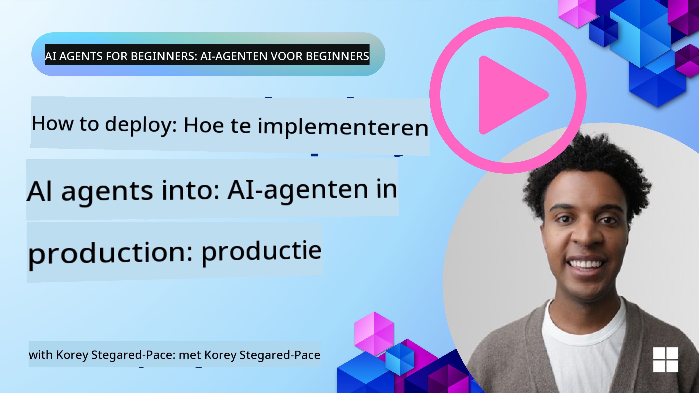

<!--
CO_OP_TRANSLATOR_METADATA:
{
  "original_hash": "cdfd0acc8592c1af14f8637833450375",
  "translation_date": "2025-08-29T17:23:22+00:00",
  "source_file": "10-ai-agents-production/README.md",
  "language_code": "nl"
}
-->
# AI-agenten in productie: Observatie en Evaluatie

[](https://youtu.be/l4TP6IyJxmQ?si=reGOyeqjxFevyDq9)

Wanneer AI-agenten evolueren van experimentele prototypes naar toepassingen in de echte wereld, wordt het essentieel om hun gedrag te begrijpen, hun prestaties te monitoren en hun output systematisch te evalueren.

## Leerdoelen

Na het voltooien van deze les weet je hoe je:
- Kernconcepten van observatie en evaluatie van agenten begrijpt
- Technieken toepast om de prestaties, kosten en effectiviteit van agenten te verbeteren
- Systematisch je AI-agenten evalueert en wat daarbij belangrijk is
- Kosten beheerst bij het inzetten van AI-agenten in productie
- Agenten gebouwd met AutoGen instrumenteert

Het doel is om je uit te rusten met de kennis om je "black box"-agenten te transformeren in transparante, beheersbare en betrouwbare systemen.

_**Opmerking:** Het is belangrijk om AI-agenten in te zetten die veilig en betrouwbaar zijn. Bekijk ook de les [Building Trustworthy AI Agents](./06-building-trustworthy-agents/README.md)._

## Traces en Spans

Observatietools zoals [Langfuse](https://langfuse.com/) of [Azure AI Foundry](https://learn.microsoft.com/en-us/azure/ai-foundry/what-is-azure-ai-foundry) representeren agentruns meestal als traces en spans.

- **Trace** vertegenwoordigt een complete agenttaak van begin tot eind (zoals het afhandelen van een gebruikersvraag).
- **Spans** zijn individuele stappen binnen de trace (zoals het aanroepen van een taalmodel of het ophalen van gegevens).


Zonder observatie kan een AI-agent aanvoelen als een "black box" - zijn interne toestand en redenering zijn ondoorzichtig, wat het moeilijk maakt om problemen te diagnosticeren of prestaties te optimaliseren. Met observatie worden agenten "glass boxes," wat transparantie biedt die cruciaal is voor het opbouwen van vertrouwen en ervoor zorgt dat ze werken zoals bedoeld.

## Waarom observatie belangrijk is in productieomgevingen

Het overzetten van AI-agenten naar productieomgevingen brengt nieuwe uitdagingen en vereisten met zich mee. Observatie is niet langer een "nice-to-have," maar een essentiële capaciteit:

*   **Debuggen en Oorzaakanalyse**: Wanneer een agent faalt of een onverwachte output produceert, bieden observatietools de traces die nodig zijn om de bron van de fout te achterhalen. Dit is vooral belangrijk bij complexe agenten die meerdere LLM-aanroepen, toolinteracties en conditionele logica kunnen omvatten.
*   **Beheer van Latentie en Kosten**: AI-agenten vertrouwen vaak op LLM's en andere externe API's die per token of per oproep worden gefactureerd. Observatie maakt het mogelijk om deze oproepen nauwkeurig te volgen, zodat je trage of dure operaties kunt identificeren. Dit stelt teams in staat om prompts te optimaliseren, efficiëntere modellen te kiezen of workflows opnieuw te ontwerpen om operationele kosten te beheersen en een goede gebruikerservaring te garanderen.
*   **Vertrouwen, Veiligheid en Naleving**: In veel toepassingen is het belangrijk om ervoor te zorgen dat agenten zich veilig en ethisch gedragen. Observatie biedt een audittrail van agentacties en -beslissingen. Dit kan worden gebruikt om problemen zoals promptinjectie, het genereren van schadelijke inhoud of het verkeerd omgaan met persoonlijk identificeerbare informatie (PII) te detecteren en te beperken. Je kunt bijvoorbeeld traces bekijken om te begrijpen waarom een agent een bepaald antwoord gaf of een specifieke tool gebruikte.
*   **Continue Verbeteringscycli**: Observatiegegevens vormen de basis van een iteratief ontwikkelingsproces. Door te monitoren hoe agenten presteren in de echte wereld, kunnen teams verbeterpunten identificeren, gegevens verzamelen voor het fijn afstemmen van modellen en de impact van wijzigingen valideren. Dit creëert een feedbackloop waarbij inzichten uit productie (online evaluatie) offline experimenten en verfijning informeren, wat leidt tot steeds betere prestaties van agenten.

## Belangrijke metrics om te volgen

Om het gedrag van agenten te monitoren en te begrijpen, moet een reeks metrics en signalen worden gevolgd. Hoewel de specifieke metrics kunnen variëren afhankelijk van het doel van de agent, zijn sommige universeel belangrijk.

Hier zijn enkele van de meest voorkomende metrics die door observatietools worden gevolgd:

**Latentie:** Hoe snel reageert de agent? Lange wachttijden hebben een negatieve invloed op de gebruikerservaring. Je moet de latentie meten voor taken en individuele stappen door agentruns te traceren. Bijvoorbeeld, een agent die 20 seconden nodig heeft voor alle modelaanroepen kan worden versneld door een sneller model te gebruiken of door modelaanroepen parallel uit te voeren.

**Kosten:** Wat zijn de kosten per agentrun? AI-agenten vertrouwen op LLM-aanroepen die per token of externe API's worden gefactureerd. Frequent gebruik van tools of meerdere prompts kunnen de kosten snel verhogen. Bijvoorbeeld, als een agent een LLM vijf keer aanroept voor een marginale kwaliteitsverbetering, moet je beoordelen of de kosten gerechtvaardigd zijn of dat je het aantal oproepen kunt verminderen of een goedkoper model kunt gebruiken. Realtime monitoring kan ook onverwachte pieken identificeren (bijvoorbeeld bugs die overmatige API-loops veroorzaken).

**Verzoekfouten:** Hoeveel verzoeken zijn mislukt? Dit kan API-fouten of mislukte tooloproepen omvatten. Om je agent robuuster te maken tegen deze fouten in productie, kun je terugvalopties of retries instellen. Bijvoorbeeld, als LLM-provider A niet beschikbaar is, schakel je over naar LLM-provider B als back-up.

**Gebruikersfeedback:** Directe evaluaties van gebruikers bieden waardevolle inzichten. Dit kan expliciete beoordelingen omvatten (👍duim omhoog/👎omlaag, ⭐1-5 sterren) of tekstuele opmerkingen. Consistente negatieve feedback moet een waarschuwing zijn, omdat dit een teken is dat de agent niet naar verwachting werkt.

**Impliciete gebruikersfeedback:** Gebruikersgedrag biedt indirecte feedback, zelfs zonder expliciete beoordelingen. Dit kan onmiddellijke herformulering van vragen, herhaalde vragen of het klikken op een herhaal-knop omvatten. Bijvoorbeeld, als je ziet dat gebruikers herhaaldelijk dezelfde vraag stellen, is dit een teken dat de agent niet naar verwachting werkt.

**Nauwkeurigheid:** Hoe vaak produceert de agent correcte of gewenste outputs? De definitie van nauwkeurigheid varieert (bijvoorbeeld correctheid van probleemoplossing, nauwkeurigheid van informatieophaling, gebruikerstevredenheid). De eerste stap is om te definiëren wat succes betekent voor je agent. Je kunt nauwkeurigheid volgen via geautomatiseerde controles, evaluatiescores of labels voor taakvoltooiing. Bijvoorbeeld, traces markeren als "geslaagd" of "mislukt."

**Geautomatiseerde evaluatiemetrics:** Je kunt ook geautomatiseerde evaluaties instellen. Bijvoorbeeld, je kunt een LLM gebruiken om de output van de agent te scoren, bijvoorbeeld of deze nuttig, nauwkeurig of niet is. Er zijn ook verschillende open source-bibliotheken die je helpen om verschillende aspecten van de agent te scoren. Bijvoorbeeld [RAGAS](https://docs.ragas.io/) voor RAG-agenten of [LLM Guard](https://llm-guard.com/) om schadelijke taal of promptinjectie te detecteren.

In de praktijk biedt een combinatie van deze metrics de beste dekking van de gezondheid van een AI-agent. In het [voorbeeldnotebook](./code_samples/10_autogen_evaluation.ipynb) van dit hoofdstuk laten we zien hoe deze metrics eruitzien in echte voorbeelden, maar eerst leren we hoe een typische evaluatieworkflow eruitziet.

## Instrumenteer je agent

Om tracegegevens te verzamelen, moet je je code instrumenteren. Het doel is om de agentcode te instrumenteren zodat deze traces en metrics genereert die kunnen worden vastgelegd, verwerkt en gevisualiseerd door een observatieplatform.

**OpenTelemetry (OTel):** [OpenTelemetry](https://opentelemetry.io/) is uitgegroeid tot een industriestandaard voor LLM-observatie. Het biedt een set API's, SDK's en tools voor het genereren, verzamelen en exporteren van telemetriegegevens.

Er zijn veel instrumentatielibraries die bestaande agentframeworks omwikkelen en het gemakkelijk maken om OpenTelemetry-spans te exporteren naar een observatietool. Hieronder staat een voorbeeld van het instrumenteren van een AutoGen-agent met de [OpenLit-instrumentatielibrary](https://github.com/openlit/openlit):

```python
import openlit

openlit.init(tracer = langfuse._otel_tracer, disable_batch = True)
```

Het [voorbeeldnotebook](./code_samples/10_autogen_evaluation.ipynb) in dit hoofdstuk demonstreert hoe je je AutoGen-agent kunt instrumenteren.

**Handmatige spancreatie:** Hoewel instrumentatielibraries een goede basis bieden, zijn er vaak gevallen waarin meer gedetailleerde of aangepaste informatie nodig is. Je kunt handmatig spans creëren om aangepaste toepassingslogica toe te voegen. Belangrijker nog, je kunt automatisch of handmatig gecreëerde spans verrijken met aangepaste attributen (ook wel tags of metadata genoemd). Deze attributen kunnen bedrijfsspecifieke gegevens, tussentijdse berekeningen of context bevatten die nuttig kan zijn voor debugging of analyse, zoals `user_id`, `session_id` of `model_version`.

Voorbeeld van het handmatig creëren van traces en spans met de [Langfuse Python SDK](https://langfuse.com/docs/sdk/python/sdk-v3):

```python
from langfuse import get_client
 
langfuse = get_client()
 
span = langfuse.start_span(name="my-span")
 
span.end()
```

## Evaluatie van agenten

Observatie geeft ons metrics, maar evaluatie is het proces van het analyseren van die gegevens (en het uitvoeren van tests) om te bepalen hoe goed een AI-agent presteert en hoe deze kan worden verbeterd. Met andere woorden, zodra je die traces en metrics hebt, hoe gebruik je ze dan om de agent te beoordelen en beslissingen te nemen?

Regelmatige evaluatie is belangrijk omdat AI-agenten vaak niet-deterministisch zijn en kunnen evolueren (door updates of veranderend modelgedrag) – zonder evaluatie zou je niet weten of je "slimme agent" zijn werk goed doet of dat deze achteruitgaat.

Er zijn twee categorieën evaluaties voor AI-agenten: **offline evaluatie** en **online evaluatie**. Beide zijn waardevol en vullen elkaar aan. Meestal beginnen we met offline evaluatie, omdat dit de minimale noodzakelijke stap is voordat een agent wordt ingezet.

### Offline Evaluatie


Dit omvat het evalueren van de agent in een gecontroleerde omgeving, meestal met behulp van testdatasets, niet met live gebruikersvragen. Je gebruikt samengestelde datasets waarvan je weet wat de verwachte output of het correcte gedrag is, en laat je agent daarop draaien.

Bijvoorbeeld, als je een agent hebt gebouwd voor wiskundige tekstproblemen, kun je een [testdataset](https://huggingface.co/datasets/gsm8k) hebben met 100 problemen met bekende antwoorden. Offline evaluatie wordt vaak uitgevoerd tijdens de ontwikkeling (en kan deel uitmaken van CI/CD-pijplijnen) om verbeteringen te controleren of regressies te voorkomen. Het voordeel is dat het **herhaalbaar is en je duidelijke nauwkeurigheidsmetrics kunt krijgen omdat je een grondwaarheid hebt**. Je kunt ook gebruikersvragen simuleren en de reacties van de agent meten aan de hand van ideale antwoorden of geautomatiseerde metrics zoals hierboven beschreven.

De belangrijkste uitdaging bij offline evaluatie is ervoor zorgen dat je testdataset uitgebreid en relevant blijft – de agent kan goed presteren op een vaste testset, maar heel andere vragen tegenkomen in productie. Daarom moet je testsets up-to-date houden met nieuwe edge cases en voorbeelden die realistische scenario's weerspiegelen. Een mix van kleine "smoke test"-cases en grotere evaluatiesets is nuttig: kleine sets voor snelle controles en grotere sets voor bredere prestatiedata.

### Online Evaluatie


Dit verwijst naar het evalueren van de agent in een live, echte omgeving, oftewel tijdens daadwerkelijk gebruik in productie. Online evaluatie omvat het continu monitoren van de prestaties van de agent op basis van echte gebruikersinteracties en het analyseren van de resultaten.

Bijvoorbeeld, je kunt succespercentages, gebruikerstevredenheidsscores of andere metrics volgen op live verkeer. Het voordeel van online evaluatie is dat het **dingen vastlegt die je in een laboratoriumomgeving misschien niet zou verwachten** – je kunt modeldrift over tijd observeren (als de effectiviteit van de agent afneemt naarmate invoerpatronen veranderen) en onverwachte vragen of situaties opvangen die niet in je testdata zaten. Het biedt een waarheidsgetrouw beeld van hoe de agent zich in de praktijk gedraagt.

Online evaluatie omvat vaak het verzamelen van impliciete en expliciete gebruikersfeedback, zoals besproken, en mogelijk het uitvoeren van shadow tests of A/B-tests (waarbij een nieuwe versie van de agent parallel draait om te vergelijken met de oude). De uitdaging is dat het lastig kan zijn om betrouwbare labels of scores te krijgen voor live interacties – je kunt vertrouwen op gebruikersfeedback of downstream metrics (zoals of de gebruiker op het resultaat klikte).

### De twee combineren

Online en offline evaluaties sluiten elkaar niet uit; ze vullen elkaar juist aan. Inzichten uit online monitoring (bijvoorbeeld nieuwe typen gebruikersvragen waar de agent slecht presteert) kunnen worden gebruikt om offline testdatasets aan te vullen en te verbeteren. Omgekeerd kunnen agenten die goed presteren in offline tests met meer vertrouwen worden ingezet en online worden gemonitord.

Veel teams hanteren zelfs een cyclus:

_offline evalueren -> inzetten -> online monitoren -> nieuwe faalgevallen verzamelen -> toevoegen aan offline dataset -> agent verfijnen -> herhalen_.

## Veelvoorkomende problemen

Bij het inzetten van AI-agenten in productie kun je verschillende uitdagingen tegenkomen. Hier zijn enkele veelvoorkomende problemen en mogelijke oplossingen:

| **Probleem**    | **Mogelijke oplossing**   |
| ------------- | ------------------ |
| AI-agent voert taken niet consistent uit | - Verfijn de prompt die aan de AI-agent wordt gegeven; wees duidelijk over de doelstellingen.<br>- Onderzoek of het opdelen van taken in subtaken en deze laten afhandelen door meerdere agenten kan helpen. |
| AI-agent raakt verstrikt in eindeloze loops  | - Zorg ervoor dat je duidelijke beëindigingsvoorwaarden hebt, zodat de agent weet wanneer het proces moet stoppen. |

- Voor complexe taken die redenering en planning vereisen, gebruik een groter model dat gespecialiseerd is in redeneringstaken. |
| AI Agent-toolprestaties zijn niet goed   | - Test en valideer de output van de tool buiten het agentsysteem.<br>- Verfijn de gedefinieerde parameters, prompts en namen van tools.  |
| Multi-Agent-systeem presteert niet consistent | - Verfijn de prompts die aan elke agent worden gegeven om ervoor te zorgen dat ze specifiek en onderscheidend zijn.<br>- Bouw een hiërarchisch systeem met een "routerings-" of controlleragent om te bepalen welke agent de juiste is. |

Veel van deze problemen kunnen effectiever worden geïdentificeerd met observatiehulpmiddelen. De traces en metrics die we eerder hebben besproken, helpen precies te bepalen waar in de agentworkflow problemen optreden, waardoor debuggen en optimalisatie veel efficiënter worden.

## Kosten Beheren

Hier zijn enkele strategieën om de kosten van het inzetten van AI-agents in productie te beheren:

**Gebruik van Kleinere Modellen:** Kleine Taalmodellen (SLMs) kunnen goed presteren bij bepaalde agentische use-cases en zullen de kosten aanzienlijk verlagen. Zoals eerder vermeld, is het bouwen van een evaluatiesysteem om prestaties te bepalen en te vergelijken met grotere modellen de beste manier om te begrijpen hoe goed een SLM zal presteren voor jouw use-case. Overweeg SLMs te gebruiken voor eenvoudigere taken zoals intentieclassificatie of parameterextractie, en reserveer grotere modellen voor complexe redenering.

**Gebruik van een Routermodel:** Een vergelijkbare strategie is het gebruik van een diversiteit aan modellen en groottes. Je kunt een LLM/SLM of serverloze functie gebruiken om verzoeken op basis van complexiteit door te sturen naar de best passende modellen. Dit helpt niet alleen om kosten te verlagen, maar zorgt ook voor goede prestaties bij de juiste taken. Bijvoorbeeld, stuur eenvoudige vragen naar kleinere, snellere modellen en gebruik alleen dure grote modellen voor complexe redeneringstaken.

**Caching van Antwoorden:** Het identificeren van veelvoorkomende verzoeken en taken en het vooraf aanbieden van de antwoorden voordat ze door je agentische systeem gaan, is een goede manier om het volume van soortgelijke verzoeken te verminderen. Je kunt zelfs een flow implementeren om te bepalen hoe vergelijkbaar een verzoek is met je gecachte verzoeken met behulp van meer basale AI-modellen. Deze strategie kan de kosten aanzienlijk verlagen voor veelgestelde vragen of veelvoorkomende workflows.

## Laten we zien hoe dit in de praktijk werkt

In het [voorbeeldnotebook van deze sectie](./code_samples/10_autogen_evaluation.ipynb) zien we voorbeelden van hoe we observatiehulpmiddelen kunnen gebruiken om onze agent te monitoren en evalueren.

### Meer Vragen over AI-Agents in Productie?

Word lid van de [Azure AI Foundry Discord](https://aka.ms/ai-agents/discord) om andere leerlingen te ontmoeten, spreekuren bij te wonen en je vragen over AI-Agents beantwoord te krijgen.

## Vorige Les

[Metacognitie Designpatroon](../09-metacognition/README.md)

## Volgende Les

[Agentische Protocollen](../11-agentic-protocols/README.md)

---

**Disclaimer**:  
Dit document is vertaald met behulp van de AI-vertalingsservice [Co-op Translator](https://github.com/Azure/co-op-translator). Hoewel we streven naar nauwkeurigheid, dient u zich ervan bewust te zijn dat geautomatiseerde vertalingen fouten of onnauwkeurigheden kunnen bevatten. Het originele document in zijn oorspronkelijke taal moet worden beschouwd als de gezaghebbende bron. Voor cruciale informatie wordt professionele menselijke vertaling aanbevolen. Wij zijn niet aansprakelijk voor eventuele misverstanden of verkeerde interpretaties die voortvloeien uit het gebruik van deze vertaling.