<!--
CO_OP_TRANSLATOR_METADATA:
{
  "original_hash": "5cc6836626047aa055e8960c8484a7d0",
  "translation_date": "2025-08-29T18:28:27+00:00",
  "source_file": "11-agentic-protocols/code_samples/mcp-agents/README.md",
  "language_code": "nl"
}
-->
# Agent-naar-Agent Communicatiesystemen Bouwen met MCP

> TL;DR - Kun je Agent2Agent-communicatie bouwen op MCP? Ja!

MCP is aanzienlijk geëvolueerd voorbij zijn oorspronkelijke doel van "context bieden aan LLM's". Met recente verbeteringen zoals [hervatbare streams](https://modelcontextprotocol.io/docs/concepts/transports#resumability-and-redelivery), [elicitation](https://modelcontextprotocol.io/specification/2025-06-18/client/elicitation), [sampling](https://modelcontextprotocol.io/specification/2025-06-18/client/sampling), en notificaties ([voortgang](https://modelcontextprotocol.io/specification/2025-06-18/basic/utilities/progress) en [resources](https://modelcontextprotocol.io/specification/2025-06-18/schema#resourceupdatednotification)), biedt MCP nu een robuuste basis voor het bouwen van complexe agent-naar-agent communicatiesystemen.

## Het Misverstand over Agent/Tool

Naarmate meer ontwikkelaars tools met agentgedrag verkennen (langdurige uitvoering, aanvullende input nodig tijdens uitvoering, etc.), ontstaat vaak het misverstand dat MCP ongeschikt is, voornamelijk omdat vroege voorbeelden van de tools-primitief zich richtten op eenvoudige vraag-en-antwoordpatronen.

Deze perceptie is achterhaald. De MCP-specificatie is de afgelopen maanden aanzienlijk verbeterd met mogelijkheden die de kloof dichten voor het bouwen van langdurig agentgedrag:

- **Streaming & Tussentijdse Resultaten**: Realtime voortgangsupdates tijdens uitvoering
- **Hervatbaarheid**: Clients kunnen opnieuw verbinden en doorgaan na een onderbreking
- **Duurzaamheid**: Resultaten blijven behouden na serverherstarts (bijv. via resource-links)
- **Multi-turn**: Interactieve input tijdens uitvoering via elicitation en sampling

Deze functies kunnen worden gecombineerd om complexe agentgedreven en multi-agent toepassingen mogelijk te maken, allemaal geïmplementeerd op het MCP-protocol.

Voor referentie zullen we een agent aanduiden als een "tool" die beschikbaar is op een MCP-server. Dit impliceert het bestaan van een hostapplicatie die een MCP-client implementeert, een sessie met de MCP-server opzet en de agent kan aanroepen.

## Wat Maakt een MCP Tool "Agentgedreven"?

Voordat we ingaan op de implementatie, laten we vaststellen welke infrastructuurcapaciteiten nodig zijn om langdurige agents te ondersteunen.

> We definiëren een agent als een entiteit die autonoom kan opereren over langere perioden, in staat om complexe taken uit te voeren die meerdere interacties of aanpassingen vereisen op basis van realtime feedback.

### 1. Streaming & Tussentijdse Resultaten

Traditionele vraag-en-antwoordpatronen werken niet voor langdurige taken. Agents moeten kunnen:

- Realtime voortgangsupdates geven
- Tussentijdse resultaten leveren

**MCP Ondersteuning**: Resource-update notificaties maken streaming van tussentijdse resultaten mogelijk, hoewel dit zorgvuldig ontwerp vereist om conflicten met het 1:1 vraag/antwoordmodel van JSON-RPC te vermijden.

| Functie                   | Gebruikssituatie                                                                                                                                                                | MCP Ondersteuning                                                                         |
| ------------------------- | ------------------------------------------------------------------------------------------------------------------------------------------------------------------------------ | ----------------------------------------------------------------------------------------- |
| Realtime Voortgangsupdates | Gebruiker vraagt een codebase-migratietaak aan. De agent streamt voortgang: "10% - Afhankelijkheden analyseren... 25% - TypeScript-bestanden converteren... 50% - Imports bijwerken..." | ✅ Voortgangsnotificaties                                                                 |
| Tussentijdse Resultaten   | "Boek genereren"-taak streamt tussentijdse resultaten, bijv. 1) Verhaallijnschema, 2) Hoofdstuklijst, 3) Elk voltooid hoofdstuk. Host kan inspecteren, annuleren of omleiden. | ✅ Notificaties kunnen worden "uitgebreid" om tussentijdse resultaten op te nemen, zie voorstellen in PR 383, 776 |

<div align="center" style="font-style: italic; font-size: 0.95em; margin-bottom: 0.5em;">
<strong>Figuur 1:</strong> Dit diagram illustreert hoe een MCP-agent realtime voortgangsupdates en tussentijdse resultaten naar de hostapplicatie streamt tijdens een langdurige taak, zodat de gebruiker de uitvoering in realtime kan volgen.
</div>


### 2. Hervatbaarheid

Agents moeten netwerkonderbrekingen soepel kunnen afhandelen:

- Opnieuw verbinden na (client) onderbreking
- Doorgaan waar ze gebleven waren (berichtherlevering)

**MCP Ondersteuning**: MCP StreamableHTTP-transport ondersteunt vandaag sessiehervatting en berichtherlevering met sessie-ID's en laatste gebeurtenis-ID's. Belangrijk hierbij is dat de server een EventStore moet implementeren die gebeurtenisherhalingen mogelijk maakt bij client-herverbinding.  
Let op dat er een communityvoorstel is (PR #975) dat transportonafhankelijke hervatbare streams verkent.

| Functie       | Gebruikssituatie                                                                                                                                         | MCP Ondersteuning                                                        |
| ------------- | -------------------------------------------------------------------------------------------------------------------------------------------------------- | ------------------------------------------------------------------------ |
| Hervatbaarheid | Client verbreekt verbinding tijdens langdurige taak. Bij herverbinding wordt de sessie hervat met gemiste gebeurtenissen die worden herhaald, naadloos doorgaan. | ✅ StreamableHTTP-transport met sessie-ID's, gebeurtenisherhaling en EventStore |

```mermaid
sequenceDiagram
    participant User
    participant Host as Host App<br/>(MCP Client)
    participant Server as MCP Server<br/>(Agent Tool)
    participant Store as Event Store

    User->>Host: Start task
    Host->>Server: Call tool [session: abc123]
    Server->>Store: Save events

    Note over Host,Server: 💥 Connection lost

    Host->>Server: Reconnect [session: abc123]
    Store-->>Server: Replay events
    Server-->>Host: Catch up + continue
    Host-->>User: ✅ Complete
```

<div align="center" style="font-style: italic; font-size: 0.95em; margin-bottom: 0.5em;">
<strong>Figuur 2:</strong> Dit diagram toont hoe MCP's StreamableHTTP-transport en event store naadloze sessiehervatting mogelijk maken: als de client de verbinding verbreekt, kan deze opnieuw verbinden en gemiste gebeurtenissen herhalen, waardoor de taak zonder voortgangsverlies doorgaat.
</div>



### 3. Duurzaamheid

Langdurige agents hebben een persistente staat nodig:

- Resultaten blijven behouden na serverherstarts
- Status kan buiten de sessie worden opgevraagd
- Voortgangsregistratie over sessies heen

**MCP Ondersteuning**: MCP ondersteunt nu een Resource-link als retourtype voor toolaanroepen. Een mogelijk patroon is om een tool te ontwerpen die een resource creëert en onmiddellijk een resource-link retourneert. De tool kan doorgaan met de taak op de achtergrond en de resource bijwerken. De client kan ervoor kiezen om de status van deze resource te polleren om gedeeltelijke of volledige resultaten te krijgen (afhankelijk van welke resource-updates de server biedt) of zich abonneren op de resource voor update-notificaties.

Een beperking hier is dat het polleren van resources of abonneren op updates middelen kan verbruiken met implicaties op schaal. Er is een open communityvoorstel (inclusief #992) dat de mogelijkheid verkent om webhooks of triggers op te nemen waarmee de server de client/hostapplicatie kan informeren over updates.

| Functie     | Gebruikssituatie                                                                                                                                       | MCP Ondersteuning                                                   |
| ----------- | ------------------------------------------------------------------------------------------------------------------------------------------------------ | ------------------------------------------------------------------- |
| Duurzaamheid | Server crasht tijdens datamigratietaak. Resultaten en voortgang blijven behouden na herstart, client kan status controleren en doorgaan vanuit persistente resource. | ✅ Resource-links met persistente opslag en statusnotificaties      |

Vandaag is een gangbaar patroon om een tool te ontwerpen die een resource creëert en onmiddellijk een resource-link retourneert. De tool kan op de achtergrond de taak uitvoeren, resource-notificaties uitgeven die dienen als voortgangsupdates of tussentijdse resultaten bevatten, en de inhoud in de resource bijwerken indien nodig.

```mermaid
sequenceDiagram
    participant User
    participant Host as Host App<br/>(MCP Client)
    participant Server as MCP Server<br/>(Agent Tool)
    participant DB as Persistent Storage

    User->>Host: Start task
    Host->>Server: Call tool
    Server->>DB: Create resource + updates
    Server-->>Host: 🔗 Resource link

    Note over Server: 💥 Server restart

    User->>Host: Check status
    Host->>Server: Get resource
    Server->>DB: Load state
    Server-->>Host: Current progress
    Server->>DB: Complete + notify
    Host-->>User: ✅ Complete
```

<div align="center" style="font-style: italic; font-size: 0.95em; margin-bottom: 0.5em;">
<strong>Figuur 3:</strong> Dit diagram toont hoe MCP-agents persistente resources en statusnotificaties gebruiken om ervoor te zorgen dat langdurige taken serverherstarts overleven, zodat clients voortgang kunnen controleren en resultaten kunnen ophalen, zelfs na storingen.
</div>



### 4. Multi-Turn Interacties

Agents hebben vaak aanvullende input nodig tijdens de uitvoering:

- Menselijke verduidelijking of goedkeuring
- AI-assistentie voor complexe beslissingen
- Dynamische parameteraanpassing

**MCP Ondersteuning**: Volledig ondersteund via sampling (voor AI-input) en elicitation (voor menselijke input).

| Functie                  | Gebruikssituatie                                                                                                                              | MCP Ondersteuning                                    |
| ------------------------ | --------------------------------------------------------------------------------------------------------------------------------------------- | --------------------------------------------------- |
| Multi-Turn Interacties   | Reisboekingsagent vraagt prijsbevestiging van gebruiker, vraagt vervolgens AI om reisgegevens samen te vatten voordat de boeking wordt voltooid. | ✅ Elicitation voor menselijke input, sampling voor AI-input |

```mermaid
sequenceDiagram
    participant User
    participant Host as Host App<br/>(MCP Client)
    participant Server as MCP Server<br/>(Agent Tool)

    User->>Host: Book flight
    Host->>Server: Call travel_agent

    Server->>Host: Elicitation: "Confirm $500?"
    Note over Host: Elicitation callback (if available)
    Host->>User: 💰 Confirm price?
    User->>Host: "Yes"
    Host->>Server: Confirmed

    Server->>Host: Sampling: "Summarize data"
    Note over Host: AI callback (if available)
    Host->>Server: Report summary

    Server->>Host: ✅ Flight booked
```

<div align="center" style="font-style: italic; font-size: 0.95em; margin-bottom: 0.5em;">
<strong>Figuur 4:</strong> Dit diagram toont hoe MCP-agents interactief menselijke input kunnen opvragen of AI-assistentie kunnen aanvragen tijdens de uitvoering, wat complexe, multi-turn workflows zoals bevestigingen en dynamische besluitvorming ondersteunt.
</div>



## Implementatie van Langdurige Agents op MCP - Codeoverzicht

Als onderdeel van dit artikel bieden we een [coderepository](https://github.com/victordibia/ai-tutorials/tree/main/MCP%20Agents) met een volledige implementatie van langdurige agents met behulp van de MCP Python SDK met StreamableHTTP-transport voor sessiehervatting en berichtherlevering. De implementatie laat zien hoe MCP-mogelijkheden kunnen worden gecombineerd om geavanceerd agentgedrag mogelijk te maken.

Specifiek implementeren we een server met twee primaire agenttools:

- **Reisagent** - Simuleert een reisboekingsservice met prijsbevestiging via elicitation
- **Onderzoeksagent** - Voert onderzoekstaken uit met AI-ondersteunde samenvattingen via sampling

Beide agents demonstreren realtime voortgangsupdates, interactieve bevestigingen en volledige sessiehervattingsmogelijkheden.

### Belangrijke Implementatieconcepten

De volgende secties tonen server-side agentimplementatie en client-side hostafhandeling voor elke mogelijkheid:

#### Streaming & Voortgangsupdates - Realtime Taakstatus

Streaming stelt agents in staat om realtime voortgangsupdates te geven tijdens langdurige taken, zodat gebruikers op de hoogte blijven van de taakstatus en tussentijdse resultaten.

**Serverimplementatie (agent stuurt voortgangsnotificaties):**

```python
# From server/server.py - Travel agent sending progress updates
for i, step in enumerate(steps):
    await ctx.session.send_progress_notification(
        progress_token=ctx.request_id,
        progress=i * 25,
        total=100,
        message=step,
        related_request_id=str(ctx.request_id)
    )
    await anyio.sleep(2)  # Simulate work

# Alternative: Log messages for detailed step-by-step updates
await ctx.session.send_log_message(
    level="info",
    data=f"Processing step {current_step}/{steps} ({progress_percent}%)",
    logger="long_running_agent",
    related_request_id=ctx.request_id,
)
```

**Clientimplementatie (host ontvangt voortgangsupdates):**

```python
# From client/client.py - Client handling real-time notifications
async def message_handler(message) -> None:
    if isinstance(message, types.ServerNotification):
        if isinstance(message.root, types.LoggingMessageNotification):
            console.print(f"📡 [dim]{message.root.params.data}[/dim]")
        elif isinstance(message.root, types.ProgressNotification):
            progress = message.root.params
            console.print(f"🔄 [yellow]{progress.message} ({progress.progress}/{progress.total})[/yellow]")

# Register message handler when creating session
async with ClientSession(
    read_stream, write_stream,
    message_handler=message_handler
) as session:
```

#### Elicitation - Gebruikersinput Opvragen

Elicitation stelt agents in staat om gebruikersinput op te vragen tijdens de uitvoering. Dit is essentieel voor bevestigingen, verduidelijkingen of goedkeuringen tijdens langdurige taken.

**Serverimplementatie (agent vraagt bevestiging):**

```python
# From server/server.py - Travel agent requesting price confirmation
elicit_result = await ctx.session.elicit(
    message=f"Please confirm the estimated price of $1200 for your trip to {destination}",
    requestedSchema=PriceConfirmationSchema.model_json_schema(),
    related_request_id=ctx.request_id,
)

if elicit_result and elicit_result.action == "accept":
    # Continue with booking
    logger.info(f"User confirmed price: {elicit_result.content}")
elif elicit_result and elicit_result.action == "decline":
    # Cancel the booking
    booking_cancelled = True
```

**Clientimplementatie (host biedt elicitation-callback):**

```python
# From client/client.py - Client handling elicitation requests
async def elicitation_callback(context, params):
    console.print(f"💬 Server is asking for confirmation:")
    console.print(f"   {params.message}")

    response = console.input("Do you accept? (y/n): ").strip().lower()

    if response in ['y', 'yes']:
        return types.ElicitResult(
            action="accept",
            content={"confirm": True, "notes": "Confirmed by user"}
        )
    else:
        return types.ElicitResult(
            action="decline",
            content={"confirm": False, "notes": "Declined by user"}
        )

# Register the callback when creating the session
async with ClientSession(
    read_stream, write_stream,
    elicitation_callback=elicitation_callback
) as session:
```

#### Sampling - AI-Assistentie Aanvragen

Sampling stelt agents in staat om LLM-assistentie aan te vragen voor complexe beslissingen of contentgeneratie tijdens de uitvoering. Dit maakt hybride mens-AI-workflows mogelijk.

**Serverimplementatie (agent vraagt AI-assistentie):**

```python
# From server/server.py - Research agent requesting AI summary
sampling_result = await ctx.session.create_message(
    messages=[
        SamplingMessage(
            role="user",
            content=TextContent(type="text", text=f"Please summarize the key findings for research on: {topic}")
        )
    ],
    max_tokens=100,
    related_request_id=ctx.request_id,
)

if sampling_result and sampling_result.content:
    if sampling_result.content.type == "text":
        sampling_summary = sampling_result.content.text
        logger.info(f"Received sampling summary: {sampling_summary}")
```

**Clientimplementatie (host biedt sampling-callback):**

```python
# From client/client.py - Client handling sampling requests
async def sampling_callback(context, params):
    message_text = params.messages[0].content.text if params.messages else 'No message'
    console.print(f"🧠 Server requested sampling: {message_text}")

    # In a real application, this could call an LLM API
    # For demo purposes, we provide a mock response
    mock_response = "Based on current research, MCP has evolved significantly..."

    return types.CreateMessageResult(
        role="assistant",
        content=types.TextContent(type="text", text=mock_response),
        model="interactive-client",
        stopReason="endTurn"
    )

# Register the callback when creating the session
async with ClientSession(
    read_stream, write_stream,
    sampling_callback=sampling_callback,
    elicitation_callback=elicitation_callback
) as session:
```

#### Hervatbaarheid - Sessiedoorlopendheid bij Onderbrekingen

Hervatbaarheid zorgt ervoor dat langdurige agenttaken clientonderbrekingen kunnen overleven en naadloos kunnen doorgaan bij herverbinding. Dit wordt geïmplementeerd via event stores en hervattingstokens.

**Event Store Implementatie (server bewaart sessiestatus):**

```python
# From server/event_store.py - Simple in-memory event store
class SimpleEventStore(EventStore):
    def __init__(self):
        self._events: list[tuple[StreamId, EventId, JSONRPCMessage]] = []
        self._event_id_counter = 0

    async def store_event(self, stream_id: StreamId, message: JSONRPCMessage) -> EventId:
        """Store an event and return its ID."""
        self._event_id_counter += 1
        event_id = str(self._event_id_counter)
        self._events.append((stream_id, event_id, message))
        return event_id

    async def replay_events_after(self, last_event_id: EventId, send_callback: EventCallback) -> StreamId | None:
        """Replay events after the specified ID for resumption."""
        # Find events after the last known event and replay them
        for _, event_id, message in self._events[start_index:]:
            await send_callback(EventMessage(message, event_id))

# From server/server.py - Passing event store to session manager
def create_server_app(event_store: Optional[EventStore] = None) -> Starlette:
    server = ResumableServer()

    # Create session manager with event store for resumption
    session_manager = StreamableHTTPSessionManager(
        app=server,
        event_store=event_store,  # Event store enables session resumption
        json_response=False,
        security_settings=security_settings,
    )

    return Starlette(routes=[Mount("/mcp", app=session_manager.handle_request)])

# Usage: Initialize with event store
event_store = SimpleEventStore()
app = create_server_app(event_store)
```

**Client Metadata met Hervattingstoken (client herverbindt met opgeslagen status):**

```python
# From client/client.py - Client resumption with metadata
if existing_tokens and existing_tokens.get("resumption_token"):
    # Use existing resumption token to continue where we left off
    metadata = ClientMessageMetadata(
        resumption_token=existing_tokens["resumption_token"],
    )
else:
    # Create callback to save resumption token when received
    def enhanced_callback(token: str):
        protocol_version = getattr(session, 'protocol_version', None)
        token_manager.save_tokens(session_id, token, protocol_version, command, args)

    metadata = ClientMessageMetadata(
        on_resumption_token_update=enhanced_callback,
    )

# Send request with resumption metadata
result = await session.send_request(
    types.ClientRequest(
        types.CallToolRequest(
            method="tools/call",
            params=types.CallToolRequestParams(name=command, arguments=args)
        )
    ),
    types.CallToolResult,
    metadata=metadata,
)
```

De hostapplicatie bewaart lokaal sessie-ID's en hervattingstokens, zodat deze opnieuw verbinding kan maken met bestaande sessies zonder voortgang of status te verliezen.

### Codeorganisatie

<div align="center" style="font-style: italic; font-size: 0.95em; margin-bottom: 0.5em;">
<strong>Figuur 5:</strong> MCP-gebaseerde agentsysteemarchitectuur
</div>


**Belangrijke Bestanden:**

- **`server/server.py`** - Hervatbare MCP-server met reis- en onderzoeksagents die elicitation, sampling en voortgangsupdates demonstreren
- **`client/client.py`** - Interactieve hostapplicatie met hervattingsondersteuning, callbackhandlers en tokenbeheer
- **`server/event_store.py`** - Event store-implementatie die sessiehervatting en berichtherlevering mogelijk maakt

## Uitbreiden naar Multi-Agent Communicatie op MCP

De bovenstaande implementatie kan worden uitgebreid naar multi-agent systemen door de intelligentie en reikwijdte van de hostapplicatie te vergroten:

- **Intelligente Taakontleding**: Host analyseert complexe gebruikersverzoeken en splitst deze op in subtaken voor verschillende gespecialiseerde agents
- **Multi-Server Coördinatie**: Host onderhoudt verbindingen met meerdere MCP-servers, elk met verschillende agentmogelijkheden
- **Taakstatusbeheer**: Host volgt voortgang van meerdere gelijktijdige agenttaken, behandelt afhankelijkheden en sequenties
- **Veerkracht & Herhalingen**: Host beheert storingen, implementeert herhalingslogica en leidt taken om wanneer agents niet beschikbaar zijn
- **Resultaatsynthese**: Host combineert outputs van meerdere agents tot coherente eindresultaten

De host evolueert van een eenvoudige client naar een intelligente orkestrator, die gedistribueerde agentmogelijkheden coördineert terwijl dezelfde MCP-protocolbasis behouden blijft.

## Conclusie

De verbeterde mogelijkheden van MCP - resource-notificaties, elicitation/sampling, hervatbare streams en persistente resources - maken complexe agent-naar-agent interacties mogelijk, terwijl de eenvoud van het protocol behouden blijft.

## Aan de Slag

Klaar om je eigen agent2agent-systeem te bouwen? Volg deze stappen:

### 1. Voer de Demo uit

```bash
# Start the server with event store for resumption
python -m server.server --port 8006

# In another terminal, run the interactive client
python -m client.client --url http://127.0.0.1:8006/mcp
```

**Beschikbare commando's in interactieve modus:**

- `travel_agent` - Boek reizen met prijsbevestiging via elicitation
- `research_agent` - Onderzoek onderwerpen met AI-ondersteunde samenvattingen via sampling
- `list` - Toon alle beschikbare tools
- `clean-tokens` - Wis hervattingstokens
- `help` - Toon gedetailleerde commando-hulp
- `quit` - Sluit de client

### 2. Test Hervattingsmogelijkheden

- Start een langdurige agent (bijv. `travel_agent`)
- Onderbreek de client tijdens de uitvoering (Ctrl+C)
- Herstart de client - deze hervat automatisch waar deze gebleven was

### 3. Verken en Breid Uit

- **Verken de voorbeelden**: Bekijk deze [mcp-agents](https://github.com/victordibia/ai-tutorials/tree/main/MCP%20Agents)
- **Doe mee met de community**: Neem deel aan MCP-discussies op GitHub
- **Experimenteer**: Begin met een eenvoudige langdurige taak en voeg geleidelijk streaming, hervatbaarheid en multi-agent coördinatie toe

Dit laat zien hoe MCP intelligente agentgedragingen mogelijk maakt, terwijl de eenvoud van tools behouden blijft.

Over het algemeen evolueert de MCP-protocolspecificatie snel; de lezer wordt aangemoedigd om de officiële documentatiewebsite te bekijken voor de meest recente updates - https://modelcontextprotocol.io/introduction

---

**Disclaimer**:  
Dit document is vertaald met behulp van de AI-vertalingsservice [Co-op Translator](https://github.com/Azure/co-op-translator). Hoewel we streven naar nauwkeurigheid, dient u zich ervan bewust te zijn dat geautomatiseerde vertalingen fouten of onnauwkeurigheden kunnen bevatten. Het originele document in zijn oorspronkelijke taal moet worden beschouwd als de gezaghebbende bron. Voor cruciale informatie wordt professionele menselijke vertaling aanbevolen. Wij zijn niet aansprakelijk voor eventuele misverstanden of verkeerde interpretaties die voortvloeien uit het gebruik van deze vertaling.