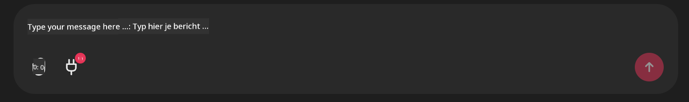

<!--
CO_OP_TRANSLATOR_METADATA:
{
  "original_hash": "9bf0395cbc541ce8db2a9699c8678dfc",
  "translation_date": "2025-07-12T14:23:19+00:00",
  "source_file": "11-mcp/code_samples/github-mcp/README.md",
  "language_code": "nl"
}
-->
# Github MCP Server Voorbeeld

## Beschrijving

Dit was een demo gemaakt voor de AI Agents Hackathon georganiseerd via de Microsoft Reactor.

De tool wordt gebruikt om hackathonprojecten aan te bevelen op basis van de Github-repositories van een gebruiker.  
Dit gebeurt door:

1. **Github Agent** - Gebruik maken van de Github MCP Server om repositories en informatie over die repositories op te halen.  
2. **Hackathon Agent** - Neemt de data van de Github Agent en bedenkt creatieve hackathonprojectideeën op basis van de projecten, de door de gebruiker gebruikte programmeertalen en de projectcategorieën van de AI Agents hackathon.  
3. **Events Agent** - Op basis van de suggestie van de hackathon agent, beveelt de events agent relevante evenementen aan uit de AI Agent Hackathon-serie.  

## De code uitvoeren

### Omgevingsvariabelen

Deze demo maakt gebruik van Azure Open AI Service, Semantic Kernel, de Github MCP Server en Azure AI Search.

Zorg ervoor dat je de juiste omgevingsvariabelen hebt ingesteld om deze tools te kunnen gebruiken:

```python
AZURE_OPENAI_CHAT_DEPLOYMENT_NAME=""
AZURE_OPENAI_EMBEDDING_DEPLOYMENT_NAME=""
AZURE_OPENAI_ENDPOINT=""
AZURE_OPENAI_API_KEY=""
AZURE_OPENAI_API_VERSION=""
AZURE_SEARCH_SERVICE_ENDPOINT=""
AZURE_SEARCH_API_KEY=""
```

## De Chainlit Server starten

Om verbinding te maken met de MCP server, gebruikt deze demo Chainlit als chatinterface.

Om de server te starten, gebruik je het volgende commando in je terminal:

```bash
chainlit run app.py -w
```

Dit zou je Chainlit-server moeten starten op `localhost:8000` en tegelijkertijd je Azure AI Search Index vullen met de inhoud van `event-descriptions.md`.

## Verbinden met de MCP Server

Om verbinding te maken met de Github MCP Server, selecteer je het "stekker"-icoon onder het tekstvak "Type your message here..":



Daarna kun je klikken op "Connect an MCP" om het commando toe te voegen om verbinding te maken met de Github MCP Server:

```bash
npx -y @modelcontextprotocol/server-github --env GITHUB_PERSONAL_ACCESS_TOKEN=[YOUR PERSONAL ACCESS TOKEN]
```

Vervang "[YOUR PERSONAL ACCESS TOKEN]" door je eigen Personal Access Token.

Na het verbinden zou je een (1) naast het stekker-icoon moeten zien om te bevestigen dat de verbinding is gemaakt. Zo niet, probeer dan de chainlit-server opnieuw te starten met `chainlit run app.py -w`.

## De demo gebruiken

Om de agent workflow te starten voor het aanbevelen van hackathonprojecten, kun je een bericht typen zoals:

"Recommend hackathon projects for the Github user koreyspace"

De Router Agent zal je verzoek analyseren en bepalen welke combinatie van agents (GitHub, Hackathon en Events) het beste geschikt is om je vraag te behandelen. De agents werken samen om uitgebreide aanbevelingen te geven op basis van analyse van Github repositories, projectideeën en relevante tech evenementen.

**Disclaimer**:  
Dit document is vertaald met behulp van de AI-vertalingsdienst [Co-op Translator](https://github.com/Azure/co-op-translator). Hoewel we streven naar nauwkeurigheid, dient u er rekening mee te houden dat geautomatiseerde vertalingen fouten of onnauwkeurigheden kunnen bevatten. Het originele document in de oorspronkelijke taal moet als de gezaghebbende bron worden beschouwd. Voor cruciale informatie wordt professionele menselijke vertaling aanbevolen. Wij zijn niet aansprakelijk voor eventuele misverstanden of verkeerde interpretaties die voortvloeien uit het gebruik van deze vertaling.