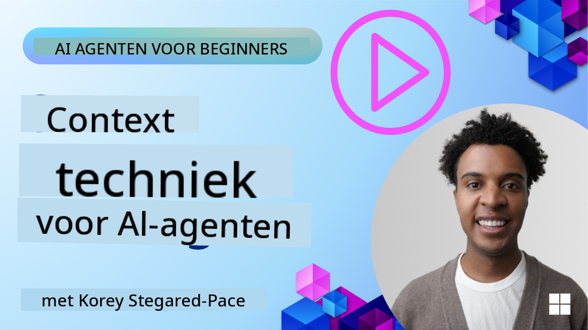
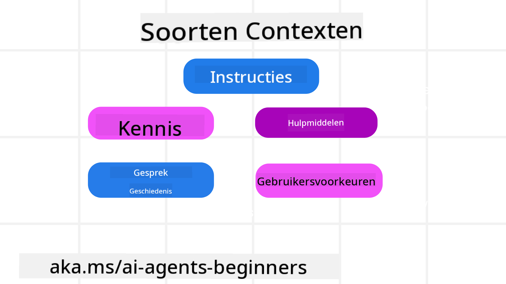
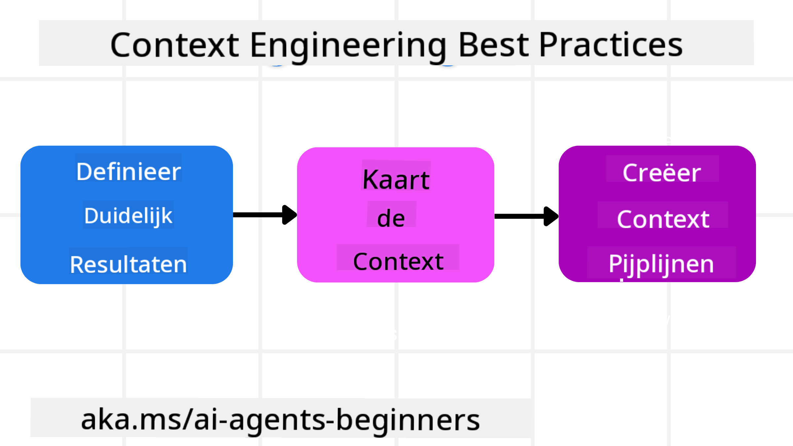

<!--
CO_OP_TRANSLATOR_METADATA:
{
  "original_hash": "cb7e50f471905ce6fdb92a30269a7a98",
  "translation_date": "2025-09-04T10:14:16+00:00",
  "source_file": "12-context-engineering/README.md",
  "language_code": "nl"
}
-->
# Context Engineering voor AI-agenten

> _(Klik op de afbeelding hierboven om de video van deze les te bekijken)_

Het begrijpen van de complexiteit van de applicatie waarvoor je een AI-agent bouwt, is essentieel om een betrouwbare agent te maken. We moeten AI-agenten bouwen die informatie effectief beheren om complexe behoeften aan te pakken, verder dan alleen prompt engineering.

In deze les gaan we kijken naar wat context engineering is en de rol ervan bij het bouwen van AI-agenten.

## Introductie

Deze les behandelt:

• **Wat Context Engineering is** en waarom het verschilt van prompt engineering.

• **Strategieën voor effectieve Context Engineering**, inclusief hoe je informatie schrijft, selecteert, comprimeert en isoleert.

• **Veelvoorkomende contextfouten** die je AI-agent kunnen ontsporen en hoe je ze kunt oplossen.

## Leerdoelen

Na het voltooien van deze les begrijp je hoe je:

• **Context engineering definieert** en het onderscheidt van prompt engineering.

• **De belangrijkste componenten van context identificeert** in toepassingen van Large Language Models (LLM).

• **Strategieën toepast voor het schrijven, selecteren, comprimeren en isoleren van context** om de prestaties van de agent te verbeteren.

• **Veelvoorkomende contextfouten herkent**, zoals vergiftiging, afleiding, verwarring en conflicten, en technieken implementeert om deze te mitigeren.

## Wat is Context Engineering?

Voor AI-agenten is context wat de planning van een AI-agent stuurt om bepaalde acties te ondernemen. Context Engineering is de praktijk van ervoor zorgen dat de AI-agent de juiste informatie heeft om de volgende stap van de taak te voltooien. Het contextvenster heeft een beperkte grootte, dus als agentbouwers moeten we systemen en processen ontwikkelen om informatie in het contextvenster toe te voegen, te verwijderen en te comprimeren.

### Prompt Engineering vs Context Engineering

Prompt engineering richt zich op een enkele set statische instructies om AI-agenten effectief te begeleiden met een reeks regels. Context engineering gaat over het beheren van een dynamische set informatie, inclusief de initiële prompt, om ervoor te zorgen dat de AI-agent over de benodigde informatie beschikt na verloop van tijd. Het belangrijkste idee achter context engineering is om dit proces herhaalbaar en betrouwbaar te maken.

### Soorten Context

Het is belangrijk om te onthouden dat context niet slechts één ding is. De informatie die de AI-agent nodig heeft, kan uit verschillende bronnen komen, en het is aan ons om ervoor te zorgen dat de agent toegang heeft tot deze bronnen:

De soorten context die een AI-agent mogelijk moet beheren, omvatten:

• **Instructies:** Dit zijn de "regels" van de agent – prompts, systeemberichten, few-shot voorbeelden (die de AI laten zien hoe iets moet), en beschrijvingen van tools die het kan gebruiken. Hier komt de focus van prompt engineering samen met context engineering.

• **Kennis:** Dit omvat feiten, informatie opgehaald uit databases, of langetermijnherinneringen die de agent heeft verzameld. Dit omvat het integreren van een Retrieval Augmented Generation (RAG)-systeem als een agent toegang nodig heeft tot verschillende kennisbronnen en databases.

• **Tools:** Dit zijn de definities van externe functies, API's en MCP-servers die de agent kan aanroepen, samen met de feedback (resultaten) die het krijgt van het gebruik ervan.

• **Gespreksgeschiedenis:** De lopende dialoog met een gebruiker. Naarmate de tijd verstrijkt, worden deze gesprekken langer en complexer, wat betekent dat ze ruimte innemen in het contextvenster.

• **Gebruikersvoorkeuren:** Informatie die in de loop van de tijd is geleerd over de voorkeuren van een gebruiker. Deze kunnen worden opgeslagen en opgeroepen bij het nemen van belangrijke beslissingen om de gebruiker te helpen.

## Strategieën voor Effectieve Context Engineering

### Planningsstrategieën

Goede context engineering begint met goede planning. Hier is een aanpak die je helpt na te denken over hoe je het concept van context engineering kunt toepassen:

1. **Definieer duidelijke resultaten** - De resultaten van de taken die AI-agenten zullen uitvoeren, moeten duidelijk worden gedefinieerd. Beantwoord de vraag: "Hoe ziet de wereld eruit wanneer de AI-agent klaar is met zijn taak?" Met andere woorden, welke verandering, informatie of reactie moet de gebruiker hebben na interactie met de AI-agent?

2. **Kaart de context uit** - Zodra je de resultaten van de AI-agent hebt gedefinieerd, moet je de vraag beantwoorden: "Welke informatie heeft de AI-agent nodig om deze taak te voltooien?" Op deze manier kun je beginnen met het in kaart brengen van de context van waar die informatie te vinden is.

3. **Creëer contextpijplijnen** - Nu je weet waar de informatie is, moet je de vraag beantwoorden: "Hoe krijgt de agent deze informatie?" Dit kan op verschillende manieren worden gedaan, waaronder RAG, het gebruik van MCP-servers en andere tools.

### Praktische Strategieën

Planning is belangrijk, maar zodra de informatie begint binnen te stromen in het contextvenster van onze agent, moeten we praktische strategieën hebben om dit te beheren:

#### Context beheren

Hoewel sommige informatie automatisch aan het contextvenster wordt toegevoegd, gaat context engineering over het actief beheren van deze informatie, wat kan worden gedaan met een paar strategieën:

1. **Agent Scratchpad**  
   Hiermee kan een AI-agent notities maken van relevante informatie over de huidige taken en gebruikersinteracties tijdens een enkele sessie. Dit moet buiten het contextvenster bestaan in een bestand of runtime-object dat de agent later tijdens deze sessie kan ophalen indien nodig.

2. **Herinneringen**  
   Scratchpads zijn goed voor het beheren van informatie buiten het contextvenster van een enkele sessie. Herinneringen stellen agenten in staat om relevante informatie op te slaan en op te halen over meerdere sessies. Dit kan samenvattingen, gebruikersvoorkeuren en feedback voor toekomstige verbeteringen omvatten.

3. **Context comprimeren**  
   Zodra het contextvenster groeit en zijn limiet nadert, kunnen technieken zoals samenvatting en trimmen worden gebruikt. Dit omvat het behouden van alleen de meest relevante informatie of het verwijderen van oudere berichten.

4. **Multi-agent systemen**  
   Het ontwikkelen van multi-agent systemen is een vorm van context engineering, omdat elke agent zijn eigen contextvenster heeft. Hoe die context wordt gedeeld en doorgegeven aan verschillende agenten is een ander aspect om te plannen bij het bouwen van deze systemen.

5. **Sandbox-omgevingen**  
   Als een agent code moet uitvoeren of grote hoeveelheden informatie in een document moet verwerken, kan dit een groot aantal tokens vereisen om de resultaten te verwerken. In plaats van dit allemaal op te slaan in het contextvenster, kan de agent een sandbox-omgeving gebruiken die deze code kan uitvoeren en alleen de resultaten en andere relevante informatie kan lezen.

6. **Runtime State Objects**  
   Dit wordt gedaan door containers van informatie te creëren om situaties te beheren waarin de agent toegang moet hebben tot bepaalde informatie. Voor een complexe taak zou dit een agent in staat stellen om de resultaten van elke subtak stap voor stap op te slaan, waardoor de context alleen verbonden blijft met die specifieke subtak.

### Voorbeeld van Context Engineering

Stel dat we willen dat een AI-agent **"Boek een reis naar Parijs voor mij."**

• Een eenvoudige agent die alleen prompt engineering gebruikt, zou gewoon reageren: **"Oké, wanneer wil je naar Parijs gaan?"**. Het verwerkt alleen je directe vraag op het moment dat de gebruiker deze stelt.

• Een agent die de context engineering-strategieën gebruikt die we hebben behandeld, zou veel meer doen. Voordat het zelfs reageert, zou het systeem kunnen:

  ◦ **Je agenda controleren** op beschikbare data (real-time gegevens ophalen).

 ◦ **Eerdere reisvoorkeuren herinneren** (uit langetermijngeheugen), zoals je favoriete luchtvaartmaatschappij, budget, of of je directe vluchten verkiest.

 ◦ **Beschikbare tools identificeren** voor het boeken van vluchten en hotels.

- Vervolgens zou een voorbeeldreactie kunnen zijn: "Hoi [Jouw Naam]! Ik zie dat je vrij bent in de eerste week van oktober. Zal ik zoeken naar directe vluchten naar Parijs met [Voorkeursluchtvaartmaatschappij] binnen je gebruikelijke budget van [Budget]?" Deze rijkere, contextbewuste reactie toont de kracht van context engineering.

## Veelvoorkomende Contextfouten

### Contextvergiftiging

**Wat het is:** Wanneer een hallucinatie (valse informatie gegenereerd door de LLM) of een fout in de context terechtkomt en herhaaldelijk wordt gerefereerd, waardoor de agent onmogelijke doelen nastreeft of onzinnige strategieën ontwikkelt.

**Wat te doen:** Implementeer **contextvalidatie** en **quarantaine**. Valideer informatie voordat deze wordt toegevoegd aan het langetermijngeheugen. Als mogelijke vergiftiging wordt gedetecteerd, start nieuwe contextthreads om te voorkomen dat de slechte informatie zich verspreidt.

**Voorbeeld reisboeking:** Je agent hallucineert een **directe vlucht van een kleine lokale luchthaven naar een verre internationale stad** die eigenlijk geen internationale vluchten aanbiedt. Dit niet-bestaande vluchtgegeven wordt opgeslagen in de context. Later, wanneer je de agent vraagt te boeken, blijft het proberen tickets te vinden voor deze onmogelijke route, wat leidt tot herhaalde fouten.

**Oplossing:** Implementeer een stap die **het bestaan van vluchten en routes valideert met een real-time API** _voordat_ het vluchtgegeven wordt toegevoegd aan de werkcontext van de agent. Als de validatie faalt, wordt de foutieve informatie "geïsoleerd" en niet verder gebruikt.

### Contextafleiding

**Wat het is:** Wanneer de context zo groot wordt dat het model te veel focust op de verzamelde geschiedenis in plaats van te gebruiken wat het heeft geleerd tijdens training, wat leidt tot repetitieve of nutteloze acties. Modellen kunnen fouten beginnen te maken zelfs voordat het contextvenster vol is.

**Wat te doen:** Gebruik **contextsamenvatting**. Compress regelmatig de verzamelde informatie tot kortere samenvattingen, waarbij belangrijke details behouden blijven en overbodige geschiedenis wordt verwijderd. Dit helpt de focus te "resetten".

**Voorbeeld reisboeking:** Je hebt lange tijd verschillende droomreisbestemmingen besproken, inclusief een gedetailleerde beschrijving van je backpackreis van twee jaar geleden. Wanneer je uiteindelijk vraagt om **"een goedkope vlucht voor volgende maand te vinden"**, raakt de agent verstrikt in de oude, irrelevante details en blijft vragen naar je backpackuitrusting of eerdere reisroutes, terwijl het je huidige verzoek negeert.

**Oplossing:** Na een bepaald aantal beurten of wanneer de context te groot wordt, moet de agent **de meest recente en relevante delen van het gesprek samenvatten** – met focus op je huidige reisdata en bestemming – en die gecondenseerde samenvatting gebruiken voor de volgende LLM-oproep, waarbij de minder relevante historische chat wordt weggegooid.

### Contextverwarring

**Wat het is:** Wanneer onnodige context, vaak in de vorm van te veel beschikbare tools, ervoor zorgt dat het model slechte reacties genereert of irrelevante tools aanroept. Kleinere modellen zijn hier bijzonder gevoelig voor.

**Wat te doen:** Implementeer **tool loadout management** met behulp van RAG-technieken. Sla toolbeschrijvingen op in een vectordatabase en selecteer _alleen_ de meest relevante tools voor elke specifieke taak. Onderzoek toont aan dat het beperken van toolselecties tot minder dan 30 effectief is.

**Voorbeeld reisboeking:** Je agent heeft toegang tot tientallen tools: `book_flight`, `book_hotel`, `rent_car`, `find_tours`, `currency_converter`, `weather_forecast`, `restaurant_reservations`, enz. Je vraagt, **"Wat is de beste manier om door Parijs te reizen?"** Door het grote aantal tools raakt de agent in de war en probeert het `book_flight` _binnen_ Parijs aan te roepen, of `rent_car` terwijl je eigenlijk openbaar vervoer verkiest, omdat de toolbeschrijvingen mogelijk overlappen of het simpelweg niet de beste kan onderscheiden.

**Oplossing:** Gebruik **RAG over toolbeschrijvingen**. Wanneer je vraagt naar vervoer in Parijs, haalt het systeem dynamisch _alleen_ de meest relevante tools op, zoals `rent_car` of `public_transport_info`, op basis van je vraag, en presenteert een gerichte "loadout" van tools aan de LLM.

### Contextconflict

**Wat het is:** Wanneer tegenstrijdige informatie binnen de context bestaat, wat leidt tot inconsistente redenering of slechte eindreacties. Dit gebeurt vaak wanneer informatie in fasen arriveert en vroege, onjuiste aannames in de context blijven.

**Wat te doen:** Gebruik **context pruning** en **offloading**. Pruning betekent het verwijderen van verouderde of tegenstrijdige informatie zodra nieuwe details arriveren. Offloading geeft het model een aparte "scratchpad"-werkruimte om informatie te verwerken zonder de hoofdcontext te vervuilen.

**Voorbeeld reisboeking:** Je vertelt je agent aanvankelijk, **"Ik wil in economy class vliegen."** Later in het gesprek verander je van gedachten en zeg je, **"Eigenlijk, voor deze reis, laten we business class doen."** Als beide instructies in de context blijven, kan de agent tegenstrijdige zoekresultaten ontvangen of in de war raken over welke voorkeur prioriteit heeft.

**Oplossing:** Implementeer **context pruning**. Wanneer een nieuwe instructie een oude tegenspreekt, wordt de oudere instructie verwijderd of expliciet overschreven in de context. Alternatief kan de agent een **scratchpad** gebruiken om tegenstrijdige voorkeuren te reconciliëren voordat het een beslissing neemt, zodat alleen de uiteindelijke, consistente instructie de acties stuurt.

## Heb je meer vragen over Context Engineering?

Word lid van de [Azure AI Foundry Discord](https://aka.ms/ai-agents/discord) om andere leerlingen te ontmoeten, kantooruren bij te wonen en je vragen over AI-agenten beantwoord te krijgen.

---

**Disclaimer**:  
Dit document is vertaald met behulp van de AI-vertalingsservice [Co-op Translator](https://github.com/Azure/co-op-translator). Hoewel we streven naar nauwkeurigheid, dient u zich ervan bewust te zijn dat geautomatiseerde vertalingen fouten of onnauwkeurigheden kunnen bevatten. Het originele document in de oorspronkelijke taal moet worden beschouwd als de gezaghebbende bron. Voor kritieke informatie wordt professionele menselijke vertaling aanbevolen. Wij zijn niet aansprakelijk voor misverstanden of verkeerde interpretaties die voortvloeien uit het gebruik van deze vertaling.