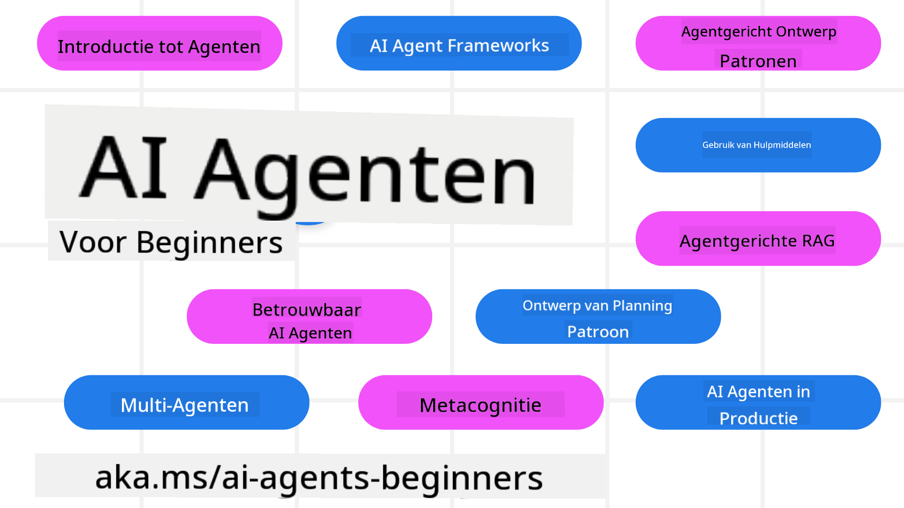

<!--
CO_OP_TRANSLATOR_METADATA:
{
  "original_hash": "6b07046397366e6f6f4524c9ddeba1e1",
  "translation_date": "2025-07-12T14:54:45+00:00",
  "source_file": "README.md",
  "language_code": "nl"
}
-->
# AI Agents voor Beginners - Een Cursus

## 11 Lessen die alles behandelen wat je moet weten om AI Agents te bouwen

  
  
  
  

### 🌐 Meertalige Ondersteuning

#### Ondersteund via GitHub Action (Geautomatiseerd & Altijd Up-to-Date)

[Frans](../fr/README.md) | [Spaans](../es/README.md) | [Duits](../de/README.md) | [Russisch](../ru/README.md) | [Arabisch](../ar/README.md) | [Perzisch (Farsi)](../fa/README.md) | [Urdu](../ur/README.md) | [Chinees (Vereenvoudigd)](../zh/README.md) | [Chinees (Traditioneel, Macau)](../mo/README.md) | [Chinees (Traditioneel, Hong Kong)](../hk/README.md) | [Chinees (Traditioneel, Taiwan)](../tw/README.md) | [Japans](../ja/README.md) | [Koreaans](../ko/README.md) | [Hindi](../hi/README.md) | [Bengaals](../bn/README.md) | [Marathi](../mr/README.md) | [Nepalees](../ne/README.md) | [Punjabi (Gurmukhi)](../pa/README.md) | [Portugees (Portugal)](../pt/README.md) | [Portugees (Brazilië)](../br/README.md) | [Italiaans](../it/README.md) | [Pools](../pl/README.md) | [Turks](../tr/README.md) | [Grieks](../el/README.md) | [Thais](../th/README.md) | [Zweeds](../sv/README.md) | [Deens](../da/README.md) | [Noors](../no/README.md) | [Fins](../fi/README.md) | [Nederlands](./README.md) | [Hebreeuws](../he/README.md) | [Vietnamees](../vi/README.md) | [Indonesisch](../id/README.md) | [Maleis](../ms/README.md) | [Tagalog (Filipijns)](../tl/README.md) | [Swahili](../sw/README.md) | [Hongaars](../hu/README.md) | [Tsjechisch](../cs/README.md) | [Slowaaks](../sk/README.md) | [Roemeens](../ro/README.md) | [Bulgaars](../bg/README.md) | [Servisch (Cyrillisch)](../sr/README.md) | [Kroatisch](../hr/README.md) | [Sloveens](../sl/README.md) | [Oekraïens](../uk/README.md) | [Birmaans (Myanmar)](../my/README.md)

**Als je extra vertalingen wilt, staan de ondersteunde talen [hier](https://github.com/Azure/co-op-translator/blob/main/getting_started/supported-languages.md)**

  
  

## 🌱 Aan de Slag

Deze cursus bevat 11 lessen die de basisprincipes van het bouwen van AI Agents behandelen. Elke les behandelt een eigen onderwerp, dus begin waar je maar wilt!

Er is meertalige ondersteuning voor deze cursus. Bekijk onze [beschikbare talen hier](../..).

Als dit je eerste keer is dat je met Generative AI-modellen werkt, bekijk dan onze [Generative AI For Beginners](https://aka.ms/genai-beginners) cursus, met 21 lessen over bouwen met GenAI.

Vergeet niet om deze repo te [sterren (🌟)](https://docs.github.com/en/get-started/exploring-projects-on-github/saving-repositories-with-stars?WT.mc_id=academic-105485-koreyst) en te [forken](https://github.com/microsoft/ai-agents-for-beginners/fork) om de code uit te voeren.

### Wat je Nodig Hebt

Elke les in deze cursus bevat codevoorbeelden, die je kunt vinden in de map code_samples. Je kunt deze repo [forken](https://github.com/microsoft/ai-agents-for-beginners/fork) om je eigen kopie te maken.

De codevoorbeelden in deze oefeningen maken gebruik van Azure AI Foundry en GitHub Model Catalogs om te communiceren met Language Models:

- [Github Models](https://aka.ms/ai-agents-beginners/github-models) - Gratis / Beperkt  
- [Azure AI Foundry](https://aka.ms/ai-agents-beginners/ai-foundry) - Azure-account vereist

Deze cursus maakt ook gebruik van de volgende AI Agent frameworks en services van Microsoft:

- [Azure AI Agent Service](https://aka.ms/ai-agents-beginners/ai-agent-service)  
- [Semantic Kernel](https://aka.ms/ai-agents-beginners/semantic-kernel)  
- [AutoGen](https://aka.ms/ai-agents/autogen)

Voor meer informatie over het uitvoeren van de code voor deze cursus, ga naar de [Course Setup](./00-course-setup/README.md).

## 🙏 Wil je Helpen?

Heb je suggesties of fouten in spelling of code gevonden? [Meld een issue](https://github.com/microsoft/ai-agents-for-beginners/issues?WT.mc_id=academic-105485-koreyst) of [Maak een pull request](https://github.com/microsoft/ai-agents-for-beginners/pulls?WT.mc_id=academic-105485-koreyst)

Als je vastloopt of vragen hebt over het bouwen van AI Agents, sluit je dan aan bij onze [Azure AI Foundry Community Discord](https://discord.gg/kzRShWzttr)

Heb je productfeedback of fouten tijdens het bouwen? Bezoek ons [Azure AI Foundry Developer Forum](https://aka.ms/azureaifoundry/forum)

## 📂 Elke les bevat

- Een geschreven les in de README en een korte video  
- Python codevoorbeelden die Azure AI Foundry en Github Models (Gratis) ondersteunen  
- Links naar extra bronnen om je leerproces voort te zetten

## 🗃️ Lessen

| **Les**                                  | **Tekst & Code**                                   | **Video**                                                  | **Extra Leren**                                                                        |
|------------------------------------------|----------------------------------------------------|------------------------------------------------------------|----------------------------------------------------------------------------------------|
| Introductie tot AI Agents en Gebruiksscenario's | [Link](./01-intro-to-ai-agents/README.md)          | [Video](https://youtu.be/3zgm60bXmQk?si=z8QygFvYQv-9WtO1)  | [Link](https://aka.ms/ai-agents-beginners/collection?WT.mc_id=academic-105485-koreyst) |
| Verkennen van AI Agentic Frameworks      | [Link](./02-explore-agentic-frameworks/README.md)  | [Video](https://youtu.be/ODwF-EZo_O8?si=Vawth4hzVaHv-u0H)  | [Link](https://aka.ms/ai-agents-beginners/collection?WT.mc_id=academic-105485-koreyst) |
| Begrijpen van AI Agentic Ontwerp Patronen | [Link](./03-agentic-design-patterns/README.md)     | [Video](https://youtu.be/m9lM8qqoOEA?si=BIzHwzstTPL8o9GF)  | [Link](https://aka.ms/ai-agents-beginners/collection?WT.mc_id=academic-105485-koreyst) |
| Tool Use Ontwerp Patroon                  | [Link](./04-tool-use/README.md)                    | [Video](https://youtu.be/vieRiPRx-gI?si=2z6O2Xu2cu_Jz46N)  | [Link](https://aka.ms/ai-agents-beginners/collection?WT.mc_id=academic-105485-koreyst) |
| Agentic RAG                              | [Link](./05-agentic-rag/README.md)                 | [Video](https://youtu.be/WcjAARvdL7I?si=gKPWsQpKiIlDH9A3)  | [Link](https://aka.ms/ai-agents-beginners/collection?WT.mc_id=academic-105485-koreyst) |
| Vertrouwenswaardige AI Agents Bouwen    | [Link](./06-building-trustworthy-agents/README.md) | [Video](https://youtu.be/iZKkMEGBCUQ?si=jZjpiMnGFOE9L8OK ) | [Link](https://aka.ms/ai-agents-beginners/collection?WT.mc_id=academic-105485-koreyst) |
| Planning Ontwerp Patroon                  | [Link](./07-planning-design/README.md)             | [Video](https://youtu.be/kPfJ2BrBCMY?si=6SC_iv_E5-mzucnC)  | [Link](https://aka.ms/ai-agents-beginners/collection?WT.mc_id=academic-105485-koreyst) |
| Multi-Agent Ontwerp Patroon               | [Link](./08-multi-agent/README.md)                 | [Video](https://youtu.be/V6HpE9hZEx0?si=rMgDhEu7wXo2uo6g)  | [Link](https://aka.ms/ai-agents-beginners/collection?WT.mc_id=academic-105485-koreyst) |
| Metacognitie Ontwerp Patroon              | [Link](./09-metacognition/README.md)               | [Video](https://youtu.be/His9R6gw6Ec?si=8gck6vvdSNCt6OcF)  | [Link](https://aka.ms/ai-agents-beginners/collection?WT.mc_id=academic-105485-koreyst) |
| AI Agents in Productie                    | [Link](./10-ai-agents-production/README.md)        | [Video](https://youtu.be/l4TP6IyJxmQ?si=31dnhexRo6yLRJDl)  | [Link](https://aka.ms/ai-agents-beginners/collection?WT.mc_id=academic-105485-koreyst) |
| AI Agents met MCP                         | [Link](./11-mcp/README.md)                         |                                                            | [Link](https://aka.ms/mcp-for-beginners)                                               |

## 🎒 Andere Cursussen

Ons team maakt ook andere cursussen! Bekijk:
- [**NIEUW** Model Context Protocol (MCP) Voor Beginners](https://github.com/microsoft/mcp-for-beginners?WT.mc_id=academic-105485-koreyst)
- [Generatieve AI voor Beginners met .NET](https://github.com/microsoft/Generative-AI-for-beginners-dotnet?WT.mc_id=academic-105485-koreyst)
- [Generatieve AI voor Beginners](https://github.com/microsoft/generative-ai-for-beginners?WT.mc_id=academic-105485-koreyst)
- [ML voor Beginners](https://aka.ms/ml-beginners?WT.mc_id=academic-105485-koreyst)
- [Data Science voor Beginners](https://aka.ms/datascience-beginners?WT.mc_id=academic-105485-koreyst)
- [AI voor Beginners](https://aka.ms/ai-beginners?WT.mc_id=academic-105485-koreyst)
- [Cybersecurity voor Beginners](https://github.com/microsoft/Security-101??WT.mc_id=academic-96948-sayoung)
- [Webontwikkeling voor Beginners](https://aka.ms/webdev-beginners?WT.mc_id=academic-105485-koreyst)
- [IoT voor Beginners](https://aka.ms/iot-beginners?WT.mc_id=academic-105485-koreyst)
- [XR Ontwikkeling voor Beginners](https://github.com/microsoft/xr-development-for-beginners?WT.mc_id=academic-105485-koreyst)
- [GitHub Copilot voor AI Paired Programming Beheersen](https://aka.ms/GitHubCopilotAI?WT.mc_id=academic-105485-koreyst)
- [GitHub Copilot voor C#/.NET Ontwikkelaars Beheersen](https://github.com/microsoft/mastering-github-copilot-for-dotnet-csharp-developers?WT.mc_id=academic-105485-koreyst)
- [Kies Je Eigen Copilot Avontuur](https://github.com/microsoft/CopilotAdventures?WT.mc_id=academic-105485-koreyst)

## 🌟 Dank aan de Community

Dank aan [Shivam Goyal](https://www.linkedin.com/in/shivam2003/) voor het bijdragen van belangrijke codevoorbeelden die Agentic RAG demonstreren.

## Bijdragen

Dit project verwelkomt bijdragen en suggesties. De meeste bijdragen vereisen dat je akkoord gaat met een
Contributor License Agreement (CLA) waarin je verklaart dat je het recht hebt en daadwerkelijk verleent
om ons de rechten te geven om je bijdrage te gebruiken. Voor meer informatie, bezoek
<https://cla.opensource.microsoft.com>.

Wanneer je een pull request indient, zal een CLA-bot automatisch bepalen of je een CLA moet aanleveren
en de PR dienovereenkomstig markeren (bijv. statuscontrole, commentaar). Volg gewoon de instructies
van de bot. Dit hoef je maar één keer te doen voor alle repositories die onze CLA gebruiken.

Dit project heeft de [Microsoft Open Source Code of Conduct](https://opensource.microsoft.com/codeofconduct/) aangenomen.
Voor meer informatie zie de [Code of Conduct FAQ](https://opensource.microsoft.com/codeofconduct/faq/) of
neem contact op met [opencode@microsoft.com](mailto:opencode@microsoft.com) voor aanvullende vragen of opmerkingen.

## Handelsmerken

Dit project kan handelsmerken of logo’s bevatten van projecten, producten of diensten. Het geautoriseerd gebruik van Microsoft
handelsmerken of logo’s is onderhevig aan en moet voldoen aan
[Microsoft's Trademark & Brand Guidelines](https://www.microsoft.com/legal/intellectualproperty/trademarks/usage/general).
Gebruik van Microsoft handelsmerken of logo’s in aangepaste versies van dit project mag geen verwarring veroorzaken of Microsoft-sponsoring suggereren.
Elk gebruik van handelsmerken of logo’s van derden is onderhevig aan het beleid van die derden.

**Disclaimer**:  
Dit document is vertaald met behulp van de AI-vertalingsdienst [Co-op Translator](https://github.com/Azure/co-op-translator). Hoewel we streven naar nauwkeurigheid, dient u er rekening mee te houden dat geautomatiseerde vertalingen fouten of onnauwkeurigheden kunnen bevatten. Het originele document in de oorspronkelijke taal moet als de gezaghebbende bron worden beschouwd. Voor cruciale informatie wordt professionele menselijke vertaling aanbevolen. Wij zijn niet aansprakelijk voor eventuele misverstanden of verkeerde interpretaties die voortvloeien uit het gebruik van deze vertaling.