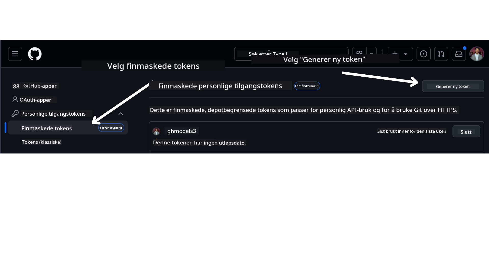

<!--
CO_OP_TRANSLATOR_METADATA:
{
  "original_hash": "76945069b52a49cd0432ae3e0b0ba22e",
  "translation_date": "2025-07-12T07:52:13+00:00",
  "source_file": "00-course-setup/README.md",
  "language_code": "no"
}
-->
i din GitHub-konto.

Velg alternativet `Fine-grained tokens` på venstre side av skjermen.

Deretter velger du `Generate new token`.



Du vil bli bedt om å skrive inn et navn for tokenet ditt, velge utløpsdato (Anbefalt: 30 dager), og velge omfangene for tokenet ditt (Offentlige repositorier).

Det er også nødvendig å redigere tillatelsene for dette tokenet: Permissions -> Models -> Tillater tilgang til GitHub Models

Kopier det nye tokenet du nettopp har opprettet. Du skal nå legge dette til i `.env`-filen som følger med i dette kurset.


### Trinn 2: Opprett din `.env`-fil

For å opprette `.env`-filen, kjør følgende kommando i terminalen din.

```bash
cp .env.example .env
```

Dette vil kopiere eksempel-filen og opprette en `.env` i katalogen din, hvor du fyller inn verdiene for miljøvariablene.

Med tokenet kopiert, åpne `.env`-filen i din favoritt teksteditor og lim inn tokenet i feltet `GITHUB_TOKEN`.

Du skal nå kunne kjøre kodeeksemplene i dette kurset.

## Oppsett for eksempler som bruker Azure AI Foundry og Azure AI Agent Service

### Trinn 1: Hent endepunktet for Azure-prosjektet ditt

Følg stegene for å opprette et hub og prosjekt i Azure AI Foundry som beskrevet her: [Hub resources overview](https://learn.microsoft.com/en-us/azure/ai-foundry/concepts/ai-resources)

Når du har opprettet prosjektet, må du hente tilkoblingsstrengen for prosjektet.

Dette gjør du ved å gå til **Oversikt**-siden for prosjektet i Azure AI Foundry-portalen.


### Trinn 2: Opprett din `.env`-fil

For å opprette `.env`-filen, kjør følgende kommando i terminalen din.

```bash
cp .env.example .env
```

Dette vil kopiere eksempel-filen og opprette en `.env` i katalogen din, hvor du fyller inn verdiene for miljøvariablene.

Med tokenet kopiert, åpne `.env`-filen i din favoritt teksteditor og lim inn tokenet i feltet `PROJECT_ENDPOINT`.

### Trinn 3: Logg inn på Azure

Som en sikkerhetspraksis bruker vi [keyless authentication](https://learn.microsoft.com/azure/developer/ai/keyless-connections?tabs=csharp%2Cazure-cli?WT.mc_id=academic-105485-koreyst) for å autentisere til Azure OpenAI med Microsoft Entra ID. Før du kan gjøre dette, må du først installere **Azure CLI** i henhold til [installasjonsinstruksjonene](https://learn.microsoft.com/cli/azure/install-azure-cli?WT.mc_id=academic-105485-koreyst) for ditt operativsystem.

Deretter åpner du en terminal og kjører `az login --use-device-code` for å logge inn på Azure-kontoen din.

Når du er logget inn, velger du abonnementet ditt i terminalen.


## Ytterligere miljøvariabler - Azure Search og Azure OpenAI

For Agentic RAG-leksjonen - Leksjon 5 - finnes det eksempler som bruker Azure Search og Azure OpenAI.

Hvis du ønsker å kjøre disse eksemplene, må du legge til følgende miljøvariabler i `.env`-filen din:

### Oversiktsside (Prosjekt)

- `AZURE_SUBSCRIPTION_ID` - Sjekk **Prosjektdetaljer** på **Oversikt**-siden for prosjektet ditt.

- `AZURE_AI_PROJECT_NAME` - Se øverst på **Oversikt**-siden for prosjektet ditt.

- `AZURE_OPENAI_SERVICE` - Finn dette under fanen **Included capabilities** for **Azure OpenAI Service** på **Oversikt**-siden.

### Management Center

- `AZURE_OPENAI_RESOURCE_GROUP` - Gå til **Prosjektegenskaper** på **Oversikt**-siden i **Management Center**.

- `GLOBAL_LLM_SERVICE` - Under **Connected resources**, finn tilkoblingsnavnet for **Azure AI Services**. Hvis det ikke er oppført, sjekk i **Azure-portalen** under ressursgruppen din for navnet på AI Services-ressursen.

### Models + Endpoints-side

- `AZURE_OPENAI_EMBEDDING_DEPLOYMENT_NAME` - Velg embedding-modellen din (f.eks. `text-embedding-ada-002`) og noter **Deployment name** fra modellens detaljer.

- `AZURE_OPENAI_CHAT_DEPLOYMENT_NAME` - Velg chat-modellen din (f.eks. `gpt-4o-mini`) og noter **Deployment name** fra modellens detaljer.

### Azure-portalen

- `AZURE_OPENAI_ENDPOINT` - Finn **Azure AI services**, klikk på den, gå til **Resource Management**, **Keys and Endpoint**, scroll ned til "Azure OpenAI endpoints", og kopier den som heter "Language APIs".

- `AZURE_OPENAI_API_KEY` - Fra samme skjerm, kopier NØKKEL 1 eller NØKKEL 2.

- `AZURE_SEARCH_SERVICE_ENDPOINT` - Finn din **Azure AI Search**-ressurs, klikk på den, og se **Oversikt**.

- `AZURE_SEARCH_API_KEY` - Gå deretter til **Innstillinger** og så **Nøkler** for å kopiere primær- eller sekundær administrasjonsnøkkel.

### Ekstern nettside

- `AZURE_OPENAI_API_VERSION` - Besøk siden for [API-versjons livssyklus](https://learn.microsoft.com/en-us/azure/ai-services/openai/api-version-deprecation#latest-ga-api-release) under **Latest GA API release**.

### Sett opp keyless autentisering

I stedet for å hardkode legitimasjonen din, bruker vi en keyless-tilkobling med Azure OpenAI. For å gjøre dette importerer vi `DefaultAzureCredential` og kaller senere funksjonen `DefaultAzureCredential` for å hente legitimasjonen.

```python
from azure.identity import DefaultAzureCredential, InteractiveBrowserCredential
```

## Stuck Somewhere?

Hvis du har problemer med å kjøre dette oppsettet, bli med i vår

**Ansvarsfraskrivelse**:  
Dette dokumentet er oversatt ved hjelp av AI-oversettelsestjenesten [Co-op Translator](https://github.com/Azure/co-op-translator). Selv om vi streber etter nøyaktighet, vennligst vær oppmerksom på at automatiske oversettelser kan inneholde feil eller unøyaktigheter. Det opprinnelige dokumentet på originalspråket skal anses som den autoritative kilden. For kritisk informasjon anbefales profesjonell menneskelig oversettelse. Vi er ikke ansvarlige for eventuelle misforståelser eller feiltolkninger som oppstår ved bruk av denne oversettelsen.