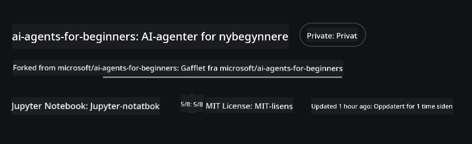
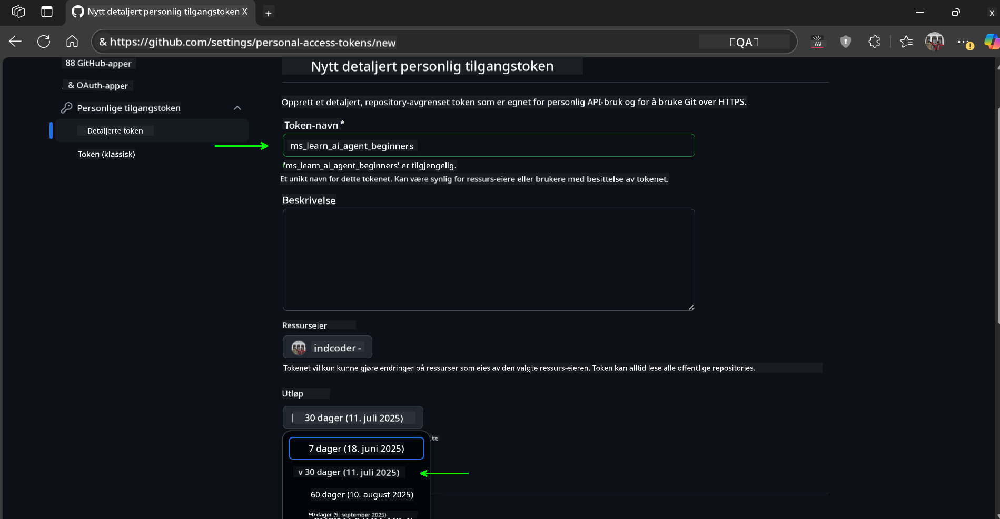
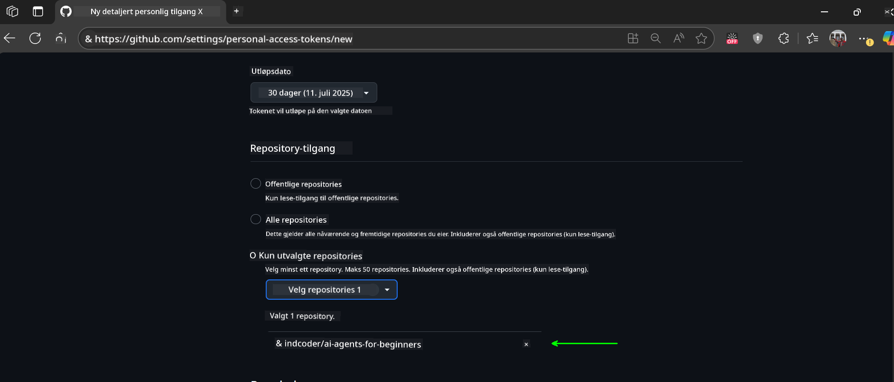
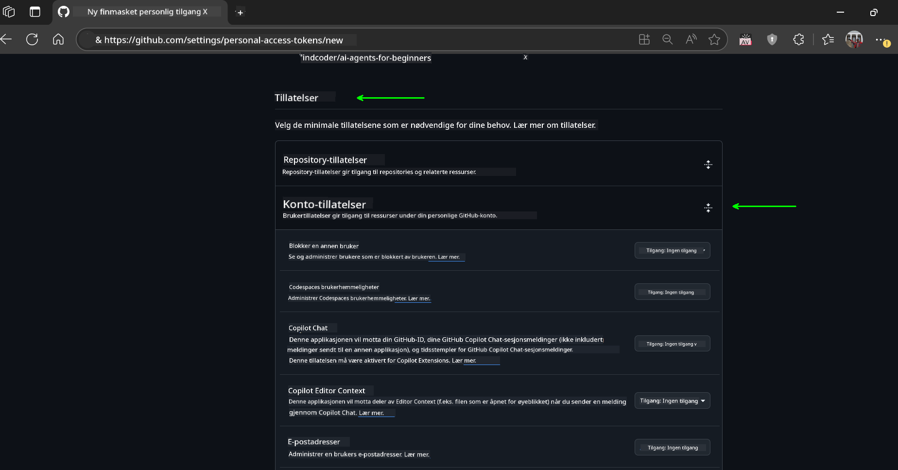
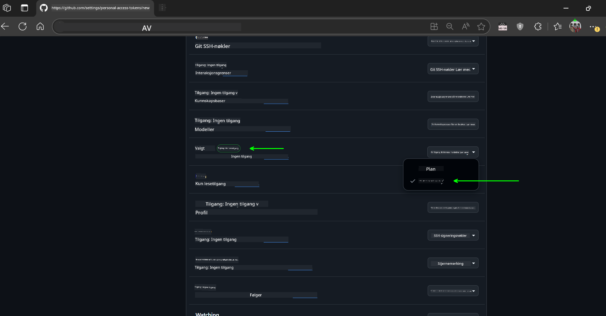
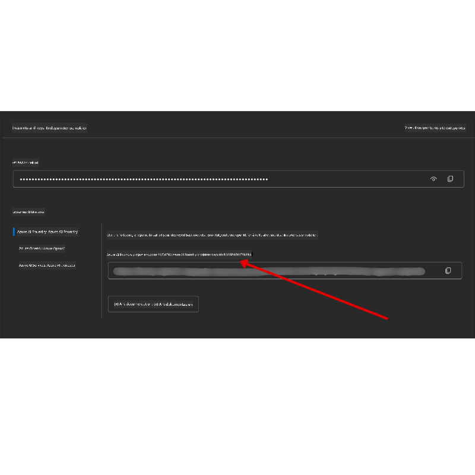

<!--
CO_OP_TRANSLATOR_METADATA:
{
  "original_hash": "c6a79c8f2b56a80370ff7e447765524f",
  "translation_date": "2025-07-23T08:51:35+00:00",
  "source_file": "00-course-setup/README.md",
  "language_code": "no"
}
-->
# Kursoppsett

## Introduksjon

Denne leksjonen dekker hvordan du kan kjøre kodeeksemplene i dette kurset.

## Klon eller fork dette repoet

For å komme i gang, vennligst klon eller fork GitHub-repositoriet. Dette vil gi deg din egen versjon av kursmaterialet slik at du kan kjøre, teste og tilpasse koden!

Dette kan gjøres ved å klikke på lenken til

Du bør nå ha din egen forket versjon av dette kurset på følgende lenke:



## Kjøre koden

Dette kurset tilbyr en serie Jupyter Notebooks som du kan kjøre for å få praktisk erfaring med å bygge AI-agenter.

Kodeeksemplene bruker enten:

**Krever GitHub-konto - Gratis**:

1) Semantic Kernel Agent Framework + GitHub Models Marketplace. Merket som (semantic-kernel.ipynb)  
2) AutoGen Framework + GitHub Models Marketplace. Merket som (autogen.ipynb)  

**Krever Azure-abonnement**:  
3) Azure AI Foundry + Azure AI Agent Service. Merket som (azureaiagent.ipynb)  

Vi oppfordrer deg til å prøve alle tre typene eksempler for å se hvilken som fungerer best for deg.

Uansett hvilket alternativ du velger, vil det avgjøre hvilke oppsettssteg du må følge nedenfor:

## Krav

- Python 3.12+  
  - **NOTE**: Hvis du ikke har Python 3.12 installert, sørg for å installere det. Opprett deretter ditt virtuelle miljø (venv) ved å bruke python3.12 for å sikre at riktige versjoner installeres fra requirements.txt-filen.  
- En GitHub-konto - For tilgang til GitHub Models Marketplace  
- Azure-abonnement - For tilgang til Azure AI Foundry  
- Azure AI Foundry-konto - For tilgang til Azure AI Agent Service  

Vi har inkludert en `requirements.txt`-fil i roten av dette repoet som inneholder alle nødvendige Python-pakker for å kjøre kodeeksemplene.

Du kan installere dem ved å kjøre følgende kommando i terminalen i rotmappen til repoet:

```bash
pip install -r requirements.txt
```  
Vi anbefaler å opprette et virtuelt Python-miljø for å unngå konflikter og problemer.

## Oppsett av VSCode

Sørg for at du bruker riktig versjon av Python i VSCode.


## Oppsett for eksempler som bruker GitHub-modeller

### Steg 1: Hent din GitHub Personal Access Token (PAT)

Dette kurset bruker GitHub Models Marketplace, som gir gratis tilgang til Large Language Models (LLMs) som du vil bruke til å bygge AI-agenter.

For å bruke GitHub-modellene må du opprette en [GitHub Personal Access Token](https://docs.github.com/en/authentication/keeping-your-account-and-data-secure/managing-your-personal-access-tokens).

Dette kan gjøres ved å gå til din GitHub-konto.

Vennligst følg [Prinsippet om minst privilegium](https://docs.github.com/en/get-started/learning-to-code/storing-your-secrets-safely) når du oppretter tokenet ditt. Dette betyr at du kun skal gi tokenet de tillatelsene det trenger for å kjøre kodeeksemplene i dette kurset.

1. Velg alternativet `Fine-grained tokens` på venstre side av skjermen.

    Deretter velger du `Generate new token`.

    

1. Skriv inn et beskrivende navn for tokenet ditt som reflekterer formålet, slik at det er lett å identifisere senere. Sett en utløpsdato (anbefalt: 30 dager; du kan velge en kortere periode som 7 dager hvis du foretrekker en mer sikker tilnærming).

    

1. Begrens tokenets omfang til din fork av dette repoet.

    

1. Begrens tokenets tillatelser: Under **Permissions**, slå på **Account Permissions**, naviger til **Models** og aktiver kun leseadgangen som kreves for GitHub-modeller.

    

    

Kopier det nye tokenet du nettopp har opprettet. Du vil nå legge dette til `.env`-filen som er inkludert i dette kurset.

### Steg 2: Opprett din `.env`-fil

For å opprette `.env`-filen, kjør følgende kommando i terminalen.

```bash
cp .env.example .env
```

Dette vil kopiere eksempel-filen og opprette en `.env` i katalogen din, hvor du fyller inn verdiene for miljøvariablene.

Med tokenet ditt kopiert, åpne `.env`-filen i din favoritt teksteditor og lim inn tokenet i `GITHUB_TOKEN`-feltet.

Du skal nå kunne kjøre kodeeksemplene i dette kurset.

## Oppsett for eksempler som bruker Azure AI Foundry og Azure AI Agent Service

### Steg 1: Hent din Azure-prosjekt-endepunkt

Følg stegene for å opprette en hub og et prosjekt i Azure AI Foundry som beskrevet her: [Hub resources overview](https://learn.microsoft.com/en-us/azure/ai-foundry/concepts/ai-resources)

Når du har opprettet prosjektet ditt, må du hente tilkoblingsstrengen for prosjektet ditt.

Dette kan gjøres ved å gå til **Oversikt**-siden for prosjektet ditt i Azure AI Foundry-portalen.



### Steg 2: Opprett din `.env`-fil

For å opprette `.env`-filen, kjør følgende kommando i terminalen.

```bash
cp .env.example .env
```

Dette vil kopiere eksempel-filen og opprette en `.env` i katalogen din, hvor du fyller inn verdiene for miljøvariablene.

Med tokenet ditt kopiert, åpne `.env`-filen i din favoritt teksteditor og lim inn tokenet i `PROJECT_ENDPOINT`-feltet.

### Steg 3: Logg inn på Azure

Som en sikkerhetsbestepraksis vil vi bruke [nøkkelfri autentisering](https://learn.microsoft.com/azure/developer/ai/keyless-connections?tabs=csharp%2Cazure-cli?WT.mc_id=academic-105485-koreyst) for å autentisere til Azure OpenAI med Microsoft Entra ID.

Åpne deretter en terminal og kjør `az login --use-device-code` for å logge inn på Azure-kontoen din.

Når du har logget inn, velg abonnementet ditt i terminalen.

## Ytterligere miljøvariabler - Azure Search og Azure OpenAI

For Agentic RAG-leksjonen - Leksjon 5 - finnes det eksempler som bruker Azure Search og Azure OpenAI.

Hvis du vil kjøre disse eksemplene, må du legge til følgende miljøvariabler i `.env`-filen din:

### Oversiktsside (Prosjekt)

- `AZURE_SUBSCRIPTION_ID` - Sjekk **Prosjektdetaljer** på **Oversikt**-siden for prosjektet ditt.

- `AZURE_AI_PROJECT_NAME` - Se øverst på **Oversikt**-siden for prosjektet ditt.

- `AZURE_OPENAI_SERVICE` - Finn dette i **Inkluderte kapabiliteter**-fanen for **Azure OpenAI Service** på **Oversikt**-siden.

### Administrasjonssenter

- `AZURE_OPENAI_RESOURCE_GROUP` - Gå til **Prosjektegenskaper** på **Oversikt**-siden i **Administrasjonssenteret**.

- `GLOBAL_LLM_SERVICE` - Under **Tilkoblede ressurser**, finn **Azure AI Services**-tilkoblingsnavnet. Hvis det ikke er oppført, sjekk **Azure-portalen** under ressursgruppen din for AI Services-ressursnavnet.

### Modeller + Endepunkter-side

- `AZURE_OPENAI_EMBEDDING_DEPLOYMENT_NAME` - Velg din embedding-modell (f.eks. `text-embedding-ada-002`) og noter **Deploymentsnavnet** fra modelldetaljene.

- `AZURE_OPENAI_CHAT_DEPLOYMENT_NAME` - Velg din chat-modell (f.eks. `gpt-4o-mini`) og noter **Deploymentsnavnet** fra modelldetaljene.

### Azure Portal

- `AZURE_OPENAI_ENDPOINT` - Se etter **Azure AI-tjenester**, klikk på det, gå deretter til **Ressursadministrasjon**, **Nøkler og Endepunkt**, bla ned til "Azure OpenAI-endepunkter", og kopier det som sier "Språk-APIer".

- `AZURE_OPENAI_API_KEY` - Fra samme skjerm, kopier NØKKEL 1 eller NØKKEL 2.

- `AZURE_SEARCH_SERVICE_ENDPOINT` - Finn din **Azure AI Search**-ressurs, klikk på den, og se **Oversikt**.

- `AZURE_SEARCH_API_KEY` - Gå deretter til **Innstillinger** og deretter **Nøkler** for å kopiere primær- eller sekundærnøkkelen.

### Ekstern nettside

- `AZURE_OPENAI_API_VERSION` - Besøk siden [API-versjonslivssyklus](https://learn.microsoft.com/en-us/azure/ai-services/openai/api-version-deprecation#latest-ga-api-release) under **Siste GA API-utgivelse**.

### Oppsett av nøkkelfri autentisering

I stedet for å hardkode legitimasjonen din, vil vi bruke en nøkkelfri tilkobling med Azure OpenAI. For å gjøre dette, vil vi importere `DefaultAzureCredential` og senere kalle `DefaultAzureCredential`-funksjonen for å hente legitimasjonen.

```python
from azure.identity import DefaultAzureCredential, InteractiveBrowserCredential
```

## Sitter du fast?

Hvis du har problemer med å kjøre dette oppsettet, hopp inn i vår

## Neste leksjon

Du er nå klar til å kjøre koden for dette kurset. Lykke til med å lære mer om AI-agenter!  

[Introduksjon til AI-agenter og agentbrukstilfeller](../01-intro-to-ai-agents/README.md)

**Ansvarsfraskrivelse**:  
Dette dokumentet er oversatt ved hjelp av AI-oversettelsestjenesten [Co-op Translator](https://github.com/Azure/co-op-translator). Selv om vi streber etter nøyaktighet, vær oppmerksom på at automatiserte oversettelser kan inneholde feil eller unøyaktigheter. Det originale dokumentet på sitt opprinnelige språk bør anses som den autoritative kilden. For kritisk informasjon anbefales profesjonell menneskelig oversettelse. Vi er ikke ansvarlige for misforståelser eller feiltolkninger som oppstår ved bruk av denne oversettelsen.