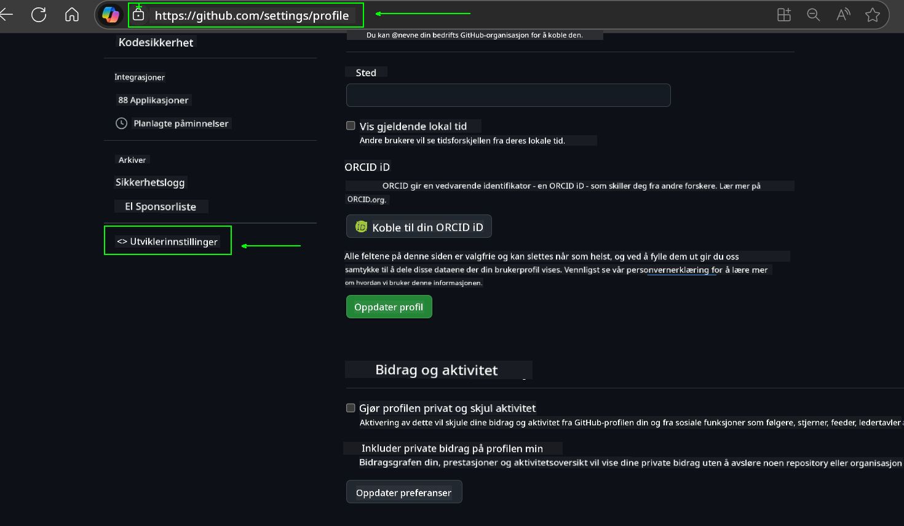
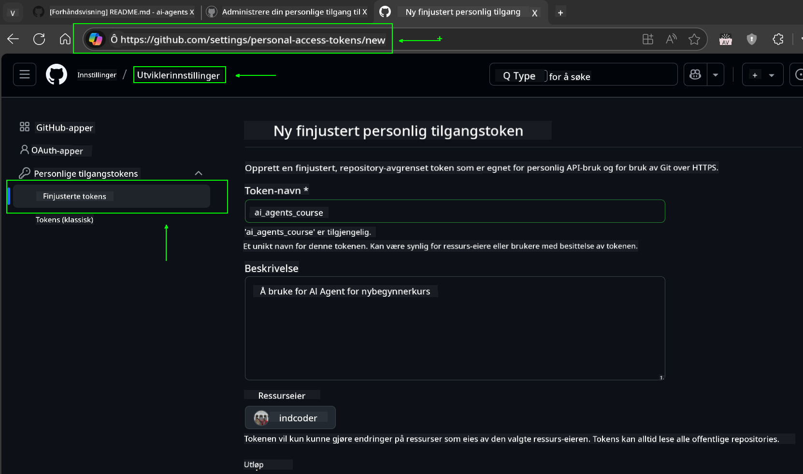
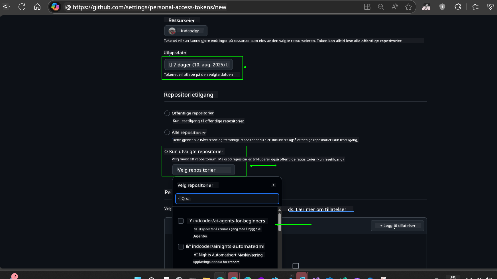
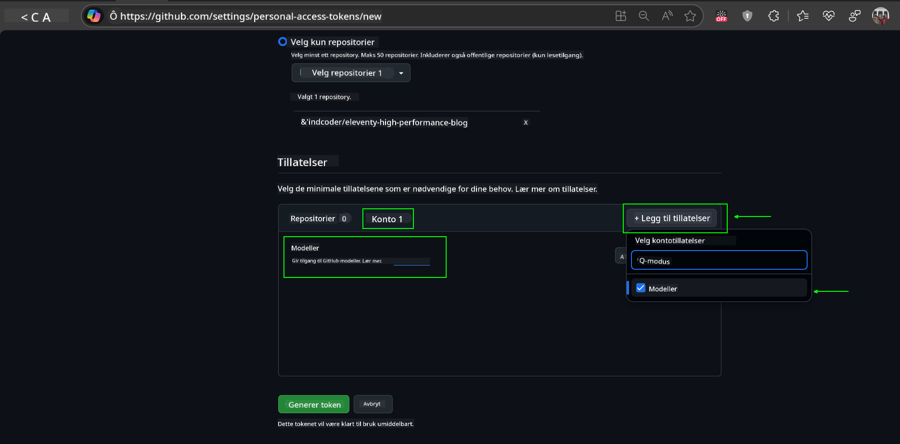
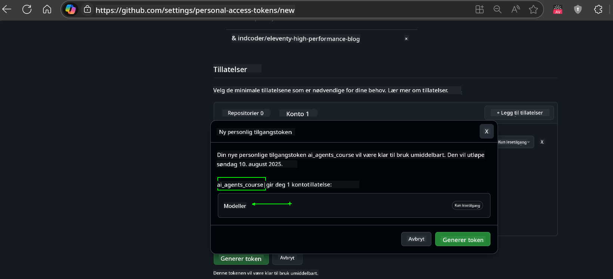
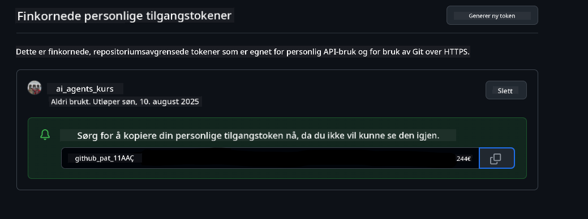
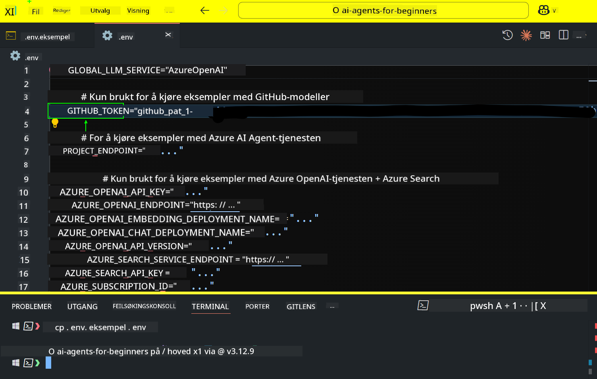

<!--
CO_OP_TRANSLATOR_METADATA:
{
  "original_hash": "c55b973b1562abf5aadf6a4028265ac5",
  "translation_date": "2025-08-29T15:51:59+00:00",
  "source_file": "00-course-setup/README.md",
  "language_code": "no"
}
-->
# Kursoppsett

## Introduksjon

Denne leksjonen dekker hvordan du kan kjøre kodeeksemplene i dette kurset.

## Bli med andre elever og få hjelp

Før du begynner å klone ditt repo, bli med i [AI Agents For Beginners Discord-kanalen](https://aka.ms/ai-agents/discord) for å få hjelp med oppsett, stille spørsmål om kurset, eller for å koble deg med andre elever.

## Klon eller fork dette repoet

For å komme i gang, klon eller fork GitHub-repositoriet. Dette vil lage din egen versjon av kursmaterialet slik at du kan kjøre, teste og justere koden!

Dette kan gjøres ved å klikke på lenken til 

Du bør nå ha din egen forkede versjon av dette kurset på følgende lenke:


## Kjøre koden

Dette kurset tilbyr en serie Jupyter Notebooks som du kan kjøre for å få praktisk erfaring med å bygge AI-agenter.

Kodeeksemplene bruker enten:

**Krever GitHub-konto - Gratis**:

1) Semantic Kernel Agent Framework + GitHub Models Marketplace. Merket som (semantic-kernel.ipynb)
2) AutoGen Framework + GitHub Models Marketplace. Merket som (autogen.ipynb)

**Krever Azure-abonnement**:
3) Azure AI Foundry + Azure AI Agent Service. Merket som (azureaiagent.ipynb)

Vi oppfordrer deg til å prøve alle tre typer eksempler for å se hvilken som fungerer best for deg.

Uansett hvilket alternativ du velger, vil det avgjøre hvilke oppsettssteg du må følge nedenfor:

## Krav

- Python 3.12+
  - **NOTE**: Hvis du ikke har Python 3.12 installert, sørg for å installere det. Deretter opprett din venv ved å bruke python3.12 for å sikre at riktige versjoner installeres fra requirements.txt-filen.
- En GitHub-konto - For tilgang til GitHub Models Marketplace
- Azure-abonnement - For tilgang til Azure AI Foundry
- Azure AI Foundry-konto - For tilgang til Azure AI Agent Service

Vi har inkludert en `requirements.txt`-fil i roten av dette repositoriet som inneholder alle nødvendige Python-pakker for å kjøre kodeeksemplene.

Du kan installere dem ved å kjøre følgende kommando i terminalen i roten av repositoriet:

```bash
pip install -r requirements.txt
```
Vi anbefaler å opprette et Python-virtuelt miljø for å unngå konflikter og problemer.

## Oppsett av VSCode
Sørg for at du bruker riktig versjon av Python i VSCode.


## Oppsett for eksempler som bruker GitHub-modeller 

### Steg 1: Hent din GitHub Personal Access Token (PAT)

Dette kurset bruker GitHub Models Marketplace, som gir gratis tilgang til Large Language Models (LLMs) som du vil bruke til å bygge AI-agenter.

For å bruke GitHub-modellene må du opprette en [GitHub Personal Access Token](https://docs.github.com/en/authentication/keeping-your-account-and-data-secure/managing-your-personal-access-tokens).

Dette kan gjøres ved å gå til din 

GitHub-konto.

Vennligst følg [Prinsippet om minst privilegium](https://docs.github.com/en/get-started/learning-to-code/storing-your-secrets-safely) når du oppretter tokenet. Dette betyr at du kun bør gi tokenet de tillatelsene det trenger for å kjøre kodeeksemplene i dette kurset.

1. Velg alternativet `Fine-grained tokens` på venstre side av skjermen ved å navigere til **Developer settings**
   

    Deretter velg `Generate new token`.

    

2. Skriv inn et beskrivende navn for tokenet som reflekterer dets formål, slik at det er lett å identifisere senere.


    🔐 Anbefaling for token-varighet

    Anbefalt varighet: 30 dager
    For en mer sikker tilnærming kan du velge en kortere periode—som 7 dager 🛡️
    Det er en flott måte å sette et personlig mål og fullføre kurset mens læringsmomentet ditt er høyt 🚀.

    

3. Begrens tokenets omfang til din fork av dette repositoriet.

    

4. Begrens tokenets tillatelser: Under **Permissions**, klikk på **Account**-fanen, og klikk på "+ Add permissions"-knappen. En rullegardinmeny vil vises. Søk etter **Models** og kryss av for det.
    

5. Verifiser de nødvendige tillatelsene før du genererer tokenet. 

6. Før du genererer tokenet, sørg for at du er klar til å lagre tokenet på et sikkert sted som en passordhåndteringshvelv, da det ikke vil bli vist igjen etter at du har opprettet det. 

Kopier ditt nye token som du nettopp har opprettet. Du vil nå legge dette til din `.env`-fil inkludert i dette kurset.


### Steg 2: Opprett din `.env`-fil

For å opprette din `.env`-fil, kjør følgende kommando i terminalen.

```bash
cp .env.example .env
```

Dette vil kopiere eksempel-filen og opprette en `.env` i din katalog hvor du fyller inn verdiene for miljøvariablene.

Med ditt token kopiert, åpne `.env`-filen i din favoritt tekstredigerer og lim inn tokenet i `GITHUB_TOKEN`-feltet.



Du bør nå kunne kjøre kodeeksemplene i dette kurset.

## Oppsett for eksempler som bruker Azure AI Foundry og Azure AI Agent Service

### Steg 1: Hent din Azure-prosjektendepunkt


Følg stegene for å opprette en hub og prosjekt i Azure AI Foundry som finnes her: [Hub resources overview](https://learn.microsoft.com/en-us/azure/ai-foundry/concepts/ai-resources)


Når du har opprettet ditt prosjekt, må du hente tilkoblingsstrengen for prosjektet ditt.

Dette kan gjøres ved å gå til **Oversikt**-siden for prosjektet ditt i Azure AI Foundry-portalen.


### Steg 2: Opprett din `.env`-fil

For å opprette din `.env`-fil, kjør følgende kommando i terminalen.

```bash
cp .env.example .env
```

Dette vil kopiere eksempel-filen og opprette en `.env` i din katalog hvor du fyller inn verdiene for miljøvariablene.

Med ditt token kopiert, åpne `.env`-filen i din favoritt tekstredigerer og lim inn tokenet i `PROJECT_ENDPOINT`-feltet.

### Steg 3: Logg inn på Azure

Som en sikkerhetsbest praksis, vil vi bruke [nøkkelfri autentisering](https://learn.microsoft.com/azure/developer/ai/keyless-connections?tabs=csharp%2Cazure-cli?WT.mc_id=academic-105485-koreyst) for å autentisere til Azure OpenAI med Microsoft Entra ID. 

Deretter åpne en terminal og kjør `az login --use-device-code` for å logge inn på din Azure-konto.

Når du har logget inn, velg ditt abonnement i terminalen.


## Ekstra miljøvariabler - Azure Search og Azure OpenAI 

For Agentic RAG-leksjonen - Leksjon 5 - finnes det eksempler som bruker Azure Search og Azure OpenAI.

Hvis du vil kjøre disse eksemplene, må du legge til følgende miljøvariabler i din `.env`-fil:

### Oversiktsside (Prosjekt)

- `AZURE_SUBSCRIPTION_ID` - Sjekk **Prosjektdetaljer** på **Oversikt**-siden for prosjektet ditt.

- `AZURE_AI_PROJECT_NAME` - Se øverst på **Oversikt**-siden for prosjektet ditt.

- `AZURE_OPENAI_SERVICE` - Finn dette i **Inkluderte kapabiliteter**-fanen for **Azure OpenAI Service** på **Oversikt**-siden.

### Administrasjonssenter

- `AZURE_OPENAI_RESOURCE_GROUP` - Gå til **Prosjektegenskaper** på **Oversikt**-siden for **Administrasjonssenteret**.

- `GLOBAL_LLM_SERVICE` - Under **Tilkoblede ressurser**, finn **Azure AI Services**-tilkoblingsnavnet. Hvis det ikke er oppført, sjekk **Azure-portalen** under din ressursgruppe for AI Services-ressursnavnet.

### Modeller + Endepunktside

- `AZURE_OPENAI_EMBEDDING_DEPLOYMENT_NAME` - Velg din embedding-modell (f.eks. `text-embedding-ada-002`) og noter **Deploymentsnavnet** fra modellens detaljer.

- `AZURE_OPENAI_CHAT_DEPLOYMENT_NAME` - Velg din chat-modell (f.eks. `gpt-4o-mini`) og noter **Deploymentsnavnet** fra modellens detaljer.

### Azure Portal

- `AZURE_OPENAI_ENDPOINT` - Se etter **Azure AI Services**, klikk på det, gå deretter til **Ressursadministrasjon**, **Nøkler og endepunkt**, scroll ned til "Azure OpenAI-endepunkter", og kopier den som sier "Språk-APIer".

- `AZURE_OPENAI_API_KEY` - Fra samme skjerm, kopier NØKKEL 1 eller NØKKEL 2.

- `AZURE_SEARCH_SERVICE_ENDPOINT` - Finn din **Azure AI Search**-ressurs, klikk på den, og se **Oversikt**.

- `AZURE_SEARCH_API_KEY` - Gå deretter til **Innstillinger** og deretter **Nøkler** for å kopiere den primære eller sekundære administrasjonsnøkkelen.

### Ekstern nettside

- `AZURE_OPENAI_API_VERSION` - Besøk siden [API-versjonslivssyklus](https://learn.microsoft.com/en-us/azure/ai-services/openai/api-version-deprecation#latest-ga-api-release) under **Siste GA API-utgivelse**.

### Oppsett av nøkkelfri autentisering

I stedet for å hardkode dine legitimasjoner, vil vi bruke en nøkkelfri tilkobling med Azure OpenAI. For å gjøre dette, vil vi importere `DefaultAzureCredential` og senere kalle funksjonen `DefaultAzureCredential` for å hente legitimasjonen.

```python
from azure.identity import DefaultAzureCredential, InteractiveBrowserCredential
```

## Sitter fast et sted?

Hvis du har problemer med å kjøre dette oppsettet, hopp inn i vår 

eller 

## Neste leksjon

Du er nå klar til å kjøre koden for dette kurset. Lykke til med å lære mer om verden av AI-agenter! 

[Introduksjon til AI-agenter og agentbrukstilfeller](../01-intro-to-ai-agents/README.md)

---

**Ansvarsfraskrivelse**:  
Dette dokumentet er oversatt ved hjelp av AI-oversettelsestjenesten [Co-op Translator](https://github.com/Azure/co-op-translator). Selv om vi streber etter nøyaktighet, vær oppmerksom på at automatiske oversettelser kan inneholde feil eller unøyaktigheter. Det originale dokumentet på sitt opprinnelige språk bør anses som den autoritative kilden. For kritisk informasjon anbefales profesjonell menneskelig oversettelse. Vi er ikke ansvarlige for misforståelser eller feiltolkninger som oppstår ved bruk av denne oversettelsen.