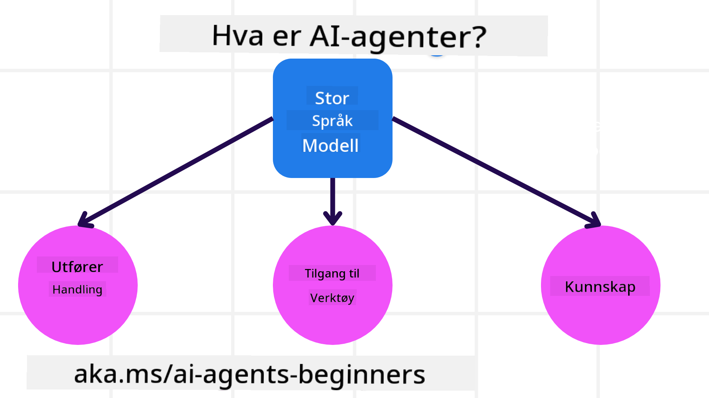
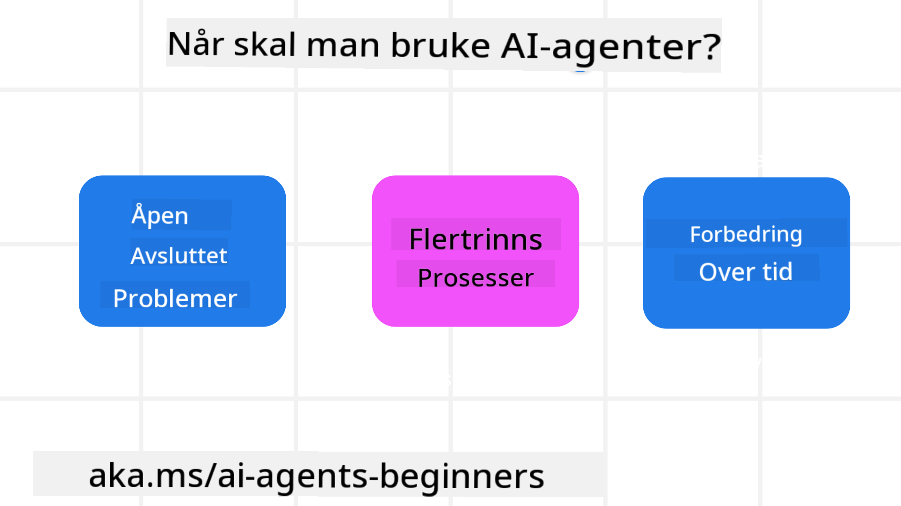

<!--
CO_OP_TRANSLATOR_METADATA:
{
  "original_hash": "d84943abc8f001ad4670418d32c2d899",
  "translation_date": "2025-07-12T08:08:15+00:00",
  "source_file": "01-intro-to-ai-agents/README.md",
  "language_code": "no"
}
-->
for å møte andre elever og AI Agent-byggere og stille spørsmål du har om dette kurset.

For å starte dette kurset begynner vi med å få en bedre forståelse av hva AI-agenter er og hvordan vi kan bruke dem i applikasjonene og arbeidsflytene vi bygger.

## Introduksjon

Denne leksjonen dekker:

- Hva er AI-agenter og hvilke forskjellige typer agenter finnes?
- Hvilke bruksområder passer best for AI-agenter, og hvordan kan de hjelpe oss?
- Hva er noen av de grunnleggende byggesteinene når man designer agentbaserte løsninger?

## Læringsmål
Etter å ha fullført denne leksjonen skal du kunne:

- Forstå AI-agentkonsepter og hvordan de skiller seg fra andre AI-løsninger.
- Bruke AI-agenter på en mest mulig effektiv måte.
- Designe agentbaserte løsninger produktivt for både brukere og kunder.

## Definere AI-agenter og typer AI-agenter

### Hva er AI-agenter?

AI-agenter er **systemer** som gjør det mulig for **store språkmodeller (LLMs)** å **utføre handlinger** ved å utvide deres evner ved å gi LLMs **tilgang til verktøy** og **kunnskap**.

La oss dele opp denne definisjonen i mindre deler:

- **System** – Det er viktig å tenke på agenter ikke bare som en enkelt komponent, men som et system av mange komponenter. På det grunnleggende nivået består komponentene i en AI-agent av:
  - **Miljø** – Det definerte området hvor AI-agenten opererer. For eksempel, hvis vi hadde en reisebestillingsagent, kunne miljøet være reisebestillingssystemet som AI-agenten bruker for å fullføre oppgaver.
  - **Sensorer** – Miljøer har informasjon og gir tilbakemeldinger. AI-agenter bruker sensorer for å samle inn og tolke denne informasjonen om miljøets nåværende tilstand. I eksempelet med reisebestillingsagenten kan systemet gi informasjon som hotelltilgjengelighet eller flypriser.
  - **Aktuatorer** – Når AI-agenten mottar miljøets nåværende tilstand, bestemmer agenten for den aktuelle oppgaven hvilken handling som skal utføres for å endre miljøet. For reisebestillingsagenten kan det være å bestille et tilgjengelig rom for brukeren.

**Store språkmodeller** – Konseptet med agenter eksisterte før LLMs ble utviklet. Fordelen med å bygge AI-agenter med LLMs er deres evne til å tolke menneskelig språk og data. Denne evnen gjør det mulig for LLMs å tolke miljøinformasjon og definere en plan for å endre miljøet.

**Utføre handlinger** – Utenfor AI-agent-systemer er LLMs begrenset til situasjoner der handlingen er å generere innhold eller informasjon basert på brukerens prompt. Innenfor AI-agent-systemer kan LLMs utføre oppgaver ved å tolke brukerens forespørsel og bruke verktøy som er tilgjengelige i deres miljø.

**Tilgang til verktøy** – Hvilke verktøy LLM har tilgang til, bestemmes av 1) miljøet det opererer i, og 2) utvikleren av AI-agenten. I vårt eksempel med reiseagenten er agentens verktøy begrenset av operasjonene som er tilgjengelige i bestillingssystemet, og/eller utvikleren kan begrense agentens tilgang til verktøy for flyreiser.

**Minne + Kunnskap** – Minne kan være korttidsminne i konteksten av samtalen mellom bruker og agent. På lang sikt, utenfor informasjonen som miljøet gir, kan AI-agenter også hente kunnskap fra andre systemer, tjenester, verktøy og til og med andre agenter. I reiseagent-eksempelet kan denne kunnskapen være informasjon om brukerens reisepreferanser som ligger i en kundedatabase.

### De forskjellige typene agenter

Nå som vi har en generell definisjon av AI-agenter, la oss se på noen spesifikke agenttyper og hvordan de kan anvendes i en reisebestillingsagent.

| **Agenttype**                 | **Beskrivelse**                                                                                                                      | **Eksempel**                                                                                                                                                                                                                  |
| ----------------------------- | ----------------------------------------------------------------------------------------------------------------------------------- | ---------------------------------------------------------------------------------------------------------------------------------------------------------------------------------------------------------------------------- |
| **Enkle refleksagenter**      | Utfører umiddelbare handlinger basert på forhåndsdefinerte regler.                                                                  | Reiseagenten tolker konteksten i en e-post og videresender klager om reiser til kundeservice.                                                                                                                                 |
| **Modellbaserte refleksagenter** | Utfører handlinger basert på en modell av verden og endringer i denne modellen.                                                      | Reiseagenten prioriterer ruter med betydelige prisendringer basert på tilgang til historiske prisdata.                                                                                                                       |
| **Målbaserte agenter**        | Lager planer for å oppnå spesifikke mål ved å tolke målet og bestemme handlinger for å nå det.                                      | Reiseagenten bestiller en reise ved å bestemme nødvendige reiseopplegg (bil, kollektivtransport, fly) fra nåværende sted til destinasjonen.                                                                                   |
| **Nyttebaserte agenter**      | Tar hensyn til preferanser og veier avveininger numerisk for å bestemme hvordan mål skal oppnås.                                    | Reiseagenten maksimerer nytte ved å veie bekvemmelighet opp mot kostnad ved bestilling av reise.                                                                                                                              |
| **Lærende agenter**           | Forbedrer seg over tid ved å svare på tilbakemeldinger og justere handlinger deretter.                                              | Reiseagenten forbedrer seg ved å bruke kundetilbakemeldinger fra spørreundersøkelser etter reisen for å gjøre justeringer i fremtidige bestillinger.                                                                           |
| **Hierarkiske agenter**       | Har flere agenter i et lagdelt system, der agenter på høyere nivå deler oppgaver i deloppgaver for agenter på lavere nivå å fullføre. | Reiseagenten kansellerer en tur ved å dele oppgaven i deloppgaver (for eksempel kansellering av spesifikke bestillinger) og lar agenter på lavere nivå fullføre disse, med rapportering tilbake til agenten på høyere nivå.       |
| **Multi-agent-systemer (MAS)** | Agenter fullfører oppgaver uavhengig, enten samarbeidsvillig eller konkurrerende.                                                  | Samarbeid: Flere agenter bestiller spesifikke reisetjenester som hoteller, fly og underholdning. Konkurranse: Flere agenter administrerer og konkurrerer om en delt hotellbestillingskalender for å booke kunder inn på hotellet. |

## Når bør man bruke AI-agenter

I forrige seksjon brukte vi reiseagent-eksempelet for å forklare hvordan de forskjellige agenttypene kan brukes i ulike scenarioer for reisebestilling. Vi vil fortsette å bruke denne applikasjonen gjennom hele kurset.

La oss se på hvilke typer bruksområder AI-agenter egner seg best for:

- **Åpne problemer** – lar LLM bestemme nødvendige steg for å fullføre en oppgave fordi det ikke alltid kan hardkodes i en arbeidsflyt.
- **Flertrinnsprosesser** – oppgaver som krever et nivå av kompleksitet der AI-agenten må bruke verktøy eller informasjon over flere steg i stedet for enkelthentinger.
- **Forbedring over tid** – oppgaver der agenten kan forbedre seg over tid ved å motta tilbakemeldinger fra enten miljøet eller brukere for å gi bedre nytte.

Vi dekker flere hensyn ved bruk av AI-agenter i leksjonen Bygge pålitelige AI-agenter.

## Grunnleggende om agentbaserte løsninger

### Agentutvikling

Det første steget i å designe et AI-agent-system er å definere verktøy, handlinger og atferd. I dette kurset fokuserer vi på å bruke **Azure AI Agent Service** for å definere våre agenter. Den tilbyr funksjoner som:

- Valg av åpne modeller som OpenAI, Mistral og Llama
- Bruk av lisensierte data gjennom leverandører som Tripadvisor
- Bruk av standardiserte OpenAPI 3.0-verktøy

### Agentmønstre

Kommunikasjon med LLMs skjer gjennom prompts. Gitt den semi-autonome naturen til AI-agenter, er det ikke alltid mulig eller nødvendig å manuelt sende nye prompts til LLM etter en endring i miljøet. Vi bruker **agentmønstre** som lar oss prompt LLM over flere steg på en mer skalerbar måte.

Dette kurset er delt inn i noen av de nåværende populære agentmønstrene.

### Agentrammeverk

Agentrammeverk lar utviklere implementere agentmønstre gjennom kode. Disse rammeverkene tilbyr maler, plugins og verktøy for bedre samarbeid mellom AI-agenter. Disse fordelene gir muligheter for bedre observasjon og feilsøking av AI-agent-systemer.

I dette kurset vil vi utforske det forskningsdrevne AutoGen-rammeverket og det produksjonsklare Agent-rammeverket fra Semantic Kernel.

## Forrige leksjon

[Course Setup](../00-course-setup/README.md)

## Neste leksjon

[Exploring Agentic Frameworks](../02-explore-agentic-frameworks/README.md)

**Ansvarsfraskrivelse**:  
Dette dokumentet er oversatt ved hjelp av AI-oversettelsestjenesten [Co-op Translator](https://github.com/Azure/co-op-translator). Selv om vi streber etter nøyaktighet, vennligst vær oppmerksom på at automatiske oversettelser kan inneholde feil eller unøyaktigheter. Det opprinnelige dokumentet på originalspråket skal anses som den autoritative kilden. For kritisk informasjon anbefales profesjonell menneskelig oversettelse. Vi er ikke ansvarlige for eventuelle misforståelser eller feiltolkninger som oppstår ved bruk av denne oversettelsen.