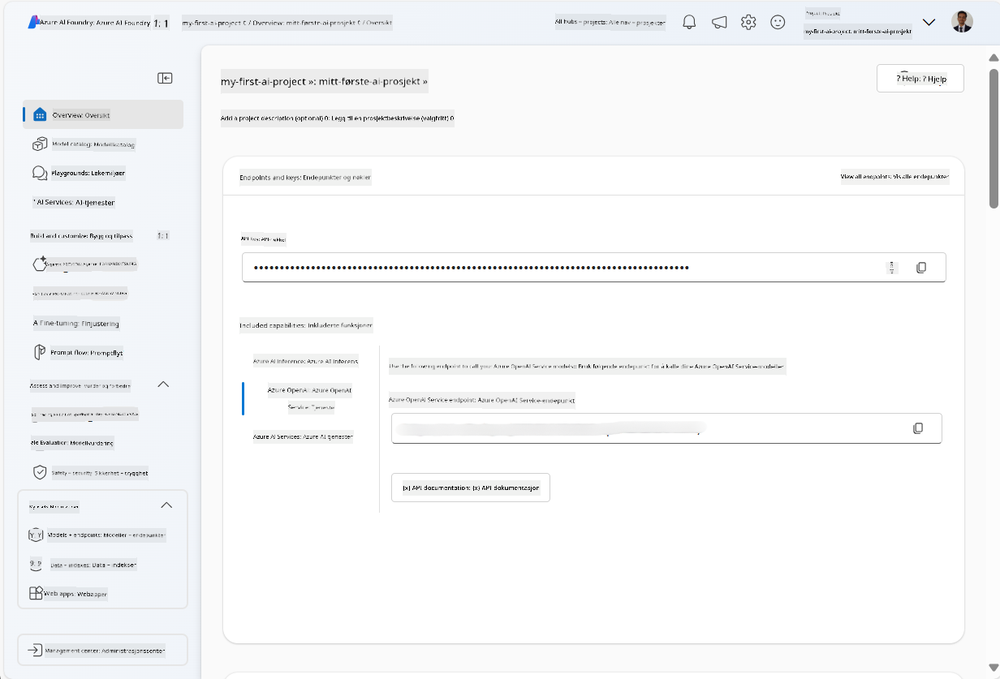
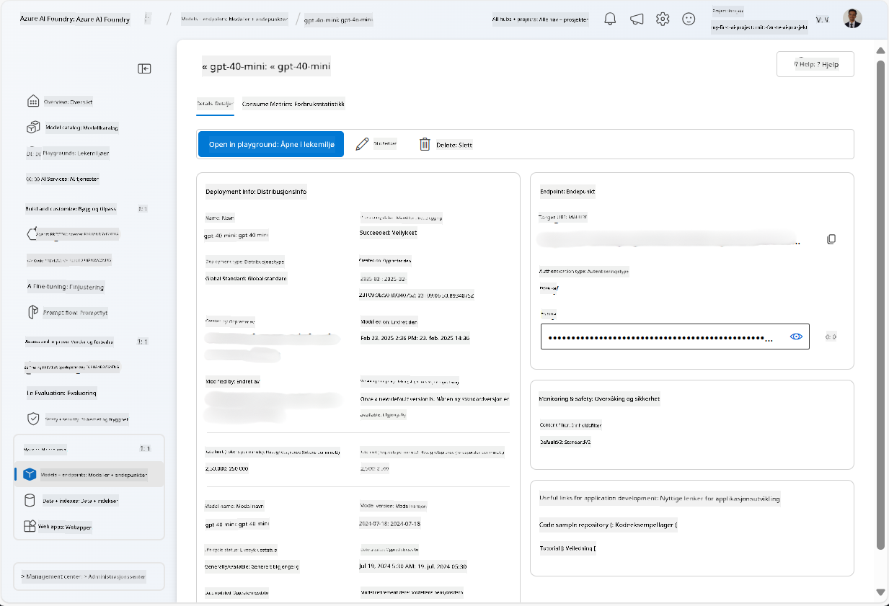
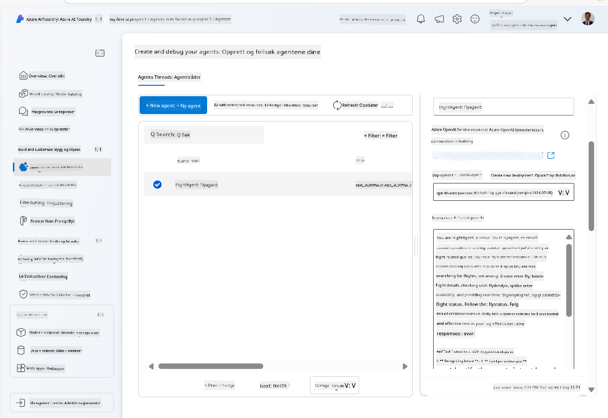
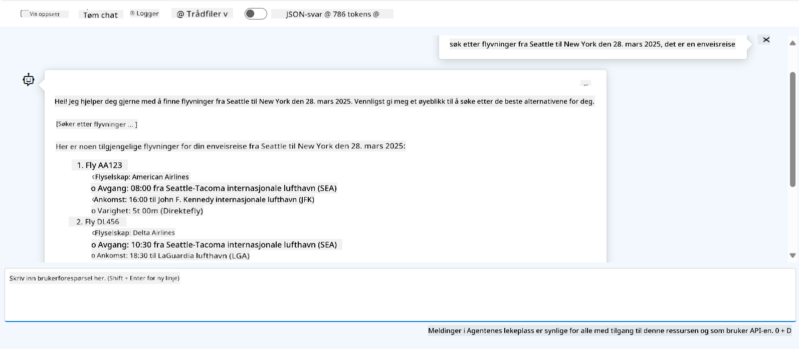

<!--
CO_OP_TRANSLATOR_METADATA:
{
  "original_hash": "7e92870dc0843e13d4dabc620c09d2d9",
  "translation_date": "2025-07-12T08:20:03+00:00",
  "source_file": "02-explore-agentic-frameworks/azure-ai-foundry-agent-creation.md",
  "language_code": "no"
}
-->
# Azure AI Agent Service-utvikling

I denne øvelsen bruker du verktøyene i Azure AI Agent-tjenesten i [Azure AI Foundry-portalen](https://ai.azure.com/?WT.mc_id=academic-105485-koreyst) for å lage en agent for flybestilling. Agenten vil kunne kommunisere med brukere og gi informasjon om flyreiser.

## Forutsetninger

For å fullføre denne øvelsen trenger du følgende:
1. En Azure-konto med et aktivt abonnement. [Opprett en konto gratis](https://azure.microsoft.com/free/?WT.mc_id=academic-105485-koreyst).
2. Du må ha tillatelse til å opprette en Azure AI Foundry-hub, eller ha en opprettet for deg.
    - Hvis rollen din er Bidragsyter eller Eier, kan du følge trinnene i denne veiledningen.

## Opprett en Azure AI Foundry-hub

> **Note:** Azure AI Foundry het tidligere Azure AI Studio.

1. Følg retningslinjene i [Azure AI Foundry](https://learn.microsoft.com/en-us/azure/ai-studio/?WT.mc_id=academic-105485-koreyst) blogginnlegget for å opprette en Azure AI Foundry-hub.
2. Når prosjektet ditt er opprettet, lukk eventuelle tips som vises, og gå gjennom prosjektets side i Azure AI Foundry-portalen, som bør se omtrent slik ut:

    

## Distribuer en modell

1. I panelet til venstre for prosjektet ditt, under **My assets**, velg siden **Models + endpoints**.
2. På siden **Models + endpoints**, under fanen **Model deployments**, i menyen **+ Deploy model**, velg **Deploy base model**.
3. Søk etter modellen `gpt-4o-mini` i listen, velg den og bekreft.

    > **Note**: Å redusere TPM hjelper med å unngå overforbruk av kvoten i abonnementet du bruker.

    

## Opprett en agent

Nå som du har distribuert en modell, kan du opprette en agent. En agent er en samtale-AI-modell som kan brukes til å kommunisere med brukere.

1. I panelet til venstre for prosjektet ditt, under **Build & Customize**, velg siden **Agents**.
2. Klikk **+ Create agent** for å lage en ny agent. I dialogboksen **Agent Setup**:
    - Skriv inn et navn for agenten, for eksempel `FlightAgent`.
    - Sørg for at modell-distribusjonen `gpt-4o-mini` du opprettet tidligere er valgt.
    - Sett **Instructions** i henhold til prompten du ønsker at agenten skal følge. Her er et eksempel:
    ```
    You are FlightAgent, a virtual assistant specialized in handling flight-related queries. Your role includes assisting users with searching for flights, retrieving flight details, checking seat availability, and providing real-time flight status. Follow the instructions below to ensure clarity and effectiveness in your responses:

    ### Task Instructions:
    1. **Recognizing Intent**:
       - Identify the user's intent based on their request, focusing on one of the following categories:
         - Searching for flights
         - Retrieving flight details using a flight ID
         - Checking seat availability for a specified flight
         - Providing real-time flight status using a flight number
       - If the intent is unclear, politely ask users to clarify or provide more details.
        
    2. **Processing Requests**:
        - Depending on the identified intent, perform the required task:
        - For flight searches: Request details such as origin, destination, departure date, and optionally return date.
        - For flight details: Request a valid flight ID.
        - For seat availability: Request the flight ID and date and validate inputs.
        - For flight status: Request a valid flight number.
        - Perform validations on provided data (e.g., formats of dates, flight numbers, or IDs). If the information is incomplete or invalid, return a friendly request for clarification.

    3. **Generating Responses**:
    - Use a tone that is friendly, concise, and supportive.
    - Provide clear and actionable suggestions based on the output of each task.
    - If no data is found or an error occurs, explain it to the user gently and offer alternative actions (e.g., refine search, try another query).
    
    ```
> [!NOTE]
> For en detaljert prompt kan du sjekke ut [dette depotet](https://github.com/ShivamGoyal03/RoamMind) for mer informasjon.
    
> I tillegg kan du legge til **Knowledge Base** og **Actions** for å forbedre agentens evner til å gi mer informasjon og utføre automatiserte oppgaver basert på brukerforespørsler. For denne øvelsen kan du hoppe over disse trinnene.
    


3. For å opprette en ny multi-AI-agent, klikk bare på **New Agent**. Den nylig opprettede agenten vil da vises på Agents-siden.

## Test agenten

Etter at du har opprettet agenten, kan du teste hvordan den svarer på brukerhenvendelser i Azure AI Foundry-portalen sin lekeplass.

1. Øverst i **Setup**-panelet for agenten din, velg **Try in playground**.
2. I **Playground**-panelet kan du kommunisere med agenten ved å skrive spørsmål i chatte-vinduet. For eksempel kan du be agenten søke etter flyreiser fra Seattle til New York den 28.

    > **Note**: Agenten kan gi unøyaktige svar, siden det ikke brukes sanntidsdata i denne øvelsen. Hensikten er å teste agentens evne til å forstå og svare på brukerhenvendelser basert på de gitte instruksjonene.

    

3. Etter testing kan du tilpasse agenten ytterligere ved å legge til flere intensjoner, treningsdata og handlinger for å forbedre dens funksjonalitet.

## Rydd opp ressurser

Når du er ferdig med å teste agenten, kan du slette den for å unngå ekstra kostnader.
1. Åpne [Azure-portalen](https://portal.azure.com) og se innholdet i ressursgruppen der du distribuerte hub-ressursene som ble brukt i denne øvelsen.
2. På verktøylinjen velger du **Delete resource group**.
3. Skriv inn navnet på ressursgruppen og bekreft at du vil slette den.

## Ressurser

- [Azure AI Foundry-dokumentasjon](https://learn.microsoft.com/en-us/azure/ai-studio/?WT.mc_id=academic-105485-koreyst)
- [Azure AI Foundry-portalen](https://ai.azure.com/?WT.mc_id=academic-105485-koreyst)
- [Kom i gang med Azure AI Studio](https://techcommunity.microsoft.com/blog/educatordeveloperblog/getting-started-with-azure-ai-studio/4095602?WT.mc_id=academic-105485-koreyst)
- [Grunnleggende om AI-agenter på Azure](https://learn.microsoft.com/en-us/training/modules/ai-agent-fundamentals/?WT.mc_id=academic-105485-koreyst)
- [Azure AI Discord](https://aka.ms/AzureAI/Discord)

**Ansvarsfraskrivelse**:  
Dette dokumentet er oversatt ved hjelp av AI-oversettelsestjenesten [Co-op Translator](https://github.com/Azure/co-op-translator). Selv om vi streber etter nøyaktighet, vennligst vær oppmerksom på at automatiske oversettelser kan inneholde feil eller unøyaktigheter. Det opprinnelige dokumentet på originalspråket skal anses som den autoritative kilden. For kritisk informasjon anbefales profesjonell menneskelig oversettelse. Vi er ikke ansvarlige for eventuelle misforståelser eller feiltolkninger som oppstår ved bruk av denne oversettelsen.