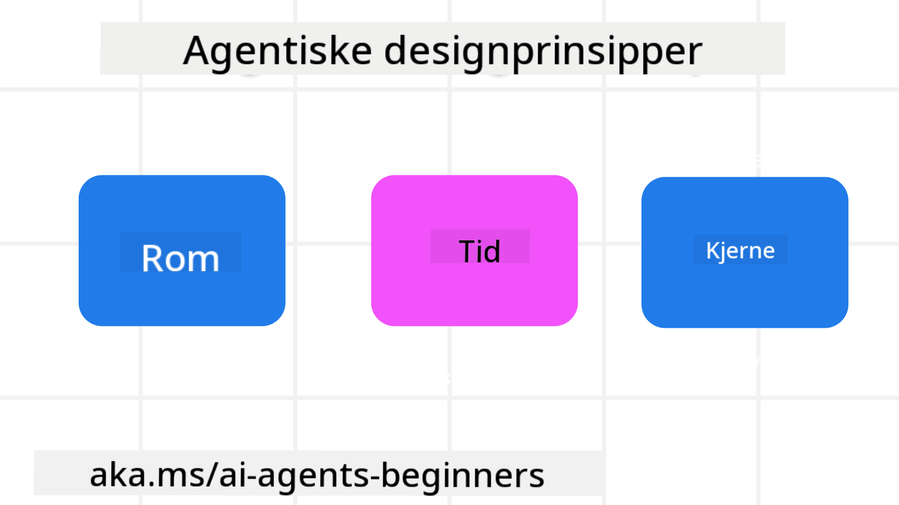

<!--
CO_OP_TRANSLATOR_METADATA:
{
  "original_hash": "4c46e4ff9e349c521e2b0b17f51afa64",
  "translation_date": "2025-08-29T15:57:57+00:00",
  "source_file": "03-agentic-design-patterns/README.md",
  "language_code": "no"
}
-->

> _(Klikk på bildet over for å se videoen til denne leksjonen)_
# Prinsipper for agentisk design av AI

## Introduksjon

Det finnes mange måter å tenke på når man skal bygge AI-agentiske systemer. Siden tvetydighet er en funksjon og ikke en feil i design av generativ AI, kan det noen ganger være vanskelig for ingeniører å vite hvor de skal begynne. Vi har laget et sett med menneskesentrerte UX-designprinsipper for å hjelpe utviklere med å bygge kundesentrerte agentiske systemer som løser deres forretningsbehov. Disse designprinsippene er ikke en foreskrevet arkitektur, men heller et utgangspunkt for team som skal definere og bygge agentopplevelser.

Generelt bør agenter:

- Utvide og skalere menneskelige kapasiteter (idémyldring, problemløsning, automatisering, osv.)
- Fylle kunnskapshull (gi meg en innføring i kunnskapsområder, oversettelse, osv.)
- Legge til rette for og støtte samarbeid på måter vi som individer foretrekker å jobbe med andre
- Gjøre oss til bedre versjoner av oss selv (f.eks. livscoach/oppgavemester, hjelpe oss med å lære emosjonell regulering og mindfulness-ferdigheter, bygge motstandskraft, osv.)

## Denne leksjonen dekker

- Hva er prinsippene for agentisk design
- Hvilke retningslinjer bør følges ved implementering av disse designprinsippene
- Eksempler på bruk av designprinsippene

## Læringsmål

Etter å ha fullført denne leksjonen, vil du kunne:

1. Forklare hva prinsippene for agentisk design er
2. Forklare retningslinjene for bruk av prinsippene for agentisk design
3. Forstå hvordan man bygger en agent ved hjelp av prinsippene for agentisk design

## Prinsippene for agentisk design

### Agent (Rom)

Dette er miljøet der agenten opererer. Disse prinsippene informerer hvordan vi designer agenter for å engasjere seg i fysiske og digitale verdener.

- **Koble sammen, ikke bryte ned** – hjelp med å koble mennesker til andre mennesker, hendelser og handlingsrettet kunnskap for å muliggjøre samarbeid og tilknytning.
- Agenter hjelper med å koble sammen hendelser, kunnskap og mennesker.
- Agenter bringer mennesker nærmere hverandre. De er ikke designet for å erstatte eller nedvurdere mennesker.
- **Lett tilgjengelig, men av og til usynlig** – agenten opererer stort sett i bakgrunnen og gir oss kun et dytt når det er relevant og passende.
  - Agenten er lett å finne og tilgjengelig for autoriserte brukere på alle enheter eller plattformer.
  - Agenten støtter multimodale inn- og utganger (lyd, tale, tekst, osv.).
  - Agenten kan sømløst skifte mellom forgrunn og bakgrunn; mellom proaktiv og reaktiv, avhengig av brukerens behov.
  - Agenten kan operere i usynlig form, men dens bakgrunnsprosess og samarbeid med andre agenter er transparent og kontrollerbart for brukeren.

### Agent (Tid)

Dette er hvordan agenten opererer over tid. Disse prinsippene informerer hvordan vi designer agenter som interagerer på tvers av fortid, nåtid og fremtid.

- **Fortid**: Reflektere over historien som inkluderer både tilstand og kontekst.
  - Agenten gir mer relevante resultater basert på analyse av rikere historiske data utover bare hendelsen, mennesker eller tilstander.
  - Agenten skaper forbindelser fra tidligere hendelser og reflekterer aktivt over hukommelsen for å engasjere seg i nåværende situasjoner.
- **Nå**: Gi et dytt mer enn en varsling.
  - Agenten har en helhetlig tilnærming til interaksjon med mennesker. Når en hendelse skjer, går agenten utover statisk varsling eller annen statisk formalitet. Agenten kan forenkle prosesser eller dynamisk generere signaler for å rette brukerens oppmerksomhet på riktig tidspunkt.
  - Agenten leverer informasjon basert på kontekstuelt miljø, sosiale og kulturelle endringer og tilpasset brukerens intensjon.
  - Agentens interaksjon kan være gradvis, utvikle seg/øke i kompleksitet for å styrke brukeren over tid.
- **Fremtid**: Tilpasse seg og utvikle seg.
  - Agenten tilpasser seg ulike enheter, plattformer og modaliteter.
  - Agenten tilpasser seg brukerens atferd, tilgjengelighetsbehov og er fritt tilpassbar.
  - Agenten formes av og utvikler seg gjennom kontinuerlig brukerinteraksjon.

### Agent (Kjerne)

Dette er de sentrale elementene i kjernen av en agents design.

- **Omfavn usikkerhet, men etabler tillit**.
  - En viss grad av usikkerhet hos agenten er forventet. Usikkerhet er et nøkkelaspekt ved agentdesign.
  - Tillit og transparens er grunnleggende lag i agentdesign.
  - Mennesker har kontroll over når agenten er på/av, og agentens status er alltid tydelig synlig.

## Retningslinjer for implementering av disse prinsippene

Når du bruker de tidligere designprinsippene, følg disse retningslinjene:

1. **Transparens**: Informer brukeren om at AI er involvert, hvordan det fungerer (inkludert tidligere handlinger), og hvordan man gir tilbakemelding og modifiserer systemet.
2. **Kontroll**: Gi brukeren mulighet til å tilpasse, spesifisere preferanser og personalisere, og ha kontroll over systemet og dets attributter (inkludert muligheten til å glemme).
3. **Konsistens**: Sikt mot konsistente, multimodale opplevelser på tvers av enheter og endepunkter. Bruk kjente UI/UX-elementer der det er mulig (f.eks. mikrofonikon for stemmeinteraksjon) og reduser kundens kognitive belastning så mye som mulig (f.eks. sikt mot konsise svar, visuelle hjelpemidler og «Lær mer»-innhold).

## Hvordan designe en reiseagent ved hjelp av disse prinsippene og retningslinjene

Tenk deg at du designer en reiseagent, her er hvordan du kan bruke designprinsippene og retningslinjene:

1. **Transparens** – Informer brukeren om at reiseagenten er en AI-drevet agent. Gi noen grunnleggende instruksjoner om hvordan man kommer i gang (f.eks. en «Hei»-melding, eksempelforespørsler). Dokumenter dette tydelig på produktsiden. Vis listen over forespørsler brukeren har stilt tidligere. Gjør det klart hvordan man gir tilbakemelding (tommel opp og ned, Send tilbakemelding-knapp, osv.). Klargjør om agenten har bruks- eller emnebegrensninger.
2. **Kontroll** – Sørg for at det er tydelig hvordan brukeren kan modifisere agenten etter at den er opprettet, med ting som systemprompt. Gi brukeren mulighet til å velge hvor detaljert agenten skal være, dens skrivestil, og eventuelle forbehold om hva agenten ikke skal snakke om. Tillat brukeren å se og slette tilknyttede filer eller data, forespørsler og tidligere samtaler.
3. **Konsistens** – Sørg for at ikonene for deling av forespørsel, legge til en fil eller et bilde og tagge noen eller noe er standard og gjenkjennelige. Bruk bindersikonet for å indikere filopplasting/deling med agenten, og bildeikonet for å indikere grafikkopplasting.

### Har du flere spørsmål om agentiske designmønstre for AI?

Bli med i [Azure AI Foundry Discord](https://aka.ms/ai-agents/discord) for å møte andre lærende, delta på kontortimer og få svar på spørsmål om AI-agenter.

## Tilleggsressurser

- ## Forrige leksjon

[Utforske agentiske rammeverk](../02-explore-agentic-frameworks/README.md)

## Neste leksjon

[Designmønster for verktøybruk](../04-tool-use/README.md)

---

**Ansvarsfraskrivelse**:  
Dette dokumentet er oversatt ved hjelp av AI-oversettelsestjenesten [Co-op Translator](https://github.com/Azure/co-op-translator). Selv om vi streber etter nøyaktighet, vær oppmerksom på at automatiserte oversettelser kan inneholde feil eller unøyaktigheter. Det originale dokumentet på sitt opprinnelige språk bør anses som den autoritative kilden. For kritisk informasjon anbefales profesjonell menneskelig oversettelse. Vi er ikke ansvarlige for misforståelser eller feiltolkninger som oppstår ved bruk av denne oversettelsen.