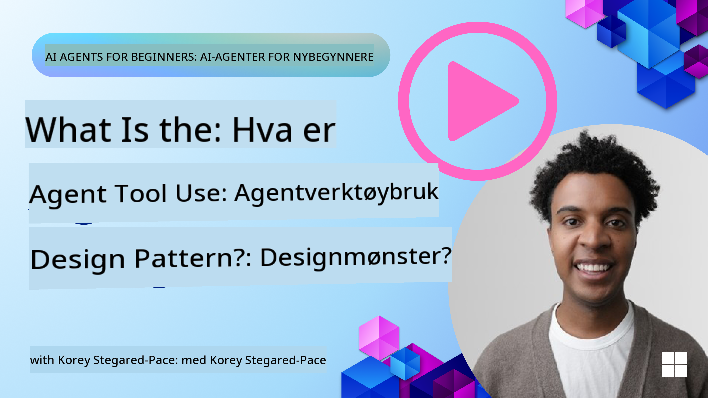
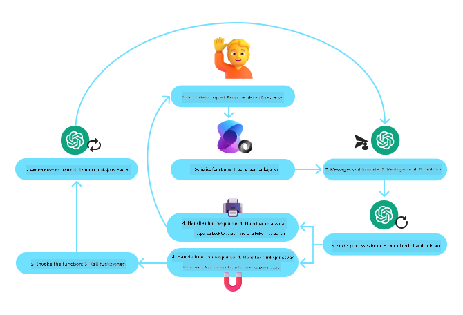
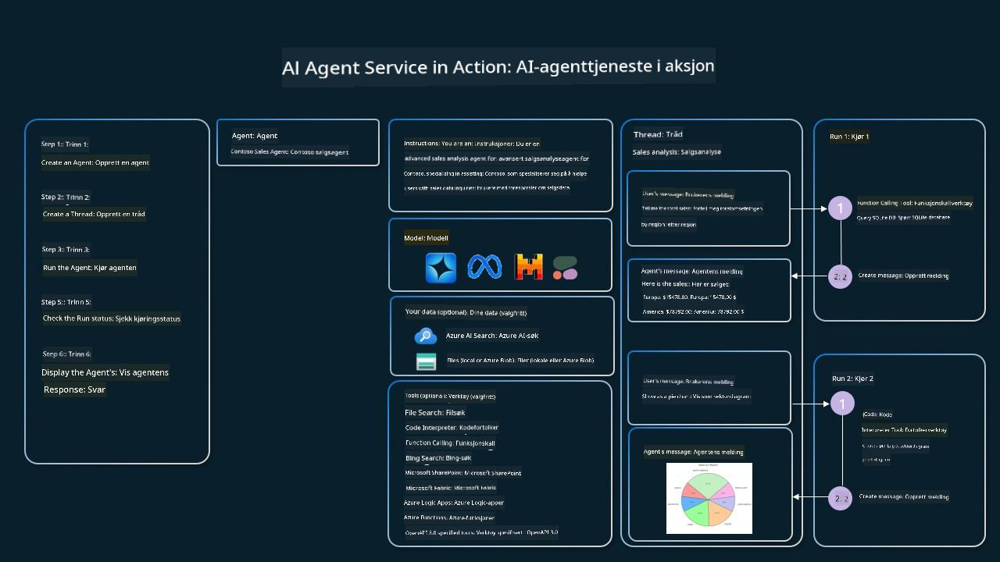

<!--
CO_OP_TRANSLATOR_METADATA:
{
  "original_hash": "88258b03f2893aa2e69eb8fb24baabbc",
  "translation_date": "2025-07-12T09:36:57+00:00",
  "source_file": "04-tool-use/README.md",
  "language_code": "no"
}
-->
[](https://youtu.be/vieRiPRx-gI?si=cEZ8ApnT6Sus9rhn)

> _(Klikk på bildet over for å se videoen til denne leksjonen)_

# Verktøybruk Designmønster

Verktøy er interessante fordi de gir AI-agenter et bredere spekter av muligheter. I stedet for at agenten har et begrenset sett med handlinger den kan utføre, kan agenten nå utføre et bredt spekter av handlinger ved å legge til et verktøy. I dette kapitlet skal vi se på Verktøybruk Designmønster, som beskriver hvordan AI-agenter kan bruke spesifikke verktøy for å nå sine mål.

## Introduksjon

I denne leksjonen ønsker vi å svare på følgende spørsmål:

- Hva er verktøybruk designmønster?
- Hvilke bruksområder kan det anvendes på?
- Hvilke elementer/byggesteiner trengs for å implementere designmønsteret?
- Hvilke spesielle hensyn må tas ved bruk av Verktøybruk Designmønster for å bygge pålitelige AI-agenter?

## Læringsmål

Etter å ha fullført denne leksjonen vil du kunne:

- Definere Verktøybruk Designmønster og dets formål.
- Identifisere bruksområder hvor Verktøybruk Designmønster er relevant.
- Forstå nøkkelkomponentene som trengs for å implementere designmønsteret.
- Gjenkjenne hensyn for å sikre pålitelighet i AI-agenter som bruker dette designmønsteret.

## Hva er Verktøybruk Designmønster?

**Verktøybruk Designmønster** fokuserer på å gi LLM-er muligheten til å samhandle med eksterne verktøy for å oppnå spesifikke mål. Verktøy er kode som kan kjøres av en agent for å utføre handlinger. Et verktøy kan være en enkel funksjon som en kalkulator, eller et API-kall til en tredjepartstjeneste som aksjekursoppslag eller værmelding. I sammenheng med AI-agenter er verktøy designet for å bli utført av agenter som svar på **modellgenererte funksjonskall**.

## Hvilke bruksområder kan det anvendes på?

AI-agenter kan bruke verktøy for å fullføre komplekse oppgaver, hente informasjon eller ta beslutninger. Verktøybruk designmønster brukes ofte i scenarier som krever dynamisk interaksjon med eksterne systemer, som databaser, webtjenester eller kodeinterpretere. Denne evnen er nyttig for flere ulike bruksområder, inkludert:

- **Dynamisk informasjonsinnhenting:** Agenter kan spørre eksterne API-er eller databaser for å hente oppdatert data (f.eks. spørring i en SQLite-database for dataanalyse, hente aksjekurser eller værinformasjon).
- **Kodekjøring og tolkning:** Agenter kan kjøre kode eller skript for å løse matematiske problemer, generere rapporter eller utføre simuleringer.
- **Automatisering av arbeidsflyt:** Automatisere repeterende eller flertrinns arbeidsflyter ved å integrere verktøy som oppgaveplanleggere, e-posttjenester eller datapipelines.
- **Kundesupport:** Agenter kan samhandle med CRM-systemer, supportsystemer eller kunnskapsbaser for å løse brukerhenvendelser.
- **Innholdsgenerering og redigering:** Agenter kan bruke verktøy som grammatikkontroll, tekstoppsummering eller innholdssikkerhetsevaluering for å bistå i innholdsproduksjon.

## Hvilke elementer/byggesteiner trengs for å implementere verktøybruk designmønster?

Disse byggesteinene gjør det mulig for AI-agenten å utføre et bredt spekter av oppgaver. La oss se på nøkkelkomponentene som trengs for å implementere Verktøybruk Designmønster:

- **Funksjons-/Verktøyskjemaer**: Detaljerte definisjoner av tilgjengelige verktøy, inkludert funksjonsnavn, formål, nødvendige parametere og forventede resultater. Disse skjemaene gjør det mulig for LLM å forstå hvilke verktøy som er tilgjengelige og hvordan man konstruerer gyldige forespørsler.

- **Funksjonsutførelseslogikk**: Styrer hvordan og når verktøy kalles basert på brukerens intensjon og samtalekontekst. Dette kan inkludere planleggingsmoduler, rutingsmekanismer eller betingede flyter som bestemmer verktøybruk dynamisk.

- **Meldingshåndteringssystem**: Komponenter som styrer samtaleflyten mellom brukerinnspill, LLM-svar, verktøykall og verktøyutdata.

- **Verktøyintegrasjonsrammeverk**: Infrastruktur som kobler agenten til ulike verktøy, enten det er enkle funksjoner eller komplekse eksterne tjenester.

- **Feilhåndtering og validering**: Mekanismer for å håndtere feil i verktøyutførelse, validere parametere og håndtere uventede svar.

- **Tilstandshåndtering**: Sporer samtalekontekst, tidligere verktøyinteraksjoner og vedvarende data for å sikre konsistens over flere samtaler.

Neste steg er å se nærmere på Funksjons-/Verktøykall.

### Funksjons-/Verktøykall

Funksjonskall er hovedmåten vi gjør det mulig for store språkmodeller (LLM) å samhandle med verktøy. Du vil ofte se 'Funksjon' og 'Verktøy' brukt om hverandre fordi 'funksjoner' (gjenbrukbare kodeblokker) er de 'verktøyene' agenter bruker for å utføre oppgaver. For at en funksjonskode skal kunne kalles, må en LLM sammenligne brukerens forespørsel med funksjonens beskrivelse. For å gjøre dette sendes et skjema som inneholder beskrivelsene av alle tilgjengelige funksjoner til LLM. LLM velger deretter den mest passende funksjonen for oppgaven og returnerer navnet og argumentene. Den valgte funksjonen kalles, svaret sendes tilbake til LLM, som bruker informasjonen til å svare på brukerens forespørsel.

For utviklere som skal implementere funksjonskall for agenter, trenger du:

1. En LLM-modell som støtter funksjonskall
2. Et skjema som inneholder funksjonsbeskrivelser
3. Koden for hver funksjon som er beskrevet

La oss bruke eksempelet med å hente gjeldende tid i en by for å illustrere:

1. **Initialiser en LLM som støtter funksjonskall:**

    Ikke alle modeller støtter funksjonskall, så det er viktig å sjekke at LLM-en du bruker gjør det. <a href="https://learn.microsoft.com/azure/ai-services/openai/how-to/function-calling" target="_blank">Azure OpenAI</a> støtter funksjonskall. Vi kan starte med å initiere Azure OpenAI-klienten.

    ```python
    # Initialize the Azure OpenAI client
    client = AzureOpenAI(
        azure_endpoint = os.getenv("AZURE_OPENAI_ENDPOINT"), 
        api_key=os.getenv("AZURE_OPENAI_API_KEY"),  
        api_version="2024-05-01-preview"
    )
    ```

1. **Lag et Funksjonsskjema**:

    Deretter definerer vi et JSON-skjema som inneholder funksjonsnavn, beskrivelse av hva funksjonen gjør, og navn og beskrivelser av funksjonsparametrene. Vi sender så dette skjemaet til klienten som ble opprettet tidligere, sammen med brukerens forespørsel om å finne tiden i San Francisco. Det viktige å merke seg er at det som returneres er et **verktøykall**, **ikke** det endelige svaret på spørsmålet. Som nevnt tidligere returnerer LLM navnet på funksjonen den valgte for oppgaven, og argumentene som skal sendes til den.

    ```python
    # Function description for the model to read
    tools = [
        {
            "type": "function",
            "function": {
                "name": "get_current_time",
                "description": "Get the current time in a given location",
                "parameters": {
                    "type": "object",
                    "properties": {
                        "location": {
                            "type": "string",
                            "description": "The city name, e.g. San Francisco",
                        },
                    },
                    "required": ["location"],
                },
            }
        }
    ]
    ```
   
    ```python
  
    # Initial user message
    messages = [{"role": "user", "content": "What's the current time in San Francisco"}] 
  
    # First API call: Ask the model to use the function
      response = client.chat.completions.create(
          model=deployment_name,
          messages=messages,
          tools=tools,
          tool_choice="auto",
      )
  
      # Process the model's response
      response_message = response.choices[0].message
      messages.append(response_message)
  
      print("Model's response:")  

      print(response_message)
  
    ```

    ```bash
    Model's response:
    ChatCompletionMessage(content=None, role='assistant', function_call=None, tool_calls=[ChatCompletionMessageToolCall(id='call_pOsKdUlqvdyttYB67MOj434b', function=Function(arguments='{"location":"San Francisco"}', name='get_current_time'), type='function')])
    ```
  
1. **Funksjonskoden som kreves for å utføre oppgaven:**

    Nå som LLM har valgt hvilken funksjon som skal kjøres, må koden som utfører oppgaven implementeres og kjøres. Vi kan implementere koden for å hente gjeldende tid i Python. Vi må også skrive kode for å hente ut navn og argumenter fra response_message for å få det endelige resultatet.

    ```python
      def get_current_time(location):
        """Get the current time for a given location"""
        print(f"get_current_time called with location: {location}")  
        location_lower = location.lower()
        
        for key, timezone in TIMEZONE_DATA.items():
            if key in location_lower:
                print(f"Timezone found for {key}")  
                current_time = datetime.now(ZoneInfo(timezone)).strftime("%I:%M %p")
                return json.dumps({
                    "location": location,
                    "current_time": current_time
                })
      
        print(f"No timezone data found for {location_lower}")  
        return json.dumps({"location": location, "current_time": "unknown"})
    ```

    ```python
     # Handle function calls
      if response_message.tool_calls:
          for tool_call in response_message.tool_calls:
              if tool_call.function.name == "get_current_time":
     
                  function_args = json.loads(tool_call.function.arguments)
     
                  time_response = get_current_time(
                      location=function_args.get("location")
                  )
     
                  messages.append({
                      "tool_call_id": tool_call.id,
                      "role": "tool",
                      "name": "get_current_time",
                      "content": time_response,
                  })
      else:
          print("No tool calls were made by the model.")  
  
      # Second API call: Get the final response from the model
      final_response = client.chat.completions.create(
          model=deployment_name,
          messages=messages,
      )
  
      return final_response.choices[0].message.content
     ```

    ```bash
      get_current_time called with location: San Francisco
      Timezone found for san francisco
      The current time in San Francisco is 09:24 AM.
     ```

Funksjonskall er kjernen i de fleste, om ikke alle, agenters verktøybruk design, men det kan noen ganger være utfordrende å implementere det fra bunnen av. Som vi lærte i [Leksjon 2](../../../02-explore-agentic-frameworks) gir agentiske rammeverk oss ferdigbygde byggesteiner for å implementere verktøybruk.

## Eksempler på verktøybruk med agentiske rammeverk

Her er noen eksempler på hvordan du kan implementere Verktøybruk Designmønster ved hjelp av ulike agentiske rammeverk:

### Semantic Kernel

<a href="https://learn.microsoft.com/azure/ai-services/agents/overview" target="_blank">Semantic Kernel</a> er et åpen kildekode AI-rammeverk for .NET, Python og Java-utviklere som jobber med store språkmodeller (LLM). Det forenkler prosessen med å bruke funksjonskall ved automatisk å beskrive funksjonene dine og deres parametere til modellen gjennom en prosess kalt <a href="https://learn.microsoft.com/semantic-kernel/concepts/ai-services/chat-completion/function-calling/?pivots=programming-language-python#1-serializing-the-functions" target="_blank">serialisering</a>. Det håndterer også kommunikasjonen frem og tilbake mellom modellen og koden din. En annen fordel med å bruke et agentisk rammeverk som Semantic Kernel, er at det gir tilgang til ferdigbygde verktøy som <a href="https://github.com/microsoft/semantic-kernel/blob/main/python/samples/getting_started_with_agents/openai_assistant/step4_assistant_tool_file_search.py" target="_blank">Fil-søk</a> og <a href="https://github.com/microsoft/semantic-kernel/blob/main/python/samples/getting_started_with_agents/openai_assistant/step3_assistant_tool_code_interpreter.py" target="_blank">Kodeinterpreter</a>.

Følgende diagram illustrerer prosessen med funksjonskall i Semantic Kernel:



I Semantic Kernel kalles funksjoner/verktøy <a href="https://learn.microsoft.com/semantic-kernel/concepts/plugins/?pivots=programming-language-python" target="_blank">Plugins</a>. Vi kan gjøre om `get_current_time`-funksjonen vi så tidligere til en plugin ved å gjøre den om til en klasse med funksjonen inni. Vi kan også importere `kernel_function`-dekoratøren, som tar inn beskrivelsen av funksjonen. Når du deretter oppretter en kernel med GetCurrentTimePlugin, vil kernel automatisk serialisere funksjonen og dens parametere, og lage skjemaet som sendes til LLM i prosessen.

```python
from semantic_kernel.functions import kernel_function

class GetCurrentTimePlugin:
    async def __init__(self, location):
        self.location = location

    @kernel_function(
        description="Get the current time for a given location"
    )
    def get_current_time(location: str = ""):
        ...

```

```python 
from semantic_kernel import Kernel

# Create the kernel
kernel = Kernel()

# Create the plugin
get_current_time_plugin = GetCurrentTimePlugin(location)

# Add the plugin to the kernel
kernel.add_plugin(get_current_time_plugin)
```
  
### Azure AI Agent Service

<a href="https://learn.microsoft.com/azure/ai-services/agents/overview" target="_blank">Azure AI Agent Service</a> er et nyere agentisk rammeverk som er designet for å gi utviklere mulighet til å bygge, distribuere og skalere høykvalitets og utvidbare AI-agenter på en sikker måte uten å måtte håndtere underliggende beregnings- og lagringsressurser. Det er spesielt nyttig for bedriftsapplikasjoner siden det er en fullstendig administrert tjeneste med sikkerhet på bedriftsnivå.

Sammenlignet med å utvikle direkte med LLM API, gir Azure AI Agent Service noen fordeler, inkludert:

- Automatisk verktøykall – ingen behov for å analysere et verktøykall, kalle verktøyet og håndtere svaret; alt dette gjøres nå på serversiden
- Sikkert administrerte data – i stedet for å håndtere egen samtalestatus, kan du stole på tråder som lagrer all informasjon du trenger
- Ferdigbygde verktøy – verktøy du kan bruke for å samhandle med datakilder, som Bing, Azure AI Search og Azure Functions.

Verktøyene som er tilgjengelige i Azure AI Agent Service kan deles inn i to kategorier:

1. Kunnskapsverktøy:
    - <a href="https://learn.microsoft.com/azure/ai-services/agents/how-to/tools/bing-grounding?tabs=python&pivots=overview" target="_blank">Grounding med Bing Search</a>
    - <a href="https://learn.microsoft.com/azure/ai-services/agents/how-to/tools/file-search?tabs=python&pivots=overview" target="_blank">Fil-søk</a>
    - <a href="https://learn.microsoft.com/azure/ai-services/agents/how-to/tools/azure-ai-search?tabs=azurecli%2Cpython&pivots=overview-azure-ai-search" target="_blank">Azure AI Search</a>

2. Handlingsverktøy:
    - <a href="https://learn.microsoft.com/azure/ai-services/agents/how-to/tools/function-calling?tabs=python&pivots=overview" target="_blank">Funksjonskall</a>
    - <a href="https://learn.microsoft.com/azure/ai-services/agents/how-to/tools/code-interpreter?tabs=python&pivots=overview" target="_blank">Kodeinterpreter</a>
    - <a href="https://learn.microsoft.com/azure/ai-services/agents/how-to/tools/openapi-spec?tabs=python&pivots=overview" target="_blank">OpenAI-definerte verktøy</a>
    - <a href="https://learn.microsoft.com/azure/ai-services/agents/how-to/tools/azure-functions?pivots=overview" target="_blank">Azure Functions</a>

Agent Service gjør det mulig å bruke disse verktøyene sammen som et `toolset`. Det benytter også `threads` som holder oversikt over meldingshistorikken fra en bestemt samtale.

Tenk deg at du er en salgsagent i et selskap som heter Contoso. Du ønsker å utvikle en samtaleagent som kan svare på spørsmål om salgsdataene dine.

Følgende bilde illustrerer hvordan du kan bruke Azure AI Agent Service til å analysere salgsdataene dine:



For å bruke noen av disse verktøyene med tjenesten kan vi opprette en klient og definere et verktøy eller verktøysett. For å implementere dette praktisk kan vi bruke følgende Python-kode. LLM vil kunne se på verktøysettet og avgjøre om den skal bruke den brukerdefinerte funksjonen `fetch_sales_data_using_sqlite_query` eller den ferdigbygde Kodeinterpreteren, avhengig av brukerens forespørsel.

```python 
import os
from azure.ai.projects import AIProjectClient
from azure.identity import DefaultAzureCredential
from fecth_sales_data_functions import fetch_sales_data_using_sqlite_query # fetch_sales_data_using_sqlite_query function which can be found in a fetch_sales_data_functions.py file.
from azure.ai.projects.models import ToolSet, FunctionTool, CodeInterpreterTool

project_client = AIProjectClient.from_connection_string(
    credential=DefaultAzureCredential(),
    conn_str=os.environ["PROJECT_CONNECTION_STRING"],
)

# Initialize function calling agent with the fetch_sales_data_using_sqlite_query function and adding it to the toolset
fetch_data_function = FunctionTool(fetch_sales_data_using_sqlite_query)
toolset = ToolSet()
toolset.add(fetch_data_function)

# Initialize Code Interpreter tool and adding it to the toolset. 
code_interpreter = code_interpreter = CodeInterpreterTool()
toolset = ToolSet()
toolset.add(code_interpreter)

agent = project_client.agents.create_agent(
    model="gpt-4o-mini", name="my-agent", instructions="You are helpful agent", 
    toolset=toolset
)
```

## Hvilke spesielle hensyn må tas ved bruk av Verktøybruk Designmønster for å bygge pålitelige AI-agenter?

En vanlig bekymring med SQL som genereres dynamisk av LLM-er er sikkerhet, spesielt risikoen for SQL-injeksjon eller ondsinnede handlinger, som å slette eller tukle med databasen. Selv om disse bekymringene er gyldige, kan de effektivt reduseres ved å konfigurere database-tilgangstillatelser riktig. For de fleste databaser innebærer dette å sette databasen til skrivebeskyttet modus. For databaser som PostgreSQL eller Azure SQL bør appen tildeles en lese-only (SELECT) rolle.

Å kjøre appen i et sikkert miljø gir ytterligere beskyttelse. I bedriftsmiljøer blir data vanligvis hentet og transformert fra operative systemer til en skrivebeskyttet database eller datavarehus med et brukervennlig skjema. Denne tilnærmingen sikrer at dataene er sikre, optimalisert for ytelse og tilgjengelighet, og at appen har begrenset, skrivebeskyttet tilgang.

## Ytterligere ressurser

-

Azure AI Agents Service Workshop</a>
- <a href="https://github.com/Azure-Samples/contoso-creative-writer/tree/main/docs/workshop" target="_blank">Contoso Creative Writer Multi-Agent Workshop</a>
- <a href="https://learn.microsoft.com/semantic-kernel/concepts/ai-services/chat-completion/function-calling/?pivots=programming-language-python#1-serializing-the-functions" target="_blank">Semantic Kernel Function Calling Tutorial</a>
- <a href="https://github.com/microsoft/semantic-kernel/blob/main/python/samples/getting_started_with_agents/openai_assistant/step3_assistant_tool_code_interpreter.py" target="_blank">Semantic Kernel Code Interpreter</a>
- <a href="https://microsoft.github.io/autogen/dev/user-guide/core-user-guide/components/tools.html" target="_blank">Autogen Tools</a>

## Forrige leksjon

[Forstå agentiske designmønstre](../03-agentic-design-patterns/README.md)

## Neste leksjon

[Agentic RAG](../05-agentic-rag/README.md)

**Ansvarsfraskrivelse**:  
Dette dokumentet er oversatt ved hjelp av AI-oversettelsestjenesten [Co-op Translator](https://github.com/Azure/co-op-translator). Selv om vi streber etter nøyaktighet, vennligst vær oppmerksom på at automatiske oversettelser kan inneholde feil eller unøyaktigheter. Det opprinnelige dokumentet på originalspråket skal anses som den autoritative kilden. For kritisk informasjon anbefales profesjonell menneskelig oversettelse. Vi er ikke ansvarlige for eventuelle misforståelser eller feiltolkninger som oppstår ved bruk av denne oversettelsen.