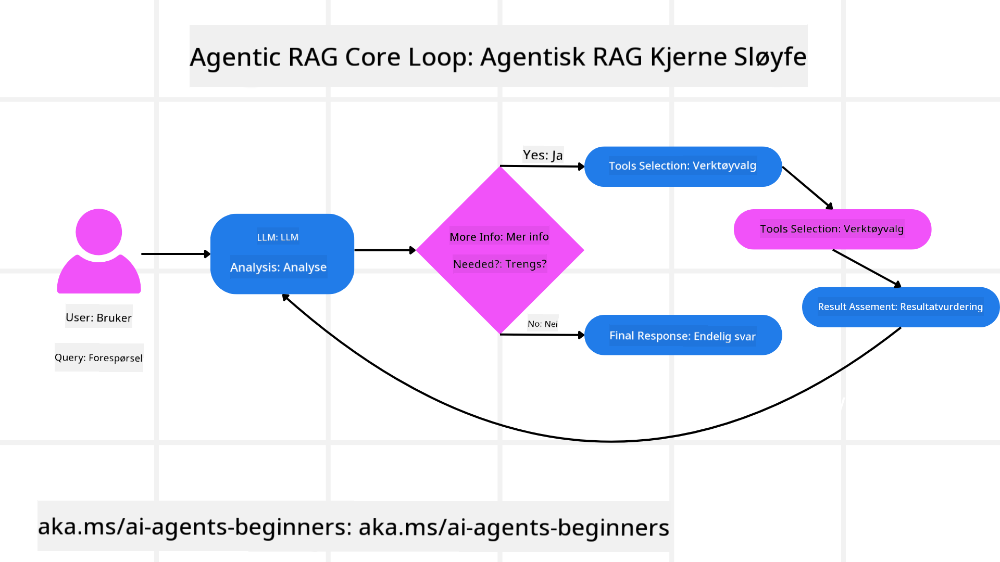
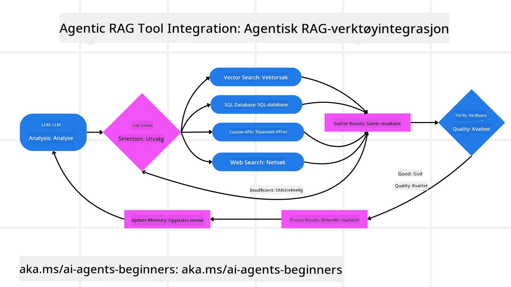
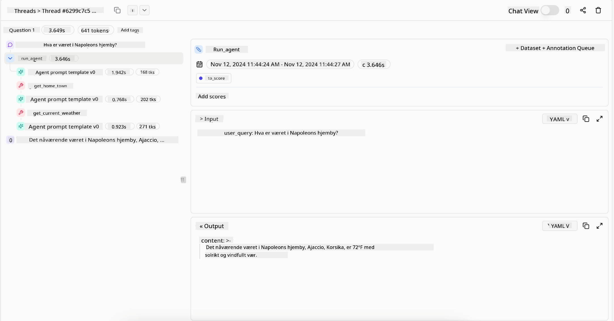
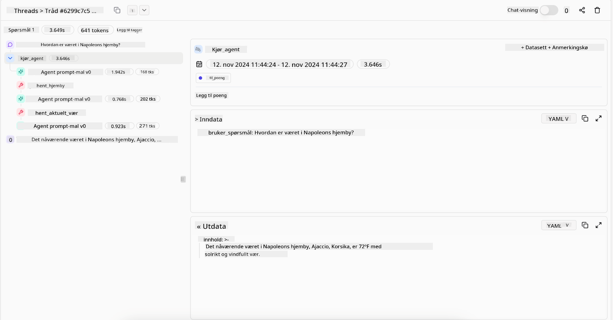

<!--
CO_OP_TRANSLATOR_METADATA:
{
  "original_hash": "7622aa72f9e676e593339f5f694ecd7d",
  "translation_date": "2025-07-12T10:05:24+00:00",
  "source_file": "05-agentic-rag/README.md",
  "language_code": "no"
}
-->

> _(Klikk på bildet over for å se videoen av denne leksjonen)_

# Agentic RAG

Denne leksjonen gir en grundig oversikt over Agentic Retrieval-Augmented Generation (Agentic RAG), et nytt AI-paradigme hvor store språkmodeller (LLMs) selvstendig planlegger sine neste steg samtidig som de henter informasjon fra eksterne kilder. I motsetning til statiske mønstre med henting og lesing, innebærer Agentic RAG iterative kall til LLM, avbrutt av verktøy- eller funksjonskall og strukturerte utdata. Systemet evaluerer resultater, forbedrer spørringer, kaller på flere verktøy ved behov, og fortsetter denne syklusen til en tilfredsstillende løsning er oppnådd.

## Introduksjon

Denne leksjonen vil dekke

- **Forstå Agentic RAG:** Lær om det nye paradigmet i AI hvor store språkmodeller (LLMs) selvstendig planlegger sine neste steg mens de henter informasjon fra eksterne datakilder.
- **Forstå iterativ Maker-Checker-stil:** Forstå løkken med iterative kall til LLM, avbrutt av verktøy- eller funksjonskall og strukturerte utdata, designet for å forbedre korrekthet og håndtere feilaktige spørringer.
- **Utforske praktiske bruksområder:** Identifisere situasjoner hvor Agentic RAG utmerker seg, som i miljøer med fokus på korrekthet, komplekse databaseinteraksjoner og utvidede arbeidsflyter.

## Læringsmål

Etter å ha fullført denne leksjonen vil du kunne/forstå:

- **Forstå Agentic RAG:** Lær om det nye paradigmet i AI hvor store språkmodeller (LLMs) selvstendig planlegger sine neste steg mens de henter informasjon fra eksterne datakilder.
- **Iterativ Maker-Checker-stil:** Forstå konseptet med en løkke av iterative kall til LLM, avbrutt av verktøy- eller funksjonskall og strukturerte utdata, designet for å forbedre korrekthet og håndtere feilaktige spørringer.
- **Eie resonnementprosessen:** Forstå systemets evne til å eie sin resonnementprosess, og ta beslutninger om hvordan problemer skal angripes uten å være avhengig av forhåndsdefinerte veier.
- **Arbeidsflyt:** Forstå hvordan en agentisk modell selvstendig bestemmer seg for å hente markedsrapportering, identifisere konkurrentdata, korrelere interne salgstall, syntetisere funn og evaluere strategien.
- **Iterative løkker, verktøyintegrasjon og minne:** Lær om systemets avhengighet av en løkkebasert interaksjonsmodell, som opprettholder tilstand og minne gjennom stegene for å unngå gjentakende løkker og ta informerte beslutninger.
- **Håndtering av feilmodus og selvkorreksjon:** Utforsk systemets robuste selvkorreksjonsmekanismer, inkludert iterasjon og ny spørring, bruk av diagnostiske verktøy og fallback til menneskelig tilsyn.
- **Begrensninger for agentur:** Forstå begrensningene til Agentic RAG, med fokus på domene-spesifikk autonomi, avhengighet av infrastruktur og respekt for sikkerhetsrammer.
- **Praktiske bruksområder og verdi:** Identifisere situasjoner hvor Agentic RAG utmerker seg, som i miljøer med fokus på korrekthet, komplekse databaseinteraksjoner og utvidede arbeidsflyter.
- **Styring, åpenhet og tillit:** Lær om viktigheten av styring og åpenhet, inkludert forklarbart resonnement, kontroll av skjevheter og menneskelig tilsyn.

## Hva er Agentic RAG?

Agentic Retrieval-Augmented Generation (Agentic RAG) er et nytt AI-paradigme hvor store språkmodeller (LLMs) selvstendig planlegger sine neste steg mens de henter informasjon fra eksterne kilder. I motsetning til statiske mønstre med henting og lesing, innebærer Agentic RAG iterative kall til LLM, avbrutt av verktøy- eller funksjonskall og strukturerte utdata. Systemet evaluerer resultater, forbedrer spørringer, kaller på flere verktøy ved behov, og fortsetter denne syklusen til en tilfredsstillende løsning er oppnådd. Denne iterative “maker-checker”-stilen forbedrer korrekthet, håndterer feilaktige spørringer og sikrer resultater av høy kvalitet.

Systemet eier aktivt sin resonnementprosess, omskriver mislykkede spørringer, velger ulike hentemetoder og integrerer flere verktøy—som vektorsøk i Azure AI Search, SQL-databaser eller tilpassede API-er—før det ferdigstiller svaret. Det som skiller et agentisk system er dets evne til å eie sin resonnementprosess. Tradisjonelle RAG-implementasjoner er avhengige av forhåndsdefinerte veier, men et agentisk system bestemmer selvstendig rekkefølgen av steg basert på kvaliteten på informasjonen det finner.

## Definisjon av Agentic Retrieval-Augmented Generation (Agentic RAG)

Agentic Retrieval-Augmented Generation (Agentic RAG) er et nytt paradigme innen AI-utvikling hvor LLM-er ikke bare henter informasjon fra eksterne datakilder, men også selvstendig planlegger sine neste steg. I motsetning til statiske mønstre med henting og lesing eller nøye skriptede promptsekvenser, innebærer Agentic RAG en løkke med iterative kall til LLM, avbrutt av verktøy- eller funksjonskall og strukturerte utdata. Ved hvert steg evaluerer systemet resultatene det har fått, avgjør om det skal forbedre spørringene, kaller på flere verktøy ved behov, og fortsetter denne syklusen til det oppnår en tilfredsstillende løsning.

Denne iterative “maker-checker”-stilen er designet for å forbedre korrekthet, håndtere feilaktige spørringer til strukturerte databaser (f.eks. NL2SQL), og sikre balanserte, høykvalitetsresultater. I stedet for å kun stole på nøye utformede promptkjeder, eier systemet aktivt sin resonnementprosess. Det kan omskrive spørringer som feiler, velge ulike hentemetoder og integrere flere verktøy—som vektorsøk i Azure AI Search, SQL-databaser eller tilpassede API-er—før det ferdigstiller svaret. Dette fjerner behovet for altfor komplekse orkestreringsrammeverk. I stedet kan en relativt enkel løkke av “LLM-kall → verktøybruk → LLM-kall → …” gi sofistikerte og godt funderte utdata.

## Å eie resonnementprosessen

Det som kjennetegner et system som “agentisk” er dets evne til å eie sin resonnementprosess. Tradisjonelle RAG-implementasjoner er ofte avhengige av at mennesker forhåndsdefinerer en vei for modellen: en tankerekke som skisserer hva som skal hentes og når.  
Men når et system virkelig er agentisk, bestemmer det internt hvordan det skal angripe problemet. Det utfører ikke bare et skript; det bestemmer selvstendig rekkefølgen av steg basert på kvaliteten på informasjonen det finner.  
For eksempel, hvis det blir bedt om å lage en produktlanseringsstrategi, stoler det ikke bare på en prompt som beskriver hele forsknings- og beslutningsprosessen. I stedet bestemmer den agentiske modellen selvstendig å:

1. Hente oppdaterte markedsrapporteringer ved hjelp av Bing Web Grounding  
2. Identifisere relevant konkurrentdata ved hjelp av Azure AI Search  
3. Koble historiske interne salgstall ved hjelp av Azure SQL Database  
4. Syntetisere funnene til en helhetlig strategi orkestrert via Azure OpenAI Service  
5. Evaluere strategien for hull eller inkonsistenser, og eventuelt hente mer informasjon

Alle disse stegene—forbedring av spørringer, valg av kilder, iterasjon til den er “fornøyd” med svaret—bestemmes av modellen, ikke forhåndsskriptet av et menneske.

## Iterative løkker, verktøyintegrasjon og minne

Et agentisk system baserer seg på et løkkebasert interaksjonsmønster:

- **Første kall:** Brukerens mål (altså brukerprompten) presenteres for LLM.  
- **Verktøykall:** Hvis modellen oppdager manglende informasjon eller tvetydige instruksjoner, velger den et verktøy eller en hentemetode—som et vektordatabasesøk (f.eks. Azure AI Search Hybrid-søk over private data) eller et strukturert SQL-kall—for å hente mer kontekst.  
- **Vurdering og forbedring:** Etter å ha gjennomgått den returnerte dataen, avgjør modellen om informasjonen er tilstrekkelig. Hvis ikke, forbedrer den spørringen, prøver et annet verktøy eller justerer tilnærmingen.  
- **Gjenta til tilfreds:** Denne syklusen fortsetter til modellen vurderer at den har nok klarhet og bevis til å levere et endelig, velbegrunnet svar.  
- **Minne og tilstand:** Fordi systemet opprettholder tilstand og minne gjennom stegene, kan det huske tidligere forsøk og resultater, unngå gjentakende løkker og ta mer informerte beslutninger underveis.

Over tid skaper dette en følelse av utviklende forståelse, som gjør at modellen kan navigere komplekse, flertrinnsoppgaver uten at et menneske må gripe inn eller omforme prompten kontinuerlig.

## Håndtering av feilmodus og selvkorreksjon

Agentic RAGs autonomi inkluderer også robuste selvkorreksjonsmekanismer. Når systemet møter blindveier—som å hente irrelevante dokumenter eller støte på feilaktige spørringer—kan det:

- **Iterere og spørre på nytt:** I stedet for å returnere lite verdifulle svar, prøver modellen nye søkestrategier, omskriver databaseforespørsler eller ser på alternative datasett.  
- **Bruke diagnostiske verktøy:** Systemet kan kalle på ekstra funksjoner designet for å hjelpe det med å feilsøke resonnementstrinn eller bekrefte korrektheten av hentet data. Verktøy som Azure AI Tracing vil være viktige for å muliggjøre robust observasjon og overvåking.  
- **Fallback til menneskelig tilsyn:** For oppgaver med høye krav eller gjentatte feil kan modellen flagge usikkerhet og be om menneskelig veiledning. Når mennesket gir korrigerende tilbakemelding, kan modellen ta lærdom av dette fremover.

Denne iterative og dynamiske tilnærmingen gjør at modellen kontinuerlig kan forbedre seg, og sikrer at den ikke bare er et engangssystem, men lærer av sine feil i løpet av en økt.

## Begrensninger for agentur

Til tross for sin autonomi innenfor en oppgave, er ikke Agentic RAG det samme som kunstig generell intelligens. Dets “agentiske” evner er begrenset til verktøyene, datakildene og retningslinjene som menneskelige utviklere har satt. Det kan ikke finne opp egne verktøy eller gå utenfor de definerte domenene. I stedet utmerker det seg i å dynamisk orkestrere tilgjengelige ressurser.  
Viktige forskjeller fra mer avanserte AI-former inkluderer:

1. **Domene-spesifikk autonomi:** Agentic RAG-systemer fokuserer på å nå brukerdefinerte mål innen et kjent domene, ved å bruke strategier som omskriving av spørringer eller valg av verktøy for å forbedre resultater.  
2. **Avhengig av infrastruktur:** Systemets evner er avhengig av verktøyene og dataene utviklerne har integrert. Det kan ikke overskride disse grensene uten menneskelig inngripen.  
3. **Respekt for sikkerhetsrammer:** Etiske retningslinjer, samsvarsregler og forretningspolitikk er fortsatt svært viktige. Agentens frihet er alltid begrenset av sikkerhetstiltak og tilsynsmekanismer (forhåpentligvis).

## Praktiske bruksområder og verdi

Agentic RAG utmerker seg i situasjoner som krever iterativ forbedring og presisjon:

1. **Miljøer med fokus på korrekthet:** Ved samsvarskontroller, regulatoriske analyser eller juridisk forskning kan den agentiske modellen gjentatte ganger verifisere fakta, konsultere flere kilder og omskrive spørringer til den leverer et grundig kvalitetssikret svar.  
2. **Komplekse databaseinteraksjoner:** Når man jobber med strukturerte data hvor spørringer ofte kan feile eller trenge justering, kan systemet selvstendig forbedre spørringene ved hjelp av Azure SQL eller Microsoft Fabric OneLake, og sikre at den endelige henting samsvarer med brukerens intensjon.  
3. **Utvidede arbeidsflyter:** Lengre økter kan utvikle seg etter hvert som ny informasjon dukker opp. Agentic RAG kan kontinuerlig inkorporere ny data og justere strategier etter hvert som den lærer mer om problemområdet.

## Styring, åpenhet og tillit

Ettersom disse systemene blir mer autonome i sin resonnement, er styring og åpenhet avgjørende:

- **Forklarbart resonnement:** Modellen kan gi en revisjonsspor av spørringene den har gjort, kildene den har konsultert, og resonnementstrinnene den tok for å komme til sin konklusjon. Verktøy som Azure AI Content Safety og Azure AI Tracing / GenAIOps kan bidra til å opprettholde åpenhet og redusere risiko.  
- **Kontroll av skjevheter og balansert henting:** Utviklere kan justere hentestrategier for å sikre at balanserte, representative datakilder vurderes, og regelmessig revidere utdata for å oppdage skjevheter eller skjeve mønstre ved hjelp av tilpassede modeller for avanserte dataorganisasjoner som bruker Azure Machine Learning.  
- **Menneskelig tilsyn og samsvar:** For sensitive oppgaver er menneskelig gjennomgang fortsatt essensielt. Agentic RAG erstatter ikke menneskelig vurdering i viktige beslutninger—det styrker den ved å levere mer grundig kvalitetssikrede alternativer.

Å ha verktøy som gir en klar oversikt over handlinger er avgjørende. Uten dem kan det være svært vanskelig å feilsøke en flertrinnsprosess. Se følgende eksempel fra Literal AI (selskapet bak Chainlit) for en Agent-kjøring:

## Konklusjon

Agentic RAG representerer en naturlig utvikling i hvordan AI-systemer håndterer komplekse, dataintensive oppgaver. Ved å ta i bruk et løkkebasert interaksjonsmønster, selvstendig velge verktøy og forbedre spørringer til det oppnår et høykvalitetsresultat, beveger systemet seg bort fra statisk promptfølgning til en mer adaptiv, kontekstbevisst beslutningstaker. Selv om det fortsatt er bundet av menneskedefinerte infrastrukturer og etiske retningslinjer, muliggjør disse agentiske evnene rikere, mer dynamiske og til syvende og sist mer nyttige AI-interaksjoner for både bedrifter og sluttbrukere.

## Ytterligere ressurser

- <a href="https://learn.microsoft.com/training/modules/use-own-data-azure-openai" target="_blank">Implement Retrieval Augmented Generation (RAG) with Azure OpenAI Service: Learn how to use your own data with the Azure OpenAI Service. This Microsoft Learn module provides a comprehensive guide on implementing RAG

- <a href="https://learn.microsoft.com/azure/ai-studio/concepts/evaluation-approach-gen-ai" target="_blank">Evaluering av generative AI-applikasjoner med Azure AI Foundry: Denne artikkelen dekker evaluering og sammenligning av modeller på offentlig tilgjengelige datasett, inkludert Agentic AI-applikasjoner og RAG-arkitekturer</a>
- <a href="https://weaviate.io/blog/what-is-agentic-rag" target="_blank">Hva er Agentic RAG | Weaviate</a>
- <a href="https://ragaboutit.com/agentic-rag-a-complete-guide-to-agent-based-retrieval-augmented-generation/" target="_blank">Agentic RAG: En komplett guide til agentbasert Retrieval Augmented Generation – Nyheter fra generasjon RAG</a>
- <a href="https://huggingface.co/learn/cookbook/agent_rag" target="_blank">Agentic RAG: gi RAG et kraftig løft med spørringsreformulering og selvspørring! Hugging Face Open-Source AI Cookbook</a>
- <a href="https://youtu.be/aQ4yQXeB1Ss?si=2HUqBzHoeB5tR04U" target="_blank">Legge til Agentic-lag i RAG</a>
- <a href="https://www.youtube.com/watch?v=zeAyuLc_f3Q&t=244s" target="_blank">Fremtiden for kunnskapsassistenter: Jerry Liu</a>
- <a href="https://www.youtube.com/watch?v=AOSjiXP1jmQ" target="_blank">Hvordan bygge Agentic RAG-systemer</a>
- <a href="https://ignite.microsoft.com/sessions/BRK102?source=sessions" target="_blank">Bruke Azure AI Foundry Agent Service for å skalere AI-agentene dine</a>

### Akademiske artikler

- <a href="https://arxiv.org/abs/2303.17651" target="_blank">2303.17651 Self-Refine: Iterativ forbedring med selvtilbakemelding</a>
- <a href="https://arxiv.org/abs/2303.11366" target="_blank">2303.11366 Reflexion: Språkagenter med verbal forsterkningslæring</a>
- <a href="https://arxiv.org/abs/2305.11738" target="_blank">2305.11738 CRITIC: Store språkmodeller kan selvkorrigere med verktøy-interaktiv kritikk</a>
- <a href="https://arxiv.org/abs/2501.09136" target="_blank">2501.09136 Agentic Retrieval-Augmented Generation: En oversikt over Agentic RAG</a>

## Forrige leksjon

[Tool Use Design Pattern](../04-tool-use/README.md)

## Neste leksjon

[Building Trustworthy AI Agents](../06-building-trustworthy-agents/README.md)

**Ansvarsfraskrivelse**:  
Dette dokumentet er oversatt ved hjelp av AI-oversettelsestjenesten [Co-op Translator](https://github.com/Azure/co-op-translator). Selv om vi streber etter nøyaktighet, vennligst vær oppmerksom på at automatiske oversettelser kan inneholde feil eller unøyaktigheter. Det opprinnelige dokumentet på originalspråket skal anses som den autoritative kilden. For kritisk informasjon anbefales profesjonell menneskelig oversettelse. Vi er ikke ansvarlige for eventuelle misforståelser eller feiltolkninger som oppstår ved bruk av denne oversettelsen.