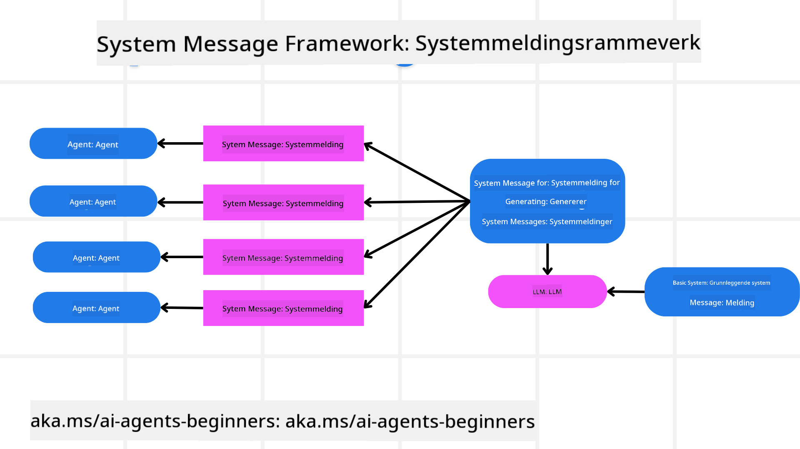
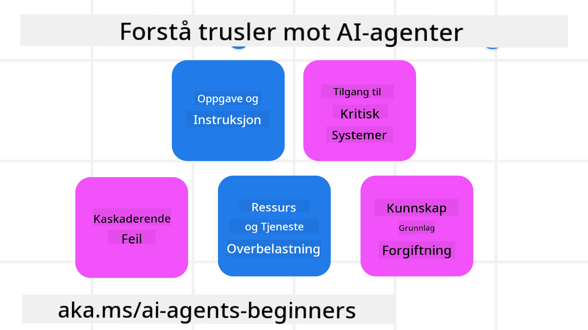
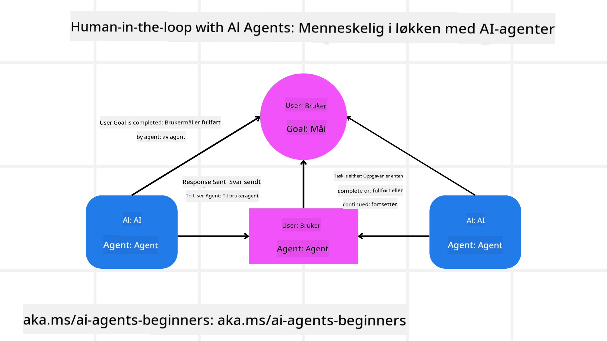

<!--
CO_OP_TRANSLATOR_METADATA:
{
  "original_hash": "f57852cac3a86c4a5ef47f793cc12178",
  "translation_date": "2025-07-12T10:28:29+00:00",
  "source_file": "06-building-trustworthy-agents/README.md",
  "language_code": "no"
}
-->
[](https://youtu.be/iZKkMEGBCUQ?si=Q-kEbcyHUMPoHp8L)

> _(Klikk på bildet over for å se videoen av denne leksjonen)_

# Bygge pålitelige AI-agenter

## Introduksjon

Denne leksjonen vil dekke:

- Hvordan bygge og distribuere trygge og effektive AI-agenter
- Viktige sikkerhetshensyn ved utvikling av AI-agenter
- Hvordan ivareta data- og brukerpersonvern ved utvikling av AI-agenter

## Læringsmål

Etter å ha fullført denne leksjonen vil du kunne:

- Identifisere og redusere risikoer ved opprettelse av AI-agenter
- Implementere sikkerhetstiltak for å sikre riktig håndtering av data og tilgang
- Lage AI-agenter som ivaretar dataprivacy og gir en god brukeropplevelse

## Sikkerhet

La oss først se på hvordan vi bygger trygge agentbaserte applikasjoner. Sikkerhet betyr at AI-agenten fungerer som forventet. Som utviklere av agentbaserte applikasjoner har vi metoder og verktøy for å maksimere sikkerheten:

### Bygge et rammeverk for systemmeldinger

Hvis du noen gang har bygget en AI-applikasjon med Large Language Models (LLMs), vet du hvor viktig det er å designe en robust systemprompt eller systemmelding. Disse promptene fastsetter metareglene, instruksjonene og retningslinjene for hvordan LLM-en skal samhandle med brukeren og dataene.

For AI-agenter er systemprompten enda viktigere, siden AI-agentene trenger svært spesifikke instruksjoner for å utføre oppgavene vi har designet for dem.

For å lage skalerbare systemprompter kan vi bruke et rammeverk for systemmeldinger til å bygge en eller flere agenter i applikasjonen vår:



#### Steg 1: Lag en meta systemmelding

Meta-prompten vil bli brukt av en LLM for å generere systemprompter for agentene vi lager. Vi designer den som en mal slik at vi effektivt kan lage flere agenter ved behov.

Her er et eksempel på en meta systemmelding vi gir til LLM-en:

```plaintext
You are an expert at creating AI agent assistants. 
You will be provided a company name, role, responsibilities and other
information that you will use to provide a system prompt for.
To create the system prompt, be descriptive as possible and provide a structure that a system using an LLM can better understand the role and responsibilities of the AI assistant. 
```

#### Steg 2: Lag en grunnleggende prompt

Neste steg er å lage en grunnleggende prompt som beskriver AI-agenten. Du bør inkludere agentens rolle, oppgavene agenten skal utføre, og eventuelle andre ansvarsområder agenten har.

Her er et eksempel:

```plaintext
You are a travel agent for Contoso Travel that is great at booking flights for customers. To help customers you can perform the following tasks: lookup available flights, book flights, ask for preferences in seating and times for flights, cancel any previously booked flights and alert customers on any delays or cancellations of flights.  
```

#### Steg 3: Gi grunnleggende systemmelding til LLM

Nå kan vi optimalisere denne systemmeldingen ved å gi meta systemmeldingen som systemmelding, sammen med vår grunnleggende systemmelding.

Dette vil gi en systemmelding som er bedre tilpasset for å veilede AI-agentene våre:

```markdown
**Company Name:** Contoso Travel  
**Role:** Travel Agent Assistant

**Objective:**  
You are an AI-powered travel agent assistant for Contoso Travel, specializing in booking flights and providing exceptional customer service. Your main goal is to assist customers in finding, booking, and managing their flights, all while ensuring that their preferences and needs are met efficiently.

**Key Responsibilities:**

1. **Flight Lookup:**
    
    - Assist customers in searching for available flights based on their specified destination, dates, and any other relevant preferences.
    - Provide a list of options, including flight times, airlines, layovers, and pricing.
2. **Flight Booking:**
    
    - Facilitate the booking of flights for customers, ensuring that all details are correctly entered into the system.
    - Confirm bookings and provide customers with their itinerary, including confirmation numbers and any other pertinent information.
3. **Customer Preference Inquiry:**
    
    - Actively ask customers for their preferences regarding seating (e.g., aisle, window, extra legroom) and preferred times for flights (e.g., morning, afternoon, evening).
    - Record these preferences for future reference and tailor suggestions accordingly.
4. **Flight Cancellation:**
    
    - Assist customers in canceling previously booked flights if needed, following company policies and procedures.
    - Notify customers of any necessary refunds or additional steps that may be required for cancellations.
5. **Flight Monitoring:**
    
    - Monitor the status of booked flights and alert customers in real-time about any delays, cancellations, or changes to their flight schedule.
    - Provide updates through preferred communication channels (e.g., email, SMS) as needed.

**Tone and Style:**

- Maintain a friendly, professional, and approachable demeanor in all interactions with customers.
- Ensure that all communication is clear, informative, and tailored to the customer's specific needs and inquiries.

**User Interaction Instructions:**

- Respond to customer queries promptly and accurately.
- Use a conversational style while ensuring professionalism.
- Prioritize customer satisfaction by being attentive, empathetic, and proactive in all assistance provided.

**Additional Notes:**

- Stay updated on any changes to airline policies, travel restrictions, and other relevant information that could impact flight bookings and customer experience.
- Use clear and concise language to explain options and processes, avoiding jargon where possible for better customer understanding.

This AI assistant is designed to streamline the flight booking process for customers of Contoso Travel, ensuring that all their travel needs are met efficiently and effectively.

```

#### Steg 4: Iterer og forbedre

Verdien av dette rammeverket for systemmeldinger er at det gjør det enklere å skalere opp opprettelsen av systemmeldinger for flere agenter, samtidig som du kan forbedre systemmeldingene over tid. Det er sjelden du får en systemmelding som fungerer perfekt første gang for hele bruksområdet ditt. Å kunne gjøre små justeringer og forbedringer ved å endre den grunnleggende systemmeldingen og kjøre den gjennom systemet gjør det mulig å sammenligne og evaluere resultatene.

## Forstå trusler

For å bygge pålitelige AI-agenter er det viktig å forstå og redusere risikoer og trusler mot AI-agenten din. La oss se på noen av de ulike truslene mot AI-agenter og hvordan du kan planlegge og forberede deg bedre på dem.



### Oppgave og instruksjon

**Beskrivelse:** Angripere prøver å endre instruksjonene eller målene til AI-agenten gjennom prompting eller manipulering av input.

**Reduksjon:** Utfør valideringskontroller og inputfiltre for å oppdage potensielt farlige prompt før de behandles av AI-agenten. Siden slike angrep vanligvis krever hyppig interaksjon med agenten, kan det å begrense antall samtalerunder være en annen måte å forhindre denne typen angrep på.

### Tilgang til kritiske systemer

**Beskrivelse:** Hvis en AI-agent har tilgang til systemer og tjenester som lagrer sensitiv data, kan angripere kompromittere kommunikasjonen mellom agenten og disse tjenestene. Dette kan være direkte angrep eller indirekte forsøk på å hente informasjon om disse systemene via agenten.

**Reduksjon:** AI-agenter bør kun ha tilgang til systemer etter behov for å forhindre denne typen angrep. Kommunikasjonen mellom agenten og systemet bør også være sikker. Implementering av autentisering og tilgangskontroll er en annen måte å beskytte denne informasjonen på.

### Overbelastning av ressurser og tjenester

**Beskrivelse:** AI-agenter kan bruke ulike verktøy og tjenester for å utføre oppgaver. Angripere kan utnytte dette ved å sende et høyt volum av forespørsler gjennom AI-agenten, noe som kan føre til systemfeil eller høye kostnader.

**Reduksjon:** Innfør retningslinjer for å begrense antall forespørsler en AI-agent kan sende til en tjeneste. Å begrense antall samtalerunder og forespørsler til AI-agenten er også en måte å forhindre denne typen angrep på.

### Forgiftning av kunnskapsbase

**Beskrivelse:** Denne typen angrep retter seg ikke direkte mot AI-agenten, men mot kunnskapsbasen og andre tjenester som AI-agenten bruker. Dette kan innebære å korrumpere dataene eller informasjonen AI-agenten bruker for å utføre oppgaver, noe som kan føre til partiske eller uønskede svar til brukeren.

**Reduksjon:** Utfør regelmessig verifisering av dataene AI-agenten bruker i sine arbeidsflyter. Sørg for at tilgangen til disse dataene er sikker og kun kan endres av betrodde personer for å unngå denne typen angrep.

### Kaskaderende feil

**Beskrivelse:** AI-agenter bruker ulike verktøy og tjenester for å utføre oppgaver. Feil forårsaket av angripere kan føre til svikt i andre systemer som AI-agenten er koblet til, noe som gjør angrepet mer omfattende og vanskeligere å feilsøke.

**Reduksjon:** En metode for å unngå dette er å la AI-agenten operere i et begrenset miljø, for eksempel ved å utføre oppgaver i en Docker-container, for å forhindre direkte systemangrep. Å lage fallback-mekanismer og retry-logikk når visse systemer svarer med feil, er en annen måte å forhindre større systemfeil på.

## Human-in-the-Loop

En annen effektiv måte å bygge pålitelige AI-agent-systemer på er å bruke Human-in-the-loop. Dette skaper en flyt der brukere kan gi tilbakemeldinger til agentene underveis. Brukerne fungerer i praksis som agenter i et multi-agent-system ved å gi godkjenning eller avslutte den pågående prosessen.



Her er et kodeeksempel som bruker AutoGen for å vise hvordan dette konseptet implementeres:

```python

# Create the agents.
model_client = OpenAIChatCompletionClient(model="gpt-4o-mini")
assistant = AssistantAgent("assistant", model_client=model_client)
user_proxy = UserProxyAgent("user_proxy", input_func=input)  # Use input() to get user input from console.

# Create the termination condition which will end the conversation when the user says "APPROVE".
termination = TextMentionTermination("APPROVE")

# Create the team.
team = RoundRobinGroupChat([assistant, user_proxy], termination_condition=termination)

# Run the conversation and stream to the console.
stream = team.run_stream(task="Write a 4-line poem about the ocean.")
# Use asyncio.run(...) when running in a script.
await Console(stream)

```

## Konklusjon

Å bygge pålitelige AI-agenter krever nøye design, robuste sikkerhetstiltak og kontinuerlig forbedring. Ved å implementere strukturerte meta-promptingsystemer, forstå potensielle trusler og anvende tiltak for å redusere risiko, kan utviklere lage AI-agenter som både er trygge og effektive. I tillegg sikrer en human-in-the-loop-tilnærming at AI-agentene forblir i tråd med brukerens behov samtidig som risiko minimeres. Etter hvert som AI utvikler seg, vil en proaktiv holdning til sikkerhet, personvern og etiske hensyn være avgjørende for å bygge tillit og pålitelighet i AI-drevne systemer.

## Ekstra ressurser

- <a href="https://learn.microsoft.com/azure/ai-studio/responsible-use-of-ai-overview" target="_blank">Responsible AI overview</a>
- <a href="https://learn.microsoft.com/azure/ai-studio/concepts/evaluation-approach-gen-ai" target="_blank">Evaluation of generative AI models and AI applications</a>
- <a href="https://learn.microsoft.com/azure/ai-services/openai/concepts/system-message?context=%2Fazure%2Fai-studio%2Fcontext%2Fcontext&tabs=top-techniques" target="_blank">Safety system messages</a>
- <a href="https://blogs.microsoft.com/wp-content/uploads/prod/sites/5/2022/06/Microsoft-RAI-Impact-Assessment-Template.pdf?culture=en-us&country=us" target="_blank">Risk Assessment Template</a>

## Forrige leksjon

[Agentic RAG](../05-agentic-rag/README.md)

## Neste leksjon

[Planning Design Pattern](../07-planning-design/README.md)

**Ansvarsfraskrivelse**:  
Dette dokumentet er oversatt ved hjelp av AI-oversettelsestjenesten [Co-op Translator](https://github.com/Azure/co-op-translator). Selv om vi streber etter nøyaktighet, vennligst vær oppmerksom på at automatiske oversettelser kan inneholde feil eller unøyaktigheter. Det opprinnelige dokumentet på originalspråket skal anses som den autoritative kilden. For kritisk informasjon anbefales profesjonell menneskelig oversettelse. Vi er ikke ansvarlige for eventuelle misforståelser eller feiltolkninger som oppstår ved bruk av denne oversettelsen.