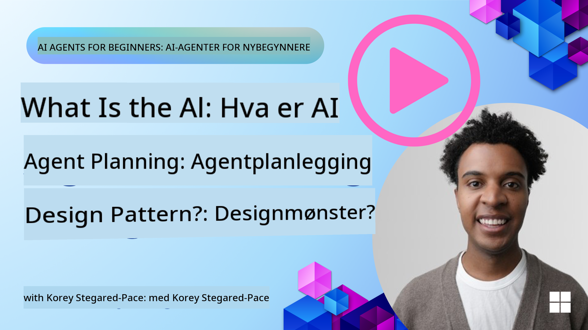
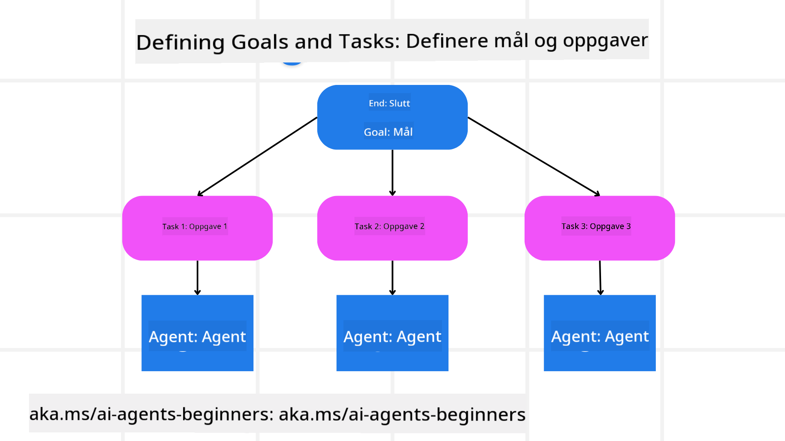

<!--
CO_OP_TRANSLATOR_METADATA:
{
  "original_hash": "a28d30590704ea13b6a08d4793cf9c2b",
  "translation_date": "2025-08-29T15:57:36+00:00",
  "source_file": "07-planning-design/README.md",
  "language_code": "no"
}
-->
[](https://youtu.be/kPfJ2BrBCMY?si=9pYpPXp0sSbK91Dr)

> _(Klikk på bildet ovenfor for å se videoen til denne leksjonen)_

# Planleggingsdesign

## Introduksjon

Denne leksjonen vil dekke

* Definere et klart overordnet mål og dele opp en kompleks oppgave i håndterbare oppgaver.
* Utnytte strukturert output for mer pålitelige og maskinlesbare svar.
* Bruke en hendelsesdrevet tilnærming for å håndtere dynamiske oppgaver og uventede innspill.

## Læringsmål

Etter å ha fullført denne leksjonen, vil du ha forståelse for:

* Identifisere og sette et overordnet mål for en AI-agent, slik at den tydelig vet hva som skal oppnås.
* Dele opp en kompleks oppgave i håndterbare deloppgaver og organisere dem i en logisk rekkefølge.
* Utstyre agenter med riktige verktøy (f.eks. søkeverktøy eller dataanalyseverktøy), bestemme når og hvordan de skal brukes, og håndtere uventede situasjoner som oppstår.
* Evaluere resultatene av deloppgaver, måle ytelse og iterere på handlinger for å forbedre det endelige resultatet.

## Definere det overordnede målet og dele opp en oppgave



De fleste oppgaver i den virkelige verden er for komplekse til å løses i ett enkelt steg. En AI-agent trenger et konsist mål for å veilede sin planlegging og handlinger. For eksempel, vurder målet:

    "Lag en 3-dagers reiseplan."

Selv om det er enkelt å formulere, trenger det fortsatt presisering. Jo klarere målet er, desto bedre kan agenten (og eventuelle menneskelige samarbeidspartnere) fokusere på å oppnå riktig resultat, som å lage en omfattende reiseplan med flyalternativer, hotellanbefalinger og aktivitetsforslag.

### Oppgavedekomponering

Store eller intrikate oppgaver blir mer håndterbare når de deles opp i mindre, målrettede deloppgaver.
For reiseplaneksempelet kan du dele opp målet i:

* Flybestilling
* Hotellbestilling
* Bilutleie
* Personalisering

Hver deloppgave kan deretter håndteres av dedikerte agenter eller prosesser. Én agent kan spesialisere seg på å finne de beste flytilbudene, en annen kan fokusere på hotellbestillinger, og så videre. En koordinerende eller "nedstrøms" agent kan deretter samle disse resultatene til én sammenhengende reiseplan for sluttbrukeren.

Denne modulære tilnærmingen tillater også gradvise forbedringer. For eksempel kan du legge til spesialiserte agenter for matanbefalinger eller lokale aktivitetsforslag og finjustere reiseplanen over tid.

### Strukturert output

Store språkmodeller (LLMs) kan generere strukturert output (f.eks. JSON) som er enklere for nedstrøms agenter eller tjenester å analysere og behandle. Dette er spesielt nyttig i en multi-agent-kontekst, hvor vi kan utføre disse oppgavene etter at planleggingsoutputen er mottatt. Se dette for en rask oversikt.

Den følgende Python-koden viser en enkel planleggingsagent som deler opp et mål i deloppgaver og genererer en strukturert plan:

```python
from pydantic import BaseModel
from enum import Enum
from typing import List, Optional, Union
import json
import os
from typing import Optional
from pprint import pprint
from autogen_core.models import UserMessage, SystemMessage, AssistantMessage
from autogen_ext.models.azure import AzureAIChatCompletionClient
from azure.core.credentials import AzureKeyCredential

class AgentEnum(str, Enum):
    FlightBooking = "flight_booking"
    HotelBooking = "hotel_booking"
    CarRental = "car_rental"
    ActivitiesBooking = "activities_booking"
    DestinationInfo = "destination_info"
    DefaultAgent = "default_agent"
    GroupChatManager = "group_chat_manager"

# Travel SubTask Model
class TravelSubTask(BaseModel):
    task_details: str
    assigned_agent: AgentEnum  # we want to assign the task to the agent

class TravelPlan(BaseModel):
    main_task: str
    subtasks: List[TravelSubTask]
    is_greeting: bool

client = AzureAIChatCompletionClient(
    model="gpt-4o-mini",
    endpoint="https://models.inference.ai.azure.com",
    # To authenticate with the model you will need to generate a personal access token (PAT) in your GitHub settings.
    # Create your PAT token by following instructions here: https://docs.github.com/en/authentication/keeping-your-account-and-data-secure/managing-your-personal-access-tokens
    credential=AzureKeyCredential(os.environ["GITHUB_TOKEN"]),
    model_info={
        "json_output": False,
        "function_calling": True,
        "vision": True,
        "family": "unknown",
    },
)

# Define the user message
messages = [
    SystemMessage(content="""You are an planner agent.
    Your job is to decide which agents to run based on the user's request.
                      Provide your response in JSON format with the following structure:
{'main_task': 'Plan a family trip from Singapore to Melbourne.',
 'subtasks': [{'assigned_agent': 'flight_booking',
               'task_details': 'Book round-trip flights from Singapore to '
                               'Melbourne.'}
    Below are the available agents specialised in different tasks:
    - FlightBooking: For booking flights and providing flight information
    - HotelBooking: For booking hotels and providing hotel information
    - CarRental: For booking cars and providing car rental information
    - ActivitiesBooking: For booking activities and providing activity information
    - DestinationInfo: For providing information about destinations
    - DefaultAgent: For handling general requests""", source="system"),
    UserMessage(
        content="Create a travel plan for a family of 2 kids from Singapore to Melboune", source="user"),
]

response = await client.create(messages=messages, extra_create_args={"response_format": 'json_object'})

response_content: Optional[str] = response.content if isinstance(
    response.content, str) else None
if response_content is None:
    raise ValueError("Response content is not a valid JSON string" )

pprint(json.loads(response_content))

# # Ensure the response content is a valid JSON string before loading it
# response_content: Optional[str] = response.content if isinstance(
#     response.content, str) else None
# if response_content is None:
#     raise ValueError("Response content is not a valid JSON string")

# # Print the response content after loading it as JSON
# pprint(json.loads(response_content))

# Validate the response content with the MathReasoning model
# TravelPlan.model_validate(json.loads(response_content))
```

### Planleggingsagent med multi-agent orkestrering

I dette eksempelet mottar en Semantic Router Agent en brukerforespørsel (f.eks. "Jeg trenger en hotellplan for reisen min.").

Planleggeren gjør deretter følgende:

* Mottar hotellplanen: Planleggeren tar brukerens melding og, basert på et systemprompt (inkludert detaljer om tilgjengelige agenter), genererer en strukturert reiseplan.
* Lister opp agenter og deres verktøy: Agentregisteret inneholder en liste over agenter (f.eks. for fly, hotell, bilutleie og aktiviteter) sammen med funksjonene eller verktøyene de tilbyr.
* Ruter planen til de respektive agentene: Avhengig av antall deloppgaver, sender planleggeren enten meldingen direkte til en dedikert agent (for enkeloppgave-scenarier) eller koordinerer via en gruppechat-manager for multi-agent samarbeid.
* Oppsummerer resultatet: Til slutt oppsummerer planleggeren den genererte planen for klarhet.

Den følgende Python-koden illustrerer disse trinnene:

```python

from pydantic import BaseModel

from enum import Enum
from typing import List, Optional, Union

class AgentEnum(str, Enum):
    FlightBooking = "flight_booking"
    HotelBooking = "hotel_booking"
    CarRental = "car_rental"
    ActivitiesBooking = "activities_booking"
    DestinationInfo = "destination_info"
    DefaultAgent = "default_agent"
    GroupChatManager = "group_chat_manager"

# Travel SubTask Model

class TravelSubTask(BaseModel):
    task_details: str
    assigned_agent: AgentEnum # we want to assign the task to the agent

class TravelPlan(BaseModel):
    main_task: str
    subtasks: List[TravelSubTask]
    is_greeting: bool
import json
import os
from typing import Optional

from autogen_core.models import UserMessage, SystemMessage, AssistantMessage
from autogen_ext.models.openai import AzureOpenAIChatCompletionClient

# Create the client with type-checked environment variables

client = AzureOpenAIChatCompletionClient(
    azure_deployment=os.getenv("AZURE_OPENAI_DEPLOYMENT_NAME"),
    model=os.getenv("AZURE_OPENAI_DEPLOYMENT_NAME"),
    api_version=os.getenv("AZURE_OPENAI_API_VERSION"),
    azure_endpoint=os.getenv("AZURE_OPENAI_ENDPOINT"),
    api_key=os.getenv("AZURE_OPENAI_API_KEY"),
)

from pprint import pprint

# Define the user message

messages = [
    SystemMessage(content="""You are an planner agent.
    Your job is to decide which agents to run based on the user's request.
    Below are the available agents specialized in different tasks:
    - FlightBooking: For booking flights and providing flight information
    - HotelBooking: For booking hotels and providing hotel information
    - CarRental: For booking cars and providing car rental information
    - ActivitiesBooking: For booking activities and providing activity information
    - DestinationInfo: For providing information about destinations
    - DefaultAgent: For handling general requests""", source="system"),
    UserMessage(content="Create a travel plan for a family of 2 kids from Singapore to Melbourne", source="user"),
]

response = await client.create(messages=messages, extra_create_args={"response_format": TravelPlan})

# Ensure the response content is a valid JSON string before loading it

response_content: Optional[str] = response.content if isinstance(response.content, str) else None
if response_content is None:
    raise ValueError("Response content is not a valid JSON string")

# Print the response content after loading it as JSON

pprint(json.loads(response_content))
```

Det som følger er output fra den forrige koden, og du kan deretter bruke denne strukturerte outputen til å rute til `assigned_agent` og oppsummere reiseplanen for sluttbrukeren.

```json
{
    "is_greeting": "False",
    "main_task": "Plan a family trip from Singapore to Melbourne.",
    "subtasks": [
        {
            "assigned_agent": "flight_booking",
            "task_details": "Book round-trip flights from Singapore to Melbourne."
        },
        {
            "assigned_agent": "hotel_booking",
            "task_details": "Find family-friendly hotels in Melbourne."
        },
        {
            "assigned_agent": "car_rental",
            "task_details": "Arrange a car rental suitable for a family of four in Melbourne."
        },
        {
            "assigned_agent": "activities_booking",
            "task_details": "List family-friendly activities in Melbourne."
        },
        {
            "assigned_agent": "destination_info",
            "task_details": "Provide information about Melbourne as a travel destination."
        }
    ]
}
```

En eksempelnotatbok med den forrige koden er tilgjengelig [her](07-autogen.ipynb).

### Iterativ planlegging

Noen oppgaver krever en frem-og-tilbake-prosess eller re-planlegging, hvor resultatet av én deloppgave påvirker den neste. For eksempel, hvis agenten oppdager et uventet dataformat mens den bestiller fly, kan den måtte tilpasse strategien før den går videre til hotellbestillinger.

I tillegg kan brukerfeedback (f.eks. en menneskelig beslutning om at de foretrekker et tidligere fly) utløse en delvis re-planlegging. Denne dynamiske, iterative tilnærmingen sikrer at den endelige løsningen samsvarer med virkelige begrensninger og utviklende brukerpreferanser.

f.eks. eksempelkode

```python
from autogen_core.models import UserMessage, SystemMessage, AssistantMessage
#.. same as previous code and pass on the user history, current plan
messages = [
    SystemMessage(content="""You are a planner agent to optimize the
    Your job is to decide which agents to run based on the user's request.
    Below are the available agents specialized in different tasks:
    - FlightBooking: For booking flights and providing flight information
    - HotelBooking: For booking hotels and providing hotel information
    - CarRental: For booking cars and providing car rental information
    - ActivitiesBooking: For booking activities and providing activity information
    - DestinationInfo: For providing information about destinations
    - DefaultAgent: For handling general requests""", source="system"),
    UserMessage(content="Create a travel plan for a family of 2 kids from Singapore to Melbourne", source="user"),
    AssistantMessage(content=f"Previous travel plan - {TravelPlan}", source="assistant")
]
# .. re-plan and send the tasks to respective agents
```

For mer omfattende planlegging, sjekk ut Magnetic One for å løse komplekse oppgaver.

## Oppsummering

I denne artikkelen har vi sett på et eksempel på hvordan vi kan lage en planlegger som dynamisk kan velge de tilgjengelige agentene som er definert. Outputen fra planleggeren deler opp oppgavene og tildeler agentene slik at de kan utføres. Det antas at agentene har tilgang til funksjonene/verktøyene som kreves for å utføre oppgaven. I tillegg til agentene kan du inkludere andre mønstre som refleksjon, oppsummering og rundgang-chat for ytterligere tilpasning.

## Tilleggsressurser

* AutoGen Magnetic One - Et generalist multi-agent system for å løse komplekse oppgaver og har oppnådd imponerende resultater på flere utfordrende agent-benchmarks. Referanse: . I denne implementeringen lager orkestratoren en oppgavespesifikk plan og delegerer disse oppgavene til de tilgjengelige agentene. I tillegg til planlegging bruker orkestratoren også en sporingsmekanisme for å overvåke fremdriften av oppgaven og re-planlegge etter behov.

### Har du flere spørsmål om planleggingsdesignmønsteret?

Bli med i [Azure AI Foundry Discord](https://aka.ms/ai-agents/discord) for å møte andre elever, delta på kontortimer og få svar på spørsmålene dine om AI-agenter.

## Forrige leksjon

[Bygge pålitelige AI-agenter](../06-building-trustworthy-agents/README.md)

## Neste leksjon

[Multi-agent designmønster](../08-multi-agent/README.md)

---

**Ansvarsfraskrivelse**:  
Dette dokumentet er oversatt ved hjelp av AI-oversettelsestjenesten [Co-op Translator](https://github.com/Azure/co-op-translator). Selv om vi streber etter nøyaktighet, vær oppmerksom på at automatiserte oversettelser kan inneholde feil eller unøyaktigheter. Det originale dokumentet på sitt opprinnelige språk bør anses som den autoritative kilden. For kritisk informasjon anbefales profesjonell menneskelig oversettelse. Vi er ikke ansvarlige for misforståelser eller feiltolkninger som oppstår ved bruk av denne oversettelsen.