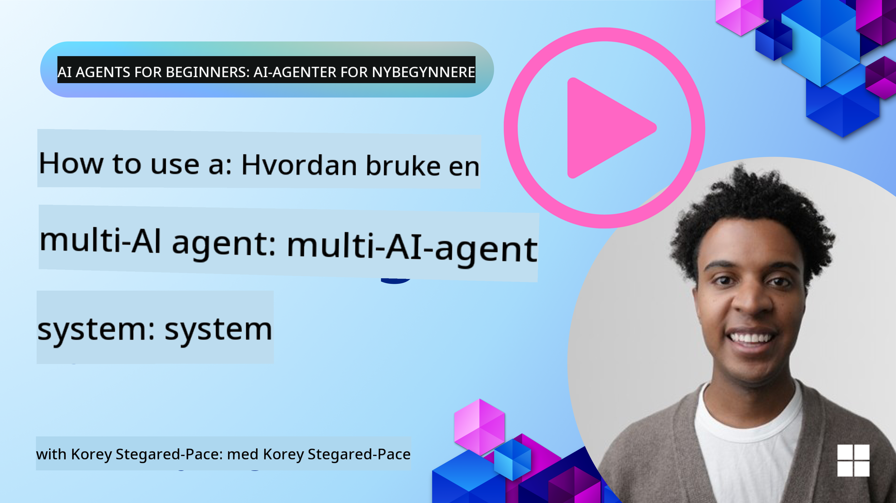
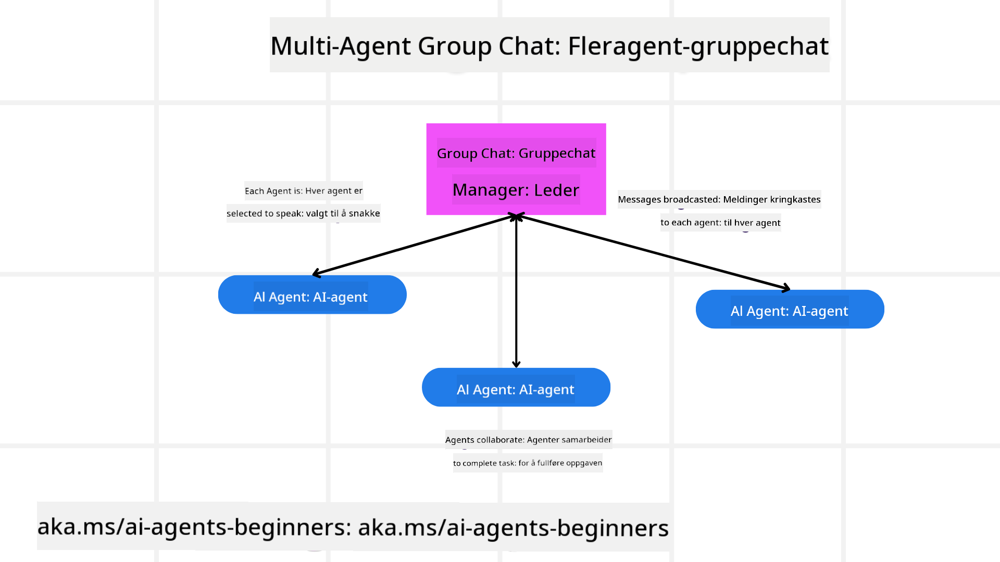
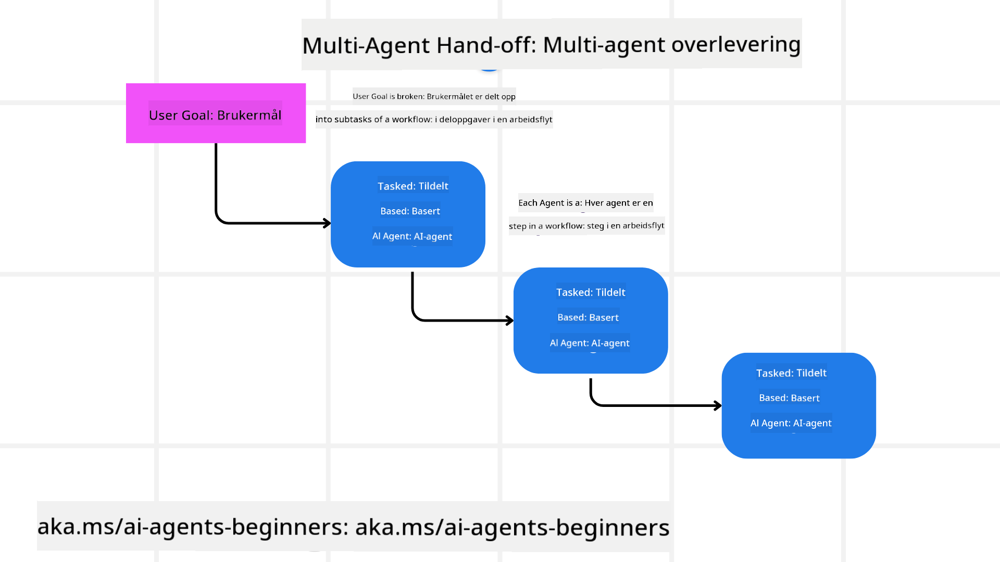
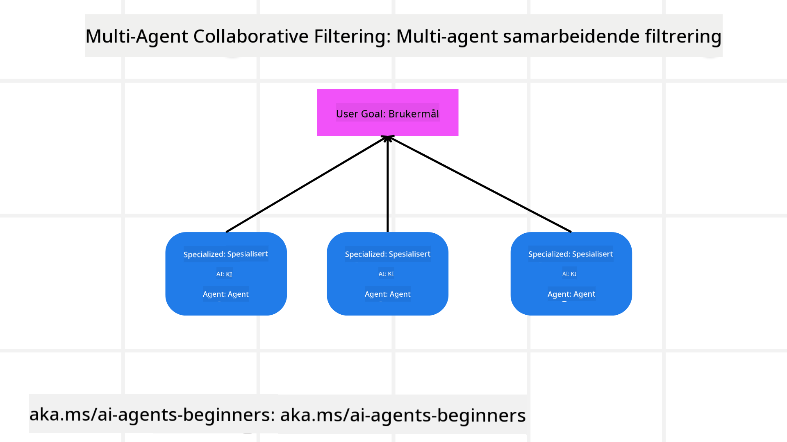

<!--
CO_OP_TRANSLATOR_METADATA:
{
  "original_hash": "c692a8975d7d5b99575a553de1c5e8a7",
  "translation_date": "2025-07-12T11:14:43+00:00",
  "source_file": "08-multi-agent/README.md",
  "language_code": "no"
}
-->

> _(Klikk på bildet over for å se video av denne leksjonen)_

# Multi-agent designmønstre

Så snart du begynner å jobbe med et prosjekt som involverer flere agenter, må du vurdere multi-agent designmønsteret. Det kan imidlertid ikke være umiddelbart klart når man skal gå over til multi-agenter og hva fordelene er.

## Introduksjon

I denne leksjonen ønsker vi å svare på følgende spørsmål:

- Hvilke scenarier passer for bruk av multi-agenter?
- Hva er fordelene med å bruke flere agenter fremfor bare én enkelt agent som utfører flere oppgaver?
- Hva er byggesteinene for å implementere multi-agent designmønsteret?
- Hvordan får vi oversikt over hvordan de flere agentene samhandler med hverandre?

## Læringsmål

Etter denne leksjonen skal du kunne:

- Identifisere scenarier hvor multi-agenter er aktuelle
- Gjenkjenne fordelene ved å bruke flere agenter fremfor en enkelt agent
- Forstå byggesteinene for implementering av multi-agent designmønsteret

Hva er det større bildet?

*Multi-agenter er et designmønster som gjør det mulig for flere agenter å samarbeide for å nå et felles mål*.

Dette mønsteret brukes mye innen ulike felt, inkludert robotikk, autonome systemer og distribuert databehandling.

## Scenarier hvor multi-agenter er aktuelle

Så, hvilke scenarier er gode bruksområder for multi-agenter? Svaret er at det finnes mange situasjoner hvor det er fordelaktig å bruke flere agenter, spesielt i følgende tilfeller:

- **Store arbeidsmengder**: Store arbeidsmengder kan deles opp i mindre oppgaver og tildeles forskjellige agenter, noe som muliggjør parallell behandling og raskere ferdigstillelse. Et eksempel på dette er ved store databehandlingsoppgaver.
- **Komplekse oppgaver**: Komplekse oppgaver, som store arbeidsmengder, kan brytes ned i mindre deloppgaver og tildeles ulike agenter, hvor hver spesialiserer seg på en bestemt del av oppgaven. Et godt eksempel er autonome kjøretøy hvor forskjellige agenter håndterer navigasjon, hinderdeteksjon og kommunikasjon med andre kjøretøy.
- **Mangfoldig ekspertise**: Ulike agenter kan ha ulik ekspertise, noe som gjør at de kan håndtere forskjellige aspekter av en oppgave mer effektivt enn en enkelt agent. Et godt eksempel her er innen helsevesenet, hvor agenter kan håndtere diagnostikk, behandlingsplaner og pasientovervåkning.

## Fordeler med å bruke flere agenter fremfor en enkelt agent

Et enkelt agentsystem kan fungere godt for enkle oppgaver, men for mer komplekse oppgaver kan bruk av flere agenter gi flere fordeler:

- **Spesialisering**: Hver agent kan spesialiseres på en bestemt oppgave. Manglende spesialisering i en enkelt agent betyr at du har en agent som kan gjøre alt, men som kan bli forvirret når den møter en kompleks oppgave. Den kan for eksempel ende opp med å gjøre en oppgave den ikke er best egnet for.
- **Skalerbarhet**: Det er enklere å skalere systemer ved å legge til flere agenter enn å overbelaste en enkelt agent.
- **Feiltoleranse**: Hvis en agent feiler, kan de andre fortsette å fungere, noe som sikrer systemets pålitelighet.

La oss ta et eksempel: la oss bestille en reise for en bruker. Et enkelt agentsystem må håndtere alle aspekter av reisebestillingsprosessen, fra å finne fly til å bestille hotell og leiebil. For å få til dette med en enkelt agent, må agenten ha verktøy for å håndtere alle disse oppgavene. Dette kan føre til et komplekst og monolittisk system som er vanskelig å vedlikeholde og skalere. Et multi-agent system, derimot, kan ha forskjellige agenter som er spesialisert på å finne fly, bestille hotell og leiebil. Dette gjør systemet mer modulært, enklere å vedlikeholde og skalerbart.

Sammenlign dette med et reisebyrå drevet som en liten lokal butikk versus et reisebyrå drevet som en franchise. Den lille butikken ville hatt en enkelt agent som håndterer alle aspekter av reisebestillingen, mens franchisen ville hatt forskjellige agenter som håndterer ulike deler av prosessen.

## Byggesteiner for implementering av multi-agent designmønsteret

Før du kan implementere multi-agent designmønsteret, må du forstå byggesteinene som utgjør mønsteret.

La oss gjøre dette mer konkret ved å igjen se på eksempelet med å bestille en reise for en bruker. I dette tilfellet vil byggesteinene inkludere:

- **Agentkommunikasjon**: Agenter for å finne fly, bestille hotell og leiebil må kommunisere og dele informasjon om brukerens preferanser og begrensninger. Du må bestemme protokoller og metoder for denne kommunikasjonen. Konkret betyr dette at agenten som finner fly må kommunisere med agenten som bestiller hotell for å sikre at hotellet er bestilt for de samme datoene som flyet. Det betyr at agentene må dele informasjon om brukerens reisedatoer, noe som innebærer at du må bestemme *hvilke agenter som deler informasjon og hvordan de deler den*.
- **Koordineringsmekanismer**: Agentene må koordinere sine handlinger for å sikre at brukerens preferanser og begrensninger blir oppfylt. En brukerpreferanse kan være at de ønsker et hotell nær flyplassen, mens en begrensning kan være at leiebiler kun er tilgjengelige på flyplassen. Dette betyr at agenten som bestiller hotell må koordinere med agenten som bestiller leiebil for å sikre at brukerens preferanser og begrensninger blir ivaretatt. Du må altså bestemme *hvordan agentene koordinerer sine handlinger*.
- **Agentarkitektur**: Agentene må ha en intern struktur for å ta beslutninger og lære av sine interaksjoner med brukeren. Dette betyr at agenten som finner fly må ha en intern struktur for å ta beslutninger om hvilke fly som skal anbefales til brukeren. Du må bestemme *hvordan agentene tar beslutninger og lærer av sine interaksjoner med brukeren*. Eksempler på hvordan en agent lærer og forbedrer seg kan være at agenten som finner fly bruker en maskinlæringsmodell for å anbefale fly basert på brukerens tidligere preferanser.
- **Synlighet i multi-agent interaksjoner**: Du må ha oversikt over hvordan de flere agentene samhandler med hverandre. Dette betyr at du trenger verktøy og teknikker for å spore agentenes aktiviteter og interaksjoner. Dette kan være i form av logging- og overvåkingsverktøy, visualiseringsverktøy og ytelsesmetrikker.
- **Multi-agent mønstre**: Det finnes ulike mønstre for implementering av multi-agent systemer, som sentraliserte, desentraliserte og hybride arkitekturer. Du må velge det mønsteret som passer best for ditt brukstilfelle.
- **Menneske i løkken**: I de fleste tilfeller vil du ha et menneske i løkken, og du må instruere agentene om når de skal be om menneskelig inngripen. Dette kan være i form av at en bruker ber om et spesifikt hotell eller fly som agentene ikke har anbefalt, eller at de ber om bekreftelse før en fly- eller hotellbestilling.

## Synlighet i multi-agent interaksjoner

Det er viktig at du har oversikt over hvordan de flere agentene samhandler med hverandre. Denne oversikten er avgjørende for feilsøking, optimalisering og for å sikre systemets totale effektivitet. For å oppnå dette trenger du verktøy og teknikker for å spore agentenes aktiviteter og interaksjoner. Dette kan være i form av logging- og overvåkingsverktøy, visualiseringsverktøy og ytelsesmetrikker.

For eksempel, i tilfellet med å bestille en reise for en bruker, kan du ha et dashbord som viser statusen til hver agent, brukerens preferanser og begrensninger, og interaksjonene mellom agentene. Dette dashbordet kan vise brukerens reisedatoer, flyene som anbefales av flyagenten, hotellene som anbefales av hotellagenten, og leiebilene som anbefales av leiebilagenten. Dette gir deg en klar oversikt over hvordan agentene samhandler og om brukerens preferanser og begrensninger blir oppfylt.

La oss se nærmere på hver av disse aspektene.

- **Logging- og overvåkingsverktøy**: Du ønsker å loggføre hver handling som en agent utfører. En loggoppføring kan lagre informasjon om hvilken agent som utførte handlingen, hva handlingen var, tidspunktet for handlingen, og resultatet av handlingen. Denne informasjonen kan deretter brukes til feilsøking, optimalisering og mer.
- **Visualiseringsverktøy**: Visualiseringsverktøy kan hjelpe deg med å se interaksjonene mellom agentene på en mer intuitiv måte. For eksempel kan du ha en graf som viser informasjonsflyten mellom agentene. Dette kan hjelpe deg med å identifisere flaskehalser, ineffektiviteter og andre problemer i systemet.
- **Ytelsesmetrikker**: Ytelsesmetrikker kan hjelpe deg med å spore effektiviteten til multi-agent systemet. For eksempel kan du måle tiden det tar å fullføre en oppgave, antall oppgaver fullført per tidsenhet, og nøyaktigheten i anbefalingene agentene gir. Denne informasjonen kan hjelpe deg med å identifisere forbedringsområder og optimalisere systemet.

## Multi-agent mønstre

La oss gå gjennom noen konkrete mønstre vi kan bruke for å lage multi-agent apper. Her er noen interessante mønstre verdt å vurdere:

### Gruppchat

Dette mønsteret er nyttig når du vil lage en gruppechat-applikasjon hvor flere agenter kan kommunisere med hverandre. Typiske bruksområder for dette mønsteret inkluderer teamarbeid, kundestøtte og sosiale nettverk.

I dette mønsteret representerer hver agent en bruker i gruppechatten, og meldinger utveksles mellom agentene ved hjelp av en meldingsprotokoll. Agentene kan sende meldinger til gruppechatten, motta meldinger fra gruppechatten, og svare på meldinger fra andre agenter.

Dette mønsteret kan implementeres med en sentralisert arkitektur hvor alle meldinger rutes gjennom en sentral server, eller en desentralisert arkitektur hvor meldinger utveksles direkte.

### Overlevering

Dette mønsteret er nyttig når du vil lage en applikasjon hvor flere agenter kan overlevere oppgaver til hverandre.

Typiske bruksområder for dette mønsteret inkluderer kundestøtte, oppgavehåndtering og arbeidsflytautomatisering.

I dette mønsteret representerer hver agent en oppgave eller et steg i en arbeidsflyt, og agentene kan overlevere oppgaver til andre agenter basert på forhåndsdefinerte regler.

### Samarbeidende filtrering

Dette mønsteret er nyttig når du vil lage en applikasjon hvor flere agenter kan samarbeide for å gi anbefalinger til brukere.

Grunnen til at du vil at flere agenter skal samarbeide, er at hver agent kan ha ulik ekspertise og kan bidra til anbefalingsprosessen på forskjellige måter.

La oss ta et eksempel hvor en bruker ønsker en anbefaling på den beste aksjen å kjøpe på børsen.

- **Bransjeekspert**: En agent kan være ekspert på en spesifikk bransje.
- **Teknisk analyse**: En annen agent kan være ekspert på teknisk analyse.
- **Fundamental analyse**: Og en annen agent kan være ekspert på fundamental analyse. Ved å samarbeide kan disse agentene gi en mer helhetlig anbefaling til brukeren.

## Scenario: Refusjonsprosess

Tenk deg et scenario hvor en kunde prøver å få refusjon for et produkt. Det kan være ganske mange agenter involvert i denne prosessen, men la oss dele dem opp i agenter spesifikke for denne prosessen og generelle agenter som kan brukes i andre prosesser.

**Agenter spesifikke for refusjonsprosessen**:

Følgende er noen agenter som kan være involvert i refusjonsprosessen:

- **Kundeagent**: Denne agenten representerer kunden og er ansvarlig for å starte refusjonsprosessen.
- **Selgeragent**: Denne agenten representerer selgeren og er ansvarlig for å behandle refusjonen.
- **Betalingsagent**: Denne agenten representerer betalingsprosessen og er ansvarlig for å refundere kundens betaling.
- **Løsningsagent**: Denne agenten representerer løsningsprosessen og er ansvarlig for å løse eventuelle problemer som oppstår under refusjonsprosessen.
- **Compliance-agent**: Denne agenten representerer samsvarsprosessen og er ansvarlig for å sikre at refusjonsprosessen følger regelverk og retningslinjer.

**Generelle agenter**:

Disse agentene kan brukes i andre deler av virksomheten din.

- **Fraktagent**: Denne agenten representerer fraktprosessen og er ansvarlig for å sende produktet tilbake til selgeren. Denne agenten kan brukes både i refusjonsprosessen og for generell frakt av et produkt ved kjøp, for eksempel.
- **Tilbakemeldingsagent**: Denne agenten representerer tilbakemeldingsprosessen og er ansvarlig for å samle inn tilbakemeldinger fra kunden. Tilbakemeldinger kan samles inn når som helst, ikke bare under refusjonsprosessen.
- **Eskaleringsagent**: Denne agenten representerer eskaleringsprosessen og er ansvarlig for å eskalere problemer til et høyere støttenivå. Du kan bruke denne typen agent i enhver prosess hvor du trenger å eskalere et problem.
- **Varslingsagent**: Denne agenten representerer varslingsprosessen og er ansvarlig for å sende varsler til kunden på ulike stadier i refusjonsprosessen.
- **Analyseagent**: Denne agenten representerer analyseprosessen og er ansvarlig for å analysere data knyttet til refusjonsprosessen.
- **Revisjonsagent**: Denne agenten representerer revisjonsprosessen og er ansvarlig for å revidere refusjonsprosessen for å sikre at den gjennomføres korrekt.
- **Rapporteringsagent**: Denne agenten representerer rapporteringsprosessen og er ansvarlig for å generere rapporter om refusjonsprosessen.
- **Kunnskapsagent**: Denne agenten representerer kunnskapsprosessen og er ansvarlig for å vedlikeholde en kunnskapsbase med informasjon relatert til refusjonsprosessen. Denne agenten kan ha kunnskap både om refusjoner og andre deler av virksomheten din.
- **Sikkerhetsagent**: Denne agenten representerer sikkerhetsprosessen og er ansvarlig for å sikre sikkerheten i refusjonsprosessen.
- **Kvalitetsagent**: Denne agenten representerer kvalitetsprosessen og er ansvarlig for å sikre kvaliteten i refusjonsprosessen.

Det er ganske mange agenter listet opp tidligere, både for den spesifikke refusjonsprosessen og for de generelle agentene som kan brukes i andre deler av virksomheten din. Forhåpentligvis gir dette deg en idé om hvordan du kan bestemme hvilke agenter du skal bruke i ditt multi-agent system.

## Oppgave
## Forrige leksjon

[Planleggingsdesign](../07-planning-design/README.md)

## Neste leksjon

[Metakognisjon i AI-agenter](../09-metacognition/README.md)

**Ansvarsfraskrivelse**:  
Dette dokumentet er oversatt ved hjelp av AI-oversettelsestjenesten [Co-op Translator](https://github.com/Azure/co-op-translator). Selv om vi streber etter nøyaktighet, vennligst vær oppmerksom på at automatiske oversettelser kan inneholde feil eller unøyaktigheter. Det opprinnelige dokumentet på originalspråket skal anses som den autoritative kilden. For kritisk informasjon anbefales profesjonell menneskelig oversettelse. Vi er ikke ansvarlige for eventuelle misforståelser eller feiltolkninger som oppstår ved bruk av denne oversettelsen.