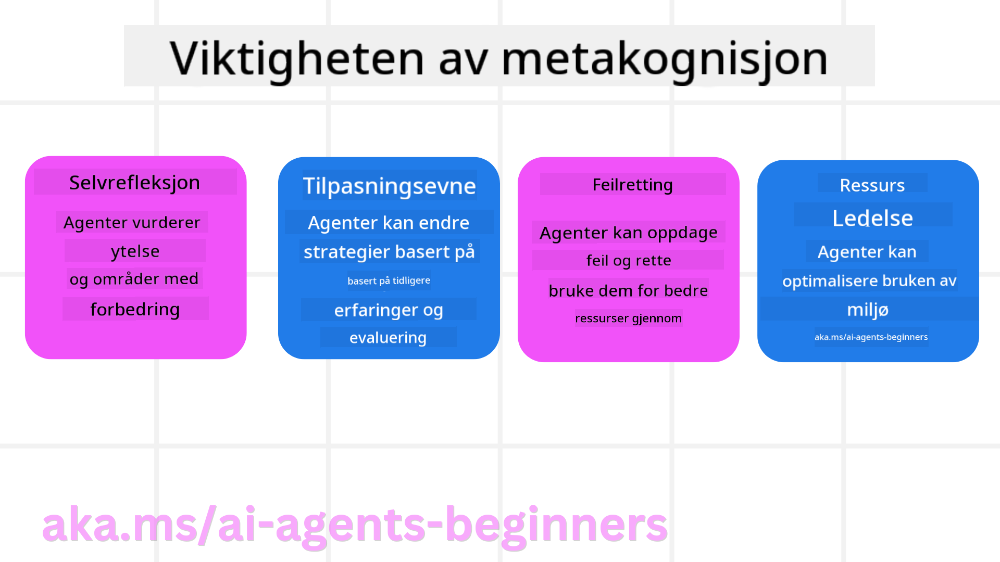
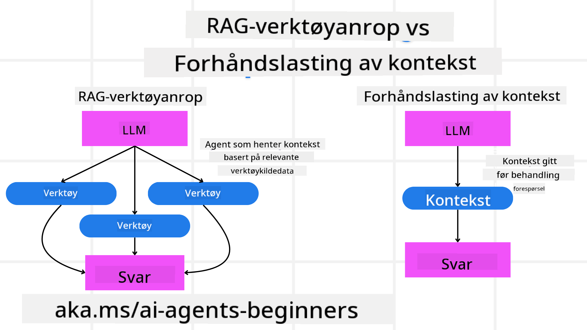

<!--
CO_OP_TRANSLATOR_METADATA:
{
  "original_hash": "5f0deef171fc3a68d5d3d770a8bfb03d",
  "translation_date": "2025-08-29T15:46:16+00:00",
  "source_file": "09-metacognition/README.md",
  "language_code": "no"
}
-->
[](https://youtu.be/His9R6gw6Ec?si=3_RMb8VprNvdLRhX)

> _(Klikk på bildet ovenfor for å se videoen av denne leksjonen)_
# Metakognisjon i AI-agenter

## Introduksjon

Velkommen til leksjonen om metakognisjon i AI-agenter! Dette kapittelet er laget for nybegynnere som er nysgjerrige på hvordan AI-agenter kan reflektere over sine egne tankeprosesser. Ved slutten av denne leksjonen vil du forstå nøkkelkonsepter og ha praktiske eksempler for å anvende metakognisjon i design av AI-agenter.

## Læringsmål

Etter å ha fullført denne leksjonen, vil du kunne:

1. Forstå implikasjonene av resonneringssløyfer i agentdefinisjoner.
2. Bruke planleggings- og evalueringsteknikker for å hjelpe selvkorrigerende agenter.
3. Lage dine egne agenter som kan manipulere kode for å utføre oppgaver.

## Introduksjon til metakognisjon

Metakognisjon refererer til de høyere ordens kognitive prosessene som innebærer å tenke over egen tenkning. For AI-agenter betyr dette evnen til å evaluere og justere sine handlinger basert på selvbevissthet og tidligere erfaringer. Metakognisjon, eller "å tenke om tenkning," er et viktig konsept i utviklingen av agentbaserte AI-systemer. Det innebærer at AI-systemer er klar over sine egne interne prosesser og kan overvåke, regulere og tilpasse sin oppførsel deretter. Akkurat som vi gjør når vi leser situasjonen eller ser på et problem. Denne selvbevisstheten kan hjelpe AI-systemer med å ta bedre beslutninger, identifisere feil og forbedre ytelsen over tid – igjen knyttet til Turing-testen og debatten om hvorvidt AI vil ta over.

I konteksten av agentbaserte AI-systemer kan metakognisjon bidra til å løse flere utfordringer, som:
- Transparens: Sikre at AI-systemer kan forklare sin resonnement og sine beslutninger.
- Resonnering: Forbedre evnen til AI-systemer til å syntetisere informasjon og ta gode beslutninger.
- Tilpasning: Tillate AI-systemer å tilpasse seg nye miljøer og endrede forhold.
- Persepsjon: Forbedre nøyaktigheten til AI-systemer i å gjenkjenne og tolke data fra omgivelsene.

### Hva er metakognisjon?

Metakognisjon, eller "å tenke om tenkning," er en høyere ordens kognitiv prosess som innebærer selvbevissthet og selvregulering av egne kognitive prosesser. Innen AI gir metakognisjon agenter muligheten til å evaluere og tilpasse sine strategier og handlinger, noe som fører til forbedrede problemløsnings- og beslutningsevner. Ved å forstå metakognisjon kan du designe AI-agenter som ikke bare er mer intelligente, men også mer tilpasningsdyktige og effektive. I ekte metakognisjon vil du se AI eksplisitt resonnere om sitt eget resonnement.

Eksempel: "Jeg prioriterte billigere flyreiser fordi... Jeg kan gå glipp av direktefly, så la meg sjekke på nytt."
Holde oversikt over hvordan eller hvorfor den valgte en bestemt rute.
- Notere at den gjorde feil fordi den overforlot seg på brukerpreferanser fra forrige gang, og derfor endrer sin beslutningsstrategi, ikke bare den endelige anbefalingen.
- Diagnostisere mønstre som: "Når jeg ser brukeren nevne 'for overfylt,' bør jeg ikke bare fjerne visse attraksjoner, men også reflektere over at min metode for å velge 'toppattraksjoner' er feil hvis jeg alltid rangerer etter popularitet."

### Viktigheten av metakognisjon i AI-agenter

Metakognisjon spiller en avgjørende rolle i design av AI-agenter av flere grunner:



- Selvrefleksjon: Agenter kan vurdere sin egen ytelse og identifisere områder for forbedring.
- Tilpasningsevne: Agenter kan endre sine strategier basert på tidligere erfaringer og endrede miljøer.
- Feilkorrigering: Agenter kan oppdage og korrigere feil autonomt, noe som fører til mer nøyaktige resultater.
- Ressursstyring: Agenter kan optimalisere bruken av ressurser, som tid og datakraft, ved å planlegge og evaluere sine handlinger.

## Komponenter i en AI-agent

Før vi dykker inn i metakognitive prosesser, er det viktig å forstå de grunnleggende komponentene i en AI-agent. En AI-agent består vanligvis av:

- Persona: Agentens personlighet og egenskaper, som definerer hvordan den interagerer med brukere.
- Verktøy: Agentens evner og funksjoner.
- Ferdigheter: Kunnskapen og ekspertisen agenten besitter.

Disse komponentene samarbeider for å skape en "ekspertisenhet" som kan utføre spesifikke oppgaver.

**Eksempel**:
Tenk deg en reiseagent, agenttjenester som ikke bare planlegger ferien din, men også justerer sin vei basert på sanntidsdata og tidligere kundereiseopplevelser.

### Eksempel: Metakognisjon i en reiseagenttjeneste

Tenk deg at du designer en reiseagenttjeneste drevet av AI. Denne agenten, "Reiseagent," hjelper brukere med å planlegge feriene sine. For å inkludere metakognisjon må Reiseagent evaluere og justere sine handlinger basert på selvbevissthet og tidligere erfaringer. Slik kan metakognisjon spille en rolle:

#### Nåværende oppgave

Den nåværende oppgaven er å hjelpe en bruker med å planlegge en tur til Paris.

#### Steg for å fullføre oppgaven

1. **Samle brukerpreferanser**: Spør brukeren om reisedatoer, budsjett, interesser (f.eks. museer, mat, shopping) og eventuelle spesifikke krav.
2. **Hente informasjon**: Søk etter flyalternativer, overnatting, attraksjoner og restauranter som samsvarer med brukerens preferanser.
3. **Generere anbefalinger**: Gi en personlig reiserute med flydetaljer, hotellreservasjoner og foreslåtte aktiviteter.
4. **Justere basert på tilbakemeldinger**: Be brukeren om tilbakemelding på anbefalingene og gjør nødvendige justeringer.

#### Nødvendige ressurser

- Tilgang til databaser for fly- og hotellbestillinger.
- Informasjon om attraksjoner og restauranter i Paris.
- Brukerdata fra tidligere interaksjoner.

#### Erfaring og selvrefleksjon

Reiseagent bruker metakognisjon for å evaluere sin ytelse og lære av tidligere erfaringer. For eksempel:

1. **Analysere brukerens tilbakemeldinger**: Reiseagent vurderer tilbakemeldinger for å avgjøre hvilke anbefalinger som ble godt mottatt og hvilke som ikke ble det. Den justerer sine fremtidige forslag deretter.
2. **Tilpasningsevne**: Hvis en bruker tidligere har nevnt en misliking for overfylte steder, vil Reiseagent unngå å anbefale populære turiststeder i rushtiden i fremtiden.
3. **Feilkorrigering**: Hvis Reiseagent gjorde en feil i en tidligere bestilling, som å foreslå et hotell som var fullbooket, lærer den å sjekke tilgjengelighet mer grundig før den gir anbefalinger.

#### Praktisk utviklereksempel

Her er et forenklet eksempel på hvordan Reiseagents kode kan se ut når den inkluderer metakognisjon:

```python
class Travel_Agent:
    def __init__(self):
        self.user_preferences = {}
        self.experience_data = []

    def gather_preferences(self, preferences):
        self.user_preferences = preferences

    def retrieve_information(self):
        # Search for flights, hotels, and attractions based on preferences
        flights = search_flights(self.user_preferences)
        hotels = search_hotels(self.user_preferences)
        attractions = search_attractions(self.user_preferences)
        return flights, hotels, attractions

    def generate_recommendations(self):
        flights, hotels, attractions = self.retrieve_information()
        itinerary = create_itinerary(flights, hotels, attractions)
        return itinerary

    def adjust_based_on_feedback(self, feedback):
        self.experience_data.append(feedback)
        # Analyze feedback and adjust future recommendations
        self.user_preferences = adjust_preferences(self.user_preferences, feedback)

# Example usage
travel_agent = Travel_Agent()
preferences = {
    "destination": "Paris",
    "dates": "2025-04-01 to 2025-04-10",
    "budget": "moderate",
    "interests": ["museums", "cuisine"]
}
travel_agent.gather_preferences(preferences)
itinerary = travel_agent.generate_recommendations()
print("Suggested Itinerary:", itinerary)
feedback = {"liked": ["Louvre Museum"], "disliked": ["Eiffel Tower (too crowded)"]}
travel_agent.adjust_based_on_feedback(feedback)
```

#### Hvorfor metakognisjon er viktig

- **Selvrefleksjon**: Agenter kan analysere sin ytelse og identifisere områder for forbedring.
- **Tilpasningsevne**: Agenter kan endre strategier basert på tilbakemeldinger og endrede forhold.
- **Feilkorrigering**: Agenter kan autonomt oppdage og korrigere feil.
- **Ressursstyring**: Agenter kan optimalisere ressursbruk, som tid og datakraft.

Ved å inkludere metakognisjon kan Reiseagent gi mer personlige og nøyaktige reiseanbefalinger, noe som forbedrer den totale brukeropplevelsen.

---

## 2. Planlegging i agenter

Planlegging er en kritisk komponent i AI-agenters oppførsel. Det innebærer å skissere trinnene som trengs for å oppnå et mål, med hensyn til nåværende tilstand, ressurser og mulige hindringer.

### Elementer i planlegging

- **Nåværende oppgave**: Definer oppgaven tydelig.
- **Steg for å fullføre oppgaven**: Del opp oppgaven i håndterbare trinn.
- **Nødvendige ressurser**: Identifiser nødvendige ressurser.
- **Erfaring**: Bruk tidligere erfaringer til å informere planleggingen.

**Eksempel**:
Her er trinnene Reiseagent må ta for å effektivt hjelpe en bruker med å planlegge reisen:

### Steg for Reiseagent

1. **Samle brukerpreferanser**
   - Spør brukeren om detaljer om reisedatoer, budsjett, interesser og eventuelle spesifikke krav.
   - Eksempler: "Når planlegger du å reise?" "Hva er ditt budsjett?" "Hvilke aktiviteter liker du på ferie?"

2. **Hente informasjon**
   - Søk etter relevante reisealternativer basert på brukerens preferanser.
   - **Fly**: Se etter tilgjengelige fly innenfor brukerens budsjett og foretrukne reisedatoer.
   - **Overnatting**: Finn hoteller eller utleieboliger som samsvarer med brukerens preferanser for beliggenhet, pris og fasiliteter.
   - **Attraksjoner og restauranter**: Identifiser populære attraksjoner, aktiviteter og spisesteder som samsvarer med brukerens interesser.

3. **Generere anbefalinger**
   - Sett sammen den innhentede informasjonen til en personlig reiserute.
   - Gi detaljer som flyalternativer, hotellreservasjoner og foreslåtte aktiviteter, og sørg for å skreddersy anbefalingene til brukerens preferanser.

4. **Presentere reiseruten til brukeren**
   - Del den foreslåtte reiseruten med brukeren for gjennomgang.
   - Eksempel: "Her er en foreslått reiserute for din tur til Paris. Den inkluderer flydetaljer, hotellbestillinger og en liste over anbefalte aktiviteter og restauranter. Gi meg beskjed om hva du synes!"

5. **Samle tilbakemeldinger**
   - Be brukeren om tilbakemelding på den foreslåtte reiseruten.
   - Eksempler: "Liker du flyalternativene?" "Er hotellet egnet for dine behov?" "Er det noen aktiviteter du vil legge til eller fjerne?"

6. **Justere basert på tilbakemeldinger**
   - Endre reiseruten basert på brukerens tilbakemeldinger.
   - Gjør nødvendige endringer i fly-, overnattings- og aktivitetsanbefalinger for bedre å samsvare med brukerens preferanser.

7. **Endelig bekreftelse**
   - Presentere den oppdaterte reiseruten til brukeren for endelig bekreftelse.
   - Eksempel: "Jeg har gjort justeringene basert på tilbakemeldingene dine. Her er den oppdaterte reiseruten. Ser alt bra ut for deg?"

8. **Bestille og bekrefte reservasjoner**
   - Når brukeren godkjenner reiseruten, fortsett med å bestille fly, overnatting og eventuelle forhåndsplanlagte aktiviteter.
   - Send bekreftelsesdetaljer til brukeren.

9. **Gi løpende støtte**
   - Vær tilgjengelig for å hjelpe brukeren med eventuelle endringer eller tillegg før og under reisen.
   - Eksempel: "Hvis du trenger ytterligere hjelp under reisen, er det bare å ta kontakt med meg når som helst!"

### Eksempelinteraksjon

```python
class Travel_Agent:
    def __init__(self):
        self.user_preferences = {}
        self.experience_data = []

    def gather_preferences(self, preferences):
        self.user_preferences = preferences

    def retrieve_information(self):
        flights = search_flights(self.user_preferences)
        hotels = search_hotels(self.user_preferences)
        attractions = search_attractions(self.user_preferences)
        return flights, hotels, attractions

    def generate_recommendations(self):
        flights, hotels, attractions = self.retrieve_information()
        itinerary = create_itinerary(flights, hotels, attractions)
        return itinerary

    def adjust_based_on_feedback(self, feedback):
        self.experience_data.append(feedback)
        self.user_preferences = adjust_preferences(self.user_preferences, feedback)

# Example usage within a booing request
travel_agent = Travel_Agent()
preferences = {
    "destination": "Paris",
    "dates": "2025-04-01 to 2025-04-10",
    "budget": "moderate",
    "interests": ["museums", "cuisine"]
}
travel_agent.gather_preferences(preferences)
itinerary = travel_agent.generate_recommendations()
print("Suggested Itinerary:", itinerary)
feedback = {"liked": ["Louvre Museum"], "disliked": ["Eiffel Tower (too crowded)"]}
travel_agent.adjust_based_on_feedback(feedback)
```

## 3. Korrigerende RAG-system

La oss først starte med å forstå forskjellen mellom RAG-verktøy og pre-emptiv kontekstinnlasting.



### Retrieval-Augmented Generation (RAG)

RAG kombinerer et gjenfinningssystem med en generativ modell. Når en forespørsel gjøres, henter gjenfinningssystemet relevante dokumenter eller data fra en ekstern kilde, og denne innhentede informasjonen brukes til å forsterke input til den generative modellen. Dette hjelper modellen med å generere mer nøyaktige og kontekstuelt relevante svar.

I et RAG-system henter agenten relevant informasjon fra en kunnskapsbase og bruker den til å generere passende svar eller handlinger.

### Korrigerende RAG-tilnærming

Den korrigerende RAG-tilnærmingen fokuserer på å bruke RAG-teknikker for å korrigere feil og forbedre nøyaktigheten til AI-agenter. Dette innebærer:

1. **Prompting-teknikk**: Bruke spesifikke spørsmål for å veilede agenten i å hente relevant informasjon.
2. **Verktøy**: Implementere algoritmer og mekanismer som gjør det mulig for agenten å evaluere relevansen av den innhentede informasjonen og generere nøyaktige svar.
3. **Evaluering**: Kontinuerlig vurdere agentens ytelse og gjøre justeringer for å forbedre nøyaktigheten og effektiviteten.

#### Eksempel: Korrigerende RAG i en søkeagent

Tenk deg en søkeagent som henter informasjon fra nettet for å svare på brukerforespørsler. Den korrigerende RAG-tilnærmingen kan innebære:

1. **Prompting-teknikk**: Formulere søkespørsmål basert på brukerens input.
2. **Verktøy**: Bruke naturlig språkbehandling og maskinlæringsalgoritmer for å rangere og filtrere søkeresultater.
3. **Evaluering**: Analysere brukerens tilbakemeldinger for å identifisere og korrigere unøyaktigheter i den innhentede informasjonen.

### Korrigerende RAG i Reiseagent

Korrigerende RAG (Retrieval-Augmented Generation) forbedrer en AIs evne til å hente og generere informasjon samtidig som den korrigerer eventuelle unøyaktigheter. La oss se hvordan Reiseagent kan bruke den korrigerende RAG-tilnærmingen for å gi mer nøyaktige og relevante reiseanbefalinger.

Dette innebærer:

- **Prompting-teknikk:** Bruke spesifikke spørsmål for å veilede agenten i å hente relevant informasjon.
- **Verktøy:** Implementere algoritmer og mekanismer som gjør det mulig for agenten å evaluere relevansen av den innhentede informasjonen og generere nøyaktige svar.
- **Evaluering:** Kontinuerlig vurdere agentens ytelse og gjøre justeringer for å forbedre nøyaktigheten og effektiviteten.

#### Steg for implementering av korrigerende RAG i Reiseagent

1. **Innledende brukerinteraksjon**
   - Reiseagent samler innledende preferanser fra brukeren, som destinasjon, reisedatoer, budsjett og interesser.
   - Eksempel:

     ```python
     preferences = {
         "destination": "Paris",
         "dates": "2025-04-01 to 2025-04-10",
         "budget": "moderate",
         "interests": ["museums", "cuisine"]
     }
     ```

2. **Henting av informasjon**
   - Reiseagent henter informasjon om fly, overnatting, attraksjoner og restauranter basert på brukerens preferanser.
   - Eksempel:

     ```python
     flights = search_flights(preferences)
     hotels = search_hotels(preferences)
     attractions = search_attractions(preferences)
     ```

3. **Generere innledende anbefalinger**
   - Reiseagent bruker den innhentede informasjonen til å generere en personlig reiserute.
   - Eksempel:

     ```python
     itinerary = create_itinerary(flights, hotels, attractions)
     print("Suggested Itinerary:", itinerary)
     ```

4. **Samle brukerens tilbakemeldinger**
   - Reiseagent ber brukeren om tilbakemelding på de innledende anbefalingene.
   - Eksempel:

     ```python
     feedback = {
         "liked": ["Louvre Museum"],
         "disliked": ["Eiffel Tower (too crowded)"]
     }
     ```

5. **Korrigerende RAG-prosess**
   - **Prompting-teknikk**: Reiseagent formulerer nye søkespørsmål basert på brukerens tilbakemeldinger.
     - Eksempel:

       ```python
       if "disliked" in feedback:
           preferences["avoid"] = feedback["disliked"]
       ```

   - **Verktøy**: Reiseagent bruker algoritmer for å rangere og filtrere nye søkeresultater, med vekt på relevans basert på brukerens tilbakemeldinger.
     - Eksempel:

       ```python
       new_attractions = search_attractions(preferences)
       new_itinerary = create_itinerary(flights, hotels, new_attractions)
       print("Updated Itinerary:", new_itinerary)
       ```

   - **Evaluering**: Reiseagent vurderer kontinuerlig relevansen og nøyaktigheten av sine anbefalinger ved å analysere brukerens tilbakemeldinger og gjøre nødvendige justeringer.
     - Eksempel:

       ```python
       def adjust_preferences(preferences, feedback):
           if "liked" in feedback:
               preferences["favorites"] = feedback["liked"]
           if "disliked" in feedback:
               preferences["avoid"] = feedback["disliked"]
           return preferences

       preferences = adjust_preferences(preferences, feedback)
       ```

#### Praktisk eksempel

Her er et forenklet Python-kodeeksempel som inkluderer den korrigerende RAG-tilnærmingen i Reiseagent:
```python
class Travel_Agent:
    def __init__(self):
        self.user_preferences = {}
        self.experience_data = []

    def gather_preferences(self, preferences):
        self.user_preferences = preferences

    def retrieve_information(self):
        flights = search_flights(self.user_preferences)
        hotels = search_hotels(self.user_preferences)
        attractions = search_attractions(self.user_preferences)
        return flights, hotels, attractions

    def generate_recommendations(self):
        flights, hotels, attractions = self.retrieve_information()
        itinerary = create_itinerary(flights, hotels, attractions)
        return itinerary

    def adjust_based_on_feedback(self, feedback):
        self.experience_data.append(feedback)
        self.user_preferences = adjust_preferences(self.user_preferences, feedback)
        new_itinerary = self.generate_recommendations()
        return new_itinerary

# Example usage
travel_agent = Travel_Agent()
preferences = {
    "destination": "Paris",
    "dates": "2025-04-01 to 2025-04-10",
    "budget": "moderate",
    "interests": ["museums", "cuisine"]
}
travel_agent.gather_preferences(preferences)
itinerary = travel_agent.generate_recommendations()
print("Suggested Itinerary:", itinerary)
feedback = {"liked": ["Louvre Museum"], "disliked": ["Eiffel Tower (too crowded)"]}
new_itinerary = travel_agent.adjust_based_on_feedback(feedback)
print("Updated Itinerary:", new_itinerary)
```

### Forhåndsinnlasting av kontekst

Forhåndsinnlasting av kontekst innebærer å laste inn relevant bakgrunnsinformasjon i modellen før den behandler en forespørsel. Dette betyr at modellen har tilgang til denne informasjonen fra starten, noe som kan hjelpe den med å generere mer informerte svar uten å måtte hente ytterligere data under prosessen.

Her er et forenklet eksempel på hvordan forhåndsinnlasting av kontekst kan se ut for en reiseagent-applikasjon i Python:

```python
class TravelAgent:
    def __init__(self):
        # Pre-load popular destinations and their information
        self.context = {
            "Paris": {"country": "France", "currency": "Euro", "language": "French", "attractions": ["Eiffel Tower", "Louvre Museum"]},
            "Tokyo": {"country": "Japan", "currency": "Yen", "language": "Japanese", "attractions": ["Tokyo Tower", "Shibuya Crossing"]},
            "New York": {"country": "USA", "currency": "Dollar", "language": "English", "attractions": ["Statue of Liberty", "Times Square"]},
            "Sydney": {"country": "Australia", "currency": "Dollar", "language": "English", "attractions": ["Sydney Opera House", "Bondi Beach"]}
        }

    def get_destination_info(self, destination):
        # Fetch destination information from pre-loaded context
        info = self.context.get(destination)
        if info:
            return f"{destination}:\nCountry: {info['country']}\nCurrency: {info['currency']}\nLanguage: {info['language']}\nAttractions: {', '.join(info['attractions'])}"
        else:
            return f"Sorry, we don't have information on {destination}."

# Example usage
travel_agent = TravelAgent()
print(travel_agent.get_destination_info("Paris"))
print(travel_agent.get_destination_info("Tokyo"))
```

#### Forklaring

1. **Initialisering (`__init__`-metoden)**: `TravelAgent`-klassen forhåndslaster en ordbok som inneholder informasjon om populære destinasjoner som Paris, Tokyo, New York og Sydney. Denne ordboken inkluderer detaljer som land, valuta, språk og hovedattraksjoner for hver destinasjon.

2. **Hente informasjon (`get_destination_info`-metoden)**: Når en bruker spør om en spesifikk destinasjon, henter `get_destination_info`-metoden relevant informasjon fra den forhåndslastede kontekstordboken.

Ved å forhåndslaste konteksten kan reiseagent-applikasjonen raskt svare på brukerforespørsler uten å måtte hente denne informasjonen fra en ekstern kilde i sanntid. Dette gjør applikasjonen mer effektiv og responsiv.

### Starte planen med et mål før iterasjon

Å starte en plan med et mål innebærer å begynne med et klart definert mål eller ønsket resultat. Ved å definere dette målet på forhånd kan modellen bruke det som en veiledning gjennom hele iterasjonsprosessen. Dette hjelper med å sikre at hver iterasjon beveger seg nærmere det ønskede resultatet, noe som gjør prosessen mer effektiv og fokusert.

Her er et eksempel på hvordan man kan starte en reiseplan med et mål før iterasjon for en reiseagent i Python:

### Scenario

En reiseagent ønsker å planlegge en skreddersydd ferie for en klient. Målet er å lage en reiseplan som maksimerer klientens tilfredshet basert på deres preferanser og budsjett.

### Steg

1. Definer klientens preferanser og budsjett.
2. Start den innledende planen basert på disse preferansene.
3. Iterer for å finjustere planen, med fokus på å optimalisere klientens tilfredshet.

#### Python-kode

```python
class TravelAgent:
    def __init__(self, destinations):
        self.destinations = destinations

    def bootstrap_plan(self, preferences, budget):
        plan = []
        total_cost = 0

        for destination in self.destinations:
            if total_cost + destination['cost'] <= budget and self.match_preferences(destination, preferences):
                plan.append(destination)
                total_cost += destination['cost']

        return plan

    def match_preferences(self, destination, preferences):
        for key, value in preferences.items():
            if destination.get(key) != value:
                return False
        return True

    def iterate_plan(self, plan, preferences, budget):
        for i in range(len(plan)):
            for destination in self.destinations:
                if destination not in plan and self.match_preferences(destination, preferences) and self.calculate_cost(plan, destination) <= budget:
                    plan[i] = destination
                    break
        return plan

    def calculate_cost(self, plan, new_destination):
        return sum(destination['cost'] for destination in plan) + new_destination['cost']

# Example usage
destinations = [
    {"name": "Paris", "cost": 1000, "activity": "sightseeing"},
    {"name": "Tokyo", "cost": 1200, "activity": "shopping"},
    {"name": "New York", "cost": 900, "activity": "sightseeing"},
    {"name": "Sydney", "cost": 1100, "activity": "beach"},
]

preferences = {"activity": "sightseeing"}
budget = 2000

travel_agent = TravelAgent(destinations)
initial_plan = travel_agent.bootstrap_plan(preferences, budget)
print("Initial Plan:", initial_plan)

refined_plan = travel_agent.iterate_plan(initial_plan, preferences, budget)
print("Refined Plan:", refined_plan)
```

#### Forklaring av kode

1. **Initialisering (`__init__`-metoden)**: `TravelAgent`-klassen initialiseres med en liste over potensielle destinasjoner, hver med attributter som navn, kostnad og aktivitetstype.

2. **Starte planen (`bootstrap_plan`-metoden)**: Denne metoden lager en innledende reiseplan basert på klientens preferanser og budsjett. Den itererer gjennom listen over destinasjoner og legger dem til planen hvis de samsvarer med klientens preferanser og passer innenfor budsjettet.

3. **Samsvar med preferanser (`match_preferences`-metoden)**: Denne metoden sjekker om en destinasjon samsvarer med klientens preferanser.

4. **Iterere planen (`iterate_plan`-metoden)**: Denne metoden finjusterer den innledende planen ved å prøve å erstatte hver destinasjon i planen med et bedre alternativ, med hensyn til klientens preferanser og budsjettbegrensninger.

5. **Beregne kostnad (`calculate_cost`-metoden)**: Denne metoden beregner den totale kostnaden for den nåværende planen, inkludert en potensiell ny destinasjon.

#### Eksempelbruk

- **Innledende plan**: Reiseagenten lager en innledende plan basert på klientens preferanser for sightseeing og et budsjett på $2000.
- **Finjustert plan**: Reiseagenten itererer planen, med fokus på å optimalisere klientens preferanser og budsjett.

Ved å starte planen med et klart mål (f.eks. å maksimere klientens tilfredshet) og iterere for å finjustere planen, kan reiseagenten lage en skreddersydd og optimalisert reiseplan for klienten. Denne tilnærmingen sikrer at reiseplanen samsvarer med klientens preferanser og budsjett fra starten og forbedres med hver iterasjon.

### Utnytte LLM for re-ranking og scoring

Store språkmodeller (LLMs) kan brukes til re-ranking og scoring ved å evaluere relevansen og kvaliteten på hentede dokumenter eller genererte svar. Slik fungerer det:

**Henting:** Det innledende hentetrinnet henter et sett med kandidater (dokumenter eller svar) basert på forespørselen.

**Re-ranking:** LLM evaluerer disse kandidatene og rangerer dem på nytt basert på deres relevans og kvalitet. Dette sikrer at den mest relevante og høykvalitetsinformasjonen presenteres først.

**Scoring:** LLM tildeler poeng til hver kandidat, som reflekterer deres relevans og kvalitet. Dette hjelper med å velge det beste svaret eller dokumentet for brukeren.

Ved å utnytte LLMs for re-ranking og scoring kan systemet gi mer nøyaktig og kontekstuelt relevant informasjon, noe som forbedrer den totale brukeropplevelsen.

Her er et eksempel på hvordan en reiseagent kan bruke en stor språkmodell (LLM) for re-ranking og scoring av reisemål basert på brukerpreferanser i Python:

#### Scenario - Reise basert på preferanser

En reiseagent ønsker å anbefale de beste reisemålene til en klient basert på deres preferanser. LLM vil hjelpe med å rangere og score destinasjonene for å sikre at de mest relevante alternativene presenteres.

#### Steg:

1. Samle brukerpreferanser.
2. Hent en liste over potensielle reisemål.
3. Bruk LLM til å rangere og score destinasjonene basert på brukerpreferanser.

Her er hvordan du kan oppdatere det forrige eksempelet til å bruke Azure OpenAI Services:

#### Krav

1. Du må ha et Azure-abonnement.
2. Opprett en Azure OpenAI-ressurs og få din API-nøkkel.

#### Eksempel Python-kode

```python
import requests
import json

class TravelAgent:
    def __init__(self, destinations):
        self.destinations = destinations

    def get_recommendations(self, preferences, api_key, endpoint):
        # Generate a prompt for the Azure OpenAI
        prompt = self.generate_prompt(preferences)
        
        # Define headers and payload for the request
        headers = {
            'Content-Type': 'application/json',
            'Authorization': f'Bearer {api_key}'
        }
        payload = {
            "prompt": prompt,
            "max_tokens": 150,
            "temperature": 0.7
        }
        
        # Call the Azure OpenAI API to get the re-ranked and scored destinations
        response = requests.post(endpoint, headers=headers, json=payload)
        response_data = response.json()
        
        # Extract and return the recommendations
        recommendations = response_data['choices'][0]['text'].strip().split('\n')
        return recommendations

    def generate_prompt(self, preferences):
        prompt = "Here are the travel destinations ranked and scored based on the following user preferences:\n"
        for key, value in preferences.items():
            prompt += f"{key}: {value}\n"
        prompt += "\nDestinations:\n"
        for destination in self.destinations:
            prompt += f"- {destination['name']}: {destination['description']}\n"
        return prompt

# Example usage
destinations = [
    {"name": "Paris", "description": "City of lights, known for its art, fashion, and culture."},
    {"name": "Tokyo", "description": "Vibrant city, famous for its modernity and traditional temples."},
    {"name": "New York", "description": "The city that never sleeps, with iconic landmarks and diverse culture."},
    {"name": "Sydney", "description": "Beautiful harbour city, known for its opera house and stunning beaches."},
]

preferences = {"activity": "sightseeing", "culture": "diverse"}
api_key = 'your_azure_openai_api_key'
endpoint = 'https://your-endpoint.com/openai/deployments/your-deployment-name/completions?api-version=2022-12-01'

travel_agent = TravelAgent(destinations)
recommendations = travel_agent.get_recommendations(preferences, api_key, endpoint)
print("Recommended Destinations:")
for rec in recommendations:
    print(rec)
```

#### Forklaring av kode - Preference Booker

1. **Initialisering**: `TravelAgent`-klassen initialiseres med en liste over potensielle reisemål, hver med attributter som navn og beskrivelse.

2. **Få anbefalinger (`get_recommendations`-metoden)**: Denne metoden genererer en prompt for Azure OpenAI-tjenesten basert på brukerens preferanser og sender en HTTP POST-forespørsel til Azure OpenAI API for å få rangerte og scorede destinasjoner.

3. **Generere prompt (`generate_prompt`-metoden)**: Denne metoden konstruerer en prompt for Azure OpenAI, inkludert brukerens preferanser og listen over destinasjoner. Prompten veileder modellen til å rangere og score destinasjonene basert på de oppgitte preferansene.

4. **API-kall**: `requests`-biblioteket brukes til å sende en HTTP POST-forespørsel til Azure OpenAI API-endepunktet. Responsen inneholder de rangerte og scorede destinasjonene.

5. **Eksempelbruk**: Reiseagenten samler brukerpreferanser (f.eks. interesse for sightseeing og mangfoldig kultur) og bruker Azure OpenAI-tjenesten til å få rangerte og scorede anbefalinger for reisemål.

Husk å erstatte `your_azure_openai_api_key` med din faktiske Azure OpenAI API-nøkkel og `https://your-endpoint.com/...` med den faktiske endepunkt-URL-en for din Azure OpenAI-distribusjon.

Ved å utnytte LLM for re-ranking og scoring kan reiseagenten gi mer personlige og relevante reiseanbefalinger til klienter, noe som forbedrer deres totale opplevelse.

### RAG: Prompting-teknikk vs verktøy

Retrieval-Augmented Generation (RAG) kan være både en prompting-teknikk og et verktøy i utviklingen av AI-agenter. Å forstå forskjellen mellom de to kan hjelpe deg med å utnytte RAG mer effektivt i prosjektene dine.

#### RAG som en prompting-teknikk

**Hva er det?**

- Som en prompting-teknikk innebærer RAG å formulere spesifikke forespørsler eller prompts for å veilede henting av relevant informasjon fra en stor samling eller database. Denne informasjonen brukes deretter til å generere svar eller handlinger.

**Hvordan fungerer det:**

1. **Formulere prompts**: Lag godt strukturerte forespørsler eller prompts basert på oppgaven eller brukerens input.
2. **Hente informasjon**: Bruk forespørslene til å søke etter relevant data fra en eksisterende kunnskapsbase eller datasett.
3. **Generere svar**: Kombiner den hentede informasjonen med generative AI-modeller for å produsere et omfattende og sammenhengende svar.

**Eksempel i reiseagent**:

- Brukerinput: "Jeg vil besøke museer i Paris."
- Prompt: "Finn toppmuseer i Paris."
- Hentet informasjon: Detaljer om Louvre Museum, Musée d'Orsay, osv.
- Generert svar: "Her er noen toppmuseer i Paris: Louvre Museum, Musée d'Orsay og Centre Pompidou."

#### RAG som et verktøy

**Hva er det?**

- Som et verktøy er RAG et integrert system som automatiserer henting og generering, noe som gjør det enklere for utviklere å implementere komplekse AI-funksjoner uten å manuelt lage prompts for hver forespørsel.

**Hvordan fungerer det:**

1. **Integrasjon**: Inkluder RAG i AI-agentens arkitektur, slik at den automatisk håndterer henting og generering.
2. **Automatisering**: Verktøyet administrerer hele prosessen, fra mottak av brukerinput til generering av det endelige svaret, uten behov for eksplisitte prompts for hvert trinn.
3. **Effektivitet**: Forbedrer agentens ytelse ved å strømlinjeforme henting og generering, noe som gir raskere og mer nøyaktige svar.

**Eksempel i reiseagent**:

- Brukerinput: "Jeg vil besøke museer i Paris."
- RAG-verktøy: Henter automatisk informasjon om museer og genererer et svar.
- Generert svar: "Her er noen toppmuseer i Paris: Louvre Museum, Musée d'Orsay og Centre Pompidou."

### Sammenligning

| Aspekt                 | Prompting-teknikk                                         | Verktøy                                                |
|------------------------|-----------------------------------------------------------|-------------------------------------------------------|
| **Manuell vs automatisk**| Manuell formulering av prompts for hver forespørsel.      | Automatisert prosess for henting og generering.       |
| **Kontroll**            | Gir mer kontroll over henteprosessen.                     | Strømlinjeformer og automatiserer henting og generering.|
| **Fleksibilitet**        | Tillater tilpassede prompts basert på spesifikke behov.   | Mer effektivt for storskala implementeringer.         |
| **Kompleksitet**         | Krever utforming og justering av prompts.                 | Enklere å integrere i AI-agentens arkitektur.         |

### Praktiske eksempler

**Eksempel på prompting-teknikk:**

```python
def search_museums_in_paris():
    prompt = "Find top museums in Paris"
    search_results = search_web(prompt)
    return search_results

museums = search_museums_in_paris()
print("Top Museums in Paris:", museums)
```

**Eksempel på verktøy:**

```python
class Travel_Agent:
    def __init__(self):
        self.rag_tool = RAGTool()

    def get_museums_in_paris(self):
        user_input = "I want to visit museums in Paris."
        response = self.rag_tool.retrieve_and_generate(user_input)
        return response

travel_agent = Travel_Agent()
museums = travel_agent.get_museums_in_paris()
print("Top Museums in Paris:", museums)
```

### Evaluering av relevans

Evaluering av relevans er en viktig del av AI-agentens ytelse. Det sikrer at informasjonen som hentes og genereres av agenten er passende, nøyaktig og nyttig for brukeren. La oss utforske hvordan man kan evaluere relevans i AI-agenter, inkludert praktiske eksempler og teknikker.

#### Viktige konsepter i evaluering av relevans

1. **Kontekstforståelse**:
   - Agenten må forstå konteksten til brukerens forespørsel for å hente og generere relevant informasjon.
   - Eksempel: Hvis en bruker spør om "beste restauranter i Paris," bør agenten vurdere brukerens preferanser, som type mat og budsjett.

2. **Nøyaktighet**:
   - Informasjonen som gis av agenten bør være faktuelt korrekt og oppdatert.
   - Eksempel: Anbefale restauranter som er åpne og har gode anmeldelser, i stedet for utdaterte eller stengte alternativer.

3. **Brukerintensjon**:
   - Agenten bør tolke brukerens intensjon bak forespørselen for å gi den mest relevante informasjonen.
   - Eksempel: Hvis en bruker spør om "rimelige hoteller," bør agenten prioritere rimelige alternativer.

4. **Tilbakemeldingssløyfe**:
   - Kontinuerlig innsamling og analyse av brukerens tilbakemeldinger hjelper agenten med å forbedre sin prosess for evaluering av relevans.
   - Eksempel: Inkludere brukervurderinger og tilbakemeldinger på tidligere anbefalinger for å forbedre fremtidige svar.

#### Praktiske teknikker for evaluering av relevans

1. **Relevansscoring**:
   - Tildel en relevansscore til hvert hentet element basert på hvor godt det samsvarer med brukerens forespørsel og preferanser.
   - Eksempel:

     ```python
     def relevance_score(item, query):
         score = 0
         if item['category'] in query['interests']:
             score += 1
         if item['price'] <= query['budget']:
             score += 1
         if item['location'] == query['destination']:
             score += 1
         return score
     ```

2. **Filtrering og rangering**:
   - Filtrer ut irrelevante elementer og ranger de gjenværende basert på deres relevansscore.
   - Eksempel:

     ```python
     def filter_and_rank(items, query):
         ranked_items = sorted(items, key=lambda item: relevance_score(item, query), reverse=True)
         return ranked_items[:10]  # Return top 10 relevant items
     ```

3. **Naturlig språkbehandling (NLP)**:
   - Bruk NLP-teknikker for å forstå brukerens forespørsel og hente relevant informasjon.
   - Eksempel:

     ```python
     def process_query(query):
         # Use NLP to extract key information from the user's query
         processed_query = nlp(query)
         return processed_query
     ```

4. **Integrering av brukerfeedback**:
   - Samle brukerfeedback på de anbefalingene som gis og bruk det til å justere fremtidige relevansevurderinger.
   - Eksempel:

     ```python
     def adjust_based_on_feedback(feedback, items):
         for item in items:
             if item['name'] in feedback['liked']:
                 item['relevance'] += 1
             if item['name'] in feedback['disliked']:
                 item['relevance'] -= 1
         return items
     ```

#### Eksempel: Evaluering av relevans i reiseagent

Her er et praktisk eksempel på hvordan Travel Agent kan evaluere relevansen av reiseanbefalinger:

```python
class Travel_Agent:
    def __init__(self):
        self.user_preferences = {}
        self.experience_data = []

    def gather_preferences(self, preferences):
        self.user_preferences = preferences

    def retrieve_information(self):
        flights = search_flights(self.user_preferences)
        hotels = search_hotels(self.user_preferences)
        attractions = search_attractions(self.user_preferences)
        return flights, hotels, attractions

    def generate_recommendations(self):
        flights, hotels, attractions = self.retrieve_information()
        ranked_hotels = self.filter_and_rank(hotels, self.user_preferences)
        itinerary = create_itinerary(flights, ranked_hotels, attractions)
        return itinerary

    def filter_and_rank(self, items, query):
        ranked_items = sorted(items, key=lambda item: self.relevance_score(item, query), reverse=True)
        return ranked_items[:10]  # Return top 10 relevant items

    def relevance_score(self, item, query):
        score = 0
        if item['category'] in query['interests']:
            score += 1
        if item['price'] <= query['budget']:
            score += 1
        if item['location'] == query['destination']:
            score += 1
        return score

    def adjust_based_on_feedback(self, feedback, items):
        for item in items:
            if item['name'] in feedback['liked']:
                item['relevance'] += 1
            if item['name'] in feedback['disliked']:
                item['relevance'] -= 1
        return items

# Example usage
travel_agent = Travel_Agent()
preferences = {
    "destination": "Paris",
    "dates": "2025-04-01 to 2025-04-10",
    "budget": "moderate",
    "interests": ["museums", "cuisine"]
}
travel_agent.gather_preferences(preferences)
itinerary = travel_agent.generate_recommendations()
print("Suggested Itinerary:", itinerary)
feedback = {"liked": ["Louvre Museum"], "disliked": ["Eiffel Tower (too crowded)"]}
updated_items = travel_agent.adjust_based_on_feedback(feedback, itinerary['hotels'])
print("Updated Itinerary with Feedback:", updated_items)
```

### Søke med intensjon

Å søke med intensjon innebærer å forstå og tolke den underliggende hensikten eller målet bak en brukers forespørsel for å hente og generere den mest relevante og nyttige informasjonen. Denne tilnærmingen går utover å bare matche nøkkelord og fokuserer på å forstå brukerens faktiske behov og kontekst.

#### Viktige konsepter i søk med intensjon

1. **Forstå brukerintensjon**:
   - Brukerintensjon kan kategoriseres i tre hovedtyper: informativ, navigasjonsbasert og transaksjonsbasert.
     - **Informativ intensjon**: Brukeren søker informasjon om et emne (f.eks. "Hva er de beste museene i Paris?").
     - **Navigasjonsbasert intensjon**: Brukeren ønsker å navigere til en spesifikk nettside eller side (f.eks. "Louvre Museum offisielle nettside").
     - **Transaksjonsbasert intensjon**: Brukeren ønsker å utføre en transaksjon, som å bestille en flyreise eller gjøre et kjøp (f.eks. "Bestill en flyreise til Paris").

2. **Kontekstforståelse**:
   - Analyse av konteksten til brukerens forespørsel hjelper med å identifisere intensjonen nøyaktig. Dette inkluderer å vurdere tidligere interaksjoner, brukerpreferanser og spesifikke detaljer i den aktuelle forespørselen.

3. **Naturlig språkbehandling (NLP)**:
   - NLP-teknikker brukes for å forstå og tolke naturlige språkforespørsler fra brukere. Dette inkluderer oppgaver som entitetsgjenkjenning, sentimentanalyse og forespørselsparsing.

4. **Personalisering**:
   - Personalisering av søkeresultatene basert på brukerens historikk, preferanser og tilbakemeldinger forbedrer relevansen av informasjonen som hentes.
#### Praktisk eksempel: Søking med intensjon i Travel Agent

La oss ta Travel Agent som et eksempel for å se hvordan søking med intensjon kan implementeres.

1. **Samle brukerpreferanser**

   ```python
   class Travel_Agent:
       def __init__(self):
           self.user_preferences = {}

       def gather_preferences(self, preferences):
           self.user_preferences = preferences
   ```

2. **Forstå brukerens intensjon**

   ```python
   def identify_intent(query):
       if "book" in query or "purchase" in query:
           return "transactional"
       elif "website" in query or "official" in query:
           return "navigational"
       else:
           return "informational"
   ```

3. **Kontekstbevissthet**

   ```python
   def analyze_context(query, user_history):
       # Combine current query with user history to understand context
       context = {
           "current_query": query,
           "user_history": user_history
       }
       return context
   ```

4. **Søk og personaliser resultater**

   ```python
   def search_with_intent(query, preferences, user_history):
       intent = identify_intent(query)
       context = analyze_context(query, user_history)
       if intent == "informational":
           search_results = search_information(query, preferences)
       elif intent == "navigational":
           search_results = search_navigation(query)
       elif intent == "transactional":
           search_results = search_transaction(query, preferences)
       personalized_results = personalize_results(search_results, user_history)
       return personalized_results

   def search_information(query, preferences):
       # Example search logic for informational intent
       results = search_web(f"best {preferences['interests']} in {preferences['destination']}")
       return results

   def search_navigation(query):
       # Example search logic for navigational intent
       results = search_web(query)
       return results

   def search_transaction(query, preferences):
       # Example search logic for transactional intent
       results = search_web(f"book {query} to {preferences['destination']}")
       return results

   def personalize_results(results, user_history):
       # Example personalization logic
       personalized = [result for result in results if result not in user_history]
       return personalized[:10]  # Return top 10 personalized results
   ```

5. **Eksempel på bruk**

   ```python
   travel_agent = Travel_Agent()
   preferences = {
       "destination": "Paris",
       "interests": ["museums", "cuisine"]
   }
   travel_agent.gather_preferences(preferences)
   user_history = ["Louvre Museum website", "Book flight to Paris"]
   query = "best museums in Paris"
   results = search_with_intent(query, preferences, user_history)
   print("Search Results:", results)
   ```

---

## 4. Generere kode som et verktøy

Kodegenererende agenter bruker AI-modeller til å skrive og kjøre kode, løse komplekse problemer og automatisere oppgaver.

### Kodegenererende agenter

Kodegenererende agenter bruker generative AI-modeller til å skrive og kjøre kode. Disse agentene kan løse komplekse problemer, automatisere oppgaver og gi verdifulle innsikter ved å generere og kjøre kode i ulike programmeringsspråk.

#### Praktiske anvendelser

1. **Automatisk kodegenerering**: Generer kodebiter for spesifikke oppgaver, som dataanalyse, webskraping eller maskinlæring.
2. **SQL som RAG**: Bruk SQL-spørringer for å hente og manipulere data fra databaser.
3. **Problemløsning**: Lag og kjør kode for å løse spesifikke problemer, som å optimalisere algoritmer eller analysere data.

#### Eksempel: Kodegenererende agent for dataanalyse

Tenk deg at du designer en kodegenererende agent. Slik kan den fungere:

1. **Oppgave**: Analysere et datasett for å identifisere trender og mønstre.
2. **Steg**:
   - Last inn datasettet i et dataanalyseverktøy.
   - Generer SQL-spørringer for å filtrere og aggregere data.
   - Utfør spørringene og hent resultatene.
   - Bruk resultatene til å lage visualiseringer og innsikter.
3. **Nødvendige ressurser**: Tilgang til datasettet, dataanalyseverktøy og SQL-funksjonalitet.
4. **Erfaring**: Bruk tidligere analyseresultater for å forbedre nøyaktigheten og relevansen av fremtidige analyser.

### Eksempel: Kodegenererende agent for Travel Agent

I dette eksempelet skal vi designe en kodegenererende agent, Travel Agent, for å hjelpe brukere med å planlegge reisen ved å generere og kjøre kode. Denne agenten kan håndtere oppgaver som å hente reisealternativer, filtrere resultater og sette sammen en reiseplan ved hjelp av generativ AI.

#### Oversikt over den kodegenererende agenten

1. **Samle brukerpreferanser**: Samler inn brukerinput som destinasjon, reisedatoer, budsjett og interesser.
2. **Generere kode for å hente data**: Genererer kodebiter for å hente data om fly, hoteller og attraksjoner.
3. **Kjøre generert kode**: Kjører den genererte koden for å hente sanntidsinformasjon.
4. **Generere reiseplan**: Setter sammen den innhentede dataen til en personlig reiseplan.
5. **Justere basert på tilbakemeldinger**: Mottar brukerens tilbakemeldinger og regenererer kode om nødvendig for å forbedre resultatene.

#### Steg-for-steg implementering

1. **Samle brukerpreferanser**

   ```python
   class Travel_Agent:
       def __init__(self):
           self.user_preferences = {}

       def gather_preferences(self, preferences):
           self.user_preferences = preferences
   ```

2. **Generere kode for å hente data**

   ```python
   def generate_code_to_fetch_data(preferences):
       # Example: Generate code to search for flights based on user preferences
       code = f"""
       def search_flights():
           import requests
           response = requests.get('https://api.example.com/flights', params={preferences})
           return response.json()
       """
       return code

   def generate_code_to_fetch_hotels(preferences):
       # Example: Generate code to search for hotels
       code = f"""
       def search_hotels():
           import requests
           response = requests.get('https://api.example.com/hotels', params={preferences})
           return response.json()
       """
       return code
   ```

3. **Kjøre generert kode**

   ```python
   def execute_code(code):
       # Execute the generated code using exec
       exec(code)
       result = locals()
       return result

   travel_agent = Travel_Agent()
   preferences = {
       "destination": "Paris",
       "dates": "2025-04-01 to 2025-04-10",
       "budget": "moderate",
       "interests": ["museums", "cuisine"]
   }
   travel_agent.gather_preferences(preferences)
   
   flight_code = generate_code_to_fetch_data(preferences)
   hotel_code = generate_code_to_fetch_hotels(preferences)
   
   flights = execute_code(flight_code)
   hotels = execute_code(hotel_code)

   print("Flight Options:", flights)
   print("Hotel Options:", hotels)
   ```

4. **Generere reiseplan**

   ```python
   def generate_itinerary(flights, hotels, attractions):
       itinerary = {
           "flights": flights,
           "hotels": hotels,
           "attractions": attractions
       }
       return itinerary

   attractions = search_attractions(preferences)
   itinerary = generate_itinerary(flights, hotels, attractions)
   print("Suggested Itinerary:", itinerary)
   ```

5. **Justere basert på tilbakemeldinger**

   ```python
   def adjust_based_on_feedback(feedback, preferences):
       # Adjust preferences based on user feedback
       if "liked" in feedback:
           preferences["favorites"] = feedback["liked"]
       if "disliked" in feedback:
           preferences["avoid"] = feedback["disliked"]
       return preferences

   feedback = {"liked": ["Louvre Museum"], "disliked": ["Eiffel Tower (too crowded)"]}
   updated_preferences = adjust_based_on_feedback(feedback, preferences)
   
   # Regenerate and execute code with updated preferences
   updated_flight_code = generate_code_to_fetch_data(updated_preferences)
   updated_hotel_code = generate_code_to_fetch_hotels(updated_preferences)
   
   updated_flights = execute_code(updated_flight_code)
   updated_hotels = execute_code(updated_hotel_code)
   
   updated_itinerary = generate_itinerary(updated_flights, updated_hotels, attractions)
   print("Updated Itinerary:", updated_itinerary)
   ```

### Utnytte miljøbevissthet og resonnement

Basert på tabellens skjema kan prosessen med å generere spørringer forbedres ved å utnytte miljøbevissthet og resonnement.

Her er et eksempel på hvordan dette kan gjøres:

1. **Forstå skjemaet**: Systemet vil forstå tabellens skjema og bruke denne informasjonen til å forankre spørringsgenereringen.
2. **Justere basert på tilbakemeldinger**: Systemet vil justere brukerpreferanser basert på tilbakemeldinger og resonnere om hvilke felt i skjemaet som må oppdateres.
3. **Generere og utføre spørringer**: Systemet vil generere og utføre spørringer for å hente oppdatert fly- og hotellinformasjon basert på de nye preferansene.

Her er et oppdatert Python-eksempel som inkorporerer disse konseptene:

```python
def adjust_based_on_feedback(feedback, preferences, schema):
    # Adjust preferences based on user feedback
    if "liked" in feedback:
        preferences["favorites"] = feedback["liked"]
    if "disliked" in feedback:
        preferences["avoid"] = feedback["disliked"]
    # Reasoning based on schema to adjust other related preferences
    for field in schema:
        if field in preferences:
            preferences[field] = adjust_based_on_environment(feedback, field, schema)
    return preferences

def adjust_based_on_environment(feedback, field, schema):
    # Custom logic to adjust preferences based on schema and feedback
    if field in feedback["liked"]:
        return schema[field]["positive_adjustment"]
    elif field in feedback["disliked"]:
        return schema[field]["negative_adjustment"]
    return schema[field]["default"]

def generate_code_to_fetch_data(preferences):
    # Generate code to fetch flight data based on updated preferences
    return f"fetch_flights(preferences={preferences})"

def generate_code_to_fetch_hotels(preferences):
    # Generate code to fetch hotel data based on updated preferences
    return f"fetch_hotels(preferences={preferences})"

def execute_code(code):
    # Simulate execution of code and return mock data
    return {"data": f"Executed: {code}"}

def generate_itinerary(flights, hotels, attractions):
    # Generate itinerary based on flights, hotels, and attractions
    return {"flights": flights, "hotels": hotels, "attractions": attractions}

# Example schema
schema = {
    "favorites": {"positive_adjustment": "increase", "negative_adjustment": "decrease", "default": "neutral"},
    "avoid": {"positive_adjustment": "decrease", "negative_adjustment": "increase", "default": "neutral"}
}

# Example usage
preferences = {"favorites": "sightseeing", "avoid": "crowded places"}
feedback = {"liked": ["Louvre Museum"], "disliked": ["Eiffel Tower (too crowded)"]}
updated_preferences = adjust_based_on_feedback(feedback, preferences, schema)

# Regenerate and execute code with updated preferences
updated_flight_code = generate_code_to_fetch_data(updated_preferences)
updated_hotel_code = generate_code_to_fetch_hotels(updated_preferences)

updated_flights = execute_code(updated_flight_code)
updated_hotels = execute_code(updated_hotel_code)

updated_itinerary = generate_itinerary(updated_flights, updated_hotels, feedback["liked"])
print("Updated Itinerary:", updated_itinerary)
```

#### Forklaring - Bestilling basert på tilbakemeldinger

1. **Skjemabevissthet**: `schema`-ordboken definerer hvordan preferanser skal justeres basert på tilbakemeldinger. Den inkluderer felt som `favorites` og `avoid`, med tilsvarende justeringer.
2. **Justere preferanser (`adjust_based_on_feedback`-metoden)**: Denne metoden justerer preferanser basert på brukerens tilbakemeldinger og skjemaet.
3. **Miljøbaserte justeringer (`adjust_based_on_environment`-metoden)**: Denne metoden tilpasser justeringene basert på skjemaet og tilbakemeldinger.
4. **Generere og utføre spørringer**: Systemet genererer kode for å hente oppdatert fly- og hotellinformasjon basert på de justerte preferansene og simulerer utførelsen av disse spørringene.
5. **Generere reiseplan**: Systemet lager en oppdatert reiseplan basert på de nye dataene om fly, hotell og attraksjoner.

Ved å gjøre systemet miljøbevisst og resonnere basert på skjemaet, kan det generere mer nøyaktige og relevante spørringer, noe som gir bedre reiseforslag og en mer personlig brukeropplevelse.

### Bruke SQL som en Retrieval-Augmented Generation (RAG)-teknikk

SQL (Structured Query Language) er et kraftig verktøy for å interagere med databaser. Når det brukes som en del av en Retrieval-Augmented Generation (RAG)-tilnærming, kan SQL hente relevant data fra databaser for å informere og generere svar eller handlinger i AI-agenter. La oss utforske hvordan SQL kan brukes som en RAG-teknikk i konteksten av Travel Agent.

#### Viktige konsepter

1. **Databaseinteraksjon**:
   - SQL brukes til å spørring databaser, hente relevant informasjon og manipulere data.
   - Eksempel: Hente flydetaljer, hotellinformasjon og attraksjoner fra en reisedatabase.

2. **Integrasjon med RAG**:
   - SQL-spørringer genereres basert på brukerinput og preferanser.
   - Den innhentede dataen brukes deretter til å generere personlige anbefalinger eller handlinger.

3. **Dynamisk spørringsgenerering**:
   - AI-agenten genererer dynamiske SQL-spørringer basert på kontekst og brukerbehov.
   - Eksempel: Tilpasse SQL-spørringer for å filtrere resultater basert på budsjett, datoer og interesser.

#### Anvendelser

- **Automatisk kodegenerering**: Generer kodebiter for spesifikke oppgaver.
- **SQL som RAG**: Bruk SQL-spørringer for å manipulere data.
- **Problemløsning**: Lag og kjør kode for å løse problemer.

**Eksempel**:
En dataanalyseagent:

1. **Oppgave**: Analysere et datasett for å finne trender.
2. **Steg**:
   - Last inn datasettet.
   - Generer SQL-spørringer for å filtrere data.
   - Utfør spørringer og hent resultater.
   - Generer visualiseringer og innsikter.
3. **Ressurser**: Tilgang til datasett, SQL-funksjonalitet.
4. **Erfaring**: Bruk tidligere resultater for å forbedre fremtidige analyser.

#### Praktisk eksempel: Bruke SQL i Travel Agent

1. **Samle brukerpreferanser**

   ```python
   class Travel_Agent:
       def __init__(self):
           self.user_preferences = {}

       def gather_preferences(self, preferences):
           self.user_preferences = preferences
   ```

2. **Generere SQL-spørringer**

   ```python
   def generate_sql_query(table, preferences):
       query = f"SELECT * FROM {table} WHERE "
       conditions = []
       for key, value in preferences.items():
           conditions.append(f"{key}='{value}'")
       query += " AND ".join(conditions)
       return query
   ```

3. **Utføre SQL-spørringer**

   ```python
   import sqlite3

   def execute_sql_query(query, database="travel.db"):
       connection = sqlite3.connect(database)
       cursor = connection.cursor()
       cursor.execute(query)
       results = cursor.fetchall()
       connection.close()
       return results
   ```

4. **Generere anbefalinger**

   ```python
   def generate_recommendations(preferences):
       flight_query = generate_sql_query("flights", preferences)
       hotel_query = generate_sql_query("hotels", preferences)
       attraction_query = generate_sql_query("attractions", preferences)
       
       flights = execute_sql_query(flight_query)
       hotels = execute_sql_query(hotel_query)
       attractions = execute_sql_query(attraction_query)
       
       itinerary = {
           "flights": flights,
           "hotels": hotels,
           "attractions": attractions
       }
       return itinerary

   travel_agent = Travel_Agent()
   preferences = {
       "destination": "Paris",
       "dates": "2025-04-01 to 2025-04-10",
       "budget": "moderate",
       "interests": ["museums", "cuisine"]
   }
   travel_agent.gather_preferences(preferences)
   itinerary = generate_recommendations(preferences)
   print("Suggested Itinerary:", itinerary)
   ```

#### Eksempel på SQL-spørringer

1. **Flyspørring**

   ```sql
   SELECT * FROM flights WHERE destination='Paris' AND dates='2025-04-01 to 2025-04-10' AND budget='moderate';
   ```

2. **Hotellspørring**

   ```sql
   SELECT * FROM hotels WHERE destination='Paris' AND budget='moderate';
   ```

3. **Attraksjonsspørring**

   ```sql
   SELECT * FROM attractions WHERE destination='Paris' AND interests='museums, cuisine';
   ```

Ved å utnytte SQL som en del av Retrieval-Augmented Generation (RAG)-teknikken, kan AI-agenter som Travel Agent dynamisk hente og bruke relevant data for å gi nøyaktige og personlige anbefalinger.

### Eksempel på metakognisjon

For å demonstrere en implementering av metakognisjon, la oss lage en enkel agent som *reflekterer over sin beslutningsprosess* mens den løser et problem. I dette eksempelet skal vi bygge et system der en agent prøver å optimalisere valget av et hotell, men deretter evaluerer sin egen resonnement og justerer strategien når den gjør feil eller suboptimale valg.

Vi simulerer dette med et grunnleggende eksempel der agenten velger hoteller basert på en kombinasjon av pris og kvalitet, men "reflekterer" over sine valg og justerer deretter.

#### Hvordan dette illustrerer metakognisjon:

1. **Innledende beslutning**: Agenten velger det billigste hotellet, uten å forstå kvalitetseffekten.
2. **Refleksjon og evaluering**: Etter det innledende valget sjekker agenten om hotellet er et "dårlig" valg basert på brukerens tilbakemeldinger. Hvis den finner ut at hotellets kvalitet var for lav, reflekterer den over sitt resonnement.
3. **Justere strategi**: Agenten justerer sin strategi basert på refleksjonen og bytter fra "billigst" til "høyest kvalitet", og forbedrer dermed sin beslutningsprosess i fremtidige iterasjoner.

Her er et eksempel:

```python
class HotelRecommendationAgent:
    def __init__(self):
        self.previous_choices = []  # Stores the hotels chosen previously
        self.corrected_choices = []  # Stores the corrected choices
        self.recommendation_strategies = ['cheapest', 'highest_quality']  # Available strategies

    def recommend_hotel(self, hotels, strategy):
        """
        Recommend a hotel based on the chosen strategy.
        The strategy can either be 'cheapest' or 'highest_quality'.
        """
        if strategy == 'cheapest':
            recommended = min(hotels, key=lambda x: x['price'])
        elif strategy == 'highest_quality':
            recommended = max(hotels, key=lambda x: x['quality'])
        else:
            recommended = None
        self.previous_choices.append((strategy, recommended))
        return recommended

    def reflect_on_choice(self):
        """
        Reflect on the last choice made and decide if the agent should adjust its strategy.
        The agent considers if the previous choice led to a poor outcome.
        """
        if not self.previous_choices:
            return "No choices made yet."

        last_choice_strategy, last_choice = self.previous_choices[-1]
        # Let's assume we have some user feedback that tells us whether the last choice was good or not
        user_feedback = self.get_user_feedback(last_choice)

        if user_feedback == "bad":
            # Adjust strategy if the previous choice was unsatisfactory
            new_strategy = 'highest_quality' if last_choice_strategy == 'cheapest' else 'cheapest'
            self.corrected_choices.append((new_strategy, last_choice))
            return f"Reflecting on choice. Adjusting strategy to {new_strategy}."
        else:
            return "The choice was good. No need to adjust."

    def get_user_feedback(self, hotel):
        """
        Simulate user feedback based on hotel attributes.
        For simplicity, assume if the hotel is too cheap, the feedback is "bad".
        If the hotel has quality less than 7, feedback is "bad".
        """
        if hotel['price'] < 100 or hotel['quality'] < 7:
            return "bad"
        return "good"

# Simulate a list of hotels (price and quality)
hotels = [
    {'name': 'Budget Inn', 'price': 80, 'quality': 6},
    {'name': 'Comfort Suites', 'price': 120, 'quality': 8},
    {'name': 'Luxury Stay', 'price': 200, 'quality': 9}
]

# Create an agent
agent = HotelRecommendationAgent()

# Step 1: The agent recommends a hotel using the "cheapest" strategy
recommended_hotel = agent.recommend_hotel(hotels, 'cheapest')
print(f"Recommended hotel (cheapest): {recommended_hotel['name']}")

# Step 2: The agent reflects on the choice and adjusts strategy if necessary
reflection_result = agent.reflect_on_choice()
print(reflection_result)

# Step 3: The agent recommends again, this time using the adjusted strategy
adjusted_recommendation = agent.recommend_hotel(hotels, 'highest_quality')
print(f"Adjusted hotel recommendation (highest_quality): {adjusted_recommendation['name']}")
```

#### Agentens metakognitive evner

Det viktige her er agentens evne til:
- Evaluere sine tidligere valg og beslutningsprosess.
- Justere sin strategi basert på den refleksjonen, altså metakognisjon i praksis.

Dette er en enkel form for metakognisjon der systemet er i stand til å justere sin resonnementprosesser basert på intern tilbakemelding.

### Konklusjon

Metakognisjon er et kraftig verktøy som kan forbedre AI-agenters evner betydelig. Ved å inkorporere metakognitive prosesser kan du designe agenter som er mer intelligente, tilpasningsdyktige og effektive. Bruk de ekstra ressursene for å utforske den fascinerende verden av metakognisjon i AI-agenter.

### Har du flere spørsmål om metakognisjonsdesignmønsteret?

Bli med på [Azure AI Foundry Discord](https://aka.ms/ai-agents/discord) for å møte andre lærende, delta på kontortimer og få svar på spørsmål om AI-agenter.

## Forrige leksjon

[Multi-Agent Design Pattern](../08-multi-agent/README.md)

## Neste leksjon

[AI Agents in Production](../10-ai-agents-production/README.md)

---

**Ansvarsfraskrivelse**:  
Dette dokumentet er oversatt ved hjelp av AI-oversettelsestjenesten [Co-op Translator](https://github.com/Azure/co-op-translator). Selv om vi streber etter nøyaktighet, vær oppmerksom på at automatiserte oversettelser kan inneholde feil eller unøyaktigheter. Det originale dokumentet på sitt opprinnelige språk bør anses som den autoritative kilden. For kritisk informasjon anbefales profesjonell menneskelig oversettelse. Vi er ikke ansvarlige for misforståelser eller feiltolkninger som oppstår ved bruk av denne oversettelsen.