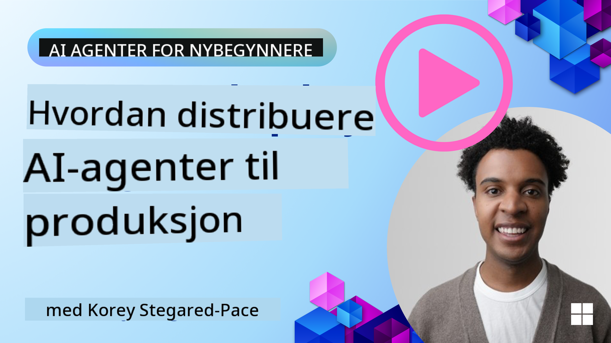

<!--
CO_OP_TRANSLATOR_METADATA:
{
  "original_hash": "cdfd0acc8592c1af14f8637833450375",
  "translation_date": "2025-08-29T15:49:02+00:00",
  "source_file": "10-ai-agents-production/README.md",
  "language_code": "no"
}
-->
# AI-agenter i produksjon: Observabilitet og evaluering

[](https://youtu.be/l4TP6IyJxmQ?si=reGOyeqjxFevyDq9)

Når AI-agenter går fra eksperimentelle prototyper til virkelige applikasjoner, blir det viktig å forstå deres oppførsel, overvåke ytelsen og systematisk evaluere resultatene deres.

## Læringsmål

Etter å ha fullført denne leksjonen, vil du vite hvordan du/forstå:
- Grunnleggende konsepter for observabilitet og evaluering av agenter
- Teknikker for å forbedre agenters ytelse, kostnader og effektivitet
- Hva og hvordan du systematisk evaluerer AI-agentene dine
- Hvordan kontrollere kostnader ved å sette AI-agenter i produksjon
- Hvordan instrumentere agenter bygget med AutoGen

Målet er å gi deg kunnskapen som trengs for å forvandle "svarte bokser" til transparente, håndterbare og pålitelige systemer.

_**Merk:** Det er viktig å distribuere AI-agenter som er trygge og pålitelige. Ta en titt på leksjonen [Bygge pålitelige AI-agenter](./06-building-trustworthy-agents/README.md) også._

## Traces og Spans

Observabilitetsverktøy som [Langfuse](https://langfuse.com/) eller [Azure AI Foundry](https://learn.microsoft.com/en-us/azure/ai-foundry/what-is-azure-ai-foundry) representerer vanligvis agentkjøringer som traces og spans.

- **Trace** representerer en komplett agentoppgave fra start til slutt (som å håndtere en brukerforespørsel).
- **Spans** er individuelle steg innenfor en trace (som å kalle en språkmodell eller hente data).


Uten observabilitet kan en AI-agent føles som en "svart boks" – dens interne tilstand og resonnement er uklare, noe som gjør det vanskelig å diagnostisere problemer eller optimalisere ytelsen. Med observabilitet blir agenter "glassbokser," som gir den nødvendige gjennomsiktigheten for å bygge tillit og sikre at de fungerer som tiltenkt.

## Hvorfor observabilitet er viktig i produksjonsmiljøer

Å flytte AI-agenter til produksjonsmiljøer introduserer nye utfordringer og krav. Observabilitet er ikke lenger en "hyggelig å ha"-funksjon, men en kritisk evne:

*   **Feilsøking og årsaksanalyse**: Når en agent feiler eller gir et uventet resultat, gir observabilitetsverktøy traces som trengs for å finne kilden til feilen. Dette er spesielt viktig i komplekse agenter som kan involvere flere LLM-kall, verktøysinteraksjoner og betinget logikk.
*   **Latens- og kostnadsstyring**: AI-agenter er ofte avhengige av LLM-er og andre eksterne API-er som faktureres per token eller per kall. Observabilitet muliggjør presis sporing av disse kallene, noe som hjelper med å identifisere operasjoner som er unødvendig trege eller dyre. Dette gjør det mulig for team å optimalisere prompts, velge mer effektive modeller eller redesigne arbeidsflyter for å håndtere driftskostnader og sikre en god brukeropplevelse.
*   **Tillit, sikkerhet og samsvar**: I mange applikasjoner er det viktig å sikre at agenter oppfører seg trygt og etisk. Observabilitet gir en revisjonsspor av agentens handlinger og beslutninger. Dette kan brukes til å oppdage og håndtere problemer som promptinjeksjon, generering av skadelig innhold eller feilbehandling av personlig identifiserbar informasjon (PII). For eksempel kan du gjennomgå traces for å forstå hvorfor en agent ga et bestemt svar eller brukte et spesifikt verktøy.
*   **Kontinuerlige forbedringssløyfer**: Observabilitetsdata er grunnlaget for en iterativ utviklingsprosess. Ved å overvåke hvordan agenter presterer i den virkelige verden, kan team identifisere forbedringsområder, samle data for finjustering av modeller og validere effekten av endringer. Dette skaper en tilbakemeldingssløyfe der produksjonsinnsikt fra online evaluering informerer offline eksperimentering og forbedring, noe som fører til gradvis bedre agentytelse.

## Viktige metrikker å spore

For å overvåke og forstå agentens oppførsel, bør en rekke metrikker og signaler spores. Selv om de spesifikke metrikker kan variere basert på agentens formål, er noen universelt viktige.

Her er noen av de vanligste metrikker som observabilitetsverktøy overvåker:

**Latens:** Hvor raskt svarer agenten? Lange ventetider påvirker brukeropplevelsen negativt. Du bør måle latens for oppgaver og individuelle steg ved å spore agentkjøringer. For eksempel kan en agent som bruker 20 sekunder på alle modellkall akselereres ved å bruke en raskere modell eller ved å kjøre modellkall parallelt.

**Kostnader:** Hva er kostnaden per agentkjøring? AI-agenter er avhengige av LLM-kall som faktureres per token eller eksterne API-er. Hyppig verktøybruk eller flere prompts kan raskt øke kostnadene. For eksempel, hvis en agent kaller en LLM fem ganger for marginal kvalitetsforbedring, må du vurdere om kostnaden er berettiget eller om du kan redusere antall kall eller bruke en billigere modell. Sanntidsovervåking kan også hjelpe med å identifisere uventede topper (f.eks. feil som forårsaker overdrevne API-løkker).

**Forespørselsfeil:** Hvor mange forespørsler feilet agenten? Dette kan inkludere API-feil eller mislykkede verktøykall. For å gjøre agenten mer robust i produksjon, kan du sette opp fallbacks eller retries. F.eks. hvis LLM-leverandør A er nede, bytter du til LLM-leverandør B som backup.

**Brukerfeedback:** Implementering av direkte brukerevalueringer gir verdifull innsikt. Dette kan inkludere eksplisitte vurderinger (👍 tommel opp/👎 ned, ⭐ 1-5 stjerner) eller tekstlige kommentarer. Konsistent negativ feedback bør varsle deg, da dette er et tegn på at agenten ikke fungerer som forventet.

**Implisitt brukerfeedback:** Brukeratferd gir indirekte tilbakemelding selv uten eksplisitte vurderinger. Dette kan inkludere umiddelbar omformulering av spørsmål, gjentatte forespørsler eller klikk på en prøv-igjen-knapp. F.eks. hvis du ser at brukere gjentatte ganger stiller det samme spørsmålet, er dette et tegn på at agenten ikke fungerer som forventet.

**Nøyaktighet:** Hvor ofte produserer agenten korrekte eller ønskelige resultater? Definisjoner av nøyaktighet varierer (f.eks. korrekthet i problemløsning, nøyaktighet i informasjonsinnhenting, brukertilfredshet). Det første steget er å definere hva suksess betyr for agenten din. Du kan spore nøyaktighet via automatiserte sjekker, evalueringspoeng eller oppgavefullføringsetiketter. For eksempel kan du merke traces som "lyktes" eller "feilet".

**Automatiserte evalueringsmetrikker:** Du kan også sette opp automatiserte evalueringer. For eksempel kan du bruke en LLM til å vurdere agentens output, f.eks. om det er nyttig, nøyaktig eller ikke. Det finnes også flere åpne kildebiblioteker som hjelper deg med å vurdere ulike aspekter av agenten. F.eks. [RAGAS](https://docs.ragas.io/) for RAG-agenter eller [LLM Guard](https://llm-guard.com/) for å oppdage skadelig språk eller promptinjeksjon.

I praksis gir en kombinasjon av disse metrikker den beste dekningen av en AI-agents helse. I dette kapitlets [eksempelskript](./code_samples/10_autogen_evaluation.ipynb) viser vi hvordan disse metrikker ser ut i virkelige eksempler, men først skal vi lære hvordan en typisk evalueringsarbeidsflyt ser ut.

## Instrumenter agenten din

For å samle sporingsdata må du instrumentere koden din. Målet er å instrumentere agentkoden slik at den sender ut traces og metrikker som kan fanges opp, behandles og visualiseres av en observabilitetsplattform.

**OpenTelemetry (OTel):** [OpenTelemetry](https://opentelemetry.io/) har blitt en industristandard for observabilitet av LLM-er. Det gir et sett med API-er, SDK-er og verktøy for å generere, samle inn og eksportere telemetridata.

Det finnes mange instrumenteringsbiblioteker som omfavner eksisterende agentrammeverk og gjør det enkelt å eksportere OpenTelemetry spans til et observabilitetsverktøy. Nedenfor er et eksempel på instrumentering av en AutoGen-agent med [OpenLit-instrumenteringsbiblioteket](https://github.com/openlit/openlit):

```python
import openlit

openlit.init(tracer = langfuse._otel_tracer, disable_batch = True)
```

[Eksempelskriptet](./code_samples/10_autogen_evaluation.ipynb) i dette kapitlet vil demonstrere hvordan du instrumenterer AutoGen-agenten din.

**Manuell opprettelse av spans:** Selv om instrumenteringsbiblioteker gir et godt utgangspunkt, er det ofte tilfeller der mer detaljerte eller tilpassede data er nødvendig. Du kan manuelt opprette spans for å legge til tilpasset applikasjonslogikk. Enda viktigere, de kan berike automatisk eller manuelt opprettede spans med tilpassede attributter (også kjent som tags eller metadata). Disse attributtene kan inkludere forretningsspesifikke data, mellomliggende beregninger eller annen kontekst som kan være nyttig for feilsøking eller analyse, som `user_id`, `session_id` eller `model_version`.

Eksempel på manuell opprettelse av traces og spans med [Langfuse Python SDK](https://langfuse.com/docs/sdk/python/sdk-v3):

```python
from langfuse import get_client
 
langfuse = get_client()
 
span = langfuse.start_span(name="my-span")
 
span.end()
```

## Agent-evaluering

Observabilitet gir oss metrikker, men evaluering er prosessen med å analysere disse dataene (og utføre tester) for å avgjøre hvor godt en AI-agent presterer og hvordan den kan forbedres. Med andre ord, når du har disse traces og metrikker, hvordan bruker du dem til å vurdere agenten og ta beslutninger?

Regelmessig evaluering er viktig fordi AI-agenter ofte er ikke-deterministiske og kan utvikle seg (gjennom oppdateringer eller endringer i modellatferd) – uten evaluering ville du ikke vite om din "smarte agent" faktisk gjør jobben sin godt eller om den har blitt dårligere.

Det finnes to kategorier av evalueringer for AI-agenter: **offline evaluering** og **online evaluering**. Begge er verdifulle, og de utfyller hverandre. Vi begynner vanligvis med offline evaluering, da dette er det minste nødvendige steget før distribusjon av en agent.

### Offline evaluering


Dette innebærer å evaluere agenten i et kontrollert miljø, vanligvis ved bruk av testdatasett, ikke live brukerforespørsler. Du bruker kuraterte datasett der du vet hva det forventede resultatet eller korrekt oppførsel er, og kjører agenten på disse.

For eksempel, hvis du har bygget en agent for matematiske tekstoppgaver, kan du ha et [testdatasett](https://huggingface.co/datasets/gsm8k) med 100 oppgaver med kjente svar. Offline evaluering gjøres ofte under utvikling (og kan være en del av CI/CD-pipelines) for å sjekke forbedringer eller beskytte mot regresjoner. Fordelen er at det er **repeterbart, og du kan få klare nøyaktighetsmetrikker siden du har fasit**. Du kan også simulere brukerforespørsler og måle agentens svar opp mot ideelle svar eller bruke automatiserte metrikker som beskrevet ovenfor.

Den største utfordringen med offline evaluering er å sikre at testdatasettet ditt er omfattende og forblir relevant – agenten kan prestere godt på et fast testsett, men møte helt andre forespørsler i produksjon. Derfor bør du holde testsettene oppdatert med nye edge cases og eksempler som reflekterer virkelige scenarier. En blanding av små "smoke test"-caser og større evalueringssett er nyttig: små sett for raske sjekker og større sett for bredere ytelsesmetrikker.

### Online evaluering


Dette refererer til å evaluere agenten i et levende, virkelighetsnært miljø, altså under faktisk bruk i produksjon. Online evaluering innebærer å overvåke agentens ytelse på ekte brukerinteraksjoner og kontinuerlig analysere resultatene.

For eksempel kan du spore suksessrater, brukertilfredshetspoeng eller andre metrikker på live trafikk. Fordelen med online evaluering er at den **fanger opp ting du kanskje ikke forutså i et laboratoriemiljø** – du kan observere modellens drift over tid (om agentens effektivitet reduseres etter hvert som innspillmønstre endres) og oppdage uventede forespørsler eller situasjoner som ikke var i testdataene dine. Den gir et sant bilde av hvordan agenten oppfører seg i praksis.

Online evaluering innebærer ofte å samle implisitt og eksplisitt brukerfeedback, som diskutert, og muligens kjøre shadow tests eller A/B-tester (der en ny versjon av agenten kjører parallelt for å sammenligne med den gamle). Utfordringen er at det kan være vanskelig å få pålitelige etiketter eller poeng for live interaksjoner – du kan være avhengig av brukerfeedback eller nedstrømsmetrikker (som om brukeren klikket på resultatet).

### Kombinere de to

Online og offline evalueringer utelukker ikke hverandre; de utfyller hverandre sterkt. Innsikt fra online overvåking (f.eks. nye typer brukerforespørsler der agenten presterer dårlig) kan brukes til å utvide og forbedre offline testdatasett. Omvendt kan agenter som presterer godt i offline tester, deretter distribueres og overvåkes online med større selvtillit.

Faktisk adopterer mange team en sløyfe:

_evaluere offline -> distribuere -> overvåke online -> samle nye feiltilfeller -> legge til i offline datasett -> forbedre agent -> gjenta_.

## Vanlige problemer

Når du distribuerer AI-agenter til produksjon, kan du møte ulike utfordringer. Her er noen vanlige problemer og deres potensielle løsninger:

| **Problem**    | **Potensiell løsning**   |
| ------------- | ------------------ |
| AI-agenten utfører ikke oppgaver konsekvent | - Forbedre prompten som gis til AI-agenten; vær tydelig på målene.<br>- Identifiser hvor det kan hjelpe å dele opp oppgavene i deloppgaver og håndtere dem med flere agenter. |
| AI-agenten havner i kontinuerlige løkker  | - Sørg for at du har klare avslutningsbetingelser slik at agenten vet når prosessen skal stoppes. |

## Vanlige Problemer og Løsninger

Her er noen vanlige problemer du kan møte på når du jobber med AI-agenter, og forslag til løsninger:

| **Problem**                                   | **Løsning**                                                                                     |
|-----------------------------------------------|-------------------------------------------------------------------------------------------------|
| Agenten gir feil eller ufullstendige svar     | - Sørg for at treningsdataene er omfattende og relevante.<br>- Juster promptene for å være mer spesifikke. |
| Agenten bruker for mye tid på oppgaver        | - Optimaliser agentens arbeidsflyt.<br>- Bruk mindre modeller for enklere oppgaver.            |
| Agenten feiler på komplekse oppgaver          | - For komplekse oppgaver som krever resonnering og planlegging, bruk en større modell som er spesialisert for slike oppgaver. |
| Verktøy som brukes av AI-agenten fungerer dårlig | - Test og valider verktøyets output utenfor agentsystemet.<br>- Forbedre definerte parametere, prompts og navngivning av verktøy. |
| Multi-agent-systemet fungerer ikke konsekvent | - Forbedre promptene som gis til hver agent for å sikre at de er spesifikke og tydelig skiller seg fra hverandre.<br>- Bygg et hierarkisk system med en "rute"- eller kontrollagent som bestemmer hvilken agent som er riktig. |

Mange av disse problemene kan identifiseres mer effektivt med observabilitet på plass. Sporene og måledataene vi diskuterte tidligere hjelper med å finne nøyaktig hvor i agentens arbeidsflyt problemene oppstår, noe som gjør feilsøking og optimalisering mye mer effektivt.

## Håndtering av Kostnader

Her er noen strategier for å håndtere kostnadene ved å sette AI-agenter i produksjon:

**Bruke Mindre Modeller:** Små språkmodeller (SLMs) kan fungere godt for visse agentiske bruksområder og vil redusere kostnadene betydelig. Som nevnt tidligere, er det beste å bygge et evalueringssystem for å bestemme og sammenligne ytelsen mot større modeller for å forstå hvor godt en SLM vil fungere for ditt bruksområde. Vurder å bruke SLMs for enklere oppgaver som intensjonsklassifisering eller parameteruttrekk, og reserver større modeller for komplekse resonneringsoppgaver.

**Bruke en Ruter-Modell:** En lignende strategi er å bruke en variasjon av modeller og størrelser. Du kan bruke en LLM/SLM eller serverløse funksjoner for å rute forespørsler basert på kompleksitet til de modellene som passer best. Dette vil også bidra til å redusere kostnader samtidig som ytelsen opprettholdes for de riktige oppgavene. For eksempel kan du rute enkle forespørsler til mindre, raskere modeller, og kun bruke dyre, store modeller for komplekse resonneringsoppgaver.

**Bufring av Svar:** Identifisere vanlige forespørsler og oppgaver og gi svarene før de går gjennom ditt agentiske system er en god måte å redusere volumet av lignende forespørsler. Du kan til og med implementere en flyt for å identifisere hvor lik en forespørsel er med dine bufrede forespørsler ved hjelp av enklere AI-modeller. Denne strategien kan redusere kostnadene betydelig for ofte stilte spørsmål eller vanlige arbeidsflyter.

## La oss se hvordan dette fungerer i praksis

I [eksempelfilen for denne seksjonen](./code_samples/10_autogen_evaluation.ipynb) vil vi se eksempler på hvordan vi kan bruke observasjonsverktøy for å overvåke og evaluere agenten vår.

### Har du flere spørsmål om AI-agenter i produksjon?

Bli med i [Azure AI Foundry Discord](https://aka.ms/ai-agents/discord) for å møte andre lærende, delta på kontortid og få svar på dine spørsmål om AI-agenter.

## Forrige Leksjon

[Metakognitivt Designmønster](../09-metacognition/README.md)

## Neste Leksjon

[Agentiske Protokoller](../11-agentic-protocols/README.md)

---

**Ansvarsfraskrivelse**:  
Dette dokumentet er oversatt ved hjelp av AI-oversettelsestjenesten [Co-op Translator](https://github.com/Azure/co-op-translator). Selv om vi streber etter nøyaktighet, vær oppmerksom på at automatiserte oversettelser kan inneholde feil eller unøyaktigheter. Det originale dokumentet på sitt opprinnelige språk bør anses som den autoritative kilden. For kritisk informasjon anbefales profesjonell menneskelig oversettelse. Vi er ikke ansvarlige for misforståelser eller feiltolkninger som oppstår ved bruk av denne oversettelsen.