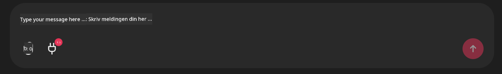

<!--
CO_OP_TRANSLATOR_METADATA:
{
  "original_hash": "9bf0395cbc541ce8db2a9699c8678dfc",
  "translation_date": "2025-07-12T14:23:04+00:00",
  "source_file": "11-mcp/code_samples/github-mcp/README.md",
  "language_code": "no"
}
-->
# Github MCP Server Eksempel

## Beskrivelse

Dette var en demo laget for AI Agents Hackathon arrangert gjennom Microsoft Reactor.

Verktøyet brukes til å anbefale hackathon-prosjekter basert på en brukers Github-repositorier.  
Dette gjøres ved:

1. **Github Agent** - Bruker Github MCP Server for å hente repositorier og informasjon om disse.
2. **Hackathon Agent** - Tar dataene fra Github Agent og kommer opp med kreative hackathon-prosjektideer basert på prosjektene, språkene brukeren benytter og prosjektkategoriene for AI Agents hackathon.
3. **Events Agent** - Basert på forslagene fra hackathon-agenten, vil events-agenten anbefale relevante arrangementer fra AI Agent Hackathon-serien.

## Kjøre koden

### Miljøvariabler

Denne demoen bruker Azure Open AI Service, Semantic Kernel, Github MCP Server og Azure AI Search.

Sørg for at du har riktige miljøvariabler satt for å bruke disse verktøyene:

```python
AZURE_OPENAI_CHAT_DEPLOYMENT_NAME=""
AZURE_OPENAI_EMBEDDING_DEPLOYMENT_NAME=""
AZURE_OPENAI_ENDPOINT=""
AZURE_OPENAI_API_KEY=""
AZURE_OPENAI_API_VERSION=""
AZURE_SEARCH_SERVICE_ENDPOINT=""
AZURE_SEARCH_API_KEY=""
```

## Kjøre Chainlit Serveren

For å koble til MCP-serveren bruker denne demoen Chainlit som chatgrensesnitt.

For å starte serveren, bruk følgende kommando i terminalen:

```bash
chainlit run app.py -w
```

Dette skal starte Chainlit-serveren din på `localhost:8000` og samtidig fylle Azure AI Search-indeksen din med innholdet fra `event-descriptions.md`.

## Koble til MCP Serveren

For å koble til Github MCP Server, velg "plug"-ikonet under chat-boksen "Type your message here..":



Derfra kan du klikke på "Connect an MCP" for å legge til kommandoen som kobler til Github MCP Server:

```bash
npx -y @modelcontextprotocol/server-github --env GITHUB_PERSONAL_ACCESS_TOKEN=[YOUR PERSONAL ACCESS TOKEN]
```

Bytt ut "[YOUR PERSONAL ACCESS TOKEN]" med din faktiske Personal Access Token.

Etter tilkobling skal du se en (1) ved siden av plug-ikonet som bekrefter at den er koblet til. Hvis ikke, prøv å starte chainlit-serveren på nytt med `chainlit run app.py -w`.

## Bruke Demoen

For å starte agentens arbeidsflyt for å anbefale hackathon-prosjekter, kan du skrive en melding som:

"Recommend hackathon projects for the Github user koreyspace"

Router Agent vil analysere forespørselen din og avgjøre hvilken kombinasjon av agenter (GitHub, Hackathon og Events) som passer best for å håndtere spørringen. Agentene samarbeider for å gi omfattende anbefalinger basert på analyse av Github-repositorier, prosjektidéer og relevante teknologiske arrangementer.

**Ansvarsfraskrivelse**:  
Dette dokumentet er oversatt ved hjelp av AI-oversettelsestjenesten [Co-op Translator](https://github.com/Azure/co-op-translator). Selv om vi streber etter nøyaktighet, vennligst vær oppmerksom på at automatiske oversettelser kan inneholde feil eller unøyaktigheter. Det opprinnelige dokumentet på originalspråket skal anses som den autoritative kilden. For kritisk informasjon anbefales profesjonell menneskelig oversettelse. Vi er ikke ansvarlige for eventuelle misforståelser eller feiltolkninger som oppstår ved bruk av denne oversettelsen.