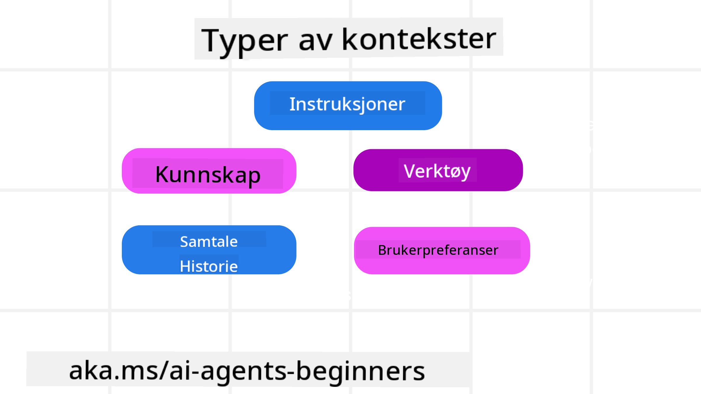
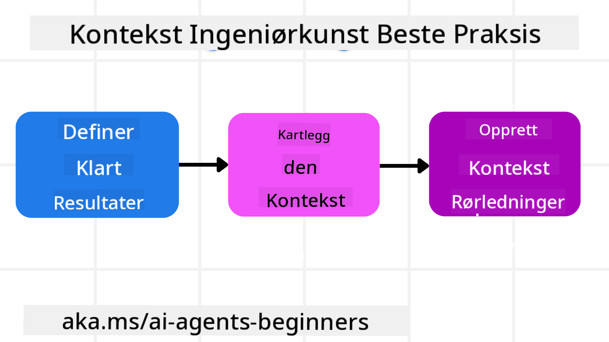

<!--
CO_OP_TRANSLATOR_METADATA:
{
  "original_hash": "cb7e50f471905ce6fdb92a30269a7a98",
  "translation_date": "2025-09-04T10:10:50+00:00",
  "source_file": "12-context-engineering/README.md",
  "language_code": "no"
}
-->
# Kontekstutvikling for AI-agenter

> _(Klikk på bildet over for å se videoen til denne leksjonen)_

Å forstå kompleksiteten i applikasjonen du bygger en AI-agent for, er viktig for å lage en pålitelig løsning. Vi må bygge AI-agenter som effektivt håndterer informasjon for å møte komplekse behov utover bare promptutvikling.

I denne leksjonen skal vi se på hva kontekstutvikling er og hvilken rolle det spiller i byggingen av AI-agenter.

## Introduksjon

Denne leksjonen dekker:

• **Hva kontekstutvikling er** og hvorfor det er forskjellig fra promptutvikling.

• **Strategier for effektiv kontekstutvikling**, inkludert hvordan man skriver, velger, komprimerer og isolerer informasjon.

• **Vanlige feil i kontekst** som kan føre AI-agenten på avveie, og hvordan man kan rette opp i dem.

## Læringsmål

Etter å ha fullført denne leksjonen, vil du forstå hvordan du:

• **Definerer kontekstutvikling** og skiller det fra promptutvikling.

• **Identifiserer nøkkelkomponentene i kontekst** i applikasjoner som bruker store språkmodeller (LLM).

• **Bruker strategier for å skrive, velge, komprimere og isolere kontekst** for å forbedre agentens ytelse.

• **Gjenkjenner vanlige feil i kontekst**, som forgiftning, distraksjon, forvirring og konflikt, og implementerer tiltak for å unngå dem.

## Hva er kontekstutvikling?

For AI-agenter er kontekst det som styrer planleggingen av hvilke handlinger agenten skal utføre. Kontekstutvikling handler om å sørge for at AI-agenten har riktig informasjon for å fullføre neste steg i oppgaven. Kontekstvinduet har en begrenset størrelse, så som utviklere må vi bygge systemer og prosesser for å håndtere hvordan informasjon legges til, fjernes og komprimeres i kontekstvinduet.

### Promptutvikling vs Kontekstutvikling

Promptutvikling fokuserer på et enkelt sett med statiske instruksjoner for å effektivt veilede AI-agenter med et sett regler. Kontekstutvikling handler om å håndtere et dynamisk sett med informasjon, inkludert den opprinnelige prompten, for å sikre at AI-agenten har det den trenger over tid. Hovedideen bak kontekstutvikling er å gjøre denne prosessen repeterbar og pålitelig.

### Typer av kontekst

Det er viktig å huske at kontekst ikke bare er én ting. Informasjonen som AI-agenten trenger, kan komme fra ulike kilder, og det er opp til oss å sørge for at agenten har tilgang til disse kildene:

Typene kontekst en AI-agent kan trenge å håndtere inkluderer:

• **Instruksjoner:** Dette er som agentens "regler" – promter, systemmeldinger, få-eksempler (som viser AI-en hvordan noe skal gjøres), og beskrivelser av verktøy den kan bruke. Her kombineres fokus på promptutvikling med kontekstutvikling.

• **Kunnskap:** Dette dekker fakta, informasjon hentet fra databaser eller langtidsminner som agenten har akkumulert. Dette inkluderer integrering av et Retrieval Augmented Generation (RAG)-system hvis agenten trenger tilgang til ulike kunnskapslagre og databaser.

• **Verktøy:** Dette er definisjoner av eksterne funksjoner, API-er og MCP-servere som agenten kan kalle, sammen med tilbakemeldingene (resultatene) den får fra å bruke dem.

• **Samtalehistorikk:** Den pågående dialogen med en bruker. Etter hvert som tiden går, blir disse samtalene lengre og mer komplekse, noe som betyr at de tar opp plass i kontekstvinduet.

• **Brukerpreferanser:** Informasjon som er lært om en brukers liker og misliker over tid. Dette kan lagres og hentes frem når det tas viktige beslutninger for å hjelpe brukeren.

## Strategier for effektiv kontekstutvikling

### Planleggingsstrategier

God kontekstutvikling starter med god planlegging. Her er en tilnærming som kan hjelpe deg med å begynne å tenke på hvordan du kan bruke konseptet kontekstutvikling:

1. **Definer klare resultater** – Resultatene av oppgavene som AI-agentene skal utføre, bør være tydelig definert. Svar på spørsmålet: "Hvordan vil verden se ut når AI-agenten er ferdig med oppgaven sin?" Med andre ord, hvilken endring, informasjon eller respons skal brukeren ha etter å ha interagert med AI-agenten?

2. **Kartlegg konteksten** – Når du har definert resultatene av AI-agenten, må du svare på spørsmålet: "Hvilken informasjon trenger AI-agenten for å fullføre denne oppgaven?" På denne måten kan du begynne å kartlegge hvor informasjonen kan finnes.

3. **Lag kontekstpipelines** – Nå som du vet hvor informasjonen er, må du svare på spørsmålet: "Hvordan skal agenten få tak i denne informasjonen?" Dette kan gjøres på ulike måter, inkludert RAG, bruk av MCP-servere og andre verktøy.

### Praktiske strategier

Planlegging er viktig, men når informasjonen begynner å strømme inn i agentens kontekstvindu, må vi ha praktiske strategier for å håndtere det:

#### Håndtering av kontekst

Mens noe informasjon vil bli lagt til kontekstvinduet automatisk, handler kontekstutvikling om å ta en mer aktiv rolle i denne informasjonen, noe som kan gjøres med noen få strategier:

1. **Agentens notatblokk**  
   Dette lar en AI-agent ta notater om relevant informasjon om de nåværende oppgavene og brukerinteraksjonene under en enkelt økt. Dette bør eksistere utenfor kontekstvinduet i en fil eller et runtime-objekt som agenten kan hente frem senere i samme økt hvis nødvendig.

2. **Minner**  
   Notatblokker er gode for å håndtere informasjon utenfor kontekstvinduet i en enkelt økt. Minner gjør det mulig for agenter å lagre og hente relevant informasjon på tvers av flere økter. Dette kan inkludere sammendrag, brukerpreferanser og tilbakemeldinger for forbedringer i fremtiden.

3. **Komprimering av kontekst**  
   Når kontekstvinduet vokser og nærmer seg sin grense, kan teknikker som oppsummering og trimming brukes. Dette inkluderer enten å beholde kun den mest relevante informasjonen eller fjerne eldre meldinger.

4. **Multi-agent-systemer**  
   Å utvikle multi-agent-systemer er en form for kontekstutvikling fordi hver agent har sitt eget kontekstvindu. Hvordan denne konteksten deles og overføres mellom ulike agenter, er noe annet som må planlegges når man bygger slike systemer.

5. **Sandkassemiljøer**  
   Hvis en agent trenger å kjøre noe kode eller behandle store mengder informasjon i et dokument, kan dette ta opp mange tokens for å prosessere resultatene. I stedet for å lagre alt dette i kontekstvinduet, kan agenten bruke et sandkassemiljø som kan kjøre denne koden og kun lese resultatene og annen relevant informasjon.

6. **Runtime-tilstandsobjekter**  
   Dette gjøres ved å opprette beholdere med informasjon for å håndtere situasjoner der agenten trenger tilgang til spesifikk informasjon. For en kompleks oppgave vil dette gjøre det mulig for agenten å lagre resultatene av hvert deloppgave steg for steg, slik at konteksten forblir knyttet kun til den spesifikke deloppgaven.

### Eksempel på kontekstutvikling

La oss si at vi ønsker at en AI-agent skal **"Bestille en tur til Paris for meg."**

• En enkel agent som kun bruker promptutvikling, kan bare svare: **"Ok, når vil du reise til Paris?"**. Den behandler kun spørsmålet ditt direkte når det blir stilt.

• En agent som bruker strategiene for kontekstutvikling som vi har dekket, vil gjøre mye mer. Før den i det hele tatt svarer, kan systemet:

  ◦ **Sjekke kalenderen din** for tilgjengelige datoer (henter sanntidsdata).

  ◦ **Huske tidligere reisepreferanser** (fra langtidsminne), som ditt foretrukne flyselskap, budsjett eller om du foretrekker direktefly.

  ◦ **Identifisere tilgjengelige verktøy** for fly- og hotellbestilling.

- Deretter kan et eksempel på et svar være: "Hei [Ditt navn]! Jeg ser at du er ledig den første uken i oktober. Skal jeg se etter direktefly til Paris med [Foretrukket flyselskap] innenfor ditt vanlige budsjett på [Budsjett]?" Dette rikere, kontekstbevisste svaret viser kraften i kontekstutvikling.

## Vanlige feil i kontekst

### Kontekstforgiftning

**Hva det er:** Når en hallusinasjon (falsk informasjon generert av LLM) eller en feil kommer inn i konteksten og gjentatte ganger refereres til, noe som får agenten til å forfølge umulige mål eller utvikle meningsløse strategier.

**Hva du kan gjøre:** Implementer **kontekstvalidering** og **karantene**. Valider informasjon før den legges til langtidsminnet. Hvis potensiell forgiftning oppdages, start nye konteksttråder for å forhindre at feil informasjon sprer seg.

**Eksempel på reisebestilling:** Agenten din hallusinerer en **direkteflyvning fra en liten lokal flyplass til en fjern internasjonal by** som ikke faktisk tilbyr internasjonale flyvninger. Denne ikke-eksisterende flydetaljen lagres i konteksten. Senere, når du ber agenten om å bestille, fortsetter den å prøve å finne billetter til denne umulige ruten, noe som fører til gjentatte feil.

**Løsning:** Implementer et trinn som **validerer flyets eksistens og ruter med en sanntids-API** _før_ flydetaljen legges til agentens arbeidskontekst. Hvis valideringen mislykkes, blir den feilaktige informasjonen "karantenesatt" og ikke brukt videre.

### Kontekstdistraksjon

**Hva det er:** Når konteksten blir så stor at modellen fokuserer for mye på den akkumulerte historikken i stedet for å bruke det den lærte under trening, noe som fører til repeterende eller ubrukelige handlinger. Modeller kan begynne å gjøre feil selv før kontekstvinduet er fullt.

**Hva du kan gjøre:** Bruk **kontekstsammendrag**. Komprimer periodisk akkumulert informasjon til kortere sammendrag, behold viktige detaljer mens du fjerner overflødig historikk. Dette hjelper med å "nullstille" fokuset.

**Eksempel på reisebestilling:** Du har diskutert ulike drømmereisemål over lang tid, inkludert en detaljert gjenfortelling av backpackerturen din for to år siden. Når du endelig ber om å **"finne en billig flyvning for neste måned"**, blir agenten overveldet av de gamle, irrelevante detaljene og fortsetter å spørre om backpackerutstyr eller tidligere reiseruter, i stedet for å fokusere på forespørselen din.

**Løsning:** Etter et visst antall vendinger eller når konteksten blir for stor, bør agenten **oppsummere de mest relevante delene av samtalen** – med fokus på dine nåværende reisedatoer og destinasjon – og bruke det kondenserte sammendraget for neste LLM-kall, mens mindre relevante historiske detaljer forkastes.

### Kontekstforvirring

**Hva det er:** Når unødvendig kontekst, ofte i form av for mange tilgjengelige verktøy, får modellen til å generere dårlige svar eller kalle irrelevante verktøy. Mindre modeller er spesielt utsatt for dette.

**Hva du kan gjøre:** Implementer **verktøyhåndtering** ved hjelp av RAG-teknikker. Lagre verktøybeskrivelser i en vektordatabase og velg _kun_ de mest relevante verktøyene for hver spesifikke oppgave. Forskning viser at det er best å begrense verktøyvalgene til færre enn 30.

**Eksempel på reisebestilling:** Agenten din har tilgang til dusinvis av verktøy: `book_flight`, `book_hotel`, `rent_car`, `find_tours`, `currency_converter`, `weather_forecast`, `restaurant_reservations`, osv. Du spør, **"Hva er den beste måten å komme seg rundt i Paris?"** På grunn av det store antallet verktøy blir agenten forvirret og forsøker å kalle `book_flight` _innenfor_ Paris, eller `rent_car` selv om du foretrekker offentlig transport, fordi verktøybeskrivelsene kan overlappe eller den rett og slett ikke klarer å velge det beste.

**Løsning:** Bruk **RAG over verktøybeskrivelser**. Når du spør om å komme deg rundt i Paris, henter systemet dynamisk _kun_ de mest relevante verktøyene som `rent_car` eller `public_transport_info` basert på forespørselen din, og presenterer et fokusert "utvalg" av verktøy for LLM.

### Kontekstkonflikt

**Hva det er:** Når motstridende informasjon eksisterer i konteksten, noe som fører til inkonsekvent resonnement eller dårlige endelige svar. Dette skjer ofte når informasjon kommer i etapper, og tidlige, feilaktige antakelser forblir i konteksten.

**Hva du kan gjøre:** Bruk **kontekstbeskjæring** og **avlasting**. Beskjæring betyr å fjerne utdatert eller motstridende informasjon etter hvert som nye detaljer kommer inn. Avlasting gir modellen et separat "notatblokk"-arbeidsområde for å behandle informasjon uten å fylle opp hovedkonteksten.

**Eksempel på reisebestilling:** Du forteller først agenten din, **"Jeg vil fly økonomiklasse."** Senere i samtalen ombestemmer du deg og sier, **"Egentlig, for denne turen, la oss gå for businessklasse."** Hvis begge instruksjonene forblir i konteksten, kan agenten få motstridende søkeresultater eller bli forvirret om hvilken preferanse den skal prioritere.

**Løsning:** Implementer **kontekstbeskjæring**. Når en ny instruksjon motsier en gammel, fjernes den eldre instruksjonen eller eksplisitt overstyres i konteksten. Alternativt kan agenten bruke en **notatblokk** for å avstemme motstridende preferanser før den tar en beslutning, og sikre at kun den endelige, konsistente instruksjonen styrer handlingene dens.

## Har du flere spørsmål om kontekstutvikling?

Bli med i [Azure AI Foundry Discord](https://aka.ms/ai-agents/discord) for å møte andre lærende, delta på kontortid og få svar på spørsmålene dine om AI-agenter.

---

**Ansvarsfraskrivelse**:  
Dette dokumentet er oversatt ved hjelp av AI-oversettelsestjenesten [Co-op Translator](https://github.com/Azure/co-op-translator). Selv om vi streber etter nøyaktighet, vær oppmerksom på at automatiserte oversettelser kan inneholde feil eller unøyaktigheter. Det originale dokumentet på sitt opprinnelige språk bør anses som den autoritative kilden. For kritisk informasjon anbefales profesjonell menneskelig oversettelse. Vi er ikke ansvarlige for eventuelle misforståelser eller feiltolkninger som oppstår ved bruk av denne oversettelsen.