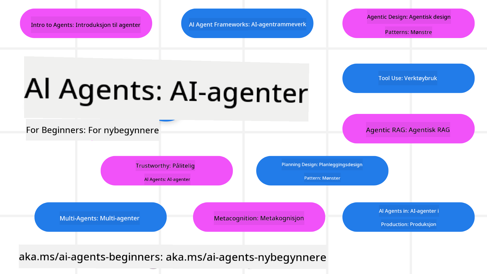

<!--
CO_OP_TRANSLATOR_METADATA:
{
  "original_hash": "6b07046397366e6f6f4524c9ddeba1e1",
  "translation_date": "2025-07-12T14:53:45+00:00",
  "source_file": "README.md",
  "language_code": "no"
}
-->
# AI-agenter for nybegynnere - Et kurs

## 11 leksjoner som lærer deg alt du trenger for å begynne å bygge AI-agenter

  
  
  
  

### 🌐 Støtte for flere språk

#### Støttes via GitHub Action (Automatisert og alltid oppdatert)

[Fransk](../fr/README.md) | [Spansk](../es/README.md) | [Tysk](../de/README.md) | [Russisk](../ru/README.md) | [Arabisk](../ar/README.md) | [Persisk (Farsi)](../fa/README.md) | [Urdu](../ur/README.md) | [Kinesisk (forenklet)](../zh/README.md) | [Kinesisk (tradisjonell, Macau)](../mo/README.md) | [Kinesisk (tradisjonell, Hong Kong)](../hk/README.md) | [Kinesisk (tradisjonell, Taiwan)](../tw/README.md) | [Japansk](../ja/README.md) | [Koreansk](../ko/README.md) | [Hindi](../hi/README.md) | [Bengali](../bn/README.md) | [Marathi](../mr/README.md) | [Nepali](../ne/README.md) | [Punjabi (Gurmukhi)](../pa/README.md) | [Portugisisk (Portugal)](../pt/README.md) | [Portugisisk (Brasil)](../br/README.md) | [Italiensk](../it/README.md) | [Polsk](../pl/README.md) | [Tyrkisk](../tr/README.md) | [Gresk](../el/README.md) | [Thai](../th/README.md) | [Svensk](../sv/README.md) | [Dansk](../da/README.md) | [Norsk](./README.md) | [Finsk](../fi/README.md) | [Nederlandsk](../nl/README.md) | [Hebraisk](../he/README.md) | [Vietnamesisk](../vi/README.md) | [Indonesisk](../id/README.md) | [Malayisk](../ms/README.md) | [Tagalog (Filippinsk)](../tl/README.md) | [Swahili](../sw/README.md) | [Ungarsk](../hu/README.md) | [Tsjekkisk](../cs/README.md) | [Slovakisk](../sk/README.md) | [Rumensk](../ro/README.md) | [Bulgarsk](../bg/README.md) | [Serbisk (kyrillisk)](../sr/README.md) | [Kroatisk](../hr/README.md) | [Slovensk](../sl/README.md) | [Ukrainsk](../uk/README.md) | [Burmese (Myanmar)](../my/README.md)

**Hvis du ønsker at flere språk skal støttes, finner du en liste over tilgjengelige språk [her](https://github.com/Azure/co-op-translator/blob/main/getting_started/supported-languages.md)**

  
  

## 🌱 Kom i gang

Dette kurset består av 11 leksjoner som dekker det grunnleggende for å bygge AI-agenter. Hver leksjon tar for seg et eget tema, så du kan starte hvor du vil!

Kurset har støtte for flere språk. Se våre [tilgjengelige språk her](../..).

Hvis dette er første gang du bygger med generative AI-modeller, sjekk ut vårt kurs [Generative AI For Beginners](https://aka.ms/genai-beginners), som inneholder 21 leksjoner om bygging med GenAI.

Ikke glem å [stjerne (🌟) dette repoet](https://docs.github.com/en/get-started/exploring-projects-on-github/saving-repositories-with-stars?WT.mc_id=academic-105485-koreyst) og [forke dette repoet](https://github.com/microsoft/ai-agents-for-beginners/fork) for å kjøre koden.

### Hva du trenger

Hver leksjon i dette kurset inkluderer kodeeksempler, som du finner i mappen code_samples. Du kan [forke dette repoet](https://github.com/microsoft/ai-agents-for-beginners/fork) for å lage din egen kopi.

Kodeeksemplene i disse øvelsene bruker Azure AI Foundry og GitHub Model Catalogs for å samhandle med språkmodeller:

- [Github Models](https://aka.ms/ai-agents-beginners/github-models) - Gratis / Begrenset  
- [Azure AI Foundry](https://aka.ms/ai-agents-beginners/ai-foundry) - Krever Azure-konto

Dette kurset bruker også følgende AI-agent-rammeverk og tjenester fra Microsoft:

- [Azure AI Agent Service](https://aka.ms/ai-agents-beginners/ai-agent-service)  
- [Semantic Kernel](https://aka.ms/ai-agents-beginners/semantic-kernel)  
- [AutoGen](https://aka.ms/ai-agents/autogen)

For mer informasjon om hvordan du kjører koden for dette kurset, se [Course Setup](./00-course-setup/README.md).

## 🙏 Vil du bidra?

Har du forslag eller har funnet skrivefeil eller kodefeil? [Opprett en issue](https://github.com/microsoft/ai-agents-for-beginners/issues?WT.mc_id=academic-105485-koreyst) eller [lag en pull request](https://github.com/microsoft/ai-agents-for-beginners/pulls?WT.mc_id=academic-105485-koreyst)

Hvis du står fast eller har spørsmål om å bygge AI-agenter, bli med i vår [Azure AI Foundry Community Discord](https://discord.gg/kzRShWzttr)

Hvis du har produktfeedback eller opplever feil under bygging, besøk vårt [Azure AI Foundry Developer Forum](https://aka.ms/azureaifoundry/forum)

## 📂 Hver leksjon inkluderer

- En skriftlig leksjon i README og en kort video  
- Python-kodeeksempler som støtter Azure AI Foundry og Github Models (gratis)  
- Lenker til ekstra ressurser for videre læring  

## 🗃️ Leksjoner

| **Leksjon**                              | **Tekst & kode**                                   | **Video**                                                  | **Ekstra læring**                                                                     |
|-----------------------------------------|---------------------------------------------------|------------------------------------------------------------|----------------------------------------------------------------------------------------|
| Intro til AI-agenter og bruksområder    | [Lenke](./01-intro-to-ai-agents/README.md)        | [Video](https://youtu.be/3zgm60bXmQk?si=z8QygFvYQv-9WtO1)  | [Lenke](https://aka.ms/ai-agents-beginners/collection?WT.mc_id=academic-105485-koreyst) |
| Utforske AI-agentrammeverk               | [Lenke](./02-explore-agentic-frameworks/README.md)| [Video](https://youtu.be/ODwF-EZo_O8?si=Vawth4hzVaHv-u0H)  | [Lenke](https://aka.ms/ai-agents-beginners/collection?WT.mc_id=academic-105485-koreyst) |
| Forstå AI-agentdesignmønstre             | [Lenke](./03-agentic-design-patterns/README.md)   | [Video](https://youtu.be/m9lM8qqoOEA?si=BIzHwzstTPL8o9GF)  | [Lenke](https://aka.ms/ai-agents-beginners/collection?WT.mc_id=academic-105485-koreyst) |
| Verktøybruk designmønster                | [Lenke](./04-tool-use/README.md)                   | [Video](https://youtu.be/vieRiPRx-gI?si=2z6O2Xu2cu_Jz46N)  | [Lenke](https://aka.ms/ai-agents-beginners/collection?WT.mc_id=academic-105485-koreyst) |
| Agentic RAG                             | [Lenke](./05-agentic-rag/README.md)                | [Video](https://youtu.be/WcjAARvdL7I?si=gKPWsQpKiIlDH9A3)  | [Lenke](https://aka.ms/ai-agents-beginners/collection?WT.mc_id=academic-105485-koreyst) |
| Bygge pålitelige AI-agenter              | [Lenke](./06-building-trustworthy-agents/README.md)| [Video](https://youtu.be/iZKkMEGBCUQ?si=jZjpiMnGFOE9L8OK ) | [Lenke](https://aka.ms/ai-agents-beginners/collection?WT.mc_id=academic-105485-koreyst) |
| Planleggingsdesignmønster                | [Lenke](./07-planning-design/README.md)            | [Video](https://youtu.be/kPfJ2BrBCMY?si=6SC_iv_E5-mzucnC)  | [Lenke](https://aka.ms/ai-agents-beginners/collection?WT.mc_id=academic-105485-koreyst) |
| Multi-agent designmønster                | [Lenke](./08-multi-agent/README.md)                | [Video](https://youtu.be/V6HpE9hZEx0?si=rMgDhEu7wXo2uo6g)  | [Lenke](https://aka.ms/ai-agents-beginners/collection?WT.mc_id=academic-105485-koreyst) |
| Metakognisjon designmønster              | [Lenke](./09-metacognition/README.md)              | [Video](https://youtu.be/His9R6gw6Ec?si=8gck6vvdSNCt6OcF)  | [Lenke](https://aka.ms/ai-agents-beginners/collection?WT.mc_id=academic-105485-koreyst) |
| AI-agenter i produksjon                  | [Lenke](./10-ai-agents-production/README.md)       | [Video](https://youtu.be/l4TP6IyJxmQ?si=31dnhexRo6yLRJDl)  | [Lenke](https://aka.ms/ai-agents-beginners/collection?WT.mc_id=academic-105485-koreyst) |
| AI-agenter med MCP                       | [Lenke](./11-mcp/README.md)                        |                                                            | [Lenke](https://aka.ms/mcp-for-beginners)                                               |

## 🎒 Andre kurs

Teamet vårt lager også andre kurs! Ta en titt på:
- [**NY** Model Context Protocol (MCP) for nybegynnere](https://github.com/microsoft/mcp-for-beginners?WT.mc_id=academic-105485-koreyst)
- [Generativ AI for nybegynnere med .NET](https://github.com/microsoft/Generative-AI-for-beginners-dotnet?WT.mc_id=academic-105485-koreyst)
- [Generativ AI for nybegynnere](https://github.com/microsoft/generative-ai-for-beginners?WT.mc_id=academic-105485-koreyst)
- [ML for nybegynnere](https://aka.ms/ml-beginners?WT.mc_id=academic-105485-koreyst)
- [Data Science for nybegynnere](https://aka.ms/datascience-beginners?WT.mc_id=academic-105485-koreyst)
- [AI for nybegynnere](https://aka.ms/ai-beginners?WT.mc_id=academic-105485-koreyst)
- [Cybersikkerhet for nybegynnere](https://github.com/microsoft/Security-101??WT.mc_id=academic-96948-sayoung)
- [Webutvikling for nybegynnere](https://aka.ms/webdev-beginners?WT.mc_id=academic-105485-koreyst)
- [IoT for nybegynnere](https://aka.ms/iot-beginners?WT.mc_id=academic-105485-koreyst)
- [XR-utvikling for nybegynnere](https://github.com/microsoft/xr-development-for-beginners?WT.mc_id=academic-105485-koreyst)
- [Bli ekspert på GitHub Copilot for AI-parprogrammering](https://aka.ms/GitHubCopilotAI?WT.mc_id=academic-105485-koreyst)
- [Bli ekspert på GitHub Copilot for C#/.NET-utviklere](https://github.com/microsoft/mastering-github-copilot-for-dotnet-csharp-developers?WT.mc_id=academic-105485-koreyst)
- [Velg din egen Copilot-opplevelse](https://github.com/microsoft/CopilotAdventures?WT.mc_id=academic-105485-koreyst)

## 🌟 Takk til fellesskapet

Takk til [Shivam Goyal](https://www.linkedin.com/in/shivam2003/) for å ha bidratt med viktige kodeeksempler som demonstrerer Agentic RAG.

## Bidra

Dette prosjektet tar imot bidrag og forslag. De fleste bidrag krever at du godtar en
Contributor License Agreement (CLA) som bekrefter at du har rett til, og faktisk gir oss,
rettighetene til å bruke ditt bidrag. For detaljer, besøk
<https://cla.opensource.microsoft.com>.

Når du sender inn en pull request, vil en CLA-bot automatisk avgjøre om du må levere
en CLA og merke PR-en deretter (f.eks. statuskontroll, kommentar). Følg bare instruksjonene
fra boten. Du trenger bare å gjøre dette én gang for alle repos som bruker vår CLA.

Dette prosjektet har tatt i bruk [Microsoft Open Source Code of Conduct](https://opensource.microsoft.com/codeofconduct/).
For mer informasjon, se [Code of Conduct FAQ](https://opensource.microsoft.com/codeofconduct/faq/) eller
kontakt [opencode@microsoft.com](mailto:opencode@microsoft.com) ved spørsmål eller kommentarer.

## Varemerker

Dette prosjektet kan inneholde varemerker eller logoer for prosjekter, produkter eller tjenester. Autorisert bruk av Microsoft
varemerker eller logoer er underlagt og må følge
[Microsofts retningslinjer for varemerker og merkevarebruk](https://www.microsoft.com/legal/intellectualproperty/trademarks/usage/general).
Bruk av Microsofts varemerker eller logoer i modifiserte versjoner av dette prosjektet må ikke skape forvirring eller antyde at Microsoft sponser prosjektet.
Enhver bruk av tredjeparts varemerker eller logoer er underlagt disse tredjepartenes retningslinjer.

**Ansvarsfraskrivelse**:  
Dette dokumentet er oversatt ved hjelp av AI-oversettelsestjenesten [Co-op Translator](https://github.com/Azure/co-op-translator). Selv om vi streber etter nøyaktighet, vennligst vær oppmerksom på at automatiske oversettelser kan inneholde feil eller unøyaktigheter. Det opprinnelige dokumentet på originalspråket skal anses som den autoritative kilden. For kritisk informasjon anbefales profesjonell menneskelig oversettelse. Vi er ikke ansvarlige for eventuelle misforståelser eller feiltolkninger som oppstår ved bruk av denne oversettelsen.