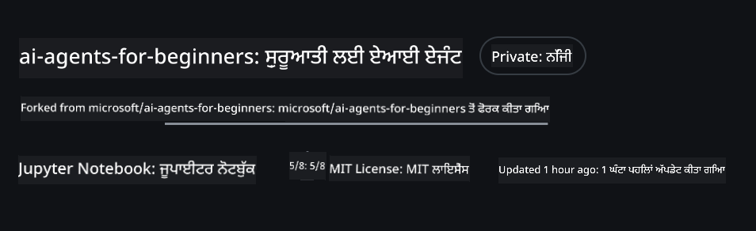
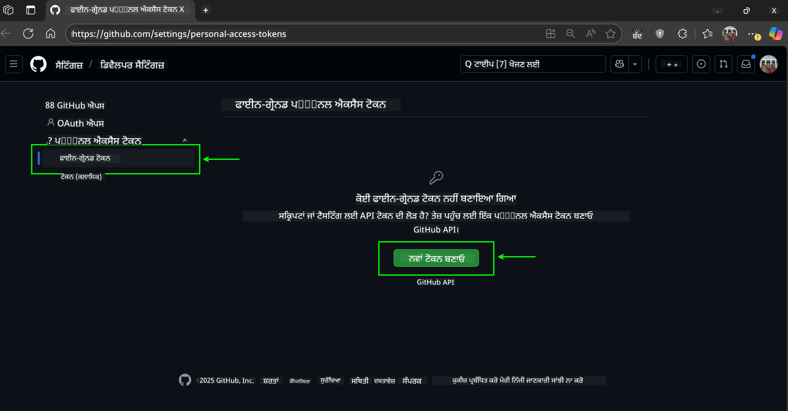
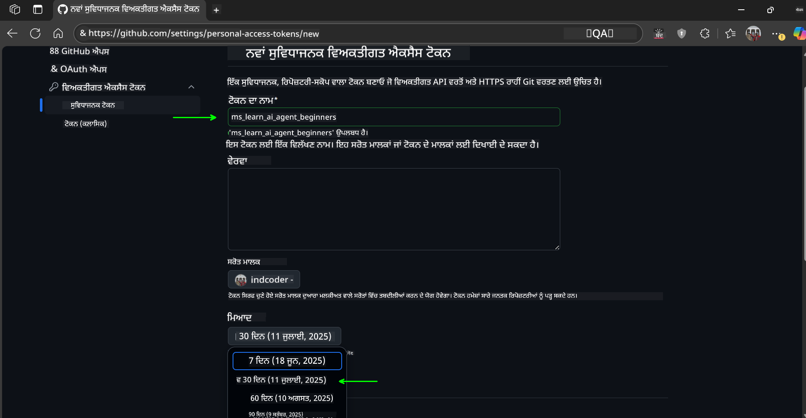
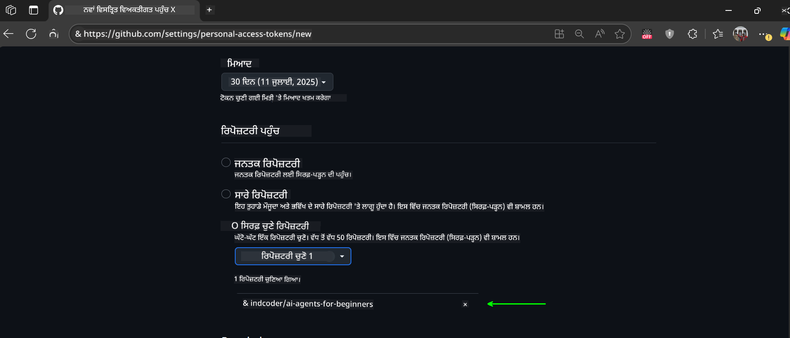
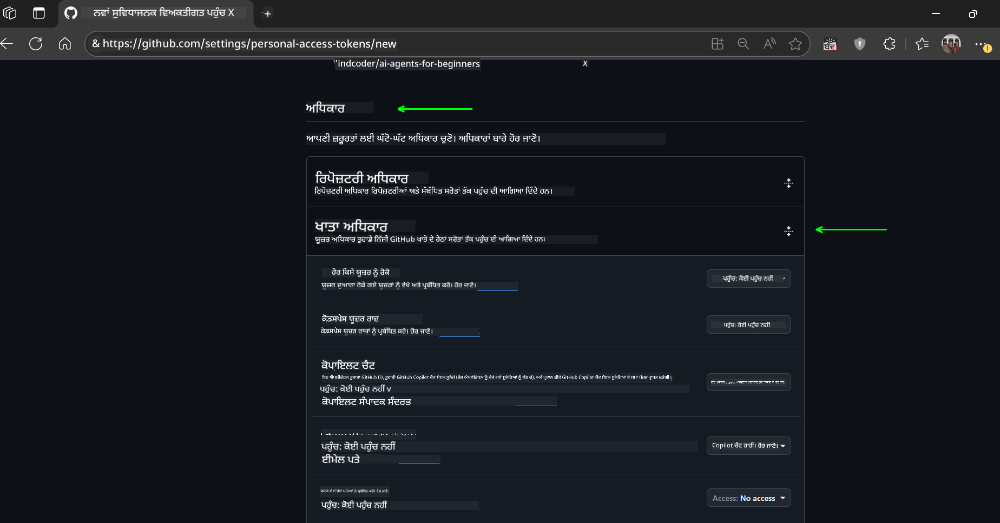
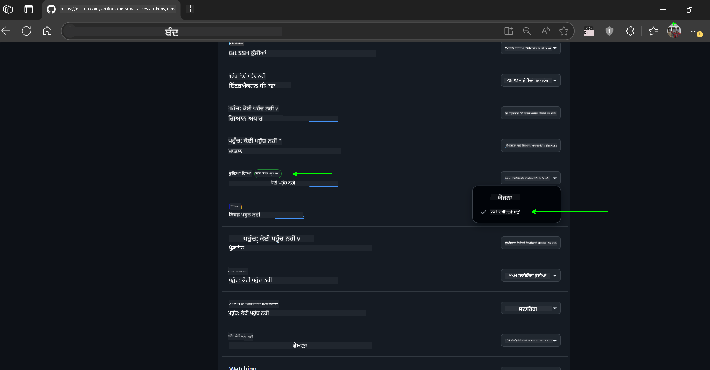
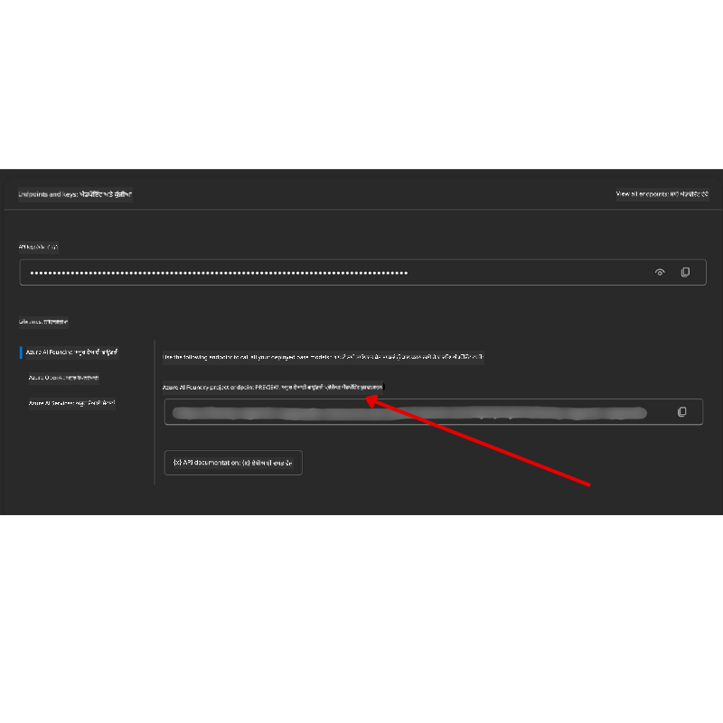

<!--
CO_OP_TRANSLATOR_METADATA:
{
  "original_hash": "c6a79c8f2b56a80370ff7e447765524f",
  "translation_date": "2025-07-23T08:33:07+00:00",
  "source_file": "00-course-setup/README.md",
  "language_code": "pa"
}
-->
# ਕੋਰਸ ਸੈਟਅਪ

## ਜਾਣ ਪਛਾਣ

ਇਸ ਪਾਠ ਵਿੱਚ ਤੁਸੀਂ ਸਿੱਖੋਗੇ ਕਿ ਇਸ ਕੋਰਸ ਦੇ ਕੋਡ ਨਮੂਨਿਆਂ ਨੂੰ ਕਿਵੇਂ ਚਲਾਇਆ ਜਾਵੇ।

## ਇਸ ਰਿਪੋ ਨੂੰ ਕਲੋਨ ਜਾਂ ਫੋਰਕ ਕਰੋ

ਸਭ ਤੋਂ ਪਹਿਲਾਂ, ਕਿਰਪਾ ਕਰਕੇ GitHub ਰਿਪੋਜ਼ਟਰੀ ਨੂੰ ਕਲੋਨ ਜਾਂ ਫੋਰਕ ਕਰੋ। ਇਸ ਨਾਲ ਤੁਹਾਡੇ ਕੋਲ ਕੋਰਸ ਮਟੀਰੀਅਲ ਦਾ ਆਪਣਾ ਵਰਜਨ ਹੋਵੇਗਾ, ਜਿਸ ਨਾਲ ਤੁਸੀਂ ਕੋਡ ਨੂੰ ਚਲਾ ਸਕੋਗੇ, ਟੈਸਟ ਕਰ ਸਕੋਗੇ ਅਤੇ ਇਸ ਵਿੱਚ ਸੋਧ ਕਰ ਸਕੋਗੇ!

ਇਹ ਕੰਮ ਲਿੰਕ 'ਤੇ ਕਲਿੱਕ ਕਰਕੇ ਕੀਤਾ ਜਾ ਸਕਦਾ ਹੈ।

ਤੁਹਾਡੇ ਕੋਲ ਹੁਣ ਇਸ ਕੋਰਸ ਦਾ ਆਪਣਾ ਫੋਰਕ ਕੀਤਾ ਵਰਜਨ ਹੋਣਾ ਚਾਹੀਦਾ ਹੈ ਇਸ ਲਿੰਕ ਵਿੱਚ:



## ਕੋਡ ਚਲਾਉਣਾ

ਇਹ ਕੋਰਸ Jupyter Notebooks ਦੀ ਇੱਕ ਲੜੀ ਪੇਸ਼ ਕਰਦਾ ਹੈ, ਜੋ ਤੁਹਾਨੂੰ AI Agents ਬਣਾਉਣ ਵਿੱਚ ਹੱਥ-ਅਜਮਾਈ ਦਾ ਤਜਰਬਾ ਦਿੰਦੇ ਹਨ।

ਕੋਡ ਨਮੂਨੇ ਹੇਠਾਂ ਦਿੱਤੇ ਦੋ ਤਰੀਕਿਆਂ ਵਿੱਚੋਂ ਕਿਸੇ ਇੱਕ ਨੂੰ ਵਰਤਦੇ ਹਨ:

**GitHub ਖਾਤਾ ਲੋੜੀਂਦਾ ਹੈ - ਮੁਫ਼ਤ**:

1) Semantic Kernel Agent Framework + GitHub Models Marketplace। ਲੇਬਲ ਕੀਤਾ ਗਿਆ (semantic-kernel.ipynb)
2) AutoGen Framework + GitHub Models Marketplace। ਲੇਬਲ ਕੀਤਾ ਗਿਆ (autogen.ipynb)

**Azure ਸਬਸਕ੍ਰਿਪਸ਼ਨ ਲੋੜੀਂਦੀ ਹੈ**:
3) Azure AI Foundry + Azure AI Agent Service। ਲੇਬਲ ਕੀਤਾ ਗਿਆ (azureaiagent.ipynb)

ਅਸੀਂ ਤੁਹਾਨੂੰ ਤਿੰਨ ਤਰੀਕਿਆਂ ਦੇ ਨਮੂਨਿਆਂ ਨੂੰ ਅਜ਼ਮਾਉਣ ਦੀ ਸਿਫਾਰਸ਼ ਕਰਦੇ ਹਾਂ ਤਾਂ ਜੋ ਤੁਸੀਂ ਵੇਖ ਸਕੋ ਕਿ ਤੁਹਾਡੇ ਲਈ ਕਿਹੜਾ ਵਧੀਆ ਕੰਮ ਕਰਦਾ ਹੈ।

ਤੁਹਾਡੇ ਚੋਣੇ ਗਏ ਵਿਕਲਪ ਦੇ ਅਧਾਰ 'ਤੇ ਹੇਠਾਂ ਦਿੱਤੇ ਸੈਟਅਪ ਕਦਮਾਂ ਦੀ ਲੋੜ ਹੋਵੇਗੀ:

## ਲੋੜਾਂ

- Python 3.12+
  - **NOTE**: ਜੇ ਤੁਹਾਡੇ ਕੋਲ Python3.12 ਇੰਸਟਾਲ ਨਹੀਂ ਹੈ, ਤਾਂ ਇਹ ਯਕੀਨੀ ਬਣਾਓ ਕਿ ਤੁਸੀਂ ਇਸਨੂੰ ਇੰਸਟਾਲ ਕਰੋ। ਫਿਰ python3.12 ਦੀ ਵਰਤੋਂ ਕਰਕੇ ਆਪਣਾ venv ਬਣਾਓ ਤਾਂ ਜੋ requirements.txt ਫਾਈਲ ਤੋਂ ਸਹੀ ਵਰਜਨ ਇੰਸਟਾਲ ਹੋ ਸਕਣ।
- GitHub ਖਾਤਾ - GitHub Models Marketplace ਤੱਕ ਪਹੁੰਚ ਲਈ
- Azure ਸਬਸਕ੍ਰਿਪਸ਼ਨ - Azure AI Foundry ਤੱਕ ਪਹੁੰਚ ਲਈ
- Azure AI Foundry ਖਾਤਾ - Azure AI Agent Service ਤੱਕ ਪਹੁੰਚ ਲਈ

ਅਸੀਂ ਇਸ ਰਿਪੋਜ਼ਟਰੀ ਦੇ ਰੂਟ ਵਿੱਚ ਇੱਕ `requirements.txt` ਫਾਈਲ ਸ਼ਾਮਲ ਕੀਤੀ ਹੈ, ਜਿਸ ਵਿੱਚ ਸਾਰੇ ਲੋੜੀਂਦੇ Python ਪੈਕੇਜ ਹਨ ਜੋ ਕੋਡ ਨਮੂਨਿਆਂ ਨੂੰ ਚਲਾਉਣ ਲਈ ਲੋੜੀਂਦੇ ਹਨ।

ਤੁਸੀਂ ਹੇਠਾਂ ਦਿੱਤੇ ਕਮਾਂਡ ਨੂੰ ਆਪਣੇ ਟਰਮੀਨਲ ਵਿੱਚ ਰਿਪੋਜ਼ਟਰੀ ਦੇ ਰੂਟ 'ਤੇ ਚਲਾ ਕੇ ਇਨ੍ਹਾਂ ਨੂੰ ਇੰਸਟਾਲ ਕਰ ਸਕਦੇ ਹੋ:

```bash
pip install -r requirements.txt
```
ਅਸੀਂ ਕਿਸੇ ਵੀ ਟਕਰਾਅ ਅਤੇ ਸਮੱਸਿਆਵਾਂ ਤੋਂ ਬਚਣ ਲਈ Python ਵਰਚੁਅਲ ਵਾਤਾਵਰਣ ਬਣਾਉਣ ਦੀ ਸਿਫਾਰਸ਼ ਕਰਦੇ ਹਾਂ।

## VSCode ਸੈਟਅਪ
ਯਕੀਨੀ ਬਣਾਓ ਕਿ ਤੁਸੀਂ VSCode ਵਿੱਚ Python ਦਾ ਸਹੀ ਵਰਜਨ ਵਰਤ ਰਹੇ ਹੋ।


## GitHub Models ਵਰਤਦੇ ਨਮੂਨਿਆਂ ਲਈ ਸੈਟਅਪ 

### ਕਦਮ 1: ਆਪਣਾ GitHub Personal Access Token (PAT) ਪ੍ਰਾਪਤ ਕਰੋ

ਇਹ ਕੋਰਸ GitHub Models Marketplace ਦੀ ਵਰਤੋਂ ਕਰਦਾ ਹੈ, ਜੋ ਤੁਹਾਨੂੰ ਵੱਡੇ ਭਾਸ਼ਾ ਮਾਡਲ (LLMs) ਤੱਕ ਮੁਫ਼ਤ ਪਹੁੰਚ ਦਿੰਦਾ ਹੈ, ਜੋ ਤੁਸੀਂ AI Agents ਬਣਾਉਣ ਲਈ ਵਰਤੋਂ ਕਰੋਗੇ।

GitHub Models ਦੀ ਵਰਤੋਂ ਕਰਨ ਲਈ, ਤੁਹਾਨੂੰ [GitHub Personal Access Token](https://docs.github.com/en/authentication/keeping-your-account-and-data-secure/managing-your-personal-access-tokens) ਬਣਾਉਣ ਦੀ ਲੋੜ ਹੋਵੇਗੀ।

ਇਹ ਤੁਹਾਡੇ GitHub ਖਾਤੇ ਵਿੱਚ ਜਾ ਕੇ ਕੀਤਾ ਜਾ ਸਕਦਾ ਹੈ।

ਕਿਰਪਾ ਕਰਕੇ [Principle of Least Privilege](https://docs.github.com/en/get-started/learning-to-code/storing-your-secrets-safely) ਦੀ ਪਾਲਣਾ ਕਰੋ ਜਦੋਂ ਤੁਸੀਂ ਆਪਣਾ ਟੋਕਨ ਬਣਾਉਂਦੇ ਹੋ। ਇਸਦਾ ਮਤਲਬ ਹੈ ਕਿ ਤੁਹਾਨੂੰ ਟੋਕਨ ਨੂੰ ਸਿਰਫ਼ ਉਹ ਅਧਿਕਾਰ ਦੇਣੇ ਚਾਹੀਦੇ ਹਨ ਜੋ ਇਸ ਕੋਰਸ ਦੇ ਕੋਡ ਨਮੂਨਿਆਂ ਨੂੰ ਚਲਾਉਣ ਲਈ ਲੋੜੀਂਦੇ ਹਨ।

1. ਆਪਣੇ ਸਕ੍ਰੀਨ ਦੇ ਖੱਬੇ ਪਾਸੇ `Fine-grained tokens` ਵਿਕਲਪ ਚੁਣੋ।

    ਫਿਰ `Generate new token` ਚੁਣੋ।

    

1. ਆਪਣੇ ਟੋਕਨ ਲਈ ਇੱਕ ਵਰਣਨਾਤਮਕ ਨਾਮ ਦਿਓ ਜੋ ਇਸਦੇ ਉਦੇਸ਼ ਨੂੰ ਦਰਸਾਉਂਦਾ ਹੋਵੇ, ਜਿਸ ਨਾਲ ਇਸਨੂੰ ਬਾਅਦ ਵਿੱਚ ਪਛਾਣਨਾ ਆਸਾਨ ਹੋਵੇ। ਇੱਕ ਮਿਆਦ ਦੀ ਮਿਤੀ ਸੈਟ ਕਰੋ (ਸਿਫਾਰਸ਼: 30 ਦਿਨ; ਤੁਸੀਂ 7 ਦਿਨ ਵਰਗਾ ਛੋਟਾ ਸਮਾਂ ਚੁਣ ਸਕਦੇ ਹੋ ਜੇ ਤੁਸੀਂ ਹੋਰ ਸੁਰੱਖਿਅਤ ਪਹੁੰਚ ਚਾਹੁੰਦੇ ਹੋ।)

    

1. ਟੋਕਨ ਦੀ ਸਕੋਪ ਨੂੰ ਇਸ ਰਿਪੋਜ਼ਟਰੀ ਦੇ ਫੋਰਕ ਤੱਕ ਸੀਮਿਤ ਕਰੋ।

    

1. ਟੋਕਨ ਦੇ ਅਧਿਕਾਰਾਂ ਨੂੰ ਸੀਮਿਤ ਕਰੋ: **Permissions** ਦੇ ਅਧੀਨ, **Account Permissions** ਨੂੰ ਟੌਗਲ ਕਰੋ, **Models** ਤੱਕ ਜਾਓ ਅਤੇ ਸਿਰਫ਼ GitHub Models ਲਈ ਲੋੜੀਂਦੇ ਪੜ੍ਹਨ-ਅਧਿਕਾਰ ਨੂੰ ਯੋਗ ਕਰੋ।

    

    

ਆਪਣੇ ਨਵੇਂ ਬਣਾਏ ਟੋਕਨ ਨੂੰ ਕਾਪੀ ਕਰੋ। ਹੁਣ ਤੁਸੀਂ ਇਸਨੂੰ `.env` ਫਾਈਲ ਵਿੱਚ ਸ਼ਾਮਲ ਕਰੋ ਜੋ ਇਸ ਕੋਰਸ ਵਿੱਚ ਸ਼ਾਮਲ ਹੈ।

### ਕਦਮ 2: ਆਪਣੀ `.env` ਫਾਈਲ ਬਣਾਓ

ਆਪਣੀ `.env` ਫਾਈਲ ਬਣਾਉਣ ਲਈ ਆਪਣੇ ਟਰਮੀਨਲ ਵਿੱਚ ਹੇਠਾਂ ਦਿੱਤਾ ਕਮਾਂਡ ਚਲਾਓ।

```bash
cp .env.example .env
```

ਇਹ ਉਦਾਹਰਣ ਫਾਈਲ ਨੂੰ ਕਾਪੀ ਕਰੇਗਾ ਅਤੇ ਤੁਹਾਡੇ ਡਾਇਰੈਕਟਰੀ ਵਿੱਚ `.env` ਬਣਾਏਗਾ, ਜਿੱਥੇ ਤੁਸੀਂ ਵਾਤਾਵਰਣ ਚਰਾਂ ਦੇ ਮੁੱਲ ਭਰ ਸਕਦੇ ਹੋ।

ਆਪਣਾ ਟੋਕਨ ਕਾਪੀ ਕਰਕੇ, `.env` ਫਾਈਲ ਨੂੰ ਆਪਣੇ ਮਨਪਸੰਦ ਟੈਕਸਟ ਐਡੀਟਰ ਵਿੱਚ ਖੋਲ੍ਹੋ ਅਤੇ ਆਪਣੇ ਟੋਕਨ ਨੂੰ `GITHUB_TOKEN` ਫੀਲਡ ਵਿੱਚ ਪੇਸਟ ਕਰੋ।

ਹੁਣ ਤੁਸੀਂ ਇਸ ਕੋਰਸ ਦੇ ਕੋਡ ਨਮੂਨਿਆਂ ਨੂੰ ਚਲਾ ਸਕਦੇ ਹੋ।

## Azure AI Foundry ਅਤੇ Azure AI Agent Service ਵਰਤਦੇ ਨਮੂਨਿਆਂ ਲਈ ਸੈਟਅਪ

### ਕਦਮ 1: ਆਪਣਾ Azure ਪ੍ਰੋਜੈਕਟ ਐਂਡਪੌਇੰਟ ਪ੍ਰਾਪਤ ਕਰੋ

Azure AI Foundry ਵਿੱਚ ਹੱਬ ਅਤੇ ਪ੍ਰੋਜੈਕਟ ਬਣਾਉਣ ਦੇ ਕਦਮਾਂ ਦੀ ਪਾਲਣਾ ਕਰੋ ਜੋ ਇੱਥੇ ਦਿੱਤੇ ਗਏ ਹਨ: [Hub resources overview](https://learn.microsoft.com/en-us/azure/ai-foundry/concepts/ai-resources)

ਜਦੋਂ ਤੁਸੀਂ ਆਪਣਾ ਪ੍ਰੋਜੈਕਟ ਬਣਾਉਂਦੇ ਹੋ, ਤੁਹਾਨੂੰ ਆਪਣੇ ਪ੍ਰੋਜੈਕਟ ਲਈ ਕਨੈਕਸ਼ਨ ਸਟ੍ਰਿੰਗ ਪ੍ਰਾਪਤ ਕਰਨ ਦੀ ਲੋੜ ਹੋਵੇਗੀ।

ਇਹ Azure AI Foundry ਪੋਰਟਲ ਵਿੱਚ ਆਪਣੇ ਪ੍ਰੋਜੈਕਟ ਦੇ **Overview** ਪੇਜ 'ਤੇ ਜਾ ਕੇ ਕੀਤਾ ਜਾ ਸਕਦਾ ਹੈ।



### ਕਦਮ 2: ਆਪਣੀ `.env` ਫਾਈਲ ਬਣਾਓ

ਆਪਣੀ `.env` ਫਾਈਲ ਬਣਾਉਣ ਲਈ ਆਪਣੇ ਟਰਮੀਨਲ ਵਿੱਚ ਹੇਠਾਂ ਦਿੱਤਾ ਕਮਾਂਡ ਚਲਾਓ।

```bash
cp .env.example .env
```

ਇਹ ਉਦਾਹਰਣ ਫਾਈਲ ਨੂੰ ਕਾਪੀ ਕਰੇਗਾ ਅਤੇ ਤੁਹਾਡੇ ਡਾਇਰੈਕਟਰੀ ਵਿੱਚ `.env` ਬਣਾਏਗਾ, ਜਿੱਥੇ ਤੁਸੀਂ ਵਾਤਾਵਰਣ ਚਰਾਂ ਦੇ ਮੁੱਲ ਭਰ ਸਕਦੇ ਹੋ।

ਆਪਣਾ ਟੋਕਨ ਕਾਪੀ ਕਰਕੇ, `.env` ਫਾਈਲ ਨੂੰ ਆਪਣੇ ਮਨਪਸੰਦ ਟੈਕਸਟ ਐਡੀਟਰ ਵਿੱਚ ਖੋਲ੍ਹੋ ਅਤੇ ਆਪਣੇ ਟੋਕਨ ਨੂੰ `PROJECT_ENDPOINT` ਫੀਲਡ ਵਿੱਚ ਪੇਸਟ ਕਰੋ।

### ਕਦਮ 3: Azure ਵਿੱਚ ਸਾਈਨ ਇਨ ਕਰੋ

ਸੁਰੱਖਿਆ ਦੇ ਵਧੀਆ ਅਭਿਆਸ ਦੇ ਤੌਰ 'ਤੇ, ਅਸੀਂ [keyless authentication](https://learn.microsoft.com/azure/developer/ai/keyless-connections?tabs=csharp%2Cazure-cli?WT.mc_id=academic-105485-koreyst) ਦੀ ਵਰਤੋਂ ਕਰਕੇ Microsoft Entra ID ਨਾਲ Azure OpenAI ਵਿੱਚ ਪ੍ਰਮਾਣਿਕਤਾ ਪ੍ਰਾਪਤ ਕਰਾਂਗੇ।

ਅਗਲੇ ਕਦਮ ਵਿੱਚ, ਟਰਮੀਨਲ ਖੋਲ੍ਹੋ ਅਤੇ `az login --use-device-code` ਚਲਾਓ ਤਾਂ ਜੋ ਤੁਸੀਂ ਆਪਣੇ Azure ਖਾਤੇ ਵਿੱਚ ਸਾਈਨ ਇਨ ਕਰ ਸਕੋ।

ਜਦੋਂ ਤੁਸੀਂ ਲੌਗਇਨ ਕਰ ਲੈਂਦੇ ਹੋ, ਟਰਮੀਨਲ ਵਿੱਚ ਆਪਣੀ ਸਬਸਕ੍ਰਿਪਸ਼ਨ ਚੁਣੋ।

## ਵਾਧੂ ਵਾਤਾਵਰਣ ਚਰ - Azure Search ਅਤੇ Azure OpenAI 

Agentic RAG ਪਾਠ - ਪਾਠ 5 - ਵਿੱਚ ਕੁਝ ਨਮੂਨੇ ਸ਼ਾਮਲ ਹਨ ਜੋ Azure Search ਅਤੇ Azure OpenAI ਦੀ ਵਰਤੋਂ ਕਰਦੇ ਹਨ।

ਜੇ ਤੁਸੀਂ ਇਹ ਨਮੂਨੇ ਚਲਾਉਣਾ ਚਾਹੁੰਦੇ ਹੋ, ਤਾਂ ਤੁਹਾਨੂੰ ਆਪਣੀ `.env` ਫਾਈਲ ਵਿੱਚ ਹੇਠਾਂ ਦਿੱਤੇ ਵਾਤਾਵਰਣ ਚਰਾਂ ਨੂੰ ਸ਼ਾਮਲ ਕਰਨ ਦੀ ਲੋੜ ਹੋਵੇਗੀ:

### Overview Page (Project)

- `AZURE_SUBSCRIPTION_ID` - **Overview** ਪੇਜ ਦੇ **Project details** ਵਿੱਚ ਜਾਂਚ ਕਰੋ।

- `AZURE_AI_PROJECT_NAME` - ਆਪਣੇ ਪ੍ਰੋਜੈਕਟ ਦੇ **Overview** ਪੇਜ ਦੇ ਸਿਖਰ 'ਤੇ ਵੇਖੋ।

- `AZURE_OPENAI_SERVICE` - **Overview** ਪੇਜ ਦੇ **Included capabilities** ਟੈਬ ਵਿੱਚ **Azure OpenAI Service** ਲਈ ਵੇਖੋ।

### Management Center

- `AZURE_OPENAI_RESOURCE_GROUP` - **Management Center** ਦੇ **Overview** ਪੇਜ ਦੇ **Project properties** ਵਿੱਚ ਜਾਓ।

- `GLOBAL_LLM_SERVICE` - **Connected resources** ਦੇ ਅਧੀਨ, **Azure AI Services** ਕਨੈਕਸ਼ਨ ਨਾਮ ਲੱਭੋ। ਜੇ ਸੂਚੀਬੱਧ ਨਹੀਂ ਹੈ, ਤਾਂ **Azure portal** ਵਿੱਚ ਆਪਣੇ ਰਿਸੋਰਸ ਗਰੁੱਪ ਦੇ ਅਧੀਨ AI Services ਰਿਸੋਰਸ ਨਾਮ ਦੀ ਜਾਂਚ ਕਰੋ।

### Models + Endpoints Page

- `AZURE_OPENAI_EMBEDDING_DEPLOYMENT_NAME` - ਆਪਣਾ embedding ਮਾਡਲ (ਜਿਵੇਂ `text-embedding-ada-002`) ਚੁਣੋ ਅਤੇ ਮਾਡਲ ਵੇਰਵੇ ਤੋਂ **Deployment name** ਨੂੰ ਨੋਟ ਕਰੋ।

- `AZURE_OPENAI_CHAT_DEPLOYMENT_NAME` - ਆਪਣਾ chat ਮਾਡਲ (ਜਿਵੇਂ `gpt-4o-mini`) ਚੁਣੋ ਅਤੇ ਮਾਡਲ ਵੇਰਵੇ ਤੋਂ **Deployment name** ਨੂੰ ਨੋਟ ਕਰੋ।

### Azure Portal

- `AZURE_OPENAI_ENDPOINT` - **Azure AI services** ਲਈ ਵੇਖੋ, ਇਸ 'ਤੇ ਕਲਿੱਕ ਕਰੋ, ਫਿਰ **Resource Management**, **Keys and Endpoint** 'ਤੇ ਜਾਓ, "Azure OpenAI endpoints" 'ਤੇ ਸਕ੍ਰੋਲ ਕਰੋ, ਅਤੇ ਉਹ ਇੱਕ ਕਾਪੀ ਕਰੋ ਜੋ "Language APIs" ਕਹਿੰਦਾ ਹੈ।

- `AZURE_OPENAI_API_KEY` - ਇਸੇ ਸਕ੍ਰੀਨ ਤੋਂ, KEY 1 ਜਾਂ KEY 2 ਕਾਪੀ ਕਰੋ।

- `AZURE_SEARCH_SERVICE_ENDPOINT` - ਆਪਣਾ **Azure AI Search** ਰਿਸੋਰਸ ਲੱਭੋ, ਇਸ 'ਤੇ ਕਲਿੱਕ ਕਰੋ, ਅਤੇ **Overview** ਵੇਖੋ।

- `AZURE_SEARCH_API_KEY` - ਫਿਰ **Settings** ਅਤੇ **Keys** 'ਤੇ ਜਾਓ ਤਾਂ ਜੋ ਪ੍ਰਾਇਮਰੀ ਜਾਂ ਸੈਕੰਡਰੀ ਐਡਮਿਨ ਕੁੰਜੀ ਕਾਪੀ ਕੀਤੀ ਜਾ ਸਕੇ।

### External Webpage

- `AZURE_OPENAI_API_VERSION` - [API version lifecycle](https://learn.microsoft.com/en-us/azure/ai-services/openai/api-version-deprecation#latest-ga-api-release) ਪੇਜ ਦੇ **Latest GA API release** ਦੇ ਅਧੀਨ ਜਾਓ।

### keyless authentication ਸੈਟਅਪ

ਆਪਣੇ ਪ੍ਰਮਾਣਿਕਤਾ ਨੂੰ hardcode ਕਰਨ ਦੀ ਬਜਾਏ, ਅਸੀਂ Azure OpenAI ਨਾਲ keyless connection ਦੀ ਵਰਤੋਂ ਕਰਾਂਗੇ। ਇਸ ਲਈ, ਅਸੀਂ `DefaultAzureCredential` ਨੂੰ import ਕਰਾਂਗੇ ਅਤੇ ਬਾਅਦ ਵਿੱਚ `DefaultAzureCredential` ਫੰਕਸ਼ਨ ਨੂੰ ਕਾਲ ਕਰਕੇ credential ਪ੍ਰਾਪਤ ਕਰਾਂਗੇ।

```python
from azure.identity import DefaultAzureCredential, InteractiveBrowserCredential
```

## ਕਿਸੇ ਸਮੱਸਿਆ ਵਿੱਚ ਫਸੇ ਹੋ?

ਜੇ ਤੁਸੀਂ ਇਸ ਸੈਟਅਪ ਨੂੰ ਚਲਾਉਣ ਵਿੱਚ ਕੋਈ ਸਮੱਸਿਆ ਦਾ ਸਾਹਮਣਾ ਕਰਦੇ ਹੋ, ਤਾਂ ਸਾਡੇ...

## ਅਗਲਾ ਪਾਠ

ਹੁਣ ਤੁਸੀਂ ਇਸ ਕੋਰਸ ਦੇ ਕੋਡ ਨੂੰ ਚਲਾਉਣ ਲਈ ਤਿਆਰ ਹੋ। AI Agents ਦੀ ਦੁਨੀਆ ਬਾਰੇ ਹੋਰ ਸਿੱਖਣ ਦਾ ਮਜ਼ਾ ਲਵੋ! 

[AI Agents ਅਤੇ Agent ਵਰਤੋਂ ਦੇ ਕੇਸਾਂ ਦਾ ਪਰਿਚਯ](../01-intro-to-ai-agents/README.md)

**ਅਸਵੀਕਾਰਨਾ**:  
ਇਹ ਦਸਤਾਵੇਜ਼ AI ਅਨੁਵਾਦ ਸੇਵਾ [Co-op Translator](https://github.com/Azure/co-op-translator) ਦੀ ਵਰਤੋਂ ਕਰਕੇ ਅਨੁਵਾਦ ਕੀਤਾ ਗਿਆ ਹੈ। ਜਦੋਂ ਕਿ ਅਸੀਂ ਸਹੀਤਾ ਲਈ ਯਤਨਸ਼ੀਲ ਹਾਂ, ਕਿਰਪਾ ਕਰਕੇ ਧਿਆਨ ਦਿਓ ਕਿ ਸਵੈਚਾਲਿਤ ਅਨੁਵਾਦਾਂ ਵਿੱਚ ਗਲਤੀਆਂ ਜਾਂ ਅਸੁਚਤਤਾਵਾਂ ਹੋ ਸਕਦੀਆਂ ਹਨ। ਮੂਲ ਦਸਤਾਵੇਜ਼ ਨੂੰ ਇਸਦੀ ਮੂਲ ਭਾਸ਼ਾ ਵਿੱਚ ਅਧਿਕਾਰਤ ਸਰੋਤ ਮੰਨਿਆ ਜਾਣਾ ਚਾਹੀਦਾ ਹੈ। ਮਹੱਤਵਪੂਰਨ ਜਾਣਕਾਰੀ ਲਈ, ਪੇਸ਼ੇਵਰ ਮਨੁੱਖੀ ਅਨੁਵਾਦ ਦੀ ਸਿਫਾਰਸ਼ ਕੀਤੀ ਜਾਂਦੀ ਹੈ। ਇਸ ਅਨੁਵਾਦ ਦੀ ਵਰਤੋਂ ਤੋਂ ਪੈਦਾ ਹੋਣ ਵਾਲੇ ਕਿਸੇ ਵੀ ਗਲਤਫਹਿਮੀ ਜਾਂ ਗਲਤ ਵਿਆਖਿਆ ਲਈ ਅਸੀਂ ਜ਼ਿੰਮੇਵਾਰ ਨਹੀਂ ਹਾਂ।