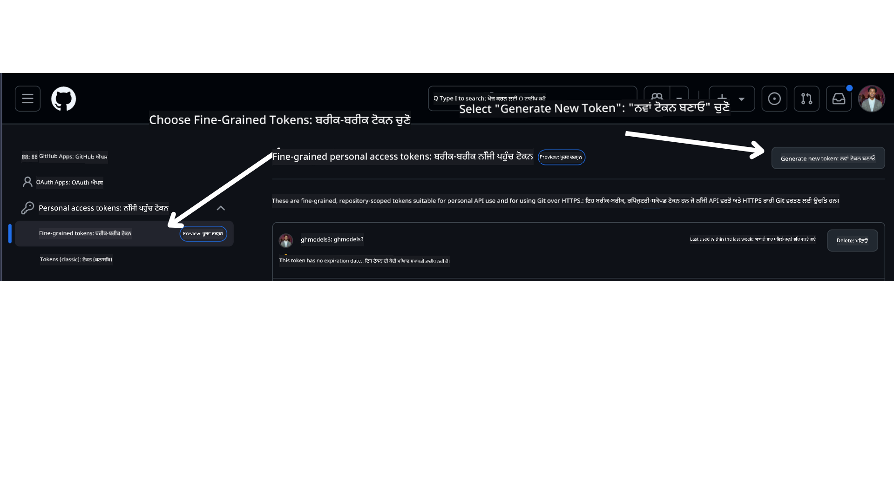

<!--
CO_OP_TRANSLATOR_METADATA:
{
  "original_hash": "76945069b52a49cd0432ae3e0b0ba22e",
  "translation_date": "2025-07-12T07:48:02+00:00",
  "source_file": "00-course-setup/README.md",
  "language_code": "pa"
}
-->
ਤੁਹਾਡੇ ਕੋਲ ਹੁਣ ਇਸ ਕੋਰਸ ਦਾ ਆਪਣਾ ਫੋਰਕ ਕੀਤਾ ਹੋਇਆ ਵਰਜਨ ਹੇਠਾਂ ਦਿੱਤੇ ਲਿੰਕ 'ਤੇ ਹੋਣਾ ਚਾਹੀਦਾ ਹੈ:


## ਕੋਡ ਚਲਾਉਣਾ

ਇਹ ਕੋਰਸ ਕੁਝ Jupyter Notebooks ਪ੍ਰਦਾਨ ਕਰਦਾ ਹੈ ਜਿਨ੍ਹਾਂ ਨੂੰ ਤੁਸੀਂ ਚਲਾ ਕੇ AI ਏਜੰਟ ਬਣਾਉਣ ਦਾ ਹੱਥੋਂ-ਹੱਥ ਅਨੁਭਵ ਪ੍ਰਾਪਤ ਕਰ ਸਕਦੇ ਹੋ।

ਕੋਡ ਸੈਂਪਲ ਹੇਠਾਂ ਦਿੱਤੇ ਵਿਕਲਪਾਂ ਵਿੱਚੋਂ ਕਿਸੇ ਇੱਕ ਨੂੰ ਵਰਤਦੇ ਹਨ:

**GitHub ਖਾਤੇ ਦੀ ਲੋੜ - ਮੁਫ਼ਤ**:

1) Semantic Kernel Agent Framework + GitHub Models Marketplace। (semantic-kernel.ipynb)
2) AutoGen Framework + GitHub Models Marketplace। (autogen.ipynb)

**Azure ਸਬਸਕ੍ਰਿਪਸ਼ਨ ਦੀ ਲੋੜ**:
3) Azure AI Foundry + Azure AI Agent Service। (azureaiagent.ipynb)

ਅਸੀਂ ਤੁਹਾਨੂੰ ਸਲਾਹ ਦਿੰਦੇ ਹਾਂ ਕਿ ਤੁਸੀਂ ਤਿੰਨਾਂ ਕਿਸਮਾਂ ਦੇ ਉਦਾਹਰਣਾਂ ਨੂੰ ਅਜ਼ਮਾਓ ਤਾਂ ਜੋ ਤੁਸੀਂ ਵੇਖ ਸਕੋ ਕਿ ਤੁਹਾਡੇ ਲਈ ਕਿਹੜਾ ਸਭ ਤੋਂ ਵਧੀਆ ਕੰਮ ਕਰਦਾ ਹੈ।

ਜੋ ਵੀ ਵਿਕਲਪ ਤੁਸੀਂ ਚੁਣਦੇ ਹੋ, ਉਹ ਹੇਠਾਂ ਦਿੱਤੇ ਸੈਟਅਪ ਕਦਮਾਂ ਨੂੰ ਫਾਲੋ ਕਰਨ ਲਈ ਤੁਹਾਨੂੰ ਦਿਸ਼ਾ ਦਿੰਦਾ ਹੈ:

## ਲੋੜੀਂਦੇ ਚੀਜ਼ਾਂ

- Python 3.12+
  - **NOTE**: ਜੇ ਤੁਹਾਡੇ ਕੋਲ Python3.12 ਇੰਸਟਾਲ ਨਹੀਂ ਹੈ, ਤਾਂ ਕਿਰਪਾ ਕਰਕੇ ਇਸਨੂੰ ਇੰਸਟਾਲ ਕਰੋ। ਫਿਰ python3.12 ਨਾਲ ਆਪਣਾ venv ਬਣਾਓ ਤਾਂ ਜੋ requirements.txt ਫਾਈਲ ਤੋਂ ਸਹੀ ਵਰਜਨ ਇੰਸਟਾਲ ਹੋ ਸਕਣ।
- GitHub ਖਾਤਾ - GitHub Models Marketplace ਤੱਕ ਪਹੁੰਚ ਲਈ
- Azure ਸਬਸਕ੍ਰਿਪਸ਼ਨ - Azure AI Foundry ਤੱਕ ਪਹੁੰਚ ਲਈ
- Azure AI Foundry ਖਾਤਾ - Azure AI Agent Service ਤੱਕ ਪਹੁੰਚ ਲਈ

ਅਸੀਂ ਇਸ ਰਿਪੋਜ਼ਟਰੀ ਦੀ ਰੂਟ ਵਿੱਚ `requirements.txt` ਫਾਈਲ ਸ਼ਾਮਲ ਕੀਤੀ ਹੈ ਜਿਸ ਵਿੱਚ ਸਾਰੇ ਲੋੜੀਂਦੇ Python ਪੈਕੇਜ ਹਨ ਜੋ ਕੋਡ ਸੈਂਪਲ ਚਲਾਉਣ ਲਈ ਜ਼ਰੂਰੀ ਹਨ।

ਤੁਸੀਂ ਇਹਨਾਂ ਨੂੰ ਰਿਪੋਜ਼ਟਰੀ ਦੀ ਰੂਟ ਵਿੱਚ ਆਪਣੇ ਟਰਮੀਨਲ ਵਿੱਚ ਹੇਠਾਂ ਦਿੱਤਾ ਕਮਾਂਡ ਚਲਾ ਕੇ ਇੰਸਟਾਲ ਕਰ ਸਕਦੇ ਹੋ:

```bash
pip install -r requirements.txt
```

ਕਿਸੇ ਵੀ ਟਕਰਾਅ ਅਤੇ ਸਮੱਸਿਆਵਾਂ ਤੋਂ ਬਚਣ ਲਈ ਅਸੀਂ Python ਵਰਚੁਅਲ ਇਨਵਾਇਰਨਮੈਂਟ ਬਣਾਉਣ ਦੀ ਸਿਫਾਰਸ਼ ਕਰਦੇ ਹਾਂ।

## VSCode ਸੈਟਅਪ ਕਰੋ
ਪੱਕਾ ਕਰੋ ਕਿ ਤੁਸੀਂ VSCode ਵਿੱਚ ਸਹੀ Python ਵਰਜਨ ਵਰਤ ਰਹੇ ਹੋ।


## GitHub Models ਵਰਤ ਕੇ ਸੈਂਪਲ ਲਈ ਸੈਟਅਪ

### ਕਦਮ 1: ਆਪਣਾ GitHub Personal Access Token (PAT) ਪ੍ਰਾਪਤ ਕਰੋ

ਇਸ ਸਮੇਂ, ਇਹ ਕੋਰਸ GitHub Models Marketplace ਦੀ ਵਰਤੋਂ ਕਰਦਾ ਹੈ ਜੋ ਮੁਫ਼ਤ ਤੌਰ 'ਤੇ ਵੱਡੇ ਭਾਸ਼ਾਈ ਮਾਡਲ (LLMs) ਤੱਕ ਪਹੁੰਚ ਦਿੰਦਾ ਹੈ ਜੋ AI ਏਜੰਟ ਬਣਾਉਣ ਲਈ ਵਰਤੇ ਜਾਣਗੇ।

ਇਸ ਸੇਵਾ ਤੱਕ ਪਹੁੰਚ ਲਈ, ਤੁਹਾਨੂੰ GitHub Personal Access Token ਬਣਾਉਣਾ ਪਵੇਗਾ।

ਇਹ ਤੁਹਾਡੇ GitHub ਖਾਤੇ ਵਿੱਚ ਜਾ ਕੇ ਕੀਤਾ ਜਾ ਸਕਦਾ ਹੈ।

ਆਪਣੇ GitHub ਖਾਤੇ ਵਿੱਚ ਜਾਓ।

ਸਕਰੀਨ ਦੇ ਖੱਬੇ ਪਾਸੇ `Fine-grained tokens` ਵਿਕਲਪ ਚੁਣੋ।

ਫਿਰ `Generate new token` ਚੁਣੋ।



ਤੁਹਾਨੂੰ ਆਪਣੇ ਟੋਕਨ ਲਈ ਨਾਮ ਦਰਜ ਕਰਨ ਲਈ ਕਿਹਾ ਜਾਵੇਗਾ, ਮਿਆਦ ਦੀ ਮਿਆਦ ਚੁਣੋ (ਸਿਫਾਰਸ਼ੀ: 30 ਦਿਨ), ਅਤੇ ਆਪਣੇ ਟੋਕਨ ਲਈ ਸਕੋਪ ਚੁਣੋ (Public Repositories)।

ਇਸ ਟੋਕਨ ਦੀ ਪਰਮਿਸ਼ਨਾਂ ਨੂੰ ਵੀ ਸੋਧਣਾ ਜਰੂਰੀ ਹੈ: Permissions -> Models -> GitHub Models ਤੱਕ ਪਹੁੰਚ ਦੀ ਆਗਿਆ ਦਿੰਦਾ ਹੈ।

ਹੁਣ ਤੁਸੀਂ ਆਪਣਾ ਨਵਾਂ ਬਣਾਇਆ ਹੋਇਆ ਟੋਕਨ ਕਾਪੀ ਕਰੋ। ਇਸਨੂੰ ਹੁਣ ਤੁਸੀਂ ਇਸ ਕੋਰਸ ਵਿੱਚ ਸ਼ਾਮਲ `.env` ਫਾਈਲ ਵਿੱਚ ਜੋੜੋਗੇ।

### ਕਦਮ 2: ਆਪਣੀ `.env` ਫਾਈਲ ਬਣਾਓ

ਆਪਣੇ ਟਰਮੀਨਲ ਵਿੱਚ ਹੇਠਾਂ ਦਿੱਤਾ ਕਮਾਂਡ ਚਲਾਕੇ ਆਪਣੀ `.env` ਫਾਈਲ ਬਣਾਓ।

```bash
cp .env.example .env
```

ਇਹ ਉਦਾਹਰਣ ਫਾਈਲ ਨੂੰ ਕਾਪੀ ਕਰਕੇ ਤੁਹਾਡੇ ਡਾਇਰੈਕਟਰੀ ਵਿੱਚ `.env` ਬਣਾਏਗਾ ਜਿੱਥੇ ਤੁਸੀਂ ਵਾਤਾਵਰਣ ਵੈਰੀਏਬਲਾਂ ਲਈ ਮੁੱਲ ਭਰ ਸਕਦੇ ਹੋ।

ਆਪਣਾ ਟੋਕਨ ਕਾਪੀ ਕਰਨ ਤੋਂ ਬਾਅਦ, `.env` ਫਾਈਲ ਨੂੰ ਆਪਣੇ ਮਨਪਸੰਦ ਟੈਕਸਟ ਐਡੀਟਰ ਵਿੱਚ ਖੋਲ੍ਹੋ ਅਤੇ `GITHUB_TOKEN` ਖੇਤਰ ਵਿੱਚ ਆਪਣਾ ਟੋਕਨ ਪੇਸਟ ਕਰੋ।

ਹੁਣ ਤੁਸੀਂ ਇਸ ਕੋਰਸ ਦੇ ਕੋਡ ਸੈਂਪਲ ਚਲਾ ਸਕਦੇ ਹੋ।

## Azure AI Foundry ਅਤੇ Azure AI Agent Service ਵਰਤ ਕੇ ਸੈਂਪਲ ਲਈ ਸੈਟਅਪ

### ਕਦਮ 1: ਆਪਣਾ Azure ਪ੍ਰੋਜੈਕਟ Endpoint ਪ੍ਰਾਪਤ ਕਰੋ

Azure AI Foundry ਵਿੱਚ ਹੱਬ ਅਤੇ ਪ੍ਰੋਜੈਕਟ ਬਣਾਉਣ ਲਈ ਹੇਠਾਂ ਦਿੱਤੇ ਕਦਮਾਂ ਦੀ ਪਾਲਣਾ ਕਰੋ: [Hub resources overview](https://learn.microsoft.com/en-us/azure/ai-foundry/concepts/ai-resources)

ਜਦੋਂ ਤੁਸੀਂ ਆਪਣਾ ਪ੍ਰੋਜੈਕਟ ਬਣਾਲੈਂਦੇ ਹੋ, ਤਾਂ ਤੁਹਾਨੂੰ ਆਪਣੇ ਪ੍ਰੋਜੈਕਟ ਲਈ ਕਨੈਕਸ਼ਨ ਸਟਰਿੰਗ ਪ੍ਰਾਪਤ ਕਰਨੀ ਪਵੇਗੀ।

ਇਹ Azure AI Foundry ਪੋਰਟਲ ਵਿੱਚ ਆਪਣੇ ਪ੍ਰੋਜੈਕਟ ਦੇ **Overview** ਪੰਨੇ 'ਤੇ ਜਾ ਕੇ ਕੀਤਾ ਜਾ ਸਕਦਾ ਹੈ।


### ਕਦਮ 2: ਆਪਣੀ `.env` ਫਾਈਲ ਬਣਾਓ

ਆਪਣੇ ਟਰਮੀਨਲ ਵਿੱਚ ਹੇਠਾਂ ਦਿੱਤਾ ਕਮਾਂਡ ਚਲਾਕੇ ਆਪਣੀ `.env` ਫਾਈਲ ਬਣਾਓ।

```bash
cp .env.example .env
```

ਇਹ ਉਦਾਹਰਣ ਫਾਈਲ ਨੂੰ ਕਾਪੀ ਕਰਕੇ ਤੁਹਾਡੇ ਡਾਇਰੈਕਟਰੀ ਵਿੱਚ `.env` ਬਣਾਏਗਾ ਜਿੱਥੇ ਤੁਸੀਂ ਵਾਤਾਵਰਣ ਵੈਰੀਏਬਲਾਂ ਲਈ ਮੁੱਲ ਭਰ ਸਕਦੇ ਹੋ।

ਆਪਣਾ ਟੋਕਨ ਕਾਪੀ ਕਰਨ ਤੋਂ ਬਾਅਦ, `.env` ਫਾਈਲ ਨੂੰ ਆਪਣੇ ਮਨਪਸੰਦ ਟੈਕਸਟ ਐਡੀਟਰ ਵਿੱਚ ਖੋਲ੍ਹੋ ਅਤੇ `PROJECT_ENDPOINT` ਖੇਤਰ ਵਿੱਚ ਆਪਣਾ ਟੋਕਨ ਪੇਸਟ ਕਰੋ।

### ਕਦਮ 3: Azure ਵਿੱਚ ਸਾਈਨ ਇਨ ਕਰੋ

ਸੁਰੱਖਿਆ ਦੇ ਸਭ ਤੋਂ ਵਧੀਆ ਤਰੀਕੇ ਵਜੋਂ, ਅਸੀਂ Microsoft Entra ID ਨਾਲ Azure OpenAI ਨੂੰ ਪ੍ਰਮਾਣਿਤ ਕਰਨ ਲਈ [keyless authentication](https://learn.microsoft.com/azure/developer/ai/keyless-connections?tabs=csharp%2Cazure-cli?WT.mc_id=academic-105485-koreyst) ਵਰਤਾਂਗੇ। ਇਸ ਤੋਂ ਪਹਿਲਾਂ, ਤੁਹਾਨੂੰ ਆਪਣੇ ਓਪਰੇਟਿੰਗ ਸਿਸਟਮ ਲਈ **Azure CLI** ਇੰਸਟਾਲ ਕਰਨਾ ਪਵੇਗਾ, ਜਿਵੇਂ ਕਿ [ਇੰਸਟਾਲੇਸ਼ਨ ਨਿਰਦੇਸ਼ਾਂ](https://learn.microsoft.com/cli/azure/install-azure-cli?WT.mc_id=academic-105485-koreyst) ਵਿੱਚ ਦਿੱਤਾ ਗਿਆ ਹੈ।

ਫਿਰ, ਟਰਮੀਨਲ ਖੋਲ੍ਹੋ ਅਤੇ `az login --use-device-code` ਚਲਾਕੇ ਆਪਣੇ Azure ਖਾਤੇ ਵਿੱਚ ਸਾਈਨ ਇਨ ਕਰੋ।

ਜਦੋਂ ਤੁਸੀਂ ਲੌਗਇਨ ਕਰ ਲੈਂਦੇ ਹੋ, ਟਰਮੀਨਲ ਵਿੱਚ ਆਪਣੀ ਸਬਸਕ੍ਰਿਪਸ਼ਨ ਚੁਣੋ।

## ਵਾਧੂ ਵਾਤਾਵਰਣ ਵੈਰੀਏਬਲ - Azure Search ਅਤੇ Azure OpenAI

Agentic RAG ਪਾਠ - ਪਾਠ 5 ਵਿੱਚ ਕੁਝ ਸੈਂਪਲ ਹਨ ਜੋ Azure Search ਅਤੇ Azure OpenAI ਵਰਤਦੇ ਹਨ।

ਜੇ ਤੁਸੀਂ ਇਹ ਸੈਂਪਲ ਚਲਾਉਣਾ ਚਾਹੁੰਦੇ ਹੋ, ਤਾਂ ਤੁਹਾਨੂੰ ਆਪਣੀ `.env` ਫਾਈਲ ਵਿੱਚ ਹੇਠਾਂ ਦਿੱਤੇ ਵਾਤਾਵਰਣ ਵੈਰੀਏਬਲ ਸ਼ਾਮਲ ਕਰਨੇ ਪੈਣਗੇ:

### Overview ਪੰਨਾ (ਪ੍ਰੋਜੈਕਟ)

- `AZURE_SUBSCRIPTION_ID` - ਆਪਣੇ ਪ੍ਰੋਜੈਕਟ ਦੇ **Overview** ਪੰਨੇ 'ਤੇ **Project details** ਵੇਖੋ।

- `AZURE_AI_PROJECT_NAME` - ਆਪਣੇ ਪ੍ਰੋਜੈਕਟ ਦੇ **Overview** ਪੰਨੇ ਦੇ ਸਿਰਲੇਖ 'ਤੇ ਵੇਖੋ।

- `AZURE_OPENAI_SERVICE` - **Overview** ਪੰਨੇ 'ਤੇ **Included capabilities** ਟੈਬ ਵਿੱਚ **Azure OpenAI Service** ਲੱਭੋ।

### Management Center

- `AZURE_OPENAI_RESOURCE_GROUP` - **Management Center** ਦੇ **Overview** ਪੰਨੇ 'ਤੇ **Project properties** ਵਿੱਚ ਜਾਓ।

- `GLOBAL_LLM_SERVICE` - **Connected resources** ਹੇਠਾਂ, **Azure AI Services** ਕਨੈਕਸ਼ਨ ਨਾਮ ਲੱਭੋ। ਜੇ ਨਹੀਂ ਮਿਲਦਾ, ਤਾਂ ਆਪਣੇ ਰਿਸੋਰਸ ਗਰੁੱਪ ਵਿੱਚ Azure ਪੋਰਟਲ ਵਿੱਚ AI Services ਰਿਸੋਰਸ ਨਾਮ ਚੈੱਕ ਕਰੋ।

### Models + Endpoints ਪੰਨਾ

- `AZURE_OPENAI_EMBEDDING_DEPLOYMENT_NAME` - ਆਪਣਾ embedding ਮਾਡਲ (ਜਿਵੇਂ `text-embedding-ada-002`) ਚੁਣੋ ਅਤੇ ਮਾਡਲ ਵੇਰਵੇ ਤੋਂ **Deployment name** ਨੋਟ ਕਰੋ।

- `AZURE_OPENAI_CHAT_DEPLOYMENT_NAME` - ਆਪਣਾ chat ਮਾਡਲ (ਜਿਵੇਂ `gpt-4o-mini`) ਚੁਣੋ ਅਤੇ ਮਾਡਲ ਵੇਰਵੇ ਤੋਂ **Deployment name** ਨੋਟ ਕਰੋ।

### Azure ਪੋਰਟਲ

- `AZURE_OPENAI_ENDPOINT` - **Azure AI services** ਲੱਭੋ, ਇਸ 'ਤੇ ਕਲਿੱਕ ਕਰੋ, ਫਿਰ **Resource Management**, **Keys and Endpoint** 'ਤੇ ਜਾਓ, "Azure OpenAI endpoints" ਤੱਕ ਸਕ੍ਰੋਲ ਕਰੋ ਅਤੇ "Language APIs" ਵਾਲਾ ਕਾਪੀ ਕਰੋ।

- `AZURE_OPENAI_API_KEY` - ਉਸੇ ਸਕ੍ਰੀਨ ਤੋਂ KEY 1 ਜਾਂ KEY 2 ਕਾਪੀ ਕਰੋ।

- `AZURE_SEARCH_SERVICE_ENDPOINT` - ਆਪਣਾ **Azure AI Search** ਰਿਸੋਰਸ ਲੱਭੋ, ਇਸ 'ਤੇ ਕਲਿੱਕ ਕਰੋ ਅਤੇ **Overview** ਵੇਖੋ।

- `AZURE_SEARCH_API_KEY` - ਫਿਰ **Settings** ਵਿੱਚ ਜਾਓ ਅਤੇ **Keys** ਤੋਂ ਪ੍ਰਾਇਮਰੀ ਜਾਂ ਸੈਕੰਡਰੀ ਐਡਮਿਨ ਕੀ ਕਾਪੀ ਕਰੋ।

### ਬਾਹਰੀ ਵੈੱਬਪੇਜ

- `AZURE_OPENAI_API_VERSION` - [API version lifecycle](https://learn.microsoft.com/en-us/azure/ai-services/openai/api-version-deprecation#latest-ga-api-release) ਪੰਨਾ ਵੇਖੋ, ਖਾਸ ਕਰਕੇ **Latest GA API release** ਹਿੱਸਾ।

### keyless authentication ਸੈਟਅਪ ਕਰੋ

ਆਪਣੇ ਕ੍ਰੈਡੈਂਸ਼ਲ ਸਿੱਧਾ ਕੋਡ ਵਿੱਚ ਨਾ ਲਿਖੋ, ਅਸੀਂ Azure OpenAI ਨਾਲ keyless connection ਵਰਤਾਂਗੇ। ਇਸ ਲਈ, ਅਸੀਂ `DefaultAzureCredential` ਇੰਪੋਰਟ ਕਰਾਂਗੇ ਅਤੇ ਬਾਅਦ ਵਿੱਚ `DefaultAzureCredential` ਫੰਕਸ਼ਨ ਨੂੰ ਕਾਲ ਕਰਕੇ ਕ੍ਰੈਡੈਂਸ਼ਲ ਪ੍ਰਾਪਤ ਕਰਾਂਗੇ।

```python
from azure.identity import DefaultAzureCredential, InteractiveBrowserCredential
```

## ਕਿੱਥੇ ਫਸ ਗਏ ਹੋ?

ਜੇ ਤੁਹਾਨੂੰ ਇਸ ਸੈਟਅਪ ਨੂੰ ਚਲਾਉਣ ਵਿੱਚ ਕੋਈ ਸਮੱਸਿਆ ਆ ਰਹੀ ਹੈ, ਤਾਂ ਸਾਡੇ ਨਾਲ ਸੰਪਰਕ ਕਰੋ

ਜਾਂ

## ਅਗਲਾ ਪਾਠ

ਹੁਣ ਤੁਸੀਂ ਇਸ ਕੋਰਸ ਦਾ ਕੋਡ ਚਲਾਉਣ ਲਈ ਤਿਆਰ ਹੋ। AI ਏਜੰਟਾਂ ਦੀ ਦੁਨੀਆ ਬਾਰੇ ਹੋਰ ਸਿੱਖਣ ਦਾ ਮਜ਼ਾ ਲਓ!

[Introduction to AI Agents and Agent Use Cases](../01-intro-to-ai-agents/README.md)

**ਅਸਵੀਕਾਰੋਪਣ**:  
ਇਹ ਦਸਤਾਵੇਜ਼ AI ਅਨੁਵਾਦ ਸੇਵਾ [Co-op Translator](https://github.com/Azure/co-op-translator) ਦੀ ਵਰਤੋਂ ਕਰਕੇ ਅਨੁਵਾਦਿਤ ਕੀਤਾ ਗਿਆ ਹੈ। ਜਦੋਂ ਕਿ ਅਸੀਂ ਸਹੀਤਾ ਲਈ ਕੋਸ਼ਿਸ਼ ਕਰਦੇ ਹਾਂ, ਕਿਰਪਾ ਕਰਕੇ ਧਿਆਨ ਰੱਖੋ ਕਿ ਸਵੈਚਾਲਿਤ ਅਨੁਵਾਦਾਂ ਵਿੱਚ ਗਲਤੀਆਂ ਜਾਂ ਅਸਮਰਥਤਾਵਾਂ ਹੋ ਸਕਦੀਆਂ ਹਨ। ਮੂਲ ਦਸਤਾਵੇਜ਼ ਆਪਣੀ ਮੂਲ ਭਾਸ਼ਾ ਵਿੱਚ ਪ੍ਰਮਾਣਿਕ ਸਰੋਤ ਮੰਨਿਆ ਜਾਣਾ ਚਾਹੀਦਾ ਹੈ। ਮਹੱਤਵਪੂਰਨ ਜਾਣਕਾਰੀ ਲਈ, ਪੇਸ਼ੇਵਰ ਮਨੁੱਖੀ ਅਨੁਵਾਦ ਦੀ ਸਿਫਾਰਸ਼ ਕੀਤੀ ਜਾਂਦੀ ਹੈ। ਅਸੀਂ ਇਸ ਅਨੁਵਾਦ ਦੀ ਵਰਤੋਂ ਤੋਂ ਉਤਪੰਨ ਕਿਸੇ ਵੀ ਗਲਤਫਹਿਮੀ ਜਾਂ ਗਲਤ ਵਿਆਖਿਆ ਲਈ ਜ਼ਿੰਮੇਵਾਰ ਨਹੀਂ ਹਾਂ।