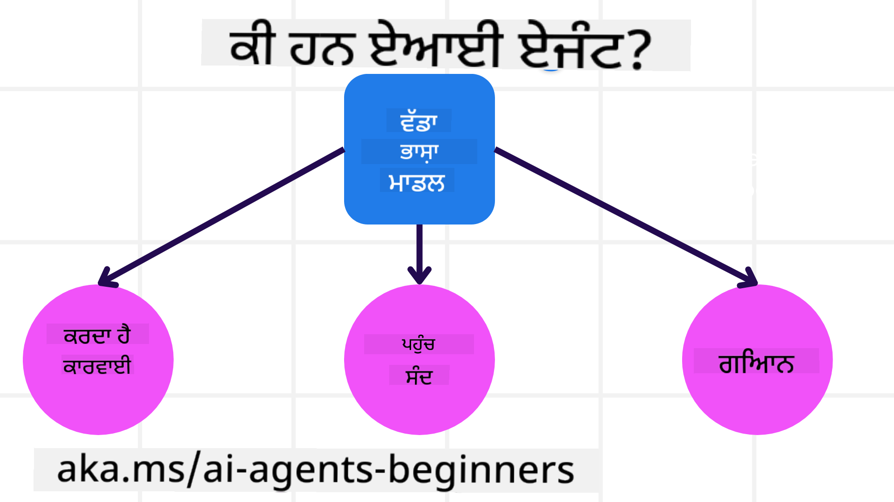

<!--
CO_OP_TRANSLATOR_METADATA:
{
  "original_hash": "d84943abc8f001ad4670418d32c2d899",
  "translation_date": "2025-07-12T08:05:05+00:00",
  "source_file": "01-intro-to-ai-agents/README.md",
  "language_code": "pa"
}
-->
ਹੋਰ ਸਿੱਖਣ ਵਾਲਿਆਂ ਅਤੇ AI ਏਜੰਟ ਬਿਲਡਰਾਂ ਨਾਲ ਮਿਲਣ ਲਈ ਜੁੜੋ ਅਤੇ ਇਸ ਕੋਰਸ ਬਾਰੇ ਕੋਈ ਵੀ ਸਵਾਲ ਪੁੱਛੋ।

ਇਸ ਕੋਰਸ ਦੀ ਸ਼ੁਰੂਆਤ ਕਰਨ ਲਈ, ਅਸੀਂ ਪਹਿਲਾਂ ਇਹ ਸਮਝਣ ਦੀ ਕੋਸ਼ਿਸ਼ ਕਰਾਂਗੇ ਕਿ AI ਏਜੰਟ ਕੀ ਹਨ ਅਤੇ ਅਸੀਂ ਉਨ੍ਹਾਂ ਨੂੰ ਆਪਣੇ ਬਣਾਏ ਹੋਏ ਐਪਲੀਕੇਸ਼ਨਾਂ ਅਤੇ ਵਰਕਫਲੋਜ਼ ਵਿੱਚ ਕਿਵੇਂ ਵਰਤ ਸਕਦੇ ਹਾਂ।

## ਪਰਿਚਯ

ਇਸ ਪਾਠ ਵਿੱਚ ਇਹ ਸਮਝਾਇਆ ਗਿਆ ਹੈ:

- AI ਏਜੰਟ ਕੀ ਹਨ ਅਤੇ ਏਜੰਟਾਂ ਦੇ ਵੱਖ-ਵੱਖ ਕਿਸਮਾਂ ਕਿਹੜੀਆਂ ਹਨ?
- AI ਏਜੰਟਾਂ ਲਈ ਸਭ ਤੋਂ ਵਧੀਆ ਵਰਤੋਂ ਦੇ ਕੇਸ ਕਿਹੜੇ ਹਨ ਅਤੇ ਇਹ ਸਾਡੇ ਲਈ ਕਿਵੇਂ ਮਦਦਗਾਰ ਹੋ ਸਕਦੇ ਹਨ?
- ਏਜੰਟਿਕ ਹੱਲਾਂ ਨੂੰ ਡਿਜ਼ਾਈਨ ਕਰਦੇ ਸਮੇਂ ਕੁਝ ਮੁੱਖ ਬੁਨਿਆਦੀ ਤੱਤ ਕੀ ਹਨ?

## ਸਿੱਖਣ ਦੇ ਲਕੜੇ
ਇਸ ਪਾਠ ਨੂੰ ਪੂਰਾ ਕਰਨ ਤੋਂ ਬਾਅਦ, ਤੁਸੀਂ ਸਮਰੱਥ ਹੋਵੋਗੇ:

- AI ਏਜੰਟਾਂ ਦੇ ਸੰਕਲਪਾਂ ਨੂੰ ਸਮਝਣਾ ਅਤੇ ਇਹ ਹੋਰ AI ਹੱਲਾਂ ਤੋਂ ਕਿਵੇਂ ਵੱਖਰੇ ਹਨ।
- AI ਏਜੰਟਾਂ ਨੂੰ ਸਭ ਤੋਂ ਪ੍ਰਭਾਵਸ਼ਾਲੀ ਢੰਗ ਨਾਲ ਲਾਗੂ ਕਰਨਾ।
- ਉਪਭੋਗਤਾਵਾਂ ਅਤੇ ਗਾਹਕਾਂ ਲਈ ਉਤਪਾਦਕ ਤਰੀਕੇ ਨਾਲ ਏਜੰਟਿਕ ਹੱਲਾਂ ਡਿਜ਼ਾਈਨ ਕਰਨਾ।

## AI ਏਜੰਟਾਂ ਦੀ ਪਰਿਭਾਸ਼ਾ ਅਤੇ AI ਏਜੰਟਾਂ ਦੇ ਕਿਸਮਾਂ

### AI ਏਜੰਟ ਕੀ ਹਨ?

AI ਏਜੰਟ ਉਹ **ਸਿਸਟਮ** ਹਨ ਜੋ **ਵੱਡੇ ਭਾਸ਼ਾ ਮਾਡਲਾਂ (LLMs)** ਨੂੰ **ਕਿਰਿਆਵਾਂ ਕਰਨ ਯੋਗ** ਬਣਾਉਂਦੇ ਹਨ, ਜਿਨ੍ਹਾਂ ਨੂੰ ਟੂਲਾਂ ਅਤੇ ਗਿਆਨ ਤੱਕ ਪਹੁੰਚ ਦੇ ਕੇ ਉਹਨਾਂ ਦੀ ਸਮਰੱਥਾ ਵਧਾਈ ਜਾਂਦੀ ਹੈ।

ਆਓ ਇਸ ਪਰਿਭਾਸ਼ਾ ਨੂੰ ਛੋਟੇ ਹਿੱਸਿਆਂ ਵਿੱਚ ਵੰਡਦੇ ਹਾਂ:

- **ਸਿਸਟਮ** - ਏਜੰਟਾਂ ਨੂੰ ਸਿਰਫ ਇੱਕ ਇਕਾਈ ਵਜੋਂ ਨਹੀਂ, ਬਲਕਿ ਕਈ ਹਿੱਸਿਆਂ ਦੇ ਸਿਸਟਮ ਵਜੋਂ ਸੋਚਣਾ ਜਰੂਰੀ ਹੈ। ਬੁਨਿਆਦੀ ਪੱਧਰ 'ਤੇ, AI ਏਜੰਟ ਦੇ ਹਿੱਸੇ ਹਨ:
  - **ਵਾਤਾਵਰਣ** - ਉਹ ਨਿਰਧਾਰਿਤ ਜਗ੍ਹਾ ਜਿੱਥੇ AI ਏਜੰਟ ਕੰਮ ਕਰ ਰਿਹਾ ਹੁੰਦਾ ਹੈ। ਉਦਾਹਰਨ ਵਜੋਂ, ਜੇ ਸਾਡੇ ਕੋਲ ਇੱਕ ਯਾਤਰਾ ਬੁਕਿੰਗ AI ਏਜੰਟ ਹੈ, ਤਾਂ ਵਾਤਾਵਰਣ ਉਹ ਯਾਤਰਾ ਬੁਕਿੰਗ ਸਿਸਟਮ ਹੋ ਸਕਦਾ ਹੈ ਜਿਸਦਾ ਇਸਤੇਮਾਲ ਏਜੰਟ ਕੰਮ ਪੂਰਾ ਕਰਨ ਲਈ ਕਰਦਾ ਹੈ।
  - **ਸੈਂਸਰ** - ਵਾਤਾਵਰਣ ਵਿੱਚ ਜਾਣਕਾਰੀ ਹੁੰਦੀ ਹੈ ਅਤੇ ਇਹ ਫੀਡਬੈਕ ਦਿੰਦਾ ਹੈ। AI ਏਜੰਟ ਇਸ ਜਾਣਕਾਰੀ ਨੂੰ ਇਕੱਠਾ ਕਰਨ ਅਤੇ ਵਿਆਖਿਆ ਕਰਨ ਲਈ ਸੈਂਸਰਾਂ ਦੀ ਵਰਤੋਂ ਕਰਦਾ ਹੈ। ਯਾਤਰਾ ਬੁਕਿੰਗ ਏਜੰਟ ਦੇ ਉਦਾਹਰਨ ਵਿੱਚ, ਯਾਤਰਾ ਬੁਕਿੰਗ ਸਿਸਟਮ ਹੋਟਲ ਦੀ ਉਪਲਬਧਤਾ ਜਾਂ ਉਡਾਣਾਂ ਦੀ ਕੀਮਤ ਵਰਗੀਆਂ ਜਾਣਕਾਰੀਆਂ ਦੇ ਸਕਦਾ ਹੈ।
  - **ਐਕਚੂਏਟਰ** - ਜਦੋਂ AI ਏਜੰਟ ਵਾਤਾਵਰਣ ਦੀ ਮੌਜੂਦਾ ਸਥਿਤੀ ਪ੍ਰਾਪਤ ਕਰ ਲੈਂਦਾ ਹੈ, ਤਾਂ ਉਹ ਤੈਅ ਕਰਦਾ ਹੈ ਕਿ ਵਾਤਾਵਰਣ ਨੂੰ ਬਦਲਣ ਲਈ ਕਿਹੜੀ ਕਾਰਵਾਈ ਕਰਨੀ ਹੈ। ਯਾਤਰਾ ਬੁਕਿੰਗ ਏਜੰਟ ਲਈ, ਇਹ ਉਪਲਬਧ ਕਮਰੇ ਦੀ ਬੁਕਿੰਗ ਕਰਨਾ ਹੋ ਸਕਦਾ ਹੈ।

**ਵੱਡੇ ਭਾਸ਼ਾ ਮਾਡਲ (LLMs)** - ਏਜੰਟਾਂ ਦਾ ਸੰਕਲਪ LLMs ਦੇ ਬਣਨ ਤੋਂ ਪਹਿਲਾਂ ਵੀ ਮੌਜੂਦ ਸੀ। LLMs ਨਾਲ AI ਏਜੰਟ ਬਣਾਉਣ ਦਾ ਫਾਇਦਾ ਇਹ ਹੈ ਕਿ ਇਹ ਮਨੁੱਖੀ ਭਾਸ਼ਾ ਅਤੇ ਡੇਟਾ ਨੂੰ ਸਮਝ ਸਕਦੇ ਹਨ। ਇਸ ਸਮਰੱਥਾ ਨਾਲ LLMs ਵਾਤਾਵਰਣ ਦੀ ਜਾਣਕਾਰੀ ਨੂੰ ਸਮਝ ਕੇ ਵਾਤਾਵਰਣ ਬਦਲਣ ਲਈ ਯੋਜਨਾ ਤਿਆਰ ਕਰ ਸਕਦੇ ਹਨ।

**ਕਿਰਿਆਵਾਂ ਕਰਨਾ** - AI ਏਜੰਟ ਸਿਸਟਮਾਂ ਤੋਂ ਬਾਹਰ, LLMs ਸਿਰਫ ਉਪਭੋਗਤਾ ਦੀ ਪ੍ਰੰਪਟ ਦੇ ਆਧਾਰ 'ਤੇ ਸਮੱਗਰੀ ਜਾਂ ਜਾਣਕਾਰੀ ਬਣਾਉਣ ਤੱਕ ਸੀਮਿਤ ਹੁੰਦੇ ਹਨ। AI ਏਜੰਟ ਸਿਸਟਮਾਂ ਵਿੱਚ, LLMs ਉਪਭੋਗਤਾ ਦੀ ਬੇਨਤੀ ਨੂੰ ਸਮਝ ਕੇ ਅਤੇ ਉਪਲਬਧ ਟੂਲਾਂ ਦੀ ਵਰਤੋਂ ਕਰਕੇ ਕੰਮ ਕਰ ਸਕਦੇ ਹਨ।

**ਟੂਲਾਂ ਤੱਕ ਪਹੁੰਚ** - LLMs ਨੂੰ ਕਿਹੜੇ ਟੂਲਾਂ ਤੱਕ ਪਹੁੰਚ ਹੈ, ਇਹ 1) ਉਸ ਵਾਤਾਵਰਣ 'ਤੇ ਨਿਰਭਰ ਕਰਦਾ ਹੈ ਜਿਸ ਵਿੱਚ ਇਹ ਕੰਮ ਕਰ ਰਿਹਾ ਹੈ ਅਤੇ 2) AI ਏਜੰਟ ਦੇ ਵਿਕਾਸਕਾਰ 'ਤੇ। ਸਾਡੇ ਯਾਤਰਾ ਏਜੰਟ ਉਦਾਹਰਨ ਵਿੱਚ, ਏਜੰਟ ਦੇ ਟੂਲ ਬੁਕਿੰਗ ਸਿਸਟਮ ਵਿੱਚ ਉਪਲਬਧ ਕਾਰਵਾਈਆਂ ਨਾਲ ਸੀਮਿਤ ਹਨ, ਅਤੇ/ਜਾਂ ਵਿਕਾਸਕਾਰ ਏਜੰਟ ਦੀ ਟੂਲ ਪਹੁੰਚ ਨੂੰ ਉਡਾਣਾਂ ਤੱਕ ਸੀਮਿਤ ਕਰ ਸਕਦਾ ਹੈ।

**ਮੈਮੋਰੀ ਅਤੇ ਗਿਆਨ** - ਮੈਮੋਰੀ ਗੱਲਬਾਤ ਦੇ ਸੰਦਰਭ ਵਿੱਚ ਛੋਟੀ ਮਿਆਦ ਦੀ ਹੋ ਸਕਦੀ ਹੈ। ਲੰਮੀ ਮਿਆਦ ਲਈ, ਵਾਤਾਵਰਣ ਵੱਲੋਂ ਦਿੱਤੀ ਜਾਣਕਾਰੀ ਤੋਂ ਇਲਾਵਾ, AI ਏਜੰਟ ਹੋਰ ਸਿਸਟਮਾਂ, ਸੇਵਾਵਾਂ, ਟੂਲਾਂ ਅਤੇ ਹੋਰ ਏਜੰਟਾਂ ਤੋਂ ਵੀ ਗਿਆਨ ਪ੍ਰਾਪਤ ਕਰ ਸਕਦੇ ਹਨ। ਯਾਤਰਾ ਏਜੰਟ ਉਦਾਹਰਨ ਵਿੱਚ, ਇਹ ਗਿਆਨ ਗਾਹਕ ਡੇਟਾਬੇਸ ਵਿੱਚ ਸਥਿਤ ਉਪਭੋਗਤਾ ਦੀ ਯਾਤਰਾ ਪਸੰਦਾਂ ਬਾਰੇ ਜਾਣਕਾਰੀ ਹੋ ਸਕਦੀ ਹੈ।

### ਏਜੰਟਾਂ ਦੇ ਵੱਖ-ਵੱਖ ਕਿਸਮਾਂ

ਹੁਣ ਜਦੋਂ ਸਾਡੇ ਕੋਲ AI ਏਜੰਟਾਂ ਦੀ ਆਮ ਪਰਿਭਾਸ਼ਾ ਹੈ, ਆਓ ਕੁਝ ਖਾਸ ਕਿਸਮਾਂ ਦੇ ਏਜੰਟਾਂ ਨੂੰ ਵੇਖੀਏ ਅਤੇ ਇਹ ਯਾਤਰਾ ਬੁਕਿੰਗ AI ਏਜੰਟ ਵਿੱਚ ਕਿਵੇਂ ਲਾਗੂ ਹੋ ਸਕਦੇ ਹਨ।

| **ਏਜੰਟ ਕਿਸਮ**                | **ਵਰਣਨ**                                                                                                                       | **ਉਦਾਹਰਨ**                                                                                                                                                                                                                   |
| ----------------------------- | ------------------------------------------------------------------------------------------------------------------------------------- | ----------------------------------------------------------------------------------------------------------------------------------------------------------------------------------------------------------------------------- |
| **ਸਧਾਰਣ ਰਿਫਲੈਕਸ ਏਜੰਟ**      | ਪਹਿਲਾਂ ਤੋਂ ਨਿਰਧਾਰਿਤ ਨਿਯਮਾਂ ਦੇ ਆਧਾਰ 'ਤੇ ਤੁਰੰਤ ਕਾਰਵਾਈ ਕਰਦੇ ਹਨ।                                                                                  | ਯਾਤਰਾ ਏਜੰਟ ਈਮੇਲ ਦੇ ਸੰਦਰਭ ਨੂੰ ਸਮਝ ਕੇ ਯਾਤਰਾ ਦੀਆਂ ਸ਼ਿਕਾਇਤਾਂ ਨੂੰ ਗਾਹਕ ਸੇਵਾ ਨੂੰ ਭੇਜਦਾ ਹੈ।                                                                                                                          |
| **ਮਾਡਲ-ਆਧਾਰਿਤ ਰਿਫਲੈਕਸ ਏਜੰਟ** | ਸੰਸਾਰ ਦੇ ਮਾਡਲ ਅਤੇ ਉਸ ਮਾਡਲ ਵਿੱਚ ਹੋ ਰਹੇ ਬਦਲਾਵਾਂ ਦੇ ਆਧਾਰ 'ਤੇ ਕਾਰਵਾਈ ਕਰਦੇ ਹਨ।                                                              | ਯਾਤਰਾ ਏਜੰਟ ਇਤਿਹਾਸਕ ਕੀਮਤਾਂ ਦੇ ਡੇਟਾ ਤੱਕ ਪਹੁੰਚ ਦੇ ਆਧਾਰ 'ਤੇ ਮਹੱਤਵਪੂਰਨ ਕੀਮਤ ਬਦਲਾਵਾਂ ਵਾਲੇ ਰਸਤੇ ਨੂੰ ਤਰਜੀਹ ਦਿੰਦਾ ਹੈ।                                                                                                             |
| **ਲਕੜੀ-ਆਧਾਰਿਤ ਏਜੰਟ**         | ਖਾਸ ਲਕੜੀਆਂ ਨੂੰ ਪ੍ਰਾਪਤ ਕਰਨ ਲਈ ਯੋਜਨਾਵਾਂ ਬਣਾਉਂਦੇ ਹਨ ਅਤੇ ਲਕੜੀ ਨੂੰ ਪੂਰਾ ਕਰਨ ਲਈ ਕਾਰਵਾਈਆਂ ਤੈਅ ਕਰਦੇ ਹਨ।                                  | ਯਾਤਰਾ ਏਜੰਟ ਮੌਜੂਦਾ ਸਥਾਨ ਤੋਂ ਮੰਜ਼ਿਲ ਤੱਕ ਜ਼ਰੂਰੀ ਯਾਤਰਾ ਪ੍ਰਬੰਧ (ਕਾਰ, ਪਬਲਿਕ ਟ੍ਰਾਂਜ਼ਿਟ, ਉਡਾਣਾਂ) ਤੈਅ ਕਰਕੇ ਯਾਤਰਾ ਬੁਕ ਕਰਦਾ ਹੈ।                                                                                |
| **ਯੂਟਿਲਿਟੀ-ਆਧਾਰਿਤ ਏਜੰਟ**      | ਪਸੰਦਾਂ ਨੂੰ ਧਿਆਨ ਵਿੱਚ ਰੱਖਦੇ ਹੋਏ ਅਤੇ ਗਿਣਤੀਵਾਰ ਤੌਰ 'ਤੇ ਤਰਜੀਹਾਂ ਦਾ ਮੁਲਾਂਕਣ ਕਰਕੇ ਲਕੜੀਆਂ ਪ੍ਰਾਪਤ ਕਰਦੇ ਹਨ।                                               | ਯਾਤਰਾ ਏਜੰਟ ਯਾਤਰਾ ਬੁਕਿੰਗ ਦੌਰਾਨ ਸੁਵਿਧਾ ਅਤੇ ਲਾਗਤ ਦੇ ਵਿਚਕਾਰ ਤਰਜੀਹ ਦੇ ਕੇ ਯੂਟਿਲਿਟੀ ਨੂੰ ਵੱਧ ਤੋਂ ਵੱਧ ਕਰਦਾ ਹੈ।                                                                                                                                          |
| **ਸਿੱਖਣ ਵਾਲੇ ਏਜੰਟ**           | ਸਮੇਂ ਦੇ ਨਾਲ ਸੁਧਾਰ ਕਰਦੇ ਹਨ, ਫੀਡਬੈਕ ਦੇ ਆਧਾਰ 'ਤੇ ਕਾਰਵਾਈਆਂ ਨੂੰ ਢਾਲਦੇ ਹਨ।                                                        | ਯਾਤਰਾ ਏਜੰਟ ਯਾਤਰਾ ਮਗਰੋਂ ਸਰਵੇਖਣਾਂ ਤੋਂ ਗਾਹਕ ਫੀਡਬੈਕ ਲੈ ਕੇ ਭਵਿੱਖ ਦੀਆਂ ਬੁਕਿੰਗਾਂ ਵਿੱਚ ਸੁਧਾਰ ਕਰਦਾ ਹੈ।                                                                                                               |
| **ਹਾਇਰਾਰਕੀਕਲ ਏਜੰਟ**       | ਕਈ ਏਜੰਟਾਂ ਨੂੰ ਇੱਕ ਤਹਿ ਪ੍ਰਣਾਲੀ ਵਿੱਚ ਸ਼ਾਮਲ ਕਰਦੇ ਹਨ, ਜਿੱਥੇ ਉੱਚ-ਪੱਧਰੀ ਏਜੰਟ ਕੰਮਾਂ ਨੂੰ ਛੋਟੇ-ਛੋਟੇ ਕੰਮਾਂ ਵਿੱਚ ਵੰਡ ਕੇ ਨੀਵਾਂ-ਪੱਧਰੀ ਏਜੰਟਾਂ ਨੂੰ ਸੌਂਪਦੇ ਹਨ। | ਯਾਤਰਾ ਏਜੰਟ ਇੱਕ ਯਾਤਰਾ ਰੱਦ ਕਰਦਾ ਹੈ ਜਿਸ ਵਿੱਚ ਕੰਮਾਂ ਨੂੰ ਛੋਟੇ-ਛੋਟੇ ਹਿੱਸਿਆਂ (ਜਿਵੇਂ ਕਿ ਖਾਸ ਬੁਕਿੰਗਾਂ ਨੂੰ ਰੱਦ ਕਰਨਾ) ਵਿੱਚ ਵੰਡ ਕੇ ਨੀਵਾਂ-ਪੱਧਰੀ ਏਜੰਟਾਂ ਨੂੰ ਪੂਰਾ ਕਰਵਾਉਂਦਾ ਹੈ ਅਤੇ ਉੱਚ-ਪੱਧਰੀ ਏਜੰਟ ਨੂੰ ਰਿਪੋਰਟ ਕਰਦਾ ਹੈ।                                     |
| **ਮਲਟੀ-ਏਜੰਟ ਸਿਸਟਮ (MAS)** | ਏਜੰਟ ਆਪਣੇ ਕੰਮ ਸਵਤੰਤਰ ਤੌਰ 'ਤੇ, ਸਹਿਯੋਗੀ ਜਾਂ ਮੁਕਾਬਲਤੀ ਢੰਗ ਨਾਲ ਪੂਰੇ ਕਰਦੇ ਹਨ।                                                           | ਸਹਿਯੋਗੀ: ਕਈ ਏਜੰਟ ਖਾਸ ਯਾਤਰਾ ਸੇਵਾਵਾਂ ਜਿਵੇਂ ਹੋਟਲ, ਉਡਾਣਾਂ ਅਤੇ ਮਨੋਰੰਜਨ ਦੀ ਬੁਕਿੰਗ ਕਰਦੇ ਹਨ। ਮੁਕਾਬਲਤੀ: ਕਈ ਏਜੰਟ ਇੱਕ ਸਾਂਝੇ ਹੋਟਲ ਬੁਕਿੰਗ ਕੈਲੰਡਰ 'ਤੇ ਗਾਹਕਾਂ ਨੂੰ ਬੁਕ ਕਰਨ ਲਈ ਪ੍ਰਬੰਧ ਅਤੇ ਮੁਕਾਬਲਾ ਕਰਦੇ ਹਨ। |

## ਕਦੋਂ AI ਏਜੰਟ ਵਰਤਣੇ

ਪਿਛਲੇ ਹਿੱਸੇ ਵਿੱਚ, ਅਸੀਂ ਯਾਤਰਾ ਏਜੰਟ ਦੇ ਵਰਤੋਂ ਦੇ ਕੇਸ ਦੀ ਵਰਤੋਂ ਕਰਕੇ ਦਿਖਾਇਆ ਕਿ ਵੱਖ-ਵੱਖ ਕਿਸਮਾਂ ਦੇ ਏਜੰਟਾਂ ਨੂੰ ਯਾਤਰਾ ਬੁਕਿੰਗ ਦੇ ਵੱਖ-ਵੱਖ ਸੰਦਰਭਾਂ ਵਿੱਚ ਕਿਵੇਂ ਵਰਤਿਆ ਜਾ ਸਕਦਾ ਹੈ। ਅਸੀਂ ਇਸ ਐਪਲੀਕੇਸ਼ਨ ਨੂੰ ਪੂਰੇ ਕੋਰਸ ਵਿੱਚ ਵਰਤਦੇ ਰਹਾਂਗੇ।

ਆਓ ਵੇਖੀਏ ਕਿ AI ਏਜੰਟਾਂ ਲਈ ਸਭ ਤੋਂ ਵਧੀਆ ਵਰਤੋਂ ਦੇ ਕੇਸ ਕਿਹੜੇ ਹਨ:

- **ਖੁੱਲ੍ਹੇ ਅੰਤ ਵਾਲੇ ਸਮੱਸਿਆਵਾਂ** - LLM ਨੂੰ ਕੰਮ ਪੂਰਾ ਕਰਨ ਲਈ ਜ਼ਰੂਰੀ ਕਦਮ ਤੈਅ ਕਰਨ ਦੀ ਆਗਿਆ ਦੇਣਾ, ਕਿਉਂਕਿ ਇਹ ਹਮੇਸ਼ਾ ਵਰਕਫਲੋ ਵਿੱਚ ਸਖ਼ਤ ਤੌਰ 'ਤੇ ਕੋਡ ਨਹੀਂ ਕੀਤਾ ਜਾ ਸਕਦਾ।
- **ਕਈ ਕਦਮਾਂ ਵਾਲੇ ਪ੍ਰਕਿਰਿਆਵਾਂ** - ਉਹ ਕੰਮ ਜਿਨ੍ਹਾਂ ਵਿੱਚ AI ਏਜੰਟ ਨੂੰ ਕਈ ਵਾਰੀ ਟੂਲਾਂ ਜਾਂ ਜਾਣਕਾਰੀ ਦੀ ਵਰਤੋਂ ਕਰਨੀ ਪੈਂਦੀ ਹੈ, ਨਾ ਕਿ ਸਿਰਫ ਇੱਕ ਵਾਰੀ ਜਾਣਕਾਰੀ ਪ੍ਰਾਪਤ ਕਰਨੀ।
- **ਸਮੇਂ ਦੇ ਨਾਲ ਸੁਧਾਰ** - ਉਹ ਕੰਮ ਜਿੱਥੇ ਏਜੰਟ ਆਪਣੇ ਵਾਤਾਵਰਣ ਜਾਂ ਉਪਭੋਗਤਾਵਾਂ ਤੋਂ ਫੀਡਬੈਕ ਲੈ ਕੇ ਸਮੇਂ ਦੇ ਨਾਲ ਬਿਹਤਰ ਹੁੰਦਾ ਹੈ।

ਅਸੀਂ AI ਏਜੰਟਾਂ ਦੀ ਵਰਤੋਂ ਬਾਰੇ ਹੋਰ ਵਿਚਾਰ "Building Trustworthy AI Agents" ਪਾਠ ਵਿੱਚ ਕਵਰ ਕਰਾਂਗੇ।

## ਏਜੰਟਿਕ ਹੱਲਾਂ ਦੇ ਬੁਨਿਆਦੀ ਤੱਤ

### ਏਜੰਟ ਵਿਕਾਸ

AI ਏਜੰਟ ਸਿਸਟਮ ਡਿਜ਼ਾਈਨ ਕਰਨ ਦਾ ਪਹਿਲਾ ਕਦਮ ਟੂਲਾਂ, ਕਾਰਵਾਈਆਂ ਅਤੇ ਵਿਹਾਰਾਂ ਨੂੰ ਪਰਿਭਾਸ਼ਿਤ ਕਰਨਾ ਹੈ। ਇਸ ਕੋਰਸ ਵਿੱਚ, ਅਸੀਂ **Azure AI Agent Service** ਦੀ ਵਰਤੋਂ ਕਰਕੇ ਆਪਣੇ ਏਜੰਟਾਂ ਨੂੰ ਪਰਿਭਾਸ਼ਿਤ ਕਰਨ 'ਤੇ ਧਿਆਨ ਦੇਵਾਂਗੇ। ਇਹ ਸੇਵਾ ਇਹ ਵਿਸ਼ੇਸ਼ਤਾਵਾਂ ਦਿੰਦੀ ਹੈ:

- OpenAI, Mistral, ਅਤੇ Llama ਵਰਗੇ ਖੁੱਲ੍ਹੇ ਮਾਡਲਾਂ ਦੀ ਚੋਣ
- Tripadvisor ਵਰਗੇ ਪ੍ਰਦਾਤਾਵਾਂ ਰਾਹੀਂ ਲਾਇਸੈਂਸ ਪ੍ਰਾਪਤ ਡੇਟਾ ਦੀ ਵਰਤੋਂ
- ਮਿਆਰੀਕ੍ਰਿਤ OpenAPI 3.0 ਟੂਲਾਂ ਦੀ ਵਰਤੋਂ

### ਏਜੰਟਿਕ ਪੈਟਰਨ

LLMs ਨਾਲ ਸੰਚਾਰ ਪ੍ਰੰਪਟਾਂ ਰਾਹੀਂ ਹੁੰਦਾ ਹੈ। AI ਏਜੰਟਾਂ ਦੀ ਅਰਧ-ਸਵੈਚਾਲਿਤ ਪ੍ਰਕਿਰਿਆ ਦੇ ਕਾਰਨ, ਵਾਤਾਵਰਣ ਵਿੱਚ ਬਦਲਾਅ ਤੋਂ ਬਾਅਦ ਹਮੇਸ਼ਾ LLM ਨੂੰ ਦੁਬਾਰਾ ਪ੍ਰੰਪਟ ਕਰਨਾ ਸੰਭਵ ਜਾਂ ਜ਼ਰੂਰੀ ਨਹੀਂ ਹੁੰਦਾ। ਅਸੀਂ **ਏਜੰਟਿਕ ਪੈਟਰਨ** ਦੀ ਵਰਤੋਂ ਕਰਦੇ ਹਾਂ ਜੋ ਸਾਨੂੰ ਕਈ ਕਦਮਾਂ ਵਿੱਚ LLM ਨੂੰ ਪ੍ਰੰਪਟ ਕਰਨ ਦੀ ਆਗਿਆ ਦਿੰਦੇ ਹਨ, ਜਿਸ ਨਾਲ ਇਹ ਪ੍ਰਕਿਰਿਆ ਵੱਧ ਸਕੇਲਬਲ ਬਣਦੀ ਹੈ।

ਇਹ ਕੋਰਸ ਕੁਝ ਮਸ਼ਹੂਰ ਏਜੰਟਿਕ ਪੈਟਰਨਾਂ ਵਿੱਚ ਵੰਡਿਆ ਗਿਆ ਹੈ।

### ਏਜੰਟਿਕ ਫਰੇਮਵਰਕ

ਏਜੰਟਿਕ ਫਰੇਮਵਰਕ ਵਿਕਾਸਕਾਰਾਂ ਨੂੰ ਕੋਡ ਰਾਹੀਂ ਏਜੰਟਿਕ ਪੈਟਰਨ ਲਾਗੂ ਕਰਨ ਦੀ ਆਗਿਆ ਦਿੰਦੇ ਹਨ। ਇਹ ਫਰੇਮਵਰਕ ਟੈਮਪਲੇਟ, ਪਲੱਗਇਨ ਅਤੇ ਟੂਲ ਪ੍ਰਦਾਨ ਕਰਦੇ ਹਨ ਜੋ AI ਏਜੰਟਾਂ ਦੇ ਬਿਹਤਰ ਸਹਿਯੋਗ ਲਈ ਸਹਾਇਕ ਹੁੰਦੇ ਹਨ। ਇਹ ਲਾਭ AI ਏਜੰਟ ਸਿਸਟਮਾਂ ਦੀ ਬਿਹਤਰ ਨਿਗਰਾਨੀ ਅਤੇ ਸਮੱਸਿਆ ਨਿਵਾਰਣ ਦੀ ਸਮਰੱਥਾ ਦਿੰਦੇ ਹਨ।

ਇਸ ਕੋਰਸ ਵਿੱਚ, ਅਸੀਂ ਖੋਜ-ਚਲਿਤ AutoGen ਫਰੇਮਵਰਕ ਅਤੇ ਉਤਪਾਦਨ-ਤਿਆਰ Semantic Kernel ਤੋਂ Agent ਫਰੇਮਵਰਕ ਦੀ ਜਾਂਚ ਕਰਾਂਗੇ।

## ਪਿਛਲਾ ਪਾਠ

[Course Setup](../00-course-setup/README.md)

## ਅਗਲਾ ਪਾਠ

[Exploring Agentic Frameworks](../02-explore-agentic-frameworks/README.md)

**ਅਸਵੀਕਾਰੋਪਣ**:  
ਇਹ ਦਸਤਾਵੇਜ਼ AI ਅਨੁਵਾਦ ਸੇਵਾ [Co-op Translator](https://github.com/Azure/co-op-translator) ਦੀ ਵਰਤੋਂ ਕਰਕੇ ਅਨੁਵਾਦਿਤ ਕੀਤਾ ਗਿਆ ਹੈ। ਜਦੋਂ ਕਿ ਅਸੀਂ ਸਹੀਤਾ ਲਈ ਕੋਸ਼ਿਸ਼ ਕਰਦੇ ਹਾਂ, ਕਿਰਪਾ ਕਰਕੇ ਧਿਆਨ ਰੱਖੋ ਕਿ ਸਵੈਚਾਲਿਤ ਅਨੁਵਾਦਾਂ ਵਿੱਚ ਗਲਤੀਆਂ ਜਾਂ ਅਸਮਰਥਤਾਵਾਂ ਹੋ ਸਕਦੀਆਂ ਹਨ। ਮੂਲ ਦਸਤਾਵੇਜ਼ ਆਪਣੀ ਮੂਲ ਭਾਸ਼ਾ ਵਿੱਚ ਪ੍ਰਮਾਣਿਕ ਸਰੋਤ ਮੰਨਿਆ ਜਾਣਾ ਚਾਹੀਦਾ ਹੈ। ਮਹੱਤਵਪੂਰਨ ਜਾਣਕਾਰੀ ਲਈ, ਪੇਸ਼ੇਵਰ ਮਨੁੱਖੀ ਅਨੁਵਾਦ ਦੀ ਸਿਫਾਰਸ਼ ਕੀਤੀ ਜਾਂਦੀ ਹੈ। ਅਸੀਂ ਇਸ ਅਨੁਵਾਦ ਦੀ ਵਰਤੋਂ ਤੋਂ ਉਤਪੰਨ ਕਿਸੇ ਵੀ ਗਲਤਫਹਿਮੀ ਜਾਂ ਗਲਤ ਵਿਆਖਿਆ ਲਈ ਜ਼ਿੰਮੇਵਾਰ ਨਹੀਂ ਹਾਂ।