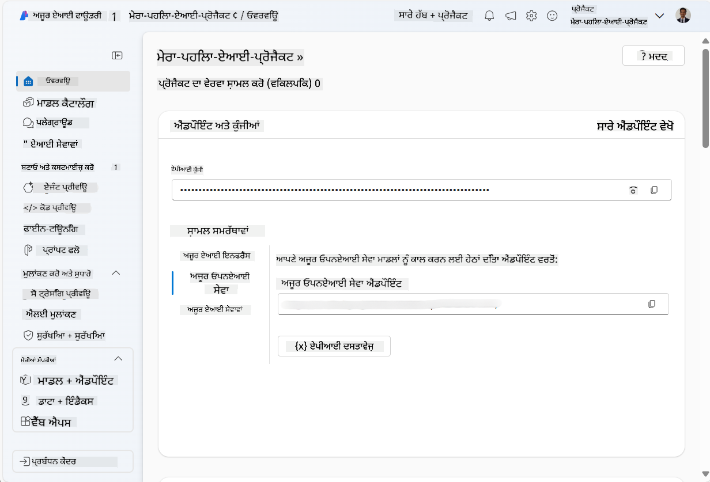
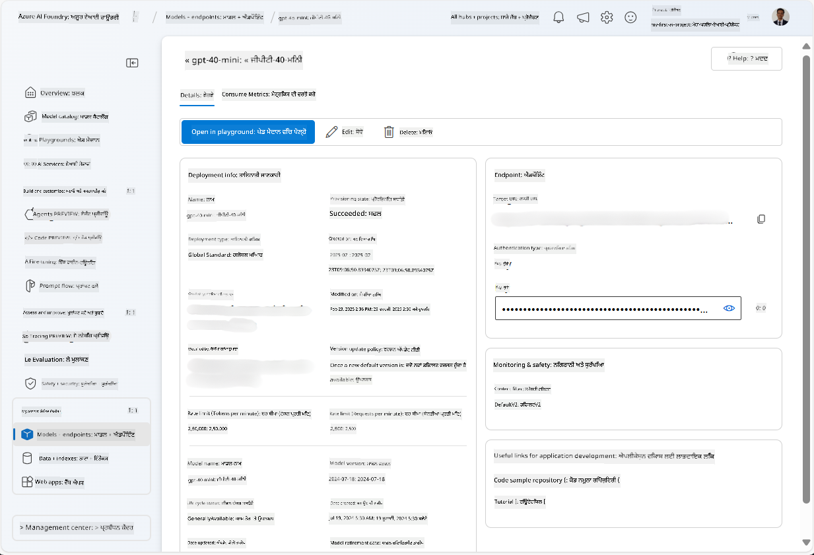
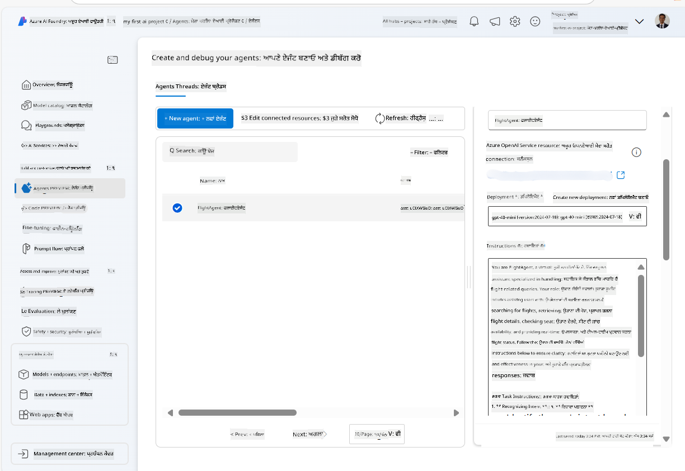
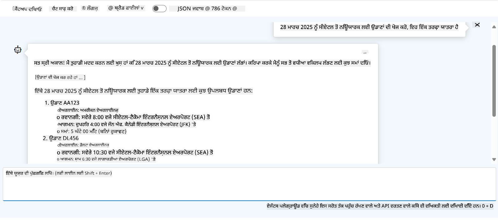

<!--
CO_OP_TRANSLATOR_METADATA:
{
  "original_hash": "7e92870dc0843e13d4dabc620c09d2d9",
  "translation_date": "2025-07-12T08:17:58+00:00",
  "source_file": "02-explore-agentic-frameworks/azure-ai-foundry-agent-creation.md",
  "language_code": "pa"
}
-->
# Azure AI Agent Service Development

ਇਸ ਅਭਿਆਸ ਵਿੱਚ, ਤੁਸੀਂ [Azure AI Foundry portal](https://ai.azure.com/?WT.mc_id=academic-105485-koreyst) ਵਿੱਚ Azure AI Agent ਸੇਵਾ ਦੇ ਟੂਲਾਂ ਦੀ ਵਰਤੋਂ ਕਰਕੇ Flight Booking ਲਈ ਇੱਕ ਏਜੰਟ ਬਣਾਉਂਦੇ ਹੋ। ਇਹ ਏਜੰਟ ਯੂਜ਼ਰਾਂ ਨਾਲ ਗੱਲਬਾਤ ਕਰ ਸਕਦਾ ਹੈ ਅਤੇ ਉਡਾਣਾਂ ਬਾਰੇ ਜਾਣਕਾਰੀ ਦੇ ਸਕਦਾ ਹੈ।

## Prerequisites

ਇਸ ਅਭਿਆਸ ਨੂੰ ਪੂਰਾ ਕਰਨ ਲਈ, ਤੁਹਾਨੂੰ ਹੇਠ ਲਿਖੀਆਂ ਚੀਜ਼ਾਂ ਦੀ ਲੋੜ ਹੈ:
1. ਇੱਕ Azure ਖਾਤਾ ਜਿਸ ਵਿੱਚ ਸਰਗਰਮ ਸਬਸਕ੍ਰਿਪਸ਼ਨ ਹੋਵੇ। [ਮੁਫ਼ਤ ਖਾਤਾ ਬਣਾਓ](https://azure.microsoft.com/free/?WT.mc_id=academic-105485-koreyst)।
2. ਤੁਹਾਨੂੰ Azure AI Foundry ਹੱਬ ਬਣਾਉਣ ਦੀ ਅਨੁਮਤੀ ਹੋਣੀ ਚਾਹੀਦੀ ਹੈ ਜਾਂ ਤੁਹਾਡੇ ਲਈ ਪਹਿਲਾਂ ਹੀ ਇੱਕ ਬਣਾਇਆ ਹੋਇਆ ਹੋਵੇ।
    - ਜੇ ਤੁਹਾਡਾ ਰੋਲ Contributor ਜਾਂ Owner ਹੈ, ਤਾਂ ਤੁਸੀਂ ਇਸ ਟਿਊਟੋਰਿਯਲ ਵਿੱਚ ਦਿੱਤੇ ਕਦਮਾਂ ਦੀ ਪਾਲਣਾ ਕਰ ਸਕਦੇ ਹੋ।

## Create an Azure AI Foundry hub

> [!NOTE] Azure AI Foundry ਨੂੰ ਪਹਿਲਾਂ Azure AI Studio ਕਿਹਾ ਜਾਂਦਾ ਸੀ।

1. Azure AI Foundry ਹੱਬ ਬਣਾਉਣ ਲਈ [Azure AI Foundry](https://learn.microsoft.com/en-us/azure/ai-studio/?WT.mc_id=academic-105485-koreyst) ਬਲੌਗ ਪੋਸਟ ਵਿੱਚ ਦਿੱਤੀਆਂ ਹਦਾਇਤਾਂ ਦੀ ਪਾਲਣਾ ਕਰੋ।
2. ਜਦੋਂ ਤੁਹਾਡਾ ਪ੍ਰੋਜੈਕਟ ਬਣ ਜਾਵੇ, ਤਾਂ ਕੋਈ ਵੀ ਟਿਪਸ ਬੰਦ ਕਰੋ ਅਤੇ Azure AI Foundry ਪੋਰਟਲ ਵਿੱਚ ਪ੍ਰੋਜੈਕਟ ਪੇਜ ਨੂੰ ਵੇਖੋ, ਜੋ ਹੇਠਾਂ ਦਿੱਤੀ ਤਸਵੀਰ ਵਾਂਗ ਲੱਗਣਾ ਚਾਹੀਦਾ ਹੈ:

    

## Deploy a model

1. ਆਪਣੇ ਪ੍ਰੋਜੈਕਟ ਦੇ ਖੱਬੇ ਪੈਨ ਵਿੱਚ, **My assets** ਸੈਕਸ਼ਨ ਵਿੱਚ, **Models + endpoints** ਪੇਜ ਚੁਣੋ।
2. **Models + endpoints** ਪੇਜ ਵਿੱਚ, **Model deployments** ਟੈਬ ਵਿੱਚ, **+ Deploy model** ਮੀਨੂ ਵਿੱਚੋਂ **Deploy base model** ਚੁਣੋ।
3. ਸੂਚੀ ਵਿੱਚੋਂ `gpt-4o-mini` ਮਾਡਲ ਖੋਜੋ, ਫਿਰ ਇਸਨੂੰ ਚੁਣੋ ਅਤੇ ਪੁਸ਼ਟੀ ਕਰੋ।

    > [!NOTE] TPM ਘਟਾਉਣ ਨਾਲ ਤੁਹਾਡੇ ਸਬਸਕ੍ਰਿਪਸ਼ਨ ਵਿੱਚ ਉਪਲਬਧ ਕੋਟਾ ਦੀ ਬੇਹੱਦ ਵਰਤੋਂ ਤੋਂ ਬਚਿਆ ਜਾ ਸਕਦਾ ਹੈ।

    

## Create an agent

ਹੁਣ ਜਦੋਂ ਤੁਸੀਂ ਮਾਡਲ ਡਿਪਲੋਇ ਕੀਤਾ ਹੈ, ਤੁਸੀਂ ਇੱਕ ਏਜੰਟ ਬਣਾਉਣ ਲਈ ਤਿਆਰ ਹੋ। ਏਜੰਟ ਇੱਕ ਗੱਲਬਾਤੀ AI ਮਾਡਲ ਹੁੰਦਾ ਹੈ ਜੋ ਯੂਜ਼ਰਾਂ ਨਾਲ ਇੰਟਰੈਕਟ ਕਰ ਸਕਦਾ ਹੈ।

1. ਆਪਣੇ ਪ੍ਰੋਜੈਕਟ ਦੇ ਖੱਬੇ ਪੈਨ ਵਿੱਚ, **Build & Customize** ਸੈਕਸ਼ਨ ਵਿੱਚ, **Agents** ਪੇਜ ਚੁਣੋ।
2. ਨਵਾਂ ਏਜੰਟ ਬਣਾਉਣ ਲਈ **+ Create agent** 'ਤੇ ਕਲਿੱਕ ਕਰੋ। **Agent Setup** ਡਾਇਲਾਗ ਬਾਕਸ ਵਿੱਚ:
    - ਏਜੰਟ ਲਈ ਕੋਈ ਨਾਮ ਦਿਓ, ਜਿਵੇਂ `FlightAgent`।
    - ਯਕੀਨੀ ਬਣਾਓ ਕਿ ਤੁਸੀਂ ਪਹਿਲਾਂ ਬਣਾਇਆ ਹੋਇਆ `gpt-4o-mini` ਮਾਡਲ ਡਿਪਲੋਇਮੈਂਟ ਚੁਣਿਆ ਹੋਇਆ ਹੈ।
    - **Instructions** ਵਿੱਚ ਉਹ ਪ੍ਰੰਪਟ ਦਿਓ ਜੋ ਤੁਸੀਂ ਏਜੰਟ ਨੂੰ ਫਾਲੋ ਕਰਵਾਉਣਾ ਚਾਹੁੰਦੇ ਹੋ। ਉਦਾਹਰਨ ਵਜੋਂ:
    ```
    You are FlightAgent, a virtual assistant specialized in handling flight-related queries. Your role includes assisting users with searching for flights, retrieving flight details, checking seat availability, and providing real-time flight status. Follow the instructions below to ensure clarity and effectiveness in your responses:

    ### Task Instructions:
    1. **Recognizing Intent**:
       - Identify the user's intent based on their request, focusing on one of the following categories:
         - Searching for flights
         - Retrieving flight details using a flight ID
         - Checking seat availability for a specified flight
         - Providing real-time flight status using a flight number
       - If the intent is unclear, politely ask users to clarify or provide more details.
        
    2. **Processing Requests**:
        - Depending on the identified intent, perform the required task:
        - For flight searches: Request details such as origin, destination, departure date, and optionally return date.
        - For flight details: Request a valid flight ID.
        - For seat availability: Request the flight ID and date and validate inputs.
        - For flight status: Request a valid flight number.
        - Perform validations on provided data (e.g., formats of dates, flight numbers, or IDs). If the information is incomplete or invalid, return a friendly request for clarification.

    3. **Generating Responses**:
    - Use a tone that is friendly, concise, and supportive.
    - Provide clear and actionable suggestions based on the output of each task.
    - If no data is found or an error occurs, explain it to the user gently and offer alternative actions (e.g., refine search, try another query).
    
    ```
> [!NOTE]
> ਵਧੇਰੇ ਵਿਸਥਾਰ ਵਾਲੇ ਪ੍ਰੰਪਟ ਲਈ, ਤੁਸੀਂ [ਇਸ ਰਿਪੋਜ਼ਿਟਰੀ](https://github.com/ShivamGoyal03/RoamMind) ਨੂੰ ਵੇਖ ਸਕਦੇ ਹੋ।

> ਇਸ ਤੋਂ ਇਲਾਵਾ, ਤੁਸੀਂ ਏਜੰਟ ਦੀ ਸਮਰੱਥਾ ਵਧਾਉਣ ਲਈ **Knowledge Base** ਅਤੇ **Actions** ਵੀ ਸ਼ਾਮਲ ਕਰ ਸਕਦੇ ਹੋ, ਜੋ ਯੂਜ਼ਰ ਦੀਆਂ ਬੇਨਤੀਆਂ ਦੇ ਅਧਾਰ 'ਤੇ ਹੋਰ ਜਾਣਕਾਰੀ ਦੇਣ ਅਤੇ ਆਟੋਮੇਟਿਕ ਕੰਮ ਕਰਨ ਵਿੱਚ ਮਦਦ ਕਰਦੇ ਹਨ। ਇਸ ਅਭਿਆਸ ਲਈ, ਤੁਸੀਂ ਇਹ ਕਦਮ ਛੱਡ ਸਕਦੇ ਹੋ।



3. ਨਵਾਂ multi-AI ਏਜੰਟ ਬਣਾਉਣ ਲਈ ਸਿਰਫ **New Agent** 'ਤੇ ਕਲਿੱਕ ਕਰੋ। ਨਵਾਂ ਬਣਾਇਆ ਗਿਆ ਏਜੰਟ Agents ਪੇਜ 'ਤੇ ਦਿਖਾਈ ਦੇਵੇਗਾ।

## Test the agent

ਏਜੰਟ ਬਣਾਉਣ ਤੋਂ ਬਾਅਦ, ਤੁਸੀਂ ਇਸਨੂੰ Azure AI Foundry ਪੋਰਟਲ ਦੇ playground ਵਿੱਚ ਟੈਸਟ ਕਰ ਸਕਦੇ ਹੋ ਕਿ ਇਹ ਯੂਜ਼ਰ ਦੇ ਸਵਾਲਾਂ ਦਾ ਕਿਵੇਂ ਜਵਾਬ ਦਿੰਦਾ ਹੈ।

1. ਆਪਣੇ ਏਜੰਟ ਲਈ **Setup** ਪੈਨ ਦੇ ਸਿਰਲੇਖ 'ਤੇ, **Try in playground** ਚੁਣੋ।
2. **Playground** ਪੈਨ ਵਿੱਚ, ਤੁਸੀਂ ਚੈਟ ਵਿੰਡੋ ਵਿੱਚ ਸਵਾਲ ਲਿਖ ਕੇ ਏਜੰਟ ਨਾਲ ਗੱਲਬਾਤ ਕਰ ਸਕਦੇ ਹੋ। ਉਦਾਹਰਨ ਵਜੋਂ, ਤੁਸੀਂ ਏਜੰਟ ਨੂੰ 28 ਤਾਰੀਖ ਨੂੰ Seattle ਤੋਂ New York ਲਈ ਉਡਾਣਾਂ ਖੋਜਣ ਲਈ ਕਹਿ ਸਕਦੇ ਹੋ।

    > [!NOTE] ਏਜੰਟ ਸਹੀ ਜਵਾਬ ਨਾ ਦੇ ਸਕੇ, ਕਿਉਂਕਿ ਇਸ ਅਭਿਆਸ ਵਿੱਚ ਕੋਈ ਰੀਅਲ-ਟਾਈਮ ਡੇਟਾ ਵਰਤਿਆ ਨਹੀਂ ਜਾ ਰਿਹਾ। ਮਕਸਦ ਏਜੰਟ ਦੀ ਸਮਝ ਅਤੇ ਦਿੱਤੀਆਂ ਹਦਾਇਤਾਂ ਦੇ ਅਧਾਰ 'ਤੇ ਯੂਜ਼ਰ ਦੇ ਸਵਾਲਾਂ ਦਾ ਜਵਾਬ ਦੇਣ ਦੀ ਯੋਗਤਾ ਦੀ ਜਾਂਚ ਕਰਨਾ ਹੈ।

    

3. ਏਜੰਟ ਦੀ ਟੈਸਟਿੰਗ ਤੋਂ ਬਾਅਦ, ਤੁਸੀਂ ਇਸਨੂੰ ਹੋਰ intents, training data, ਅਤੇ actions ਸ਼ਾਮਲ ਕਰਕੇ ਹੋਰ ਕਸਟਮਾਈਜ਼ ਕਰ ਸਕਦੇ ਹੋ ਤਾਂ ਜੋ ਇਸ ਦੀ ਸਮਰੱਥਾ ਵਧੇ।

## Clean up resources

ਜਦੋਂ ਤੁਸੀਂ ਏਜੰਟ ਦੀ ਟੈਸਟਿੰਗ ਮੁਕੰਮਲ ਕਰ ਲਵੋ, ਤਾਂ ਵਾਧੂ ਖਰਚੇ ਤੋਂ ਬਚਣ ਲਈ ਇਸਨੂੰ ਹਟਾ ਸਕਦੇ ਹੋ।
1. [Azure portal](https://portal.azure.com) ਖੋਲ੍ਹੋ ਅਤੇ ਉਸ resource group ਦੀ ਸਮੱਗਰੀ ਵੇਖੋ ਜਿੱਥੇ ਤੁਸੀਂ ਇਸ ਅਭਿਆਸ ਵਿੱਚ ਵਰਤੇ ਗਏ ਹੱਬ ਰਿਸੋਰਸ ਡਿਪਲੋਇ ਕੀਤੇ ਹਨ।
2. ਟੂਲਬਾਰ 'ਤੇ, **Delete resource group** ਚੁਣੋ।
3. resource group ਦਾ ਨਾਮ ਦਿਓ ਅਤੇ ਪੁਸ਼ਟੀ ਕਰੋ ਕਿ ਤੁਸੀਂ ਇਸਨੂੰ ਮਿਟਾਉਣਾ ਚਾਹੁੰਦੇ ਹੋ।

## Resources

- [Azure AI Foundry documentation](https://learn.microsoft.com/en-us/azure/ai-studio/?WT.mc_id=academic-105485-koreyst)
- [Azure AI Foundry portal](https://ai.azure.com/?WT.mc_id=academic-105485-koreyst)
- [Getting Started with Azure AI Studio](https://techcommunity.microsoft.com/blog/educatordeveloperblog/getting-started-with-azure-ai-studio/4095602?WT.mc_id=academic-105485-koreyst)
- [Fundamentals of AI agents on Azure](https://learn.microsoft.com/en-us/training/modules/ai-agent-fundamentals/?WT.mc_id=academic-105485-koreyst)
- [Azure AI Discord](https://aka.ms/AzureAI/Discord)

**ਅਸਵੀਕਾਰੋਪਣ**:  
ਇਹ ਦਸਤਾਵੇਜ਼ AI ਅਨੁਵਾਦ ਸੇਵਾ [Co-op Translator](https://github.com/Azure/co-op-translator) ਦੀ ਵਰਤੋਂ ਕਰਕੇ ਅਨੁਵਾਦ ਕੀਤਾ ਗਿਆ ਹੈ। ਜਦੋਂ ਕਿ ਅਸੀਂ ਸਹੀਅਤ ਲਈ ਕੋਸ਼ਿਸ਼ ਕਰਦੇ ਹਾਂ, ਕਿਰਪਾ ਕਰਕੇ ਧਿਆਨ ਰੱਖੋ ਕਿ ਸਵੈਚਾਲਿਤ ਅਨੁਵਾਦਾਂ ਵਿੱਚ ਗਲਤੀਆਂ ਜਾਂ ਅਸਮਰਥਤਾਵਾਂ ਹੋ ਸਕਦੀਆਂ ਹਨ। ਮੂਲ ਦਸਤਾਵੇਜ਼ ਆਪਣੀ ਮੂਲ ਭਾਸ਼ਾ ਵਿੱਚ ਪ੍ਰਮਾਣਿਕ ਸਰੋਤ ਮੰਨਿਆ ਜਾਣਾ ਚਾਹੀਦਾ ਹੈ। ਮਹੱਤਵਪੂਰਨ ਜਾਣਕਾਰੀ ਲਈ, ਪੇਸ਼ੇਵਰ ਮਨੁੱਖੀ ਅਨੁਵਾਦ ਦੀ ਸਿਫਾਰਸ਼ ਕੀਤੀ ਜਾਂਦੀ ਹੈ। ਇਸ ਅਨੁਵਾਦ ਦੀ ਵਰਤੋਂ ਤੋਂ ਉਤਪੰਨ ਕਿਸੇ ਵੀ ਗਲਤਫਹਿਮੀ ਜਾਂ ਗਲਤ ਵਿਆਖਿਆ ਲਈ ਅਸੀਂ ਜ਼ਿੰਮੇਵਾਰ ਨਹੀਂ ਹਾਂ।