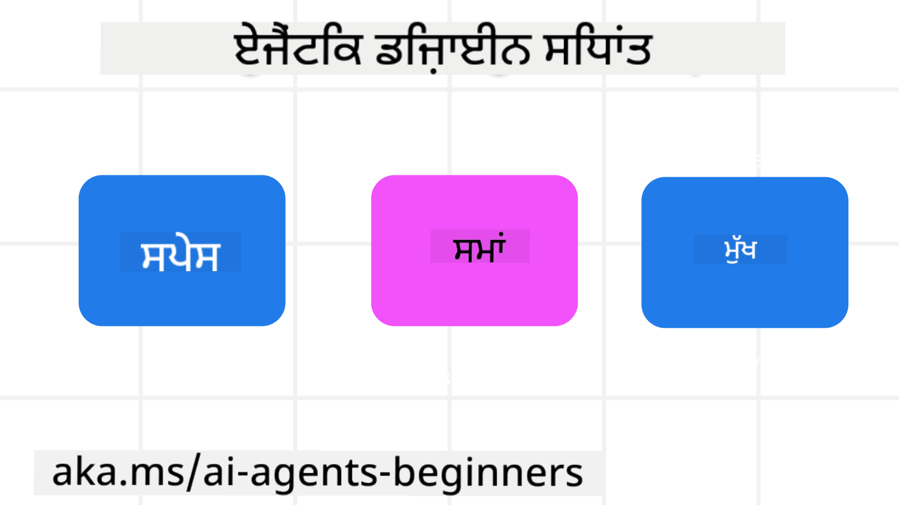

<!--
CO_OP_TRANSLATOR_METADATA:
{
  "original_hash": "4c46e4ff9e349c521e2b0b17f51afa64",
  "translation_date": "2025-08-29T10:42:24+00:00",
  "source_file": "03-agentic-design-patterns/README.md",
  "language_code": "pa"
}
-->

> _(ਉਪਰ ਦਿੱਤੀ ਤਸਵੀਰ 'ਤੇ ਕਲਿੱਕ ਕਰਕੇ ਇਸ ਪਾਠ ਦਾ ਵੀਡੀਓ ਵੇਖੋ)_
# AI Agentic ਡਿਜ਼ਾਈਨ ਸਿਧਾਂਤ

## ਜਾਣ ਪਛਾਣ

AI Agentic Systems ਬਣਾਉਣ ਬਾਰੇ ਸੋਚਣ ਦੇ ਕਈ ਤਰੀਕੇ ਹਨ। ਜਿਵੇਂ ਕਿ Generative AI ਡਿਜ਼ਾਈਨ ਵਿੱਚ ਅਸਪਸ਼ਟਤਾ ਇੱਕ ਵਿਸ਼ੇਸ਼ਤਾ ਹੈ, ਨਾ ਕਿ ਇੱਕ ਖਾਮੀ, ਇੰਜੀਨੀਅਰਾਂ ਲਈ ਕਈ ਵਾਰ ਇਹ ਸਮਝਣਾ ਮੁਸ਼ਕਲ ਹੋ ਜਾਂਦਾ ਹੈ ਕਿ ਸ਼ੁਰੂਆਤ ਕਿੱਥੋਂ ਕਰਨੀ ਹੈ। ਅਸੀਂ ਵਿਕਾਸਕਾਰਾਂ ਨੂੰ ਆਪਣੇ ਕਾਰੋਬਾਰੀ ਜ਼ਰੂਰਤਾਂ ਨੂੰ ਹੱਲ ਕਰਨ ਲਈ ਗਾਹਕ-ਕੇਂਦਰਿਤ Agentic Systems ਬਣਾਉਣ ਯੋਗ ਬਣਾਉਣ ਲਈ ਮਨੁੱਖ-ਕੇਂਦਰਿਤ UX ਡਿਜ਼ਾਈਨ ਸਿਧਾਂਤਾਂ ਦਾ ਇੱਕ ਸੈੱਟ ਬਣਾਇਆ ਹੈ। ਇਹ ਡਿਜ਼ਾਈਨ ਸਿਧਾਂਤ ਇੱਕ ਨਿਰਧਾਰਿਤ ਆਰਕੀਟੈਕਚਰ ਨਹੀਂ ਹਨ, ਬਲਕਿ ਉਹ ਟੀਮਾਂ ਲਈ ਇੱਕ ਸ਼ੁਰੂਆਤੀ ਬਿੰਦੂ ਹਨ ਜੋ Agent ਅਨੁਭਵਾਂ ਨੂੰ ਪਰਿਭਾਸ਼ਿਤ ਅਤੇ ਬਣਾਉਣ ਦੀ ਯੋਜਨਾ ਬਣਾ ਰਹੀਆਂ ਹਨ।

ਆਮ ਤੌਰ 'ਤੇ, Agents ਨੂੰ ਇਹ ਕਰਨਾ ਚਾਹੀਦਾ ਹੈ:

- ਮਨੁੱਖੀ ਸਮਰੱਥਾਵਾਂ ਨੂੰ ਵਧਾਉਣਾ ਅਤੇ ਪੈਮਾਨਾ ਦੇਣਾ (Brainstorming, ਸਮੱਸਿਆ-ਸੁਝਾਅ, Automation, ਆਦਿ)
- ਗਿਆਨ ਦੇ ਖਾਲੀਪਣ ਨੂੰ ਭਰਨਾ (ਮੈਨੂੰ ਗਿਆਨ ਖੇਤਰਾਂ, ਅਨੁਵਾਦ ਆਦਿ 'ਤੇ ਅਪ-ਟੂ-ਸਪੀਡ ਲੈ ਜਾਓ)
- ਸਹਿਯੋਗ ਨੂੰ ਸਹੂਲਤ ਦੇਣਾ ਅਤੇ ਸਹਾਇਤਾ ਕਰਨਾ ਜਿਵੇਂ ਕਿ ਅਸੀਂ ਵਿਅਕਤੀਗਤ ਤੌਰ 'ਤੇ ਹੋਰ ਲੋਕਾਂ ਨਾਲ ਕੰਮ ਕਰਨਾ ਪਸੰਦ ਕਰਦੇ ਹਾਂ
- ਸਾਨੂੰ ਆਪਣੇ ਆਪ ਦੇ ਬਿਹਤਰ ਸੰਸਕਰਣ ਬਣਾਉਣਾ (ਜਿਵੇਂ ਕਿ Life Coach/Task Master, ਸਾਨੂੰ ਭਾਵਨਾਤਮਕ ਨਿਯਮਨ ਅਤੇ Mindfulness Skills ਸਿੱਖਣ ਵਿੱਚ ਮਦਦ ਕਰਨਾ, Resilience ਬਣਾਉਣਾ ਆਦਿ)

## ਇਸ ਪਾਠ ਵਿੱਚ ਕਵਰ ਕੀਤਾ ਜਾਵੇਗਾ

- Agentic ਡਿਜ਼ਾਈਨ ਸਿਧਾਂਤ ਕੀ ਹਨ
- ਇਹ ਡਿਜ਼ਾਈਨ ਸਿਧਾਂਤਾਂ ਨੂੰ ਲਾਗੂ ਕਰਦੇ ਸਮੇਂ ਕਿਹੜੇ ਨਿਯਮਾਂ ਦੀ ਪਾਲਣਾ ਕਰਨੀ ਚਾਹੀਦੀ ਹੈ
- ਡਿਜ਼ਾਈਨ ਸਿਧਾਂਤਾਂ ਦੀ ਵਰਤੋਂ ਦੇ ਕੁਝ ਉਦਾਹਰਨ ਕੀ ਹਨ

## ਸਿੱਖਣ ਦੇ ਲਕਸ਼

ਇਸ ਪਾਠ ਨੂੰ ਪੂਰਾ ਕਰਨ ਤੋਂ ਬਾਅਦ, ਤੁਸੀਂ ਇਹ ਕਰਨ ਦੇ ਯੋਗ ਹੋਵੋਗੇ:

1. Agentic ਡਿਜ਼ਾਈਨ ਸਿਧਾਂਤਾਂ ਕੀ ਹਨ, ਇਹ ਸਮਝਾਉਣਾ
2. Agentic ਡਿਜ਼ਾਈਨ ਸਿਧਾਂਤਾਂ ਦੀ ਵਰਤੋਂ ਲਈ ਨਿਯਮਾਂ ਨੂੰ ਸਮਝਾਉਣਾ
3. Agentic ਡਿਜ਼ਾਈਨ ਸਿਧਾਂਤਾਂ ਦੀ ਵਰਤੋਂ ਕਰਕੇ Agent ਬਣਾਉਣ ਦੀ ਸਮਝ ਪ੍ਰਾਪਤ ਕਰਨਾ

## Agentic ਡਿਜ਼ਾਈਨ ਸਿਧਾਂਤ

### Agent (ਸਥਾਨ)

ਇਹ ਉਹ ਵਾਤਾਵਰਣ ਹੈ ਜਿਸ ਵਿੱਚ Agent ਕੰਮ ਕਰਦਾ ਹੈ। ਇਹ ਸਿਧਾਂਤ ਸਾਨੂੰ ਸPhysical ਅਤੇ Digital ਦੁਨੀਆਂ ਵਿੱਚ Agents ਨੂੰ Engage ਕਰਨ ਲਈ ਡਿਜ਼ਾਈਨ ਕਰਨ ਬਾਰੇ ਜਾਣਕਾਰੀ ਦਿੰਦੇ ਹਨ।

- **ਜੋੜਨਾ, ਨਾ ਕਿ ਘਟਾਉਣਾ** – ਲੋਕਾਂ ਨੂੰ ਹੋਰ ਲੋਕਾਂ, ਘਟਨਾਵਾਂ ਅਤੇ ਕਾਰਜਕੁਸ਼ਲ ਗਿਆਨ ਨਾਲ ਜੋੜਨ ਵਿੱਚ ਮਦਦ ਕਰੋ ਤਾਂ ਜੋ ਸਹਿਯੋਗ ਅਤੇ ਕਨੈਕਸ਼ਨ ਨੂੰ ਯੋਗ ਬਣਾਇਆ ਜਾ ਸਕੇ।
- Agents ਘਟਨਾਵਾਂ, ਗਿਆਨ ਅਤੇ ਲੋਕਾਂ ਨੂੰ ਜੋੜਨ ਵਿੱਚ ਮਦਦ ਕਰਦੇ ਹਨ।
- Agents ਲੋਕਾਂ ਨੂੰ ਇੱਕ-ਦੂਜੇ ਦੇ ਨੇੜੇ ਲਿਆਉਂਦੇ ਹਨ। ਇਹ ਲੋਕਾਂ ਦੀ ਜਗ੍ਹਾ ਲੈਣ ਜਾਂ ਉਨ੍ਹਾਂ ਨੂੰ ਘਟਾਉਣ ਲਈ ਡਿਜ਼ਾਈਨ ਨਹੀਂ ਕੀਤੇ ਗਏ।
- **ਸੌਖੇ ਤੌਰ 'ਤੇ ਪਹੁੰਚਯੋਗ ਪਰ ਕਈ ਵਾਰ ਅਦ੍ਰਿਸ਼** – Agent ਮੁੱਖ ਤੌਰ 'ਤੇ ਪਿਛੋਕੜ ਵਿੱਚ ਕੰਮ ਕਰਦਾ ਹੈ ਅਤੇ ਸਿਰਫ਼ ਉਸ ਸਮੇਂ ਸਾਨੂੰ ਨੁਕਸਾਨ ਪਹੁੰਚਾਉਂਦਾ ਹੈ ਜਦੋਂ ਇਹ ਸਬੰਧਤ ਅਤੇ ਉਚਿਤ ਹੁੰਦਾ ਹੈ।
  - Agent ਕਿਸੇ ਵੀ ਡਿਵਾਈਸ ਜਾਂ ਪਲੇਟਫਾਰਮ 'ਤੇ ਅਧਿਕਾਰਤ ਉਪਭੋਗਤਾਵਾਂ ਲਈ ਸੌਖੇ ਤੌਰ 'ਤੇ ਖੋਜਯੋਗ ਅਤੇ ਪਹੁੰਚਯੋਗ ਹੈ।
  - Agent Multimodal Inputs ਅਤੇ Outputs (ਆਵਾਜ਼, ਵਾਇਸ, ਟੈਕਸਟ ਆਦਿ) ਦਾ ਸਮਰਥਨ ਕਰਦਾ ਹੈ।
  - Agent ਸਹੀ ਸਮੇਂ ਉਪਭੋਗਤਾ ਦੀ ਜ਼ਰੂਰਤਾਂ ਨੂੰ ਸਮਝਣ ਦੇ ਅਧਾਰ 'ਤੇ Foreground ਅਤੇ Background ਦੇ ਵਿਚਕਾਰ ਬਿਨਾਂ ਰੁਕਾਵਟ ਦੇ ਬਦਲ ਸਕਦਾ ਹੈ; Proactive ਅਤੇ Reactive ਦੇ ਵਿਚਕਾਰ।
  - Agent ਅਦ੍ਰਿਸ਼ ਰੂਪ ਵਿੱਚ ਕੰਮ ਕਰ ਸਕਦਾ ਹੈ, ਫਿਰ ਵੀ ਇਸ ਦੀ ਪਿਛੋਕੜ ਪ੍ਰਕਿਰਿਆ ਦਾ ਪਾਥ ਅਤੇ ਹੋਰ Agents ਨਾਲ ਸਹਿਯੋਗ ਉਪਭੋਗਤਾ ਲਈ ਪਾਰਦਰਸ਼ੀ ਅਤੇ ਨਿਯੰਤਰਣਯੋਗ ਹੈ।

### Agent (ਸਮਾਂ)

ਇਹ ਉਹ ਹੈ ਕਿ Agent ਸਮੇਂ ਦੇ ਨਾਲ ਕਿਵੇਂ ਕੰਮ ਕਰਦਾ ਹੈ। ਇਹ ਸਿਧਾਂਤ ਸਾਨੂੰ ਪਿਛਲੇ, ਮੌਜੂਦਾ ਅਤੇ ਭਵਿੱਖ ਦੇ ਵਿਚਕਾਰ Agents ਦੀ ਇੰਟਰੈਕਸ਼ਨ ਨੂੰ ਡਿਜ਼ਾਈਨ ਕਰਨ ਬਾਰੇ ਜਾਣਕਾਰੀ ਦਿੰਦੇ ਹਨ।

- **ਪਿਛਲਾ**: ਇਤਿਹਾਸ 'ਤੇ ਵਿਚਾਰ ਕਰਨਾ ਜਿਸ ਵਿੱਚ ਰਾਜ ਅਤੇ ਸੰਦਰਭ ਦੋਵੇਂ ਸ਼ਾਮਲ ਹਨ।
  - Agent ਘਟਨਾ, ਲੋਕਾਂ ਜਾਂ ਰਾਜਾਂ ਤੋਂ ਬਾਹਰ ਰਿਚਰ Historical Data ਦੇ ਵਿਸ਼ਲੇਸ਼ਣ ਦੇ ਅਧਾਰ 'ਤੇ ਹੋਰ ਸਬੰਧਤ ਨਤੀਜੇ ਪ੍ਰਦਾਨ ਕਰਦਾ ਹੈ।
  - Agent ਪਿਛਲੀ ਘਟਨਾਵਾਂ ਤੋਂ ਕਨੈਕਸ਼ਨ ਬਣਾਉਂਦਾ ਹੈ ਅਤੇ ਮੌਜੂਦਾ ਸਥਿਤੀਆਂ ਨਾਲ Engage ਕਰਨ ਲਈ Memory 'ਤੇ ਸਚੇਤ ਤੌਰ 'ਤੇ ਵਿਚਾਰ ਕਰਦਾ ਹੈ।
- **ਹੁਣ**: ਸੂਚਨਾ ਦੇਣ ਤੋਂ ਵੱਧ ਨੁਕਸਾਨ ਪਹੁੰਚਾਉਣਾ।
  - Agent ਲੋਕਾਂ ਨਾਲ ਇੰਟਰੈਕਟ ਕਰਨ ਲਈ ਇੱਕ ਵਿਆਪਕ ਪਹੁੰਚ ਨੂੰ ਅੰਗੀਕਾਰ ਕਰਦਾ ਹੈ। ਜਦੋਂ ਕੋਈ ਘਟਨਾ ਹੁੰਦੀ ਹੈ, Agent ਸਥਿਰ ਸੂਚਨਾ ਜਾਂ ਹੋਰ ਸਥਿਰ Formality ਤੋਂ ਬਾਹਰ ਜਾਂਦਾ ਹੈ। Agent Flows ਨੂੰ ਸੌਖਾ ਕਰ ਸਕਦਾ ਹੈ ਜਾਂ ਉਪਭੋਗਤਾ ਦੇ ਧਿਆਨ ਨੂੰ ਸਹੀ ਸਮੇਂ 'ਤੇ ਦਿਸ਼ਾ ਦੇਣ ਲਈ Dynamic Cues ਜਨਰੇਟ ਕਰ ਸਕਦਾ ਹੈ।
  - Agent ਸੰਦਰਭਕ ਵਾਤਾਵਰਣ, ਸਮਾਜਿਕ ਅਤੇ ਸੱਭਿਆਚਾਰਕ ਬਦਲਾਅ ਦੇ ਅਧਾਰ 'ਤੇ ਜਾਣਕਾਰੀ ਪ੍ਰਦਾਨ ਕਰਦਾ ਹੈ ਅਤੇ ਉਪਭੋਗਤਾ ਦੇ ਇਰਾਦੇ ਲਈ Tailored ਹੁੰਦਾ ਹੈ।
  - Agent ਇੰਟਰੈਕਸ਼ਨ ਗ੍ਰੈਜੁਅਲ ਹੋ ਸਕਦਾ ਹੈ, ਲੰਬੇ ਸਮੇਂ ਤੱਕ ਉਪਭੋਗਤਾਵਾਂ ਨੂੰ ਯੋਗ ਬਣਾਉਣ ਲਈ ਜਟਿਲਤਾ ਵਿੱਚ ਵਿਕਸਿਤ/ਵਧਦਾ ਹੈ।
- **ਭਵਿੱਖ**: ਅਨੁਕੂਲਿਤ ਅਤੇ ਵਿਕਸਿਤ ਹੋਣਾ।
  - Agent ਵੱਖ-ਵੱਖ ਡਿਵਾਈਸਾਂ, ਪਲੇਟਫਾਰਮਾਂ ਅਤੇ Modalities ਲਈ ਅਨੁਕੂਲ ਹੁੰਦਾ ਹੈ।
  - Agent ਉਪਭੋਗਤਾ ਦੇ ਵਿਹਾਰ, Accessibility ਦੀਆਂ ਜ਼ਰੂਰਤਾਂ ਲਈ ਅਨੁਕੂਲ ਹੁੰਦਾ ਹੈ ਅਤੇ ਮੁਫ਼ਤ ਤੌਰ 'ਤੇ Customizable ਹੁੰਦਾ ਹੈ।
  - Agent ਲਗਾਤਾਰ ਉਪਭੋਗਤਾ ਇੰਟਰੈਕਸ਼ਨ ਰਾਹੀਂ ਸ਼ੇਪ ਕੀਤਾ ਜਾਂਦਾ ਹੈ ਅਤੇ ਵਿਕਸਿਤ ਹੁੰਦਾ ਹੈ।

### Agent (ਮੂਲ)

ਇਹ Agent ਦੇ ਡਿਜ਼ਾਈਨ ਦੇ ਮੂਲ ਤੱਤ ਹਨ।

- **ਅਸਪਸ਼ਟਤਾ ਨੂੰ ਅੰਗੀਕਾਰ ਕਰੋ ਪਰ ਭਰੋਸਾ ਸਥਾਪਿਤ ਕਰੋ**।
  - Agent ਅਸਪਸ਼ਟਤਾ ਦਾ ਇੱਕ ਨਿਰਧਾਰਿਤ ਪੱਧਰ ਉਮੀਦ ਕੀਤਾ ਜਾਂਦਾ ਹੈ। ਅਸਪਸ਼ਟਤਾ Agent ਡਿਜ਼ਾਈਨ ਦਾ ਇੱਕ ਮੁੱਖ ਤੱਤ ਹੈ।
  - ਭਰੋਸਾ ਅਤੇ ਪਾਰਦਰਸ਼ਤਾ Agent ਡਿਜ਼ਾਈਨ ਦੇ ਮੂਲ ਤਹਿ ਹਨ।
  - ਮਨੁੱਖ ਇਸ ਗੱਲ ਦਾ ਨਿਯੰਤਰਣ ਕਰਦੇ ਹਨ ਕਿ Agent ਕਦੋਂ ਚਾਲੂ/ਬੰਦ ਹੈ ਅਤੇ Agent ਦੀ ਸਥਿਤੀ ਹਰ ਸਮੇਂ ਸਪਸ਼ਟ ਦਿਖਾਈ ਦਿੰਦੀ ਹੈ।

## ਇਹ ਸਿਧਾਂਤਾਂ ਨੂੰ ਲਾਗੂ ਕਰਨ ਦੇ ਨਿਯਮ

ਜਦੋਂ ਤੁਸੀਂ ਪਿਛਲੇ ਡਿਜ਼ਾਈਨ ਸਿਧਾਂਤਾਂ ਦੀ ਵਰਤੋਂ ਕਰ ਰਹੇ ਹੋ, ਤਾਂ ਹੇਠਾਂ ਦਿੱਤੇ ਨਿਯਮਾਂ ਦੀ ਪਾਲਣਾ ਕਰੋ:

1. **ਪਾਰਦਰਸ਼ਤਾ**: ਉਪਭੋਗਤਾ ਨੂੰ ਜਾਣਕਾਰੀ ਦਿਓ ਕਿ AI ਸ਼ਾਮਲ ਹੈ, ਇਹ ਕਿਵੇਂ ਕੰਮ ਕਰਦਾ ਹੈ (ਪਿਛਲੇ Actions ਸਮੇਤ), ਅਤੇ ਸਿਸਟਮ ਨੂੰ Feedback ਦੇਣ ਅਤੇ Modify ਕਰਨ ਦਾ ਤਰੀਕਾ।
2. **ਨਿਯੰਤਰਣ**: ਉਪਭੋਗਤਾ ਨੂੰ Customization, Preferences Specify ਕਰਨ ਅਤੇ Personalization ਕਰਨ ਦੀ ਯੋਗਤਾ ਦਿਓ, ਅਤੇ ਸਿਸਟਮ ਅਤੇ ਇਸ ਦੇ Attributes 'ਤੇ ਨਿਯੰਤਰਣ ਦਿਓ (Forget ਕਰਨ ਦੀ ਯੋਗਤਾ ਸਮੇਤ)।
3. **ਸਥਿਰਤਾ**: ਡਿਵਾਈਸਾਂ ਅਤੇ Endpoints 'ਤੇ ਸਥਿਰ, Multimodal Experiences ਦਾ ਲਕਸ਼ ਰੱਖੋ। ਜਿੱਥੇ ਸੰਭਵ ਹੋਵੇ, ਜਾਣ-ਪਛਾਣ ਵਾਲੇ UI/UX ਤੱਤਾਂ ਦੀ ਵਰਤੋਂ ਕਰੋ (ਜਿਵੇਂ ਕਿ Voice Interaction ਲਈ Microphone Icon) ਅਤੇ ਉਪਭੋਗਤਾ ਦੇ Cognitive Load ਨੂੰ ਜਿੰਨਾ ਸੰਭਵ ਹੋ ਸਕੇ ਘਟਾਓ (ਜਿਵੇਂ ਕਿ ਸੰਖੇਪ ਜਵਾਬਾਂ, Visual Aids, ਅਤੇ 'Learn More' ਸਮੱਗਰੀ ਦਾ ਲਕਸ਼ ਰੱਖੋ)।

## ਇਹ ਸਿਧਾਂਤ ਅਤੇ ਨਿਯਮ ਵਰਤ ਕੇ ਇੱਕ Travel Agent ਕਿਵੇਂ ਡਿਜ਼ਾਈਨ ਕਰਨਾ ਹੈ

ਕਲਪਨਾ ਕਰੋ ਕਿ ਤੁਸੀਂ ਇੱਕ Travel Agent ਡਿਜ਼ਾਈਨ ਕਰ ਰਹੇ ਹੋ, ਇੱਥੇ ਇਹ ਹੈ ਕਿ ਤੁਸੀਂ ਡਿਜ਼ਾਈਨ ਸਿਧਾਂਤਾਂ ਅਤੇ ਨਿਯਮਾਂ ਦੀ ਵਰਤੋਂ ਬਾਰੇ ਕਿਵੇਂ ਸੋਚ ਸਕਦੇ ਹੋ:

1. **ਪਾਰਦਰਸ਼ਤਾ** – ਉਪਭੋਗਤਾ ਨੂੰ ਦੱਸੋ ਕਿ Travel Agent ਇੱਕ AI-Enabled Agent ਹੈ। ਸ਼ੁਰੂ ਕਰਨ ਲਈ ਕੁਝ ਬੁਨਿਆਦੀ ਹਦਾਇਤਾਂ ਪ੍ਰਦਾਨ ਕਰੋ (ਜਿਵੇਂ ਕਿ ਇੱਕ "Hello" Message, Sample Prompts)। ਇਸ ਨੂੰ Product Page 'ਤੇ ਸਪਸ਼ਟ ਤੌਰ 'ਤੇ ਦਸਤਾਵੇਜ਼ ਕਰੋ। ਪਿਛਲੇ Prompts ਦੀ ਸੂਚੀ ਦਿਖਾਓ ਜੋ ਉਪਭੋਗਤਾ ਨੇ ਪੁੱਛੇ ਹਨ। Feedback ਦੇਣ ਦਾ ਤਰੀਕਾ ਸਪਸ਼ਟ ਕਰੋ (Thumbs Up ਅਤੇ Down, Send Feedback Button ਆਦਿ)। ਸਪਸ਼ਟ ਤੌਰ 'ਤੇ ਦੱਸੋ ਕਿ Agent ਦੇ Usage ਜਾਂ Topic Restrictions ਹਨ।
2. **ਨਿਯੰਤਰਣ** – ਇਹ ਸਪਸ਼ਟ ਕਰੋ ਕਿ Agent ਨੂੰ ਬਣਾਉਣ ਤੋਂ ਬਾਅਦ ਉਪਭੋਗਤਾ ਇਸ ਨੂੰ ਕਿਵੇਂ Modify ਕਰ ਸਕਦਾ ਹੈ, ਜਿਵੇਂ ਕਿ System Prompt। ਉਪਭੋਗਤਾ ਨੂੰ ਇਹ ਚੋਣ ਕਰਨ ਦੀ ਯੋਗਤਾ ਦਿਓ ਕਿ Agent ਕਿੰਨਾ Verbose ਹੈ, ਇਸ ਦਾ Writing Style, ਅਤੇ ਕੋਈ Caveats ਕਿ Agent ਨੂੰ ਕਿਸ ਬਾਰੇ ਗੱਲ ਨਹੀਂ ਕਰਨੀ ਚਾਹੀਦੀ। ਉਪਭੋਗਤਾ ਨੂੰ ਕਿਸੇ ਵੀ ਸੰਬੰਧਿਤ Files ਜਾਂ Data, Prompts, ਅਤੇ ਪਿਛਲੇ Conversations ਨੂੰ ਵੇਖਣ ਅਤੇ ਮਿਟਾਉਣ ਦੀ ਯੋਗਤਾ ਦਿਓ।
3. **ਸਥਿਰਤਾ** – Share Prompt, File ਜਾਂ Photo Add ਕਰਨ ਅਤੇ ਕਿਸੇ ਨੂੰ ਜਾਂ ਕਿਸੇ ਚੀਜ਼ ਨੂੰ Tag ਕਰਨ ਲਈ Icons ਨੂੰ Standard ਅਤੇ ਜਾਣ-ਪਛਾਣ ਵਾਲਾ ਬਣਾਓ। File Upload/Sharing ਲਈ Agent ਨਾਲ Paperclip Icon ਦੀ ਵਰਤੋਂ ਕਰੋ, ਅਤੇ Graphics Upload ਲਈ Image Icon ਦੀ ਵਰਤੋਂ ਕਰੋ।

### AI Agentic ਡਿਜ਼ਾਈਨ Patterns ਬਾਰੇ ਹੋਰ ਸਵਾਲ ਹਨ?

[Azure AI Foundry Discord](https://aka.ms/ai-agents/discord) ਵਿੱਚ ਸ਼ਾਮਲ ਹੋਵੋ ਤਾਂ ਜੋ ਹੋਰ ਸਿੱਖਣ ਵਾਲਿਆਂ ਨਾਲ ਮਿਲ ਸਕੋ, Office Hours ਵਿੱਚ ਸ਼ਾਮਲ ਹੋ ਸਕੋ ਅਤੇ ਆਪਣੇ AI Agents ਦੇ ਸਵਾਲਾਂ ਦੇ ਜਵਾਬ ਪ੍ਰਾਪਤ ਕਰ ਸਕੋ।

## ਵਾਧੂ ਸਰੋਤ

- ## ਪਿਛਲਾ ਪਾਠ

[Agentic Frameworks ਦੀ ਖੋਜ](../02-explore-agentic-frameworks/README.md)

## ਅਗਲਾ ਪਾਠ

[Tool Use Design Pattern](../04-tool-use/README.md)

---

**ਅਸਵੀਕਰਤੀ**:  
ਇਹ ਦਸਤਾਵੇਜ਼ AI ਅਨੁਵਾਦ ਸੇਵਾ [Co-op Translator](https://github.com/Azure/co-op-translator) ਦੀ ਵਰਤੋਂ ਕਰਕੇ ਅਨੁਵਾਦ ਕੀਤਾ ਗਿਆ ਹੈ। ਜਦੋਂ ਕਿ ਅਸੀਂ ਸਹੀ ਹੋਣ ਦਾ ਯਤਨ ਕਰਦੇ ਹਾਂ, ਕਿਰਪਾ ਕਰਕੇ ਧਿਆਨ ਦਿਓ ਕਿ ਸਵੈਚਾਲਿਤ ਅਨੁਵਾਦਾਂ ਵਿੱਚ ਗਲਤੀਆਂ ਜਾਂ ਅਸੁੱਤੀਆਂ ਹੋ ਸਕਦੀਆਂ ਹਨ। ਇਸ ਦੀ ਮੂਲ ਭਾਸ਼ਾ ਵਿੱਚ ਮੌਜੂਦ ਮੂਲ ਦਸਤਾਵੇਜ਼ ਨੂੰ ਅਧਿਕਾਰਤ ਸਰੋਤ ਮੰਨਿਆ ਜਾਣਾ ਚਾਹੀਦਾ ਹੈ। ਮਹੱਤਵਪੂਰਨ ਜਾਣਕਾਰੀ ਲਈ, ਪੇਸ਼ੇਵਰ ਮਨੁੱਖੀ ਅਨੁਵਾਦ ਦੀ ਸਿਫਾਰਸ਼ ਕੀਤੀ ਜਾਂਦੀ ਹੈ। ਇਸ ਅਨੁਵਾਦ ਦੀ ਵਰਤੋਂ ਤੋਂ ਪੈਦਾ ਹੋਣ ਵਾਲੇ ਕਿਸੇ ਵੀ ਗਲਤਫਹਿਮੀ ਜਾਂ ਗਲਤ ਵਿਆਖਿਆ ਲਈ ਅਸੀਂ ਜ਼ਿੰਮੇਵਾਰ ਨਹੀਂ ਹਾਂ।  