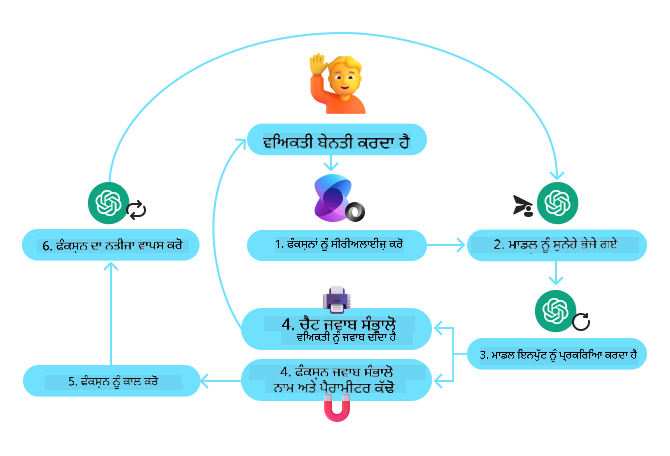

<!--
CO_OP_TRANSLATOR_METADATA:
{
  "original_hash": "88258b03f2893aa2e69eb8fb24baabbc",
  "translation_date": "2025-07-12T09:31:12+00:00",
  "source_file": "04-tool-use/README.md",
  "language_code": "pa"
}
-->
[](https://youtu.be/vieRiPRx-gI?si=cEZ8ApnT6Sus9rhn)

> _(ਇਸ ਪਾਠ ਦਾ ਵੀਡੀਓ ਦੇਖਣ ਲਈ ਉਪਰ ਦਿੱਤੀ ਤਸਵੀਰ 'ਤੇ ਕਲਿੱਕ ਕਰੋ)_

# ਟੂਲ ਯੂਜ਼ ਡਿਜ਼ਾਈਨ ਪੈਟਰਨ

ਟੂਲਜ਼ ਦਿਲਚਸਪ ਹੁੰਦੇ ਹਨ ਕਿਉਂਕਿ ਇਹ AI ਏਜੰਟਾਂ ਨੂੰ ਵੱਡੀ ਸਮਰੱਥਾ ਦੇਣਗੇ। ਜਿੱਥੇ ਏਜੰਟ ਕੋਲ ਸਿਰਫ਼ ਕੁਝ ਸੀਮਿਤ ਕਾਰਵਾਈਆਂ ਹੁੰਦੀਆਂ ਹਨ, ਉਥੇ ਟੂਲ ਸ਼ਾਮਲ ਕਰਨ ਨਾਲ ਏਜੰਟ ਹੁਣ ਵੱਖ-ਵੱਖ ਕਾਰਵਾਈਆਂ ਕਰ ਸਕਦਾ ਹੈ। ਇਸ ਅਧਿਆਇ ਵਿੱਚ ਅਸੀਂ ਟੂਲ ਯੂਜ਼ ਡਿਜ਼ਾਈਨ ਪੈਟਰਨ ਬਾਰੇ ਜਾਣਾਂਗੇ, ਜੋ ਦੱਸਦਾ ਹੈ ਕਿ AI ਏਜੰਟ ਕਿਸ ਤਰ੍ਹਾਂ ਖਾਸ ਟੂਲਜ਼ ਦੀ ਵਰਤੋਂ ਕਰਕੇ ਆਪਣੇ ਲਕੜਾਂ ਨੂੰ ਪੂਰਾ ਕਰ ਸਕਦੇ ਹਨ।

## ਪਰਿਚਯ

ਇਸ ਪਾਠ ਵਿੱਚ ਅਸੀਂ ਹੇਠਾਂ ਦਿੱਤੇ ਸਵਾਲਾਂ ਦੇ ਜਵਾਬ ਲੱਭਣ ਦੀ ਕੋਸ਼ਿਸ਼ ਕਰਾਂਗੇ:

- ਟੂਲ ਯੂਜ਼ ਡਿਜ਼ਾਈਨ ਪੈਟਰਨ ਕੀ ਹੈ?
- ਇਹ ਕਿਹੜੇ ਵਰਤੋਂ ਦੇ ਮਾਮਲੇ ਵਿੱਚ ਲਾਗੂ ਕੀਤਾ ਜਾ ਸਕਦਾ ਹੈ?
- ਇਸ ਡਿਜ਼ਾਈਨ ਪੈਟਰਨ ਨੂੰ ਲਾਗੂ ਕਰਨ ਲਈ ਕਿਹੜੇ ਤੱਤ/ਬਿਲਡਿੰਗ ਬਲਾਕ ਲੋੜੀਂਦੇ ਹਨ?
- ਭਰੋਸੇਮੰਦ AI ਏਜੰਟ ਬਣਾਉਣ ਲਈ ਟੂਲ ਯੂਜ਼ ਡਿਜ਼ਾਈਨ ਪੈਟਰਨ ਦੀ ਵਰਤੋਂ ਕਰਦੇ ਸਮੇਂ ਕਿਹੜੀਆਂ ਖਾਸ ਗੱਲਾਂ ਦਾ ਧਿਆਨ ਰੱਖਣਾ ਚਾਹੀਦਾ ਹੈ?

## ਸਿੱਖਣ ਦੇ ਲਕੜ

ਇਸ ਪਾਠ ਨੂੰ ਪੂਰਾ ਕਰਨ ਤੋਂ ਬਾਅਦ, ਤੁਸੀਂ ਸਮਰੱਥ ਹੋਵੋਗੇ:

- ਟੂਲ ਯੂਜ਼ ਡਿਜ਼ਾਈਨ ਪੈਟਰਨ ਅਤੇ ਇਸਦਾ ਮਕਸਦ ਵਿਆਖਿਆ ਕਰਨ ਲਈ।
- ਉਹ ਵਰਤੋਂ ਦੇ ਮਾਮਲੇ ਪਛਾਣਨ ਲਈ ਜਿੱਥੇ ਇਹ ਪੈਟਰਨ ਲਾਗੂ ਕੀਤਾ ਜਾ ਸਕਦਾ ਹੈ।
- ਡਿਜ਼ਾਈਨ ਪੈਟਰਨ ਨੂੰ ਲਾਗੂ ਕਰਨ ਲਈ ਜਰੂਰੀ ਮੁੱਖ ਤੱਤਾਂ ਨੂੰ ਸਮਝਣ ਲਈ।
- ਇਸ ਡਿਜ਼ਾਈਨ ਪੈਟਰਨ ਦੀ ਵਰਤੋਂ ਕਰਦੇ ਸਮੇਂ AI ਏਜੰਟਾਂ ਵਿੱਚ ਭਰੋਸੇਯੋਗਤਾ ਯਕੀਨੀ ਬਣਾਉਣ ਲਈ ਧਿਆਨ ਵਿੱਚ ਰੱਖਣ ਵਾਲੀਆਂ ਗੱਲਾਂ ਨੂੰ ਪਛਾਣਨ ਲਈ।

## ਟੂਲ ਯੂਜ਼ ਡਿਜ਼ਾਈਨ ਪੈਟਰਨ ਕੀ ਹੈ?

**ਟੂਲ ਯੂਜ਼ ਡਿਜ਼ਾਈਨ ਪੈਟਰਨ** LLMs ਨੂੰ ਬਾਹਰੀ ਟੂਲਜ਼ ਨਾਲ ਇੰਟਰੈਕਟ ਕਰਨ ਦੀ ਸਮਰੱਥਾ ਦੇਣ 'ਤੇ ਧਿਆਨ ਕੇਂਦ੍ਰਿਤ ਕਰਦਾ ਹੈ ਤਾਂ ਜੋ ਖਾਸ ਲਕੜਾਂ ਨੂੰ ਹਾਸਲ ਕੀਤਾ ਜਾ ਸਕੇ। ਟੂਲਜ਼ ਉਹ ਕੋਡ ਹੁੰਦੇ ਹਨ ਜੋ ਏਜੰਟ ਵੱਲੋਂ ਚਲਾਏ ਜਾਂਦੇ ਹਨ ਕਾਰਵਾਈ ਕਰਨ ਲਈ। ਇੱਕ ਟੂਲ ਸਧਾਰਣ ਫੰਕਸ਼ਨ ਹੋ ਸਕਦਾ ਹੈ ਜਿਵੇਂ ਕਿ ਕੈਲਕੁਲੇਟਰ, ਜਾਂ ਤੀਜੇ ਪੱਖ ਦੀ ਸੇਵਾ ਲਈ API ਕਾਲ ਜਿਵੇਂ ਸਟਾਕ ਕੀਮਤ ਜਾਂ ਮੌਸਮ ਦੀ ਜਾਣਕਾਰੀ। AI ਏਜੰਟਾਂ ਦੇ ਸੰਦਰਭ ਵਿੱਚ, ਟੂਲਜ਼ ਨੂੰ **ਮਾਡਲ-ਜਨਰੇਟ ਕੀਤੇ ਫੰਕਸ਼ਨ ਕਾਲਾਂ** ਦੇ ਜਵਾਬ ਵਿੱਚ ਏਜੰਟ ਵੱਲੋਂ ਚਲਾਇਆ ਜਾਂਦਾ ਹੈ।

## ਇਹ ਕਿਹੜੇ ਵਰਤੋਂ ਦੇ ਮਾਮਲੇ ਵਿੱਚ ਲਾਗੂ ਕੀਤਾ ਜਾ ਸਕਦਾ ਹੈ?

AI ਏਜੰਟ ਟੂਲਜ਼ ਦੀ ਵਰਤੋਂ ਕਰਕੇ ਜਟਿਲ ਕੰਮ ਪੂਰੇ ਕਰ ਸਕਦੇ ਹਨ, ਜਾਣਕਾਰੀ ਪ੍ਰਾਪਤ ਕਰ ਸਕਦੇ ਹਨ ਜਾਂ ਫੈਸਲੇ ਲੈ ਸਕਦੇ ਹਨ। ਟੂਲ ਯੂਜ਼ ਡਿਜ਼ਾਈਨ ਪੈਟਰਨ ਅਕਸਰ ਉਹਨਾਂ ਸਥਿਤੀਆਂ ਵਿੱਚ ਵਰਤਿਆ ਜਾਂਦਾ ਹੈ ਜਿੱਥੇ ਬਾਹਰੀ ਸਿਸਟਮਾਂ ਨਾਲ ਗਤੀਸ਼ੀਲ ਇੰਟਰੈਕਸ਼ਨ ਦੀ ਲੋੜ ਹੁੰਦੀ ਹੈ, ਜਿਵੇਂ ਡੇਟਾਬੇਸ, ਵੈੱਬ ਸੇਵਾਵਾਂ ਜਾਂ ਕੋਡ ਇੰਟਰਪ੍ਰੀਟਰ। ਇਹ ਸਮਰੱਥਾ ਕਈ ਵੱਖ-ਵੱਖ ਵਰਤੋਂ ਦੇ ਮਾਮਲਿਆਂ ਲਈ ਲਾਭਦਾਇਕ ਹੈ, ਜਿਵੇਂ:

- **ਗਤੀਸ਼ੀਲ ਜਾਣਕਾਰੀ ਪ੍ਰਾਪਤੀ:** ਏਜੰਟ ਬਾਹਰੀ APIs ਜਾਂ ਡੇਟਾਬੇਸ ਤੋਂ ਤਾਜ਼ਾ ਡੇਟਾ ਲੈ ਸਕਦੇ ਹਨ (ਜਿਵੇਂ SQLite ਡੇਟਾਬੇਸ ਵਿੱਚ ਡੇਟਾ ਖੋਜਣਾ, ਸਟਾਕ ਕੀਮਤਾਂ ਜਾਂ ਮੌਸਮ ਦੀ ਜਾਣਕਾਰੀ ਲੈਣਾ)।
- **ਕੋਡ ਚਲਾਉਣਾ ਅਤੇ ਵਿਆਖਿਆ ਕਰਨਾ:** ਏਜੰਟ ਗਣਿਤ ਸਮੱਸਿਆਵਾਂ ਹੱਲ ਕਰਨ, ਰਿਪੋਰਟ ਬਣਾਉਣ ਜਾਂ ਸਿਮੂਲੇਸ਼ਨ ਕਰਨ ਲਈ ਕੋਡ ਜਾਂ ਸਕ੍ਰਿਪਟ ਚਲਾ ਸਕਦੇ ਹਨ।
- **ਵਰਕਫਲੋ ਆਟੋਮੇਸ਼ਨ:** ਟਾਸਕ ਸ਼ੈਡਿਊਲਰ, ਈਮੇਲ ਸੇਵਾਵਾਂ ਜਾਂ ਡੇਟਾ ਪਾਈਪਲਾਈਨਾਂ ਵਰਗੇ ਟੂਲਜ਼ ਨੂੰ ਜੋੜ ਕੇ ਦੁਹਰਾਏ ਜਾਂ ਮਲਟੀ-ਸਟੈਪ ਵਰਕਫਲੋਜ਼ ਨੂੰ ਆਟੋਮੇਟ ਕਰਨਾ।
- **ਗਾਹਕ ਸਹਾਇਤਾ:** ਏਜੰਟ CRM ਸਿਸਟਮ, ਟਿਕਟਿੰਗ ਪਲੇਟਫਾਰਮ ਜਾਂ ਨੋਲੇਜ ਬੇਸ ਨਾਲ ਇੰਟਰੈਕਟ ਕਰਕੇ ਯੂਜ਼ਰ ਦੇ ਸਵਾਲਾਂ ਦਾ ਜਵਾਬ ਦੇ ਸਕਦੇ ਹਨ।
- **ਸਮੱਗਰੀ ਬਣਾਉਣਾ ਅਤੇ ਸੰਪਾਦਨ:** ਏਜੰਟ ਗ੍ਰੈਮਰ ਚੈੱਕਰ, ਟੈਕਸਟ ਸਮਰੀਜ਼ਰ ਜਾਂ ਸਮੱਗਰੀ ਸੁਰੱਖਿਆ ਮੁਲਾਂਕਣ ਵਾਲੇ ਟੂਲਜ਼ ਦੀ ਵਰਤੋਂ ਕਰਕੇ ਸਮੱਗਰੀ ਬਣਾਉਣ ਵਿੱਚ ਮਦਦ ਕਰ ਸਕਦੇ ਹਨ।

## ਟੂਲ ਯੂਜ਼ ਡਿਜ਼ਾਈਨ ਪੈਟਰਨ ਨੂੰ ਲਾਗੂ ਕਰਨ ਲਈ ਕਿਹੜੇ ਤੱਤ/ਬਿਲਡਿੰਗ ਬਲਾਕ ਲੋੜੀਂਦੇ ਹਨ?

ਇਹ ਬਿਲਡਿੰਗ ਬਲਾਕ AI ਏਜੰਟ ਨੂੰ ਵੱਖ-ਵੱਖ ਕਾਰਜ ਕਰਨ ਯੋਗ ਬਣਾਉਂਦੇ ਹਨ। ਆਓ ਟੂਲ ਯੂਜ਼ ਡਿਜ਼ਾਈਨ ਪੈਟਰਨ ਨੂੰ ਲਾਗੂ ਕਰਨ ਲਈ ਜਰੂਰੀ ਮੁੱਖ ਤੱਤਾਂ ਨੂੰ ਵੇਖੀਏ:

- **ਫੰਕਸ਼ਨ/ਟੂਲ ਸਕੀਮਾਜ਼**: ਉਪਲਬਧ ਟੂਲਜ਼ ਦੀ ਵਿਸਥਾਰਿਤ ਪਰਿਭਾਸ਼ਾ, ਜਿਸ ਵਿੱਚ ਫੰਕਸ਼ਨ ਦਾ ਨਾਮ, ਮਕਸਦ, ਲੋੜੀਂਦੇ ਪੈਰਾਮੀਟਰ ਅਤੇ ਉਮੀਦ ਕੀਤੀ ਗਈ ਆਉਟਪੁੱਟ ਸ਼ਾਮਲ ਹਨ। ਇਹ ਸਕੀਮਾਜ਼ LLM ਨੂੰ ਸਮਝਣ ਵਿੱਚ ਮਦਦ ਕਰਦੀਆਂ ਹਨ ਕਿ ਕਿਹੜੇ ਟੂਲ ਉਪਲਬਧ ਹਨ ਅਤੇ ਕਿਵੇਂ ਵੈਧ ਬੇਨਤੀਆਂ ਬਣਾਈਆਂ ਜਾਣ।

- **ਫੰਕਸ਼ਨ ਐਗਜ਼ਿਕਿਊਸ਼ਨ ਲੌਜਿਕ**: ਇਹ ਨਿਰਧਾਰਤ ਕਰਦਾ ਹੈ ਕਿ ਟੂਲ ਕਦੋਂ ਅਤੇ ਕਿਵੇਂ ਕਾਲ ਕੀਤੇ ਜਾਣ, ਯੂਜ਼ਰ ਦੀ ਇੱਛਾ ਅਤੇ ਗੱਲਬਾਤ ਦੇ ਸੰਦਰਭ ਦੇ ਅਧਾਰ 'ਤੇ। ਇਸ ਵਿੱਚ ਪਲੈਨਰ ਮੋਡੀਊਲ, ਰਾਊਟਿੰਗ ਮਕੈਨਿਜ਼ਮ ਜਾਂ ਸ਼ਰਤੀ ਪ੍ਰਵਾਹ ਸ਼ਾਮਲ ਹੋ ਸਕਦੇ ਹਨ ਜੋ ਟੂਲ ਦੀ ਵਰਤੋਂ ਨੂੰ ਗਤੀਸ਼ੀਲ ਬਣਾਉਂਦੇ ਹਨ।

- **ਮੇਸੇਜ ਹੈਂਡਲਿੰਗ ਸਿਸਟਮ**: ਉਹ ਹਿੱਸੇ ਜੋ ਯੂਜ਼ਰ ਇਨਪੁੱਟ, LLM ਜਵਾਬ, ਟੂਲ ਕਾਲ ਅਤੇ ਟੂਲ ਆਉਟਪੁੱਟ ਵਿਚਕਾਰ ਗੱਲਬਾਤ ਦੇ ਪ੍ਰਵਾਹ ਨੂੰ ਸੰਭਾਲਦੇ ਹਨ।

- **ਟੂਲ ਇੰਟੀਗ੍ਰੇਸ਼ਨ ਫਰੇਮਵਰਕ**: ਉਹ ਢਾਂਚਾ ਜੋ ਏਜੰਟ ਨੂੰ ਵੱਖ-ਵੱਖ ਟੂਲਜ਼ ਨਾਲ ਜੋੜਦਾ ਹੈ, ਚਾਹੇ ਉਹ ਸਧਾਰਣ ਫੰਕਸ਼ਨ ਹੋਣ ਜਾਂ ਜਟਿਲ ਬਾਹਰੀ ਸੇਵਾਵਾਂ।

- **ਐਰਰ ਹੈਂਡਲਿੰਗ ਅਤੇ ਵੈਰੀਫਿਕੇਸ਼ਨ**: ਟੂਲ ਚਲਾਉਣ ਵਿੱਚ ਆਉਣ ਵਾਲੀਆਂ ਗਲਤੀਆਂ ਨੂੰ ਸੰਭਾਲਣ, ਪੈਰਾਮੀਟਰਾਂ ਦੀ ਜਾਂਚ ਕਰਨ ਅਤੇ ਅਣਪੇक्षित ਜਵਾਬਾਂ ਨੂੰ ਮੈਨੇਜ ਕਰਨ ਦੇ ਤਰੀਕੇ।

- **ਸਟੇਟ ਮੈਨੇਜਮੈਂਟ**: ਗੱਲਬਾਤ ਦੇ ਸੰਦਰਭ, ਪਿਛਲੇ ਟੂਲ ਇੰਟਰੈਕਸ਼ਨ ਅਤੇ ਲੰਬੇ ਸਮੇਂ ਤੱਕ ਡੇਟਾ ਨੂੰ ਟਰੈਕ ਕਰਦਾ ਹੈ ਤਾਂ ਜੋ ਕਈ ਵਾਰੀ ਦੀ ਗੱਲਬਾਤ ਵਿੱਚ ਸਥਿਰਤਾ ਬਣੀ ਰਹੇ।

ਹੁਣ ਅਸੀਂ ਫੰਕਸ਼ਨ/ਟੂਲ ਕਾਲਿੰਗ ਨੂੰ ਹੋਰ ਵਿਸਥਾਰ ਨਾਲ ਵੇਖਦੇ ਹਾਂ।

### ਫੰਕਸ਼ਨ/ਟੂਲ ਕਾਲਿੰਗ

ਫੰਕਸ਼ਨ ਕਾਲਿੰਗ ਉਹ ਮੁੱਖ ਤਰੀਕਾ ਹੈ ਜਿਸ ਨਾਲ ਅਸੀਂ ਵੱਡੇ ਭਾਸ਼ਾ ਮਾਡਲਾਂ (LLMs) ਨੂੰ ਟੂਲਜ਼ ਨਾਲ ਇੰਟਰੈਕਟ ਕਰਨ ਯੋਗ ਬਣਾਉਂਦੇ ਹਾਂ। ਤੁਸੀਂ ਅਕਸਰ 'ਫੰਕਸ਼ਨ' ਅਤੇ 'ਟੂਲ' ਨੂੰ ਬਦਲ-ਬਦਲ ਕੇ ਵਰਤਦੇ ਦੇਖੋਗੇ ਕਿਉਂਕਿ 'ਫੰਕਸ਼ਨ' (ਪੁਨਰਵਰਤਨਯੋਗ ਕੋਡ ਦੇ ਬਲਾਕ) ਉਹ 'ਟੂਲ' ਹਨ ਜੋ ਏਜੰਟ ਕੰਮ ਕਰਨ ਲਈ ਵਰਤਦੇ ਹਨ। ਕਿਸੇ ਫੰਕਸ਼ਨ ਦਾ ਕੋਡ ਚਲਾਉਣ ਲਈ, LLM ਨੂੰ ਯੂਜ਼ਰ ਦੀ ਬੇਨਤੀ ਨੂੰ ਫੰਕਸ਼ਨ ਦੀ ਵਿਆਖਿਆ ਨਾਲ ਤੁਲਨਾ ਕਰਨੀ ਪੈਂਦੀ ਹੈ। ਇਸ ਲਈ ਸਾਰੇ ਉਪਲਬਧ ਫੰਕਸ਼ਨਾਂ ਦੀਆਂ ਵਿਆਖਿਆਵਾਂ ਵਾਲਾ ਇੱਕ ਸਕੀਮਾ LLM ਨੂੰ ਭੇਜਿਆ ਜਾਂਦਾ ਹੈ। ਫਿਰ LLM ਸਭ ਤੋਂ ਉਚਿਤ ਫੰਕਸ਼ਨ ਚੁਣਦਾ ਹੈ ਅਤੇ ਉਸਦਾ ਨਾਮ ਅਤੇ ਆਰਗੁਮੈਂਟ ਵਾਪਸ ਕਰਦਾ ਹੈ। ਚੁਣਿਆ ਹੋਇਆ ਫੰਕਸ਼ਨ ਚਲਾਇਆ ਜਾਂਦਾ ਹੈ, ਇਸਦਾ ਜਵਾਬ LLM ਨੂੰ ਭੇਜਿਆ ਜਾਂਦਾ ਹੈ, ਜੋ ਇਸ ਜਾਣਕਾਰੀ ਦੀ ਵਰਤੋਂ ਕਰਕੇ ਯੂਜ਼ਰ ਦੀ ਬੇਨਤੀ ਦਾ ਜਵਾਬ ਦਿੰਦਾ ਹੈ।

ਡਿਵੈਲਪਰਾਂ ਲਈ ਫੰਕਸ਼ਨ ਕਾਲਿੰਗ ਲਾਗੂ ਕਰਨ ਲਈ ਤੁਹਾਨੂੰ ਲੋੜ ਹੋਵੇਗੀ:

1. ਇੱਕ ਐਸਾ LLM ਮਾਡਲ ਜੋ ਫੰਕਸ਼ਨ ਕਾਲਿੰਗ ਨੂੰ ਸਹਿਯੋਗ ਦਿੰਦਾ ਹੋਵੇ
2. ਫੰਕਸ਼ਨ ਵਿਆਖਿਆਵਾਂ ਵਾਲਾ ਸਕੀਮਾ
3. ਹਰ ਫੰਕਸ਼ਨ ਲਈ ਲੋੜੀਂਦਾ ਕੋਡ

ਆਓ ਇੱਕ ਉਦਾਹਰਨ ਦੇ ਨਾਲ ਸਮਝੀਏ ਕਿ ਕਿਸ ਤਰ੍ਹਾਂ ਕਿਸੇ ਸ਼ਹਿਰ ਦਾ ਮੌਜੂਦਾ ਸਮਾਂ ਲੱਭਣਾ ਹੈ:

1. **ਫੰਕਸ਼ਨ ਕਾਲਿੰਗ ਸਹਿਯੋਗ ਵਾਲਾ LLM ਸ਼ੁਰੂ ਕਰੋ:**

    ਸਾਰੇ ਮਾਡਲ ਫੰਕਸ਼ਨ ਕਾਲਿੰਗ ਸਹਿਯੋਗ ਨਹੀਂ ਕਰਦੇ, ਇਸ ਲਈ ਇਹ ਚੈੱਕ ਕਰਨਾ ਜਰੂਰੀ ਹੈ ਕਿ ਤੁਸੀਂ ਜੋ LLM ਵਰਤ ਰਹੇ ਹੋ ਉਹ ਇਸਨੂੰ ਸਹਿਯੋਗ ਦਿੰਦਾ ਹੈ ਜਾਂ ਨਹੀਂ। <a href="https://learn.microsoft.com/azure/ai-services/openai/how-to/function-calling" target="_blank">Azure OpenAI</a> ਫੰਕਸ਼ਨ ਕਾਲਿੰਗ ਸਹਿਯੋਗ ਕਰਦਾ ਹੈ। ਅਸੀਂ Azure OpenAI ਕਲਾਇੰਟ ਨੂੰ ਸ਼ੁਰੂ ਕਰਕੇ ਸ਼ੁਰੂ ਕਰ ਸਕਦੇ ਹਾਂ।

    ```python
    # Initialize the Azure OpenAI client
    client = AzureOpenAI(
        azure_endpoint = os.getenv("AZURE_OPENAI_ENDPOINT"), 
        api_key=os.getenv("AZURE_OPENAI_API_KEY"),  
        api_version="2024-05-01-preview"
    )
    ```

1. **ਫੰਕਸ਼ਨ ਸਕੀਮਾ ਬਣਾਓ:**

    ਅਗਲੇ ਕਦਮ ਵਿੱਚ ਅਸੀਂ ਇੱਕ JSON ਸਕੀਮਾ ਬਣਾਵਾਂਗੇ ਜਿਸ ਵਿੱਚ ਫੰਕਸ਼ਨ ਦਾ ਨਾਮ, ਇਸਦਾ ਵੇਰਵਾ ਅਤੇ ਫੰਕਸ਼ਨ ਪੈਰਾਮੀਟਰਾਂ ਦੇ ਨਾਮ ਅਤੇ ਵੇਰਵੇ ਸ਼ਾਮਲ ਹੋਣਗੇ। ਫਿਰ ਅਸੀਂ ਇਸ ਸਕੀਮਾ ਨੂੰ ਪਹਿਲਾਂ ਬਣਾਏ ਗਏ ਕਲਾਇੰਟ ਨੂੰ ਭੇਜਾਂਗੇ, ਨਾਲ ਹੀ ਯੂਜ਼ਰ ਦੀ ਬੇਨਤੀ ਜੋ ਸੈਨ ਫ੍ਰਾਂਸਿਸਕੋ ਵਿੱਚ ਸਮਾਂ ਲੱਭਣ ਲਈ ਹੈ। ਜ਼ਰੂਰੀ ਗੱਲ ਇਹ ਹੈ ਕਿ **ਟੂਲ ਕਾਲ** ਵਾਪਸ ਆਉਂਦਾ ਹੈ, ਸਵਾਲ ਦਾ ਅੰਤਿਮ ਜਵਾਬ ਨਹੀਂ। ਜਿਵੇਂ ਪਹਿਲਾਂ ਦੱਸਿਆ ਗਿਆ, LLM ਉਸ ਫੰਕਸ਼ਨ ਦਾ ਨਾਮ ਵਾਪਸ ਕਰਦਾ ਹੈ ਜੋ ਉਸਨੇ ਕੰਮ ਲਈ ਚੁਣਿਆ ਹੈ ਅਤੇ ਉਸਦੇ ਆਰਗੁਮੈਂਟ।

    ```python
    # Function description for the model to read
    tools = [
        {
            "type": "function",
            "function": {
                "name": "get_current_time",
                "description": "Get the current time in a given location",
                "parameters": {
                    "type": "object",
                    "properties": {
                        "location": {
                            "type": "string",
                            "description": "The city name, e.g. San Francisco",
                        },
                    },
                    "required": ["location"],
                },
            }
        }
    ]
    ```
   
    ```python
  
    # Initial user message
    messages = [{"role": "user", "content": "What's the current time in San Francisco"}] 
  
    # First API call: Ask the model to use the function
      response = client.chat.completions.create(
          model=deployment_name,
          messages=messages,
          tools=tools,
          tool_choice="auto",
      )
  
      # Process the model's response
      response_message = response.choices[0].message
      messages.append(response_message)
  
      print("Model's response:")  

      print(response_message)
  
    ```

    ```bash
    Model's response:
    ChatCompletionMessage(content=None, role='assistant', function_call=None, tool_calls=[ChatCompletionMessageToolCall(id='call_pOsKdUlqvdyttYB67MOj434b', function=Function(arguments='{"location":"San Francisco"}', name='get_current_time'), type='function')])
    ```
  
1. **ਕੰਮ ਕਰਨ ਲਈ ਲੋੜੀਂਦਾ ਫੰਕਸ਼ਨ ਕੋਡ:**

    ਹੁਣ ਜਦੋਂ LLM ਨੇ ਫੰਕਸ਼ਨ ਚੁਣ ਲਿਆ ਹੈ ਜੋ ਚਲਾਉਣਾ ਹੈ, ਤਾਂ ਉਸ ਕੰਮ ਨੂੰ ਕਰਨ ਵਾਲਾ ਕੋਡ ਲਿਖਣਾ ਅਤੇ ਚਲਾਉਣਾ ਪੈਂਦਾ ਹੈ। ਅਸੀਂ ਪਾਇਥਨ ਵਿੱਚ ਮੌਜੂਦਾ ਸਮਾਂ ਲੱਭਣ ਲਈ ਕੋਡ ਲਿਖ ਸਕਦੇ ਹਾਂ। ਸਾਡੇ ਕੋਲ ਇਹ ਵੀ ਲਿਖਣਾ ਪਵੇਗਾ ਕਿ ਕਿਵੇਂ response_message ਵਿੱਚੋਂ ਨਾਮ ਅਤੇ ਆਰਗੁਮੈਂਟ ਕੱਢ ਕੇ ਅੰਤਿਮ ਨਤੀਜਾ ਪ੍ਰਾਪਤ ਕਰੀਏ।

    ```python
      def get_current_time(location):
        """Get the current time for a given location"""
        print(f"get_current_time called with location: {location}")  
        location_lower = location.lower()
        
        for key, timezone in TIMEZONE_DATA.items():
            if key in location_lower:
                print(f"Timezone found for {key}")  
                current_time = datetime.now(ZoneInfo(timezone)).strftime("%I:%M %p")
                return json.dumps({
                    "location": location,
                    "current_time": current_time
                })
      
        print(f"No timezone data found for {location_lower}")  
        return json.dumps({"location": location, "current_time": "unknown"})
    ```

    ```python
     # Handle function calls
      if response_message.tool_calls:
          for tool_call in response_message.tool_calls:
              if tool_call.function.name == "get_current_time":
     
                  function_args = json.loads(tool_call.function.arguments)
     
                  time_response = get_current_time(
                      location=function_args.get("location")
                  )
     
                  messages.append({
                      "tool_call_id": tool_call.id,
                      "role": "tool",
                      "name": "get_current_time",
                      "content": time_response,
                  })
      else:
          print("No tool calls were made by the model.")  
  
      # Second API call: Get the final response from the model
      final_response = client.chat.completions.create(
          model=deployment_name,
          messages=messages,
      )
  
      return final_response.choices[0].message.content
     ```

    ```bash
      get_current_time called with location: San Francisco
      Timezone found for san francisco
      The current time in San Francisco is 09:24 AM.
     ```

ਫੰਕਸ਼ਨ ਕਾਲਿੰਗ ਜ਼ਿਆਦਾਤਰ, ਜੇ ਨਾ ਸਾਰੇ, ਏਜੰਟ ਟੂਲ ਯੂਜ਼ ਡਿਜ਼ਾਈਨ ਦਾ ਮੁੱਖ ਹਿੱਸਾ ਹੈ, ਪਰ ਇਸਨੂੰ ਸ਼ੁਰੂ ਤੋਂ ਲਾਗੂ ਕਰਨਾ ਕਈ ਵਾਰੀ ਚੁਣੌਤੀਪੂਰਨ ਹੋ ਸਕਦਾ ਹੈ। ਜਿਵੇਂ ਅਸੀਂ [Lesson 2](../../../02-explore-agentic-frameworks) ਵਿੱਚ ਸਿੱਖਿਆ, ਏਜੰਟਿਕ ਫਰੇਮਵਰਕ ਸਾਨੂੰ ਟੂਲ ਯੂਜ਼ ਲਾਗੂ ਕਰਨ ਲਈ ਪਹਿਲਾਂ ਤੋਂ ਬਣੇ ਬਿਲਡਿੰਗ ਬਲਾਕ ਪ੍ਰਦਾਨ ਕਰਦੇ ਹਨ।

## ਏਜੰਟਿਕ ਫਰੇਮਵਰਕ ਨਾਲ ਟੂਲ ਯੂਜ਼ ਦੇ ਉਦਾਹਰਨ

ਹੇਠਾਂ ਕੁਝ ਉਦਾਹਰਨ ਹਨ ਕਿ ਤੁਸੀਂ ਵੱਖ-ਵੱਖ ਏਜੰਟਿਕ ਫਰੇਮਵਰਕ ਦੀ ਵਰਤੋਂ ਕਰਕੇ ਟੂਲ ਯੂਜ਼ ਡਿਜ਼ਾਈਨ ਪੈਟਰਨ ਕਿਵੇਂ ਲਾਗੂ ਕਰ ਸਕਦੇ ਹੋ:

### Semantic Kernel

<a href="https://learn.microsoft.com/azure/ai-services/agents/overview" target="_blank">Semantic Kernel</a> ਇੱਕ ਖੁੱਲ੍ਹਾ ਸਰੋਤ AI ਫਰੇਮਵਰਕ ਹੈ ਜੋ .NET, Python ਅਤੇ Java ਡਿਵੈਲਪਰਾਂ ਲਈ ਹੈ ਜੋ ਵੱਡੇ ਭਾਸ਼ਾ ਮਾਡਲਾਂ (LLMs) ਨਾਲ ਕੰਮ ਕਰਦੇ ਹਨ। ਇਹ ਫੰਕਸ਼ਨ ਕਾਲਿੰਗ ਦੀ ਪ੍ਰਕਿਰਿਆ ਨੂੰ ਆਸਾਨ ਬਣਾਉਂਦਾ ਹੈ, ਆਪਣੇ ਫੰਕਸ਼ਨਾਂ ਅਤੇ ਉਨ੍ਹਾਂ ਦੇ ਪੈਰਾਮੀਟਰਾਂ ਨੂੰ ਮਾਡਲ ਨੂੰ ਆਪਣੇ ਆਪ ਵੇਰਵਾ ਦੇ ਕੇ, ਜਿਸਨੂੰ <a href="https://learn.microsoft.com/semantic-kernel/concepts/ai-services/chat-completion/function-calling/?pivots=programming-language-python#1-serializing-the-functions" target="_blank">ਸਿਰੀਅਲਾਈਜ਼ਿੰਗ</a> ਕਹਿੰਦੇ ਹਨ। ਇਹ ਮਾਡਲ ਅਤੇ ਤੁਹਾਡੇ ਕੋਡ ਵਿਚਕਾਰ ਆਗੇ-ਪਿੱਛੇ ਸੰਚਾਰ ਨੂੰ ਵੀ ਸੰਭਾਲਦਾ ਹੈ। Semantic Kernel ਵਰਗੇ ਏਜੰਟਿਕ ਫਰੇਮਵਰਕ ਦੀ ਇੱਕ ਹੋਰ ਖਾਸੀਅਤ ਇਹ ਹੈ ਕਿ ਇਹ ਤੁਹਾਨੂੰ ਪਹਿਲਾਂ ਤੋਂ ਬਣੇ ਟੂਲਜ਼ ਜਿਵੇਂ ਕਿ <a href="https://github.com/microsoft/semantic-kernel/blob/main/python/samples/getting_started_with_agents/openai_assistant/step4_assistant_tool_file_search.py" target="_blank">File Search</a> ਅਤੇ <a href="https://github.com/microsoft/semantic-kernel/blob/main/python/samples/getting_started_with_agents/openai_assistant/step3_assistant_tool_code_interpreter.py" target="_blank">Code Interpreter</a> ਤੱਕ ਪਹੁੰਚ ਦਿੰਦਾ ਹੈ।

ਹੇਠਾਂ ਦਿੱਤਾ ਡਾਇਗ੍ਰਾਮ Semantic Kernel ਨਾਲ ਫੰਕਸ਼ਨ ਕਾਲਿੰਗ ਦੀ ਪ੍ਰਕਿਰਿਆ ਨੂੰ ਦਰਸਾਉਂਦਾ ਹੈ:



Semantic Kernel ਵਿੱਚ ਫੰਕਸ਼ਨ/ਟੂਲਜ਼ ਨੂੰ <a href="https://learn.microsoft.com/semantic-kernel/concepts/plugins/?pivots=programming-language-python" target="_blank">ਪਲੱਗਇਨ</a> ਕਿਹਾ ਜਾਂਦਾ ਹੈ। ਅਸੀਂ ਪਹਿਲਾਂ ਵੇਖੇ ਗਏ `get_current_time` ਫੰਕਸ਼ਨ ਨੂੰ ਇੱਕ ਕਲਾਸ ਵਿੱਚ ਬਦਲ ਕੇ ਪਲੱਗਇਨ ਬਣਾ ਸਕਦੇ ਹਾਂ ਜਿਸ ਵਿੱਚ ਇਹ ਫੰਕਸ਼ਨ ਹੋਵੇ। ਅਸੀਂ `kernel_function` ਡੈਕੋਰੇਟਰ ਵੀ ਇੰਪੋਰਟ ਕਰ ਸਕਦੇ ਹਾਂ, ਜੋ ਫੰਕਸ਼ਨ ਦਾ ਵੇਰਵਾ ਲੈਂਦਾ ਹੈ। ਜਦੋਂ ਤੁਸੀਂ GetCurrentTimePlugin ਨਾਲ ਇੱਕ kernel ਬਣਾਉਂਦੇ ਹੋ, kernel ਆਪਣੇ ਆਪ ਫੰਕਸ਼ਨ ਅਤੇ ਇਸਦੇ ਪੈਰਾਮੀਟਰਾਂ ਨੂੰ

Azure AI Agents Service Workshop</a>
- <a href="https://github.com/Azure-Samples/contoso-creative-writer/tree/main/docs/workshop" target="_blank">Contoso Creative Writer Multi-Agent Workshop</a>
- <a href="https://learn.microsoft.com/semantic-kernel/concepts/ai-services/chat-completion/function-calling/?pivots=programming-language-python#1-serializing-the-functions" target="_blank">Semantic Kernel Function Calling Tutorial</a>
- <a href="https://github.com/microsoft/semantic-kernel/blob/main/python/samples/getting_started_with_agents/openai_assistant/step3_assistant_tool_code_interpreter.py" target="_blank">Semantic Kernel Code Interpreter</a>
- <a href="https://microsoft.github.io/autogen/dev/user-guide/core-user-guide/components/tools.html" target="_blank">Autogen Tools</a>

## ਪਿਛਲਾ ਪਾਠ

[Agentic Design Patterns ਨੂੰ ਸਮਝਣਾ](../03-agentic-design-patterns/README.md)

## ਅਗਲਾ ਪਾਠ

[Agentic RAG](../05-agentic-rag/README.md)

**ਅਸਵੀਕਾਰੋਪਣ**:  
ਇਹ ਦਸਤਾਵੇਜ਼ AI ਅਨੁਵਾਦ ਸੇਵਾ [Co-op Translator](https://github.com/Azure/co-op-translator) ਦੀ ਵਰਤੋਂ ਕਰਕੇ ਅਨੁਵਾਦਿਤ ਕੀਤਾ ਗਿਆ ਹੈ। ਜਦੋਂ ਕਿ ਅਸੀਂ ਸਹੀਅਤ ਲਈ ਕੋਸ਼ਿਸ਼ ਕਰਦੇ ਹਾਂ, ਕਿਰਪਾ ਕਰਕੇ ਧਿਆਨ ਰੱਖੋ ਕਿ ਸਵੈਚਾਲਿਤ ਅਨੁਵਾਦਾਂ ਵਿੱਚ ਗਲਤੀਆਂ ਜਾਂ ਅਸਮਰਥਤਾਵਾਂ ਹੋ ਸਕਦੀਆਂ ਹਨ। ਮੂਲ ਦਸਤਾਵੇਜ਼ ਆਪਣੀ ਮੂਲ ਭਾਸ਼ਾ ਵਿੱਚ ਪ੍ਰਮਾਣਿਕ ਸਰੋਤ ਮੰਨਿਆ ਜਾਣਾ ਚਾਹੀਦਾ ਹੈ। ਮਹੱਤਵਪੂਰਨ ਜਾਣਕਾਰੀ ਲਈ, ਪੇਸ਼ੇਵਰ ਮਨੁੱਖੀ ਅਨੁਵਾਦ ਦੀ ਸਿਫਾਰਸ਼ ਕੀਤੀ ਜਾਂਦੀ ਹੈ। ਇਸ ਅਨੁਵਾਦ ਦੀ ਵਰਤੋਂ ਤੋਂ ਉਤਪੰਨ ਕਿਸੇ ਵੀ ਗਲਤਫਹਿਮੀ ਜਾਂ ਗਲਤ ਵਿਆਖਿਆ ਲਈ ਅਸੀਂ ਜ਼ਿੰਮੇਵਾਰ ਨਹੀਂ ਹਾਂ।