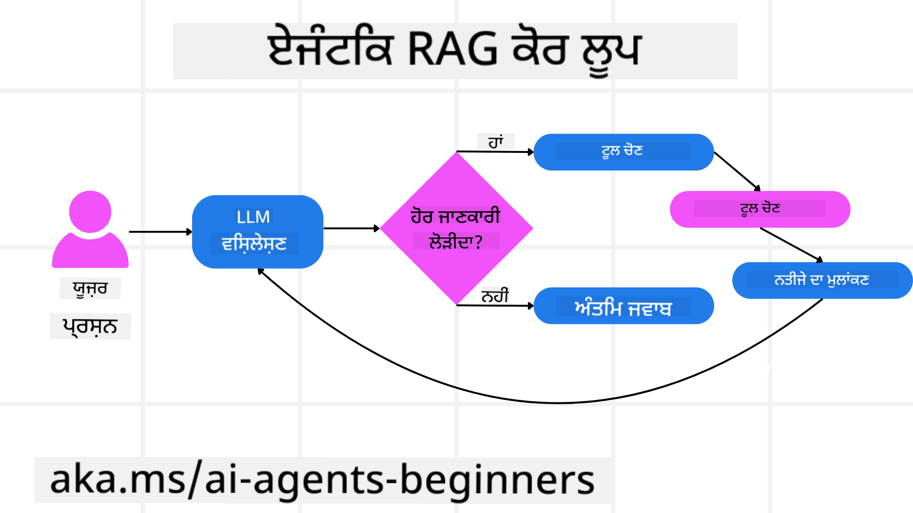
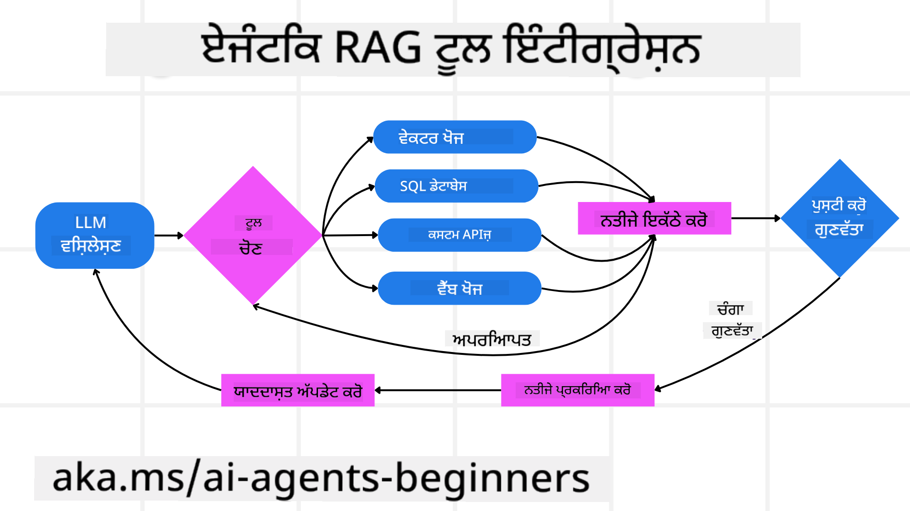

<!--
CO_OP_TRANSLATOR_METADATA:
{
  "original_hash": "7622aa72f9e676e593339f5f694ecd7d",
  "translation_date": "2025-07-12T09:59:15+00:00",
  "source_file": "05-agentic-rag/README.md",
  "language_code": "pa"
}
-->

> _(ਇਸ ਪਾਠ ਦਾ ਵੀਡੀਓ ਦੇਖਣ ਲਈ ਉਪਰ ਦਿੱਤੀ ਤਸਵੀਰ 'ਤੇ ਕਲਿੱਕ ਕਰੋ)_

# Agentic RAG

ਇਹ ਪਾਠ Agentic Retrieval-Augmented Generation (Agentic RAG) ਦਾ ਵਿਸਤ੍ਰਿਤ ਜਾਣੂ ਕਰਵਾਉਂਦਾ ਹੈ, ਜੋ ਇੱਕ ਨਵਾਂ AI ਪੈਰਾਡਾਈਮ ਹੈ ਜਿਸ ਵਿੱਚ ਵੱਡੇ ਭਾਸ਼ਾ ਮਾਡਲ (LLMs) ਆਪਣੇ ਅਗਲੇ ਕਦਮ ਆਪਣੇ ਆਪ ਯੋਜਨਾ ਬਣਾਉਂਦੇ ਹਨ ਅਤੇ ਬਾਹਰੀ ਸਰੋਤਾਂ ਤੋਂ ਜਾਣਕਾਰੀ ਖਿੱਚਦੇ ਹਨ। ਸਧਾਰਣ retrieval-then-read ਪੈਟਰਨ ਤੋਂ ਵੱਖਰਾ, Agentic RAG ਵਿੱਚ LLM ਨੂੰ ਵਾਰ-ਵਾਰ ਕਾਲ ਕੀਤਾ ਜਾਂਦਾ ਹੈ, ਜਿਸ ਵਿੱਚ ਟੂਲ ਜਾਂ ਫੰਕਸ਼ਨ ਕਾਲ ਅਤੇ ਸੰਰਚਿਤ ਨਤੀਜੇ ਸ਼ਾਮਲ ਹੁੰਦੇ ਹਨ। ਸਿਸਟਮ ਨਤੀਜਿਆਂ ਦਾ ਮੁਲਾਂਕਣ ਕਰਦਾ ਹੈ, ਪ੍ਰਸ਼ਨਾਂ ਨੂੰ ਸੁਧਾਰਦਾ ਹੈ, ਜੇ ਲੋੜ ਹੋਵੇ ਤਾਂ ਹੋਰ ਟੂਲ ਵਰਤਦਾ ਹੈ ਅਤੇ ਇਹ ਚੱਕਰ ਤਦ ਤੱਕ ਜਾਰੀ ਰੱਖਦਾ ਹੈ ਜਦ ਤੱਕ ਸੰਤੋਸ਼ਜਨਕ ਹੱਲ ਨਾ ਮਿਲ ਜਾਵੇ।

## ਪਰਿਚਯ

ਇਸ ਪਾਠ ਵਿੱਚ ਤੁਸੀਂ ਸਿੱਖੋਗੇ:

- **Agentic RAG ਨੂੰ ਸਮਝਣਾ:** AI ਵਿੱਚ ਇਹ ਨਵਾਂ ਪੈਰਾਡਾਈਮ ਜਿਸ ਵਿੱਚ ਵੱਡੇ ਭਾਸ਼ਾ ਮਾਡਲ (LLMs) ਆਪਣੇ ਅਗਲੇ ਕਦਮ ਆਪਣੇ ਆਪ ਯੋਜਨਾ ਬਣਾਉਂਦੇ ਹਨ ਅਤੇ ਬਾਹਰੀ ਡਾਟਾ ਸਰੋਤਾਂ ਤੋਂ ਜਾਣਕਾਰੀ ਖਿੱਚਦੇ ਹਨ।
- **Iterative Maker-Checker ਸਟਾਈਲ ਨੂੰ ਸਮਝਣਾ:** LLM ਨੂੰ ਵਾਰ-ਵਾਰ ਕਾਲ ਕਰਨ ਦਾ ਚੱਕਰ, ਜਿਸ ਵਿੱਚ ਟੂਲ ਜਾਂ ਫੰਕਸ਼ਨ ਕਾਲ ਅਤੇ ਸੰਰਚਿਤ ਨਤੀਜੇ ਸ਼ਾਮਲ ਹੁੰਦੇ ਹਨ, ਜੋ ਸਹੀਤਾ ਨੂੰ ਸੁਧਾਰਨ ਅਤੇ ਗਲਤ ਪ੍ਰਸ਼ਨਾਂ ਨੂੰ ਸੰਭਾਲਣ ਲਈ ਬਣਾਇਆ ਗਿਆ ਹੈ।
- **ਵਿਆਵਹਾਰਿਕ ਐਪਲੀਕੇਸ਼ਨਾਂ ਦੀ ਪਹਚਾਣ:** ਉਹ ਸਥਿਤੀਆਂ ਜਿੱਥੇ Agentic RAG ਚਮਕਦਾ ਹੈ, ਜਿਵੇਂ ਕਿ ਸਹੀਤਾ-ਪਹਿਲਾਂ ਵਾਲੇ ਮਾਹੌਲ, ਜਟਿਲ ਡਾਟਾਬੇਸ ਇੰਟਰੈਕਸ਼ਨ ਅਤੇ ਲੰਬੇ ਵਰਕਫਲੋਜ਼।

## ਸਿੱਖਣ ਦੇ ਲਕੜੇ

ਇਸ ਪਾਠ ਨੂੰ ਪੂਰਾ ਕਰਨ ਤੋਂ ਬਾਅਦ, ਤੁਸੀਂ ਇਹ ਜਾਣੋਗੇ/ਸਮਝੋਗੇ:

- **Agentic RAG ਨੂੰ ਸਮਝਣਾ:** AI ਵਿੱਚ ਇਹ ਨਵਾਂ ਪੈਰਾਡਾਈਮ ਜਿਸ ਵਿੱਚ ਵੱਡੇ ਭਾਸ਼ਾ ਮਾਡਲ (LLMs) ਆਪਣੇ ਅਗਲੇ ਕਦਮ ਆਪਣੇ ਆਪ ਯੋਜਨਾ ਬਣਾਉਂਦੇ ਹਨ ਅਤੇ ਬਾਹਰੀ ਡਾਟਾ ਸਰੋਤਾਂ ਤੋਂ ਜਾਣਕਾਰੀ ਖਿੱਚਦੇ ਹਨ।
- **Iterative Maker-Checker ਸਟਾਈਲ:** LLM ਨੂੰ ਵਾਰ-ਵਾਰ ਕਾਲ ਕਰਨ ਦੇ ਚੱਕਰ ਨੂੰ ਸਮਝਣਾ, ਜਿਸ ਵਿੱਚ ਟੂਲ ਜਾਂ ਫੰਕਸ਼ਨ ਕਾਲ ਅਤੇ ਸੰਰਚਿਤ ਨਤੀਜੇ ਸ਼ਾਮਲ ਹੁੰਦੇ ਹਨ, ਜੋ ਸਹੀਤਾ ਨੂੰ ਸੁਧਾਰਨ ਅਤੇ ਗਲਤ ਪ੍ਰਸ਼ਨਾਂ ਨੂੰ ਸੰਭਾਲਣ ਲਈ ਬਣਾਇਆ ਗਿਆ ਹੈ।
- **ਤਰਕਸ਼ੀਲ ਪ੍ਰਕਿਰਿਆ ਦਾ ਮਾਲਕ ਬਣਨਾ:** ਸਿਸਟਮ ਦੀ ਆਪਣੀ ਤਰਕਸ਼ੀਲ ਪ੍ਰਕਿਰਿਆ ਨੂੰ ਮਾਲਕ ਬਣਾਉਣ ਦੀ ਸਮਰੱਥਾ ਨੂੰ ਸਮਝਣਾ, ਜੋ ਮੁਸ਼ਕਲਾਂ ਨੂੰ ਹੱਲ ਕਰਨ ਲਈ ਪਹਿਲਾਂ ਤੋਂ ਨਿਰਧਾਰਿਤ ਰਾਹਾਂ 'ਤੇ ਨਿਰਭਰ ਨਹੀਂ ਹੁੰਦਾ।
- **ਵਰਕਫਲੋ:** ਸਮਝਣਾ ਕਿ ਇੱਕ agentic ਮਾਡਲ ਕਿਵੇਂ ਖੁਦਮੁਖਤਿਆਰ ਤੌਰ 'ਤੇ ਮਾਰਕੀਟ ਟ੍ਰੈਂਡ ਰਿਪੋਰਟਾਂ ਪ੍ਰਾਪਤ ਕਰਦਾ ਹੈ, ਮੁਕਾਬਲੇਦਾਰ ਡਾਟਾ ਪਛਾਣਦਾ ਹੈ, ਅੰਦਰੂਨੀ ਵਿਕਰੀ ਮੈਟ੍ਰਿਕਸ ਨਾਲ ਸਬੰਧਿਤ ਕਰਦਾ ਹੈ, ਨਤੀਜੇ ਸਿੰਥੇਸਾਈਜ਼ ਕਰਦਾ ਹੈ ਅਤੇ ਰਣਨੀਤੀ ਦਾ ਮੁਲਾਂਕਣ ਕਰਦਾ ਹੈ।
- **Iterative ਲੂਪ, ਟੂਲ ਇੰਟੀਗ੍ਰੇਸ਼ਨ ਅਤੇ ਯਾਦਦਾਸ਼ਤ:** ਸਿਸਟਮ ਦੇ ਲੂਪਡ ਇੰਟਰੈਕਸ਼ਨ ਪੈਟਰਨ 'ਤੇ ਨਿਰਭਰਤਾ ਬਾਰੇ ਸਿੱਖਣਾ, ਜੋ ਕਦਮਾਂ ਵਿੱਚ ਸਥਿਤੀ ਅਤੇ ਯਾਦਦਾਸ਼ਤ ਨੂੰ ਬਰਕਰਾਰ ਰੱਖਦਾ ਹੈ ਤਾਂ ਜੋ ਦੁਹਰਾਏ ਜਾਣ ਵਾਲੇ ਲੂਪ ਤੋਂ ਬਚਿਆ ਜਾ ਸਕੇ ਅਤੇ ਜਾਣਕਾਰੀ ਵਾਲੇ ਫੈਸਲੇ ਕੀਤੇ ਜਾ ਸਕਣ।
- **ਫੇਲ੍ਹ ਮੋਡ ਅਤੇ ਸਵੈ-ਸੁਧਾਰ ਨੂੰ ਸੰਭਾਲਣਾ:** ਸਿਸਟਮ ਦੇ ਮਜ਼ਬੂਤ ਸਵੈ-ਸੁਧਾਰ ਮਕੈਨਿਜ਼ਮ ਬਾਰੇ ਜਾਣਕਾਰੀ ਪ੍ਰਾਪਤ ਕਰਨੀ, ਜਿਸ ਵਿੱਚ ਦੁਹਰਾਏ ਜਾਣ ਵਾਲੇ ਪ੍ਰਯਾਸ, ਡਾਇਗਨੋਸਟਿਕ ਟੂਲਾਂ ਦੀ ਵਰਤੋਂ ਅਤੇ ਮਨੁੱਖੀ ਨਿਗਰਾਨੀ ਸ਼ਾਮਲ ਹੈ।
- **ਏਜੰਸੀ ਦੀਆਂ ਸੀਮਾਵਾਂ:** Agentic RAG ਦੀਆਂ ਸੀਮਾਵਾਂ ਨੂੰ ਸਮਝਣਾ, ਜੋ ਖੇਤਰ-ਵਿਸ਼ੇਸ਼ ਖੁਦਮੁਖਤਿਆਰੀ, ਢਾਂਚਾਗਤ ਨਿਰਭਰਤਾ ਅਤੇ ਗਾਰਡਰੇਲਜ਼ ਦੀ ਇੱਜ਼ਤ 'ਤੇ ਧਿਆਨ ਕੇਂਦ੍ਰਿਤ ਕਰਦਾ ਹੈ।
- **ਵਿਆਵਹਾਰਿਕ ਵਰਤੋਂ ਦੇ ਕੇਸ ਅਤੇ ਮੁੱਲ:** ਉਹ ਸਥਿਤੀਆਂ ਜਿੱਥੇ Agentic RAG ਚਮਕਦਾ ਹੈ, ਜਿਵੇਂ ਕਿ ਸਹੀਤਾ-ਪਹਿਲਾਂ ਵਾਲੇ ਮਾਹੌਲ, ਜਟਿਲ ਡਾਟਾਬੇਸ ਇੰਟਰੈਕਸ਼ਨ ਅਤੇ ਲੰਬੇ ਵਰਕਫਲੋਜ਼।
- **ਸਰਕਾਰ, ਪਾਰਦਰਸ਼ਤਾ ਅਤੇ ਭਰੋਸਾ:** ਸਰਕਾਰ ਅਤੇ ਪਾਰਦਰਸ਼ਤਾ ਦੀ ਮਹੱਤਤਾ ਬਾਰੇ ਸਿੱਖਣਾ, ਜਿਸ ਵਿੱਚ ਵਿਆਖਿਆਯੋਗ ਤਰਕਸ਼ੀਲਤਾ, ਪੱਖਪਾਤ ਨਿਯੰਤਰਣ ਅਤੇ ਮਨੁੱਖੀ ਨਿਗਰਾਨੀ ਸ਼ਾਮਲ ਹੈ।

## Agentic RAG ਕੀ ਹੈ?

Agentic Retrieval-Augmented Generation (Agentic RAG) ਇੱਕ ਨਵਾਂ AI ਪੈਰਾਡਾਈਮ ਹੈ ਜਿਸ ਵਿੱਚ ਵੱਡੇ ਭਾਸ਼ਾ ਮਾਡਲ (LLMs) ਆਪਣੇ ਅਗਲੇ ਕਦਮ ਆਪਣੇ ਆਪ ਯੋਜਨਾ ਬਣਾਉਂਦੇ ਹਨ ਅਤੇ ਬਾਹਰੀ ਸਰੋਤਾਂ ਤੋਂ ਜਾਣਕਾਰੀ ਖਿੱਚਦੇ ਹਨ। ਸਧਾਰਣ retrieval-then-read ਪੈਟਰਨ ਤੋਂ ਵੱਖਰਾ, Agentic RAG ਵਿੱਚ LLM ਨੂੰ ਵਾਰ-ਵਾਰ ਕਾਲ ਕੀਤਾ ਜਾਂਦਾ ਹੈ, ਜਿਸ ਵਿੱਚ ਟੂਲ ਜਾਂ ਫੰਕਸ਼ਨ ਕਾਲ ਅਤੇ ਸੰਰਚਿਤ ਨਤੀਜੇ ਸ਼ਾਮਲ ਹੁੰਦੇ ਹਨ। ਸਿਸਟਮ ਨਤੀਜਿਆਂ ਦਾ ਮੁਲਾਂਕਣ ਕਰਦਾ ਹੈ, ਪ੍ਰਸ਼ਨਾਂ ਨੂੰ ਸੁਧਾਰਦਾ ਹੈ, ਜੇ ਲੋੜ ਹੋਵੇ ਤਾਂ ਹੋਰ ਟੂਲ ਵਰਤਦਾ ਹੈ ਅਤੇ ਇਹ ਚੱਕਰ ਤਦ ਤੱਕ ਜਾਰੀ ਰੱਖਦਾ ਹੈ ਜਦ ਤੱਕ ਸੰਤੋਸ਼ਜਨਕ ਹੱਲ ਨਾ ਮਿਲ ਜਾਵੇ। ਇਹ ਵਾਰ-ਵਾਰ “maker-checker” ਸਟਾਈਲ ਸਹੀਤਾ ਨੂੰ ਸੁਧਾਰਦੀ ਹੈ, ਗਲਤ ਪ੍ਰਸ਼ਨਾਂ ਨੂੰ ਸੰਭਾਲਦੀ ਹੈ ਅਤੇ ਉੱਚ-ਗੁਣਵੱਤਾ ਵਾਲੇ ਨਤੀਜੇ ਯਕੀਨੀ ਬਣਾਉਂਦੀ ਹੈ।

ਸਿਸਟਮ ਆਪਣੀ ਤਰਕਸ਼ੀਲ ਪ੍ਰਕਿਰਿਆ ਦਾ ਮਾਲਕ ਹੁੰਦਾ ਹੈ, ਫੇਲ੍ਹ ਹੋਏ ਪ੍ਰਸ਼ਨਾਂ ਨੂੰ ਦੁਬਾਰਾ ਲਿਖਦਾ ਹੈ, ਵੱਖ-ਵੱਖ retrieval ਤਰੀਕੇ ਚੁਣਦਾ ਹੈ ਅਤੇ ਕਈ ਟੂਲਾਂ ਨੂੰ ਜੋੜਦਾ ਹੈ—ਜਿਵੇਂ ਕਿ Azure AI Search ਵਿੱਚ ਵੈਕਟਰ ਖੋਜ, SQL ਡਾਟਾਬੇਸ ਜਾਂ ਕਸਟਮ APIs—ਆਖਰੀ ਜਵਾਬ ਤਿਆਰ ਕਰਨ ਤੋਂ ਪਹਿਲਾਂ। ਇੱਕ agentic ਸਿਸਟਮ ਦੀ ਖਾਸੀਅਤ ਇਹ ਹੈ ਕਿ ਇਹ ਆਪਣੀ ਤਰਕਸ਼ੀਲ ਪ੍ਰਕਿਰਿਆ ਦਾ ਮਾਲਕ ਹੁੰਦਾ ਹੈ। ਰਵਾਇਤੀ RAG ਇੰਪਲੀਮੈਂਟੇਸ਼ਨ ਪਹਿਲਾਂ ਤੋਂ ਨਿਰਧਾਰਿਤ ਰਾਹਾਂ 'ਤੇ ਨਿਰਭਰ ਹੁੰਦੇ ਹਨ, ਪਰ agentic ਸਿਸਟਮ ਖੁਦਮੁਖਤਿਆਰ ਤੌਰ 'ਤੇ ਜਾਣਕਾਰੀ ਦੀ ਗੁਣਵੱਤਾ ਦੇ ਆਧਾਰ 'ਤੇ ਕਦਮਾਂ ਦੀ ਲੜੀ ਤੈਅ ਕਰਦਾ ਹੈ।

## Agentic Retrieval-Augmented Generation (Agentic RAG) ਦੀ ਪਰਿਭਾਸ਼ਾ

Agentic Retrieval-Augmented Generation (Agentic RAG) AI ਵਿਕਾਸ ਵਿੱਚ ਇੱਕ ਨਵਾਂ ਪੈਰਾਡਾਈਮ ਹੈ ਜਿਸ ਵਿੱਚ LLMs ਸਿਰਫ ਬਾਹਰੀ ਡਾਟਾ ਸਰੋਤਾਂ ਤੋਂ ਜਾਣਕਾਰੀ ਖਿੱਚਦੇ ਹੀ ਨਹੀਂ, ਸਗੋਂ ਆਪਣੇ ਅਗਲੇ ਕਦਮ ਆਪਣੇ ਆਪ ਯੋਜਨਾ ਬਣਾਉਂਦੇ ਹਨ। ਸਧਾਰਣ retrieval-then-read ਪੈਟਰਨ ਜਾਂ ਧਿਆਨ ਨਾਲ ਲਿਖੇ ਪ੍ਰਾਂਪਟ ਸੀਕਵੈਂਸ ਤੋਂ ਵੱਖਰਾ, Agentic RAG ਵਿੱਚ LLM ਨੂੰ ਵਾਰ-ਵਾਰ ਕਾਲ ਕਰਨ ਦਾ ਚੱਕਰ ਹੁੰਦਾ ਹੈ, ਜਿਸ ਵਿੱਚ ਟੂਲ ਜਾਂ ਫੰਕਸ਼ਨ ਕਾਲ ਅਤੇ ਸੰਰਚਿਤ ਨਤੀਜੇ ਸ਼ਾਮਲ ਹੁੰਦੇ ਹਨ। ਹਰ ਵਾਰੀ, ਸਿਸਟਮ ਪ੍ਰਾਪਤ ਨਤੀਜਿਆਂ ਦਾ ਮੁਲਾਂਕਣ ਕਰਦਾ ਹੈ, ਫੈਸਲਾ ਕਰਦਾ ਹੈ ਕਿ ਪ੍ਰਸ਼ਨਾਂ ਨੂੰ ਸੁਧਾਰਨਾ ਹੈ ਜਾਂ ਨਹੀਂ, ਜੇ ਲੋੜ ਹੋਵੇ ਤਾਂ ਹੋਰ ਟੂਲ ਵਰਤਦਾ ਹੈ ਅਤੇ ਇਹ ਚੱਕਰ ਤਦ ਤੱਕ ਜਾਰੀ ਰੱਖਦਾ ਹੈ ਜਦ ਤੱਕ ਸੰਤੋਸ਼ਜਨਕ ਹੱਲ ਨਾ ਮਿਲ ਜਾਵੇ।

ਇਹ ਵਾਰ-ਵਾਰ “maker-checker” ਸਟਾਈਲ ਸਹੀਤਾ ਨੂੰ ਸੁਧਾਰਨ, ਗਲਤ ਪ੍ਰਸ਼ਨਾਂ ਨੂੰ ਸੰਭਾਲਣ (ਜਿਵੇਂ NL2SQL) ਅਤੇ ਸੰਤੁਲਿਤ, ਉੱਚ-ਗੁਣਵੱਤਾ ਵਾਲੇ ਨਤੀਜੇ ਯਕੀਨੀ ਬਣਾਉਣ ਲਈ ਬਣਾਈ ਗਈ ਹੈ। ਸਿਰਫ ਧਿਆਨ ਨਾਲ ਬਣਾਈ ਗਈ ਪ੍ਰਾਂਪਟ ਚੇਨ 'ਤੇ ਨਿਰਭਰ ਰਹਿਣ ਦੀ ਬਜਾਏ, ਸਿਸਟਮ ਆਪਣੀ ਤਰਕਸ਼ੀਲ ਪ੍ਰਕਿਰਿਆ ਦਾ ਮਾਲਕ ਹੁੰਦਾ ਹੈ। ਇਹ ਫੇਲ੍ਹ ਹੋਏ ਪ੍ਰਸ਼ਨਾਂ ਨੂੰ ਦੁਬਾਰਾ ਲਿਖ ਸਕਦਾ ਹੈ, ਵੱਖ-ਵੱਖ retrieval ਤਰੀਕੇ ਚੁਣ ਸਕਦਾ ਹੈ ਅਤੇ ਕਈ ਟੂਲਾਂ ਨੂੰ ਜੋੜ ਸਕਦਾ ਹੈ—ਜਿਵੇਂ ਕਿ Azure AI Search ਵਿੱਚ ਵੈਕਟਰ ਖੋਜ, SQL ਡਾਟਾਬੇਸ ਜਾਂ ਕਸਟਮ APIs—ਆਖਰੀ ਜਵਾਬ ਤਿਆਰ ਕਰਨ ਤੋਂ ਪਹਿਲਾਂ। ਇਸ ਨਾਲ ਜਟਿਲ orchestration ਫਰੇਮਵਰਕ ਦੀ ਲੋੜ ਨਹੀਂ ਰਹਿੰਦੀ। ਇਸ ਦੀ ਬਜਾਏ, ਇੱਕ ਸਧਾਰਣ “LLM ਕਾਲ → ਟੂਲ ਵਰਤੋਂ → LLM ਕਾਲ → …” ਲੂਪ ਸੁਚੱਜੇ ਅਤੇ ਮਜ਼ਬੂਤ ਨਤੀਜੇ ਦੇ ਸਕਦਾ ਹੈ।

## ਤਰਕਸ਼ੀਲ ਪ੍ਰਕਿਰਿਆ ਦਾ ਮਾਲਕ ਬਣਨਾ

ਇੱਕ ਸਿਸਟਮ ਨੂੰ “agentic” ਬਣਾਉਣ ਵਾਲੀ ਖਾਸੀਅਤ ਇਹ ਹੈ ਕਿ ਇਹ ਆਪਣੀ ਤਰਕਸ਼ੀਲ ਪ੍ਰਕਿਰਿਆ ਦਾ ਮਾਲਕ ਹੁੰਦਾ ਹੈ। ਰਵਾਇਤੀ RAG ਇੰਪਲੀਮੈਂਟੇਸ਼ਨ ਅਕਸਰ ਮਨੁੱਖਾਂ ਵੱਲੋਂ ਮਾਡਲ ਲਈ ਪਹਿਲਾਂ ਤੋਂ ਰਾਹ ਨਿਰਧਾਰਿਤ ਕਰਨ 'ਤੇ ਨਿਰਭਰ ਹੁੰਦੇ ਹਨ: ਇੱਕ chain-of-thought ਜੋ ਦੱਸਦਾ ਹੈ ਕਿ ਕੀ ਖਿੱਚਣਾ ਹੈ ਅਤੇ ਕਦੋਂ।

ਪਰ ਜਦੋਂ ਸਿਸਟਮ ਸੱਚਮੁੱਚ agentic ਹੁੰਦਾ ਹੈ, ਤਾਂ ਇਹ ਅੰਦਰੂਨੀ ਤੌਰ 'ਤੇ ਫੈਸਲਾ ਕਰਦਾ ਹੈ ਕਿ ਸਮੱਸਿਆ ਨੂੰ ਕਿਵੇਂ ਹੱਲ ਕਰਨਾ ਹੈ। ਇਹ ਸਿਰਫ ਸਕ੍ਰਿਪਟ ਚਲਾਉਂਦਾ ਨਹੀਂ; ਇਹ ਜਾਣਕਾਰੀ ਦੀ ਗੁਣਵੱਤਾ ਦੇ ਆਧਾਰ 'ਤੇ ਕਦਮਾਂ ਦੀ ਲੜੀ ਖੁਦਮੁਖਤਿਆਰ ਤੌਰ 'ਤੇ ਤੈਅ ਕਰਦਾ ਹੈ।

ਉਦਾਹਰਨ ਵਜੋਂ, ਜੇ ਇਸਨੂੰ ਕਿਸੇ ਉਤਪਾਦ ਲਾਂਚ ਰਣਨੀਤੀ ਬਣਾਉਣ ਲਈ ਕਿਹਾ ਜਾਵੇ, ਤਾਂ ਇਹ ਸਿਰਫ ਇੱਕ ਪ੍ਰਾਂਪਟ 'ਤੇ ਨਿਰਭਰ ਨਹੀਂ ਕਰਦਾ ਜੋ ਪੂਰੇ ਰਿਸਰਚ ਅਤੇ ਫੈਸਲਾ-ਕਰਨ ਵਾਲੇ ਵਰਕਫਲੋ ਨੂੰ ਦਰਸਾਉਂਦਾ ਹੈ। ਇਸ ਦੀ ਬਜਾਏ, agentic ਮਾਡਲ ਖੁਦਮੁਖਤਿਆਰ ਤੌਰ 'ਤੇ ਫੈਸਲਾ ਕਰਦਾ ਹੈ ਕਿ:

1. Bing Web Grounding ਦੀ ਵਰਤੋਂ ਕਰਕੇ ਮੌਜੂਦਾ ਮਾਰਕੀਟ ਟ੍ਰੈਂਡ ਰਿਪੋਰਟਾਂ ਪ੍ਰਾਪਤ ਕਰਨੀ
2. Azure AI Search ਦੀ ਵਰਤੋਂ ਕਰਕੇ ਸੰਬੰਧਿਤ ਮੁਕਾਬਲੇਦਾਰ ਡਾਟਾ ਪਛਾਣਨਾ
3. Azure SQL Database ਦੀ ਵਰਤੋਂ ਕਰਕੇ ਇਤਿਹਾਸਕ ਅੰਦਰੂਨੀ ਵਿਕਰੀ ਮੈਟ੍ਰਿਕਸ ਨਾਲ ਸਬੰਧਿਤ ਕਰਨਾ
4. Azure OpenAI Service ਰਾਹੀਂ ਨਤੀਜਿਆਂ ਨੂੰ ਇੱਕਠਾ ਕਰਕੇ ਇੱਕ ਸੰਗਠਿਤ ਰਣਨੀਤੀ ਤਿਆਰ ਕਰਨੀ
5. ਰਣਨੀਤੀ ਵਿੱਚ ਖਾਮੀਆਂ ਜਾਂ ਅਸੰਗਤੀਆਂ ਲਈ ਮੁਲਾਂਕਣ ਕਰਨਾ, ਜੇ ਲੋੜ ਹੋਵੇ ਤਾਂ ਹੋਰ retrieval ਦਾ ਚੱਕਰ ਚਲਾਉਣਾ

ਇਹ ਸਾਰੇ ਕਦਮ—ਪ੍ਰਸ਼ਨਾਂ ਨੂੰ ਸੁਧਾਰਨਾ, ਸਰੋਤ ਚੁਣਨਾ, ਜਵਾਬ ਨਾਲ “ਖੁਸ਼” ਹੋਣ ਤੱਕ ਦੁਹਰਾਉਣਾ—ਮਾਡਲ ਵੱਲੋਂ ਫੈਸਲੇ ਕੀਤੇ ਜਾਂਦੇ ਹਨ, ਨਾ ਕਿ ਮਨੁੱਖ ਵੱਲੋਂ ਪਹਿਲਾਂ ਤੋਂ ਲਿਖੇ ਗਏ।

## Iterative ਲੂਪ, ਟੂਲ ਇੰਟੀਗ੍ਰੇਸ਼ਨ ਅਤੇ ਯਾਦਦਾਸ਼ਤ

ਇੱਕ agentic ਸਿਸਟਮ ਇੱਕ ਲੂਪਡ ਇੰਟਰੈਕਸ਼ਨ ਪੈਟਰਨ 'ਤੇ ਨਿਰਭਰ ਕਰਦਾ ਹੈ:

- **ਸ਼ੁਰੂਆਤੀ ਕਾਲ:** ਯੂਜ਼ਰ ਦਾ ਲਕੜਾ (ਜਿਸਨੂੰ ਯੂਜ਼ਰ ਪ੍ਰਾਂਪਟ ਵੀ ਕਹਿੰਦੇ ਹਨ) LLM ਨੂੰ ਦਿੱਤਾ ਜਾਂਦਾ ਹੈ।
- **ਟੂਲ ਕਾਲ:** ਜੇ ਮਾਡਲ ਨੂੰ ਲੱਗਦਾ ਹੈ ਕਿ ਜਾਣਕਾਰੀ ਘੱਟ ਹੈ ਜਾਂ ਹੁਕਮ ਅਸਪਸ਼ਟ ਹਨ, ਤਾਂ ਇਹ ਕੋਈ ਟੂਲ ਜਾਂ retrieval ਤਰੀਕਾ ਚੁਣਦਾ ਹੈ—ਜਿਵੇਂ ਕਿ ਵੈਕਟਰ ਡਾਟਾਬੇਸ ਕਵੈਰੀ (ਜਿਵੇਂ Azure AI Search Hybrid search) ਜਾਂ ਸੰਰਚਿਤ SQL ਕਾਲ—ਵਧੇਰੇ ਸੰਦਰਭ ਪ੍ਰਾਪਤ ਕਰਨ ਲਈ।
- **ਮੁਲਾਂਕਣ ਅਤੇ ਸੁਧਾਰ:** ਵਾਪਸ ਆਏ ਡਾਟੇ ਦੀ ਸਮੀਖਿਆ ਕਰਨ ਤੋਂ ਬਾਅਦ, ਮਾਡਲ ਫੈਸਲਾ ਕਰਦਾ ਹੈ ਕਿ ਜਾਣਕਾਰੀ ਕਾਫ਼ੀ ਹੈ ਜਾਂ ਨਹੀਂ। ਜੇ ਨਹੀਂ, ਤਾਂ ਇਹ ਪ੍ਰਸ਼ਨ ਨੂੰ ਸੁਧਾਰਦਾ ਹੈ, ਵੱਖਰਾ ਟੂਲ ਵਰਤਦਾ ਹੈ ਜਾਂ ਆਪਣਾ ਤਰੀਕਾ ਬਦਲਦਾ ਹੈ।
- **ਤਦ ਤੱਕ ਦੁਹਰਾਉਣਾ ਜਦ ਤੱਕ ਸੰਤੋਸ਼ ਨਾ ਹੋਵੇ:** ਇਹ ਚੱਕਰ ਜਾਰੀ ਰਹਿੰਦਾ ਹੈ ਜਦ ਤੱਕ ਮਾਡਲ ਇਹ ਨਿਰਣਯ ਨਾ ਕਰ ਲਵੇ ਕਿ ਇਸ ਕੋਲ ਆਖਰੀ, ਸੋਚ-ਵਿਚਾਰ ਵਾਲਾ ਜਵਾਬ ਦੇਣ ਲਈ ਕਾਫ਼ੀ ਸਪਸ਼ਟਤਾ ਅਤੇ ਸਬੂਤ ਹਨ।
- **ਯਾਦਦਾਸ਼ਤ ਅਤੇ ਸਥਿਤੀ:** ਕਿਉਂਕਿ ਸਿਸਟਮ ਕਦਮਾਂ ਵਿੱਚ ਸਥਿਤੀ ਅਤੇ ਯਾਦਦਾਸ਼ਤ ਬਰਕਰਾਰ ਰੱਖਦਾ ਹੈ, ਇਹ ਪਿਛਲੇ ਪ੍ਰਯਾਸਾਂ ਅਤੇ ਉਨ੍ਹਾਂ ਦੇ ਨਤੀਜਿਆਂ ਨੂੰ ਯਾਦ ਰੱਖ ਸਕਦਾ ਹੈ, ਦੁਹਰਾਏ ਜਾਣ ਵਾਲੇ ਲੂਪ ਤੋਂ ਬਚਦਾ ਹੈ ਅਤੇ ਜ਼ਿਆਦਾ ਜਾਣਕਾਰੀ ਵਾਲੇ ਫੈਸਲੇ ਕਰਦਾ ਹੈ।

ਸਮੇਂ ਦੇ ਨਾਲ, ਇਹ ਸਮਝ ਵਿੱਚ ਵਿਕਾਸ ਦਾ ਅਹਿਸਾਸ ਪੈਦਾ ਕਰਦਾ ਹੈ, ਜਿਸ ਨਾਲ ਮਾਡਲ ਬਿਨਾਂ ਮਨੁੱਖੀ ਦਖਲ ਦੇ ਜਟਿਲ, ਕਈ ਕਦਮਾਂ ਵਾਲੇ ਕੰਮਾਂ ਨੂੰ ਨਿਭਾ ਸਕਦਾ ਹੈ।

## ਫੇਲ੍ਹ ਮੋਡ ਅਤੇ ਸਵੈ-ਸੁਧਾਰ ਨੂੰ ਸੰਭਾਲਣਾ

Agentic RAG ਦੀ ਖੁਦਮੁਖਤਿਆਰੀ ਵਿੱਚ ਮਜ਼ਬੂਤ ਸਵੈ-ਸੁਧਾਰ ਮਕੈਨਿਜ਼ਮ ਵੀ ਸ਼ਾਮਲ ਹਨ। ਜਦੋਂ ਸਿਸਟਮ ਅਣਚਾਹੇ ਨਤੀਜੇ ਪ੍ਰਾਪਤ ਕਰਦਾ ਹੈ—ਜਿਵੇਂ ਗਲਤ ਦਸਤਾਵੇਜ਼ ਖਿੱਚਣਾ ਜਾਂ ਗਲਤ ਪ੍ਰਸ਼ਨ ਮਿਲਣਾ—ਤਾਂ ਇਹ:

- **ਦੁਹਰਾਉ ਅਤੇ ਦੁਬਾਰਾ ਪ੍ਰਸ਼ਨ ਪੁੱਛਣਾ:** ਘੱਟ ਕੀਮਤੀ ਜਵਾਬ ਦੇਣ ਦੀ ਬਜਾਏ, ਮਾਡਲ ਨਵੀਆਂ ਖੋਜ ਰਣਨੀਤੀਆਂ ਅਜ਼ਮਾਉਂਦਾ ਹੈ, ਡਾਟਾਬੇਸ ਪ੍ਰਸ਼ਨਾਂ ਨੂੰ ਦੁਬਾਰਾ ਲਿਖਦਾ ਹੈ ਜਾਂ ਵਿਕਲਪਿਕ ਡਾਟਾ ਸੈੱਟਾਂ ਨੂੰ ਵੇਖਦਾ ਹੈ।
- **ਡਾਇਗਨੋਸਟਿਕ ਟੂਲਾਂ ਦੀ ਵਰਤੋਂ:** ਸਿਸਟਮ ਹੋਰ ਫੰਕਸ਼ਨਾਂ ਨੂੰ ਕਾਲ ਕਰ ਸਕਦਾ ਹੈ ਜੋ ਇਸ ਦੀ ਤਰਕਸ਼ੀਲ ਕਦਮ

- <a href="https://learn.microsoft.com/azure/ai-studio/concepts/evaluation-approach-gen-ai" target="_blank">Azure AI Foundry ਨਾਲ ਜਨਰੇਟਿਵ AI ਐਪਲੀਕੇਸ਼ਨਾਂ ਦਾ ਮੁਲਾਂਕਣ: ਇਹ ਲੇਖ ਸਰਵਜਨਿਕ ਤੌਰ 'ਤੇ ਉਪਲਬਧ ਡੇਟਾਸੈੱਟਾਂ 'ਤੇ ਮਾਡਲਾਂ ਦੇ ਮੁਲਾਂਕਣ ਅਤੇ ਤੁਲਨਾ ਨੂੰ ਕਵਰ ਕਰਦਾ ਹੈ, ਜਿਸ ਵਿੱਚ Agentic AI ਐਪਲੀਕੇਸ਼ਨ ਅਤੇ RAG ਆਰਕੀਟੈਕਚਰ ਸ਼ਾਮਲ ਹਨ</a>
- <a href="https://weaviate.io/blog/what-is-agentic-rag" target="_blank">Agentic RAG ਕੀ ਹੈ | Weaviate</a>
- <a href="https://ragaboutit.com/agentic-rag-a-complete-guide-to-agent-based-retrieval-augmented-generation/" target="_blank">Agentic RAG: ਏਜੰਟ-ਆਧਾਰਿਤ ਰੀਟਰੀਵਲ ਆਗਮੈਂਟਡ ਜਨਰੇਸ਼ਨ ਲਈ ਪੂਰਾ ਗਾਈਡ – ਜਨਰੇਸ਼ਨ RAG ਤੋਂ ਖ਼ਬਰਾਂ</a>
- <a href="https://huggingface.co/learn/cookbook/agent_rag" target="_blank">Agentic RAG: ਆਪਣੇ RAG ਨੂੰ ਕੁਐਰੀ ਰੀਫਾਰਮੂਲੇਸ਼ਨ ਅਤੇ ਸਵੈ-ਕੁਐਰੀ ਨਾਲ ਤੁਰਬੋਚਾਰਜ ਕਰੋ! Hugging Face ਖੁੱਲ੍ਹਾ ਸਰੋਤ AI ਕੂਕਬੁੱਕ</a>
- <a href="https://youtu.be/aQ4yQXeB1Ss?si=2HUqBzHoeB5tR04U" target="_blank">RAG ਵਿੱਚ Agentic ਲੇਅਰਜ਼ ਸ਼ਾਮਲ ਕਰਨਾ</a>
- <a href="https://www.youtube.com/watch?v=zeAyuLc_f3Q&t=244s" target="_blank">ਨੋਲੇਜ ਅਸਿਸਟੈਂਟਸ ਦਾ ਭਵਿੱਖ: ਜੈਰੀ ਲਿਊ</a>
- <a href="https://www.youtube.com/watch?v=AOSjiXP1jmQ" target="_blank">Agentic RAG ਸਿਸਟਮ ਕਿਵੇਂ ਬਣਾਏ ਜਾਣ</a>
- <a href="https://ignite.microsoft.com/sessions/BRK102?source=sessions" target="_blank">ਆਪਣੇ AI ਏਜੰਟਾਂ ਨੂੰ ਸਕੇਲ ਕਰਨ ਲਈ Azure AI Foundry Agent ਸੇਵਾ ਦੀ ਵਰਤੋਂ</a>

### ਅਕਾਦਮਿਕ ਪੇਪਰ

- <a href="https://arxiv.org/abs/2303.17651" target="_blank">2303.17651 Self-Refine: ਸਵੈ-ਫੀਡਬੈਕ ਨਾਲ ਇਟਰੇਟਿਵ ਸੁਧਾਰ</a>
- <a href="https://arxiv.org/abs/2303.11366" target="_blank">2303.11366 Reflexion: ਜ਼ਬਾਨੀ ਰੀਇਨਫੋਰਸਮੈਂਟ ਲਰਨਿੰਗ ਵਾਲੇ ਭਾਸ਼ਾ ਏਜੰਟ</a>
- <a href="https://arxiv.org/abs/2305.11738" target="_blank">2305.11738 CRITIC: ਵੱਡੇ ਭਾਸ਼ਾ ਮਾਡਲ ਟੂਲ-ਇੰਟਰਐਕਟਿਵ ਟਿੱਪਣੀ ਨਾਲ ਸਵੈ-ਸੁਧਾਰ ਕਰ ਸਕਦੇ ਹਨ</a>
- <a href="https://arxiv.org/abs/2501.09136" target="_blank">2501.09136 Agentic Retrieval-Augmented Generation: Agentic RAG 'ਤੇ ਇੱਕ ਸਰਵੇਖਣ</a>

## ਪਿਛਲਾ ਪਾਠ

[ਟੂਲ ਯੂਜ਼ ਡਿਜ਼ਾਈਨ ਪੈਟਰਨ](../04-tool-use/README.md)

## ਅਗਲਾ ਪਾਠ

[ਭਰੋਸੇਮੰਦ AI ਏਜੰਟ ਬਣਾਉਣਾ](../06-building-trustworthy-agents/README.md)

**ਅਸਵੀਕਾਰੋਪਣ**:  
ਇਹ ਦਸਤਾਵੇਜ਼ AI ਅਨੁਵਾਦ ਸੇਵਾ [Co-op Translator](https://github.com/Azure/co-op-translator) ਦੀ ਵਰਤੋਂ ਕਰਕੇ ਅਨੁਵਾਦਿਤ ਕੀਤਾ ਗਿਆ ਹੈ। ਜਦੋਂ ਕਿ ਅਸੀਂ ਸਹੀਅਤ ਲਈ ਕੋਸ਼ਿਸ਼ ਕਰਦੇ ਹਾਂ, ਕਿਰਪਾ ਕਰਕੇ ਧਿਆਨ ਰੱਖੋ ਕਿ ਸਵੈਚਾਲਿਤ ਅਨੁਵਾਦਾਂ ਵਿੱਚ ਗਲਤੀਆਂ ਜਾਂ ਅਸਮਰਥਤਾਵਾਂ ਹੋ ਸਕਦੀਆਂ ਹਨ। ਮੂਲ ਦਸਤਾਵੇਜ਼ ਆਪਣੀ ਮੂਲ ਭਾਸ਼ਾ ਵਿੱਚ ਪ੍ਰਮਾਣਿਕ ਸਰੋਤ ਮੰਨਿਆ ਜਾਣਾ ਚਾਹੀਦਾ ਹੈ। ਮਹੱਤਵਪੂਰਨ ਜਾਣਕਾਰੀ ਲਈ, ਪੇਸ਼ੇਵਰ ਮਨੁੱਖੀ ਅਨੁਵਾਦ ਦੀ ਸਿਫਾਰਸ਼ ਕੀਤੀ ਜਾਂਦੀ ਹੈ। ਇਸ ਅਨੁਵਾਦ ਦੀ ਵਰਤੋਂ ਤੋਂ ਉਤਪੰਨ ਕਿਸੇ ਵੀ ਗਲਤਫਹਿਮੀ ਜਾਂ ਗਲਤ ਵਿਆਖਿਆ ਲਈ ਅਸੀਂ ਜ਼ਿੰਮੇਵਾਰ ਨਹੀਂ ਹਾਂ।