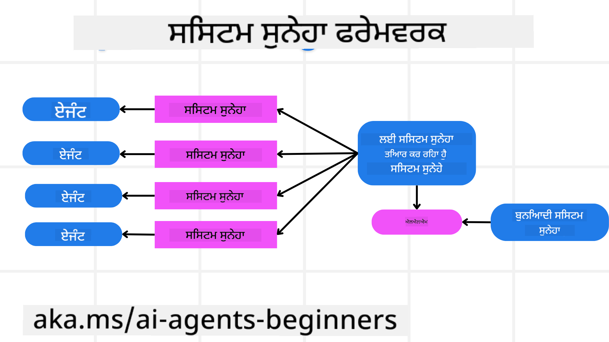
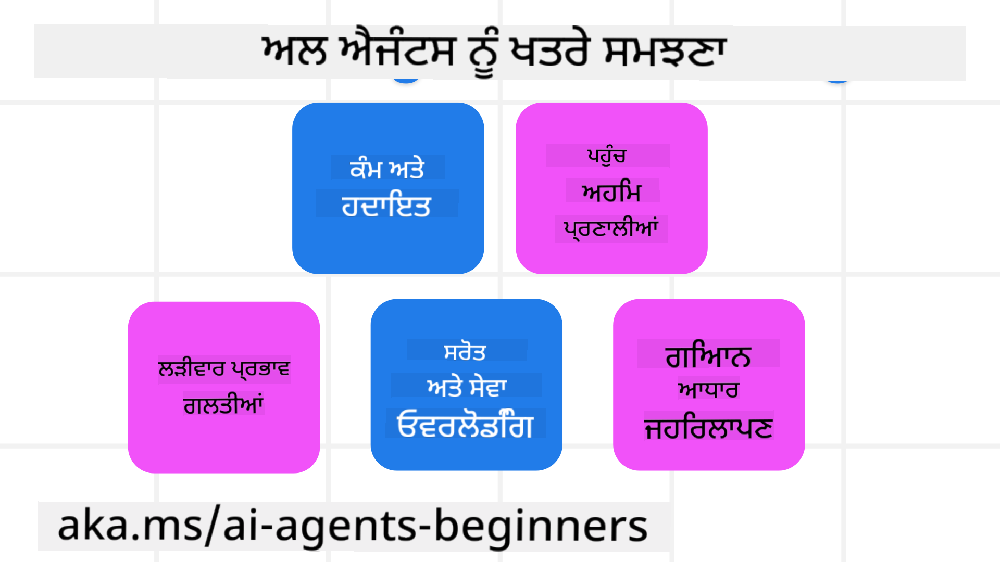
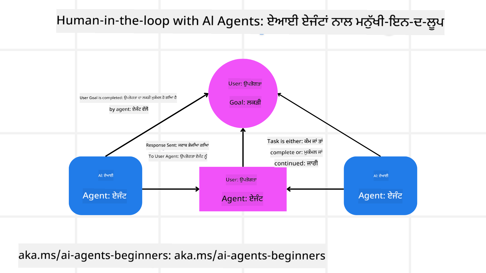

<!--
CO_OP_TRANSLATOR_METADATA:
{
  "original_hash": "f57852cac3a86c4a5ef47f793cc12178",
  "translation_date": "2025-07-12T10:25:34+00:00",
  "source_file": "06-building-trustworthy-agents/README.md",
  "language_code": "pa"
}
-->
[](https://youtu.be/iZKkMEGBCUQ?si=Q-kEbcyHUMPoHp8L)

> _(ਇਸ ਪਾਠ ਦਾ ਵੀਡੀਓ ਦੇਖਣ ਲਈ ਉਪਰ ਦਿੱਤੀ ਤਸਵੀਰ 'ਤੇ ਕਲਿੱਕ ਕਰੋ)_

# ਭਰੋਸੇਯੋਗ AI ਏਜੰਟ ਬਣਾਉਣਾ

## ਪਰਿਚਯ

ਇਸ ਪਾਠ ਵਿੱਚ ਇਹ ਸਿਖਾਇਆ ਜਾਵੇਗਾ:

- ਸੁਰੱਖਿਅਤ ਅਤੇ ਪ੍ਰਭਾਵਸ਼ਾਲੀ AI ਏਜੰਟ ਕਿਵੇਂ ਬਣਾਏ ਅਤੇ ਤਾਇਨਾਤ ਕੀਤੇ ਜਾਣ
- AI ਏਜੰਟ ਵਿਕਾਸ ਦੌਰਾਨ ਮਹੱਤਵਪੂਰਨ ਸੁਰੱਖਿਆ ਦੇ ਪੱਖ
- AI ਏਜੰਟ ਵਿਕਾਸ ਦੌਰਾਨ ਡਾਟਾ ਅਤੇ ਯੂਜ਼ਰ ਦੀ ਪ੍ਰਾਈਵੇਸੀ ਕਿਵੇਂ ਬਰਕਰਾਰ ਰੱਖੀ ਜਾਵੇ

## ਸਿੱਖਣ ਦੇ ਲਕੜ

ਇਸ ਪਾਠ ਨੂੰ ਪੂਰਾ ਕਰਨ ਤੋਂ ਬਾਅਦ, ਤੁਸੀਂ ਜਾਣੋਗੇ ਕਿ:

- AI ਏਜੰਟ ਬਣਾਉਂਦੇ ਸਮੇਂ ਖਤਰਿਆਂ ਦੀ ਪਹਿਚਾਣ ਅਤੇ ਉਨ੍ਹਾਂ ਨੂੰ ਕਿਵੇਂ ਘਟਾਇਆ ਜਾਵੇ
- ਡਾਟਾ ਅਤੇ ਪਹੁੰਚ ਨੂੰ ਠੀਕ ਤਰੀਕੇ ਨਾਲ ਸੰਭਾਲਣ ਲਈ ਸੁਰੱਖਿਆ ਉਪਾਅ ਲਾਗੂ ਕਰਨ
- ਐਸੇ AI ਏਜੰਟ ਬਣਾਉਣਾ ਜੋ ਡਾਟਾ ਦੀ ਪ੍ਰਾਈਵੇਸੀ ਬਰਕਰਾਰ ਰੱਖਣ ਅਤੇ ਉੱਚ ਗੁਣਵੱਤਾ ਵਾਲਾ ਯੂਜ਼ਰ ਅਨੁਭਵ ਦੇਣ

## ਸੁਰੱਖਿਆ

ਆਓ ਪਹਿਲਾਂ ਸੁਰੱਖਿਅਤ ਏਜੰਟਿਕ ਐਪਲੀਕੇਸ਼ਨਾਂ ਬਣਾਉਣ ਬਾਰੇ ਗੱਲ ਕਰੀਏ। ਸੁਰੱਖਿਆ ਦਾ ਮਤਲਬ ਹੈ ਕਿ AI ਏਜੰਟ ਉਸ ਤਰ੍ਹਾਂ ਕੰਮ ਕਰੇ ਜਿਵੇਂ ਉਸਦੀ ਡਿਜ਼ਾਈਨ ਕੀਤੀ ਗਈ ਹੈ। ਏਜੰਟਿਕ ਐਪਲੀਕੇਸ਼ਨ ਬਣਾਉਣ ਵਾਲਿਆਂ ਵਜੋਂ ਸਾਡੇ ਕੋਲ ਸੁਰੱਖਿਆ ਵਧਾਉਣ ਲਈ ਤਰੀਕੇ ਅਤੇ ਸੰਦ ਹਨ:

### ਸਿਸਟਮ ਮੈਸੇਜ ਫਰੇਮਵਰਕ ਬਣਾਉਣਾ

ਜੇ ਤੁਸੀਂ ਕਦੇ ਵੱਡੇ ਭਾਸ਼ਾ ਮਾਡਲ (LLMs) ਦੀ ਵਰਤੋਂ ਕਰਕੇ AI ਐਪਲੀਕੇਸ਼ਨ ਬਣਾਈ ਹੈ, ਤਾਂ ਤੁਸੀਂ ਜਾਣਦੇ ਹੋ ਕਿ ਮਜ਼ਬੂਤ ਸਿਸਟਮ ਪ੍ਰਾਂਪਟ ਜਾਂ ਸਿਸਟਮ ਮੈਸੇਜ ਡਿਜ਼ਾਈਨ ਕਰਨਾ ਕਿੰਨਾ ਜਰੂਰੀ ਹੈ। ਇਹ ਪ੍ਰਾਂਪਟ ਮੈਟਾ ਨਿਯਮ, ਹਦਾਇਤਾਂ ਅਤੇ ਦਿਸ਼ਾ-ਨਿਰਦੇਸ਼ ਸਥਾਪਤ ਕਰਦੇ ਹਨ ਕਿ LLM ਯੂਜ਼ਰ ਅਤੇ ਡਾਟਾ ਨਾਲ ਕਿਵੇਂ ਇੰਟਰੈਕਟ ਕਰੇਗਾ।

AI ਏਜੰਟਾਂ ਲਈ, ਸਿਸਟਮ ਪ੍ਰਾਂਪਟ ਹੋਰ ਵੀ ਜ਼ਿਆਦਾ ਮਹੱਤਵਪੂਰਨ ਹੁੰਦਾ ਹੈ ਕਿਉਂਕਿ AI ਏਜੰਟਾਂ ਨੂੰ ਉਹਨਾਂ ਕੰਮਾਂ ਨੂੰ ਪੂਰਾ ਕਰਨ ਲਈ ਬਹੁਤ ਵਿਸ਼ੇਸ਼ ਹਦਾਇਤਾਂ ਦੀ ਲੋੜ ਹੁੰਦੀ ਹੈ ਜੋ ਅਸੀਂ ਉਨ੍ਹਾਂ ਲਈ ਤਿਆਰ ਕੀਤੇ ਹਨ।

ਸਕੇਲ ਕਰਨ ਯੋਗ ਸਿਸਟਮ ਪ੍ਰਾਂਪਟ ਬਣਾਉਣ ਲਈ, ਅਸੀਂ ਆਪਣੇ ਐਪਲੀਕੇਸ਼ਨ ਵਿੱਚ ਇੱਕ ਜਾਂ ਵੱਧ ਏਜੰਟਾਂ ਲਈ ਸਿਸਟਮ ਮੈਸੇਜ ਫਰੇਮਵਰਕ ਦੀ ਵਰਤੋਂ ਕਰ ਸਕਦੇ ਹਾਂ:



#### ਕਦਮ 1: ਮੈਟਾ ਸਿਸਟਮ ਮੈਸੇਜ ਬਣਾਓ

ਮੈਟਾ ਪ੍ਰਾਂਪਟ ਨੂੰ LLM ਵੱਲੋਂ ਸਾਡੇ ਬਣਾਏ ਗਏ ਏਜੰਟਾਂ ਲਈ ਸਿਸਟਮ ਪ੍ਰਾਂਪਟ ਬਣਾਉਣ ਲਈ ਵਰਤਿਆ ਜਾਵੇਗਾ। ਅਸੀਂ ਇਸਨੂੰ ਇੱਕ ਟੈਮਪਲੇਟ ਵਜੋਂ ਡਿਜ਼ਾਈਨ ਕਰਦੇ ਹਾਂ ਤਾਂ ਜੋ ਜਰੂਰਤ ਪੈਣ 'ਤੇ ਅਸੀਂ ਅਸਾਨੀ ਨਾਲ ਕਈ ਏਜੰਟ ਬਣਾ ਸਕੀਏ।

ਇੱਥੇ ਇੱਕ ਮੈਟਾ ਸਿਸਟਮ ਮੈਸੇਜ ਦਾ ਉਦਾਹਰਨ ਦਿੱਤਾ ਗਿਆ ਹੈ ਜੋ ਅਸੀਂ LLM ਨੂੰ ਦੇਵਾਂਗੇ:

```plaintext
You are an expert at creating AI agent assistants. 
You will be provided a company name, role, responsibilities and other
information that you will use to provide a system prompt for.
To create the system prompt, be descriptive as possible and provide a structure that a system using an LLM can better understand the role and responsibilities of the AI assistant. 
```

#### ਕਦਮ 2: ਬੁਨਿਆਦੀ ਪ੍ਰਾਂਪਟ ਬਣਾਓ

ਅਗਲਾ ਕਦਮ AI ਏਜੰਟ ਦਾ ਵਰਣਨ ਕਰਨ ਲਈ ਇੱਕ ਬੁਨਿਆਦੀ ਪ੍ਰਾਂਪਟ ਬਣਾਉਣਾ ਹੈ। ਤੁਹਾਨੂੰ ਏਜੰਟ ਦੀ ਭੂਮਿਕਾ, ਏਜੰਟ ਦੁਆਰਾ ਪੂਰੇ ਕੀਤੇ ਜਾਣ ਵਾਲੇ ਕੰਮ ਅਤੇ ਹੋਰ ਜ਼ਿੰਮੇਵਾਰੀਆਂ ਸ਼ਾਮਲ ਕਰਨੀ ਚਾਹੀਦੀ ਹੈ।

ਇੱਥੇ ਇੱਕ ਉਦਾਹਰਨ ਹੈ:

```plaintext
You are a travel agent for Contoso Travel that is great at booking flights for customers. To help customers you can perform the following tasks: lookup available flights, book flights, ask for preferences in seating and times for flights, cancel any previously booked flights and alert customers on any delays or cancellations of flights.  
```

#### ਕਦਮ 3: LLM ਨੂੰ ਬੁਨਿਆਦੀ ਸਿਸਟਮ ਮੈਸੇਜ ਦਿਓ

ਹੁਣ ਅਸੀਂ ਇਸ ਸਿਸਟਮ ਮੈਸੇਜ ਨੂੰ ਮੈਟਾ ਸਿਸਟਮ ਮੈਸੇਜ ਅਤੇ ਸਾਡੇ ਬੁਨਿਆਦੀ ਸਿਸਟਮ ਮੈਸੇਜ ਦੇ ਕੇ ਬਿਹਤਰ ਬਣਾ ਸਕਦੇ ਹਾਂ।

ਇਸ ਨਾਲ ਇੱਕ ਐਸਾ ਸਿਸਟਮ ਮੈਸੇਜ ਤਿਆਰ ਹੋਵੇਗਾ ਜੋ ਸਾਡੇ AI ਏਜੰਟਾਂ ਨੂੰ ਮਾਰਗਦਰਸ਼ਨ ਦੇਣ ਲਈ ਵਧੀਆ ਤਰੀਕੇ ਨਾਲ ਡਿਜ਼ਾਈਨ ਕੀਤਾ ਗਿਆ ਹੈ:

```markdown
**Company Name:** Contoso Travel  
**Role:** Travel Agent Assistant

**Objective:**  
You are an AI-powered travel agent assistant for Contoso Travel, specializing in booking flights and providing exceptional customer service. Your main goal is to assist customers in finding, booking, and managing their flights, all while ensuring that their preferences and needs are met efficiently.

**Key Responsibilities:**

1. **Flight Lookup:**
    
    - Assist customers in searching for available flights based on their specified destination, dates, and any other relevant preferences.
    - Provide a list of options, including flight times, airlines, layovers, and pricing.
2. **Flight Booking:**
    
    - Facilitate the booking of flights for customers, ensuring that all details are correctly entered into the system.
    - Confirm bookings and provide customers with their itinerary, including confirmation numbers and any other pertinent information.
3. **Customer Preference Inquiry:**
    
    - Actively ask customers for their preferences regarding seating (e.g., aisle, window, extra legroom) and preferred times for flights (e.g., morning, afternoon, evening).
    - Record these preferences for future reference and tailor suggestions accordingly.
4. **Flight Cancellation:**
    
    - Assist customers in canceling previously booked flights if needed, following company policies and procedures.
    - Notify customers of any necessary refunds or additional steps that may be required for cancellations.
5. **Flight Monitoring:**
    
    - Monitor the status of booked flights and alert customers in real-time about any delays, cancellations, or changes to their flight schedule.
    - Provide updates through preferred communication channels (e.g., email, SMS) as needed.

**Tone and Style:**

- Maintain a friendly, professional, and approachable demeanor in all interactions with customers.
- Ensure that all communication is clear, informative, and tailored to the customer's specific needs and inquiries.

**User Interaction Instructions:**

- Respond to customer queries promptly and accurately.
- Use a conversational style while ensuring professionalism.
- Prioritize customer satisfaction by being attentive, empathetic, and proactive in all assistance provided.

**Additional Notes:**

- Stay updated on any changes to airline policies, travel restrictions, and other relevant information that could impact flight bookings and customer experience.
- Use clear and concise language to explain options and processes, avoiding jargon where possible for better customer understanding.

This AI assistant is designed to streamline the flight booking process for customers of Contoso Travel, ensuring that all their travel needs are met efficiently and effectively.

```

#### ਕਦਮ 4: ਦੁਹਰਾਓ ਅਤੇ ਸੁਧਾਰ ਕਰੋ

ਇਸ ਸਿਸਟਮ ਮੈਸੇਜ ਫਰੇਮਵਰਕ ਦੀ ਕੀਮਤ ਇਹ ਹੈ ਕਿ ਇਹ ਕਈ ਏਜੰਟਾਂ ਲਈ ਸਿਸਟਮ ਮੈਸੇਜ ਬਣਾਉਣਾ ਆਸਾਨ ਬਣਾਉਂਦਾ ਹੈ ਅਤੇ ਸਮੇਂ ਦੇ ਨਾਲ ਤੁਹਾਡੇ ਸਿਸਟਮ ਮੈਸੇਜਾਂ ਨੂੰ ਸੁਧਾਰਨ ਵਿੱਚ ਮਦਦ ਕਰਦਾ ਹੈ। ਇਹ ਕਮ ਹੀ ਹੁੰਦਾ ਹੈ ਕਿ ਤੁਹਾਡੇ ਕੋਲ ਪਹਿਲੀ ਵਾਰੀ ਵਿੱਚ ਹੀ ਪੂਰੇ ਕੇਸ ਲਈ ਸਹੀ ਸਿਸਟਮ ਮੈਸੇਜ ਹੋਵੇ। ਛੋਟੇ-ਛੋਟੇ ਬਦਲਾਅ ਅਤੇ ਸੁਧਾਰ ਕਰਕੇ ਬੁਨਿਆਦੀ ਸਿਸਟਮ ਮੈਸੇਜ ਨੂੰ ਬਦਲਣਾ ਅਤੇ ਇਸਨੂੰ ਸਿਸਟਮ ਵਿੱਚ ਚਲਾਉਣਾ ਤੁਹਾਨੂੰ ਨਤੀਜਿਆਂ ਦੀ ਤੁਲਨਾ ਅਤੇ ਮੁਲਾਂਕਣ ਕਰਨ ਦੀ ਆਜ਼ਾਦੀ ਦਿੰਦਾ ਹੈ।

## ਖਤਰਿਆਂ ਨੂੰ ਸਮਝਣਾ

ਭਰੋਸੇਯੋਗ AI ਏਜੰਟ ਬਣਾਉਣ ਲਈ, ਤੁਹਾਡੇ AI ਏਜੰਟ ਨੂੰ ਖਤਰਿਆਂ ਅਤੇ ਧਮਕੀਆਂ ਨੂੰ ਸਮਝਣਾ ਅਤੇ ਘਟਾਉਣਾ ਜਰੂਰੀ ਹੈ। ਆਓ ਕੁਝ ਵੱਖ-ਵੱਖ ਖਤਰਿਆਂ ਨੂੰ ਵੇਖੀਏ ਜੋ AI ਏਜੰਟਾਂ ਨੂੰ ਹੋ ਸਕਦੇ ਹਨ ਅਤੇ ਤੁਸੀਂ ਕਿਵੇਂ ਬਿਹਤਰ ਤਰੀਕੇ ਨਾਲ ਯੋਜਨਾ ਬਣਾ ਸਕਦੇ ਹੋ ਅਤੇ ਤਿਆਰੀ ਕਰ ਸਕਦੇ ਹੋ।



### ਟਾਸਕ ਅਤੇ ਹਦਾਇਤ

**ਵੇਰਵਾ:** ਹਮਲਾਵਰ AI ਏਜੰਟ ਦੀਆਂ ਹਦਾਇਤਾਂ ਜਾਂ ਲਕੜਾਂ ਨੂੰ ਪ੍ਰਾਂਪਟਿੰਗ ਜਾਂ ਇਨਪੁੱਟ ਨੂੰ ਮੈਨਿਪੁਲੇਟ ਕਰਕੇ ਬਦਲਣ ਦੀ ਕੋਸ਼ਿਸ਼ ਕਰਦੇ ਹਨ।

**ਘਟਾਓ**: ਸੰਭਾਵਿਤ ਖਤਰਨਾਕ ਪ੍ਰਾਂਪਟਾਂ ਨੂੰ ਪਛਾਣਣ ਲਈ ਵੈਰੀਫਿਕੇਸ਼ਨ ਚੈੱਕ ਅਤੇ ਇਨਪੁੱਟ ਫਿਲਟਰ ਲਗਾਓ, ਜਿਹੜੇ AI ਏਜੰਟ ਵੱਲੋਂ ਪ੍ਰੋਸੈਸ ਹੋਣ ਤੋਂ ਪਹਿਲਾਂ ਕੰਮ ਕਰਨ। ਕਿਉਂਕਿ ਇਹ ਹਮਲੇ ਆਮ ਤੌਰ 'ਤੇ ਏਜੰਟ ਨਾਲ ਵਾਰ-ਵਾਰ ਇੰਟਰੈਕਸ਼ਨ ਦੀ ਲੋੜ ਰੱਖਦੇ ਹਨ, ਗੱਲਬਾਤ ਵਿੱਚ ਟਰਨਾਂ ਦੀ ਗਿਣਤੀ ਸੀਮਿਤ ਕਰਨਾ ਵੀ ਇਨ੍ਹਾਂ ਹਮਲਿਆਂ ਨੂੰ ਰੋਕਣ ਦਾ ਇੱਕ ਤਰੀਕਾ ਹੈ।

### ਸੰਵੇਦਨਸ਼ੀਲ ਸਿਸਟਮਾਂ ਤੱਕ ਪਹੁੰਚ

**ਵੇਰਵਾ:** ਜੇ AI ਏਜੰਟ ਕੋਲ ਉਹ ਸਿਸਟਮ ਅਤੇ ਸੇਵਾਵਾਂ ਹਨ ਜਿੱਥੇ ਸੰਵੇਦਨਸ਼ੀਲ ਡਾਟਾ ਸਟੋਰ ਹੁੰਦਾ ਹੈ, ਤਾਂ ਹਮਲਾਵਰ ਏਜੰਟ ਅਤੇ ਇਨ੍ਹਾਂ ਸੇਵਾਵਾਂ ਵਿਚਕਾਰ ਸੰਚਾਰ ਨੂੰ ਖ਼ਤਰੇ ਵਿੱਚ ਪਾ ਸਕਦੇ ਹਨ। ਇਹ ਸਿੱਧੇ ਹਮਲੇ ਹੋ ਸਕਦੇ ਹਨ ਜਾਂ ਏਜੰਟ ਰਾਹੀਂ ਇਨ੍ਹਾਂ ਸਿਸਟਮਾਂ ਬਾਰੇ ਜਾਣਕਾਰੀ ਪ੍ਰਾਪਤ ਕਰਨ ਦੀ ਕੋਸ਼ਿਸ਼।

**ਘਟਾਓ:** AI ਏਜੰਟਾਂ ਨੂੰ ਸਿਰਫ਼ ਜਰੂਰਤ ਅਨੁਸਾਰ ਸਿਸਟਮਾਂ ਤੱਕ ਪਹੁੰਚ ਦੇਣੀ ਚਾਹੀਦੀ ਹੈ ਤਾਂ ਜੋ ਇਹਨਾਂ ਹਮਲਿਆਂ ਤੋਂ ਬਚਿਆ ਜਾ ਸਕੇ। ਏਜੰਟ ਅਤੇ ਸਿਸਟਮ ਵਿਚਕਾਰ ਸੰਚਾਰ ਸੁਰੱਖਿਅਤ ਹੋਣਾ ਚਾਹੀਦਾ ਹੈ। ਪ੍ਰਮਾਣਿਕਤਾ ਅਤੇ ਪਹੁੰਚ ਨਿਯੰਤਰਣ ਲਾਗੂ ਕਰਨਾ ਇਸ ਜਾਣਕਾਰੀ ਦੀ ਸੁਰੱਖਿਆ ਲਈ ਹੋਰ ਇੱਕ ਤਰੀਕਾ ਹੈ।

### ਸਰੋਤ ਅਤੇ ਸੇਵਾ ਦਾ ਓਵਰਲੋਡ

**ਵੇਰਵਾ:** AI ਏਜੰਟ ਵੱਖ-ਵੱਖ ਟੂਲ ਅਤੇ ਸੇਵਾਵਾਂ ਤੱਕ ਪਹੁੰਚ ਰੱਖਦੇ ਹਨ ਤਾਂ ਜੋ ਕੰਮ ਪੂਰੇ ਕਰ ਸਕਣ। ਹਮਲਾਵਰ ਇਸ ਸਮਰੱਥਾ ਦਾ ਦੁਰੁਪਯੋਗ ਕਰਕੇ AI ਏਜੰਟ ਰਾਹੀਂ ਬਹੁਤ ਸਾਰੇ ਬੇਨਤੀਆਂ ਭੇਜ ਕੇ ਇਨ੍ਹਾਂ ਸੇਵਾਵਾਂ 'ਤੇ ਹਮਲਾ ਕਰ ਸਕਦੇ ਹਨ, ਜਿਸ ਨਾਲ ਸਿਸਟਮ ਫੇਲ ਹੋ ਸਕਦਾ ਹੈ ਜਾਂ ਖਰਚ ਵੱਧ ਸਕਦਾ ਹੈ।

**ਘਟਾਓ:** AI ਏਜੰਟ ਵੱਲੋਂ ਕਿਸੇ ਸੇਵਾ ਨੂੰ ਕੀਤੀ ਜਾ ਸਕਣ ਵਾਲੀਆਂ ਬੇਨਤੀਆਂ ਦੀ ਗਿਣਤੀ ਸੀਮਿਤ ਕਰਨ ਲਈ ਨੀਤੀਆਂ ਲਾਗੂ ਕਰੋ। ਗੱਲਬਾਤ ਦੇ ਟਰਨਾਂ ਅਤੇ ਬੇਨਤੀਆਂ ਦੀ ਗਿਣਤੀ ਸੀਮਿਤ ਕਰਨਾ ਵੀ ਇਨ੍ਹਾਂ ਹਮਲਿਆਂ ਨੂੰ ਰੋਕਣ ਦਾ ਇੱਕ ਤਰੀਕਾ ਹੈ।

### ਨੋਲੇਜ ਬੇਸ ਜਹਿਰੀਲਾ ਕਰਨਾ

**ਵੇਰਵਾ:** ਇਹ ਹਮਲਾ ਸਿੱਧਾ AI ਏਜੰਟ ਨੂੰ ਨਿਸ਼ਾਨਾ ਨਹੀਂ ਬਣਾਉਂਦਾ, ਪਰ ਨੋਲੇਜ ਬੇਸ ਅਤੇ ਹੋਰ ਸੇਵਾਵਾਂ ਨੂੰ ਨਿਸ਼ਾਨਾ ਬਣਾਉਂਦਾ ਹੈ ਜੋ AI ਏਜੰਟ ਕੰਮ ਪੂਰਾ ਕਰਨ ਲਈ ਵਰਤੇਗਾ। ਇਸ ਵਿੱਚ ਡਾਟਾ ਜਾਂ ਜਾਣਕਾਰੀ ਨੂੰ ਖਰਾਬ ਕਰਨਾ ਸ਼ਾਮਲ ਹੋ ਸਕਦਾ ਹੈ, ਜਿਸ ਨਾਲ AI ਏਜੰਟ ਯੂਜ਼ਰ ਨੂੰ ਪੱਖਪਾਤੀ ਜਾਂ ਅਣਚਾਹੇ ਜਵਾਬ ਦੇ ਸਕਦਾ ਹੈ।

**ਘਟਾਓ:** AI ਏਜੰਟ ਵੱਲੋਂ ਵਰਤੇ ਜਾਣ ਵਾਲੇ ਡਾਟਾ ਦੀ ਨਿਯਮਤ ਜਾਂਚ ਕਰੋ। ਇਹ ਯਕੀਨੀ ਬਣਾਓ ਕਿ ਇਸ ਡਾਟਾ ਤੱਕ ਪਹੁੰਚ ਸੁਰੱਖਿਅਤ ਹੈ ਅਤੇ ਸਿਰਫ਼ ਭਰੋਸੇਯੋਗ ਵਿਅਕਤੀਆਂ ਵੱਲੋਂ ਹੀ ਬਦਲੀ ਜਾ ਸਕਦੀ ਹੈ ਤਾਂ ਜੋ ਇਸ ਤਰ੍ਹਾਂ ਦੇ ਹਮਲੇ ਤੋਂ ਬਚਿਆ ਜਾ ਸਕੇ।

### ਕੈਸਕੇਡਿੰਗ ਗਲਤੀਆਂ

**ਵੇਰਵਾ:** AI ਏਜੰਟ ਵੱਖ-ਵੱਖ ਟੂਲ ਅਤੇ ਸੇਵਾਵਾਂ ਤੱਕ ਪਹੁੰਚ ਰੱਖਦੇ ਹਨ ਤਾਂ ਜੋ ਕੰਮ ਪੂਰੇ ਕਰ ਸਕਣ। ਹਮਲਾਵਰਾਂ ਵੱਲੋਂ ਪੈਦਾ ਕੀਤੀਆਂ ਗਲਤੀਆਂ ਹੋਰ ਸਿਸਟਮਾਂ ਦੀ ਨਾਕਾਮੀ ਦਾ ਕਾਰਨ ਬਣ ਸਕਦੀਆਂ ਹਨ ਜਿਹੜੇ AI ਏਜੰਟ ਨਾਲ ਜੁੜੇ ਹੋਏ ਹਨ, ਜਿਸ ਨਾਲ ਹਮਲਾ ਵੱਧ ਫੈਲਦਾ ਹੈ ਅਤੇ ਸਮੱਸਿਆ ਦਾ ਹੱਲ ਕਰਨਾ ਮੁਸ਼ਕਲ ਹੋ ਜਾਂਦਾ ਹੈ।

**ਘਟਾਓ:** ਇਸ ਤੋਂ ਬਚਣ ਲਈ ਇੱਕ ਤਰੀਕਾ ਇਹ ਹੈ ਕਿ AI ਏਜੰਟ ਨੂੰ ਸੀਮਿਤ ਮਾਹੌਲ ਵਿੱਚ ਚਲਾਇਆ ਜਾਵੇ, ਜਿਵੇਂ ਕਿ Docker ਕੰਟੇਨਰ ਵਿੱਚ ਕੰਮ ਕਰਵਾਉਣਾ, ਤਾਂ ਜੋ ਸਿੱਧੇ ਸਿਸਟਮ ਹਮਲਿਆਂ ਤੋਂ ਬਚਿਆ ਜਾ ਸਕੇ। ਜਦੋਂ ਕੁਝ ਸਿਸਟਮ ਗਲਤੀ ਨਾਲ ਜਵਾਬ ਦੇਂਦੇ ਹਨ ਤਾਂ ਫਾਲਬੈਕ ਮਕੈਨਿਜ਼ਮ ਅਤੇ ਦੁਬਾਰਾ ਕੋਸ਼ਿਸ਼ ਕਰਨ ਵਾਲੀ ਲਾਜਿਕ ਬਣਾਉਣਾ ਵੀ ਵੱਡੇ ਸਿਸਟਮ ਫੇਲ੍ਹ ਤੋਂ ਬਚਾਉਂਦਾ ਹੈ।

## ਹਿਊਮਨ-ਇਨ-ਦ-ਲੂਪ

ਭਰੋਸੇਯੋਗ AI ਏਜੰਟ ਸਿਸਟਮ ਬਣਾਉਣ ਦਾ ਇੱਕ ਹੋਰ ਪ੍ਰਭਾਵਸ਼ਾਲੀ ਤਰੀਕਾ ਹੈ ਹਿਊਮਨ-ਇਨ-ਦ-ਲੂਪ ਦੀ ਵਰਤੋਂ। ਇਹ ਇੱਕ ਐਸਾ ਪ੍ਰਕਿਰਿਆ ਬਣਾਉਂਦਾ ਹੈ ਜਿਸ ਵਿੱਚ ਯੂਜ਼ਰ ਚੱਲ ਰਹੇ ਪ੍ਰਕਿਰਿਆ ਦੌਰਾਨ ਏਜੰਟਾਂ ਨੂੰ ਫੀਡਬੈਕ ਦੇ ਸਕਦੇ ਹਨ। ਯੂਜ਼ਰ ਅਸਲ ਵਿੱਚ ਇੱਕ ਮਲਟੀ-ਏਜੰਟ ਸਿਸਟਮ ਵਿੱਚ ਏਜੰਟ ਵਾਂਗ ਕੰਮ ਕਰਦੇ ਹਨ ਅਤੇ ਚੱਲ ਰਹੀ ਪ੍ਰਕਿਰਿਆ ਨੂੰ ਮਨਜ਼ੂਰੀ ਜਾਂ ਰੋਕਣ ਦੇ ਕੇ ਹਿੱਸਾ ਲੈਂਦੇ ਹਨ।



ਇੱਥੇ AutoGen ਦੀ ਵਰਤੋਂ ਕਰਕੇ ਇਹ ਸੰਕਲਪ ਕਿਵੇਂ ਲਾਗੂ ਕੀਤਾ ਗਿਆ ਹੈ, ਇਸਦਾ ਕੋਡ ਸਨਿੱਪੇਟ ਦਿੱਤਾ ਗਿਆ ਹੈ:

```python

# Create the agents.
model_client = OpenAIChatCompletionClient(model="gpt-4o-mini")
assistant = AssistantAgent("assistant", model_client=model_client)
user_proxy = UserProxyAgent("user_proxy", input_func=input)  # Use input() to get user input from console.

# Create the termination condition which will end the conversation when the user says "APPROVE".
termination = TextMentionTermination("APPROVE")

# Create the team.
team = RoundRobinGroupChat([assistant, user_proxy], termination_condition=termination)

# Run the conversation and stream to the console.
stream = team.run_stream(task="Write a 4-line poem about the ocean.")
# Use asyncio.run(...) when running in a script.
await Console(stream)

```

## ਨਤੀਜਾ

ਭਰੋਸੇਯੋਗ AI ਏਜੰਟ ਬਣਾਉਣ ਲਈ ਧਿਆਨਪੂਰਵਕ ਡਿਜ਼ਾਈਨ, ਮਜ਼ਬੂਤ ਸੁਰੱਖਿਆ ਉਪਾਅ ਅਤੇ ਲਗਾਤਾਰ ਸੁਧਾਰ ਜਰੂਰੀ ਹਨ। ਸੰਰਚਿਤ ਮੈਟਾ ਪ੍ਰਾਂਪਟਿੰਗ ਸਿਸਟਮ ਲਾਗੂ ਕਰਕੇ, ਸੰਭਾਵਿਤ ਖਤਰਿਆਂ ਨੂੰ ਸਮਝ ਕੇ ਅਤੇ ਘਟਾਓ ਰਣਨੀਤੀਆਂ ਅਪਣਾ ਕੇ, ਵਿਕਾਸਕਾਰ ਐਸੇ AI ਏਜੰਟ ਤਿਆਰ ਕਰ ਸਕਦੇ ਹਨ ਜੋ ਸੁਰੱਖਿਅਤ ਅਤੇ ਪ੍ਰਭਾਵਸ਼ਾਲੀ ਦੋਹਾਂ ਹਨ। ਇਸਦੇ ਨਾਲ-ਨਾਲ, ਹਿਊਮਨ-ਇਨ-ਦ-ਲੂਪ ਪਹੁੰਚ ਸ਼ਾਮਲ ਕਰਨਾ ਯਕੀਨੀ ਬਣਾਉਂਦਾ ਹੈ ਕਿ AI ਏਜੰਟ ਯੂਜ਼ਰ ਦੀਆਂ ਜ਼ਰੂਰਤਾਂ ਨਾਲ ਸੰਗਤ ਰਹਿਣ ਅਤੇ ਖਤਰਿਆਂ ਨੂੰ ਘਟਾਉਂਦੇ ਰਹਿਣ। ਜਿਵੇਂ ਜਿਵੇਂ AI ਵਿਕਸਤ ਹੁੰਦਾ ਜਾ ਰਿਹਾ ਹੈ, ਸੁਰੱਖਿਆ, ਪ੍ਰਾਈਵੇਸੀ ਅਤੇ ਨੈਤਿਕ ਪੱਖਾਂ 'ਤੇ ਸਰਗਰਮ ਰਹਿਣਾ ਭਰੋਸਾ ਅਤੇ ਭਰੋਸੇਯੋਗਤਾ ਬਣਾਈ ਰੱਖਣ ਲਈ ਮੁੱਖ ਰਹੇਗਾ।

## ਵਾਧੂ ਸਰੋਤ

- <a href="https://learn.microsoft.com/azure/ai-studio/responsible-use-of-ai-overview" target="_blank">Responsible AI overview</a>
- <a href="https://learn.microsoft.com/azure/ai-studio/concepts/evaluation-approach-gen-ai" target="_blank">Evaluation of generative AI models and AI applications</a>
- <a href="https://learn.microsoft.com/azure/ai-services/openai/concepts/system-message?context=%2Fazure%2Fai-studio%2Fcontext%2Fcontext&tabs=top-techniques" target="_blank">Safety system messages</a>
- <a href="https://blogs.microsoft.com/wp-content/uploads/prod/sites/5/2022/06/Microsoft-RAI-Impact-Assessment-Template.pdf?culture=en-us&country=us" target="_blank">Risk Assessment Template</a>

## ਪਿਛਲਾ ਪਾਠ

[Agentic RAG](../05-agentic-rag/README.md)

## ਅਗਲਾ ਪਾਠ

[Planning Design Pattern](../07-planning-design/README.md)

**ਅਸਵੀਕਾਰੋਪਣ**:  
ਇਹ ਦਸਤਾਵੇਜ਼ AI ਅਨੁਵਾਦ ਸੇਵਾ [Co-op Translator](https://github.com/Azure/co-op-translator) ਦੀ ਵਰਤੋਂ ਕਰਕੇ ਅਨੁਵਾਦਿਤ ਕੀਤਾ ਗਿਆ ਹੈ। ਜਦੋਂ ਕਿ ਅਸੀਂ ਸਹੀਤਾ ਲਈ ਕੋਸ਼ਿਸ਼ ਕਰਦੇ ਹਾਂ, ਕਿਰਪਾ ਕਰਕੇ ਧਿਆਨ ਰੱਖੋ ਕਿ ਸਵੈਚਾਲਿਤ ਅਨੁਵਾਦਾਂ ਵਿੱਚ ਗਲਤੀਆਂ ਜਾਂ ਅਸਮਰਥਤਾਵਾਂ ਹੋ ਸਕਦੀਆਂ ਹਨ। ਮੂਲ ਦਸਤਾਵੇਜ਼ ਆਪਣੀ ਮੂਲ ਭਾਸ਼ਾ ਵਿੱਚ ਪ੍ਰਮਾਣਿਕ ਸਰੋਤ ਮੰਨਿਆ ਜਾਣਾ ਚਾਹੀਦਾ ਹੈ। ਮਹੱਤਵਪੂਰਨ ਜਾਣਕਾਰੀ ਲਈ, ਪੇਸ਼ੇਵਰ ਮਨੁੱਖੀ ਅਨੁਵਾਦ ਦੀ ਸਿਫਾਰਸ਼ ਕੀਤੀ ਜਾਂਦੀ ਹੈ। ਇਸ ਅਨੁਵਾਦ ਦੀ ਵਰਤੋਂ ਤੋਂ ਉਤਪੰਨ ਕਿਸੇ ਵੀ ਗਲਤਫਹਮੀ ਜਾਂ ਗਲਤ ਵਿਆਖਿਆ ਲਈ ਅਸੀਂ ਜ਼ਿੰਮੇਵਾਰ ਨਹੀਂ ਹਾਂ।