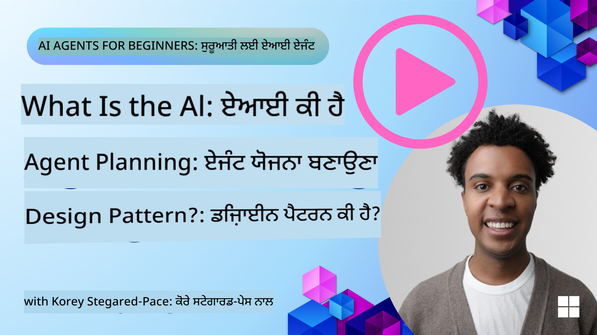
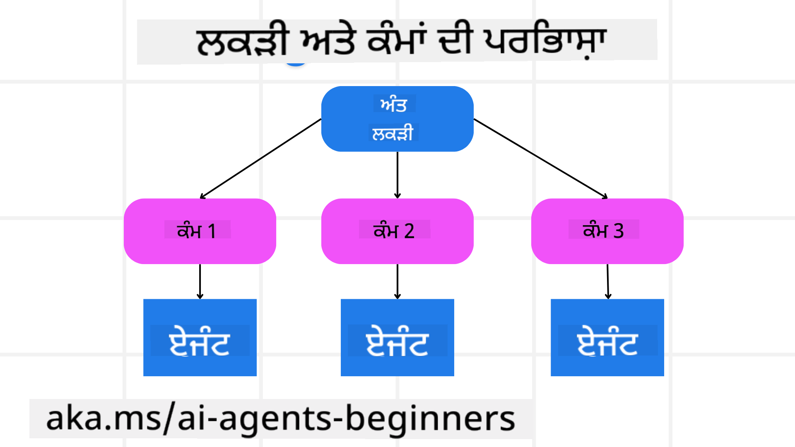

<!--
CO_OP_TRANSLATOR_METADATA:
{
  "original_hash": "a28d30590704ea13b6a08d4793cf9c2b",
  "translation_date": "2025-08-29T10:41:48+00:00",
  "source_file": "07-planning-design/README.md",
  "language_code": "pa"
}
-->
[](https://youtu.be/kPfJ2BrBCMY?si=9pYpPXp0sSbK91Dr)

> _(ਉਪਰ ਦਿੱਤੀ ਤਸਵੀਰ 'ਤੇ ਕਲਿੱਕ ਕਰਕੇ ਇਸ ਪਾਠ ਦਾ ਵੀਡੀਓ ਵੇਖੋ)_

# ਯੋਜਨਾ ਡਿਜ਼ਾਈਨ

## ਜਾਣ ਪਛਾਣ

ਇਸ ਪਾਠ ਵਿੱਚ ਕਵਰ ਕੀਤਾ ਜਾਵੇਗਾ:

* ਇੱਕ ਸਪਸ਼ਟ ਸਮੁੱਚੇ ਲਕਸ਼ ਨੂੰ ਪਰਿਭਾਸ਼ਿਤ ਕਰਨਾ ਅਤੇ ਇੱਕ ਜਟਿਲ ਕੰਮ ਨੂੰ ਸੰਭਾਲਣ ਯੋਗ ਕੰਮਾਂ ਵਿੱਚ ਵੰਡਣਾ।
* ਸੰਰਚਿਤ ਆਉਟਪੁੱਟ ਦੀ ਵਰਤੋਂ ਕਰਕੇ ਹੋਰ ਭਰੋਸੇਯੋਗ ਅਤੇ ਮਸ਼ੀਨ-ਪੜ੍ਹਨਯੋਗ ਜਵਾਬ ਪ੍ਰਾਪਤ ਕਰਨਾ।
* ਗਤੀਸ਼ੀਲ ਕੰਮਾਂ ਅਤੇ ਅਣਅਪੇक्षित ਇਨਪੁਟ ਨੂੰ ਸੰਭਾਲਣ ਲਈ ਇੱਕ ਇਵੈਂਟ-ਚਲਿਤ ਪਹੁੰਚ ਲਾਗੂ ਕਰਨਾ।

## ਸਿੱਖਣ ਦੇ ਲਕਸ਼

ਇਸ ਪਾਠ ਨੂੰ ਪੂਰਾ ਕਰਨ ਤੋਂ ਬਾਅਦ, ਤੁਸੀਂ ਸਮਝ ਪਾ ਲਵੋਗੇ:

* AI ਏਜੰਟ ਲਈ ਇੱਕ ਸਮੁੱਚਾ ਲਕਸ਼ ਪਛਾਣਣਾ ਅਤੇ ਸੈੱਟ ਕਰਨਾ, ਇਹ ਯਕੀਨੀ ਬਣਾਉਣਾ ਕਿ ਇਸ ਨੂੰ ਸਪਸ਼ਟ ਪਤਾ ਹੈ ਕਿ ਕੀ ਹਾਸਲ ਕਰਨਾ ਹੈ।
* ਇੱਕ ਜਟਿਲ ਕੰਮ ਨੂੰ ਸੰਭਾਲਣ ਯੋਗ ਉਪ-ਕੰਮਾਂ ਵਿੱਚ ਵੰਡਣਾ ਅਤੇ ਉਨ੍ਹਾਂ ਨੂੰ ਇੱਕ ਤਰਕਸੰਗਤ ਕ੍ਰਮ ਵਿੱਚ ਸੰਗਠਿਤ ਕਰਨਾ।
* ਏਜੰਟਾਂ ਨੂੰ ਸਹੀ ਟੂਲ (ਜਿਵੇਂ ਕਿ ਖੋਜ ਟੂਲ ਜਾਂ ਡਾਟਾ ਵਿਸ਼ਲੇਸ਼ਣ ਟੂਲ) ਨਾਲ ਸਜਾਉਣਾ, ਇਹ ਫੈਸਲਾ ਕਰਨਾ ਕਿ ਕਦੋਂ ਅਤੇ ਕਿਵੇਂ ਉਨ੍ਹਾਂ ਦੀ ਵਰਤੋਂ ਕੀਤੀ ਜਾਵੇ, ਅਤੇ ਉੱਪਜਣ ਵਾਲੀਆਂ ਅਣਅਪੇक्षित ਸਥਿਤੀਆਂ ਨੂੰ ਸੰਭਾਲਣਾ।
* ਉਪ-ਕੰਮ ਦੇ ਨਤੀਜਿਆਂ ਦਾ ਮੁਲਾਂਕਨ ਕਰਨਾ, ਪ੍ਰਦਰਸ਼ਨ ਨੂੰ ਮਾਪਣਾ, ਅਤੇ ਅੰਤਮ ਨਤੀਜੇ ਨੂੰ ਸੁਧਾਰਨ ਲਈ ਕਾਰਵਾਈਆਂ 'ਤੇ ਦੁਬਾਰਾ ਵਿਚਾਰ ਕਰਨਾ।

## ਸਮੁੱਚੇ ਲਕਸ਼ ਨੂੰ ਪਰਿਭਾਸ਼ਿਤ ਕਰਨਾ ਅਤੇ ਕੰਮ ਨੂੰ ਵੰਡਣਾ



ਅਧਿਕਤਰ ਹਕੀਕਤੀ ਦੁਨੀਆ ਦੇ ਕੰਮ ਇੱਕ ਹੀ ਕਦਮ ਵਿੱਚ ਹੱਲ ਕਰਨ ਲਈ ਬਹੁਤ ਜਟਿਲ ਹੁੰਦੇ ਹਨ। ਇੱਕ AI ਏਜੰਟ ਨੂੰ ਆਪਣੀ ਯੋਜਨਾ ਅਤੇ ਕਾਰਵਾਈਆਂ ਨੂੰ ਮਾਰਗਦਰਸ਼ਨ ਦੇਣ ਲਈ ਇੱਕ ਸੰਖੇਪ ਉਦੇਸ਼ ਦੀ ਲੋੜ ਹੁੰਦੀ ਹੈ। ਉਦਾਹਰਣ ਲਈ, ਲਕਸ਼ ਨੂੰ ਧਿਆਨ ਵਿੱਚ ਰੱਖੋ:

    "3 ਦਿਨ ਦੀ ਯਾਤਰਾ ਦੀ ਯੋਜਨਾ ਬਣਾਓ।"

ਜਦੋਂ ਕਿ ਇਹ ਕਹਿਣਾ ਸਧਾਰਨ ਹੈ, ਇਸ ਨੂੰ ਫਿਰ ਵੀ ਸੁਧਾਰ ਦੀ ਲੋੜ ਹੈ। ਜਿੰਨਾ ਸਪਸ਼ਟ ਲਕਸ਼ ਹੋਵੇਗਾ, ਉਨਾ ਹੀ ਚੰਗਾ ਏਜੰਟ (ਅਤੇ ਕੋਈ ਵੀ ਮਨੁੱਖੀ ਸਹਿਯੋਗੀ) ਸਹੀ ਨਤੀਜੇ ਨੂੰ ਹਾਸਲ ਕਰਨ 'ਤੇ ਧਿਆਨ ਕੇਂਦਰਿਤ ਕਰ ਸਕਦੇ ਹਨ, ਜਿਵੇਂ ਕਿ ਉਡਾਨ ਦੇ ਵਿਕਲਪਾਂ, ਹੋਟਲ ਦੀ ਸਿਫਾਰਸ਼ਾਂ, ਅਤੇ ਗਤੀਵਿਧੀਆਂ ਦੇ ਸੁਝਾਅ ਦੇ ਨਾਲ ਇੱਕ ਵਿਸਤ੍ਰਿਤ ਯੋਜਨਾ ਬਣਾਉਣਾ।

### ਕੰਮ ਵੰਡਣ ਦੀ ਪ੍ਰਕਿਰਿਆ

ਵੱਡੇ ਜਾਂ ਜਟਿਲ ਕੰਮ ਛੋਟੇ, ਲਕਸ਼-ਕੇਂਦਰਿਤ ਉਪ-ਕੰਮਾਂ ਵਿੱਚ ਵੰਡਣ 'ਤੇ ਹੋਰ ਸੰਭਾਲਣ ਯੋਗ ਬਣ ਜਾਂਦੇ ਹਨ।  
ਯਾਤਰਾ ਦੀ ਯੋਜਨਾ ਦੇ ਉਦਾਹਰਣ ਲਈ, ਤੁਸੀਂ ਲਕਸ਼ ਨੂੰ ਇਸ ਤਰ੍ਹਾਂ ਵੰਡ ਸਕਦੇ ਹੋ:

* ਉਡਾਨ ਬੁੱਕਿੰਗ  
* ਹੋਟਲ ਬੁੱਕਿੰਗ  
* ਕਾਰ ਕਿਰਾਏ 'ਤੇ ਲੈਣਾ  
* ਨਿੱਜੀਕਰਨ  

ਹਰ ਉਪ-ਕੰਮ ਨੂੰ ਫਿਰ ਸਮਰਪਿਤ ਏਜੰਟਾਂ ਜਾਂ ਪ੍ਰਕਿਰਿਆਵਾਂ ਦੁਆਰਾ ਹੱਲ ਕੀਤਾ ਜਾ ਸਕਦਾ ਹੈ। ਇੱਕ ਏਜੰਟ ਸਭ ਤੋਂ ਵਧੀਆ ਉਡਾਨ ਦੇ سودੇ ਖੋਜਣ ਵਿੱਚ ਮਾਹਰ ਹੋ ਸਕਦਾ ਹੈ, ਦੂਜਾ ਹੋਟਲ ਬੁੱਕਿੰਗ 'ਤੇ ਧਿਆਨ ਕੇਂਦਰਿਤ ਕਰ ਸਕਦਾ ਹੈ, ਆਦਿ। ਇੱਕ ਸਹਿ-ਸੰਯੋਜਕ ਜਾਂ "ਡਾਊਨਸਟ੍ਰੀਮ" ਏਜੰਟ ਫਿਰ ਇਹ ਨਤੀਜੇ ਇੱਕ ਸੰਗਠਿਤ ਯੋਜਨਾ ਵਿੱਚ ਇਕੱਠੇ ਕਰ ਸਕਦਾ ਹੈ ਜੋ ਅੰਤਮ ਉਪਭੋਗਤਾ ਨੂੰ ਦਿੱਤੀ ਜਾਵੇ।  

ਇਹ ਮੋਡਿਊਲਰ ਪਹੁੰਚ ਤਰੱਕੀਸ਼ੀਲ ਸੁਧਾਰਾਂ ਦੀ ਵੀ ਆਗਿਆ ਦਿੰਦੀ ਹੈ। ਉਦਾਹਰਣ ਲਈ, ਤੁਸੀਂ ਖਾਣੇ ਦੀ ਸਿਫਾਰਸ਼ਾਂ ਜਾਂ ਸਥਾਨਕ ਗਤੀਵਿਧੀ ਸੁਝਾਅ ਲਈ ਵਿਸ਼ੇਸ਼ ਏਜੰਟ ਸ਼ਾਮਲ ਕਰ ਸਕਦੇ ਹੋ ਅਤੇ ਸਮੇਂ ਦੇ ਨਾਲ ਯੋਜਨਾ ਨੂੰ ਸੁਧਾਰ ਸਕਦੇ ਹੋ।

### ਸੰਰਚਿਤ ਆਉਟਪੁੱਟ

ਵੱਡੇ ਭਾਸ਼ਾ ਮਾਡਲ (LLMs) ਸੰਰਚਿਤ ਆਉਟਪੁੱਟ (ਜਿਵੇਂ JSON) ਤਿਆਰ ਕਰ ਸਕਦੇ ਹਨ ਜੋ ਡਾਊਨਸਟ੍ਰੀਮ ਏਜੰਟਾਂ ਜਾਂ ਸੇਵਾਵਾਂ ਲਈ ਪਾਰਸ ਅਤੇ ਪ੍ਰਕਿਰਿਆ ਕਰਨ ਲਈ ਆਸਾਨ ਹੁੰਦਾ ਹੈ। ਇਹ ਖਾਸ ਤੌਰ 'ਤੇ ਇੱਕ ਬਹੁ-ਏਜੰਟ ਸੰਦਰਭ ਵਿੱਚ ਲਾਭਦਾਇਕ ਹੈ, ਜਿੱਥੇ ਅਸੀਂ ਯੋਜਨਾ ਦੇ ਆਉਟਪੁੱਟ ਪ੍ਰਾਪਤ ਹੋਣ ਤੋਂ ਬਾਅਦ ਇਹ ਕੰਮ ਕਰ ਸਕਦੇ ਹਾਂ। ਇੱਕ ਝਲਕ ਲਈ, ਹੇਠਾਂ ਦਿੱਤੇ ਕੋਡ ਨੂੰ ਵੇਖੋ:

```python
from pydantic import BaseModel
from enum import Enum
from typing import List, Optional, Union
import json
import os
from typing import Optional
from pprint import pprint
from autogen_core.models import UserMessage, SystemMessage, AssistantMessage
from autogen_ext.models.azure import AzureAIChatCompletionClient
from azure.core.credentials import AzureKeyCredential

class AgentEnum(str, Enum):
    FlightBooking = "flight_booking"
    HotelBooking = "hotel_booking"
    CarRental = "car_rental"
    ActivitiesBooking = "activities_booking"
    DestinationInfo = "destination_info"
    DefaultAgent = "default_agent"
    GroupChatManager = "group_chat_manager"

# Travel SubTask Model
class TravelSubTask(BaseModel):
    task_details: str
    assigned_agent: AgentEnum  # we want to assign the task to the agent

class TravelPlan(BaseModel):
    main_task: str
    subtasks: List[TravelSubTask]
    is_greeting: bool

client = AzureAIChatCompletionClient(
    model="gpt-4o-mini",
    endpoint="https://models.inference.ai.azure.com",
    # To authenticate with the model you will need to generate a personal access token (PAT) in your GitHub settings.
    # Create your PAT token by following instructions here: https://docs.github.com/en/authentication/keeping-your-account-and-data-secure/managing-your-personal-access-tokens
    credential=AzureKeyCredential(os.environ["GITHUB_TOKEN"]),
    model_info={
        "json_output": False,
        "function_calling": True,
        "vision": True,
        "family": "unknown",
    },
)

# Define the user message
messages = [
    SystemMessage(content="""You are an planner agent.
    Your job is to decide which agents to run based on the user's request.
                      Provide your response in JSON format with the following structure:
{'main_task': 'Plan a family trip from Singapore to Melbourne.',
 'subtasks': [{'assigned_agent': 'flight_booking',
               'task_details': 'Book round-trip flights from Singapore to '
                               'Melbourne.'}
    Below are the available agents specialised in different tasks:
    - FlightBooking: For booking flights and providing flight information
    - HotelBooking: For booking hotels and providing hotel information
    - CarRental: For booking cars and providing car rental information
    - ActivitiesBooking: For booking activities and providing activity information
    - DestinationInfo: For providing information about destinations
    - DefaultAgent: For handling general requests""", source="system"),
    UserMessage(
        content="Create a travel plan for a family of 2 kids from Singapore to Melboune", source="user"),
]

response = await client.create(messages=messages, extra_create_args={"response_format": 'json_object'})

response_content: Optional[str] = response.content if isinstance(
    response.content, str) else None
if response_content is None:
    raise ValueError("Response content is not a valid JSON string" )

pprint(json.loads(response_content))

# # Ensure the response content is a valid JSON string before loading it
# response_content: Optional[str] = response.content if isinstance(
#     response.content, str) else None
# if response_content is None:
#     raise ValueError("Response content is not a valid JSON string")

# # Print the response content after loading it as JSON
# pprint(json.loads(response_content))

# Validate the response content with the MathReasoning model
# TravelPlan.model_validate(json.loads(response_content))
```

### ਬਹੁ-ਏਜੰਟ ਸਹਿ-ਸੰਯੋਜਨ ਨਾਲ ਯੋਜਨਾ ਬਣਾਉਣ ਵਾਲਾ ਏਜੰਟ

ਇਸ ਉਦਾਹਰਣ ਵਿੱਚ, ਇੱਕ ਸੈਮੈਂਟਿਕ ਰਾਊਟਰ ਏਜੰਟ ਉਪਭੋਗਤਾ ਦੀ ਬੇਨਤੀ ਪ੍ਰਾਪਤ ਕਰਦਾ ਹੈ (ਜਿਵੇਂ, "ਮੈਨੂੰ ਆਪਣੀ ਯਾਤਰਾ ਲਈ ਹੋਟਲ ਯੋਜਨਾ ਦੀ ਲੋੜ ਹੈ।")।

ਯੋਜਨਾਕਾਰ ਫਿਰ:

* ਹੋਟਲ ਯੋਜਨਾ ਪ੍ਰਾਪਤ ਕਰਦਾ ਹੈ: ਯੋਜਨਾਕਾਰ ਉਪਭੋਗਤਾ ਦਾ ਸੁਨੇਹਾ ਲੈਂਦਾ ਹੈ ਅਤੇ, ਸਿਸਟਮ ਪ੍ਰੋੰਪਟ (ਉਪਲਬਧ ਏਜੰਟ ਵੇਰਵੇ ਸਮੇਤ) ਦੇ ਆਧਾਰ 'ਤੇ, ਇੱਕ ਸੰਰਚਿਤ ਯਾਤਰਾ ਯੋਜਨਾ ਤਿਆਰ ਕਰਦਾ ਹੈ।  
* ਏਜੰਟਾਂ ਅਤੇ ਉਨ੍ਹਾਂ ਦੇ ਟੂਲਾਂ ਦੀ ਸੂਚੀ ਬਣਾਉਂਦਾ ਹੈ: ਏਜੰਟ ਰਜਿਸਟਰੀ ਵਿੱਚ ਏਜੰਟਾਂ ਦੀ ਸੂਚੀ (ਜਿਵੇਂ, ਉਡਾਨ, ਹੋਟਲ, ਕਾਰ ਕਿਰਾਏ 'ਤੇ ਲੈਣਾ, ਅਤੇ ਗਤੀਵਿਧੀਆਂ) ਅਤੇ ਉਹਨਾਂ ਦੇ ਫੰਕਸ਼ਨ ਜਾਂ ਟੂਲ ਸ਼ਾਮਲ ਹੁੰਦੇ ਹਨ।  
* ਯੋਜਨਾ ਨੂੰ ਸੰਬੰਧਿਤ ਏਜੰਟਾਂ ਨੂੰ ਭੇਜਦਾ ਹੈ: ਉਪ-ਕੰਮਾਂ ਦੀ ਗਿਣਤੀ ਦੇ ਆਧਾਰ 'ਤੇ, ਯੋਜਨਾਕਾਰ ਜਾਂ ਤਾਂ ਸੁਨੇਹਾ ਸਿੱਧੇ ਸਮਰਪਿਤ ਏਜੰਟ ਨੂੰ ਭੇਜਦਾ ਹੈ (ਇੱਕ-ਕੰਮ ਸਥਿਤੀਆਂ ਲਈ) ਜਾਂ ਬਹੁ-ਏਜੰਟ ਸਹਿ-ਸੰਵਾਦ ਲਈ ਗਰੁੱਪ ਚੈਟ ਮੈਨੇਜਰ ਦੁਆਰਾ ਸਹਿ-ਸੰਯੋਜਨ ਕਰਦਾ ਹੈ।  
* ਨਤੀਜੇ ਦਾ ਸਾਰ ਬਣਾਉਂਦਾ ਹੈ: ਅੰਤ ਵਿੱਚ, ਯੋਜਨਾਕਾਰ ਸਪਸ਼ਟਤਾ ਲਈ ਤਿਆਰ ਕੀਤੀ ਯੋਜਨਾ ਦਾ ਸਾਰ ਬਣਾਉਂਦਾ ਹੈ।  
ਹੇਠਾਂ ਦਿੱਤਾ ਪਾਈਥਨ ਕੋਡ ਸੈਂਪਲ ਇਹ ਕਦਮ ਦਰਸਾਉਂਦਾ ਹੈ:

```python

from pydantic import BaseModel

from enum import Enum
from typing import List, Optional, Union

class AgentEnum(str, Enum):
    FlightBooking = "flight_booking"
    HotelBooking = "hotel_booking"
    CarRental = "car_rental"
    ActivitiesBooking = "activities_booking"
    DestinationInfo = "destination_info"
    DefaultAgent = "default_agent"
    GroupChatManager = "group_chat_manager"

# Travel SubTask Model

class TravelSubTask(BaseModel):
    task_details: str
    assigned_agent: AgentEnum # we want to assign the task to the agent

class TravelPlan(BaseModel):
    main_task: str
    subtasks: List[TravelSubTask]
    is_greeting: bool
import json
import os
from typing import Optional

from autogen_core.models import UserMessage, SystemMessage, AssistantMessage
from autogen_ext.models.openai import AzureOpenAIChatCompletionClient

# Create the client with type-checked environment variables

client = AzureOpenAIChatCompletionClient(
    azure_deployment=os.getenv("AZURE_OPENAI_DEPLOYMENT_NAME"),
    model=os.getenv("AZURE_OPENAI_DEPLOYMENT_NAME"),
    api_version=os.getenv("AZURE_OPENAI_API_VERSION"),
    azure_endpoint=os.getenv("AZURE_OPENAI_ENDPOINT"),
    api_key=os.getenv("AZURE_OPENAI_API_KEY"),
)

from pprint import pprint

# Define the user message

messages = [
    SystemMessage(content="""You are an planner agent.
    Your job is to decide which agents to run based on the user's request.
    Below are the available agents specialized in different tasks:
    - FlightBooking: For booking flights and providing flight information
    - HotelBooking: For booking hotels and providing hotel information
    - CarRental: For booking cars and providing car rental information
    - ActivitiesBooking: For booking activities and providing activity information
    - DestinationInfo: For providing information about destinations
    - DefaultAgent: For handling general requests""", source="system"),
    UserMessage(content="Create a travel plan for a family of 2 kids from Singapore to Melbourne", source="user"),
]

response = await client.create(messages=messages, extra_create_args={"response_format": TravelPlan})

# Ensure the response content is a valid JSON string before loading it

response_content: Optional[str] = response.content if isinstance(response.content, str) else None
if response_content is None:
    raise ValueError("Response content is not a valid JSON string")

# Print the response content after loading it as JSON

pprint(json.loads(response_content))
```

ਪਿਛਲੇ ਕੋਡ ਤੋਂ ਨਤੀਜਾ ਹੇਠਾਂ ਦਿੱਤਾ ਗਿਆ ਹੈ ਅਤੇ ਤੁਸੀਂ ਇਸ ਸੰਰਚਿਤ ਆਉਟਪੁੱਟ ਨੂੰ `assigned_agent` ਨੂੰ ਰੂਟ ਕਰਨ ਅਤੇ ਯਾਤਰਾ ਯੋਜਨਾ ਨੂੰ ਅੰਤਮ ਉਪਭੋਗਤਾ ਲਈ ਸਾਰ ਬਣਾਉਣ ਲਈ ਵਰਤ ਸਕਦੇ ਹੋ।

```json
{
    "is_greeting": "False",
    "main_task": "Plan a family trip from Singapore to Melbourne.",
    "subtasks": [
        {
            "assigned_agent": "flight_booking",
            "task_details": "Book round-trip flights from Singapore to Melbourne."
        },
        {
            "assigned_agent": "hotel_booking",
            "task_details": "Find family-friendly hotels in Melbourne."
        },
        {
            "assigned_agent": "car_rental",
            "task_details": "Arrange a car rental suitable for a family of four in Melbourne."
        },
        {
            "assigned_agent": "activities_booking",
            "task_details": "List family-friendly activities in Melbourne."
        },
        {
            "assigned_agent": "destination_info",
            "task_details": "Provide information about Melbourne as a travel destination."
        }
    ]
}
```

ਪਿਛਲੇ ਕੋਡ ਸੈਂਪਲ ਦੇ ਨਾਲ ਇੱਕ ਉਦਾਹਰਣ ਨੋਟਬੁੱਕ [ਇੱਥੇ](07-autogen.ipynb) ਉਪਲਬਧ ਹੈ।

### ਦੁਹਰਾਈ ਯੋਜਨਾ

ਕੁਝ ਕੰਮਾਂ ਨੂੰ ਵਾਪਸ-ਅੱਗੇ ਜਾਂ ਦੁਬਾਰਾ ਯੋਜਨਾ ਬਣਾਉਣ ਦੀ ਲੋੜ ਹੁੰਦੀ ਹੈ, ਜਿੱਥੇ ਇੱਕ ਉਪ-ਕੰਮ ਦਾ ਨਤੀਜਾ ਅਗਲੇ 'ਤੇ ਪ੍ਰਭਾਵ ਪਾਉਂਦਾ ਹੈ। ਉਦਾਹਰਣ ਲਈ, ਜੇ ਏਜੰਟ ਉਡਾਨਾਂ ਦੀ ਬੁੱਕਿੰਗ ਦੌਰਾਨ ਇੱਕ ਅਣਅਪੇक्षित ਡਾਟਾ ਫਾਰਮੈਟ ਦੀ ਖੋਜ ਕਰਦਾ ਹੈ, ਤਾਂ ਇਹ ਹੋਟਲ ਬੁੱਕਿੰਗ 'ਤੇ ਅੱਗੇ ਵਧਣ ਤੋਂ ਪਹਿਲਾਂ ਆਪਣੀ ਰਣਨੀਤੀ ਨੂੰ ਅਨੁਕੂਲ ਬਣਾਉਣ ਦੀ ਲੋੜ ਹੋ ਸਕਦੀ ਹੈ।

ਇਸ ਤੋਂ ਇਲਾਵਾ, ਉਪਭੋਗਤਾ ਫੀਡਬੈਕ (ਜਿਵੇਂ, ਇੱਕ ਮਨੁੱਖ ਫੈਸਲਾ ਕਰਦਾ ਹੈ ਕਿ ਉਹ ਪਹਿਲੀ ਉਡਾਨ ਨੂੰ ਤਰਜੀਹ ਦਿੰਦੇ ਹਨ) ਇੱਕ ਅੰਸ਼ਿਕ ਦੁਬਾਰਾ ਯੋਜਨਾ ਨੂੰ ਸ਼ੁਰੂ ਕਰ ਸਕਦਾ ਹੈ। ਇਹ ਗਤੀਸ਼ੀਲ, ਦੁਹਰਾਈ ਪਹੁੰਚ ਇਹ ਯਕੀਨੀ ਬਣਾਉਂਦੀ ਹੈ ਕਿ ਅੰਤਮ ਹੱਲ ਹਕੀਕਤੀ ਦੁਨੀਆ ਦੇ ਰੁਕਾਵਟਾਂ ਅਤੇ ਵਿਕਸਿਤ ਉਪਭੋਗਤਾ ਦੀਆਂ ਪਸੰਦਾਂ ਨਾਲ ਸੰਗਤ ਹੈ।

ਉਦਾਹਰਣ ਲਈ ਕੋਡ:

```python
from autogen_core.models import UserMessage, SystemMessage, AssistantMessage
#.. same as previous code and pass on the user history, current plan
messages = [
    SystemMessage(content="""You are a planner agent to optimize the
    Your job is to decide which agents to run based on the user's request.
    Below are the available agents specialized in different tasks:
    - FlightBooking: For booking flights and providing flight information
    - HotelBooking: For booking hotels and providing hotel information
    - CarRental: For booking cars and providing car rental information
    - ActivitiesBooking: For booking activities and providing activity information
    - DestinationInfo: For providing information about destinations
    - DefaultAgent: For handling general requests""", source="system"),
    UserMessage(content="Create a travel plan for a family of 2 kids from Singapore to Melbourne", source="user"),
    AssistantMessage(content=f"Previous travel plan - {TravelPlan}", source="assistant")
]
# .. re-plan and send the tasks to respective agents
```

ਵਧੇਰੇ ਵਿਸਤ੍ਰਿਤ ਯੋਜਨਾ ਲਈ Magnetic One ਦੀ ਜਾਂਚ ਕਰੋ।

## ਸਾਰ

ਇਸ ਲੇਖ ਵਿੱਚ ਅਸੀਂ ਇੱਕ ਉਦਾਹਰਣ ਦੇਖਿਆ ਕਿ ਕਿਵੇਂ ਅਸੀਂ ਇੱਕ ਯੋਜਨਾਕਾਰ ਬਣਾਉਣ ਲਈ ਯੋਜਨਾ ਤਿਆਰ ਕਰ ਸਕਦੇ ਹਾਂ ਜੋ ਉਪਲਬਧ ਏਜੰਟਾਂ ਨੂੰ ਪਰਿਭਾਸ਼ਿਤ ਕਰਕੇ ਗਤੀਸ਼ੀਲ ਤੌਰ 'ਤੇ ਚੁਣਦਾ ਹੈ। ਯੋਜਨਾਕਾਰ ਦਾ ਆਉਟਪੁੱਟ ਕੰਮਾਂ ਨੂੰ ਵੰਡਦਾ ਹੈ ਅਤੇ ਏਜੰਟਾਂ ਨੂੰ ਅਸਾਈਨ ਕਰਦਾ ਹੈ ਤਾਂ ਜੋ ਉਹ ਕਾਰਜਨਵਿਤ ਹੋ ਸਕਣ। ਇਹ ਮੰਨਿਆ ਜਾਂਦਾ ਹੈ ਕਿ ਏਜੰਟਾਂ ਕੋਲ ਉਹ ਫੰਕਸ਼ਨ/ਟੂਲਾਂ ਦੀ ਪਹੁੰਚ ਹੈ ਜੋ ਕੰਮ ਕਰਨ ਲਈ ਲੋੜੀਂਦੇ ਹਨ। ਏਜੰਟਾਂ ਦੇ ਇਲਾਵਾ ਤੁਸੀਂ ਹੋਰ ਪੈਟਰਨ ਸ਼ਾਮਲ ਕਰ ਸਕਦੇ ਹੋ ਜਿਵੇਂ ਕਿ ਰਿਫਲੈਕਸ਼ਨ, ਸਾਰ ਬਣਾਉਣ ਵਾਲਾ, ਅਤੇ ਰਾਊਂਡ ਰੋਬਿਨ ਚੈਟ ਨੂੰ ਹੋਰ ਕਸਟਮਾਈਜ਼ ਕਰਨ ਲਈ।

## ਵਾਧੂ ਸਰੋਤ

* AutoGen Magnetic One - ਇੱਕ ਜਨਰਲਿਸਟ ਬਹੁ-ਏਜੰਟ ਸਿਸਟਮ ਜੋ ਜਟਿਲ ਕੰਮਾਂ ਨੂੰ ਹੱਲ ਕਰਨ ਲਈ ਹੈ ਅਤੇ ਕਈ ਚੁਣੌਤੀਪੂਰਨ ਏਜੰਟਿਕ ਬੈਂਚਮਾਰਕਾਂ 'ਤੇ ਸ਼ਾਨਦਾਰ ਨਤੀਜੇ ਪ੍ਰਾਪਤ ਕੀਤੇ ਹਨ। ਹਵਾਲਾ:  
. ਇਸ ਲਾਗੂ ਕਰਨ ਵਿੱਚ, ਸਹਿ-ਸੰਯੋਜਕ ਟਾਸਕ-ਵਿਸ਼ੇਸ਼ ਯੋਜਨਾ ਬਣਾਉਂਦਾ ਹੈ ਅਤੇ ਉਪਲਬਧ ਏਜੰਟਾਂ ਨੂੰ ਇਹ ਕੰਮ ਸੌਂਪਦਾ ਹੈ। ਯੋਜਨਾ ਬਣਾਉਣ ਦੇ ਇਲਾਵਾ, ਸਹਿ-ਸੰਯੋਜਕ ਇੱਕ ਟ੍ਰੈਕਿੰਗ ਮਕੈਨਿਜ਼ਮ ਦੀ ਵੀ ਵਰਤੋਂ ਕਰਦਾ ਹੈ ਜੋ ਕੰਮ ਦੀ ਪ੍ਰਗਤੀ ਦੀ ਨਿਗਰਾਨੀ ਕਰਦਾ ਹੈ ਅਤੇ ਜਰੂਰਤ ਪੈਣ 'ਤੇ ਦੁਬਾਰਾ ਯੋਜਨਾ ਬਣਾਉਂਦਾ ਹੈ।

### ਯੋਜਨਾ ਡਿਜ਼ਾਈਨ ਪੈਟਰਨ ਬਾਰੇ ਹੋਰ ਸਵਾਲ ਹਨ?

[Azure AI Foundry Discord](https://aka.ms/ai-agents/discord) ਵਿੱਚ ਸ਼ਾਮਲ ਹੋਵੋ ਤਾਂ ਜੋ ਹੋਰ ਸਿੱਖਣ ਵਾਲਿਆਂ ਨਾਲ ਮਿਲ ਸਕੋ, ਦਫ਼ਤਰ ਦੇ ਘੰਟਿਆਂ ਵਿੱਚ ਸ਼ਿਰਕਤ ਕਰ ਸਕੋ ਅਤੇ ਆਪਣੇ AI Agents ਦੇ ਸਵਾਲਾਂ ਦੇ ਜਵਾਬ ਪ੍ਰਾਪਤ ਕਰ ਸਕੋ।

## ਪਿਛਲਾ ਪਾਠ

[ਭਰੋਸੇਯੋਗ AI ਏਜੰਟ ਬਣਾਉਣਾ](../06-building-trustworthy-agents/README.md)

## ਅਗਲਾ ਪਾਠ

[ਬਹੁ-ਏਜੰਟ ਡਿਜ਼ਾਈਨ ਪੈਟਰਨ](../08-multi-agent/README.md)

---

**ਅਸਵੀਕਰਤੀ**:  
ਇਹ ਦਸਤਾਵੇਜ਼ AI ਅਨੁਵਾਦ ਸੇਵਾ [Co-op Translator](https://github.com/Azure/co-op-translator) ਦੀ ਵਰਤੋਂ ਕਰਕੇ ਅਨੁਵਾਦ ਕੀਤਾ ਗਿਆ ਹੈ। ਜਦੋਂ ਕਿ ਅਸੀਂ ਸਹੀ ਹੋਣ ਦਾ ਯਤਨ ਕਰਦੇ ਹਾਂ, ਕਿਰਪਾ ਕਰਕੇ ਧਿਆਨ ਦਿਓ ਕਿ ਸਵੈਚਾਲਿਤ ਅਨੁਵਾਦਾਂ ਵਿੱਚ ਗਲਤੀਆਂ ਜਾਂ ਅਸੁੱਤੀਆਂ ਹੋ ਸਕਦੀਆਂ ਹਨ। ਇਸ ਦੀ ਮੂਲ ਭਾਸ਼ਾ ਵਿੱਚ ਮੌਜੂਦ ਮੂਲ ਦਸਤਾਵੇਜ਼ ਨੂੰ ਪ੍ਰਮਾਣਿਕ ਸਰੋਤ ਮੰਨਿਆ ਜਾਣਾ ਚਾਹੀਦਾ ਹੈ। ਮਹੱਤਵਪੂਰਨ ਜਾਣਕਾਰੀ ਲਈ, ਪੇਸ਼ੇਵਰ ਮਨੁੱਖੀ ਅਨੁਵਾਦ ਦੀ ਸਿਫਾਰਸ਼ ਕੀਤੀ ਜਾਂਦੀ ਹੈ। ਇਸ ਅਨੁਵਾਦ ਦੀ ਵਰਤੋਂ ਤੋਂ ਪੈਦਾ ਹੋਣ ਵਾਲੇ ਕਿਸੇ ਵੀ ਗਲਤਫਹਿਮੀ ਜਾਂ ਗਲਤ ਵਿਆਖਿਆ ਲਈ ਅਸੀਂ ਜ਼ਿੰਮੇਵਾਰ ਨਹੀਂ ਹਾਂ।