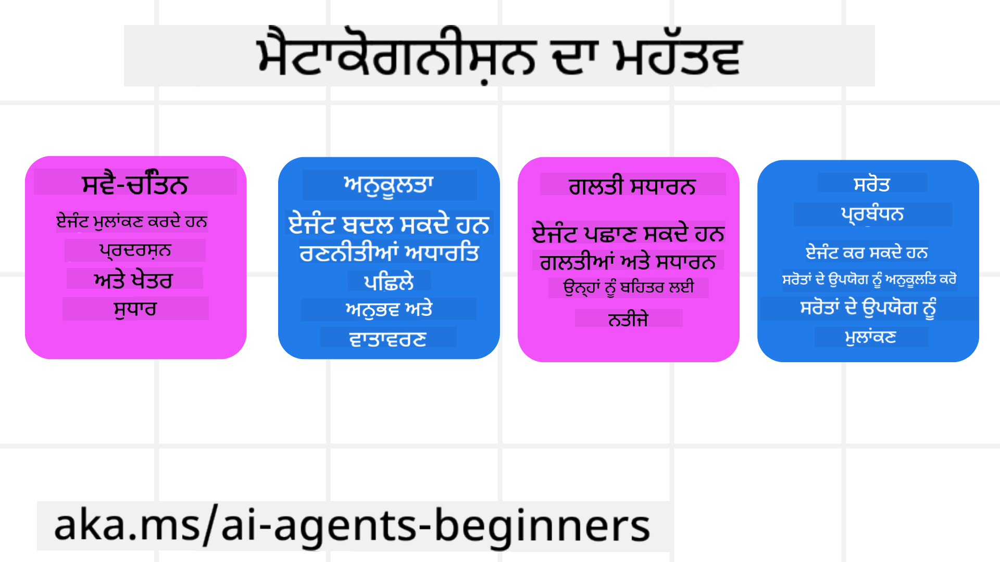

<!--
CO_OP_TRANSLATOR_METADATA:
{
  "original_hash": "8cbf460468c802c7994aa62e0e0779c9",
  "translation_date": "2025-07-12T12:23:12+00:00",
  "source_file": "09-metacognition/README.md",
  "language_code": "pa"
}
-->
[](https://youtu.be/His9R6gw6Ec?si=3_RMb8VprNvdLRhX)

> _(ਇਸ ਪਾਠ ਦਾ ਵੀਡੀਓ ਦੇਖਣ ਲਈ ਉਪਰ ਦਿੱਤੀ ਤਸਵੀਰ 'ਤੇ ਕਲਿੱਕ ਕਰੋ)_
# AI ਏਜੰਟਾਂ ਵਿੱਚ ਮੈਟਾਕੋਗਨੀਸ਼ਨ

## ਪਰਿਚਯ

AI ਏਜੰਟਾਂ ਵਿੱਚ ਮੈਟਾਕੋਗਨੀਸ਼ਨ ਬਾਰੇ ਪਾਠ ਵਿੱਚ ਤੁਹਾਡਾ ਸਵਾਗਤ ਹੈ! ਇਹ ਅਧਿਆਇ ਉਹਨਾਂ ਸ਼ੁਰੂਆਤੀ ਲੋਕਾਂ ਲਈ ਬਣਾਇਆ ਗਿਆ ਹੈ ਜੋ ਜਾਣਨਾ ਚਾਹੁੰਦੇ ਹਨ ਕਿ AI ਏਜੰਟ ਆਪਣੇ ਸੋਚਣ ਦੇ ਤਰੀਕਿਆਂ ਬਾਰੇ ਕਿਵੇਂ ਸੋਚ ਸਕਦੇ ਹਨ। ਇਸ ਪਾਠ ਦੇ ਅੰਤ ਤੱਕ, ਤੁਸੀਂ ਮੁੱਖ ਧਾਰਣਾਵਾਂ ਨੂੰ ਸਮਝ ਜਾਵੋਗੇ ਅਤੇ ਮੈਟਾਕੋਗਨੀਸ਼ਨ ਨੂੰ AI ਏਜੰਟ ਡਿਜ਼ਾਈਨ ਵਿੱਚ ਲਾਗੂ ਕਰਨ ਲਈ ਪ੍ਰਯੋਗਿਕ ਉਦਾਹਰਣਾਂ ਨਾਲ ਸਜਜਿਤ ਹੋਵੋਗੇ।

## ਸਿੱਖਣ ਦੇ ਲਕੜ

ਇਸ ਪਾਠ ਨੂੰ ਪੂਰਾ ਕਰਨ ਤੋਂ ਬਾਅਦ, ਤੁਸੀਂ ਸਮਰੱਥ ਹੋਵੋਗੇ:

1. ਏਜੰਟ ਪਰਿਭਾਸ਼ਾਵਾਂ ਵਿੱਚ ਤਰਕ ਲੂਪਾਂ ਦੇ ਪ੍ਰਭਾਵਾਂ ਨੂੰ ਸਮਝਣ ਲਈ।
2. ਯੋਜਨਾ ਬਣਾਉਣ ਅਤੇ ਮੁਲਾਂਕਣ ਤਕਨੀਕਾਂ ਦੀ ਵਰਤੋਂ ਕਰਕੇ ਖੁਦ-ਸੁਧਾਰਕ ਏਜੰਟਾਂ ਦੀ ਮਦਦ ਕਰਨ ਲਈ।
3. ਆਪਣੇ ਖੁਦ ਦੇ ਏਜੰਟ ਬਣਾਉਣ ਜੋ ਕੰਮ ਪੂਰੇ ਕਰਨ ਲਈ ਕੋਡ ਨੂੰ ਸੰਭਾਲ ਸਕਦੇ ਹਨ।

## ਮੈਟਾਕੋਗਨੀਸ਼ਨ ਦਾ ਪਰਿਚਯ

ਮੈਟਾਕੋਗਨੀਸ਼ਨ ਉਹ ਉੱਚ-ਕ੍ਰਮ ਦੀ ਸੋਚਣ ਦੀ ਪ੍ਰਕਿਰਿਆ ਹੈ ਜਿਸ ਵਿੱਚ ਕੋਈ ਆਪਣੀ ਸੋਚ ਬਾਰੇ ਸੋਚਦਾ ਹੈ। AI ਏਜੰਟਾਂ ਲਈ, ਇਸਦਾ ਮਤਲਬ ਹੈ ਕਿ ਉਹ ਆਪਣੇ ਕਾਰਜਾਂ ਦਾ ਮੁਲਾਂਕਣ ਅਤੇ ਸੁਧਾਰ ਕਰ ਸਕਦੇ ਹਨ ਆਪਣੇ ਆਪ ਦੀ ਜਾਣਕਾਰੀ ਅਤੇ ਪਿਛਲੇ ਤਜਰਬਿਆਂ ਦੇ ਆਧਾਰ 'ਤੇ। ਮੈਟਾਕੋਗਨੀਸ਼ਨ, ਜਾਂ "ਸੋਚ ਬਾਰੇ ਸੋਚ," ਏਜੰਟਿਕ AI ਸਿਸਟਮਾਂ ਦੇ ਵਿਕਾਸ ਵਿੱਚ ਇੱਕ ਮਹੱਤਵਪੂਰਨ ਧਾਰਣਾ ਹੈ। ਇਹ AI ਸਿਸਟਮਾਂ ਨੂੰ ਆਪਣੇ ਅੰਦਰੂਨੀ ਪ੍ਰਕਿਰਿਆਵਾਂ ਦੀ ਜਾਣਕਾਰੀ ਰੱਖਣ ਅਤੇ ਆਪਣੇ ਵਿਹਾਰ ਨੂੰ ਨਿਗਰਾਨੀ, ਨਿਯੰਤਰਣ ਅਤੇ ਅਨੁਕੂਲਿਤ ਕਰਨ ਯੋਗ ਬਣਾਉਂਦਾ ਹੈ। ਬਿਲਕੁਲ ਉਸੇ ਤਰ੍ਹਾਂ ਜਿਵੇਂ ਅਸੀਂ ਕਮਰੇ ਦੀ ਸਥਿਤੀ ਜਾਂ ਕਿਸੇ ਸਮੱਸਿਆ ਨੂੰ ਵੇਖਦੇ ਹਾਂ। ਇਹ ਖੁਦ-ਜਾਣਕਾਰੀ AI ਸਿਸਟਮਾਂ ਨੂੰ ਬਿਹਤਰ ਫੈਸਲੇ ਕਰਨ, ਗਲਤੀਆਂ ਪਛਾਣਨ ਅਤੇ ਸਮੇਂ ਦੇ ਨਾਲ ਆਪਣੀ ਕਾਰਗੁਜ਼ਾਰੀ ਸੁਧਾਰਨ ਵਿੱਚ ਮਦਦ ਕਰਦੀ ਹੈ - ਜੋ ਟਿਊਰਿੰਗ ਟੈਸਟ ਅਤੇ AI ਦੇ ਕਬਜ਼ੇ ਬਾਰੇ ਚਰਚਾ ਨਾਲ ਵੀ ਜੁੜੀ ਹੈ।

ਏਜੰਟਿਕ AI ਸਿਸਟਮਾਂ ਦੇ ਸੰਦਰਭ ਵਿੱਚ, ਮੈਟਾਕੋਗਨੀਸ਼ਨ ਕਈ ਚੁਣੌਤੀਆਂ ਨੂੰ ਹੱਲ ਕਰਨ ਵਿੱਚ ਮਦਦ ਕਰ ਸਕਦੀ ਹੈ, ਜਿਵੇਂ ਕਿ:
- Transparency: ਇਹ ਯਕੀਨੀ ਬਣਾਉਣਾ ਕਿ AI ਸਿਸਟਮ ਆਪਣੀ ਤਰਕ ਅਤੇ ਫੈਸਲਿਆਂ ਨੂੰ ਸਮਝਾ ਸਕਦੇ ਹਨ।
- Reasoning: AI ਸਿਸਟਮਾਂ ਦੀ ਜਾਣਕਾਰੀ ਸੰਯੋਜਨ ਅਤੇ ਸਹੀ ਫੈਸਲੇ ਕਰਨ ਦੀ ਸਮਰੱਥਾ ਨੂੰ ਵਧਾਉਣਾ।
- Adaptation: AI ਸਿਸਟਮਾਂ ਨੂੰ ਨਵੇਂ ਮਾਹੌਲ ਅਤੇ ਬਦਲਦੇ ਹਾਲਾਤਾਂ ਅਨੁਸਾਰ ਅਨੁਕੂਲਿਤ ਕਰਨ ਦੀ ਆਗਿਆ ਦੇਣਾ।
- Perception: AI ਸਿਸਟਮਾਂ ਦੀ ਸਹੀ ਤਰੀਕੇ ਨਾਲ ਆਪਣੇ ਆਲੇ-ਦੁਆਲੇ ਦੇ ਡੇਟਾ ਨੂੰ ਪਛਾਣਨ ਅਤੇ ਵਿਆਖਿਆ ਕਰਨ ਦੀ ਸਮਰੱਥਾ ਨੂੰ ਸੁਧਾਰਨਾ।

### ਮੈਟਾਕੋਗਨੀਸ਼ਨ ਕੀ ਹੈ?

ਮੈਟਾਕੋਗਨੀਸ਼ਨ, ਜਾਂ "ਸੋਚ ਬਾਰੇ ਸੋਚ," ਇੱਕ ਉੱਚ-ਕ੍ਰਮ ਦੀ ਸੋਚਣ ਦੀ ਪ੍ਰਕਿਰਿਆ ਹੈ ਜਿਸ ਵਿੱਚ ਖੁਦ-ਜਾਣਕਾਰੀ ਅਤੇ ਆਪਣੇ ਸੋਚਣ ਵਾਲੇ ਪ੍ਰਕਿਰਿਆਵਾਂ ਦਾ ਨਿਯੰਤਰਣ ਸ਼ਾਮਲ ਹੁੰਦਾ ਹੈ। AI ਦੇ ਖੇਤਰ ਵਿੱਚ, ਮੈਟਾਕੋਗਨੀਸ਼ਨ ਏਜੰਟਾਂ ਨੂੰ ਆਪਣੀਆਂ ਰਣਨੀਤੀਆਂ ਅਤੇ ਕਾਰਵਾਈਆਂ ਦਾ ਮੁਲਾਂਕਣ ਅਤੇ ਅਨੁਕੂਲਿਤ ਕਰਨ ਦੀ ਸਮਰੱਥਾ ਦਿੰਦਾ ਹੈ, ਜਿਸ ਨਾਲ ਸਮੱਸਿਆ ਹੱਲ ਕਰਨ ਅਤੇ ਫੈਸਲਾ ਕਰਨ ਦੀ ਯੋਗਤਾ ਵਿੱਚ ਸੁਧਾਰ ਹੁੰਦਾ ਹੈ। ਮੈਟਾਕੋਗਨੀਸ਼ਨ ਨੂੰ ਸਮਝ ਕੇ, ਤੁਸੀਂ ਐਸੇ AI ਏਜੰਟ ਡਿਜ਼ਾਈਨ ਕਰ ਸਕਦੇ ਹੋ ਜੋ ਨਾ ਸਿਰਫ਼ ਹੋਸ਼ਿਆਰ ਹੋਣ, ਸਗੋਂ ਜ਼ਿਆਦਾ ਅਨੁਕੂਲ ਅਤੇ ਪ੍ਰਭਾਵਸ਼ਾਲੀ ਵੀ ਹੋਣ। ਅਸਲ ਮੈਟਾਕੋਗਨੀਸ਼ਨ ਵਿੱਚ, ਤੁਸੀਂ AI ਨੂੰ ਆਪਣੇ ਤਰਕ ਬਾਰੇ ਖੁੱਲ੍ਹ ਕੇ ਸੋਚਦੇ ਦੇਖੋਗੇ।

ਉਦਾਹਰਣ: "ਮੈਂ ਸਸਤੇ ਟਿਕਟਾਂ ਨੂੰ ਤਰਜੀਹ ਦਿੱਤੀ ਕਿਉਂਕਿ... ਮੈਂ ਸਿੱਧੇ ਫਲਾਈਟਾਂ ਨੂੰ ਛੱਡ ਰਿਹਾ ਹੋ ਸਕਦਾ ਹਾਂ, ਇਸ ਲਈ ਮੈਂ ਦੁਬਾਰਾ ਜਾਂਚ ਕਰਦਾ ਹਾਂ।"
ਇਹ ਟਰੈਕ ਰੱਖਣਾ ਕਿ ਇਸਨੇ ਕਿਸ ਤਰੀਕੇ ਨਾਲ ਜਾਂ ਕਿਉਂ ਕਿਸੇ ਰਸਤੇ ਨੂੰ ਚੁਣਿਆ।
- ਨੋਟ ਕਰਨਾ ਕਿ ਇਸਨੇ ਗਲਤੀਆਂ ਕੀਤੀਆਂ ਕਿਉਂਕਿ ਇਸਨੇ ਪਿਛਲੇ ਵਾਰੀ ਯੂਜ਼ਰ ਦੀਆਂ ਪਸੰਦਾਂ 'ਤੇ ਜ਼ਿਆਦਾ ਨਿਰਭਰ ਕੀਤਾ, ਇਸ ਲਈ ਇਹ ਆਪਣੀ ਫੈਸਲਾ ਕਰਨ ਦੀ ਰਣਨੀਤੀ ਨੂੰ ਬਦਲਦਾ ਹੈ ਨਾ ਕਿ ਸਿਰਫ਼ ਅੰਤਿਮ ਸਿਫਾਰਸ਼।
- ਪੈਟਰਨਾਂ ਦੀ ਪਛਾਣ ਕਰਨਾ ਜਿਵੇਂ, "ਜਦੋਂ ਵੀ ਮੈਂ ਯੂਜ਼ਰ ਨੂੰ 'ਬਹੁਤ ਭੀੜ' ਕਹਿੰਦਾ ਵੇਖਦਾ ਹਾਂ, ਮੈਂ ਸਿਰਫ਼ ਕੁਝ ਆਕਰਸ਼ਣਾਂ ਨੂੰ ਹਟਾਉਂਦਾ ਹੀ ਨਹੀਂ, ਸਗੋਂ ਇਹ ਵੀ ਸੋਚਦਾ ਹਾਂ ਕਿ ਮੇਰੀ 'ਟੌਪ ਆਕਰਸ਼ਣਾਂ' ਚੁਣਨ ਦੀ ਵਿਧੀ ਗਲਤ ਹੈ ਜੇ ਮੈਂ ਹਮੇਸ਼ਾ ਲੋਕਪ੍ਰਿਯਤਾ ਦੇ ਅਧਾਰ 'ਤੇ ਰੈਂਕ ਕਰਦਾ ਹਾਂ।"

### AI ਏਜੰਟਾਂ ਵਿੱਚ ਮੈਟਾਕੋਗਨੀਸ਼ਨ ਦੀ ਮਹੱਤਤਾ

ਮੈਟਾਕੋਗਨੀਸ਼ਨ AI ਏਜੰਟ ਡਿਜ਼ਾਈਨ ਵਿੱਚ ਕਈ ਕਾਰਨਾਂ ਕਰਕੇ ਅਹੰਕਾਰਪੂਰਕ ਭੂਮਿਕਾ ਨਿਭਾਉਂਦੀ ਹੈ:



- ਖੁਦ-ਮੁਲਾਂਕਣ: ਏਜੰਟ ਆਪਣੀ ਕਾਰਗੁਜ਼ਾਰੀ ਦਾ ਅੰਕੜਾ ਲਗਾ ਸਕਦੇ ਹਨ ਅਤੇ ਸੁਧਾਰ ਲਈ ਖੇਤਰ ਪਛਾਣ ਸਕਦੇ ਹਨ।
- ਅਨੁਕੂਲਤਾ: ਏਜੰਟ ਪਿਛਲੇ ਤਜਰਬਿਆਂ ਅਤੇ ਬਦਲਦੇ ਮਾਹੌਲ ਦੇ ਅਧਾਰ 'ਤੇ ਆਪਣੀਆਂ ਰਣਨੀਤੀਆਂ ਬਦਲ ਸਕਦੇ ਹਨ।
- ਗਲਤੀ ਸੁਧਾਰ: ਏਜੰਟ ਖੁਦਮੁਖਤਿਆਰ ਤੌਰ 'ਤੇ ਗਲਤੀਆਂ ਪਛਾਣ ਅਤੇ ਠੀਕ ਕਰ ਸਕਦੇ ਹਨ, ਜਿਸ ਨਾਲ ਨਤੀਜੇ ਹੋਰ ਸਹੀ ਹੁੰਦੇ ਹਨ।
- ਸਰੋਤ ਪ੍ਰਬੰਧਨ: ਏਜੰਟ ਆਪਣੇ ਕਾਰਜਾਂ ਦੀ ਯੋਜਨਾ ਅਤੇ ਮੁਲਾਂਕਣ ਕਰਕੇ ਸਮਾਂ ਅਤੇ ਕੰਪਿਊਟਿੰਗ ਸ਼ਕਤੀ ਵਰਗੇ ਸਰੋਤਾਂ ਦੀ ਬਿਹਤਰ ਵਰਤੋਂ ਕਰ ਸਕਦੇ ਹਨ।

## AI ਏਜੰਟ ਦੇ ਘਟਕ

ਮੈਟਾਕੋਗਨੀਸ਼ਨ ਦੀਆਂ ਪ੍ਰਕਿਰਿਆਵਾਂ ਵਿੱਚ ਡੁੱਬਣ ਤੋਂ ਪਹਿਲਾਂ, AI ਏਜੰਟ ਦੇ ਮੂਲ ਘਟਕਾਂ ਨੂੰ ਸਮਝਣਾ ਜਰੂਰੀ ਹੈ। ਇੱਕ AI ਏਜੰਟ ਆਮ ਤੌਰ 'ਤੇ ਇਹਨਾਂ ਤੋਂ ਬਣਿਆ ਹੁੰਦਾ ਹੈ:

- Persona: ਏਜੰਟ ਦੀ ਸ਼ਖਸੀਅਤ ਅਤੇ ਵਿਸ਼ੇਸ਼ਤਾਵਾਂ, ਜੋ ਇਹ ਦਰਸਾਉਂਦੀਆਂ ਹਨ ਕਿ ਇਹ ਯੂਜ਼ਰਾਂ ਨਾਲ ਕਿਵੇਂ ਵਤੀਰਾ ਕਰਦਾ ਹੈ।
- Tools: ਉਹ ਸਮਰੱਥਾਵਾਂ ਅਤੇ ਫੰਕਸ਼ਨ ਜੋ ਏਜੰਟ ਕਰ ਸਕਦਾ ਹੈ।
- Skills: ਉਹ ਗਿਆਨ ਅਤੇ ਮਾਹਿਰਤਾ ਜੋ ਏਜੰਟ ਕੋਲ ਹੁੰਦੀ ਹੈ।

ਇਹ ਘਟਕ ਮਿਲ ਕੇ ਇੱਕ "ਮਾਹਿਰਤਾ ਇਕਾਈ" ਬਣਾਉਂਦੇ ਹਨ ਜੋ ਖਾਸ ਕੰਮ ਕਰ ਸਕਦੀ ਹੈ।

**ਉਦਾਹਰਣ**:
ਇੱਕ ਟ੍ਰੈਵਲ ਏਜੰਟ ਬਾਰੇ ਸੋਚੋ, ਜੋ ਸਿਰਫ਼ ਤੁਹਾਡੀ ਛੁੱਟੀਆਂ ਦੀ ਯੋਜਨਾ ਨਹੀਂ ਬਣਾਉਂਦਾ, ਸਗੋਂ ਅਸਲੀ ਸਮੇਂ ਦੇ ਡੇਟਾ ਅਤੇ ਪਿਛਲੇ ਗਾਹਕਾਂ ਦੇ ਤਜਰਬਿਆਂ ਦੇ ਆਧਾਰ 'ਤੇ ਆਪਣਾ ਰਸਤਾ ਵੀ ਬਦਲਦਾ ਹੈ।

### ਉਦਾਹਰਣ: ਟ੍ਰੈਵਲ ਏਜੰਟ ਸੇਵਾ ਵਿੱਚ ਮੈਟਾਕੋਗਨੀਸ਼ਨ

ਕਲਪਨਾ ਕਰੋ ਕਿ ਤੁਸੀਂ AI ਨਾਲ ਚਲਾਈ ਜਾਣ ਵਾਲੀ ਟ੍ਰੈਵਲ ਏਜੰਟ ਸੇਵਾ ਡਿਜ਼ਾਈਨ ਕਰ ਰਹੇ ਹੋ। ਇਹ ਏਜੰਟ, "ਟ੍ਰੈਵਲ ਏਜੰਟ," ਯੂਜ਼ਰਾਂ ਦੀਆਂ ਛੁੱਟੀਆਂ ਦੀ ਯੋਜਨਾ ਬਣਾਉਣ ਵਿੱਚ ਮਦਦ ਕਰਦਾ ਹੈ। ਮੈਟਾਕੋਗਨੀਸ਼ਨ ਸ਼ਾਮਲ ਕਰਨ ਲਈ, ਟ੍ਰੈਵਲ ਏਜੰਟ ਨੂੰ ਆਪਣੇ ਕਾਰਜਾਂ ਦਾ ਮੁਲਾਂਕਣ ਅਤੇ ਸੁਧਾਰ ਆਪਣੇ ਆਪ ਦੀ ਜਾਣਕਾਰੀ ਅਤੇ ਪਿਛਲੇ ਤਜਰਬਿਆਂ ਦੇ ਆਧਾਰ 'ਤੇ ਕਰਨਾ ਪੈਂਦਾ ਹੈ। ਇੱਥੇ ਮੈਟਾਕੋਗਨੀਸ਼ਨ ਕਿਵੇਂ ਭੂਮਿਕਾ ਨਿਭਾ ਸਕਦੀ ਹੈ:

#### ਮੌਜੂਦਾ ਕੰਮ

ਮੌਜੂਦਾ ਕੰਮ ਇੱਕ ਯੂਜ਼ਰ ਦੀ ਪੈਰਿਸ ਯਾਤਰਾ ਦੀ ਯੋਜਨਾ ਬਣਾਉਣ ਵਿੱਚ ਮਦਦ ਕਰਨਾ ਹੈ।

#### ਕੰਮ ਪੂਰਾ ਕਰਨ ਦੇ ਕਦਮ

1. **ਯੂਜ਼ਰ ਪਸੰਦਾਂ ਇਕੱਠੀਆਂ ਕਰੋ**: ਯੂਜ਼ਰ ਤੋਂ ਉਸਦੇ ਯਾਤਰਾ ਦੀਆਂ ਤਾਰੀਖਾਂ, ਬਜਟ, ਰੁਚੀਆਂ (ਜਿਵੇਂ ਮਿਊਜ਼ੀਅਮ, ਖਾਣ-ਪੀਣ, ਖਰੀਦਦਾਰੀ) ਅਤੇ ਕਿਸੇ ਖਾਸ ਲੋੜਾਂ ਬਾਰੇ ਪੁੱਛੋ।
2. **ਜਾਣਕਾਰੀ ਪ੍ਰਾਪਤ ਕਰੋ**: ਯੂਜ਼ਰ ਦੀਆਂ ਪਸੰਦਾਂ ਦੇ ਅਨੁਸਾਰ ਫਲਾਈਟਾਂ, ਰਹਿਣ ਦੀ ਥਾਂ, ਆਕਰਸ਼ਣ ਅਤੇ ਰੈਸਟੋਰੈਂਟ ਖੋਜੋ।
3. **ਸਿਫਾਰਸ਼ਾਂ ਤਿਆਰ ਕਰੋ**: ਫਲਾਈਟ ਵੇਰਵੇ, ਹੋਟਲ ਬੁਕਿੰਗ ਅਤੇ ਸੁਝਾਏ ਗਏ ਗਤੀਵਿਧੀਆਂ ਨਾਲ ਨਿੱਜੀ ਯਾਤਰਾ-ਸੂਚੀ ਦਿਓ।
4. **ਫੀਡਬੈਕ ਦੇ ਆਧਾਰ 'ਤੇ ਸੁਧਾਰ ਕਰੋ**: ਯੂਜ਼ਰ ਤੋਂ ਸਿਫਾਰਸ਼ਾਂ ਬਾਰੇ ਫੀਡਬੈਕ ਲਵੋ ਅਤੇ ਜ਼ਰੂਰੀ ਬਦਲਾਅ ਕਰੋ।

#### ਲੋੜੀਂਦੇ ਸਰੋਤ

- ਫਲਾਈਟ ਅਤੇ ਹੋਟਲ ਬੁਕਿੰਗ ਡੇਟਾਬੇਸ ਤੱਕ ਪਹੁੰਚ।
- ਪੈਰਿਸ ਦੇ ਆਕਰਸ਼ਣ ਅਤੇ ਰੈਸਟੋਰੈਂਟਾਂ ਬਾਰੇ ਜਾਣਕਾਰੀ।
- ਪਿਛਲੇ ਇੰਟਰੈਕਸ਼ਨਾਂ ਤੋਂ ਯੂਜ਼ਰ ਫੀਡਬੈਕ ਡੇਟਾ।

#### ਤਜਰਬਾ ਅਤੇ ਖੁਦ-ਮੁਲਾਂਕਣ

ਟ੍ਰੈਵਲ ਏਜੰਟ ਆਪਣੀ ਕਾਰਗੁਜ਼ਾਰੀ ਦਾ ਮੁਲਾਂਕਣ ਕਰਨ ਅਤੇ ਪਿਛਲੇ ਤਜਰਬਿਆਂ ਤੋਂ ਸਿੱਖਣ ਲਈ ਮੈਟਾਕੋਗਨੀਸ਼ਨ ਦੀ ਵਰਤੋਂ ਕਰਦਾ ਹੈ। ਉਦਾਹਰਣ ਵਜੋਂ:

1. **ਯੂਜ਼ਰ ਫੀਡਬੈਕ ਦਾ ਵਿਸ਼ਲੇਸ਼ਣ**: ਟ੍ਰੈਵਲ ਏਜੰਟ ਯੂਜ਼ਰ ਫੀਡਬੈਕ ਦੀ ਸਮੀਖਿਆ ਕਰਦਾ ਹੈ ਕਿ ਕਿਹੜੀਆਂ ਸਿਫਾਰਸ਼ਾਂ ਚੰਗੀਆਂ ਲੱਗੀਆਂ ਅਤੇ ਕਿਹੜੀਆਂ ਨਹੀਂ। ਇਹ ਆਪਣੇ ਭਵਿੱਖ ਦੇ ਸੁਝਾਅ ਅਨੁਸਾਰ ਬਦਲਦਾ ਹੈ।
2. **ਅਨੁਕੂਲਤਾ**: ਜੇਕਰ ਕਿਸੇ ਯੂਜ਼ਰ ਨੇ ਪਹਿਲਾਂ ਭੀੜ ਵਾਲੀਆਂ ਥਾਵਾਂ ਨੂੰ ਨਾਪਸੰਦ ਕੀਤਾ ਹੈ, ਤਾਂ ਟ੍ਰੈਵਲ ਏਜੰਟ ਭਵਿੱਖ ਵਿੱਚ ਪ੍ਰਸਿੱਧ ਸੈਲਾਨੀ ਸਥਾਨਾਂ ਦੀ ਸਿਫਾਰਸ਼ ਤੋਂ ਬਚੇਗਾ।
3. **ਗਲਤੀ ਸੁਧਾਰ**: ਜੇ ਟ੍ਰੈਵਲ ਏਜੰਟ ਨੇ ਪਿਛਲੇ ਬੁਕਿੰਗ ਵਿੱਚ ਕੋਈ ਗਲਤੀ ਕੀਤੀ, ਜਿਵੇਂ ਕਿ ਪੂਰੀ ਤਰ੍ਹਾਂ ਬੁੱਕ ਹੋਇਆ ਹੋਟਲ ਸੁਝਾਇਆ, ਤਾਂ ਇਹ ਅਗਲੀ ਵਾਰੀ ਬੁਕਿੰਗ ਤੋਂ ਪਹਿਲਾਂ ਉਪਲਬਧਤਾ ਨੂੰ ਜ਼ਿਆਦਾ ਧਿਆਨ ਨਾਲ ਜਾਂਚਦਾ ਹੈ।

#### ਵਿਕਾਸਕਾਰ ਲਈ ਪ੍ਰਯੋਗਿਕ ਉਦਾਹਰਣ

ਇੱਥੇ ਇੱਕ ਸਧਾਰਣ ਉਦਾਹਰਣ ਹੈ ਕਿ ਟ੍ਰੈਵਲ ਏਜੰਟ ਦਾ ਕੋਡ ਮੈਟਾਕੋਗਨੀਸ਼ਨ ਸ਼ਾਮਲ ਕਰਨ ਸਮੇਂ ਕਿਵੇਂ ਦਿਖ ਸਕਦਾ ਹੈ:

```python
class Travel_Agent:
    def __init__(self):
        self.user_preferences = {}
        self.experience_data = []

    def gather_preferences(self, preferences):
        self.user_preferences = preferences

    def retrieve_information(self):
        # Search for flights, hotels, and attractions based on preferences
        flights = search_flights(self.user_preferences)
        hotels = search_hotels(self.user_preferences)
        attractions = search_attractions(self.user_preferences)
        return flights, hotels, attractions

    def generate_recommendations(self):
        flights, hotels, attractions = self.retrieve_information()
        itinerary = create_itinerary(flights, hotels, attractions)
        return itinerary

    def adjust_based_on_feedback(self, feedback):
        self.experience_data.append(feedback)
        # Analyze feedback and adjust future recommendations
        self.user_preferences = adjust_preferences(self.user_preferences, feedback)

# Example usage
travel_agent = Travel_Agent()
preferences = {
    "destination": "Paris",
    "dates": "2025-04-01 to 2025-04-10",
    "budget": "moderate",
    "interests": ["museums", "cuisine"]
}
travel_agent.gather_preferences(preferences)
itinerary = travel_agent.generate_recommendations()
print("Suggested Itinerary:", itinerary)
feedback = {"liked": ["Louvre Museum"], "disliked": ["Eiffel Tower (too crowded)"]}
travel_agent.adjust_based_on_feedback(feedback)
```

#### ਮੈਟਾਕੋਗਨੀਸ਼ਨ ਕਿਉਂ ਜਰੂਰੀ ਹੈ

- **ਖੁਦ-ਮੁਲਾਂਕਣ**: ਏਜੰਟ ਆਪਣੀ ਕਾਰਗੁਜ਼ਾਰੀ ਦਾ ਵਿਸ਼ਲੇਸ਼ਣ ਕਰ ਸਕਦੇ ਹਨ ਅਤੇ ਸੁਧਾਰ ਲਈ ਖੇਤਰ ਪਛਾਣ ਸਕਦੇ ਹਨ।
- **ਅਨੁਕੂਲਤਾ**: ਫੀਡਬੈਕ ਅਤੇ ਬਦਲਦੇ ਹਾਲਾਤਾਂ ਦੇ ਅਧਾਰ 'ਤੇ ਰਣਨੀਤੀਆਂ ਬਦਲ ਸਕਦੇ ਹਨ।
- **ਗਲਤੀ ਸੁਧਾਰ**: ਖੁਦਮੁਖਤਿਆਰ ਤੌਰ 'ਤੇ ਗਲਤੀਆਂ ਪਛਾਣ ਅਤੇ ਠੀਕ ਕਰ ਸਕਦੇ ਹਨ।
- **ਸਰੋਤ ਪ੍ਰਬੰਧਨ**: ਸਮਾਂ ਅਤੇ ਕੰਪਿਊਟਿੰਗ ਸ਼ਕਤੀ ਵਰਗੇ ਸਰੋਤਾਂ ਦੀ ਬਿਹਤਰ ਵਰਤੋਂ ਕਰ ਸਕਦੇ ਹਨ।

ਮੈਟਾਕੋਗਨੀਸ਼ਨ ਸ਼ਾਮਲ ਕਰਕੇ, ਟ੍ਰੈਵਲ ਏਜੰਟ ਹੋਰ ਨਿੱਜੀਕ੍ਰਿਤ ਅਤੇ ਸਹੀ ਯਾਤਰਾ ਸਿਫਾਰਸ਼ਾਂ ਦੇ ਸਕਦਾ ਹੈ, ਜਿਸ ਨਾਲ ਯੂਜ਼ਰ ਦਾ ਤਜਰਬਾ ਬਿਹਤਰ ਹੁੰਦਾ ਹੈ।

---

## 2. ਏਜੰਟਾਂ ਵਿੱਚ ਯੋਜਨਾ ਬਣਾਉਣਾ

ਯੋਜਨਾ ਬਣਾਉਣਾ AI ਏਜੰਟ ਦੇ ਵਿਹਾਰ ਦਾ ਇੱਕ ਅਹੰਕਾਰਪੂਰਕ ਹਿੱਸਾ ਹੈ। ਇਸ ਵਿੱਚ ਲਕੜੀ ਨੂੰ ਪ੍ਰਾਪਤ ਕਰਨ ਲਈ ਲੋੜੀਂਦੇ ਕਦਮਾਂ ਦੀ ਰੂਪਰੇਖਾ ਤਿਆਰ ਕਰਨੀ ਸ਼ਾਮਲ ਹੁੰਦੀ ਹੈ, ਮੌਜੂਦਾ ਹਾਲਤ, ਸਰੋਤਾਂ ਅਤੇ ਸੰਭਾਵਿਤ ਰੁਕਾਵਟਾਂ ਨੂੰ ਧਿਆਨ ਵਿੱਚ ਰੱਖਦੇ ਹੋਏ।

### ਯੋਜਨਾ ਬਣਾਉਣ ਦੇ ਤੱਤ

- **ਮੌਜੂਦਾ ਕੰਮ**: ਕੰਮ ਨੂੰ ਸਪਸ਼ਟ ਤਰੀਕੇ ਨਾਲ ਪਰਿਭਾਸ਼ਿਤ ਕਰੋ।
- **ਕੰਮ ਪੂਰਾ ਕਰਨ ਦੇ ਕਦਮ**: ਕੰਮ ਨੂੰ ਸੰਭਾਲਣ ਯੋਗ ਕਦਮਾਂ ਵਿੱਚ ਵੰਡੋ।
- **ਲੋੜੀਂਦੇ ਸਰੋਤ**: ਜਰੂਰੀ ਸਰੋਤਾਂ ਦੀ ਪਛਾਣ ਕਰੋ।
- **ਤਜਰਬਾ**: ਯੋਜਨਾ ਬਣਾਉਣ ਲਈ ਪਿਛਲੇ ਤਜਰਬਿਆਂ ਦੀ ਵਰਤੋਂ ਕਰੋ।

**ਉਦਾਹਰਣ**:
ਇੱਥੇ ਉਹ ਕਦਮ ਹਨ ਜੋ ਟ੍ਰੈਵਲ ਏਜੰਟ ਨੂੰ ਯੂਜ਼ਰ ਦੀ ਯਾਤਰਾ ਦੀ ਯੋਜਨਾ ਬਣਾਉਣ ਵਿੱਚ ਮਦਦ ਕਰਨ ਲਈ ਲੈਣੇ ਪੈਂਦੇ ਹਨ:

### ਟ੍ਰੈਵਲ ਏਜੰਟ ਲਈ ਕਦਮ

1. **ਯੂਜ਼ਰ ਪਸੰਦਾਂ ਇਕੱਠੀਆਂ ਕਰੋ**
   - ਯੂਜ਼ਰ ਤੋਂ ਉਸਦੇ ਯਾਤਰਾ ਦੀਆਂ ਤਾਰੀਖਾਂ, ਬਜਟ, ਰੁਚੀਆਂ ਅਤੇ ਕਿਸੇ ਖਾਸ ਲੋੜਾਂ ਬਾਰੇ ਪੁੱਛੋ।
   - ਉਦਾਹਰਣ: "ਤੁਸੀਂ ਕਦੋਂ ਯਾਤਰਾ ਕਰਨ ਦਾ ਯੋਜਨਾ ਬਣਾ ਰਹੇ ਹੋ?" "ਤੁਹਾਡਾ ਬਜਟ ਕਿੰਨਾ ਹੈ?" "ਤੁਹਾਨੂੰ ਛੁੱਟੀਆਂ ਵਿੱਚ ਕਿਹੜੀਆਂ ਗਤੀਵਿਧੀਆਂ ਪਸੰਦ ਹਨ?"

2. **ਜਾਣਕਾਰੀ ਪ੍ਰਾਪਤ ਕਰੋ**
   - ਯੂਜ਼ਰ ਦੀਆਂ ਪਸੰਦਾਂ ਦੇ ਅਨੁਸਾਰ ਯਾਤਰਾ ਦੇ ਵਿਕਲਪ ਖੋਜੋ।
   - **ਫਲਾਈਟਾਂ**: ਯੂਜ਼ਰ ਦੇ ਬਜਟ ਅਤੇ ਯਾਤਰਾ ਦੀਆਂ ਤਾਰੀਖਾਂ ਵਿੱਚ ਉਪਲਬਧ ਫਲਾਈਟਾਂ ਵੇਖੋ।
   - **ਰਹਿਣ ਦੀ ਥਾਂ**: ਉਹ ਹੋਟਲ ਜਾਂ ਕਿਰਾਏ ਦੀਆਂ ਜਗ੍ਹਾਂ ਲੱਭੋ ਜੋ ਯੂਜ਼ਰ ਦੀਆਂ ਪਸੰਦਾਂ ਨਾਲ ਮੇਲ ਖਾਂਦੀਆਂ ਹਨ।
   - **ਆਕਰਸ਼ਣ ਅਤੇ ਰੈਸਟੋਰੈਂਟ**: ਪ੍ਰਸ
### ਪ੍ਰੀ-ਐਮਪਟਿਵ ਸੰਦਰਭ ਲੋਡ

ਪ੍ਰੀ-ਐਮਪਟਿਵ ਸੰਦਰਭ ਲੋਡ ਦਾ ਮਤਲਬ ਹੈ ਕਿ ਕਿਸੇ ਪ੍ਰਸ਼ਨ ਨੂੰ ਪ੍ਰੋਸੈਸ ਕਰਨ ਤੋਂ ਪਹਿਲਾਂ ਮਾਡਲ ਵਿੱਚ ਸੰਬੰਧਿਤ ਸੰਦਰਭ ਜਾਂ ਪਿਛੋਕੜ ਜਾਣਕਾਰੀ ਲੋਡ ਕਰਨਾ। ਇਸਦਾ ਅਰਥ ਹੈ ਕਿ ਮਾਡਲ ਕੋਲ ਸ਼ੁਰੂ ਤੋਂ ਹੀ ਇਹ ਜਾਣਕਾਰੀ ਹੁੰਦੀ ਹੈ, ਜਿਸ ਨਾਲ ਇਹ ਹੋਰ ਡਾਟਾ ਲੱਭਣ ਦੀ ਲੋੜ ਬਿਨਾਂ ਜ਼ਿਆਦਾ ਜਾਣਕਾਰੀ ਵਾਲੇ ਜਵਾਬ ਦੇ ਸਕਦਾ ਹੈ।

ਇੱਥੇ ਇੱਕ ਸਧਾਰਣ ਉਦਾਹਰਨ ਦਿੱਤੀ ਗਈ ਹੈ ਕਿ ਕਿਵੇਂ ਪ੍ਰੀ-ਐਮਪਟਿਵ ਸੰਦਰਭ ਲੋਡ ਇੱਕ ਟ੍ਰੈਵਲ ਏਜੰਟ ਐਪਲੀਕੇਸ਼ਨ ਲਈ Python ਵਿੱਚ ਹੋ ਸਕਦਾ ਹੈ:

#### ਵਿਆਖਿਆ

1. **ਇਨਿਸ਼ੀਅਲਾਈਜ਼ੇਸ਼ਨ (`__init__` ਮੈਥਡ)**: `TravelAgent` ਕਲਾਸ ਇੱਕ ਡਿਕਸ਼ਨਰੀ ਨੂੰ ਪ੍ਰੀ-ਲੋਡ ਕਰਦੀ ਹੈ ਜਿਸ ਵਿੱਚ ਪ੍ਰਸਿੱਧ ਟੂਰਿਸਟ ਸਥਾਨਾਂ ਬਾਰੇ ਜਾਣਕਾਰੀ ਹੁੰਦੀ ਹੈ ਜਿਵੇਂ ਕਿ ਪੈਰਿਸ, ਟੋਕੀਓ, ਨਿਊਯਾਰਕ ਅਤੇ ਸਿਡਨੀ। ਇਸ ਡਿਕਸ਼ਨਰੀ ਵਿੱਚ ਹਰ ਸਥਾਨ ਲਈ ਦੇਸ਼, ਮੁਦਰਾ, ਭਾਸ਼ਾ ਅਤੇ ਮੁੱਖ ਆਕਰਸ਼ਣਾਂ ਦੀ ਜਾਣਕਾਰੀ ਸ਼ਾਮਲ ਹੁੰਦੀ ਹੈ।

2. **ਜਾਣਕਾਰੀ ਪ੍ਰਾਪਤ ਕਰਨਾ (`get_destination_info` ਮੈਥਡ)**: ਜਦੋਂ ਯੂਜ਼ਰ ਕਿਸੇ ਖਾਸ ਸਥਾਨ ਬਾਰੇ ਪੁੱਛਦਾ ਹੈ, ਤਾਂ ਇਹ ਮੈਥਡ ਪ੍ਰੀ-ਲੋਡ ਕੀਤੀ ਗਈ ਡਿਕਸ਼ਨਰੀ ਵਿੱਚੋਂ ਸੰਬੰਧਿਤ ਜਾਣਕਾਰੀ ਲੈ ਲੈਂਦਾ ਹੈ।

ਪ੍ਰੀ-ਲੋਡਿੰਗ ਨਾਲ, ਟ੍ਰੈਵਲ ਏਜੰਟ ਐਪਲੀਕੇਸ਼ਨ ਯੂਜ਼ਰ ਦੇ ਪ੍ਰਸ਼ਨਾਂ ਦਾ ਜਵਾਬ ਤੇਜ਼ੀ ਨਾਲ ਦੇ ਸਕਦੀ ਹੈ ਬਿਨਾਂ ਕਿਸੇ ਬਾਹਰੀ ਸਰੋਤ ਤੋਂ ਰੀਅਲ-ਟਾਈਮ ਜਾਣਕਾਰੀ ਲੱਭਣ ਦੀ ਲੋੜ ਦੇ। ਇਸ ਨਾਲ ਐਪਲੀਕੇਸ਼ਨ ਜ਼ਿਆਦਾ ਪ੍ਰਭਾਵਸ਼ਾਲੀ ਅਤੇ ਤੇਜ਼ ਹੁੰਦੀ ਹੈ।

### ਲਕੜੀ ਨਾਲ ਯੋਜਨਾ ਬਣਾਉਣਾ ਅਤੇ ਫਿਰ ਦੁਹਰਾਉਣਾ

ਲਕੜੀ ਨਾਲ ਯੋਜਨਾ ਬਣਾਉਣ ਦਾ ਮਤਲਬ ਹੈ ਕਿ ਪਹਿਲਾਂ ਇੱਕ ਸਾਫ਼ ਮਕਸਦ ਜਾਂ ਨਤੀਜੇ ਨੂੰ ਧਿਆਨ ਵਿੱਚ ਰੱਖ ਕੇ ਸ਼ੁਰੂਆਤ ਕਰਨੀ। ਇਸ ਮਕਸਦ ਨੂੰ ਪਹਿਲਾਂ ਹੀ ਪਰਿਭਾਸ਼ਿਤ ਕਰਕੇ, ਮਾਡਲ ਇਸਨੂੰ ਦਿਸ਼ਾ-ਨਿਰਦੇਸ਼ ਵਜੋਂ ਵਰਤਦਾ ਹੈ ਜੋ ਹਰ ਦੁਹਰਾਅ ਵਿੱਚ ਨਤੀਜੇ ਦੇ ਨੇੜੇ ਲੈ ਜਾਂਦਾ ਹੈ। ਇਸ ਨਾਲ ਪ੍ਰਕਿਰਿਆ ਜ਼ਿਆਦਾ ਪ੍ਰਭਾਵਸ਼ਾਲੀ ਅਤੇ ਕੇਂਦ੍ਰਿਤ ਬਣਦੀ ਹੈ।

ਇੱਥੇ ਇੱਕ ਉਦਾਹਰਨ ਹੈ ਕਿ ਕਿਵੇਂ ਤੁਸੀਂ Python ਵਿੱਚ ਟ੍ਰੈਵਲ ਏਜੰਟ ਲਈ ਲਕੜੀ ਨਾਲ ਯੋਜਨਾ ਬਣਾਉਣ ਅਤੇ ਫਿਰ ਦੁਹਰਾਉਣ ਕਰ ਸਕਦੇ ਹੋ:

### ਸਥਿਤੀ

ਇੱਕ ਟ੍ਰੈਵਲ ਏਜੰਟ ਆਪਣੇ ਕਲਾਇੰਟ ਲਈ ਵਿਅਕਤੀਗਤ ਛੁੱਟੀਆਂ ਦੀ ਯੋਜਨਾ ਬਣਾਉਣਾ ਚਾਹੁੰਦਾ ਹੈ। ਮਕਸਦ ਇਹ ਹੈ ਕਿ ਕਲਾਇੰਟ ਦੀਆਂ ਪਸੰਦਾਂ ਅਤੇ ਬਜਟ ਦੇ ਅਧਾਰ 'ਤੇ ਸਭ ਤੋਂ ਵਧੀਆ ਯਾਤਰਾ ਰੂਟ ਤਿਆਰ ਕੀਤਾ ਜਾਵੇ।

### ਕਦਮ

1. ਕਲਾਇੰਟ ਦੀਆਂ ਪਸੰਦਾਂ ਅਤੇ ਬਜਟ ਨੂੰ ਪਰਿਭਾਸ਼ਿਤ ਕਰੋ।
2. ਇਨ੍ਹਾਂ ਪਸੰਦਾਂ ਦੇ ਅਧਾਰ 'ਤੇ ਸ਼ੁਰੂਆਤੀ ਯੋਜਨਾ ਬਣਾਓ।
3. ਯੋਜਨਾ ਨੂੰ ਦੁਹਰਾਉਂਦੇ ਹੋਏ ਸੁਧਾਰੋ, ਕਲਾਇੰਟ ਦੀ ਸੰਤੁਸ਼ਟੀ ਲਈ ਅਨੁਕੂਲ ਬਣਾਉ।

#### ਕੋਡ ਵਿਆਖਿਆ

1. **ਇਨਿਸ਼ੀਅਲਾਈਜ਼ੇਸ਼ਨ (`__init__` ਮੈਥਡ)**: `TravelAgent` ਕਲਾਸ ਸੰਭਾਵਿਤ ਟੂਰਿਸਟ ਸਥਾਨਾਂ ਦੀ ਸੂਚੀ ਨਾਲ ਸ਼ੁਰੂ ਹੁੰਦੀ ਹੈ, ਜਿਨ੍ਹਾਂ ਵਿੱਚ ਨਾਮ, ਲਾਗਤ ਅਤੇ ਗਤੀਵਿਧੀ ਕਿਸਮ ਵਰਗੇ ਗੁਣ ਹੁੰਦੇ ਹਨ।

2. **ਲਕੜੀ ਨਾਲ ਯੋਜਨਾ ਬਣਾਉਣਾ (`bootstrap_plan` ਮੈਥਡ)**: ਇਹ ਮੈਥਡ ਕਲਾਇੰਟ ਦੀਆਂ ਪਸੰਦਾਂ ਅਤੇ ਬਜਟ ਦੇ ਅਧਾਰ 'ਤੇ ਸ਼ੁਰੂਆਤੀ ਯੋਜਨਾ ਬਣਾਉਂਦਾ ਹੈ। ਇਹ ਸਥਾਨਾਂ ਦੀ ਸੂਚੀ ਵਿੱਚੋਂ ਉਹਨਾਂ ਨੂੰ ਚੁਣਦਾ ਹੈ ਜੋ ਕਲਾਇੰਟ ਦੀਆਂ ਪਸੰਦਾਂ ਨਾਲ ਮੇਲ ਖਾਂਦੇ ਹਨ ਅਤੇ ਬਜਟ ਵਿੱਚ ਫਿੱਟ ਹੁੰਦੇ ਹਨ।

3. **ਪਸੰਦਾਂ ਨਾਲ ਮੇਲ ਖਾਣਾ (`match_preferences` ਮੈਥਡ)**: ਇਹ ਮੈਥਡ ਜਾਂਚਦਾ ਹੈ ਕਿ ਕੋਈ ਸਥਾਨ ਕਲਾਇੰਟ ਦੀਆਂ ਪਸੰਦਾਂ ਨਾਲ ਮੇਲ ਖਾਂਦਾ ਹੈ ਜਾਂ ਨਹੀਂ।

4. **ਯੋਜਨਾ ਨੂੰ ਦੁਹਰਾਉਣਾ (`iterate_plan` ਮੈਥਡ)**: ਇਹ ਮੈਥਡ ਸ਼ੁਰੂਆਤੀ ਯੋਜਨਾ ਨੂੰ ਸੁਧਾਰਦਾ ਹੈ, ਹਰ ਸਥਾਨ ਨੂੰ ਬਿਹਤਰ ਵਿਕਲਪ ਨਾਲ ਬਦਲ ਕੇ, ਕਲਾਇੰਟ ਦੀਆਂ ਪਸੰਦਾਂ ਅਤੇ ਬਜਟ ਨੂੰ ਧਿਆਨ ਵਿੱਚ ਰੱਖਦਾ ਹੈ।

5. **ਲਾਗਤ ਦੀ ਗਣਨਾ (`calculate_cost` ਮੈਥਡ)**: ਇਹ ਮੈਥਡ ਮੌਜੂਦਾ ਯੋਜਨਾ ਦੀ ਕੁੱਲ ਲਾਗਤ ਦੀ ਗਣਨਾ ਕਰਦਾ ਹੈ, ਜਿਸ ਵਿੱਚ ਕੋਈ ਨਵਾਂ ਸਥਾਨ ਸ਼ਾਮਲ ਹੋ ਸਕਦਾ ਹੈ।

#### ਉਦਾਹਰਨ ਵਰਤੋਂ

- **ਸ਼ੁਰੂਆਤੀ ਯੋਜਨਾ**: ਟ੍ਰੈਵਲ ਏਜੰਟ ਕਲਾਇੰਟ ਦੀਆਂ ਸੈਰ-ਸਪਾਟੇ ਦੀਆਂ ਪਸੰਦਾਂ ਅਤੇ $2000 ਦੇ ਬਜਟ ਦੇ ਅਧਾਰ 'ਤੇ ਸ਼ੁਰੂਆਤੀ ਯੋਜਨਾ ਬਣਾਉਂਦਾ ਹੈ।
- **ਸੁਧਾਰੀ ਹੋਈ ਯੋਜਨਾ**: ਟ੍ਰੈਵਲ ਏਜੰਟ ਯੋਜਨਾ ਨੂੰ ਦੁਹਰਾਉਂਦਾ ਹੈ, ਕਲਾਇੰਟ ਦੀਆਂ ਪਸੰਦਾਂ ਅਤੇ ਬਜਟ ਲਈ ਅਨੁਕੂਲ ਬਣਾਉਂਦਾ ਹੈ।

ਇਸ ਤਰ੍ਹਾਂ, ਲਕੜੀ ਨਾਲ ਯੋਜਨਾ ਬਣਾਉਣ ਅਤੇ ਫਿਰ ਉਸਨੂੰ ਦੁਹਰਾਉਣ ਨਾਲ, ਟ੍ਰੈਵਲ ਏਜੰਟ ਕਲਾਇੰਟ ਲਈ ਵਿਅਕਤੀਗਤ ਅਤੇ ਅਨੁਕੂਲ ਯਾਤਰਾ ਰੂਟ ਤਿਆਰ ਕਰ ਸਕਦਾ ਹੈ। ਇਹ ਯਕੀਨੀ ਬਣਾਉਂਦਾ ਹੈ ਕਿ ਯੋਜਨਾ ਸ਼ੁਰੂ ਤੋਂ ਹੀ ਕਲਾਇੰਟ ਦੀਆਂ ਪਸੰਦਾਂ ਅਤੇ ਬਜਟ ਨਾਲ ਮੇਲ ਖਾਂਦੀ ਹੈ ਅਤੇ ਹਰ ਦੁਹਰਾਅ ਨਾਲ ਬਿਹਤਰ ਹੁੰਦੀ ਹੈ।

### LLM ਦੀ ਵਰਤੋਂ ਕਰਕੇ ਰੀ-ਰੈਂਕਿੰਗ ਅਤੇ ਸਕੋਰਿੰਗ

ਵੱਡੇ ਭਾਸ਼ਾ ਮਾਡਲ (LLMs) ਨੂੰ ਰੀ-ਰੈਂਕਿੰਗ ਅਤੇ ਸਕੋਰਿੰਗ ਲਈ ਵਰਤਿਆ ਜਾ ਸਕਦਾ ਹੈ, ਜਿੱਥੇ ਇਹ ਪ੍ਰਾਪਤ ਕੀਤੇ ਦਸਤਾਵੇਜ਼ਾਂ ਜਾਂ ਜਵਾਬਾਂ ਦੀ ਪ੍ਰਸੰਗਿਕਤਾ ਅਤੇ ਗੁਣਵੱਤਾ ਦਾ ਮੁਲਾਂਕਣ ਕਰਦੇ ਹਨ। ਇਹ ਇਸ ਤਰ੍ਹਾਂ ਕੰਮ ਕਰਦਾ ਹੈ:

**ਰੀਟਰੀਵਲ:** ਸ਼ੁਰੂਆਤੀ ਕਦਮ ਵਿੱਚ ਪ੍ਰਸ਼ਨ ਦੇ ਅਧਾਰ 'ਤੇ ਉਮੀਦਵਾਰ ਦਸਤਾਵੇਜ਼ ਜਾਂ ਜਵਾਬ ਲੱਭੇ ਜਾਂਦੇ ਹਨ।

**ਰੀ-ਰੈਂਕਿੰਗ:** LLM ਇਨ੍ਹਾਂ ਉਮੀਦਵਾਰਾਂ ਦਾ ਮੁਲਾਂਕਣ ਕਰਦਾ ਹੈ ਅਤੇ ਉਨ੍ਹਾਂ ਨੂੰ ਪ੍ਰਸੰਗਿਕਤਾ ਅਤੇ ਗੁਣਵੱਤਾ ਦੇ ਅਧਾਰ 'ਤੇ ਦੁਬਾਰਾ ਰੈਂਕ ਕਰਦਾ ਹੈ। ਇਸ ਨਾਲ ਸਭ ਤੋਂ ਵਧੀਆ ਜਾਣਕਾਰੀ ਪਹਿਲਾਂ ਦਿਖਾਈ ਜਾਂਦੀ ਹੈ।

**ਸਕੋਰਿੰਗ:** LLM ਹਰ ਉਮੀਦਵਾਰ ਨੂੰ ਸਕੋਰ ਦਿੰਦਾ ਹੈ ਜੋ ਉਸਦੀ ਪ੍ਰਸੰਗਿਕਤਾ ਅਤੇ ਗੁਣਵੱਤਾ ਦਰਸਾਉਂਦਾ ਹੈ। ਇਸ ਨਾਲ ਸਭ ਤੋਂ ਵਧੀਆ ਜਵਾਬ ਜਾਂ ਦਸਤਾਵੇਜ਼ ਚੁਣਨ ਵਿੱਚ ਮਦਦ ਮਿਲਦੀ ਹੈ।

LLM ਦੀ ਵਰਤੋਂ ਕਰਕੇ, ਸਿਸਟਮ ਹੋਰ ਸਹੀ ਅਤੇ ਸੰਦਰਭ ਅਨੁਕੂਲ ਜਾਣਕਾਰੀ ਦੇ ਸਕਦਾ ਹੈ, ਜਿਸ ਨਾਲ ਯੂਜ਼ਰ ਦਾ ਤਜਰਬਾ ਬਿਹਤਰ ਹੁੰਦਾ ਹੈ।

ਇੱਥੇ ਇੱਕ ਉਦਾਹਰਨ ਹੈ ਕਿ ਕਿਵੇਂ ਟ੍ਰੈਵਲ ਏਜੰਟ Python ਵਿੱਚ ਯੂਜ਼ਰ ਦੀਆਂ ਪਸੰਦਾਂ ਦੇ ਅਧਾਰ 'ਤੇ LLM ਦੀ ਵਰਤੋਂ ਕਰਕੇ ਟੂਰਿਸਟ ਸਥਾਨਾਂ ਦੀ ਰੀ-ਰੈਂਕਿੰਗ ਅਤੇ ਸਕੋਰਿੰਗ ਕਰ ਸਕਦਾ ਹੈ:

#### ਸਥਿਤੀ - ਪਸੰਦਾਂ ਦੇ ਅਧਾਰ 'ਤੇ ਯਾਤਰਾ

ਇੱਕ ਟ੍ਰੈਵਲ ਏਜੰਟ ਕਲਾਇੰਟ ਦੀਆਂ ਪਸੰਦਾਂ ਦੇ ਅਧਾਰ 'ਤੇ ਸਭ ਤੋਂ ਵਧੀਆ ਯਾਤਰਾ ਸਥਾਨ ਸਿਫਾਰਸ਼ ਕਰਨਾ ਚਾਹੁੰਦਾ ਹੈ। LLM ਸਥਾਨਾਂ ਨੂੰ ਰੀ-ਰੈਂਕ ਅਤੇ ਸਕੋਰ ਕਰਕੇ ਸਭ ਤੋਂ ਪ੍ਰਸੰਗਿਕ ਵਿਕਲਪ ਦਿਖਾਉਣ ਵਿੱਚ ਮਦਦ ਕਰੇਗਾ।

#### ਕਦਮ:

1. ਯੂਜ਼ਰ ਦੀਆਂ ਪਸੰਦਾਂ ਇਕੱਠੀਆਂ ਕਰੋ।
2. ਸੰਭਾਵਿਤ ਯਾਤਰਾ ਸਥਾਨਾਂ ਦੀ ਸੂਚੀ ਪ੍ਰਾਪਤ ਕਰੋ।
3. LLM ਦੀ ਵਰਤੋਂ ਕਰਕੇ ਸਥਾਨਾਂ ਨੂੰ ਯੂਜ਼ਰ ਦੀਆਂ ਪਸੰਦਾਂ ਦੇ ਅਧਾਰ 'ਤੇ ਰੀ-ਰੈਂਕ ਅਤੇ ਸਕੋਰ ਕਰੋ।

#### ਜ਼ਰੂਰੀਆਂ

1. ਤੁਹਾਡੇ ਕੋਲ Azure ਸਬਸਕ੍ਰਿਪਸ਼ਨ ਹੋਣਾ ਚਾਹੀਦਾ ਹੈ।
2. Azure OpenAI ਸਰਵਿਸ ਬਣਾਓ ਅਤੇ ਆਪਣਾ API ਕੀ ਪ੍ਰਾਪਤ ਕਰੋ।

#### ਕੋਡ ਵਿਆਖਿਆ - Preference Booker

1. **ਇਨਿਸ਼ੀਅਲਾਈਜ਼ੇਸ਼ਨ**: `TravelAgent` ਕਲਾਸ ਸੰਭਾਵਿਤ ਯਾਤਰਾ ਸਥਾਨਾਂ ਦੀ ਸੂਚੀ ਨਾਲ ਸ਼ੁਰੂ ਹੁੰਦੀ ਹੈ, ਜਿਨ੍ਹਾਂ ਵਿੱਚ ਨਾਮ ਅਤੇ ਵਰਣਨ ਵਰਗੇ ਗੁਣ ਹੁੰਦੇ ਹਨ।

2. **ਸਿਫਾਰਸ਼ਾਂ ਪ੍ਰਾਪਤ ਕਰਨਾ (`get_recommendations` ਮੈਥਡ)**: ਇਹ ਮੈਥਡ ਯੂਜ਼ਰ ਦੀਆਂ ਪਸੰਦਾਂ ਦੇ ਅਧਾਰ 'ਤੇ Azure OpenAI ਸਰਵਿਸ ਲਈ ਪ੍ਰਾਂਪਟ ਤਿਆਰ ਕਰਦਾ ਹੈ ਅਤੇ HTTP POST ਰਿਕਵੇਸਟ ਭੇਜ ਕੇ ਰੀ-ਰੈਂਕ ਕੀਤੇ ਅਤੇ ਸਕੋਰ ਕੀਤੇ ਸਥਾਨ ਪ੍ਰਾਪਤ ਕਰਦਾ ਹੈ।

3. **ਪ੍ਰਾਂਪਟ ਤਿਆਰ ਕਰਨਾ (`generate_prompt` ਮੈਥਡ)**: ਇਹ ਮੈਥਡ Azure OpenAI ਲਈ ਪ੍ਰਾਂਪਟ ਬਣਾਉਂਦਾ ਹੈ, ਜਿਸ ਵਿੱਚ ਯੂਜ਼ਰ ਦੀਆਂ ਪਸੰਦਾਂ ਅਤੇ ਸਥਾਨਾਂ ਦੀ ਸੂਚੀ ਸ਼ਾਮਲ ਹੁੰਦੀ ਹੈ। ਪ੍ਰਾਂਪਟ ਮਾਡਲ ਨੂੰ ਦਿਸ਼ਾ-ਨਿਰਦੇਸ਼ ਦਿੰਦਾ ਹੈ ਕਿ ਕਿਵੇਂ ਸਥਾਨਾਂ ਨੂੰ ਰੀ-ਰੈਂਕ ਅਤੇ ਸਕੋਰ ਕਰਨਾ ਹੈ।

4. **API ਕਾਲ**: `requests` ਲਾਇਬ੍ਰੇਰੀ ਦੀ ਵਰਤੋਂ ਕਰਕੇ Azure OpenAI API ਨੂੰ HTTP POST ਰਿਕਵੇਸਟ ਭੇਜੀ ਜਾਂਦੀ ਹੈ। ਜਵਾਬ ਵਿੱਚ ਰੀ-ਰੈਂਕ ਕੀਤੇ ਅਤੇ ਸਕੋਰ ਕੀਤੇ ਸਥਾਨ ਹੁੰਦੇ ਹਨ।

5. **ਉਦਾਹਰਨ ਵਰਤੋਂ**: ਟ੍ਰੈਵਲ ਏਜੰਟ ਯੂਜ਼ਰ ਦੀਆਂ ਪਸੰਦਾਂ (ਜਿਵੇਂ ਸੈਰ-ਸਪਾਟੇ ਅਤੇ ਵੱਖ-ਵੱਖ ਸੱਭਿਆਚਾਰ ਵਿੱਚ ਦਿਲਚਸਪੀ) ਇਕੱਠੀਆਂ ਕਰਦਾ ਹੈ ਅਤੇ Azure OpenAI ਸਰਵਿਸ ਦੀ ਵਰਤੋਂ ਕਰਕੇ ਰੀ-ਰੈਂਕ ਕੀਤੇ ਅਤੇ ਸਕੋਰ ਕੀਤੇ ਸਿਫਾਰਸ਼ਾਂ ਪ੍ਰਾਪਤ ਕਰਦਾ ਹੈ।

ਆਪਣਾ ਅਸਲੀ Azure OpenAI API ਕੀ `your_azure_openai_api_key` ਨਾਲ ਅਤੇ API ਐਂਡਪੌਇੰਟ URL `https://your-endpoint.com/...` ਨਾਲ ਬਦਲਣਾ ਯਕੀਨੀ ਬਣਾਓ।

LLM ਦੀ ਵਰਤੋਂ ਕਰਕੇ, ਟ੍ਰੈਵਲ ਏਜੰਟ ਕਲਾਇੰਟਾਂ ਨੂੰ ਹੋਰ ਵਿਅਕਤੀਗਤ ਅਤੇ ਪ੍ਰਸੰਗਿਕ ਯਾਤਰਾ ਸਿਫਾਰਸ਼ਾਂ ਦੇ ਸਕਦਾ ਹੈ, ਜਿਸ ਨਾਲ ਉਹਨਾਂ ਦਾ ਤਜਰਬਾ ਬਿਹਤਰ ਹੁੰਦਾ ਹੈ।

### RAG: ਪ੍ਰਾਂਪਟਿੰਗ ਤਕਨੀਕ ਵਿਰੁੱਧ ਟੂਲ

Retrieval-Augmented Generation (RAG) ਦੋਹਾਂ ਤਰ੍ਹਾਂ ਵਰਤੀ ਜਾ ਸਕਦੀ ਹੈ: ਇੱਕ ਪ੍ਰਾਂਪਟਿੰਗ ਤਕਨੀਕ ਅਤੇ ਇੱਕ ਟੂਲ। ਇਹ ਸਮਝਣਾ ਕਿ ਇਹ ਦੋਹਾਂ ਵਿੱਚ ਕੀ ਫਰਕ ਹੈ, ਤੁਹਾਡੇ ਪ੍ਰੋਜੈਕਟਾਂ ਵਿੱਚ RAG ਨੂੰ ਬਿਹਤਰ ਢੰਗ ਨਾਲ ਵਰਤਣ ਵਿੱਚ ਮਦਦ ਕਰੇਗਾ।

#### RAG ਇੱਕ ਪ੍ਰਾਂਪਟਿੰਗ ਤਕਨੀਕ ਵਜੋਂ

**ਕੀ ਹੈ?**

- ਇੱਕ ਪ੍ਰਾਂਪਟਿੰਗ ਤਕਨੀਕ ਵਜੋਂ, RAG ਵਿੱਚ ਖਾਸ ਪ੍ਰਸ਼ਨਾਂ ਜਾਂ ਪ੍ਰਾਂਪਟਾਂ ਨੂੰ ਤਿਆਰ ਕਰਨਾ ਸ਼ਾਮਲ ਹੈ ਜੋ ਵੱਡੇ ਡਾਟਾਬੇਸ ਜਾਂ ਕੋਰਪਸ ਵਿੱਚੋਂ ਸੰਬੰਧਿਤ ਜਾਣਕਾਰੀ ਲੱਭਣ ਲਈ ਮਦਦ ਕਰਦੇ ਹਨ। ਇਹ ਜਾਣਕਾਰੀ ਫਿਰ ਜਵਾਬ ਜਾਂ ਕਾਰਵਾਈ ਬਣਾਉਣ ਲਈ ਵਰਤੀ ਜਾਂਦੀ ਹੈ।

**ਕਿਵੇਂ ਕੰਮ ਕਰਦਾ ਹੈ:**

1. **ਪ੍ਰਾਂਪਟ ਤਿਆਰ ਕਰੋ**: ਕੰਮ ਜਾਂ ਯੂਜ਼ਰ ਇਨਪੁੱਟ ਦੇ ਅਧਾਰ 'ਤੇ ਚੰਗੇ ਢੰਗ ਨਾਲ ਬਣੇ ਪ੍ਰਾਂਪਟ ਬਣਾਓ।
2. **ਜਾਣਕਾਰੀ ਲੱਭੋ**: ਪ੍ਰਾਂਪਟ ਦੀ ਵਰਤੋਂ ਕਰਕੇ ਮੌਜੂਦਾ ਡਾਟਾਬੇਸ ਜਾਂ ਨੋਲੇਜ ਬੇਸ ਵਿੱਚੋਂ ਜਾਣਕਾਰੀ ਲੱਭੋ।
3. **ਜਵਾਬ ਬਣਾਓ**: ਪ੍ਰਾਪਤ ਜਾਣਕਾਰੀ ਨੂੰ ਜਨਰੇਟਿਵ AI ਮਾਡਲ ਨਾਲ ਮਿਲਾ ਕੇ ਪੂਰਾ ਅਤੇ ਸਹੀ ਜਵਾਬ ਤਿਆਰ ਕਰੋ।

**ਟ੍ਰੈਵਲ ਏਜੰਟ ਵਿੱਚ ਉਦਾਹਰਨ**:

- ਯੂਜ਼ਰ ਇਨਪੁੱਟ: "ਮੈਂ ਪੈਰਿਸ ਵਿੱਚ ਮਿਊਜ਼ੀਅਮ ਜਾਣਾ ਚਾਹੁੰਦਾ ਹਾਂ।"
- ਪ੍ਰਾਂਪਟ: "ਪੈਰਿਸ ਦੇ ਸਿਖਰਲੇ ਮਿਊਜ਼ੀਅਮ ਲੱਭੋ।"
- ਪ੍ਰਾਪਤ ਜਾਣਕਾਰੀ: ਲੂਵਰ ਮਿਊਜ਼ੀਅਮ, ਮਿਊਜ਼ੀ ਦੋਰਸੇ ਆਦਿ।
- ਜਨਰੇਟ ਕੀਤਾ ਜਵਾਬ: "ਇੱਥੇ ਪੈਰਿਸ ਦੇ ਕੁਝ ਪ੍ਰਮੁੱਖ ਮਿਊਜ਼ੀਅਮ ਹਨ: ਲੂਵਰ ਮਿਊਜ਼ੀਅਮ, ਮਿਊਜ਼ੀ ਦੋਰਸੇ, ਅਤੇ ਸੈਂਟਰ ਪੋਮਪੀਡੂ।"

#### RAG ਇੱਕ ਟੂਲ ਵਜੋਂ

**ਕੀ ਹੈ?**

- ਇੱਕ ਟੂਲ ਵਜੋਂ, RAG ਇੱਕ ਇੰਟੀਗ੍ਰੇਟਡ ਸਿਸਟਮ ਹੈ ਜੋ ਰੀਟਰੀਵਲ ਅਤੇ ਜਨਰੇਸ਼ਨ ਪ੍ਰਕਿਰਿਆ ਨੂੰ ਆਟੋਮੇਟ ਕਰਦਾ ਹੈ, ਜਿਸ ਨਾਲ ਡਿਵੈਲਪਰਾਂ ਲਈ ਹਰ ਪ੍ਰਸ਼ਨ ਲਈ ਹੱਥੋਂ ਪ੍ਰਾਂਪਟ ਬਣਾਉਣ ਦੀ ਲੋੜ ਨਹੀਂ ਰਹਿੰਦੀ।

**ਕਿਵੇਂ ਕੰਮ ਕਰਦਾ ਹੈ:**

1. **ਇੰਟੀਗ੍ਰੇਸ਼ਨ**: RAG ਨੂੰ AI ਏਜੰਟ ਦੀ ਆਰਕੀਟੈਕਚਰ ਵਿੱਚ ਸ਼ਾਮਲ ਕਰੋ, ਜੋ ਆਪਣੇ ਆਪ ਰੀਟਰੀਵਲ ਅਤੇ ਜਨਰੇਸ਼ਨ ਕੰਮ ਕਰਦਾ ਹੈ।
2. **ਆਟੋਮੇਸ਼ਨ**: ਸਿਸਟਮ ਯੂਜ਼ਰ ਇਨਪੁੱਟ ਲੈ ਕੇ ਆਖਰੀ ਜਵਾਬ ਤਿਆਰ ਕਰਦਾ ਹੈ ਬਿਨਾਂ ਹਰ ਕਦਮ ਲਈ ਖਾਸ ਪ੍ਰਾਂਪਟ ਦੀ ਲੋੜ ਦੇ।
3. **ਪ੍ਰਭਾਵਸ਼ੀਲਤਾ**: ਪ੍ਰਕਿਰਿਆ ਨੂੰ ਤੇਜ਼ ਅਤੇ ਸਹੀ ਬਣਾਉਂਦਾ ਹੈ।

**ਟ੍ਰੈਵਲ ਏਜੰਟ ਵਿੱਚ ਉਦਾਹਰਨ**:

- ਯੂਜ਼ਰ ਇਨਪੁੱਟ: "ਮੈਂ ਪੈਰਿਸ ਵਿੱਚ ਮਿਊਜ਼ੀਅਮ ਜਾਣਾ ਚਾਹੁੰਦਾ ਹਾਂ।"
- RAG ਟੂਲ: ਆਪਣੇ ਆਪ ਮਿਊਜ਼ੀਅਮ ਬਾਰੇ ਜਾਣਕਾਰੀ ਲੱਭਦਾ ਹੈ ਅਤੇ ਜਵਾਬ ਤਿਆਰ ਕਰਦਾ ਹੈ।
- ਜਨਰੇਟ ਕੀਤਾ ਜਵਾਬ: "ਇੱਥੇ ਪੈਰਿਸ ਦੇ ਕੁਝ ਪ੍ਰਮੁੱਖ ਮਿਊਜ਼ੀਅਮ ਹਨ: ਲੂਵਰ ਮਿਊਜ਼ੀਅਮ, ਮਿਊਜ਼ੀ ਦੋਰਸੇ, ਅਤੇ ਸੈਂਟਰ ਪੋਮਪੀਡੂ।"

### ਤੁਲਨਾ

| ਪਹਲੂ                  | ਪ੍ਰਾਂਪਟਿੰਗ ਤਕਨੀਕ                                         | ਟੂਲ                                                   |
|-----------------------|----------------------------------------------------------|-------------------------------------------------------|
| **ਮੈਨੂਅਲ ਵਿਰੁੱਧ ਆਟੋਮੈਟਿਕ** | ਹਰ ਪ੍ਰਸ਼ਨ ਲਈ ਹੱਥੋਂ ਪ੍ਰਾਂਪਟ ਬਣਾਉਣਾ।                        | ਰੀਟਰੀਵਲ ਅਤੇ ਜਨਰੇਸ਼ਨ ਦੀ ਪ੍ਰਕਿਰਿਆ ਆਟੋਮੇਟਿਕ।            |
| **ਕੰਟਰੋਲ**           | ਰੀਟਰੀਵਲ ਪ੍ਰਕਿਰਿਆ 'ਤੇ ਵੱਧ ਕੰਟਰੋਲ ਦਿੰਦਾ ਹੈ।              | ਰੀਟਰੀਵਲ ਅਤੇ ਜਨਰੇਸ਼ਨ ਨੂੰ ਸਧਾਰਨ ਅਤੇ ਆਟੋਮੇਟ ਕਰਦਾ ਹੈ।    |
| **ਲਚੀਲਾਪਣ**          | ਖਾਸ ਜ਼ਰੂਰਤਾਂ ਲਈ ਕਸਟਮ ਪ੍ਰਾਂਪਟ ਬਣਾਉਣ ਦੀ
#### ਪ੍ਰਯੋਗਿਕ ਉਦਾਹਰਨ: ਯਾਤਰਾ ਏਜੰਟ ਵਿੱਚ ਮਨਸੂਬੇ ਨਾਲ ਖੋਜ

ਆਓ ਯਾਤਰਾ ਏਜੰਟ ਨੂੰ ਉਦਾਹਰਨ ਵਜੋਂ ਲੈ ਕੇ ਵੇਖੀਏ ਕਿ ਮਨਸੂਬੇ ਨਾਲ ਖੋਜ ਕਿਵੇਂ ਲਾਗੂ ਕੀਤੀ ਜਾ ਸਕਦੀ ਹੈ।

1. **ਉਪਭੋਗਤਾ ਦੀਆਂ ਪਸੰਦਾਂ ਇਕੱਠੀਆਂ ਕਰਨਾ**

   ```python
   class Travel_Agent:
       def __init__(self):
           self.user_preferences = {}

       def gather_preferences(self, preferences):
           self.user_preferences = preferences
   ```

2. **ਉਪਭੋਗਤਾ ਦੇ ਮਨਸੂਬੇ ਨੂੰ ਸਮਝਣਾ**

   ```python
   def identify_intent(query):
       if "book" in query or "purchase" in query:
           return "transactional"
       elif "website" in query or "official" in query:
           return "navigational"
       else:
           return "informational"
   ```

3. **ਸੰਦਰਭ ਦੀ ਜਾਣਕਾਰੀ**

   ```python
   def analyze_context(query, user_history):
       # Combine current query with user history to understand context
       context = {
           "current_query": query,
           "user_history": user_history
       }
       return context
   ```

4. **ਖੋਜ ਕਰਨਾ ਅਤੇ ਨਤੀਜੇ ਨਿੱਜੀਕਰਨ ਕਰਨਾ**

   ```python
   def search_with_intent(query, preferences, user_history):
       intent = identify_intent(query)
       context = analyze_context(query, user_history)
       if intent == "informational":
           search_results = search_information(query, preferences)
       elif intent == "navigational":
           search_results = search_navigation(query)
       elif intent == "transactional":
           search_results = search_transaction(query, preferences)
       personalized_results = personalize_results(search_results, user_history)
       return personalized_results

   def search_information(query, preferences):
       # Example search logic for informational intent
       results = search_web(f"best {preferences['interests']} in {preferences['destination']}")
       return results

   def search_navigation(query):
       # Example search logic for navigational intent
       results = search_web(query)
       return results

   def search_transaction(query, preferences):
       # Example search logic for transactional intent
       results = search_web(f"book {query} to {preferences['destination']}")
       return results

   def personalize_results(results, user_history):
       # Example personalization logic
       personalized = [result for result in results if result not in user_history]
       return personalized[:10]  # Return top 10 personalized results
   ```

5. **ਉਦਾਹਰਨ ਵਰਤੋਂ**

   ```python
   travel_agent = Travel_Agent()
   preferences = {
       "destination": "Paris",
       "interests": ["museums", "cuisine"]
   }
   travel_agent.gather_preferences(preferences)
   user_history = ["Louvre Museum website", "Book flight to Paris"]
   query = "best museums in Paris"
   results = search_with_intent(query, preferences, user_history)
   print("Search Results:", results)
   ```

---

## 4. ਟੂਲ ਵਜੋਂ ਕੋਡ ਬਣਾਉਣਾ

ਕੋਡ ਬਣਾਉਣ ਵਾਲੇ ਏਜੰਟ AI ਮਾਡਲਾਂ ਦੀ ਵਰਤੋਂ ਕਰਕੇ ਕੋਡ ਲਿਖਦੇ ਅਤੇ ਚਲਾਉਂਦੇ ਹਨ, ਜਟਿਲ ਸਮੱਸਿਆਵਾਂ ਹੱਲ ਕਰਦੇ ਅਤੇ ਕੰਮਾਂ ਨੂੰ ਆਟੋਮੇਟ ਕਰਦੇ ਹਨ।

### ਕੋਡ ਬਣਾਉਣ ਵਾਲੇ ਏਜੰਟ

ਕੋਡ ਬਣਾਉਣ ਵਾਲੇ ਏਜੰਟ ਜਨਰੇਟਿਵ AI ਮਾਡਲਾਂ ਦੀ ਵਰਤੋਂ ਕਰਕੇ ਕੋਡ ਲਿਖਦੇ ਅਤੇ ਚਲਾਉਂਦੇ ਹਨ। ਇਹ ਏਜੰਟ ਵੱਖ-ਵੱਖ ਪ੍ਰੋਗ੍ਰਾਮਿੰਗ ਭਾਸ਼ਾਵਾਂ ਵਿੱਚ ਕੋਡ ਬਣਾਕੇ ਅਤੇ ਚਲਾਕੇ ਮੁਸ਼ਕਲ ਸਮੱਸਿਆਵਾਂ ਹੱਲ ਕਰ ਸਕਦੇ ਹਨ, ਕੰਮਾਂ ਨੂੰ ਆਟੋਮੇਟ ਕਰ ਸਕਦੇ ਹਨ ਅਤੇ ਕੀਮਤੀ ਜਾਣਕਾਰੀਆਂ ਪ੍ਰਦਾਨ ਕਰ ਸਕਦੇ ਹਨ।

#### ਪ੍ਰਯੋਗਿਕ ਐਪਲੀਕੇਸ਼ਨ

1. **ਆਟੋਮੇਟਿਕ ਕੋਡ ਜਨਰੇਸ਼ਨ**: ਖਾਸ ਕੰਮਾਂ ਲਈ ਕੋਡ ਸਨਿੱਪੇਟ ਬਣਾਉਣਾ, ਜਿਵੇਂ ਡਾਟਾ ਵਿਸ਼ਲੇਸ਼ਣ, ਵੈੱਬ ਸਕ੍ਰੈਪਿੰਗ ਜਾਂ ਮਸ਼ੀਨ ਲਰਨਿੰਗ।
2. **SQL ਨੂੰ RAG ਵਜੋਂ ਵਰਤਣਾ**: ਡਾਟਾਬੇਸ ਤੋਂ ਡਾਟਾ ਪ੍ਰਾਪਤ ਕਰਨ ਅਤੇ ਸੰਭਾਲਣ ਲਈ SQL ਕਵੈਰੀਜ਼ ਦੀ ਵਰਤੋਂ।
3. **ਸਮੱਸਿਆ ਹੱਲ ਕਰਨਾ**: ਖਾਸ ਸਮੱਸਿਆਵਾਂ ਹੱਲ ਕਰਨ ਲਈ ਕੋਡ ਬਣਾਉਣਾ ਅਤੇ ਚਲਾਉਣਾ, ਜਿਵੇਂ ਅਲਗੋਰਿਦਮਾਂ ਨੂੰ ਅਪਟੀਮਾਈਜ਼ ਕਰਨਾ ਜਾਂ ਡਾਟਾ ਵਿਸ਼ਲੇਸ਼ਣ ਕਰਨਾ।

#### ਉਦਾਹਰਨ: ਡਾਟਾ ਵਿਸ਼ਲੇਸ਼ਣ ਲਈ ਕੋਡ ਬਣਾਉਣ ਵਾਲਾ ਏਜੰਟ

ਕਲਪਨਾ ਕਰੋ ਕਿ ਤੁਸੀਂ ਇੱਕ ਕੋਡ ਬਣਾਉਣ ਵਾਲਾ ਏਜੰਟ ਡਿਜ਼ਾਈਨ ਕਰ ਰਹੇ ਹੋ। ਇਹ ਇਸ ਤਰ੍ਹਾਂ ਕੰਮ ਕਰ ਸਕਦਾ ਹੈ:

1. **ਕੰਮ**: ਡਾਟਾਸੈੱਟ ਦਾ ਵਿਸ਼ਲੇਸ਼ਣ ਕਰਕੇ ਰੁਝਾਨ ਅਤੇ ਪੈਟਰਨ ਪਛਾਣਨਾ।
2. **ਕਦਮ**:
   - ਡਾਟਾਸੈੱਟ ਨੂੰ ਡਾਟਾ ਵਿਸ਼ਲੇਸ਼ਣ ਟੂਲ ਵਿੱਚ ਲੋਡ ਕਰਨਾ।
   - ਡਾਟਾ ਨੂੰ ਫਿਲਟਰ ਅਤੇ ਏਗਰੀਗੇਟ ਕਰਨ ਲਈ SQL ਕਵੈਰੀਜ਼ ਬਣਾਉਣਾ।
   - ਕਵੈਰੀਜ਼ ਚਲਾਉਣਾ ਅਤੇ ਨਤੀਜੇ ਪ੍ਰਾਪਤ ਕਰਨਾ।
   - ਨਤੀਜਿਆਂ ਦੀ ਵਰਤੋਂ ਕਰਕੇ ਵਿਜ਼ੂਅਲਾਈਜ਼ੇਸ਼ਨ ਅਤੇ ਜਾਣਕਾਰੀਆਂ ਤਿਆਰ ਕਰਨਾ।
3. **ਲੋੜੀਂਦੇ ਸਰੋਤ**: ਡਾਟਾਸੈੱਟ ਤੱਕ ਪਹੁੰਚ, ਡਾਟਾ ਵਿਸ਼ਲੇਸ਼ਣ ਟੂਲ ਅਤੇ SQL ਸਮਰੱਥਾ।
4. **ਅਨੁਭਵ**: ਪਿਛਲੇ ਵਿਸ਼ਲੇਸ਼ਣ ਦੇ ਨਤੀਜਿਆਂ ਦੀ ਵਰਤੋਂ ਕਰਕੇ ਭਵਿੱਖ ਦੇ ਵਿਸ਼ਲੇਸ਼ਣਾਂ ਦੀ ਸ਼ੁੱਧਤਾ ਅਤੇ ਸਬੰਧਤਾ ਵਧਾਉਣਾ।

### ਉਦਾਹਰਨ: ਯਾਤਰਾ ਏਜੰਟ ਲਈ ਕੋਡ ਬਣਾਉਣ ਵਾਲਾ ਏਜੰਟ

ਇਸ ਉਦਾਹਰਨ ਵਿੱਚ, ਅਸੀਂ ਇੱਕ ਕੋਡ ਬਣਾਉਣ ਵਾਲਾ ਏਜੰਟ, ਯਾਤਰਾ ਏਜੰਟ, ਡਿਜ਼ਾਈਨ ਕਰਾਂਗੇ ਜੋ ਉਪਭੋਗਤਾਵਾਂ ਦੀ ਯਾਤਰਾ ਯੋਜਨਾ ਬਣਾਉਣ ਵਿੱਚ ਮਦਦ ਕਰੇਗਾ। ਇਹ ਏਜੰਟ ਜਨਰੇਟਿਵ AI ਦੀ ਵਰਤੋਂ ਕਰਕੇ ਯਾਤਰਾ ਦੇ ਵਿਕਲਪ ਲੱਭਣ, ਨਤੀਜੇ ਫਿਲਟਰ ਕਰਨ ਅਤੇ ਯਾਤਰਾ ਯੋਜਨਾ ਤਿਆਰ ਕਰਨ ਵਰਗੇ ਕੰਮ ਕਰ ਸਕਦਾ ਹੈ।

#### ਕੋਡ ਬਣਾਉਣ ਵਾਲੇ ਏਜੰਟ ਦਾ ਝਲਕ

1. **ਉਪਭੋਗਤਾ ਦੀਆਂ ਪਸੰਦਾਂ ਇਕੱਠੀਆਂ ਕਰਨਾ**: ਮੰਜ਼ਿਲ, ਯਾਤਰਾ ਦੀਆਂ ਤਾਰੀਖਾਂ, ਬਜਟ ਅਤੇ ਰੁਚੀਆਂ ਵਰਗਾ ਉਪਭੋਗਤਾ ਦਾ ਇਨਪੁੱਟ ਇਕੱਠਾ ਕਰਦਾ ਹੈ।
2. **ਡਾਟਾ ਲੈਣ ਲਈ ਕੋਡ ਬਣਾਉਣਾ**: ਉਡਾਣਾਂ, ਹੋਟਲਾਂ ਅਤੇ ਆਕਰਸ਼ਣਾਂ ਬਾਰੇ ਡਾਟਾ ਪ੍ਰਾਪਤ ਕਰਨ ਲਈ ਕੋਡ ਸਨਿੱਪੇਟ ਬਣਾਉਂਦਾ ਹੈ।
3. **ਬਣਾਇਆ ਹੋਇਆ ਕੋਡ ਚਲਾਉਣਾ**: ਅਸਲੀ ਸਮੇਂ ਦੀ ਜਾਣਕਾਰੀ ਲੈਣ ਲਈ ਕੋਡ ਚਲਾਉਂਦਾ ਹੈ।
4. **ਯਾਤਰਾ ਯੋਜਨਾ ਬਣਾਉਣਾ**: ਪ੍ਰਾਪਤ ਡਾਟਾ ਨੂੰ ਨਿੱਜੀਕ੍ਰਿਤ ਯਾਤਰਾ ਯੋਜਨਾ ਵਿੱਚ ਤਬਦੀਲ ਕਰਦਾ ਹੈ।
5. **ਫੀਡਬੈਕ ਦੇ ਆਧਾਰ 'ਤੇ ਸੋਧ ਕਰਨਾ**: ਉਪਭੋਗਤਾ ਦੇ ਫੀਡਬੈਕ ਨੂੰ ਪ੍ਰਾਪਤ ਕਰਦਾ ਹੈ ਅਤੇ ਜਰੂਰਤ ਪੈਣ 'ਤੇ ਕੋਡ ਦੁਬਾਰਾ ਬਣਾਉਂਦਾ ਹੈ ਤਾਂ ਜੋ ਨਤੀਜੇ ਹੋਰ ਬਿਹਤਰ ਹੋਣ।

#### ਕਦਮ-ਦਰ-ਕਦਮ ਲਾਗੂ ਕਰਨ ਦੀ ਪ੍ਰਕਿਰਿਆ

1. **ਉਪਭੋਗਤਾ ਦੀਆਂ ਪਸੰਦਾਂ ਇਕੱਠੀਆਂ ਕਰਨਾ**

   ```python
   class Travel_Agent:
       def __init__(self):
           self.user_preferences = {}

       def gather_preferences(self, preferences):
           self.user_preferences = preferences
   ```

2. **ਡਾਟਾ ਲੈਣ ਲਈ ਕੋਡ ਬਣਾਉਣਾ**

   ```python
   def generate_code_to_fetch_data(preferences):
       # Example: Generate code to search for flights based on user preferences
       code = f"""
       def search_flights():
           import requests
           response = requests.get('https://api.example.com/flights', params={preferences})
           return response.json()
       """
       return code

   def generate_code_to_fetch_hotels(preferences):
       # Example: Generate code to search for hotels
       code = f"""
       def search_hotels():
           import requests
           response = requests.get('https://api.example.com/hotels', params={preferences})
           return response.json()
       """
       return code
   ```

3. **ਬਣਾਇਆ ਹੋਇਆ ਕੋਡ ਚਲਾਉਣਾ**

   ```python
   def execute_code(code):
       # Execute the generated code using exec
       exec(code)
       result = locals()
       return result

   travel_agent = Travel_Agent()
   preferences = {
       "destination": "Paris",
       "dates": "2025-04-01 to 2025-04-10",
       "budget": "moderate",
       "interests": ["museums", "cuisine"]
   }
   travel_agent.gather_preferences(preferences)
   
   flight_code = generate_code_to_fetch_data(preferences)
   hotel_code = generate_code_to_fetch_hotels(preferences)
   
   flights = execute_code(flight_code)
   hotels = execute_code(hotel_code)

   print("Flight Options:", flights)
   print("Hotel Options:", hotels)
   ```

4. **ਯਾਤਰਾ ਯੋਜਨਾ ਬਣਾਉਣਾ**

   ```python
   def generate_itinerary(flights, hotels, attractions):
       itinerary = {
           "flights": flights,
           "hotels": hotels,
           "attractions": attractions
       }
       return itinerary

   attractions = search_attractions(preferences)
   itinerary = generate_itinerary(flights, hotels, attractions)
   print("Suggested Itinerary:", itinerary)
   ```

5. **ਫੀਡਬੈਕ ਦੇ ਆਧਾਰ 'ਤੇ ਸੋਧ ਕਰਨਾ**

   ```python
   def adjust_based_on_feedback(feedback, preferences):
       # Adjust preferences based on user feedback
       if "liked" in feedback:
           preferences["favorites"] = feedback["liked"]
       if "disliked" in feedback:
           preferences["avoid"] = feedback["disliked"]
       return preferences

   feedback = {"liked": ["Louvre Museum"], "disliked": ["Eiffel Tower (too crowded)"]}
   updated_preferences = adjust_based_on_feedback(feedback, preferences)
   
   # Regenerate and execute code with updated preferences
   updated_flight_code = generate_code_to_fetch_data(updated_preferences)
   updated_hotel_code = generate_code_to_fetch_hotels(updated_preferences)
   
   updated_flights = execute_code(updated_flight_code)
   updated_hotels = execute_code(updated_hotel_code)
   
   updated_itinerary = generate_itinerary(updated_flights, updated_hotels, attractions)
   print("Updated Itinerary:", updated_itinerary)
   ```

### ਵਾਤਾਵਰਣੀ ਜਾਣਕਾਰੀ ਅਤੇ ਤਰਕ ਦੀ ਵਰਤੋਂ

ਟੇਬਲ ਦੇ ਸਕੀਮਾ ਦੇ ਆਧਾਰ 'ਤੇ ਕਵੈਰੀ ਬਣਾਉਣ ਦੀ ਪ੍ਰਕਿਰਿਆ ਨੂੰ ਵਾਤਾਵਰਣੀ ਜਾਣਕਾਰੀ ਅਤੇ ਤਰਕ ਦੀ ਵਰਤੋਂ ਨਾਲ ਬਿਹਤਰ ਕੀਤਾ ਜਾ ਸਕਦਾ ਹੈ।

ਇਸ ਤਰ੍ਹਾਂ ਕੀਤਾ ਜਾ ਸਕਦਾ ਹੈ:

1. **ਸਕੀਮਾ ਨੂੰ ਸਮਝਣਾ**: ਸਿਸਟਮ ਟੇਬਲ ਦੇ ਸਕੀਮਾ ਨੂੰ ਸਮਝੇਗਾ ਅਤੇ ਇਸ ਜਾਣਕਾਰੀ ਦੀ ਵਰਤੋਂ ਕਰਕੇ ਕਵੈਰੀ ਬਣਾਉਣ ਨੂੰ ਮਜ਼ਬੂਤ ਕਰੇਗਾ।
2. **ਫੀਡਬੈਕ ਦੇ ਆਧਾਰ 'ਤੇ ਸੋਧ ਕਰਨਾ**: ਸਿਸਟਮ ਉਪਭੋਗਤਾ ਦੀਆਂ ਪਸੰਦਾਂ ਨੂੰ ਫੀਡਬੈਕ ਦੇ ਆਧਾਰ 'ਤੇ ਸੋਧੇਗਾ ਅਤੇ ਸੋਚੇਗਾ ਕਿ ਸਕੀਮਾ ਵਿੱਚ ਕਿਹੜੇ ਖੇਤਰਾਂ ਨੂੰ ਅਪਡੇਟ ਕਰਨ ਦੀ ਲੋੜ ਹੈ।
3. **ਕਵੈਰੀ ਬਣਾਉਣਾ ਅਤੇ ਚਲਾਉਣਾ**: ਸਿਸਟਮ ਨਵੀਆਂ ਪਸੰਦਾਂ ਦੇ ਆਧਾਰ 'ਤੇ ਅਪਡੇਟ ਕੀਤੇ ਹੋਏ ਉਡਾਣ ਅਤੇ ਹੋਟਲ ਡਾਟਾ ਲਈ ਕਵੈਰੀ ਬਣਾਏਗਾ ਅਤੇ ਚਲਾਏਗਾ।

ਇੱਥੇ ਇੱਕ ਅਪਡੇਟ ਕੀਤਾ ਹੋਇਆ Python ਕੋਡ ਉਦਾਹਰਨ ਦਿੱਤੀ ਗਈ ਹੈ ਜੋ ਇਹ ਸਾਰੀਆਂ ਧਾਰਨਾਵਾਂ ਸ਼ਾਮਲ ਕਰਦਾ ਹੈ:

```python
def adjust_based_on_feedback(feedback, preferences, schema):
    # Adjust preferences based on user feedback
    if "liked" in feedback:
        preferences["favorites"] = feedback["liked"]
    if "disliked" in feedback:
        preferences["avoid"] = feedback["disliked"]
    # Reasoning based on schema to adjust other related preferences
    for field in schema:
        if field in preferences:
            preferences[field] = adjust_based_on_environment(feedback, field, schema)
    return preferences

def adjust_based_on_environment(feedback, field, schema):
    # Custom logic to adjust preferences based on schema and feedback
    if field in feedback["liked"]:
        return schema[field]["positive_adjustment"]
    elif field in feedback["disliked"]:
        return schema[field]["negative_adjustment"]
    return schema[field]["default"]

def generate_code_to_fetch_data(preferences):
    # Generate code to fetch flight data based on updated preferences
    return f"fetch_flights(preferences={preferences})"

def generate_code_to_fetch_hotels(preferences):
    # Generate code to fetch hotel data based on updated preferences
    return f"fetch_hotels(preferences={preferences})"

def execute_code(code):
    # Simulate execution of code and return mock data
    return {"data": f"Executed: {code}"}

def generate_itinerary(flights, hotels, attractions):
    # Generate itinerary based on flights, hotels, and attractions
    return {"flights": flights, "hotels": hotels, "attractions": attractions}

# Example schema
schema = {
    "favorites": {"positive_adjustment": "increase", "negative_adjustment": "decrease", "default": "neutral"},
    "avoid": {"positive_adjustment": "decrease", "negative_adjustment": "increase", "default": "neutral"}
}

# Example usage
preferences = {"favorites": "sightseeing", "avoid": "crowded places"}
feedback = {"liked": ["Louvre Museum"], "disliked": ["Eiffel Tower (too crowded)"]}
updated_preferences = adjust_based_on_feedback(feedback, preferences, schema)

# Regenerate and execute code with updated preferences
updated_flight_code = generate_code_to_fetch_data(updated_preferences)
updated_hotel_code = generate_code_to_fetch_hotels(updated_preferences)

updated_flights = execute_code(updated_flight_code)
updated_hotels = execute_code(updated_hotel_code)

updated_itinerary = generate_itinerary(updated_flights, updated_hotels, feedback["liked"])
print("Updated Itinerary:", updated_itinerary)
```

#### ਵਿਆਖਿਆ - ਫੀਡਬੈਕ ਦੇ ਆਧਾਰ 'ਤੇ ਬੁਕਿੰਗ

1. **ਸਕੀਮਾ ਜਾਣਕਾਰੀ**: `schema` ਡਿਕਸ਼ਨਰੀ ਦਿਖਾਉਂਦੀ ਹੈ ਕਿ ਫੀਡਬੈਕ ਦੇ ਆਧਾਰ 'ਤੇ ਪਸੰਦਾਂ ਨੂੰ ਕਿਵੇਂ ਸੋਧਿਆ ਜਾਵੇ। ਇਸ ਵਿੱਚ `favorites` ਅਤੇ `avoid` ਵਰਗੇ ਖੇਤਰ ਹਨ, ਜਿਨ੍ਹਾਂ ਲਈ ਸੋਧਾਂ ਦਿੱਤੀਆਂ ਗਈਆਂ ਹਨ।
2. **ਪਸੰਦਾਂ ਸੋਧਣਾ (`adjust_based_on_feedback` ਮੈਥਡ)**: ਇਹ ਮੈਥਡ ਉਪਭੋਗਤਾ ਦੇ ਫੀਡਬੈਕ ਅਤੇ ਸਕੀਮਾ ਦੇ ਆਧਾਰ 'ਤੇ ਪਸੰਦਾਂ ਨੂੰ ਸੋਧਦਾ ਹੈ।
3. **ਵਾਤਾਵਰਣ ਅਧਾਰਿਤ ਸੋਧ (`adjust_based_on_environment` ਮੈਥਡ)**: ਇਹ ਮੈਥਡ ਸਕੀਮਾ ਅਤੇ ਫੀਡਬੈਕ ਦੇ ਆਧਾਰ 'ਤੇ ਸੋਧਾਂ ਨੂੰ ਕਸਟਮਾਈਜ਼ ਕਰਦਾ ਹੈ।
4. **ਕਵੈਰੀ ਬਣਾਉਣਾ ਅਤੇ ਚਲਾਉਣਾ**: ਸਿਸਟਮ ਸੋਧੀਆਂ ਪਸੰਦਾਂ ਦੇ ਆਧਾਰ 'ਤੇ ਅਪਡੇਟ ਕੀਤੇ ਹੋਏ ਉਡਾਣ ਅਤੇ ਹੋਟਲ ਡਾਟਾ ਲਈ ਕਵੈਰੀ ਬਣਾਉਂਦਾ ਅਤੇ ਚਲਾਉਂਦਾ ਹੈ।
5. **ਯਾਤਰਾ ਯੋਜਨਾ ਬਣਾਉਣਾ**: ਸਿਸਟਮ ਨਵੀਂ ਉਡਾਣ, ਹੋਟਲ ਅਤੇ ਆਕਰਸ਼ਣ ਡਾਟਾ ਦੇ ਆਧਾਰ 'ਤੇ ਅਪਡੇਟ ਕੀਤੀ ਹੋਈ ਯਾਤਰਾ ਯੋਜਨਾ ਤਿਆਰ ਕਰਦਾ ਹੈ।

ਸਿਸਟਮ ਨੂੰ ਵਾਤਾਵਰਣ-ਜਾਣੂ ਅਤੇ ਸਕੀਮਾ ਅਧਾਰਿਤ ਤਰਕਸ਼ੀਲ ਬਣਾਕੇ, ਇਹ ਹੋਰ ਸ਼ੁੱਧ ਅਤੇ ਸਬੰਧਤ ਕਵੈਰੀਜ਼ ਤਿਆਰ ਕਰ ਸਕਦਾ ਹੈ, ਜਿਸ ਨਾਲ ਯਾਤਰਾ ਦੀਆਂ ਸਿਫਾਰਸ਼ਾਂ ਹੋਰ ਬਿਹਤਰ ਅਤੇ ਨਿੱਜੀਕ੍ਰਿਤ ਹੁੰਦੀਆਂ ਹਨ।

### SQL ਨੂੰ Retrieval-Augmented Generation (RAG) ਤਕਨੀਕ ਵਜੋਂ ਵਰਤਣਾ

SQL (Structured Query Language) ਡਾਟਾਬੇਸ ਨਾਲ ਸੰਚਾਰ ਕਰਨ ਲਈ ਇੱਕ ਸ਼ਕਤੀਸ਼ਾਲੀ ਟੂਲ ਹੈ। ਜਦੋਂ ਇਸਨੂੰ Retrieval-Augmented Generation (RAG) ਤਕਨੀਕ ਦੇ ਹਿੱਸੇ ਵਜੋਂ ਵਰਤਿਆ ਜਾਂਦਾ ਹੈ, ਤਾਂ SQL ਡਾਟਾਬੇਸ ਤੋਂ ਸਬੰਧਤ ਡਾਟਾ ਪ੍ਰਾਪਤ ਕਰਦਾ ਹੈ ਜੋ AI ਏਜੰਟਾਂ ਵਿੱਚ ਜਵਾਬ ਜਾਂ ਕਾਰਵਾਈਆਂ ਬਣਾਉਣ ਲਈ ਵਰਤਿਆ ਜਾਂਦਾ ਹੈ। ਆਓ ਵੇਖੀਏ ਕਿ ਯਾਤਰਾ ਏਜੰਟ ਦੇ ਸੰਦਰਭ ਵਿੱਚ SQL ਨੂੰ RAG ਤਕਨੀਕ ਵਜੋਂ ਕਿਵੇਂ ਵਰਤਿਆ ਜਾ ਸਕਦਾ ਹੈ।

#### ਮੁੱਖ ਧਾਰਨਾਵਾਂ

1. **ਡਾਟਾਬੇਸ ਨਾਲ ਸੰਚਾਰ**:
   - SQL ਡਾਟਾਬੇਸਾਂ ਨੂੰ ਕਵੈਰੀ ਕਰਨ, ਸਬੰਧਤ ਜਾਣਕਾਰੀ ਪ੍ਰਾਪਤ ਕਰਨ ਅਤੇ ਡਾਟਾ ਨੂੰ ਸੰਭਾਲਣ ਲਈ ਵਰਤਿਆ ਜਾਂਦਾ ਹੈ।
   - ਉਦਾਹਰਨ: ਯਾਤਰਾ ਡਾਟਾਬੇਸ ਤੋਂ ਉਡਾਣਾਂ, ਹੋਟਲਾਂ ਅਤੇ ਆਕਰਸ਼ਣਾਂ ਦੀ ਜਾਣਕਾਰੀ ਲੈਣਾ।

2. **RAG ਨਾਲ ਇੰਟੀਗ੍ਰੇਸ਼ਨ**:
   - SQL ਕਵੈਰੀਜ਼ ਉਪਭੋਗਤਾ ਦੇ ਇਨਪੁੱਟ ਅਤੇ ਪਸੰਦਾਂ ਦੇ ਆਧਾਰ 'ਤੇ ਬਣਾਈਆਂ ਜਾਂਦੀਆਂ ਹਨ।
   - ਪ੍ਰਾਪਤ ਡਾਟਾ ਨੂੰ ਨਿੱਜੀਕ੍ਰਿਤ ਸਿਫਾਰਸ਼ਾਂ ਜਾਂ ਕਾਰਵਾਈਆਂ ਬਣਾਉਣ ਲਈ ਵਰਤਿਆ ਜਾਂਦਾ ਹੈ।

3. **ਡਾਇਨਾਮਿਕ ਕਵੈਰੀ ਜਨਰੇਸ਼ਨ**:
   - AI ਏਜੰਟ ਸੰਦਰਭ ਅਤੇ ਉਪਭੋਗਤਾ ਦੀਆਂ ਲੋੜਾਂ ਦੇ ਅਨੁਸਾਰ ਡਾਇਨਾਮਿਕ SQL ਕਵੈਰੀਜ਼ ਬਣਾਉਂਦਾ ਹੈ।
   - ਉਦਾਹਰਨ: ਬਜਟ, ਤਾਰੀਖਾਂ ਅਤੇ ਰੁਚੀਆਂ ਦੇ ਆਧਾਰ 'ਤੇ ਨਤੀਜੇ ਫਿਲਟਰ ਕਰਨ ਲਈ SQL ਕਵੈਰੀਜ਼ ਨੂੰ ਕਸਟਮਾਈਜ਼ ਕਰਨਾ।

#### ਐਪਲੀਕੇਸ਼ਨ

- **ਆਟੋਮੇਟਿਕ ਕੋਡ ਜਨਰੇਸ਼ਨ**: ਖਾਸ ਕੰਮਾਂ ਲਈ ਕੋਡ ਸਨਿੱਪੇਟ ਬਣਾਉਣਾ।
- **SQL ਨੂੰ RAG ਵਜੋਂ ਵਰਤਣਾ**: ਡਾਟਾ ਨੂੰ ਸੰਭਾਲਣ ਲਈ SQL ਕਵੈਰੀਜ਼ ਦੀ ਵਰਤੋਂ।
- **ਸਮੱਸਿਆ ਹੱਲ ਕਰਨਾ**: ਸਮੱਸਿਆਵਾਂ ਹੱਲ ਕਰਨ ਲਈ ਕੋਡ ਬਣਾਉਣਾ ਅਤੇ ਚਲਾਉਣਾ।

**ਉਦਾਹਰਨ**:  
ਡਾਟਾ ਵਿਸ਼ਲੇਸ਼ਣ ਏਜੰਟ:

1. **ਕੰਮ**: ਡਾਟਾਸੈੱਟ ਵਿੱਚ ਰੁਝਾਨ ਲੱਭਣਾ।  
2. **ਕਦਮ**:  
   - ਡਾਟਾਸੈੱਟ ਲੋਡ ਕਰਨਾ।  
   - ਡਾਟਾ ਫਿਲਟਰ ਕਰਨ ਲਈ SQL ਕਵੈਰੀਜ਼ ਬਣਾਉਣਾ।  
   - ਕਵੈਰੀਜ਼ ਚਲਾਉਣਾ ਅਤੇ ਨਤੀਜੇ ਪ੍ਰਾਪਤ ਕਰਨਾ।  
   - ਵਿਜ਼ੂਅਲਾਈਜ਼ੇਸ਼ਨ ਅਤੇ ਜਾਣਕਾਰੀਆਂ ਤਿਆਰ ਕਰਨਾ।  
3. **ਸਰੋਤ**: ਡਾਟਾਸੈੱਟ ਤੱਕ ਪਹੁੰਚ, SQL ਸਮਰੱਥਾ।  
4. **ਅਨੁਭਵ**: ਭਵਿੱਖ ਦੇ ਵਿਸ਼ਲੇਸ਼ਣਾਂ ਨੂੰ ਬਿਹਤਰ ਬਣਾਉਣ ਲਈ ਪਿਛਲੇ ਨਤੀਜਿਆਂ ਦੀ ਵਰਤੋਂ।

#### ਪ੍ਰਯੋਗਿਕ ਉਦਾਹਰਨ: ਯਾਤਰਾ ਏਜੰਟ ਵਿੱਚ SQL ਦੀ ਵਰਤੋਂ

1. **ਉਪਭੋਗਤਾ ਦੀਆਂ ਪਸੰਦਾਂ ਇਕੱਠੀਆਂ ਕਰਨਾ**

   ```python
   class Travel_Agent:
       def __init__(self):
           self.user_preferences = {}

       def gather_preferences(self, preferences):
           self.user_preferences = preferences
   ```

2. **SQL ਕਵੈਰੀਜ਼ ਬਣਾਉਣਾ**

   ```python
   def generate_sql_query(table, preferences):
       query = f"SELECT * FROM {table} WHERE "
       conditions = []
       for key, value in preferences.items():
           conditions.append(f"{key}='{value}'")
       query += " AND ".join(conditions)
       return query
   ```

3. **SQL ਕਵੈਰੀਜ਼ ਚਲਾਉਣਾ**

   ```python
   import sqlite3

   def execute_sql_query(query, database="travel.db"):
       connection = sqlite3.connect(database)
       cursor = connection.cursor()
       cursor.execute(query)
       results = cursor.fetchall()
       connection.close()
       return results
   ```

4. **ਸਿਫਾਰਸ਼ਾਂ ਬਣਾਉਣਾ**

   ```python
   def generate_recommendations(preferences):
       flight_query = generate_sql_query("flights", preferences)
       hotel_query = generate_sql_query("hotels", preferences)
       attraction_query = generate_sql_query("attractions", preferences)
       
       flights = execute_sql_query(flight_query)
       hotels = execute_sql_query(hotel_query)
       attractions = execute_sql_query(attraction_query)
       
       itinerary = {
           "flights": flights,
           "hotels": hotels,
           "attractions": attractions
       }
       return itinerary

   travel_agent = Travel_Agent()
   preferences = {
       "destination": "Paris",
       "dates": "2025-04-01 to 2025-04-10",
       "budget": "moderate",
       "interests": ["museums", "cuisine"]
   }
   travel_agent.gather_preferences(preferences)
   itinerary = generate_recommendations(preferences)
   print("Suggested Itinerary:", itinerary)
   ```

#### ਉਦਾਹਰਨ SQL ਕਵੈਰੀਜ਼

1. **ਉਡਾਣ ਕਵੈਰੀ**

   ```sql
   SELECT * FROM flights WHERE destination='Paris' AND dates='2025-04-01 to 2025-04-10' AND budget='moderate';
   ```

2. **ਹੋਟਲ ਕਵੈਰੀ**

   ```sql
   SELECT * FROM hotels WHERE destination='Paris' AND budget='moderate';
   ```

3. **ਆਕਰਸ਼ਣ ਕਵੈਰੀ**

   ```sql
   SELECT * FROM attractions WHERE destination='Paris' AND interests='museums, cuisine';
   ```

Retrieval-Augmented Generation (RAG) ਤਕਨੀਕ ਦੇ ਹਿੱਸੇ ਵਜੋਂ SQL ਦੀ ਵਰਤੋਂ ਕਰਕੇ, ਯਾਤਰਾ ਏਜੰਟ ਵਰਗੇ AI ਏਜੰਟ ਡਾਇਨਾਮਿਕ ਤੌਰ 'ਤੇ ਸਬੰਧਤ ਡਾਟਾ ਪ੍ਰਾਪਤ ਕਰ ਸਕਦੇ ਹਨ ਅਤੇ ਸਹੀ ਅਤੇ ਨਿੱਜੀਕ੍ਰਿਤ ਸਿਫਾਰਸ਼ਾਂ ਦੇ ਸਕਦੇ ਹਨ।

### ਮੈਟਾਕੋਗਨੀਸ਼ਨ ਦੀ ਉਦਾਹਰਨ

ਮੈਟਾਕੋਗਨੀਸ਼ਨ ਦੀ ਲਾਗੂ ਕਰਨ ਲਈ, ਆਓ ਇੱਕ ਸਧਾਰਣ ਏਜੰਟ ਬਣਾਈਏ ਜੋ ਸਮੱਸਿਆ ਹੱਲ ਕਰਦੇ ਸਮੇਂ ਆਪਣੇ ਫੈਸਲੇ ਕਰਨ ਦੀ ਪ੍ਰਕਿਰਿਆ 'ਤੇ ਸੋਚਦਾ ਹੈ। ਇਸ ਉਦਾਹਰਨ ਵਿੱਚ, ਅਸੀਂ ਇੱਕ ਐਸਾ ਸਿਸਟਮ ਬਣਾਵਾਂਗੇ ਜਿੱਥੇ ਏਜੰਟ ਹੋਟਲ ਚੁਣਦਾ ਹੈ ਪਰ ਫਿਰ ਆਪਣੇ ਤਰਕ ਨੂੰ ਮੁਲਾਂਕਣ ਕਰਦਾ ਹੈ ਅਤੇ ਜੇ ਕੋਈ ਗਲਤੀ ਜਾਂ ਘੱਟ-ਉੱਤਮ ਚੋਣ ਹੁੰਦੀ ਹੈ ਤਾਂ ਆਪਣੀ ਰਣਨੀਤੀ ਸੋਧਦਾ ਹੈ।

ਅਸੀਂ ਇਹ ਸਧਾਰਣ ਉਦਾਹਰਨ ਵਰਤਾਂਗੇ ਜਿੱਥੇ ਏਜੰਟ ਕੀਮਤ ਅਤੇ ਗੁਣਵੱਤਾ ਦੇ ਮਿਲਾਪ ਦੇ ਆਧਾਰ 'ਤੇ ਹੋਟਲ ਚੁਣਦਾ ਹੈ, ਪਰ ਫਿਰ ਆਪਣੇ ਫੈਸਲਿਆਂ 'ਤੇ "ਚਿੰਤਨ" ਕਰਦਾ ਹੈ ਅਤੇ ਉਸ ਅਨੁਸਾਰ ਸੋਧ ਕਰਦਾ ਹੈ।

#### ਇਹ ਮੈਟਾਕੋਗਨੀਸ਼ਨ ਨੂੰ ਕਿਵੇਂ ਦਰਸਾਉਂਦਾ ਹੈ:

1. **ਸ਼ੁਰੂਆਤੀ ਫੈਸਲਾ**: ਏਜੰਟ ਸਭ ਤੋਂ ਸਸਤਾ ਹੋਟਲ ਚੁਣਦਾ ਹੈ, ਗੁਣਵੱਤਾ ਦੇ ਪ੍ਰਭਾਵ ਨੂੰ ਸਮਝਣ ਤੋਂ ਬਿਨਾਂ।
2. **ਚਿੰਤਨ ਅਤੇ ਮੁਲਾਂਕਣ**: ਸ਼ੁਰੂਆਤੀ ਚੋਣ ਤੋਂ ਬਾਅਦ, ਏਜੰਟ ਜਾਂਚਦਾ ਹੈ ਕਿ ਕੀ ਹੋਟਲ "ਖਰਾਬ" ਚੋਣ ਸੀ ਉਪਭੋਗਤਾ ਦੇ ਫੀਡਬੈਕ ਦੇ ਆਧਾਰ 'ਤੇ। ਜੇ ਗੁਣਵੱਤਾ ਬਹੁਤ ਘੱਟ ਮਿਲੀ, ਤਾਂ ਇਹ ਆਪਣੇ ਤਰਕ 'ਤੇ ਸੋਚਦਾ ਹੈ।
3. **ਰਣਨੀਤੀ ਸੋਧਣਾ**: ਏਜੰਟ ਆਪਣੇ ਚਿੰਤਨ ਦੇ ਆਧਾਰ 'ਤੇ ਆਪਣੀ ਰਣਨੀਤੀ ਸੋਧਦਾ ਹੈ ਅਤੇ "ਸਭ ਤੋਂ ਸਸਤਾ" ਤੋਂ "ਸਭ ਤੋਂ ਵਧੀਆ ਗੁਣਵੱਤਾ ਵਾਲਾ" 'ਤੇ ਸਵਿੱਚ ਕਰਦਾ ਹੈ, ਇਸ ਤਰ੍ਹਾਂ ਭਵਿੱਖ ਵਿੱਚ ਆਪਣੇ ਫੈਸਲਿਆਂ ਨੂੰ ਬਿਹਤਰ ਬਣਾਉਂਦਾ ਹੈ।

ਇੱਥੇ ਇੱਕ ਉਦਾਹਰਨ ਹੈ:

```python
class HotelRecommendationAgent:
    def __init__(self):
        self.previous_choices = []  # Stores the hotels chosen previously
        self.corrected_choices = []  # Stores the corrected choices
        self.recommendation_strategies = ['cheapest', 'highest_quality']  # Available strategies

    def recommend_hotel(self, hotels, strategy):
        """
        Recommend a hotel based on the chosen strategy.
        The strategy can either be 'cheapest' or 'highest_quality'.
        """
        if strategy == 'cheapest':
            recommended = min(hotels, key=lambda x: x['price'])
        elif strategy == 'highest_quality':
            recommended = max(hotels, key=lambda x: x['quality'])
        else:
            recommended = None
        self.previous_choices.append((strategy, recommended))
        return recommended

    def reflect_on_choice(self):
        """
        Reflect on the last choice made and decide if the agent should adjust its strategy.
        The agent considers if the previous choice led to a poor outcome.
        """
        if not self.previous_choices:
            return "No choices made yet."

        last_choice_strategy, last_choice = self.previous_choices[-1]
        # Let's assume we have some user feedback that tells us whether the last choice was good or not
        user_feedback = self.get_user_feedback(last_choice)

        if user_feedback == "bad":
            # Adjust strategy if the previous choice was unsatisfactory
            new_strategy = 'highest_quality' if last_choice_strategy == 'cheapest' else 'cheapest'
            self.corrected_choices.append((new_strategy, last_choice))
            return f"Reflecting on choice. Adjusting strategy to {new_strategy}."
        else:
            return "The choice was good. No need to adjust."

    def get_user_feedback(self, hotel):
        """
        Simulate user feedback based on hotel attributes.
        For simplicity, assume if the hotel is too cheap, the feedback is "bad".
        If the hotel has quality less than 7, feedback is "bad".
        """
        if hotel['price'] < 100 or hotel['quality'] < 7:
            return "bad"
        return "good"

# Simulate a list of hotels (price and quality)
hotels = [
    {'name': 'Budget Inn', 'price': 80, 'quality': 6},
    {'name': 'Comfort Suites', 'price': 120, 'quality': 8},
    {'name': 'Luxury Stay', 'price': 200, 'quality': 9}
]

# Create an agent
agent = HotelRecommendationAgent()

# Step 1: The agent recommends a hotel using the "cheapest" strategy
recommended_hotel = agent.recommend_hotel(hotels, 'cheapest')
print(f"Recommended hotel (cheapest): {recommended_hotel['name']}")

# Step 2: The agent reflects on the choice and adjusts strategy if necessary
reflection_result = agent.reflect_on_choice()
print(reflection_result)

# Step 3: The agent recommends again, this time using the adjusted strategy
adjusted_recommendation = agent.recommend_hotel(hotels, 'highest_quality')
print(f"Adjusted hotel recommendation (highest_quality): {adjusted_recommendation['name']}")
```

#### ਏਜੰਟ ਦੀ ਮੈਟਾਕੋਗਨੀਸ਼ਨ ਸਮਰੱਥਾ

ਇੱਥੇ ਮੁੱਖ ਗੱਲ ਏਜੰਟ ਦੀ ਸਮਰੱਥਾ ਹੈ ਕਿ:

- ਆਪਣੇ ਪਿਛਲੇ ਫੈਸਲਿਆਂ ਅਤੇ ਤਰਕਸ਼ੀਲ ਪ੍ਰਕਿਰਿਆ ਦਾ ਮੁਲਾਂਕਣ ਕਰ ਸਕਦਾ ਹੈ।
- ਉਸ ਚਿੰਤਨ ਦੇ ਆਧਾਰ 'ਤੇ ਆਪਣੀ ਰਣਨੀਤੀ ਸੋਧ ਸਕਦਾ ਹੈ, ਜਿਸਨੂੰ ਮੈਟਾਕੋਗਨੀਸ਼ਨ ਕਹਿੰਦੇ ਹਨ।

ਇਹ ਮੈਟਾਕੋਗਨੀਸ਼ਨ ਦਾ ਇੱਕ ਸਧਾਰਣ ਰੂਪ ਹੈ ਜਿੱਥੇ ਸਿਸ

**ਅਸਵੀਕਾਰੋਪਣ**:  
ਇਹ ਦਸਤਾਵੇਜ਼ AI ਅਨੁਵਾਦ ਸੇਵਾ [Co-op Translator](https://github.com/Azure/co-op-translator) ਦੀ ਵਰਤੋਂ ਕਰਕੇ ਅਨੁਵਾਦਿਤ ਕੀਤਾ ਗਿਆ ਹੈ। ਜਦੋਂ ਕਿ ਅਸੀਂ ਸਹੀਤਾ ਲਈ ਕੋਸ਼ਿਸ਼ ਕਰਦੇ ਹਾਂ, ਕਿਰਪਾ ਕਰਕੇ ਧਿਆਨ ਰੱਖੋ ਕਿ ਸਵੈਚਾਲਿਤ ਅਨੁਵਾਦਾਂ ਵਿੱਚ ਗਲਤੀਆਂ ਜਾਂ ਅਸਮਰਥਤਾਵਾਂ ਹੋ ਸਕਦੀਆਂ ਹਨ। ਮੂਲ ਦਸਤਾਵੇਜ਼ ਆਪਣੀ ਮੂਲ ਭਾਸ਼ਾ ਵਿੱਚ ਪ੍ਰਮਾਣਿਕ ਸਰੋਤ ਮੰਨਿਆ ਜਾਣਾ ਚਾਹੀਦਾ ਹੈ। ਮਹੱਤਵਪੂਰਨ ਜਾਣਕਾਰੀ ਲਈ, ਪੇਸ਼ੇਵਰ ਮਨੁੱਖੀ ਅਨੁਵਾਦ ਦੀ ਸਿਫਾਰਸ਼ ਕੀਤੀ ਜਾਂਦੀ ਹੈ। ਇਸ ਅਨੁਵਾਦ ਦੀ ਵਰਤੋਂ ਤੋਂ ਉਤਪੰਨ ਕਿਸੇ ਵੀ ਗਲਤਫਹਿਮੀ ਜਾਂ ਗਲਤ ਵਿਆਖਿਆ ਲਈ ਅਸੀਂ ਜ਼ਿੰਮੇਵਾਰ ਨਹੀਂ ਹਾਂ।