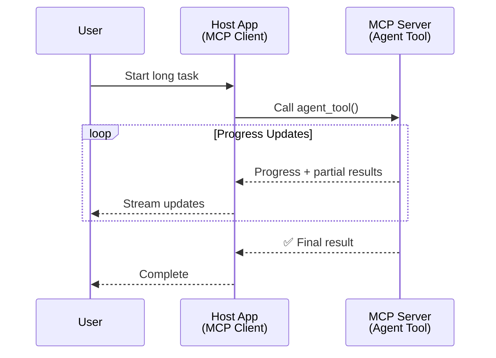
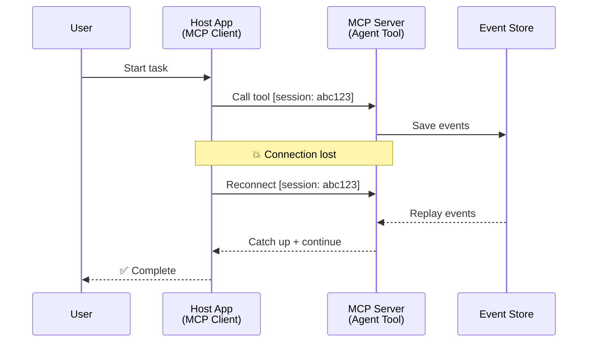
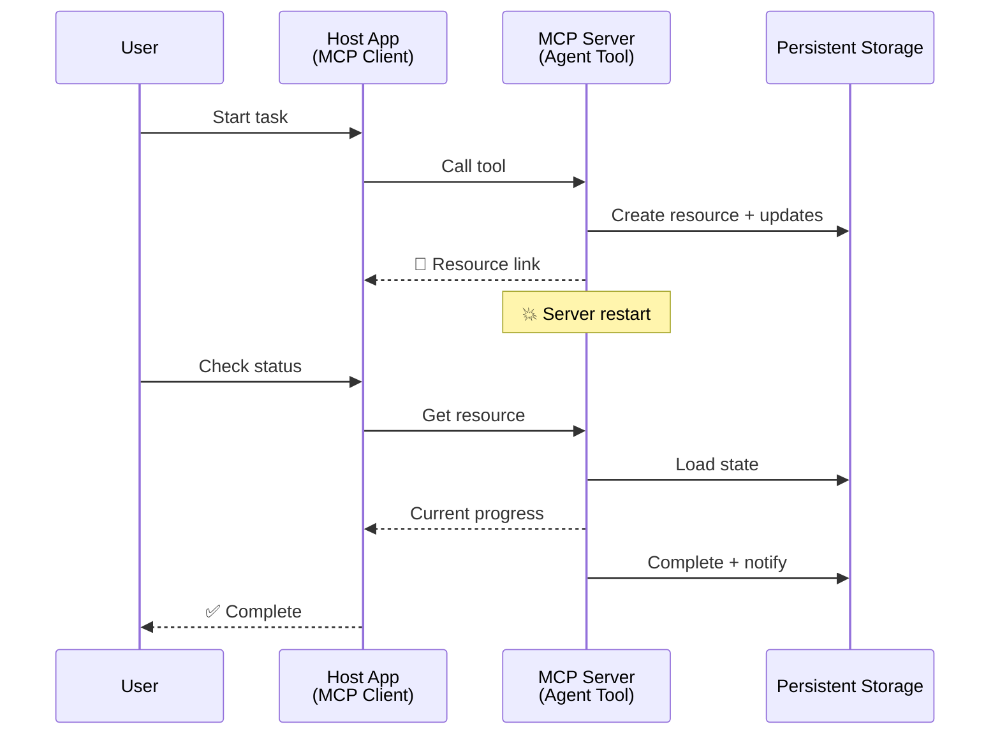
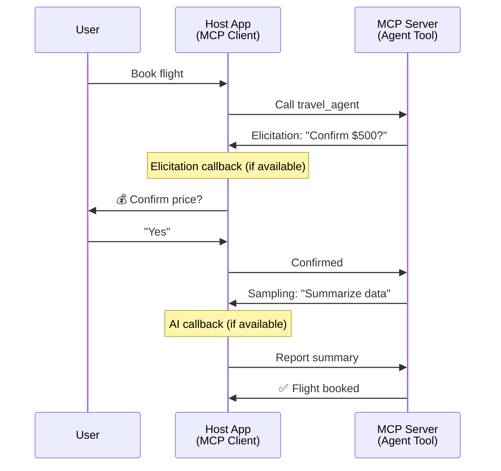

<!--
CO_OP_TRANSLATOR_METADATA:
{
  "original_hash": "5cc6836626047aa055e8960c8484a7d0",
  "translation_date": "2025-08-29T10:56:33+00:00",
  "source_file": "11-agentic-protocols/code_samples/mcp-agents/README.md",
  "language_code": "pa"
}
-->
# MCP ਨਾਲ ਏਜੰਟ-ਤੋਂ-ਏਜੰਟ ਸੰਚਾਰ ਪ੍ਰਣਾਲੀਆਂ ਬਣਾਉਣਾ

> TL;DR - ਕੀ ਤੁਸੀਂ MCP 'ਤੇ Agent2Agent ਸੰਚਾਰ ਬਣਾਉਣ ਲਈ ਯੋਗ ਹੋ? ਹਾਂ!

MCP ਆਪਣੇ ਮੂਲ ਉਦੇਸ਼ "LLMs ਨੂੰ ਸੰਦਰਭ ਪ੍ਰਦਾਨ ਕਰਨਾ" ਤੋਂ ਕਾਫ਼ੀ ਅੱਗੇ ਵਧ ਚੁੱਕਾ ਹੈ। ਹਾਲ ਹੀ ਵਿੱਚ ਕੀਤੀਆਂ ਵਧੀਆਂ, ਜਿਵੇਂ ਕਿ [resumable streams](https://modelcontextprotocol.io/docs/concepts/transports#resumability-and-redelivery), [elicitation](https://modelcontextprotocol.io/specification/2025-06-18/client/elicitation), [sampling](https://modelcontextprotocol.io/specification/2025-06-18/client/sampling), ਅਤੇ ਸੂਚਨਾਵਾਂ ([progress](https://modelcontextprotocol.io/specification/2025-06-18/basic/utilities/progress) ਅਤੇ [resources](https://modelcontextprotocol.io/specification/2025-06-18/schema#resourceupdatednotification)), MCP ਹੁਣ ਜਟਿਲ ਏਜੰਟ-ਤੋਂ-ਏਜੰਟ ਸੰਚਾਰ ਪ੍ਰਣਾਲੀਆਂ ਬਣਾਉਣ ਲਈ ਇੱਕ ਮਜ਼ਬੂਤ ਬੁਨਿਆਦ ਪ੍ਰਦਾਨ ਕਰਦਾ ਹੈ।

## ਏਜੰਟ/ਟੂਲ ਬਾਰੇ ਗਲਤਫਹਿਮੀ

ਜਿਵੇਂ ਕਿ ਹੋਰ ਵਿਕਾਸਕਾਰ agentic ਵਿਹਾਰ ਵਾਲੇ ਟੂਲਾਂ ਦੀ ਖੋਜ ਕਰਦੇ ਹਨ (ਲੰਬੇ ਸਮੇਂ ਲਈ ਚਲਦੇ ਹਨ, ਮੱਧ-ਕ੍ਰਿਆਵਿਧੀ ਦੌਰਾਨ ਵਾਧੂ ਇਨਪੁਟ ਦੀ ਲੋੜ ਹੋ ਸਕਦੀ ਹੈ, ਆਦਿ), ਇੱਕ ਆਮ ਗਲਤਫਹਿਮੀ ਇਹ ਹੈ ਕਿ MCP ਅਣੁਕੂਲ ਨਹੀਂ ਹੈ, ਮੁੱਖ ਤੌਰ 'ਤੇ ਕਿਉਂਕਿ ਇਸਦੇ ਟੂਲ primitive ਦੇ ਸ਼ੁਰੂਆਤੀ ਉਦਾਹਰਨ ਸਧਾਰਨ request-response ਪੈਟਰਨ 'ਤੇ ਕੇਂਦ੍ਰਿਤ ਸਨ।

ਇਹ ਧਾਰਨਾ ਹੁਣ ਪੁਰਾਣੀ ਹੋ ਚੁੱਕੀ ਹੈ। MCP ਵਿਸ਼ੇਸ਼ਤਾ ਨੂੰ ਪਿਛਲੇ ਕੁਝ ਮਹੀਨਿਆਂ ਵਿੱਚ ਕਾਫ਼ੀ ਵਧਾਇਆ ਗਿਆ ਹੈ, ਜਿਸ ਨਾਲ ਲੰਬੇ ਸਮੇਂ ਚੱਲਣ ਵਾਲੇ agentic ਵਿਹਾਰ ਬਣਾਉਣ ਲਈ ਖਾਲੀਪਣ ਨੂੰ ਪੂਰਾ ਕੀਤਾ ਗਿਆ ਹੈ:

- **Streaming & Partial Results**: ਕ੍ਰਿਆਵਿਧੀ ਦੌਰਾਨ ਰੀਅਲ-ਟਾਈਮ ਪ੍ਰਗਤੀ ਅੱਪਡੇਟ
- **Resumability**: ਕਲਾਇੰਟ ਡਿਸਕਨੈਕਸ਼ਨ ਤੋਂ ਬਾਅਦ ਮੁੜ ਜੁੜ ਸਕਦੇ ਹਨ ਅਤੇ ਜਿੱਥੇ ਛੱਡਿਆ ਸੀ ਉਥੇ ਤੋਂ ਜਾਰੀ ਰੱਖ ਸਕਦੇ ਹਨ
- **Durability**: ਨਤੀਜੇ ਸਰਵਰ ਰੀਸਟਾਰਟ ਤੋਂ ਬਾਅਦ ਵੀ ਬਚੇ ਰਹਿੰਦੇ ਹਨ (ਜਿਵੇਂ ਕਿ resource links ਰਾਹੀਂ)
- **Multi-turn**: ਕ੍ਰਿਆਵਿਧੀ ਦੌਰਾਨ ਇਨਪੁਟ ਲਈ ਇੰਟਰੈਕਟਿਵ ਸੰਚਾਰ

ਇਹ ਵਿਸ਼ੇਸ਼ਤਾਵਾਂ ਨੂੰ ਜਟਿਲ agentic ਅਤੇ multi-agent ਐਪਲੀਕੇਸ਼ਨਾਂ ਨੂੰ ਯੋਗ ਬਣਾਉਣ ਲਈ ਜੋੜਿਆ ਜਾ ਸਕਦਾ ਹੈ, ਸਾਰੇ MCP ਪ੍ਰੋਟੋਕੋਲ 'ਤੇ ਤੈਨਾਤ ਕੀਤੇ ਗਏ।

ਸੰਬੰਧਿਤ ਸੰਦਰਭ ਲਈ, ਅਸੀਂ ਇੱਕ agent ਨੂੰ "ਟੂਲ" ਵਜੋਂ ਦਰਸਾਉਂਦੇ ਹਾਂ ਜੋ MCP ਸਰਵਰ 'ਤੇ ਉਪਲਬਧ ਹੈ। ਇਸਦਾ ਮਤਲਬ ਹੈ ਕਿ ਇੱਕ ਹੋਸਟ ਐਪਲੀਕੇਸ਼ਨ ਮੌਜੂਦ ਹੈ ਜੋ ਇੱਕ MCP ਕਲਾਇੰਟ ਨੂੰ ਲਾਗੂ ਕਰਦਾ ਹੈ ਜੋ MCP ਸਰਵਰ ਨਾਲ ਸੈਸ਼ਨ ਸਥਾਪਿਤ ਕਰਦਾ ਹੈ ਅਤੇ agent ਨੂੰ ਕਾਲ ਕਰ ਸਕਦਾ ਹੈ।

## ਕੀ MCP ਟੂਲ ਨੂੰ "Agentic" ਬਣਾਉਂਦਾ ਹੈ?

ਲਾਗੂ ਕਰਨ ਤੋਂ ਪਹਿਲਾਂ, ਆਓ ਇਹ ਸਥਾਪਿਤ ਕਰੀਏ ਕਿ ਲੰਬੇ ਸਮੇਂ ਚੱਲਣ ਵਾਲੇ agents ਨੂੰ ਸਹਾਇਤਾ ਕਰਨ ਲਈ ਕਿਹੜੀਆਂ infrastructure ਯੋਗਤਾਵਾਂ ਦੀ ਲੋੜ ਹੈ।

> ਅਸੀਂ ਇੱਕ agent ਨੂੰ ਇੱਕ ਐਨਟੀਟੀ ਵਜੋਂ ਪਰਿਭਾਸ਼ਿਤ ਕਰਾਂਗੇ ਜੋ ਲੰਬੇ ਸਮੇਂ ਤੱਕ ਸਵੈ-ਚਾਲਤ ਤਰੀਕੇ ਨਾਲ ਕੰਮ ਕਰ ਸਕਦੀ ਹੈ, ਜਟਿਲ ਕੰਮਾਂ ਨੂੰ ਸੰਭਾਲ ਸਕਦੀ ਹੈ ਜਿਨ੍ਹਾਂ ਨੂੰ ਕਈ ਸੰਚਾਰ ਜਾਂ ਰੀਅਲ-ਟਾਈਮ ਫੀਡਬੈਕ ਦੇ ਆਧਾਰ 'ਤੇ ਸਮਾਧਾਨ ਦੀ ਲੋੜ ਹੋ ਸਕਦੀ ਹੈ।

### 1. Streaming & Partial Results

ਪ੍ਰੰਪਰਾਗਤ request-response ਪੈਟਰਨ ਲੰਬੇ ਸਮੇਂ ਚੱਲਣ ਵਾਲੇ ਕੰਮਾਂ ਲਈ ਕੰਮ ਨਹੀਂ ਕਰਦੇ। Agents ਨੂੰ ਇਹ ਪ੍ਰਦਾਨ ਕਰਨ ਦੀ ਲੋੜ ਹੈ:

- ਰੀਅਲ-ਟਾਈਮ ਪ੍ਰਗਤੀ ਅੱਪਡੇਟ
- ਅੰਤਰਿਮ ਨਤੀਜੇ

**MCP ਸਹਾਇਤਾ**: Resource update notifications streaming partial results ਨੂੰ ਯੋਗ ਬਣਾਉਂਦੇ ਹਨ, ਹਾਲਾਂਕਿ ਇਹ JSON-RPC ਦੇ 1:1 request/response ਮਾਡਲ ਨਾਲ ਟਕਰਾਅ ਤੋਂ ਬਚਣ ਲਈ ਸਾਵਧਾਨੀ ਨਾਲ ਡਿਜ਼ਾਈਨ ਕਰਨ ਦੀ ਲੋੜ ਹੈ।

| ਵਿਸ਼ੇਸ਼ਤਾ                    | Use Case                                                                                                                                                                       | MCP ਸਹਾਇਤਾ                                                                                |
| -------------------------- | ------------------------------------------------------------------------------------------------------------------------------------------------------------------------------ | ------------------------------------------------------------------------------------------ |
| ਰੀਅਲ-ਟਾਈਮ ਪ੍ਰਗਤੀ ਅੱਪਡੇਟ | ਯੂਜ਼ਰ ਇੱਕ codebase migration ਟਾਸਕ ਦੀ ਬੇਨਤੀ ਕਰਦਾ ਹੈ। Agent ਪ੍ਰਗਤੀ stream ਕਰਦਾ ਹੈ: "10% - Dependencies ਦਾ ਵਿਸ਼ਲੇਸ਼ਣ ਕਰ ਰਿਹਾ ਹੈ... 25% - TypeScript ਫਾਈਲਾਂ ਨੂੰ ਰੂਪਾਂਤਰਿਤ ਕਰ ਰਿਹਾ ਹੈ... 50% - Imports ਨੂੰ ਅਪਡੇਟ ਕਰ ਰਿਹਾ ਹੈ..."          | ✅ Progress notifications                                                                  |
| ਅੰਤਰਿਮ ਨਤੀਜੇ            | "Generate a book" ਟਾਸਕ ਅੰਤਰਿਮ ਨਤੀਜੇ stream ਕਰਦਾ ਹੈ, ਜਿਵੇਂ ਕਿ 1) ਕਹਾਣੀ ਦਾ ਰੂਪ-ਰੇਖਾ, 2) ਅਧਿਆਇ ਸੂਚੀ, 3) ਹਰ ਅਧਿਆਇ ਜਿਵੇਂ ਪੂਰਾ ਹੁੰਦਾ ਹੈ। Host ਕਿਸੇ ਵੀ ਮੰਚ 'ਤੇ ਜਾਂਚ, ਰੱਦ, ਜਾਂ redirect ਕਰ ਸਕਦਾ ਹੈ। | ✅ Notifications ਨੂੰ "extended" ਕੀਤਾ ਜਾ ਸਕਦਾ ਹੈ ਅੰਤਰਿਮ ਨਤੀਜੇ ਸ਼ਾਮਲ ਕਰਨ ਲਈ PR 383, 776 ਦੇ ਪ੍ਰਸਤਾਵਾਂ ਦੇਖੋ |

<div align="center" style="font-style: italic; font-size: 0.95em; margin-bottom: 0.5em;">
<strong>ਚਿੱਤਰ 1:</strong> ਇਹ ਡਾਇਗ੍ਰਾਮ ਦਰਸਾਉਂਦਾ ਹੈ ਕਿ ਕਿਵੇਂ ਇੱਕ MCP agent ਲੰਬੇ ਸਮੇਂ ਚੱਲਣ ਵਾਲੇ ਟਾਸਕ ਦੌਰਾਨ host ਐਪਲੀਕੇਸ਼ਨ ਨੂੰ ਰੀਅਲ-ਟਾਈਮ ਪ੍ਰਗਤੀ ਅੱਪਡੇਟ ਅਤੇ ਅੰਤਰਿਮ ਨਤੀਜੇ stream ਕਰਦਾ ਹੈ, ਯੂਜ਼ਰ ਨੂੰ ਕ੍ਰਿਆਵਿਧੀ ਨੂੰ ਰੀਅਲ-ਟਾਈਮ ਵਿੱਚ ਮਾਨਟਰ ਕਰਨ ਦੀ ਯੋਗਤਾ ਦਿੰਦਾ ਹੈ।
</div>



### 2. Resumability

Agents ਨੂੰ ਨੈਟਵਰਕ ਰੁਕਾਵਟਾਂ ਨੂੰ ਸਹਿਣਸ਼ੀਲ ਤਰੀਕੇ ਨਾਲ ਸੰਭਾਲਣ ਦੀ ਲੋੜ ਹੈ:

- ਡਿਸਕਨੈਕਸ਼ਨ ਤੋਂ ਬਾਅਦ ਮੁੜ ਜੁੜਨਾ
- ਜਿੱਥੇ ਛੱਡਿਆ ਸੀ ਉਥੇ ਤੋਂ ਜਾਰੀ ਰੱਖਣਾ (message redelivery)

**MCP ਸਹਾਇਤਾ**: MCP StreamableHTTP transport ਅੱਜ session resumption ਅਤੇ message redelivery ਨੂੰ session IDs ਅਤੇ last event IDs ਨਾਲ ਸਹਾਇਤਾ ਕਰਦਾ ਹੈ। ਇੱਥੇ ਮਹੱਤਵਪੂਰਨ ਗੱਲ ਇਹ ਹੈ ਕਿ ਸਰਵਰ ਨੂੰ ਇੱਕ EventStore ਲਾਗੂ ਕਰਨਾ ਚਾਹੀਦਾ ਹੈ ਜੋ client reconnection 'ਤੇ event replays ਯੋਗ ਬਣਾਉਂਦਾ ਹੈ।  
ਇੱਥੇ ਇੱਕ community proposal (PR #975) ਹੈ ਜੋ transport-agnostic resumable streams ਦੀ ਖੋਜ ਕਰਦਾ ਹੈ।

| ਵਿਸ਼ੇਸ਼ਤਾ      | Use Case                                                                                                                                                   | MCP ਸਹਾਇਤਾ                                                                |
| ------------ | ---------------------------------------------------------------------------------------------------------------------------------------------------------- | -------------------------------------------------------------------------- |
| Resumability | Client ਲੰਬੇ ਸਮੇਂ ਚੱਲਣ ਵਾਲੇ ਟਾਸਕ ਦੌਰਾਨ ਡਿਸਕਨੈਕਟ ਕਰਦਾ ਹੈ। ਮੁੜ ਜੁੜਨ 'ਤੇ, session missed events replay ਕਰਦਾ ਹੈ, ਜਿੱਥੇ ਛੱਡਿਆ ਸੀ ਉਥੇ ਤੋਂ ਬਿਨਾਂ ਕਿਸੇ ਰੁਕਾਵਟ ਦੇ ਜਾਰੀ ਰੱਖਦਾ ਹੈ। | ✅ StreamableHTTP transport session IDs, event replay, ਅਤੇ EventStore ਨਾਲ |

<div align="center" style="font-style: italic; font-size: 0.95em; margin-bottom: 0.5em;">
<strong>ਚਿੱਤਰ 2:</strong> ਇਹ ਡਾਇਗ੍ਰਾਮ ਦਰਸਾਉਂਦਾ ਹੈ ਕਿ ਕਿਵੇਂ MCP ਦਾ StreamableHTTP transport ਅਤੇ event store seamless session resumption ਯੋਗ ਬਣਾਉਂਦਾ ਹੈ: ਜੇ client ਡਿਸਕਨੈਕਟ ਕਰਦਾ ਹੈ, ਤਾਂ ਇਹ missed events replay ਕਰਕੇ ਮੁੜ ਜੁੜ ਸਕਦਾ ਹੈ, ਟਾਸਕ ਨੂੰ ਬਿਨਾਂ ਕਿਸੇ ਪ੍ਰਗਤੀ ਦੇ ਨੁਕਸਾਨ ਤੋਂ ਜਾਰੀ ਰੱਖਦਾ ਹੈ।
</div>



### 3. Durability

ਲੰਬੇ ਸਮੇਂ ਚੱਲਣ ਵਾਲੇ agents ਨੂੰ persistent state ਦੀ ਲੋੜ ਹੁੰਦੀ ਹੈ:

- ਨਤੀਜੇ ਸਰਵਰ ਰੀਸਟਾਰਟ ਤੋਂ ਬਾਅਦ ਵੀ ਬਚੇ ਰਹਿੰਦੇ ਹਨ
- ਸਥਿਤੀ ਨੂੰ out-of-band ਰਾਹੀਂ ਪ੍ਰਾਪਤ ਕੀਤਾ ਜਾ ਸਕਦਾ ਹੈ
- ਸੈਸ਼ਨ ਦੇ ਪਾਰ ਪ੍ਰਗਤੀ ਟ੍ਰੈਕਿੰਗ

**MCP ਸਹਾਇਤਾ**: MCP ਹੁਣ tool calls ਲਈ Resource link return type ਨੂੰ ਸਹਾਇਤਾ ਕਰਦਾ ਹੈ। ਅੱਜ, ਇੱਕ ਸੰਭਾਵਿਤ ਪੈਟਰਨ ਇਹ ਹੈ ਕਿ ਇੱਕ tool ਨੂੰ ਡਿਜ਼ਾਈਨ ਕੀਤਾ ਜਾਵੇ ਜੋ ਇੱਕ resource ਬਣਾਉਂਦਾ ਹੈ ਅਤੇ ਤੁਰੰਤ ਇੱਕ resource link ਵਾਪਸ ਕਰਦਾ ਹੈ। Tool ਪਿਛਲੇ ਪਾਸੇ ਟਾਸਕ ਨੂੰ ਸੰਬੋਧਨ ਕਰ ਸਕਦਾ ਹੈ ਅਤੇ resource ਨੂੰ ਅਪਡੇਟ ਕਰ ਸਕਦਾ ਹੈ। ਇਸਦੇ ਬਦਲੇ ਵਿੱਚ, client resource ਦੀ ਸਥਿਤੀ ਨੂੰ poll ਕਰਨ ਲਈ ਚੁਣ ਸਕਦਾ ਹੈ ਤਾਂ ਜੋ ਅੰਤਰਿਮ ਜਾਂ ਪੂਰੇ ਨਤੀਜੇ ਪ੍ਰਾਪਤ ਕੀਤੇ ਜਾ ਸਕਣ (ਜੋ resource updates ਸਰਵਰ ਪ੍ਰਦਾਨ ਕਰਦਾ ਹੈ) ਜਾਂ resource ਲਈ update notifications ਨੂੰ subscribe ਕਰ ਸਕਦਾ ਹੈ।

ਇੱਥੇ ਇੱਕ ਸੀਮਿਤਤਾ ਹੈ ਕਿ resources ਨੂੰ poll ਕਰਨਾ ਜਾਂ updates ਲਈ subscribe ਕਰਨਾ resources ਨੂੰ ਖਪਤ ਕਰ ਸਕਦਾ ਹੈ ਜਿਸਦਾ implications at scale 'ਤੇ ਪ੍ਰਭਾਵ ਪੈਂਦਾ ਹੈ। ਇੱਥੇ ਇੱਕ community proposal (ਜਿਸ ਵਿੱਚ #992 ਸ਼ਾਮਲ ਹੈ) ਹੈ ਜੋ webhooks ਜਾਂ triggers ਸ਼ਾਮਲ ਕਰਨ ਦੀ ਸੰਭਾਵਨਾ ਦੀ ਖੋਜ ਕਰਦਾ ਹੈ ਜੋ updates ਦੀ ਸੂਚਨਾ ਦੇਣ ਲਈ server client/host ਐਪਲੀਕੇਸ਼ਨ ਨੂੰ ਕਾਲ ਕਰ ਸਕਦਾ ਹੈ।

| ਵਿਸ਼ੇਸ਼ਤਾ    | Use Case                                                                                                                                        | MCP ਸਹਾਇਤਾ                                                        |
| ---------- | ----------------------------------------------------------------------------------------------------------------------------------------------- | ------------------------------------------------------------------ |
| Durability | Server data migration ਟਾਸਕ ਦੌਰਾਨ crash ਕਰਦਾ ਹੈ। ਨਤੀਜੇ ਅਤੇ ਪ੍ਰਗਤੀ ਰੀਸਟਾਰਟ ਤੋਂ ਬਾਅਦ ਬਚੇ ਰਹਿੰਦੇ ਹਨ, client ਸਥਿਤੀ ਦੀ ਜਾਂਚ ਕਰ ਸਕਦਾ ਹੈ ਅਤੇ persistent resource ਤੋਂ ਜਾਰੀ ਰੱਖ ਸਕਦਾ ਹੈ। | ✅ Resource links persistent storage ਅਤੇ status notifications ਨਾਲ |

ਅੱਜ, ਇੱਕ ਆਮ ਪੈਟਰਨ ਇਹ ਹੈ ਕਿ ਇੱਕ tool ਨੂੰ ਡਿਜ਼ਾਈਨ ਕੀਤਾ ਜਾਵੇ ਜੋ ਇੱਕ resource ਬਣਾਉਂਦਾ ਹੈ ਅਤੇ ਤੁਰੰਤ ਇੱਕ resource link ਵਾਪਸ ਕਰਦਾ ਹੈ। Tool ਪਿਛਲੇ ਪਾਸੇ ਟਾਸਕ ਨੂੰ ਸੰਬੋਧਨ ਕਰ ਸਕਦਾ ਹੈ, resource notifications ਜਾਰੀ ਕਰ ਸਕਦਾ ਹੈ ਜੋ progress updates ਵਜੋਂ ਕੰਮ ਕਰਦੇ ਹਨ ਜਾਂ ਅੰਤਰਿਮ ਨਤੀਜੇ ਸ਼ਾਮਲ ਕਰਦੇ ਹਨ, ਅਤੇ resource ਵਿੱਚ ਸਮੱਗਰੀ ਨੂੰ ਜ਼ਰੂਰਤ ਅਨੁਸਾਰ ਅਪਡੇਟ ਕਰ ਸਕਦਾ ਹੈ।

<div align="center" style="font-style: italic; font-size: 0.95em; margin-bottom: 0.5em;">
<strong>ਚਿੱਤਰ 3:</strong> ਇਹ ਡਾਇਗ੍ਰਾਮ ਦਰਸਾਉਂਦਾ ਹੈ ਕਿ ਕਿਵੇਂ MCP agents persistent resources ਅਤੇ status notifications ਦੀ ਵਰਤੋਂ ਕਰਦੇ ਹਨ ਇਹ ਯਕੀਨੀ ਬਣਾਉਣ ਲਈ ਕਿ ਲੰਬੇ ਸਮੇਂ ਚੱਲਣ ਵਾਲੇ ਟਾਸਕ ਸਰਵਰ ਰੀਸਟਾਰਟ ਤੋਂ ਬਾਅਦ ਬਚੇ ਰਹਿੰਦੇ ਹਨ, clients ਨੂੰ progress ਦੀ ਜਾਂਚ ਕਰਨ ਅਤੇ ਨਤੀਜੇ ਪ੍ਰਾਪਤ ਕਰਨ ਦੀ ਯੋਗਤਾ ਦਿੰਦੇ ਹਨ।
</div>



### 4. Multi-Turn Interactions

Agents ਨੂੰ ਕ੍ਰਿਆਵਿਧੀ ਦੌਰਾਨ ਵਾਧੂ ਇਨਪੁਟ ਦੀ ਲੋੜ ਹੋ ਸਕਦੀ ਹੈ:

- Human clarification ਜਾਂ approval
- AI ਸਹਾਇਤਾ ਜਟਿਲ ਫੈਸਲਿਆਂ ਲਈ
- Dynamic parameter adjustment

**MCP ਸਹਾਇਤਾ**: Sampling (AI input ਲਈ) ਅਤੇ elicitation (human input ਲਈ) ਰਾਹੀਂ ਪੂਰੀ ਤਰ੍ਹਾਂ ਸਹਾਇਤਾ ਕੀਤੀ ਗਈ।

| ਵਿਸ਼ੇਸ਼ਤਾ                 | Use Case                                                                                                                                     | MCP ਸਹਾਇਤਾ                                           |
| ----------------------- | -------------------------------------------------------------------------------------------------------------------------------------------- | ----------------------------------------------------- |
| Multi-Turn Interactions | Travel booking agent ਯੂਜ਼ਰ ਤੋਂ price confirmation ਦੀ ਬੇਨਤੀ ਕਰਦਾ ਹੈ, ਫਿਰ booking transaction ਪੂਰਾ ਕਰਨ ਤੋਂ ਪਹਿਲਾਂ travel data ਨੂੰ summarize ਕਰਨ ਲਈ AI ਨੂੰ ਬੇਨਤੀ ਕਰਦਾ ਹੈ। | ✅ Elicitation human input ਲਈ, sampling AI input ਲਈ |

<div align="center" style="font-style: italic; font-size: 0.95em; margin-bottom: 0.5em;">
<strong>ਚਿੱਤਰ 4:</strong> ਇਹ ਡਾਇਗ੍ਰਾਮ ਦਰਸਾਉਂਦਾ ਹੈ ਕਿ ਕਿਵੇਂ MCP agents ਇੰਟਰੈਕਟਿਵ ਤਰੀਕੇ ਨਾਲ human input ਨੂੰ elicitation ਰਾਹੀਂ ਜਾਂ AI ਸਹਾਇਤਾ ਨੂੰ sampling ਰਾਹੀਂ ਕ੍ਰਿਆਵਿਧੀ ਦੌਰਾਨ ਬੇਨਤੀ ਕਰ ਸਕਦੇ ਹਨ, ਜਟਿਲ, multi-turn workflows ਨੂੰ ਯੋਗ ਬਣਾਉਂਦੇ ਹਨ ਜਿਵੇਂ ਕਿ confirmations ਅਤੇ dynamic decision-making।
</div>



## MCP 'ਤੇ ਲੰਬੇ ਸਮੇਂ ਚੱਲਣ ਵਾਲੇ Agents ਨੂੰ ਲਾਗੂ ਕਰਨਾ - ਕੋਡ ਝਲਕ

ਇਸ ਲੇਖ ਦੇ ਹਿੱਸੇ ਵਜੋਂ, ਅਸੀਂ ਇੱਕ [code repository](https://github.com/victordibia/ai-tutorials/tree/main/MCP%20Agents) ਪ੍ਰਦਾਨ ਕਰਦੇ ਹਾਂ ਜੋ MCP Python SDK ਨਾਲ StreamableHTTP transport ਦੀ ਵਰਤੋਂ ਕਰਕੇ session resumption ਅਤੇ message redelivery ਲਈ ਲੰਬੇ ਸਮੇਂ ਚੱਲਣ ਵਾਲੇ agents ਦੀ ਪੂਰੀ ਲਾਗੂ ਕਰਨ ਦੀ ਵਰਣਨਾ ਕਰਦਾ ਹੈ। ਲਾਗੂ ਕਰਨ ਵਿੱਚ ਦਰਸਾਇਆ ਗਿਆ ਹੈ ਕਿ ਕਿਵੇਂ MCP ਯੋਗਤਾਵਾਂ ਨੂੰ agent-like ਵਿਹਾਰ ਯੋਗ ਬਣਾਉਣ ਲਈ ਜੋੜਿਆ ਜਾ ਸਕਦਾ ਹੈ।

ਖਾਸ ਤੌਰ 'ਤੇ, ਅਸੀਂ ਇੱਕ ਸਰਵਰ ਨੂੰ ਲਾਗੂ ਕਰਦੇ ਹਾਂ ਜਿਸ ਵਿੱਚ ਦੋ ਮੁੱਖ agent tools ਹਨ:

- **Travel Agent** - elicitation ਰਾਹੀਂ price confirmation ਦੇ ਨਾਲ travel booking ਸੇਵਾ ਨੂੰ simulate ਕਰਦਾ ਹੈ
- **Research Agent** - sampling ਰਾਹੀਂ AI-assisted summaries ਦੇ ਨਾਲ research tasks ਕਰਦਾ ਹੈ

ਦੋਵੇਂ agents ਰੀਅਲ-ਟਾਈਮ progress updates, ਇੰਟਰੈਕਟਿਵ confirmations, ਅਤੇ ਪੂਰੀ session resumption ਯੋਗਤਾਵਾਂ ਨੂੰ ਦਰਸਾਉਂਦੇ ਹਨ।

### ਮੁੱਖ ਲਾਗੂ ਕਰਨ ਦੇ ਸੰਕਲਪ

ਹੇਠਾਂ ਦਿੱਤੇ ਸੈਕਸ਼ਨ ਹਰ ਯੋਗਤਾ ਲਈ server-side agent ਲਾਗੂ ਕਰਨ ਅਤੇ client-side host handling ਨੂੰ ਦਰਸਾਉਂਦੇ ਹਨ:

#### Streaming & Progress Updates - ਰੀਅਲ-ਟਾਈਮ ਟਾਸਕ ਸਥਿਤੀ

Streaming agents ਨੂੰ ਲੰਬੇ ਸਮੇਂ ਚੱਲਣ ਵਾਲੇ ਟਾਸਕ ਦੌਰਾਨ ਰੀਅਲ-ਟਾਈਮ progress updates ਪ੍ਰਦਾਨ ਕਰਨ ਦੀ ਯੋਗਤਾ ਦਿੰਦਾ ਹੈ, ਯੂਜ਼ਰ ਨੂੰ ਟਾਸਕ ਸਥਿਤੀ ਅਤੇ ਅੰਤਰਿਮ ਨਤੀਜਿਆਂ ਬਾਰੇ ਜਾਣਕਾਰੀ ਦਿੰਦਾ ਹੈ।

**Server Implementation (agent progress notifications ਭੇਜਦਾ ਹੈ):**

```python
# From server/server.py - Travel agent sending progress updates
for i, step in enumerate(steps):
    await ctx.session.send_progress_notification(
        progress_token=ctx.request_id,
        progress=i * 25,
        total=100,
        message=step,
        related_request_id=str(ctx.request_id)
    )
    await anyio.sleep(2)  # Simulate work

# Alternative: Log messages for detailed step-by-step updates
await ctx.session.send_log_message(
    level="info",
    data=f"Processing step {current_step}/{steps} ({progress_percent}%)",
    logger="long_running_agent",
    related_request_id=ctx.request_id,
)
```

**Client Implementation (host progress updates ਪ੍ਰਾਪਤ ਕਰਦਾ ਹੈ):**

```python
# From client/client.py - Client handling real-time notifications
async def message_handler(message) -> None:
    if isinstance(message, types.ServerNotification):
        if isinstance(message.root, types.LoggingMessageNotification):
            console.print(f"📡 [dim]{message.root.params.data}[/dim]")
        elif isinstance(message.root, types.ProgressNotification):
            progress = message.root.params
            console.print(f"🔄 [yellow]{progress.message} ({progress.progress}/{progress.total})[/yellow]")

# Register message handler when creating session
async with ClientSession(
    read_stream, write_stream,
    message_handler=message_handler
) as session:
```

#### Elicitation - ਯੂਜ਼ਰ ਇਨਪੁਟ ਦੀ ਬੇਨਤੀ ਕਰਨਾ

Elicitation agents ਨੂੰ ਲੰਬੇ ਸਮੇਂ ਚੱਲਣ ਵਾਲੇ ਟਾਸਕ ਦੌਰਾਨ ਯੂਜ਼ਰ ਇਨਪੁਟ ਦੀ ਬੇਨਤੀ ਕਰਨ ਦੀ ਯੋਗਤਾ ਦਿੰਦਾ ਹੈ। ਇਹ confirmations, clarifications, ਜਾਂ approvals ਲਈ ਜ਼ਰੂਰੀ ਹੈ।

**Server Implementation (agent confirmation ਦੀ ਬੇਨਤੀ ਕਰਦਾ ਹੈ):**

```python
# From server/server.py - Travel agent requesting price confirmation
elicit_result = await ctx.session.elicit(
    message=f"Please confirm the estimated price of $1200 for your trip to {destination}",
    requestedSchema=PriceConfirmationSchema.model_json_schema(),
    related_request_id=ctx.request_id,
)

if elicit_result and elicit_result.action == "accept":
    # Continue with booking
    logger.info(f"User confirmed price: {elicit_result.content}")
elif elicit_result and elicit_result.action == "decline":
    # Cancel the booking
    booking_cancelled = True
```

**Client Implementation (host elicitation callback ਪ੍ਰਦਾਨ ਕਰਦਾ ਹੈ):**

```python
# From client/client.py - Client handling elicitation requests
async def elicitation_callback(context, params):
    console.print(f"💬 Server is asking for confirmation:")
    console.print(f"   {params.message}")

    response = console.input("Do you accept? (y/n): ").strip().lower()

    if response in ['y', 'yes']:
        return types.ElicitResult(
            action="accept",
            content={"confirm": True, "notes": "Confirmed by user"}
        )
    else:
        return types.ElicitResult(
            action="decline",
            content={"confirm": False, "notes": "Declined by user"}
        )

# Register the callback when creating the session
async with ClientSession(
    read_stream, write_stream,
    elicitation_callback=elicitation_callback
) as session:
```

#### Sampling - AI ਸਹਾਇਤਾ ਦੀ ਬੇਨਤੀ ਕਰਨਾ

Sampling agents ਨੂੰ execution ਦੌਰਾਨ ਜਟਿਲ ਫੈਸਲਿਆਂ ਜਾਂ ਸਮੱਗਰੀ ਜਨਰੇਸ਼ਨ ਲਈ LLM ਸਹਾਇਤਾ ਦੀ ਬੇਨਤੀ ਕਰਨ ਦੀ ਯੋਗਤਾ ਦਿੰਦਾ ਹੈ। ਇਹ human-AI workflows ਨੂੰ ਯੋਗ ਬਣਾਉਂਦਾ ਹੈ।

**Server Implementation (agent AI ਸਹਾਇਤਾ ਦੀ ਬੇਨਤੀ ਕਰਦਾ ਹੈ):**

```python
# From server/server.py - Research agent requesting AI summary
sampling_result = await ctx.session.create_message(
    messages=[
        SamplingMessage(
            role="user",
            content=TextContent(type="text", text=f"Please summarize the key findings for research on: {topic}")
        )
    ],
    max_tokens=100,
    related_request_id=ctx.request_id,
)

if sampling_result and sampling_result.content:
    if sampling_result.content.type == "text":
        sampling_summary = sampling_result.content.text
        logger.info(f"Received sampling summary: {sampling_summary}")
```

**Client Implementation (host sampling callback ਪ੍ਰਦਾਨ ਕਰਦਾ ਹੈ):**

```python
# From client/client.py - Client handling sampling requests
async def sampling_callback(context, params):
    message_text = params.messages[0].content.text if params.messages else 'No message'
    console.print(f"🧠 Server requested sampling: {message_text}")

    # In a real application, this could call an LLM API
    # For demo purposes, we provide a mock response
    mock_response = "Based on current research, MCP has evolved significantly..."

    return types.CreateMessageResult(
        role="assistant",
        content=types.TextContent(type="text", text=mock_response),
        model="interactive-client",
        stopReason="endTurn"
    )

# Register the callback when creating the session
async with ClientSession(
    read_stream, write_stream,
    sampling_callback=sampling_callback,
    elicitation_callback=elicitation_callback
) as session:
```

#### Resumability - ਡਿਸਕਨੈਕਸ਼ਨ ਦੇ ਪਾਰ ਸੈਸ਼ਨ continuity

Resumability ਇਹ ਯਕੀਨੀ ਬਣਾਉਂਦਾ ਹੈ ਕਿ ਲੰਬੇ ਸਮੇਂ ਚੱਲਣ ਵਾਲੇ agent ਟਾਸਕ client ਡਿਸਕਨੈਕਸ਼ਨ ਨੂੰ ਸਹਿਣਸ਼ੀਲ ਤਰੀਕੇ ਨਾਲ ਸੰਭਾਲ ਸਕਦੇ ਹਨ ਅਤੇ ਮੁੜ ਜੁੜਨ 'ਤੇ ਬਿਨਾਂ ਕਿਸੇ ਰੁਕਾਵਟ ਦੇ ਜਾਰੀ ਰੱਖ ਸਕਦੇ ਹਨ। ਇਹ event stores ਅਤੇ resumption

---

**ਅਸਵੀਕਰਤੀ**:  
ਇਹ ਦਸਤਾਵੇਜ਼ AI ਅਨੁਵਾਦ ਸੇਵਾ [Co-op Translator](https://github.com/Azure/co-op-translator) ਦੀ ਵਰਤੋਂ ਕਰਕੇ ਅਨੁਵਾਦ ਕੀਤਾ ਗਿਆ ਹੈ। ਜਦੋਂ ਕਿ ਅਸੀਂ ਸਹੀ ਹੋਣ ਦਾ ਯਤਨ ਕਰਦੇ ਹਾਂ, ਕਿਰਪਾ ਕਰਕੇ ਧਿਆਨ ਦਿਓ ਕਿ ਸਵੈਚਾਲਿਤ ਅਨੁਵਾਦਾਂ ਵਿੱਚ ਗਲਤੀਆਂ ਜਾਂ ਅਸੁੱਤੀਆਂ ਹੋ ਸਕਦੀਆਂ ਹਨ। ਇਸ ਦੀ ਮੂਲ ਭਾਸ਼ਾ ਵਿੱਚ ਮੌਜੂਦ ਮੂਲ ਦਸਤਾਵੇਜ਼ ਨੂੰ ਪ੍ਰਮਾਣਿਕ ਸਰੋਤ ਮੰਨਿਆ ਜਾਣਾ ਚਾਹੀਦਾ ਹੈ। ਮਹੱਤਵਪੂਰਨ ਜਾਣਕਾਰੀ ਲਈ, ਪੇਸ਼ੇਵਰ ਮਨੁੱਖੀ ਅਨੁਵਾਦ ਦੀ ਸਿਫਾਰਸ਼ ਕੀਤੀ ਜਾਂਦੀ ਹੈ। ਇਸ ਅਨੁਵਾਦ ਦੀ ਵਰਤੋਂ ਤੋਂ ਪੈਦਾ ਹੋਣ ਵਾਲੇ ਕਿਸੇ ਵੀ ਗਲਤਫਹਿਮੀ ਜਾਂ ਗਲਤ ਵਿਆਖਿਆ ਲਈ ਅਸੀਂ ਜ਼ਿੰਮੇਵਾਰ ਨਹੀਂ ਹਾਂ।  